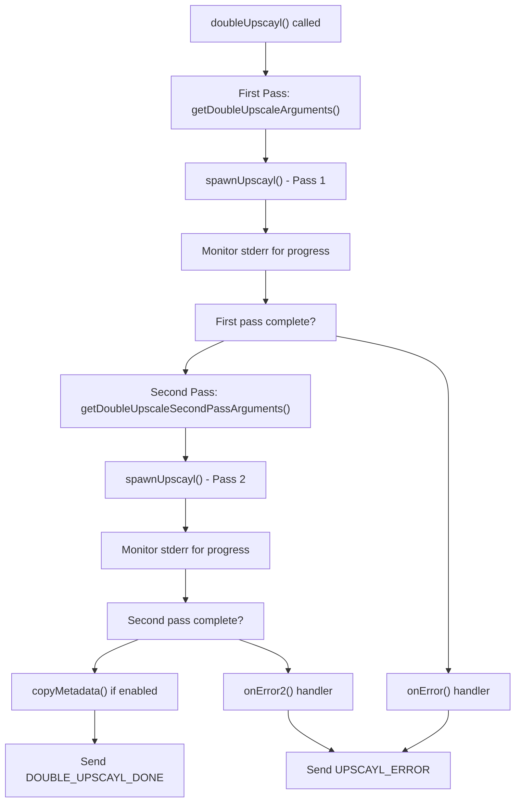
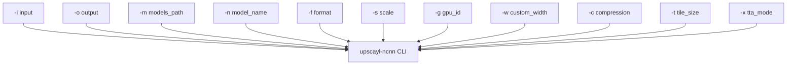
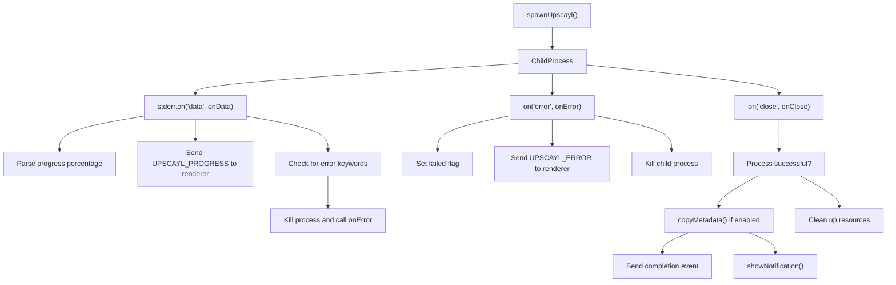
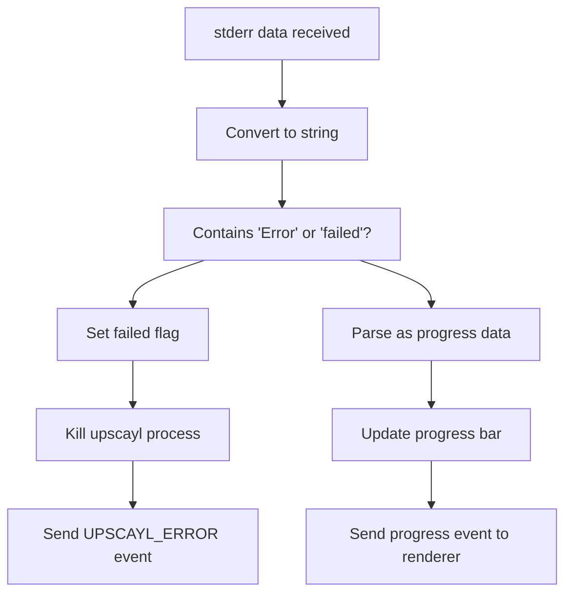

# Image Upscaling Process

Relevant source files

-   [.github/workflows/stale.yml](https://github.com/upscayl/upscayl/blob/1fdbd3e5/.github/workflows/stale.yml)
-   [README.md](https://github.com/upscayl/upscayl/blob/1fdbd3e5/README.md?plain=1)
-   [common/types/types.d.ts](https://github.com/upscayl/upscayl/blob/1fdbd3e5/common/types/types.d.ts)
-   [electron/commands/batch-upscayl.ts](https://github.com/upscayl/upscayl/blob/1fdbd3e5/electron/commands/batch-upscayl.ts)
-   [electron/commands/double-upscayl.ts](https://github.com/upscayl/upscayl/blob/1fdbd3e5/electron/commands/double-upscayl.ts)
-   [electron/commands/image-upscayl.ts](https://github.com/upscayl/upscayl/blob/1fdbd3e5/electron/commands/image-upscayl.ts)
-   [electron/utils/get-arguments.ts](https://github.com/upscayl/upscayl/blob/1fdbd3e5/electron/utils/get-arguments.ts)
-   [electron/utils/show-notification.ts](https://github.com/upscayl/upscayl/blob/1fdbd3e5/electron/utils/show-notification.ts)
-   [upscayl.mp4](https://github.com/upscayl/upscayl/blob/1fdbd3e5/upscayl.mp4)

This document covers the core image upscaling functionality in Upscayl, detailing how images are processed from user input through AI enhancement to final output. This includes the three main upscaling modes (single, batch, and double upscaling), the underlying binary execution process, and progress monitoring.

For information about AI model management and selection, see [AI Models](/upscayl/upscayl/3.2-ai-models). For details about the platform-specific upscayl-ncnn binaries that perform the actual processing, see [Platform-Specific Binaries](/upscayl/upscayl/3.3-platform-specific-binaries).

## Overview

Upscayl's image upscaling process operates through a command-and-control architecture where the Electron main process orchestrates external `upscayl-ncnn` binary execution. The process involves payload construction, argument generation, process spawning, progress monitoring, and post-processing steps.

### High-Level Upscaling Workflow

> **[Mermaid sequence]**
> *(图表结构无法解析)*

**Sources:** [electron/commands/image-upscayl.ts26-183](https://github.com/upscayl/upscayl/blob/1fdbd3e5/electron/commands/image-upscayl.ts#L26-L183) [electron/commands/batch-upscayl.ts20-156](https://github.com/upscayl/upscayl/blob/1fdbd3e5/electron/commands/batch-upscayl.ts#L20-L156) [electron/commands/double-upscayl.ts27-229](https://github.com/upscayl/upscayl/blob/1fdbd3e5/electron/commands/double-upscayl.ts#L27-L229)

## Upscaling Modes

Upscayl supports three distinct upscaling modes, each handled by dedicated command handlers in the main process.

### Single Image Upscaling

The `imageUpscayl` function handles individual image processing through the `ImageUpscaylPayload` type.

| Parameter | Type | Purpose |
| --- | --- | --- |
| `imagePath` | string | Path to source image |
| `outputPath` | string | Directory for output |
| `scale` | string | Upscaling factor |
| `model` | string | AI model identifier |
| `gpuId` | string | GPU device selection |
| `saveImageAs` | ImageFormat | Output format (png, jpg, webp) |
| `overwrite` | boolean | Replace existing files |
| `compression` | string | Compression level |
| `customWidth` | string | Custom width override |
| `useCustomWidth` | boolean | Enable custom width mode |
| `tileSize` | number | Processing tile size |
| `ttaMode` | boolean | Test-time augmentation |
| `copyMetadata` | boolean | Preserve EXIF data |

The process constructs output filenames using the pattern:

```
{fileName}_upscayl_{scale}x_{model}.{saveImageAs}
```
**Sources:** [electron/commands/image-upscayl.ts26-59](https://github.com/upscayl/upscayl/blob/1fdbd3e5/electron/commands/image-upscayl.ts#L26-L59) [common/types/types.d.ts3-18](https://github.com/upscayl/upscayl/blob/1fdbd3e5/common/types/types.d.ts#L3-L18)

### Batch Upscaling

The `batchUpscayl` function processes entire directories using the `BatchUpscaylPayload` type. It creates a dedicated output subdirectory with the naming pattern:

```
upscayl_{saveImageAs}_{model}_{scale}x
```
The batch processor iterates through all supported image files in the input directory and processes them sequentially through a single `upscayl-ncnn` invocation.

**Sources:** [electron/commands/batch-upscayl.ts20-44](https://github.com/upscayl/upscayl/blob/1fdbd3e5/electron/commands/batch-upscayl.ts#L20-L44) [common/types/types.d.ts39-53](https://github.com/upscayl/upscayl/blob/1fdbd3e5/common/types/types.d.ts#L39-L53)

### Double Upscaling

The `doubleUpscayl` function performs two-pass upscaling using the `DoubleUpscaylPayload` type. This mode runs the upscaling process twice on the same image to achieve higher quality results.


**Sources:** [electron/commands/double-upscayl.ts61-227](https://github.com/upscayl/upscayl/blob/1fdbd3e5/electron/commands/double-upscayl.ts#L61-L227) [common/types/types.d.ts20-37](https://github.com/upscayl/upscayl/blob/1fdbd3e5/common/types/types.d.ts#L20-L37)

## Command Argument Construction

The `get-arguments.ts` module constructs command-line arguments for the `upscayl-ncnn` binary. Each upscaling mode uses a specific argument builder function.

### Argument Builder Functions

| Function | Purpose | Key Arguments |
| --- | --- | --- |
| `getSingleImageArguments` | Single image processing | `-i`, `-o`, `-s`, `-m`, `-n`, `-g`, `-f` |
| `getBatchArguments` | Batch directory processing | Input/output directories instead of files |
| `getDoubleUpscaleArguments` | First pass of double upscaling | Standard single image args |
| `getDoubleUpscaleSecondPassArguments` | Second pass using first pass output | Input and output both point to same file |

### Common CLI Arguments


The argument construction logic includes conditional scaling: if the model's native scale matches the requested scale and no custom width is specified, the `-s` scale argument is omitted.

**Sources:** [electron/utils/get-arguments.ts6-247](https://github.com/upscayl/upscayl/blob/1fdbd3e5/electron/utils/get-arguments.ts#L6-L247)

## Process Spawning and Monitoring

The `spawnUpscayl` function from the spawn utility creates and manages the `upscayl-ncnn` child process. Each command handler sets up three critical event listeners.

### Event Handler Architecture


### Progress Monitoring

Progress data flows through `stderr` from the `upscayl-ncnn` binary. The handlers parse percentage values and relay them to the renderer via IPC events:

-   Single upscaling: `ELECTRON_COMMANDS.UPSCAYL_PROGRESS`
-   Batch upscaling: `ELECTRON_COMMANDS.FOLDER_UPSCAYL_PROGRESS`
-   Double upscaling: `ELECTRON_COMMANDS.DOUBLE_UPSCAYL_PROGRESS`

**Sources:** [electron/commands/image-upscayl.ts128-143](https://github.com/upscayl/upscayl/blob/1fdbd3e5/electron/commands/image-upscayl.ts#L128-L143) [electron/commands/batch-upscayl.ts74-91](https://github.com/upscayl/upscayl/blob/1fdbd3e5/electron/commands/batch-upscayl.ts#L74-L91) [electron/commands/double-upscayl.ts108-125](https://github.com/upscayl/upscayl/blob/1fdbd3e5/electron/commands/double-upscayl.ts#L108-L125)

## Error Handling and Edge Cases

### File System Validation

The upscaling process includes several validation steps:

1.  **Output file existence check**: If the target file exists and `overwrite` is false, the process returns the existing file immediately
2.  **Filename length validation**: Windows systems have a 255-character path limit that triggers warnings or errors
3.  **Model path resolution**: Default models use `modelsPath`, while custom models use `savedCustomModelsPath`

### Process Failure Detection

Error detection occurs through stderr monitoring. The handlers search for specific keywords ("Error", "failed") in the output stream and immediately terminate the process if detected.


**Sources:** [electron/commands/image-upscayl.ts136-142](https://github.com/upscayl/upscayl/blob/1fdbd3e5/electron/commands/image-upscayl.ts#L136-L142) [electron/commands/batch-upscayl.ts82-87](https://github.com/upscayl/upscayl/blob/1fdbd3e5/electron/commands/batch-upscayl.ts#L82-L87) [electron/commands/double-upscayl.ts118-121](https://github.com/upscayl/upscayl/blob/1fdbd3e5/electron/commands/double-upscayl.ts#L118-L121)

## Post-Processing Operations

### Metadata Copying

When `copyMetadata` is enabled in the payload, the process uses the `copyMetadata` utility to transfer EXIF data from the source image to the upscaled output. This occurs after successful completion but before sending the completion event.

For batch operations, metadata copying iterates through all output files and attempts to match them with corresponding input files by filename.

### Completion Notifications

The `showNotification` function displays system notifications upon successful completion. It automatically selects appropriate icon paths based on the installation method (Flatpak, AppImage, DEB, RPM, Windows, macOS).

**Sources:** [electron/commands/image-upscayl.ts161-176](https://github.com/upscayl/upscayl/blob/1fdbd3e5/electron/commands/image-upscayl.ts#L161-L176) [electron/commands/batch-upscayl.ts113-136](https://github.com/upscayl/upscayl/blob/1fdbd3e5/electron/commands/batch-upscayl.ts#L113-L136) [electron/utils/show-notification.ts5-31](https://github.com/upscayl/upscayl/blob/1fdbd3e5/electron/utils/show-notification.ts#L5-L31)
