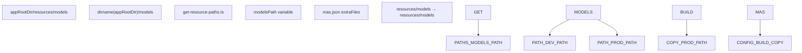
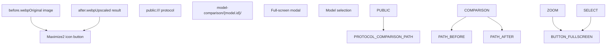

# AI Models

Relevant source files

-   [common/feature-flags.ts](https://github.com/upscayl/upscayl/blob/1fdbd3e5/common/feature-flags.ts)
-   [common/models-list.ts](https://github.com/upscayl/upscayl/blob/1fdbd3e5/common/models-list.ts)
-   [electron/commands/auto-update.ts](https://github.com/upscayl/upscayl/blob/1fdbd3e5/electron/commands/auto-update.ts)
-   [electron/preload.ts](https://github.com/upscayl/upscayl/blob/1fdbd3e5/electron/preload.ts)
-   [electron/utils/get-device-specs.ts](https://github.com/upscayl/upscayl/blob/1fdbd3e5/electron/utils/get-device-specs.ts)
-   [electron/utils/get-resource-paths.ts](https://github.com/upscayl/upscayl/blob/1fdbd3e5/electron/utils/get-resource-paths.ts)
-   [electron/utils/slash.ts](https://github.com/upscayl/upscayl/blob/1fdbd3e5/electron/utils/slash.ts)
-   [electron/utils/spawn-upscayl.ts](https://github.com/upscayl/upscayl/blob/1fdbd3e5/electron/utils/spawn-upscayl.ts)
-   [mas.json](https://github.com/upscayl/upscayl/blob/1fdbd3e5/mas.json)
-   [renderer/components/main-content/onboarding-dialog.tsx](https://github.com/upscayl/upscayl/blob/1fdbd3e5/renderer/components/main-content/onboarding-dialog.tsx)
-   [renderer/components/sidebar/upscayl-tab/select-model-dialog.tsx](https://github.com/upscayl/upscayl/blob/1fdbd3e5/renderer/components/sidebar/upscayl-tab/select-model-dialog.tsx)
-   [renderer/pages/\_app.tsx](https://github.com/upscayl/upscayl/blob/1fdbd3e5/renderer/pages/_app.tsx)
-   [resources/models/high-fidelity-4x.bin](https://github.com/upscayl/upscayl/blob/1fdbd3e5/resources/models/high-fidelity-4x.bin)
-   [resources/models/high-fidelity-4x.param](https://github.com/upscayl/upscayl/blob/1fdbd3e5/resources/models/high-fidelity-4x.param)

This document covers the AI upscaling models available in Upscayl, including built-in Real-ESRGAN variants, the model management system, custom model support, and the user interface for model selection. For information about the actual image upscaling process that uses these models, see [Image Upscaling Process](/upscayl/upscayl/3.1-image-upscaling-process). For details about the platform-specific binaries that execute these models, see [Platform-Specific Binaries](/upscayl/upscayl/3.3-platform-specific-binaries).

## Built-in AI Models

Upscayl includes seven built-in AI models, all variants of Real-ESRGAN optimized for different use cases. These models are defined in the central model registry and provide 4x upscaling capabilities.

### Model Registry

The available models are centrally managed through a TypeScript registry that maps model identifiers to their configuration:

| Model ID | Purpose | Description |
| --- | --- | --- |
| `upscayl-standard-4x` | General purpose | Default balanced model for most images |
| `upscayl-lite-4x` | Lightweight | Faster processing with reduced quality |
| `high-fidelity-4x` | High quality | Best quality output for detailed images |
| `remacri-4x` | Foolhardy model | Community-created variant |
| `ultramix-balanced-4x` | Balanced processing | Optimized for mixed content |
| `ultrasharp-4x` | Sharp details | Kim2091 model for enhanced sharpness |
| `digital-art-4x` | Digital artwork | Specialized for digital art and graphics |

```mermaid
flowchart TD
    MODELS_LIST["MODELS objectcommon/models-list.ts"]
    MODEL_ID["ModelId type"]
    STANDARD["upscayl-standard-4x"]
    LITE["upscayl-lite-4x"]
    HIFI["high-fidelity-4x"]
    REMACRI["remacri-4x"]
    ULTRAMIX["ultramix-balanced-4x"]
    ULTRASHARP["ultrasharp-4x"]
    DIGITAL["digital-art-4x"]
    PARAM_FILES["*.param filesresources/models/"]
    BIN_FILES["*.bin filesresources/models/"]

    MODELS --> LIST_STANDARD
    MODELS --> LIST_LITE
    MODELS --> LIST_HIFI
    MODELS --> LIST_REMACRI
    MODELS --> LIST_ULTRAMIX
    MODELS --> LIST_ULTRASHARP
    MODELS --> LIST_DIGITAL
    MODEL --> ID_MODELS_LIST
    STANDARD --> PARAM_FILES
    HIFI --> PARAM_FILES
    PARAM --> FILES_BIN_FILES
```

Sources: [common/models-list.ts1-26](https://github.com/upscayl/upscayl/blob/1fdbd3e5/common/models-list.ts#L1-L26)

## Model Management System

The model management system handles model storage, path resolution, and integration with the application's resource distribution system.

### Resource Path Management

Model files are stored in platform-specific locations that change between development and production builds:

Sources: [electron/utils/get-resource-paths.ts20-24](https://github.com/upscayl/upscayl/blob/1fdbd3e5/electron/utils/get-resource-paths.ts#L20-L24) [mas.json14-19](https://github.com/upscayl/upscayl/blob/1fdbd3e5/mas.json#L14-L19)

### Model File Structure

Each AI model consists of two files in NCNN format - a parameter file (`.param`) and a binary weights file (`.bin`). The parameter files define the neural network architecture using a text-based format.

Sources: [resources/models/high-fidelity-4x.param1-1000](https://github.com/upscayl/upscayl/blob/1fdbd3e5/resources/models/high-fidelity-4x.param#L1-L1000)

## Model Selection Interface

The user interface for model selection provides visual comparison capabilities and supports both built-in and custom models through a sophisticated dialog system.

### Selection Dialog Component

The model selection is handled by a dedicated React component that integrates with the application's state management:

```mermaid
flowchart TD
    SELECT_DIALOG["SelectModelDialogselect-model-dialog.tsx"]
    DIALOG_TRIGGER["DialogTrigger button"]
    SCROLL_AREA["ScrollArea with models"]
    SELECTED_ATOM["selectedModelIdAtom"]
    CUSTOM_ATOM["customModelIdsAtom"]
    MODEL_CARDS["Model comparison cards"]
    BEFORE_IMG["before.webp images"]
    AFTER_IMG["after.webp images"]
    ZOOM_MODAL["Full-screen zoom modal"]
    USE_TRANSLATION["useTranslation hook"]
    MODEL_NAMES["Translated model names"]
    MODEL_DESC["Translated descriptions"]

    SELECT --> DIALOG_DIALOG_TRIGGER
    SELECT --> DIALOG_SCROLL_AREA
    SCROLL --> AREA_MODEL_CARDS
    MODEL --> CARDS_BEFORE_IMG
    MODEL --> CARDS_AFTER_IMG
    MODEL --> CARDS_ZOOM_MODAL
    SELECTED --> ATOM_SELECT_DIALOG
    CUSTOM --> ATOM_SELECT_DIALOG
    USE --> TRANSLATION_MODEL_NAMES
    USE --> TRANSLATION_MODEL_DESC
    MODEL --> NAMES_MODEL_CARDS
    MODEL --> DESC_MODEL_CARDS
```

Sources: [renderer/components/sidebar/upscayl-tab/select-model-dialog.tsx21-182](https://github.com/upscayl/upscayl/blob/1fdbd3e5/renderer/components/sidebar/upscayl-tab/select-model-dialog.tsx#L21-L182)

### Visual Model Comparison

Each model is presented with before/after comparison images to help users understand the visual differences:

Sources: [renderer/components/sidebar/upscayl-tab/select-model-dialog.tsx82-91](https://github.com/upscayl/upscayl/blob/1fdbd3e5/renderer/components/sidebar/upscayl-tab/select-model-dialog.tsx#L82-L91) [renderer/components/sidebar/upscayl-tab/select-model-dialog.tsx149-166](https://github.com/upscayl/upscayl/blob/1fdbd3e5/renderer/components/sidebar/upscayl-tab/select-model-dialog.tsx#L149-L166)

## Custom Model Support

The system supports user-imported custom models alongside the built-in models, managed through a separate atom in the state management system.

### Custom Model Integration

Custom models are stored separately from built-in models and integrated into the selection interface:

```mermaid
flowchart TD
    CUSTOM_IDS["customModelIdsAtom"]
    CUSTOM_LIST["User-imported model list"]
    BUILT_IN_SECTION["Built-in models section"]
    CUSTOM_SECTION["Custom models section"]
    SEPARATOR["Section separator"]
    HANDLE_SELECT["handleModelSelect function"]
    SET_SELECTED["setSelectedModelId"]
    POSTHOG["Analytics tracking"]

    CUSTOM --> IDS_CUSTOM_LIST
    CUSTOM --> LIST_CUSTOM_SECTION
    BUILT --> IN_SECTION_SEPARATOR
    SEPARATOR --> CUSTOM_SECTION
    CUSTOM --> SECTION_HANDLE_SELECT
    BUILT --> IN_SECTION_HANDLE_SELECT
    HANDLE --> SELECT_SET_SELECTED
    HANDLE --> SELECT_POSTHOG
```

Sources: [renderer/components/sidebar/upscayl-tab/select-model-dialog.tsx25](https://github.com/upscayl/upscayl/blob/1fdbd3e5/renderer/components/sidebar/upscayl-tab/select-model-dialog.tsx#L25-L25) [renderer/components/sidebar/upscayl-tab/select-model-dialog.tsx116-131](https://github.com/upscayl/upscayl/blob/1fdbd3e5/renderer/components/sidebar/upscayl-tab/select-model-dialog.tsx#L116-L131)

## Integration with Processing Pipeline

The selected AI model integrates with the image processing pipeline through the state management system and command argument generation.

### Model to Processing Flow

> **[Mermaid sequence]**
> *(图表结构无法解析)*

The model selection directly influences the command line arguments passed to the `upscayl-bin` executable, determining which neural network weights are loaded for the upscaling operation.

Sources: [renderer/components/sidebar/upscayl-tab/select-model-dialog.tsx29-38](https://github.com/upscayl/upscayl/blob/1fdbd3e5/renderer/components/sidebar/upscayl-tab/select-model-dialog.tsx#L29-L38)
