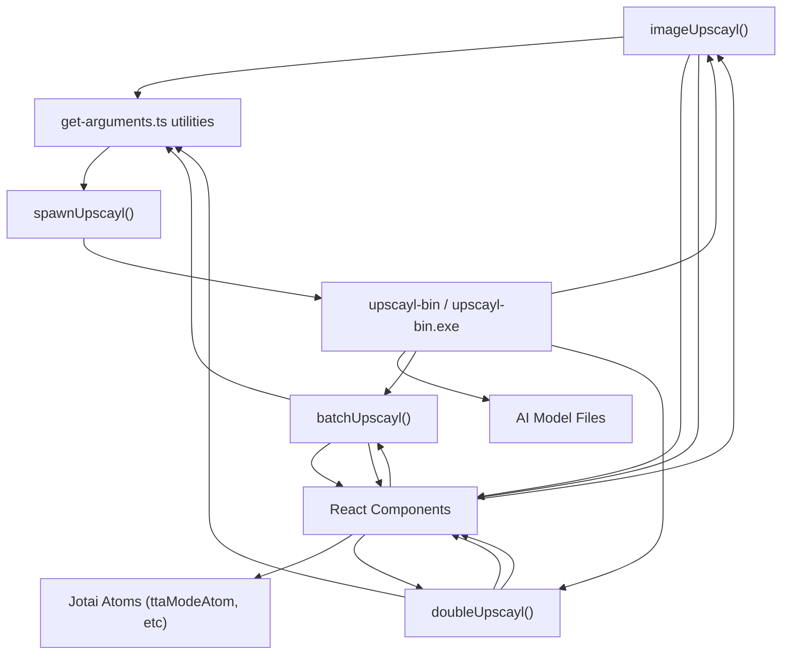
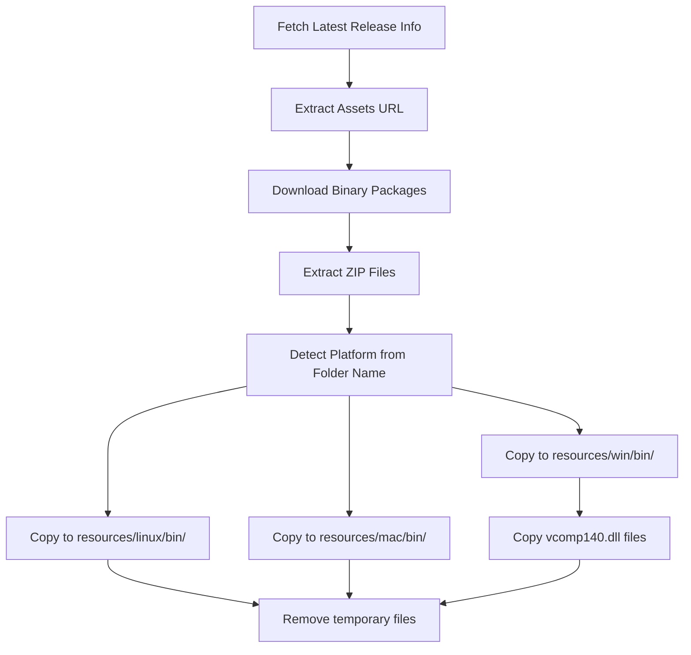

# Platform-Specific Binaries

Relevant source files

-   [.github/workflows/stale.yml](https://github.com/upscayl/upscayl/blob/1fdbd3e5/.github/workflows/stale.yml)
-   [README.md](https://github.com/upscayl/upscayl/blob/1fdbd3e5/README.md?plain=1)
-   [electron/utils/show-notification.ts](https://github.com/upscayl/upscayl/blob/1fdbd3e5/electron/utils/show-notification.ts)
-   [resources/linux/bin/upscayl-bin](https://github.com/upscayl/upscayl/blob/1fdbd3e5/resources/linux/bin/upscayl-bin)
-   [resources/mac/bin/upscayl-bin](https://github.com/upscayl/upscayl/blob/1fdbd3e5/resources/mac/bin/upscayl-bin)
-   [resources/win/bin/upscayl-bin.exe](https://github.com/upscayl/upscayl/blob/1fdbd3e5/resources/win/bin/upscayl-bin.exe)
-   [resources/win/bin/vcomp140.dll](https://github.com/upscayl/upscayl/blob/1fdbd3e5/resources/win/bin/vcomp140.dll)
-   [resources/win/bin/vcomp140d.dll](https://github.com/upscayl/upscayl/blob/1fdbd3e5/resources/win/bin/vcomp140d.dll)
-   [update\_upscayl\_ncnn\_binaries.sh](https://github.com/upscayl/upscayl/blob/1fdbd3e5/update_upscayl_ncnn_binaries.sh)
-   [upscayl.mp4](https://github.com/upscayl/upscayl/blob/1fdbd3e5/upscayl.mp4)

## Purpose and Overview

This page documents the platform-specific binary executables that perform the core image upscaling operations in Upscayl. These native executables contain the neural network processing engine that handles the computationally intensive task of applying AI models to upscale images. Each binary is compiled specifically for Windows, macOS, or Linux to ensure optimal performance across different operating systems.

For information about the AI models used with these binaries, see [AI Models](/upscayl/upscayl/3.2-ai-models).

## Binary Locations and Structure

The platform-specific binaries are organized in dedicated directories within the resources folder:

| Platform | Binary Location | Additional Files |
| --- | --- | --- |
| Linux | `resources/linux/bin/upscayl-bin` | None |
| macOS | `resources/mac/bin/upscayl-bin` | None |
| Windows | `resources/win/bin/upscayl-bin.exe` | `vcomp140.dll` (Visual C++ runtime dependency) |

Sources: [update\_upscayl\_ncnn\_binaries.sh26-33](https://github.com/upscayl/upscayl/blob/1fdbd3e5/update_upscayl_ncnn_binaries.sh#L26-L33)

## Integration Architecture

The diagram below illustrates how the platform-specific binaries integrate with the Electron application:

Sources: [electron/commands/image-upscayl.ts94-111](https://github.com/upscayl/upscayl/blob/1fdbd3e5/electron/commands/image-upscayl.ts#L94-L111) [electron/commands/batch-upscayl.ts48-65](https://github.com/upscayl/upscayl/blob/1fdbd3e5/electron/commands/batch-upscayl.ts#L48-L65) [electron/commands/double-upscayl.ts60-78](https://github.com/upscayl/upscayl/blob/1fdbd3e5/electron/commands/double-upscayl.ts#L60-L78)

## Upscaling Process Flow

The following sequence diagram shows the detailed process flow when upscaling an image using the platform-specific binary:

> **[Mermaid sequence]**
> *(图表结构无法解析)*

Sources: [electron/commands/image-upscayl.ts119-159](https://github.com/upscayl/upscayl/blob/1fdbd3e5/electron/commands/image-upscayl.ts#L119-L159) [electron/commands/batch-upscayl.ts72-126](https://github.com/upscayl/upscayl/blob/1fdbd3e5/electron/commands/batch-upscayl.ts#L72-L126) [electron/commands/double-upscayl.ts141-207](https://github.com/upscayl/upscayl/blob/1fdbd3e5/electron/commands/double-upscayl.ts#L141-L207)

## Binary Command Arguments

The platform-specific binaries accept various command-line arguments to control the upscaling process. These arguments are generated by utility functions in the codebase:

| Argument | Description | Example Usage |
| --- | --- | --- |
| `-i` | Input image or directory path | `-i /path/to/image.jpg` |
| `-o` | Output image or directory path | `-o /path/to/output.png` |
| `-s` | Scale factor (when different from model default) | `-s 4` |
| `-m` | Path to AI models directory | `-m /path/to/models` |
| `-n` | Model name | `-n realesrgan-x4plus` |
| `-g` | GPU ID (for multi-GPU systems) | `-g 0` |
| `-f` | Output format (png, jpg, etc.) | `-f png` |
| `-w` | Custom width (alternative to scale) | `-w 1920` |
| `-c` | Compression level | `-c 95` |
| `-t` | Tile size (for memory management) | `-t 512` |
| `-x` | Enable TTA mode (flag with no value) | `-x` |

The argument generation logic includes conditional checks to only include relevant options:

-   Scale argument is only included if different from the model's default scale
-   GPU ID is only included if specified
-   Custom width is only included if the user chooses this mode over scale
-   TTA mode flag is only included if enabled

Sources: [electron/utils/get-arguments.ts6-69](https://github.com/upscayl/upscayl/blob/1fdbd3e5/electron/utils/get-arguments.ts#L6-L69) [electron/utils/get-arguments.ts71-122](https://github.com/upscayl/upscayl/blob/1fdbd3e5/electron/utils/get-arguments.ts#L71-L122) [electron/utils/get-arguments.ts124-183](https://github.com/upscayl/upscayl/blob/1fdbd3e5/electron/utils/get-arguments.ts#L124-L183) [electron/utils/get-arguments.ts185-247](https://github.com/upscayl/upscayl/blob/1fdbd3e5/electron/utils/get-arguments.ts#L185-L247)

## Upscaling Modes

The platform-specific binaries support three distinct upscaling modes, each with its own implementation and use case:

### 1\. Single Image Upscaling

Managed by `imageUpscayl` in `electron/commands/image-upscayl.ts`:

-   Upscales one image at a time
-   Checks if the output file already exists before processing
-   Constructs output filename based on input, model, and scale settings
-   Streams progress updates to the UI
-   Handles path encoding/decoding for special characters

Key implementation details:

-   Calculates output file path with format: `[filename]_upscayl_[scale]x_[model].[format]`
-   Sets the main window progress bar based on binary output
-   Shows a notification upon successful completion

Sources: [electron/commands/image-upscayl.ts24-161](https://github.com/upscayl/upscayl/blob/1fdbd3e5/electron/commands/image-upscayl.ts#L24-L161)

### 2\. Batch Upscaling

Managed by `batchUpscayl` in `electron/commands/batch-upscayl.ts`:

-   Processes all images in a specified folder
-   Creates a dedicated output folder with naming format: `upscayl_[format]_[model]_[scale]x`
-   Continues processing even if some images fail
-   Provides continuous progress feedback for the batch process

Key implementation details:

-   Creates output directory if it doesn't exist
-   Uses same binary but with different argument structure
-   Shows notification with different messages based on whether any errors occurred

Sources: [electron/commands/batch-upscayl.ts19-133](https://github.com/upscayl/upscayl/blob/1fdbd3e5/electron/commands/batch-upscayl.ts#L19-L133)

### 3\. Double Upscaling

Managed by `doubleUpscayl` in `electron/commands/double-upscayl.ts`:

-   Performs two sequential upscaling passes for enhanced results
-   First pass produces an intermediate result
-   Second pass processes the intermediate result to produce final output
-   Uses the same output path for both passes

Key implementation details:

-   Separate event handlers for each upscaling pass
-   Second pass is only initiated if the first pass completes successfully
-   Additional arguments like compression and TTA mode are applied in the second pass

Sources: [electron/commands/double-upscayl.ts26-215](https://github.com/upscayl/upscayl/blob/1fdbd3e5/electron/commands/double-upscayl.ts#L26-L215)

## Binary Update Process

The platform-specific binaries are updated using the `update_upscayl_ncnn_binaries.sh` script. This script:

This update process allows the core upscaling functionality to evolve independently of the main application, enabling performance improvements and bug fixes to the upscaling engine without requiring a full application update.

Sources: [update\_upscayl\_ncnn\_binaries.sh3-42](https://github.com/upscayl/upscayl/blob/1fdbd3e5/update_upscayl_ncnn_binaries.sh#L3-L42)

## Configuration Options

Users can configure how the binaries operate through several UI settings that ultimately affect the command-line arguments passed to the binaries:

1.  **TTA Mode**: Test Time Augmentation improves quality at the cost of processing speed

    -   Managed by `ttaModeAtom` in the React UI
    -   Added as `-x` flag to the binary arguments when enabled
    -   Toggleable through the settings interface
2.  **Custom Width vs. Scale**: Users can choose between:

    -   Scale factor (e.g., 2x, 4x) - using the `-s` argument
    -   Custom width (specific pixel width) - using the `-w` argument
3.  **Output Format**: Controls the output file format via the `-f` argument

    -   Options typically include PNG, JPG, and other common formats
4.  **Compression Level**: Controls output quality/size via the `-c` argument

    -   Higher values produce larger files with better quality
5.  **Tile Size**: Controls memory usage via the `-t` argument

    -   Larger tiles can be faster but require more GPU memory
    -   Smaller tiles work better on systems with limited resources

Sources: [common/types/types.d.ts3-50](https://github.com/upscayl/upscayl/blob/1fdbd3e5/common/types/types.d.ts#L3-L50) [renderer/components/sidebar/settings-tab/tta-mode-toggle.tsx5-27](https://github.com/upscayl/upscayl/blob/1fdbd3e5/renderer/components/sidebar/settings-tab/tta-mode-toggle.tsx#L5-L27)

## Technical Considerations

When working with the platform-specific binaries, several technical aspects should be considered:

1.  **Binary Dependencies**:

    -   Windows binary requires Visual C++ Redistributable libraries (included as DLLs)
    -   All platforms utilize GPU acceleration when available
2.  **Error Handling**:

    -   The binaries communicate errors via stderr
    -   The Electron process monitors output for keywords like "Error" or "failed"
    -   Proper error reporting is passed back to the UI
3.  **Resource Management**:

    -   Binary processes are tracked in `childProcesses` array for potential termination
    -   A `stopped` flag manages graceful termination when the user cancels an operation
4.  **Cross-Platform Compatibility**:

    -   File path handling accounts for platform differences (backslash vs. forward slash)
    -   Path length limitations are checked (particularly for Windows)
    -   Special characters in paths are properly encoded/decoded

The binaries represent the core computational engine of Upscayl, handling the actual AI processing while the Electron application provides the user interface and process management.

Sources: [electron/commands/image-upscayl.ts62-67](https://github.com/upscayl/upscayl/blob/1fdbd3e5/electron/commands/image-upscayl.ts#L62-L67) [electron/commands/image-upscayl.ts114-145](https://github.com/upscayl/upscayl/blob/1fdbd3e5/electron/commands/image-upscayl.ts#L114-L145) [electron/commands/batch-upscayl.ts67-99](https://github.com/upscayl/upscayl/blob/1fdbd3e5/electron/commands/batch-upscayl.ts#L67-L99) [electron/commands/double-upscayl.ts82-207](https://github.com/upscayl/upscayl/blob/1fdbd3e5/electron/commands/double-upscayl.ts#L82-L207)
