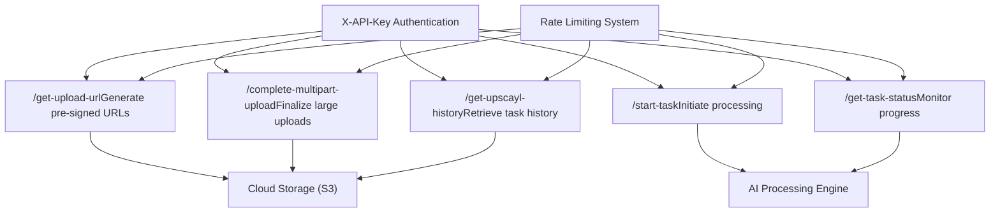

# Upscayl Cloud API

Relevant source files

-   [docs/complete-a-multipart-upload.mdx](https://github.com/upscayl/upscayl/blob/1fdbd3e5/docs/complete-a-multipart-upload.mdx?plain=1)
-   [docs/get-task-status.mdx](https://github.com/upscayl/upscayl/blob/1fdbd3e5/docs/get-task-status.mdx?plain=1)
-   [docs/get-upload-url.mdx](https://github.com/upscayl/upscayl/blob/1fdbd3e5/docs/get-upload-url.mdx?plain=1)
-   [docs/get-upscayl-history.mdx](https://github.com/upscayl/upscayl/blob/1fdbd3e5/docs/get-upscayl-history.mdx?plain=1)
-   [docs/history/get-image-processing-history.mdx](https://github.com/upscayl/upscayl/blob/1fdbd3e5/docs/history/get-image-processing-history.mdx?plain=1)
-   [docs/mint.json](https://github.com/upscayl/upscayl/blob/1fdbd3e5/docs/mint.json)
-   [docs/openapi.yaml](https://github.com/upscayl/upscayl/blob/1fdbd3e5/docs/openapi.yaml)
-   [docs/start-a-new-task.mdx](https://github.com/upscayl/upscayl/blob/1fdbd3e5/docs/start-a-new-task.mdx?plain=1)
-   [docs/tasks/check-task-status.mdx](https://github.com/upscayl/upscayl/blob/1fdbd3e5/docs/tasks/check-task-status.mdx?plain=1)
-   [docs/tasks/start-upscaling-task.mdx](https://github.com/upscayl/upscayl/blob/1fdbd3e5/docs/tasks/start-upscaling-task.mdx?plain=1)
-   [docs/upload/complete-multipart-upload.mdx](https://github.com/upscayl/upscayl/blob/1fdbd3e5/docs/upload/complete-multipart-upload.mdx?plain=1)
-   [docs/upload/generate-pre-signed-upload-url.mdx](https://github.com/upscayl/upscayl/blob/1fdbd3e5/docs/upload/generate-pre-signed-upload-url.mdx?plain=1)

The Upscayl Cloud API provides cloud-based AI image upscaling services through a RESTful interface. This system complements the desktop application by offering server-side processing capabilities, enabling users to upscale images without requiring local GPU resources or AI model installations.

This document covers the cloud API architecture, endpoints, authentication, and integration patterns. For information about the desktop application's core image processing workflow, see [Image Upscaling Process](/upscayl/upscayl/3.1-image-upscaling-process). For details about the AI models used in both desktop and cloud processing, see [AI Models](/upscayl/upscayl/3.2-ai-models).

## API Architecture Overview

The Upscayl Cloud API follows a task-based processing model where users upload images, initiate processing tasks, and poll for results. The system supports both single image and batch processing workflows.

### Core Workflow

> **[Mermaid sequence]**
> *(图表结构无法解析)*

Sources: [docs/openapi.yaml271-751](https://github.com/upscayl/upscayl/blob/1fdbd3e5/docs/openapi.yaml#L271-L751)

### API Endpoint Architecture


Sources: [docs/openapi.yaml271-751](https://github.com/upscayl/upscayl/blob/1fdbd3e5/docs/openapi.yaml#L271-L751) [docs/mint.json66-74](https://github.com/upscayl/upscayl/blob/1fdbd3e5/docs/mint.json#L66-L74)

## Authentication System

The API uses API key authentication through the `X-API-Key` header. All endpoints require valid authentication credentials.

### Authentication Configuration

| Component | Implementation |
| --- | --- |
| **Scheme Type** | `apiKey` |
| **Header Name** | `X-API-Key` |
| **Location** | HTTP Header |
| **Security Scope** | All endpoints |

### Rate Limiting

The API implements per-endpoint rate limiting to ensure service stability:

| Endpoint | Limit | Period |
| --- | --- | --- |
| `/get-upload-url` | 100 requests | 1 hour |
| `/start-task` | 50 requests | 1 hour |
| `/get-task-status` | 100 requests | 1 hour |
| `/get-upscayl-history` | 100 requests | 1 hour |
| `/complete-multipart-upload` | 50 requests | 1 hour |

Sources: [docs/openapi.yaml66-70](https://github.com/upscayl/upscayl/blob/1fdbd3e5/docs/openapi.yaml#L66-L70) [docs/openapi.yaml285-287](https://github.com/upscayl/upscayl/blob/1fdbd3e5/docs/openapi.yaml#L285-L287) [docs/openapi.yaml407-409](https://github.com/upscayl/upscayl/blob/1fdbd3e5/docs/openapi.yaml#L407-L409) [docs/openapi.yaml495-497](https://github.com/upscayl/upscayl/blob/1fdbd3e5/docs/openapi.yaml#L495-L497) [docs/openapi.yaml550-552](https://github.com/upscayl/upscayl/blob/1fdbd3e5/docs/openapi.yaml#L550-L552) [docs/openapi.yaml663-665](https://github.com/upscayl/upscayl/blob/1fdbd3e5/docs/openapi.yaml#L663-L665)

## API Endpoints

### Upload Management

#### Generate Pre-signed Upload URL

The `/get-upload-url` endpoint creates secure, time-limited URLs for direct file uploads to cloud storage.

**Request Schema:**

```
{  "originalFileName": "vacation-photo.jpeg",  "fileType": "image/jpeg",   "fileSize": 1048576}
```
**Supported File Types:**

-   `image/jpeg`
-   `image/png`
-   `image/webp`

**File Size Limits:**

-   Maximum: 100MB (104,857,600 bytes)
-   Minimum: 1 byte

**Response Schema:**

```
{  "status": "success",  "data": {    "uploadURL": "https://storage.upscayl.com/upload/abc123",    "fileName": "f7d9a2b4-vacation-photo.jpeg",    "fileType": "image/jpeg",    "fileSize": 1048576,    "originalFileName": "vacation-photo.jpeg",    "createdAt": 1633024800000,    "expiresAt": 1633028400000  }}
```
Sources: [docs/openapi.yaml272-395](https://github.com/upscayl/upscayl/blob/1fdbd3e5/docs/openapi.yaml#L272-L395)

#### Complete Multipart Upload

The `/complete-multipart-upload` endpoint finalizes large file uploads by combining uploaded parts.

**Request Schema:**

```
{  "data": {    "uploadId": "abc123def456",    "key": "uploads/image.jpg",    "parts": [      {        "PartNumber": 1,        "ETag": "a1b2c3d4"      }    ]  }}
```
Sources: [docs/openapi.yaml652-751](https://github.com/upscayl/upscayl/blob/1fdbd3e5/docs/openapi.yaml#L652-L751)

### Task Management

#### Start Processing Task

The `/start-task` endpoint initiates image upscaling with specified parameters.

**Supported AI Models:**

-   `upscayl-standard-4x`
-   `upscayl-lite-4x`
-   `clear-boost-4x`
-   `crystal-plus-4x`
-   `digital-art-4x`
-   `digital-art-plus-4x`
-   `natural-max-4x`
-   `natural-plus-4x`
-   `nature-boost-4x`
-   `pure-boost-4x`
-   `quick-clear-4x`
-   `texture-boost-4x`

**Processing Options:**

-   **Scale factors:** `"2"`, `"4"`, `"8"`
-   **Output formats:** `png`, `jpg`, `webp`
-   **Face enhancement:** Boolean flag
-   **Batch mode:** Multiple file processing

Sources: [docs/openapi.yaml539-651](https://github.com/upscayl/upscayl/blob/1fdbd3e5/docs/openapi.yaml#L539-L651) [docs/openapi.yaml576-590](https://github.com/upscayl/upscayl/blob/1fdbd3e5/docs/openapi.yaml#L576-L590)

#### Check Task Status

The `/get-task-status` endpoint monitors processing progress and retrieves results.

**Status Values:**

-   `pending` - Task queued for processing
-   `processing` - Currently being processed
-   `completed` - Processing finished successfully
-   `failed` - Processing encountered an error

**Response includes:**

-   Processing progress percentage
-   Applied model and scale factor
-   Processed file metadata
-   Download and thumbnail links
-   Credit deduction information

Sources: [docs/openapi.yaml484-538](https://github.com/upscayl/upscayl/blob/1fdbd3e5/docs/openapi.yaml#L484-L538)

### History Management

#### Get Processing History

The `/get-upscayl-history` endpoint retrieves paginated processing history with filtering options.

**Filter Parameters:**

-   `timestampOffset` - Start timestamp for pagination
-   `batch` - Filter by batch processing status
-   `failed` - Filter by failure status
-   `limit` - Results per page (1-100, default 20)
-   `processed` - Filter by processing status

**Pagination Response:**

```
{  "status": "success",  "pagination": {    "total": 150,    "hasMore": true,    "nextOffset": 1633024800000  },  "data": [...]}
```
Sources: [docs/openapi.yaml396-483](https://github.com/upscayl/upscayl/blob/1fdbd3e5/docs/openapi.yaml#L396-L483)

## Data Models

### Core Schemas

The API defines several key data structures for managing files and tasks:

#### ProcessedFile Schema

```
interface ProcessedFile {  fileName: string;  fileType: string;  path: string;  createdAt: number; // Unix timestamp  expiresAt: number; // Unix timestamp  originalFileName: string;  fileSize: number;  downloadLink: string; // URI  thumbnailLink: string; // URI  finalFileSize: number;  processedFileName: string;  dimensions: {    width: number;    height: number;  };}
```
#### TaskStatus Schema

```
interface TaskStatus {  status: "success";  data: {    batchMode: boolean;    enhanceFace: boolean;    error?: string;    files: ProcessedFile[];    model: string; // AI model identifier    progress: string; // Percentage    scale: string; // Scale factor    status: "pending" | "processing" | "completed" | "failed";    saveImageAs: "png" | "jpg" | "webp";    creditsDeducted: boolean;    deductedCredits?: number;  };}
```
Sources: [docs/openapi.yaml218-255](https://github.com/upscayl/upscayl/blob/1fdbd3e5/docs/openapi.yaml#L218-L255) [docs/openapi.yaml72-135](https://github.com/upscayl/upscayl/blob/1fdbd3e5/docs/openapi.yaml#L72-L135)

## Error Handling

### Standard Error Response

```
{  "error": "ERROR_CODE",  "message": "Human-readable error description"}
```
### Common Error Codes

| HTTP Status | Error Code | Description |
| --- | --- | --- |
| 400 | `BAD_REQUEST` | Invalid request parameters |
| 400 | `INVALID_FILE_TYPE` | Unsupported file format |
| 400 | `FILE_SIZE_EXCEEDED` | File exceeds 100MB limit |
| 401 | `UNAUTHORIZED` | Invalid or missing API key |
| 402 | `INSUFFICIENT_CREDITS` | Not enough credits for processing |
| 404 | `NOT_FOUND` | Resource not found |
| 429 | `RATE_LIMIT_EXCEEDED` | Too many requests |
| 500 | `INTERNAL_SERVER_ERROR` | Unexpected server error |

Sources: [docs/openapi.yaml18-65](https://github.com/upscayl/upscayl/blob/1fdbd3e5/docs/openapi.yaml#L18-L65) [docs/openapi.yaml371-395](https://github.com/upscayl/upscayl/blob/1fdbd3e5/docs/openapi.yaml#L371-L395) [docs/openapi.yaml639-648](https://github.com/upscayl/upscayl/blob/1fdbd3e5/docs/openapi.yaml#L639-L648)

## Integration Patterns

### Credit-Based Processing

The API operates on a credit system where processing tasks consume credits based on:

-   Image dimensions and file size
-   Selected AI model complexity
-   Processing scale factor
-   Additional features (face enhancement)

The `TaskStatus` response includes credit deduction information:

-   `creditsDeducted` - Boolean indicating if credits were charged
-   `deductedCredits` - Number of credits consumed

### Asynchronous Processing

All image processing is asynchronous, requiring clients to:

1.  Start tasks via `/start-task`
2.  Poll status via `/get-task-status`
3.  Download results when status becomes `completed`

This pattern allows the API to handle long-running AI processing operations without blocking client connections.

Sources: [docs/openapi.yaml131-135](https://github.com/upscayl/upscayl/blob/1fdbd3e5/docs/openapi.yaml#L131-L135) [docs/openapi.yaml215-217](https://github.com/upscayl/upscayl/blob/1fdbd3e5/docs/openapi.yaml#L215-L217)
