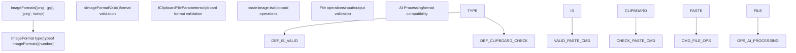
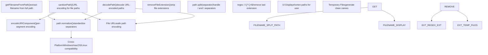

# Image Handling

Relevant source files

-   [common/decode-path.ts](https://github.com/upscayl/upscayl/blob/1fdbd3e5/common/decode-path.ts)
-   [common/get-file-name.ts](https://github.com/upscayl/upscayl/blob/1fdbd3e5/common/get-file-name.ts)
-   [common/image-formats.ts](https://github.com/upscayl/upscayl/blob/1fdbd3e5/common/image-formats.ts)
-   [common/sanitize-path.ts](https://github.com/upscayl/upscayl/blob/1fdbd3e5/common/sanitize-path.ts)
-   [electron/commands/paste-image.ts](https://github.com/upscayl/upscayl/blob/1fdbd3e5/electron/commands/paste-image.ts)
-   [electron/types/types.d.ts](https://github.com/upscayl/upscayl/blob/1fdbd3e5/electron/types/types.d.ts)
-   [electron/utils/remove-file-extension.ts](https://github.com/upscayl/upscayl/blob/1fdbd3e5/electron/utils/remove-file-extension.ts)
-   [renderer/public/logo.svg](https://github.com/upscayl/upscayl/blob/1fdbd3e5/renderer/public/logo.svg)

This document covers Upscayl's image file handling system, including supported formats, file operations, clipboard integration, and path utilities. This system manages image input/output operations that feed into the AI upscaling workflow.

For information about the AI upscaling process itself, see [Image Upscaling Process](/upscayl/upscayl/3.1-image-upscaling-process). For UI components that display images, see [Main UI Components](/upscayl/upscayl/4.1-main-ui-components).

## Supported Image Formats

Upscayl supports a specific set of image formats defined in the shared configuration. The application validates all input and output against these supported formats.


**Sources:** [common/image-formats.ts1](https://github.com/upscayl/upscayl/blob/1fdbd3e5/common/image-formats.ts#L1-L1) [electron/types/types.d.ts1-3](https://github.com/upscayl/upscayl/blob/1fdbd3e5/electron/types/types.d.ts#L1-L3) [electron/commands/paste-image.ts18-20](https://github.com/upscayl/upscayl/blob/1fdbd3e5/electron/commands/paste-image.ts#L18-L20)

The `imageFormats` array defines the four supported formats: PNG, JPG, JPEG, and WebP. The `ImageFormat` type provides compile-time type safety across the application, ensuring only valid formats are processed.

| Format | Extension | Usage |
| --- | --- | --- |
| PNG | `.png` | Lossless format, supports transparency |
| JPEG | `.jpg`, `.jpeg` | Lossy format, smaller file sizes |
| WebP | `.webp` | Modern format, good compression |

## Clipboard Integration

The clipboard integration system allows users to paste images directly from their system clipboard into Upscayl for processing.

> **[Mermaid sequence]**
> *(图表结构无法解析)*

**Sources:** [electron/commands/paste-image.ts32-61](https://github.com/upscayl/upscayl/blob/1fdbd3e5/electron/commands/paste-image.ts#L32-L61)

### Clipboard File Parameters

The `IClipboardFileParameters` interface defines the structure for clipboard image data:

```
interface IClipboardFileParameters {  name: string;           // Original filename  path: string;           // Destination path  extension: ImageFormat; // Validated format  size: number;          // File size in bytes  type: string;          // MIME type  encodedBuffer: string; // Base64 encoded image data}
```
**Sources:** [electron/commands/paste-image.ts9-16](https://github.com/upscayl/upscayl/blob/1fdbd3e5/electron/commands/paste-image.ts#L9-L16)

### Clipboard Processing Flow

1.  **Format Validation**: The `isImageFormatValid()` function checks against the supported formats array
2.  **Temporary File Creation**: `createTempFileFromClipboard()` converts base64 data to a file buffer
3.  **File System Write**: The buffer is written to a temporary file location
4.  **Success/Error Handling**: IPC events communicate the result back to the renderer

**Sources:** [electron/commands/paste-image.ts22-30](https://github.com/upscayl/upscayl/blob/1fdbd3e5/electron/commands/paste-image.ts#L22-L30) [electron/commands/paste-image.ts39-58](https://github.com/upscayl/upscayl/blob/1fdbd3e5/electron/commands/paste-image.ts#L39-L58)

## Path Handling Utilities

Upscayl includes several utilities for managing file paths across different operating systems and contexts.


**Sources:** [common/get-file-name.ts1-5](https://github.com/upscayl/upscayl/blob/1fdbd3e5/common/get-file-name.ts#L1-L5) [common/sanitize-path.ts1-23](https://github.com/upscayl/upscayl/blob/1fdbd3e5/common/sanitize-path.ts#L1-L23) [common/decode-path.ts1-5](https://github.com/upscayl/upscayl/blob/1fdbd3e5/common/decode-path.ts#L1-L5) [electron/utils/remove-file-extension.ts1-8](https://github.com/upscayl/upscayl/blob/1fdbd3e5/electron/utils/remove-file-extension.ts#L1-L8)

### Filename Extraction

The `getFilenameFromPath()` function handles cross-platform path separators:

-   Detects whether the path uses forward slashes (`/`) or backslashes (`\`)
-   Splits the path and returns the last segment (filename)
-   Returns empty string for invalid paths

**Sources:** [common/get-file-name.ts1-5](https://github.com/upscayl/upscayl/blob/1fdbd3e5/common/get-file-name.ts#L1-L5)

### Path Sanitization

The `sanitizePath()` function prepares file paths for safe URL usage:

1.  **Normalization**: Converts backslashes to forward slashes for Windows compatibility
2.  **Segmentation**: Splits path into individual components
3.  **Encoding**: Applies `encodeURIComponent()` to each segment separately
4.  **Reconstruction**: Joins encoded segments back with forward slashes

**Sources:** [common/sanitize-path.ts4-22](https://github.com/upscayl/upscayl/blob/1fdbd3e5/common/sanitize-path.ts#L4-L22)

### Extension Handling

The `removeFileExtension()` function uses a regex pattern to strip file extensions while preserving the base filename. This is useful for generating output filenames and temporary file names.

**Sources:** [electron/utils/remove-file-extension.ts6-8](https://github.com/upscayl/upscayl/blob/1fdbd3e5/electron/utils/remove-file-extension.ts#L6-L8)

## File Operation Integration

Image handling utilities integrate with the broader Upscayl workflow through several key touch points.

```mermaid
flowchart TD
    FILE_SELECT["File Selection DialogELECTRON_COMMANDS.SELECT_FILE"]
    CLIPBOARD_PASTE["Clipboard PasteELECTRON_COMMANDS.PASTE_IMAGE"]
    DRAG_DROP["Drag & Drop(UI level)"]
    FORMAT_CHECK["Format ValidationisImageFormatValid()"]
    PATH_CLEAN["Path SanitizationsanitizePath()"]
    NAME_EXTRACT["Name ExtractiongetFilenameFromPath()"]
    TEMP_CREATE["Temporary File CreationcreateTempFileFromClipboard()"]
    METADATA_COPY["Metadata Preservation(upscaling process)"]
    OUTPUT_SAVE["Output File Save(post-processing)"]
    SINGLE_UPSCALE["Single Image UpscalingimageUpscayl command"]
    BATCH_UPSCALE["Batch ProcessingbatchUpscayl command"]
    DOUBLE_UPSCALE["Double UpscalingdoubleUpscayl command"]

    FILE --> SELECT_FORMAT_CHECK
    CLIPBOARD --> PASTE_FORMAT_CHECK
    DRAG --> DROP_FORMAT_CHECK
    FORMAT --> CHECK_PATH_CLEAN
    PATH --> CLEAN_NAME_EXTRACT
    NAME --> EXTRACT_TEMP_CREATE
    TEMP --> CREATE_SINGLE_UPSCALE
    TEMP --> CREATE_BATCH_UPSCALE
    TEMP --> CREATE_DOUBLE_UPSCALE
    SINGLE --> UPSCALE_OUTPUT_SAVE
    BATCH --> UPSCALE_OUTPUT_SAVE
    DOUBLE --> UPSCALE_OUTPUT_SAVE
    OUTPUT --> SAVE_METADATA_COPY
```


**Sources:** [electron/commands/paste-image.ts32-61](https://github.com/upscayl/upscayl/blob/1fdbd3e5/electron/commands/paste-image.ts#L32-L61)

### Error Handling

The image handling system implements comprehensive error handling:

-   **Format Validation Errors**: Invalid formats trigger `PASTE_IMAGE_SAVE_ERROR` with "Unsupported Image Format"
-   **File System Errors**: I/O failures are logged and communicated to the renderer process
-   **Missing Data Errors**: Incomplete clipboard data is validated before processing

**Sources:** [electron/commands/paste-image.ts46-58](https://github.com/upscayl/upscayl/blob/1fdbd3e5/electron/commands/paste-image.ts#L46-L58)

### Metadata Preservation

While not directly handled by the core image utilities, the system preserves image metadata through the upscaling process when the "Copy EXIF metadata" option is enabled in user settings. This integration occurs after the image handling phase during AI processing.

## Integration Points

The image handling system connects to several other Upscayl subsystems:

| System | Integration Point | Purpose |
| --- | --- | --- |
| **IPC Commands** | `ELECTRON_COMMANDS.PASTE_IMAGE*` | Clipboard operations |
| **State Management** | Input path atoms | File selection state |
| **AI Processing** | `upscayl-ncnn` binary | Format validation before processing |
| **UI Components** | Image viewers and dialogs | Display and interaction |
| **Settings System** | Format preferences | Output format selection |

**Sources:** [electron/commands/paste-image.ts5](https://github.com/upscayl/upscayl/blob/1fdbd3e5/electron/commands/paste-image.ts#L5-L5) [electron/commands/paste-image.ts42-50](https://github.com/upscayl/upscayl/blob/1fdbd3e5/electron/commands/paste-image.ts#L42-L50)

The image handling system serves as the foundation for all file operations in Upscayl, ensuring consistent format support, cross-platform compatibility, and reliable file processing before images enter the AI upscaling pipeline.
