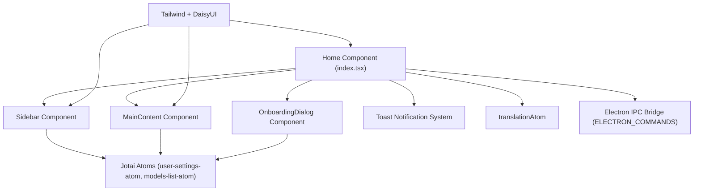
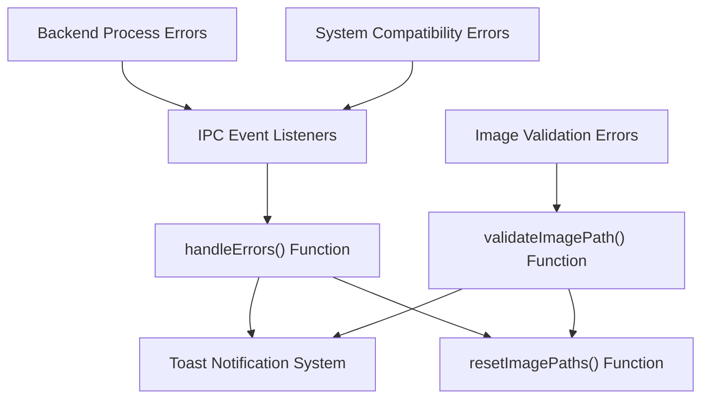
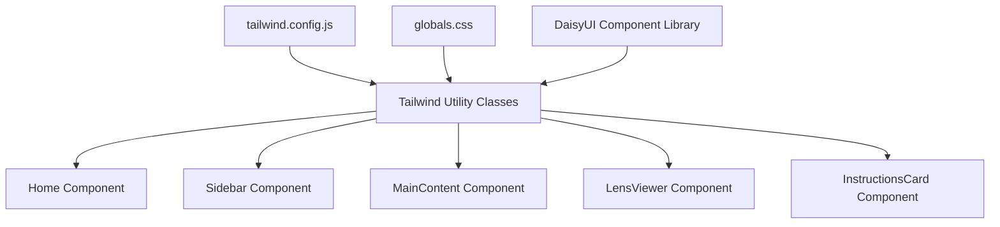
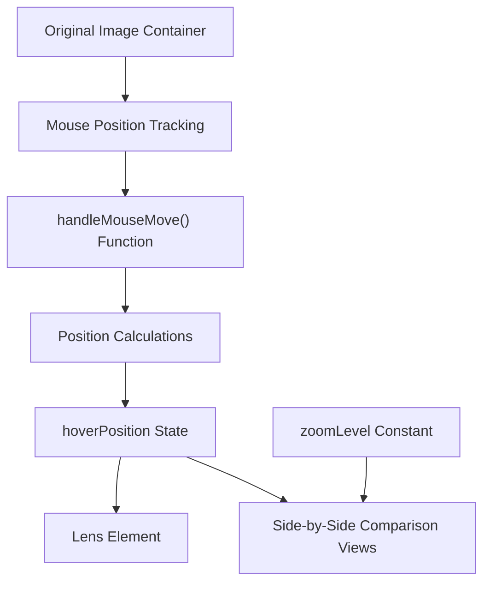

# User Interface

Relevant source files

-   [electron/index.ts](https://github.com/upscayl/upscayl/blob/1fdbd3e5/electron/index.ts)
-   [renderer/components/main-content/index.tsx](https://github.com/upscayl/upscayl/blob/1fdbd3e5/renderer/components/main-content/index.tsx)
-   [renderer/components/main-content/instructions-card.tsx](https://github.com/upscayl/upscayl/blob/1fdbd3e5/renderer/components/main-content/instructions-card.tsx)
-   [renderer/components/main-content/lens-view.tsx](https://github.com/upscayl/upscayl/blob/1fdbd3e5/renderer/components/main-content/lens-view.tsx)
-   [renderer/pages/index.tsx](https://github.com/upscayl/upscayl/blob/1fdbd3e5/renderer/pages/index.tsx)

## Purpose and Scope

This document provides a technical overview of Upscayl's user interface system. It covers the UI architecture, component structure, styling approach, and interaction patterns. For information about the underlying application architecture, see [Application Architecture](/upscayl/upscayl/2-application-architecture), and for details on image upscaling functionality, see [Core Functionality](/upscayl/upscayl/3-core-functionality).

## UI Architecture Overview

Upscayl's user interface is built using React within an Electron framework. The UI is implemented as a Next.js application running in the Electron renderer process, providing an intuitive interface for image upscaling while offering advanced configuration options.

### UI Component Hierarchy


Sources: [renderer/pages/index.tsx18-26](https://github.com/upscayl/upscayl/blob/1fdbd3e5/renderer/pages/index.tsx#L18-L26) [renderer/pages/index.tsx327-354](https://github.com/upscayl/upscayl/blob/1fdbd3e5/renderer/pages/index.tsx#L327-L354) [electron/index.ts4-7](https://github.com/upscayl/upscayl/blob/1fdbd3e5/electron/index.ts#L4-L7)

## Main UI Structure

The Upscayl UI consists of a main layout with a sidebar and content area. This structure allows users to configure settings in the sidebar while viewing and comparing images in the main content area.

### Component Relationships and Props

The main UI layout is defined in the `Home` component (`index.tsx`), which serves as the root component and orchestrates interactions between all UI elements. The component structure follows a parent-child relationship where the `Home` component manages state and passes it down to child components as props.

Sources: [renderer/pages/index.tsx27-357](https://github.com/upscayl/upscayl/blob/1fdbd3e5/renderer/pages/index.tsx#L27-L357) [renderer/pages/index.tsx332-354](https://github.com/upscayl/upscayl/blob/1fdbd3e5/renderer/pages/index.tsx#L332-L354)

## Component Breakdown

### Home Component

The `Home` component (`index.tsx`) is the main container that:

-   Initializes application state using React's `useState` and Jotai atoms
-   Sets up event listeners for Electron IPC commands
-   Handles image/folder selection via `selectImageHandler` and `selectFolderHandler`
-   Manages upscaling process state and error handling
-   Renders the sidebar, main content, and onboarding dialog

The root layout structure is defined as:

```
<div className="flex h-screen w-screen flex-row overflow-hidden bg-base-300">
  <Sidebar {...sidebarProps} />
  <MainContent {...mainContentProps} />
  <OnboardingDialog />
</div>
```
Key state elements managed by the Home component include:

-   `imagePath` and `upscaledImagePath` - Paths to original and processed images
-   `batchFolderPath` and `upscaledBatchFolderPath` - Paths for batch processing
-   `dimensions` - Image dimensions for display
-   `progress` - Current processing progress (via `progressAtom`)
-   `doubleUpscaylCounter` - Counter for double upscaling process

Sources: [renderer/pages/index.tsx27-357](https://github.com/upscayl/upscayl/blob/1fdbd3e5/renderer/pages/index.tsx#L27-L357) [renderer/pages/index.tsx35-50](https://github.com/upscayl/upscayl/blob/1fdbd3e5/renderer/pages/index.tsx#L35-L50) [renderer/pages/index.tsx327-354](https://github.com/upscayl/upscayl/blob/1fdbd3e5/renderer/pages/index.tsx#L327-L354)

### Sidebar Component

The `Sidebar` component contains:

-   Model selection controls
-   Processing settings (scale, format options)
-   Batch mode toggle
-   Action buttons for starting the upscaling process
-   Configuration options for output paths

The Sidebar receives props from the Home component including:

-   `imagePath` - Path to the selected image
-   `dimensions` - Image dimensions
-   `batchFolderPath` - Path for batch processing
-   Handler functions for image/folder selection

Sources: [renderer/pages/index.tsx332-340](https://github.com/upscayl/upscayl/blob/1fdbd3e5/renderer/pages/index.tsx#L332-L340)

### Main Content Area

The `MainContent` component displays:

-   Original image preview
-   Upscaled image preview
-   Comparison tools (slider or lens view)
-   Drag and drop area for files
-   Progress indicators during processing
-   Instructions card when no image is selected

The component receives props including image paths, folder paths, and handler functions for image manipulation.

Sources: [renderer/pages/index.tsx341-353](https://github.com/upscayl/upscayl/blob/1fdbd3e5/renderer/pages/index.tsx#L341-L353)

## User Interaction Flow

### Image Processing Workflow

> **[Mermaid sequence]**
> *(图表结构无法解析)*

The diagram shows the complete flow from user interaction to image processing and result display. The Home component orchestrates this flow by handling user input, communicating with the Electron main process, and updating the UI based on processing events.

Sources: [renderer/pages/index.tsx52-101](https://github.com/upscayl/upscayl/blob/1fdbd3e5/renderer/pages/index.tsx#L52-L101) [renderer/pages/index.tsx172-207](https://github.com/upscayl/upscayl/blob/1fdbd3e5/renderer/pages/index.tsx#L172-L207) [renderer/pages/index.tsx236-250](https://github.com/upscayl/upscayl/blob/1fdbd3e5/renderer/pages/index.tsx#L236-L250)

## State Management

Upscayl uses Jotai for state management. The UI components interact with various atoms to maintain and synchronize state across the application.

### State Architecture

```mermaid
flowchart TD
    Home["Home Component (index.tsx)"]
    Sidebar["Sidebar Component"]
    MainContent["MainContent Component"]
    LocalState["React useState"]
    ImagePath["imagePath"]
    UpscaledPath["upscaledImagePath"]
    BatchFolder["batchFolderPath"]
    UpscaledBatch["upscaledBatchFolderPath"]
    Dimensions["dimensions"]
    DoubleCounter["doubleUpscaylCounter"]
    BatchMode["batchModeAtom"]
    Progress["progressAtom"]
    Models["customModelIdsAtom"]
    OutputPath["savedOutputPathAtom"]
    RememberOutput["rememberOutputFolderAtom"]
    UserStats["userStatsAtom"]
    Translation["translationAtom"]

    Home --> LocalState
    LocalState --> ImagePath
    LocalState --> UpscaledPath
    LocalState --> BatchFolder
    LocalState --> UpscaledBatch
    LocalState --> Dimensions
    LocalState --> DoubleCounter
    Home --> BatchMode
    Home --> Progress
    Home --> Models
    Home --> OutputPath
    Home --> RememberOutput
    Home --> UserStats
    Home --> Translation
    Sidebar --> BatchMode
    Sidebar --> Models
    Sidebar --> OutputPath
    Sidebar --> Translation
    MainContent --> ImagePath
    MainContent --> UpscaledPath
    MainContent --> BatchFolder
    MainContent --> UpscaledBatch
    MainContent --> Progress
    MainContent --> Translation
```


The state management system combines React's local component state (using `useState`) for UI-specific state and Jotai atoms for application-wide state that needs to be shared across components.

Key Jotai atoms include:

-   `batchModeAtom` - Controls whether batch processing is enabled
-   `progressAtom` - Tracks current processing progress
-   `customModelIdsAtom` - Stores available AI models
-   `savedOutputPathAtom` - Remembers the output directory
-   `rememberOutputFolderAtom` - Toggle for remembering output folder
-   `translationAtom` - Handles internationalization
-   `userStatsAtom` - Tracks usage statistics

Sources: [renderer/pages/index.tsx4-17](https://github.com/upscayl/upscayl/blob/1fdbd3e5/renderer/pages/index.tsx#L4-L17) [renderer/pages/index.tsx35-50](https://github.com/upscayl/upscayl/blob/1fdbd3e5/renderer/pages/index.tsx#L35-L50) [renderer/pages/index.tsx236-284](https://github.com/upscayl/upscayl/blob/1fdbd3e5/renderer/pages/index.tsx#L236-L284)

## Error Handling and Notifications

The UI uses a toast notification system to display errors and important messages to users. Error handling is implemented through event listeners that catch errors from the backend processing and display appropriate messages.

### Error Handling Flow


Error categories handled by the UI include:

-   GPU compatibility errors (`Invalid GPU` messages)
-   File read/write errors (permissions issues)
-   Image format validation errors (unsupported formats)
-   Tile size errors (image processing limitations)
-   Uncaught exceptions from the processing engine

The error handling system uses the `useToast` hook from the UI component library to display user-friendly error messages with appropriate actions, such as copying error details or opening documentation.

Sources: [renderer/pages/index.tsx86-101](https://github.com/upscayl/upscayl/blob/1fdbd3e5/renderer/pages/index.tsx#L86-L101) [renderer/pages/index.tsx104-166](https://github.com/upscayl/upscayl/blob/1fdbd3e5/renderer/pages/index.tsx#L104-L166) [renderer/pages/index.tsx186-192](https://github.com/upscayl/upscayl/blob/1fdbd3e5/renderer/pages/index.tsx#L186-L192)

## Styling System

### Tailwind CSS and DaisyUI Integration

Upscayl uses Tailwind CSS with the DaisyUI plugin for component styling. This provides a consistent design system across the application with utility-first CSS classes.


The application uses a custom theme called "upscayl" with a dark color scheme based on slate colors. The styling is applied directly in component JSX using Tailwind's utility classes.

### Component Styling Examples

The Home component uses Tailwind classes for layout:

```
<div className="flex h-screen w-screen flex-row overflow-hidden bg-base-300">
  <Sidebar {...sidebarProps} />
  <MainContent {...mainContentProps} />
  <OnboardingDialog />
</div>
```
The LensViewer component uses Tailwind for positioning and styling the comparison lens:

```
<div
  className="pointer-events-none absolute hidden cursor-cell border border-primary bg-black/10 group-hover:block"
  style={{
    left: `${hoverPosition.relativeMouseX}px`,
    top: `${hoverPosition.mouseY}px`,
    transform: "translate(-50%, -50%)",
    height: `48px`,
    width: `48px`,
  }}
/>
```
The InstructionsCard component uses DaisyUI components with Tailwind classes:

```
<div className="flex flex-col items-center gap-4 rounded-btn bg-base-200 p-4">
  <p className="text-lg font-semibold">
    {batchMode
      ? t("APP.RIGHT_PANE_INFO.SELECT_FOLDER")
      : t("APP.RIGHT_PANE_INFO.SELECT_IMAGE")}
  </p>
  {/* Additional content */}
  <p className="badge badge-primary text-sm">Upscayl v{version}</p>
</div>
```
Sources: [renderer/pages/index.tsx327-354](https://github.com/upscayl/upscayl/blob/1fdbd3e5/renderer/pages/index.tsx#L327-L354) [renderer/components/main-content/lens-view.tsx102-166](https://github.com/upscayl/upscayl/blob/1fdbd3e5/renderer/components/main-content/lens-view.tsx#L102-L166) [renderer/components/main-content/instructions-card.tsx8-27](https://github.com/upscayl/upscayl/blob/1fdbd3e5/renderer/components/main-content/instructions-card.tsx#L8-L27)

## Specialized UI Components

### Image Comparison Tools

Upscayl provides specialized UI components for comparing original and upscaled images:

#### LensViewer Component

The `LensViewer` component implements a magnifying lens that shows both the original and upscaled versions of the image side by side as the user hovers over the image. This allows for detailed comparison of the upscaling results.


The LensViewer component:

-   Tracks mouse position over the original image
-   Calculates relative positions for the lens display
-   Renders a lens element that follows the cursor
-   Shows magnified views of both original and upscaled images
-   Applies zoom level to the comparison views

Sources: [renderer/components/main-content/lens-view.tsx3-170](https://github.com/upscayl/upscayl/blob/1fdbd3e5/renderer/components/main-content/lens-view.tsx#L3-L170)

### Instructional UI Elements

The `InstructionsCard` component provides contextual guidance to users based on the current application state:

```
<div className="flex flex-col items-center gap-4 rounded-btn bg-base-200 p-4">
  <p className="text-lg font-semibold">
    {batchMode
      ? t("APP.RIGHT_PANE_INFO.SELECT_FOLDER")
      : t("APP.RIGHT_PANE_INFO.SELECT_IMAGE")}
  </p>
  {/* Conditional instructions based on mode */}
  <p className="badge badge-primary text-sm">Upscayl v{version}</p>
</div>
```
This component adapts its content based on whether the user is in batch mode or single image mode, providing appropriate instructions for each workflow.

Sources: [renderer/components/main-content/instructions-card.tsx5-30](https://github.com/upscayl/upscayl/blob/1fdbd3e5/renderer/components/main-content/instructions-card.tsx#L5-L30)

## UI-Electron Communication

The UI communicates with the Electron backend through an IPC (Inter-Process Communication) bridge. This allows the UI to trigger file operations, start processing, and receive updates from the main process.

### IPC Communication Architecture

> **[Mermaid sequence]**
> *(图表结构无法解析)*

### Key IPC Commands

The communication between the UI and Electron main process is structured around a set of predefined commands defined in the `ELECTRON_COMMANDS` constant:

| Command | Direction | Purpose |
| --- | --- | --- |
| `SELECT_FILE` | UI → Main | Open file selection dialog |
| `SELECT_FOLDER` | UI → Main | Open folder selection dialog |
| `UPSCAYL` | UI → Main | Process single image |
| `FOLDER_UPSCAYL` | UI → Main | Process batch of images |
| `DOUBLE_UPSCAYL` | UI → Main | Process image twice |
| `UPSCAYL_PROGRESS` | Main → UI | Send processing progress updates |
| `UPSCAYL_DONE` | Main → UI | Notify when processing is complete |
| `UPSCAYL_ERROR` | Main → UI | Send error notifications |
| `UPSCAYL_WARNING` | Main → UI | Send warning notifications |
| `PASTE_IMAGE` | UI → Main | Handle pasted image data |
| `LOG` | Main → UI | Send log messages to UI |

The Home component sets up event listeners for these commands in a `useEffect` hook, ensuring that the UI can respond to events from the main process throughout the application lifecycle.

Sources: [renderer/pages/index.tsx104-295](https://github.com/upscayl/upscayl/blob/1fdbd3e5/renderer/pages/index.tsx#L104-L295) [electron/index.ts84-105](https://github.com/upscayl/upscayl/blob/1fdbd3e5/electron/index.ts#L84-L105) [common/electron-commands.ts](https://github.com/upscayl/upscayl/blob/1fdbd3e5/common/electron-commands.ts)

## Conclusion

Upscayl's user interface is designed to provide an intuitive yet powerful interface for AI image upscaling. The UI is built with React and styled with Tailwind CSS, communicating with the Electron backend through IPC. This architecture allows for a responsive and native-feeling experience across different platforms while maintaining a consistent design language.
