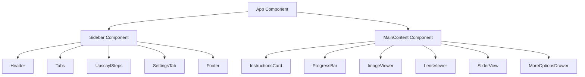
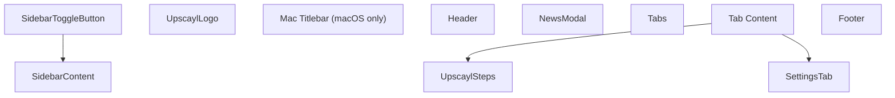
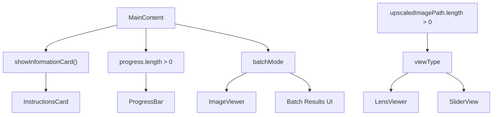
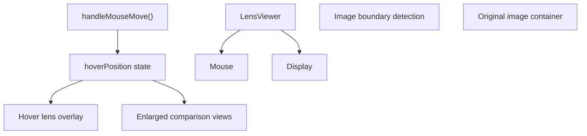

# Main UI Components

Relevant source files

-   [renderer/components/main-content/index.tsx](https://github.com/upscayl/upscayl/blob/1fdbd3e5/renderer/components/main-content/index.tsx)
-   [renderer/components/main-content/instructions-card.tsx](https://github.com/upscayl/upscayl/blob/1fdbd3e5/renderer/components/main-content/instructions-card.tsx)
-   [renderer/components/main-content/lens-view.tsx](https://github.com/upscayl/upscayl/blob/1fdbd3e5/renderer/components/main-content/lens-view.tsx)
-   [renderer/components/sidebar/index.tsx](https://github.com/upscayl/upscayl/blob/1fdbd3e5/renderer/components/sidebar/index.tsx)
-   [renderer/locales/en.json](https://github.com/upscayl/upscayl/blob/1fdbd3e5/renderer/locales/en.json)
-   [renderer/locales/es.json](https://github.com/upscayl/upscayl/blob/1fdbd3e5/renderer/locales/es.json)
-   [renderer/locales/fr.json](https://github.com/upscayl/upscayl/blob/1fdbd3e5/renderer/locales/fr.json)
-   [renderer/locales/ja.json](https://github.com/upscayl/upscayl/blob/1fdbd3e5/renderer/locales/ja.json)
-   [renderer/locales/ru.json](https://github.com/upscayl/upscayl/blob/1fdbd3e5/renderer/locales/ru.json)
-   [renderer/locales/vi.json](https://github.com/upscayl/upscayl/blob/1fdbd3e5/renderer/locales/vi.json)
-   [renderer/locales/zh.json](https://github.com/upscayl/upscayl/blob/1fdbd3e5/renderer/locales/zh.json)

This document covers the main user interface components that make up Upscayl's desktop application interface. It focuses on the React component structure, layout organization, and component interactions within the renderer process.

For information about the overall application architecture and process separation, see [Application Architecture](/upscayl/upscayl/2-application-architecture). For details about state management patterns, see [State Management](/upscayl/upscayl/2.4-state-management). For styling and theming information, see [Styling and Theming](/upscayl/upscayl/4.2-styling-and-theming).

## UI Architecture Overview

Upscayl's user interface is built using React components within the Electron renderer process. The main layout consists of a collapsible sidebar for controls and a main content area for image display and interaction.

### Main Layout Structure

Sources: [renderer/components/sidebar/index.tsx46-261](https://github.com/upscayl/upscayl/blob/1fdbd3e5/renderer/components/sidebar/index.tsx#L46-L261) [renderer/components/main-content/index.tsx48-355](https://github.com/upscayl/upscayl/blob/1fdbd3e5/renderer/components/main-content/index.tsx#L48-L355)

### Component State Management Integration

Sources: [renderer/components/sidebar/index.tsx4-24](https://github.com/upscayl/upscayl/blob/1fdbd3e5/renderer/components/sidebar/index.tsx#L4-L24) [renderer/components/main-content/index.tsx5-13](https://github.com/upscayl/upscayl/blob/1fdbd3e5/renderer/components/main-content/index.tsx#L5-L13)

## Sidebar Component

The `Sidebar` component serves as the primary control interface, containing all user settings and workflow steps. It supports collapsible functionality and adapts to different operating system requirements.

### Core Structure

The sidebar contains two main tabs accessible through the `Tabs` component:

-   **Upscayl Tab** (`selectedTab === 0`): Contains the main workflow steps
-   **Settings Tab** (`selectedTab === 1`): Contains application configuration options

The sidebar's visibility is controlled by the `showSidebarAtom` state and includes responsive behavior with a toggle button positioned outside the sidebar container.

Sources: [renderer/components/sidebar/index.tsx196-260](https://github.com/upscayl/upscayl/blob/1fdbd3e5/renderer/components/sidebar/index.tsx#L196-L260) [renderer/components/sidebar/sidebar-button.tsx](https://github.com/upscayl/upscayl/blob/1fdbd3e5/renderer/components/sidebar/sidebar-button.tsx)

### UpscaylSteps Component

The `UpscaylSteps` component implements the main workflow interface with a four-step process:

| Step | Component | Purpose |
| --- | --- | --- |
| 1 | File Selection | Choose single image or batch folder |
| 2 | Model Selection | Select AI upscaling model |
| 3 | Output Path | Set destination folder |
| 4 | Scale & Execute | Configure scale and start processing |

The component handles mode switching between single image and batch processing through the `batchMode` atom, dynamically updating the interface and available options.

Sources: [renderer/components/sidebar/upscayl-tab/upscayl-steps.tsx](https://github.com/upscayl/upscayl/blob/1fdbd3e5/renderer/components/sidebar/upscayl-tab/upscayl-steps.tsx) [renderer/locales/en.json119-181](https://github.com/upscayl/upscayl/blob/1fdbd3e5/renderer/locales/en.json#L119-L181)

### SettingsTab Component

The `SettingsTab` provides access to advanced configuration options including:

-   GPU settings and custom models
-   Image format and compression options
-   Advanced processing parameters (TTA mode, tile size)
-   Application preferences (notifications, themes, language)

Sources: [renderer/components/sidebar/settings-tab/index.tsx](https://github.com/upscayl/upscayl/blob/1fdbd3e5/renderer/components/sidebar/settings-tab/index.tsx) [renderer/locales/en.json14-111](https://github.com/upscayl/upscayl/blob/1fdbd3e5/renderer/locales/en.json#L14-L111)

## MainContent Component

The `MainContent` component manages the central display area and handles primary user interactions including drag-and-drop, clipboard operations, and image viewing.

### Content Display Logic

The main content dynamically renders different components based on application state:

Sources: [renderer/components/main-content/index.tsx80-94](https://github.com/upscayl/upscayl/blob/1fdbd3e5/renderer/components/main-content/index.tsx#L80-L94) [renderer/components/main-content/index.tsx291-350](https://github.com/upscayl/upscayl/blob/1fdbd3e5/renderer/components/main-content/index.tsx#L291-L350)

### Drag and Drop Implementation

The component implements comprehensive drag-and-drop functionality:

-   **Event Handlers**: `handleDragEnter`, `handleDragLeave`, `handleDragOver`, `handleDrop`
-   **File Validation**: Checks file types against `VALID_IMAGE_FORMATS`
-   **Path Management**: Automatically sets output paths and validates image paths

Sources: [renderer/components/main-content/index.tsx97-163](https://github.com/upscayl/upscayl/blob/1fdbd3e5/renderer/components/main-content/index.tsx#L97-L163)

### Clipboard Integration

Clipboard functionality supports pasting images directly into the application:

-   **Paste Handler**: `handlePaste()` processes clipboard data
-   **File Processing**: Converts clipboard images to base64 and sends to main process
-   **Temporary File Management**: Creates temporary files with timestamp-based naming

Sources: [renderer/components/main-content/index.tsx165-239](https://github.com/upscayl/upscayl/blob/1fdbd3e5/renderer/components/main-content/index.tsx#L165-L239)

## Image Viewing Components

### ImageViewer Component

The basic image viewer displays selected images before processing and handles dimension detection for the application.

Sources: [renderer/components/main-content/image-viewer.tsx](https://github.com/upscayl/upscayl/blob/1fdbd3e5/renderer/components/main-content/image-viewer.tsx)

### LensViewer Component

The `LensViewer` provides an interactive comparison tool with hover-based magnification:

Key features:

-   **4x Zoom Level**: Configurable magnification for detailed comparison
-   **Real-time Positioning**: Calculates mouse position relative to image boundaries
-   **Dual View Display**: Shows both original and upscaled versions simultaneously

Sources: [renderer/components/main-content/lens-view.tsx1-171](https://github.com/upscayl/upscayl/blob/1fdbd3e5/renderer/components/main-content/lens-view.tsx#L1-L171)

### SliderView Component

The `SliderView` provides a side-by-side comparison with an adjustable divider for comparing original and upscaled images.

Sources: [renderer/components/main-content/slider-view.tsx](https://github.com/upscayl/upscayl/blob/1fdbd3e5/renderer/components/main-content/slider-view.tsx)

## Interactive Elements

### MoreOptionsDrawer Component

Provides additional viewing controls and statistics:

-   **View Mode Toggle**: Switch between lens and slider views
-   **Zoom Controls**: Adjust zoom levels for image viewing
-   **Usage Statistics**: Display user statistics from `userStatsAtom`
-   **Reset Functionality**: Clear current image selections

Sources: [renderer/components/main-content/more-options-drawer.tsx](https://github.com/upscayl/upscayl/blob/1fdbd3e5/renderer/components/main-content/more-options-drawer.tsx)

### ProgressBar Component

Displays processing progress with different modes:

-   **Single Image Progress**: Shows individual image processing status
-   **Batch Progress**: Displays batch processing with file counts
-   **Stop Functionality**: Allows users to cancel ongoing operations

The component adapts its display based on the `batchMode` state and `doubleUpscaylCounter` for multi-pass processing.

Sources: [renderer/components/main-content/progress-bar.tsx](https://github.com/upscayl/upscayl/blob/1fdbd3e5/renderer/components/main-content/progress-bar.tsx)

### InstructionsCard Component

Provides contextual guidance to users when no images are loaded:

-   **Mode-Specific Instructions**: Different messages for single vs batch mode
-   **Internationalization**: Uses translation keys for multi-language support
-   **Version Display**: Shows current application version

Sources: [renderer/components/main-content/instructions-card.tsx1-31](https://github.com/upscayl/upscayl/blob/1fdbd3e5/renderer/components/main-content/instructions-card.tsx#L1-L31)

## Platform-Specific Elements

### MacTitlebarDragRegion Component

Handles macOS-specific window management requirements, providing a draggable region for the application window when the sidebar is collapsed.

Sources: [renderer/components/main-content/mac-titlebar-drag-region.tsx](https://github.com/upscayl/upscayl/blob/1fdbd3e5/renderer/components/main-content/mac-titlebar-drag-region.tsx)

### Responsive Behavior

The UI adapts to different screen sizes and platform requirements:

-   **Sidebar Collapsing**: Maintains functionality on smaller screens
-   **Touch Support**: Responsive design for touch-capable devices
-   **Platform Detection**: Conditional rendering based on `window.electron.platform`

Sources: [renderer/components/sidebar/index.tsx216-218](https://github.com/upscayl/upscayl/blob/1fdbd3e5/renderer/components/sidebar/index.tsx#L216-L218)
