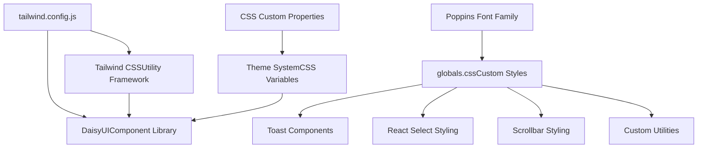
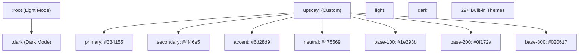
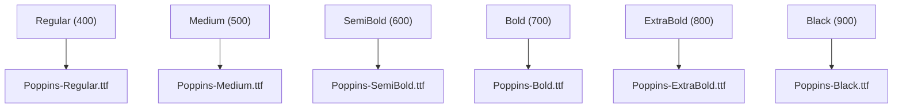
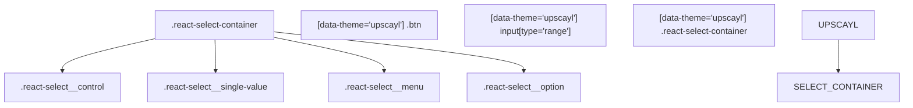
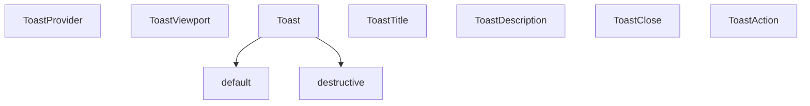
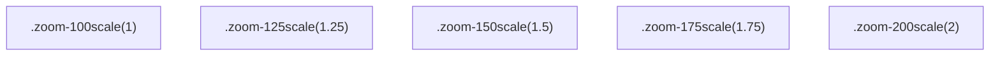
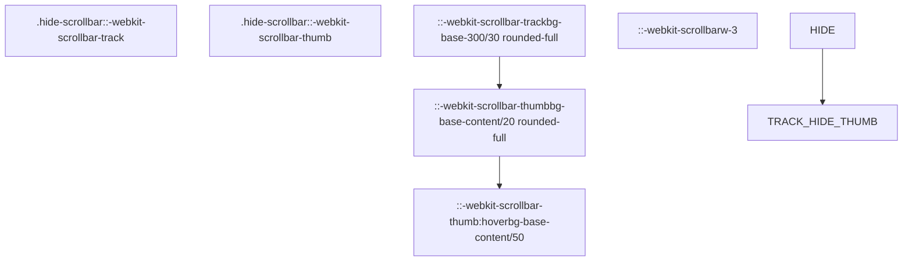

# Styling and Theming

Relevant source files

-   [renderer/components/ui/toast.tsx](https://github.com/upscayl/upscayl/blob/1fdbd3e5/renderer/components/ui/toast.tsx)
-   [renderer/components/ui/toaster.tsx](https://github.com/upscayl/upscayl/blob/1fdbd3e5/renderer/components/ui/toaster.tsx)
-   [renderer/components/ui/use-toast.ts](https://github.com/upscayl/upscayl/blob/1fdbd3e5/renderer/components/ui/use-toast.ts)
-   [renderer/public/Upscayl New Page.png](https://github.com/upscayl/upscayl/blob/1fdbd3e5/renderer/public/Upscayl New Page.png)
-   [renderer/public/down-arrow.svg](https://github.com/upscayl/upscayl/blob/1fdbd3e5/renderer/public/down-arrow.svg)
-   [renderer/styles/globals.css](https://github.com/upscayl/upscayl/blob/1fdbd3e5/renderer/styles/globals.css)
-   [tailwind.config.js](https://github.com/upscayl/upscayl/blob/1fdbd3e5/tailwind.config.js)

This document covers Upscayl's styling and theming system, which is built on Tailwind CSS and DaisyUI. The system provides a cohesive visual design with support for multiple themes, custom typography, and specialized component styling. For information about UI components and their behavior, see [Main UI Components](/upscayl/upscayl/4.1-main-ui-components).

## Styling Architecture

Upscayl uses a layered styling approach that combines Tailwind CSS as the foundation, DaisyUI for component styling, and custom CSS for application-specific needs.

Sources: [tailwind.config.js1-159](https://github.com/upscayl/upscayl/blob/1fdbd3e5/tailwind.config.js#L1-L159) [renderer/styles/globals.css38-40](https://github.com/upscayl/upscayl/blob/1fdbd3e5/renderer/styles/globals.css#L38-L40)

## Theme System

The application implements a comprehensive theming system using CSS custom properties and DaisyUI's theme configuration. The primary theme is a custom "upscayl" theme with specific color schemes for both light and dark modes.

### Theme Configuration

The theme system supports dynamic switching between light and dark modes through CSS class toggling on the root element.

Sources: [tailwind.config.js105-127](https://github.com/upscayl/upscayl/blob/1fdbd3e5/tailwind.config.js#L105-L127) [renderer/styles/globals.css50-110](https://github.com/upscayl/upscayl/blob/1fdbd3e5/renderer/styles/globals.css#L50-L110)

### Color System Integration

The Tailwind configuration maps DaisyUI color tokens to semantic color names, creating a bridge between the utility framework and the component library:

| Semantic Name | DaisyUI Token | Purpose |
| --- | --- | --- |
| `background` | `base-100` | Main background color |
| `foreground` | `base-content` | Primary text color |
| `border` | `primary` | Border elements |
| `destructive` | `error` | Error states |
| `muted` | `base-300` | Subdued elements |

Sources: [tailwind.config.js43-77](https://github.com/upscayl/upscayl/blob/1fdbd3e5/tailwind.config.js#L43-L77)

## Typography

The application uses the Poppins font family with multiple weight variants loaded through custom `@font-face` declarations.

### Font Loading Configuration

All elements receive the Poppins font family by default through the base layer styling: `font-family: "Poppins", sans-serif`.

Sources: [renderer/styles/globals.css1-36](https://github.com/upscayl/upscayl/blob/1fdbd3e5/renderer/styles/globals.css#L1-L36) [renderer/styles/globals.css42-46](https://github.com/upscayl/upscayl/blob/1fdbd3e5/renderer/styles/globals.css#L42-L46)

## Component Styling

### React Select Components

The application includes comprehensive styling for `react-select` components to match the overall theme:

The styling ensures consistent appearance across different theme contexts with specific overrides for the custom "upscayl" theme.

Sources: [renderer/styles/globals.css144-177](https://github.com/upscayl/upscayl/blob/1fdbd3e5/renderer/styles/globals.css#L144-L177) [renderer/styles/globals.css208-230](https://github.com/upscayl/upscayl/blob/1fdbd3e5/renderer/styles/globals.css#L208-L230)

### Toast Notification Styling

The toast system uses Radix UI primitives with custom styling through class variance authority (CVA):

Sources: [renderer/components/ui/toast.tsx25-39](https://github.com/upscayl/upscayl/blob/1fdbd3e5/renderer/components/ui/toast.tsx#L25-L39) [renderer/components/ui/toaster.tsx11-33](https://github.com/upscayl/upscayl/blob/1fdbd3e5/renderer/components/ui/toaster.tsx#L11-L33)

## Custom Utilities and Animations

### Utility Classes

The application defines several custom utility classes for common patterns:

| Class | Purpose | Implementation |
| --- | --- | --- |
| `.animate` | Standard transition | `transition-all duration-300 ease-in-out` |
| `.step-heading` | Section headings | `mb-2 font-semibold` |
| `.full-width` | Full width elements | `w-full` |
| `.hide-scrollbar` | Hide scrollbar | Webkit scrollbar styling |

### Zoom Transformations

Custom zoom classes provide precise scaling control:

Sources: [renderer/styles/globals.css136-186](https://github.com/upscayl/upscayl/blob/1fdbd3e5/renderer/styles/globals.css#L136-L186) [renderer/styles/globals.css188-202](https://github.com/upscayl/upscayl/blob/1fdbd3e5/renderer/styles/globals.css#L188-L202)

### Animation Keyframes

The system includes custom animations for enhanced user experience:

-   **animate-step-in**: Fade and slide animation for step transitions
-   **sk-rotateplane**: 3D rotation animation for loading spinners
-   **marquee/marquee2**: Scrolling text animations

Sources: [renderer/styles/globals.css204-306](https://github.com/upscayl/upscayl/blob/1fdbd3e5/renderer/styles/globals.css#L204-L306) [tailwind.config.js19-32](https://github.com/upscayl/upscayl/blob/1fdbd3e5/tailwind.config.js#L19-L32)

## Scrollbar Customization

Custom scrollbar styling provides a consistent look across the application:

Sources: [renderer/styles/globals.css111-134](https://github.com/upscayl/upscayl/blob/1fdbd3e5/renderer/styles/globals.css#L111-L134)

## Platform-Specific Styling

### macOS Integration

The application includes platform-specific styling for macOS integration:

-   **mac-titlebar**: Enables window dragging with `-webkit-app-region: drag`
-   **checkerboard**: Transparency pattern background for image viewing

Sources: [renderer/styles/globals.css236-260](https://github.com/upscayl/upscayl/blob/1fdbd3e5/renderer/styles/globals.css#L236-L260)
