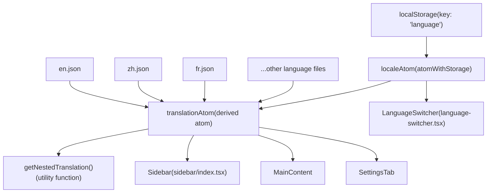
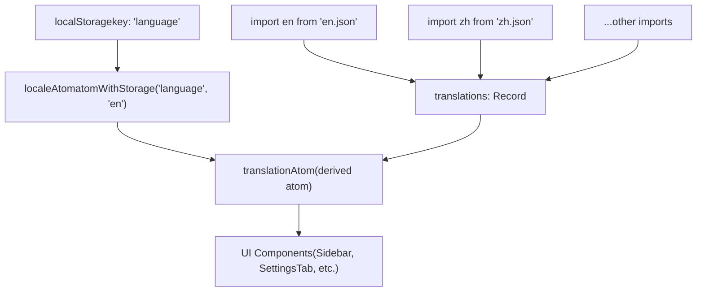
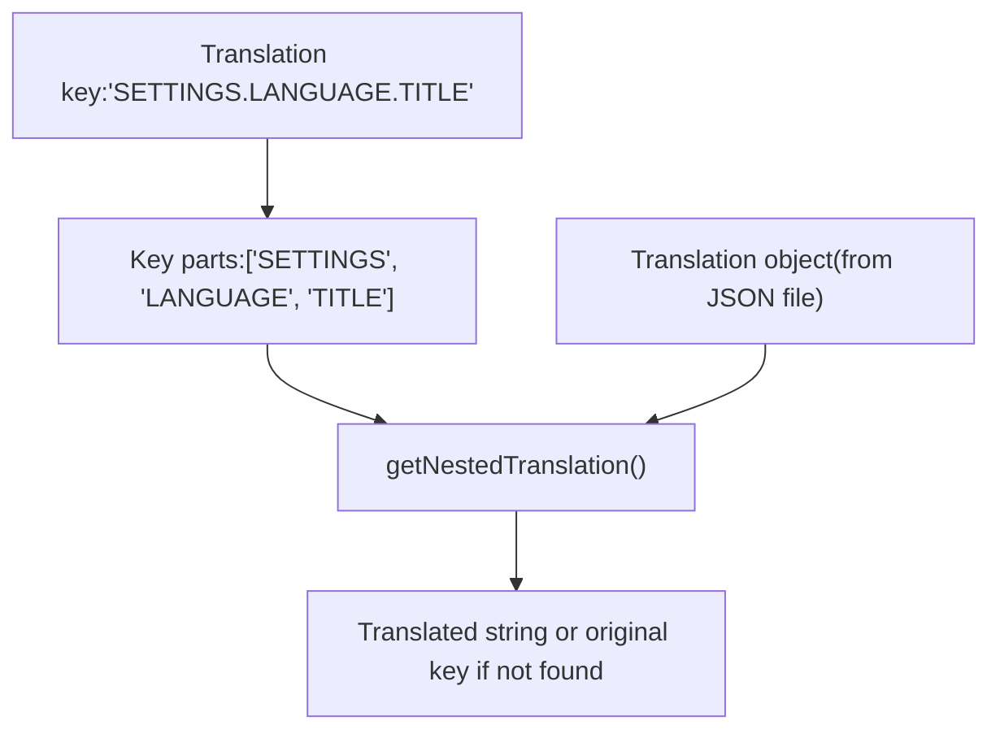
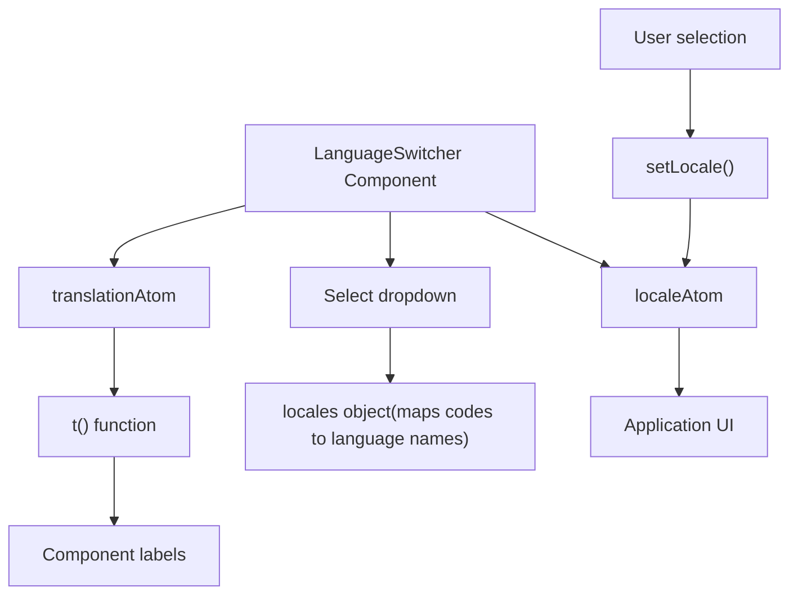
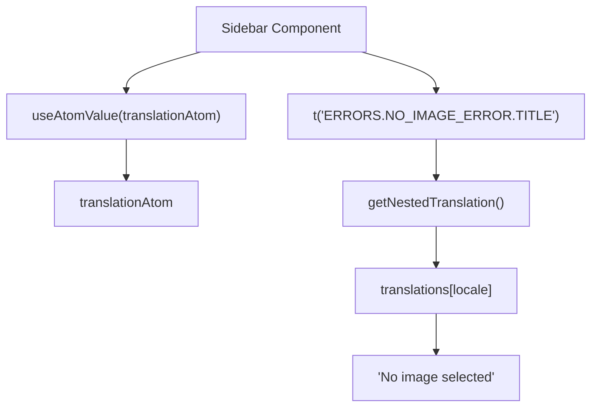
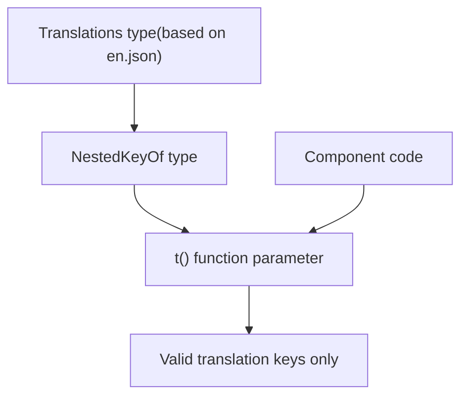
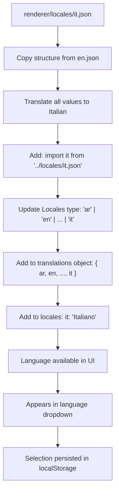

# Internationalization

Relevant source files

-   [renderer/atoms/translations-atom.ts](https://github.com/upscayl/upscayl/blob/1fdbd3e5/renderer/atoms/translations-atom.ts)
-   [renderer/components/sidebar/index.tsx](https://github.com/upscayl/upscayl/blob/1fdbd3e5/renderer/components/sidebar/index.tsx)
-   [renderer/components/sidebar/settings-tab/language-switcher.tsx](https://github.com/upscayl/upscayl/blob/1fdbd3e5/renderer/components/sidebar/settings-tab/language-switcher.tsx)
-   [renderer/locales/ar.json](https://github.com/upscayl/upscayl/blob/1fdbd3e5/renderer/locales/ar.json)
-   [renderer/locales/ca-val.json](https://github.com/upscayl/upscayl/blob/1fdbd3e5/renderer/locales/ca-val.json)
-   [renderer/locales/de.json](https://github.com/upscayl/upscayl/blob/1fdbd3e5/renderer/locales/de.json)
-   [renderer/locales/en.json](https://github.com/upscayl/upscayl/blob/1fdbd3e5/renderer/locales/en.json)
-   [renderer/locales/es.json](https://github.com/upscayl/upscayl/blob/1fdbd3e5/renderer/locales/es.json)
-   [renderer/locales/fr.json](https://github.com/upscayl/upscayl/blob/1fdbd3e5/renderer/locales/fr.json)
-   [renderer/locales/id.json](https://github.com/upscayl/upscayl/blob/1fdbd3e5/renderer/locales/id.json)
-   [renderer/locales/it.json](https://github.com/upscayl/upscayl/blob/1fdbd3e5/renderer/locales/it.json)
-   [renderer/locales/ja.json](https://github.com/upscayl/upscayl/blob/1fdbd3e5/renderer/locales/ja.json)
-   [renderer/locales/pt-br.json](https://github.com/upscayl/upscayl/blob/1fdbd3e5/renderer/locales/pt-br.json)
-   [renderer/locales/ru.json](https://github.com/upscayl/upscayl/blob/1fdbd3e5/renderer/locales/ru.json)
-   [renderer/locales/tr.json](https://github.com/upscayl/upscayl/blob/1fdbd3e5/renderer/locales/tr.json)
-   [renderer/locales/uk.json](https://github.com/upscayl/upscayl/blob/1fdbd3e5/renderer/locales/uk.json)
-   [renderer/locales/vi.json](https://github.com/upscayl/upscayl/blob/1fdbd3e5/renderer/locales/vi.json)
-   [renderer/locales/zh.json](https://github.com/upscayl/upscayl/blob/1fdbd3e5/renderer/locales/zh.json)

This page documents the internationalization (i18n) system in Upscayl, which allows the application to present its user interface in multiple languages. The system provides mechanisms for storing translations, selecting languages, and accessing translated strings throughout the application.

## Overview

Upscayl uses a JSON-based translation system with Jotai atoms for state management. The internationalization system is designed to be type-safe and easy to use within React components. Translations are organized in a hierarchical structure, allowing for logical grouping of strings by feature area.

**Internationalization System Architecture**


Sources:

-   [renderer/atoms/translations-atom.ts](https://github.com/upscayl/upscayl/blob/1fdbd3e5/renderer/atoms/translations-atom.ts)
-   [renderer/components/sidebar/settings-tab/language-switcher.tsx](https://github.com/upscayl/upscayl/blob/1fdbd3e5/renderer/components/sidebar/settings-tab/language-switcher.tsx)

## Supported Languages

Upscayl currently supports the following languages:

| Locale Code | Language Name | Translation File |
| --- | --- | --- |
| ar | العربية | ar.json |
| en | English | en.json |
| tr | Türkçe | tr.json |
| ru | Русский | ru.json |
| uk | Українська | uk.json |
| ja | 日本語 | ja.json |
| zh | 简体中文 | zh.json |
| es | Español | es.json |
| fr | Français | fr.json |
| de | Deutsch | de.json |
| vi | Tiếng Việt | vi.json |
| pt | Português (Portugal) | pt.json |
| ptBR | Português (Brasil) | pt-br.json |
| id | Bahasa Indonesia | id.json |
| caVAL | Català (Valencià) | ca-val.json |

These languages are defined in the `locales` object in `LanguageSwitcher` and as the `Locales` type in `translations-atom.ts`. Each language has a corresponding JSON file in the `renderer/locales/` directory.

Sources:

-   [renderer/components/sidebar/settings-tab/language-switcher.tsx4-20](https://github.com/upscayl/upscayl/blob/1fdbd3e5/renderer/components/sidebar/settings-tab/language-switcher.tsx#L4-L20)
-   [renderer/atoms/translations-atom.ts21](https://github.com/upscayl/upscayl/blob/1fdbd3e5/renderer/atoms/translations-atom.ts#L21-L21)
-   [renderer/atoms/translations-atom.ts2-16](https://github.com/upscayl/upscayl/blob/1fdbd3e5/renderer/atoms/translations-atom.ts#L2-L16)

## Translation State Management

The internationalization system is built around two key Jotai atoms:

1.  `localeAtom`: Stores the currently selected locale code (e.g., "en", "fr")
2.  `translationAtom`: Provides a function that returns translated strings based on the current locale

**Translation State Flow**


The `localeAtom` uses Jotai's `atomWithStorage` to persist the user's language preference in localStorage, ensuring that the selected language is remembered between sessions. The `translationAtom` is a derived atom that uses the current locale to provide a translation function.

Sources:

-   [renderer/atoms/translations-atom.ts69-87](https://github.com/upscayl/upscayl/blob/1fdbd3e5/renderer/atoms/translations-atom.ts#L69-L87)

### Translation Files Structure

Each language is defined in a JSON file in the `renderer/locales/` directory, with a hierarchical structure of keys and translated values. The structure includes major sections for different parts of the application:

```
{  "TITLE": "Upscayl",  "INTRO": "Introducing Upscayl Cloud!",  "HEADER": {    "GITHUB_BUTTON_TITLE": "Star us on GitHub 😁",    "DESCRIPTION": "AI Image Upscaler"  },  "SETTINGS": {    "TITLE": "Settings",    "LANGUAGE": {      "TITLE": "UPSCAYL LANGUAGE"    },    "THEME": {      "TITLE": "UPSCAYL THEME"    }  },  "APP": {    "TITLE": "Upscayl",    "PROGRESS": {      "WAIT_TITLE": "Hold on...",      "SUCCESS_TITLE": "Upscayl Successful!"    }  },  "ERRORS": {    "NO_IMAGE_ERROR": {      "TITLE": "No image selected",      "DESCRIPTION": "Please select an image to upscale"    }  }}
```
The English translation file (`en.json`) serves as the reference model for all other languages. Each language file follows the same structure but with translated values for each key. The `translations` object in `translations-atom.ts` imports all language files and provides type safety through the `Translations` type.

Sources:

-   [renderer/locales/en.json1-313](https://github.com/upscayl/upscayl/blob/1fdbd3e5/renderer/locales/en.json#L1-L313)
-   [renderer/locales/zh.json1-313](https://github.com/upscayl/upscayl/blob/1fdbd3e5/renderer/locales/zh.json#L1-L313)
-   [renderer/locales/fr.json1-313](https://github.com/upscayl/upscayl/blob/1fdbd3e5/renderer/locales/fr.json#L1-L313)
-   [renderer/atoms/translations-atom.ts20-39](https://github.com/upscayl/upscayl/blob/1fdbd3e5/renderer/atoms/translations-atom.ts#L20-L39)

### Translation Resolution

The system uses dot notation to access nested translations. For example, `"SETTINGS.LANGUAGE.TITLE"` would retrieve the translation at `translations[locale].SETTINGS.LANGUAGE.TITLE`.

The `getNestedTranslation` function handles this resolution:


The function splits the key by dots, then traverses the translation object using the resulting parts. If the key is not found, it returns the original key as a fallback.

Sources:

-   [renderer/atoms/translations-atom.ts51-66](https://github.com/upscayl/upscayl/blob/1fdbd3e5/renderer/atoms/translations-atom.ts#L51-L66)

## Language Switcher Component

The `LanguageSwitcher` component provides a user interface for changing the application language:


The component sorts languages alphabetically by their display name and updates the locale atom when a user selects a new language. It also uses the translation function to display the label for the language selector in the current language.

Sources:

-   [renderer/components/sidebar/settings-tab/language-switcher.tsx22-52](https://github.com/upscayl/upscayl/blob/1fdbd3e5/renderer/components/sidebar/settings-tab/language-switcher.tsx#L22-L52)

## Using Translations in Components

Components access translations by using `useAtomValue(translationAtom)` to get the translation function. The translation function returns translated strings based on the current locale:

```
// Example usage in a componentconst t = useAtomValue(translationAtom); // Basic translation<p>{t("APP.PROGRESS.WAIT_TITLE")}</p>  // "Hold on..." // Translation with parameterst("UPSCAYL_CLOUD.ALREADY_REGISTERED_ALERT", { name: userName })// Replaces {name} in "Thank you {name}! It seems..." with userName value
```
**Component Translation Usage Pattern**


Real examples from the codebase include error messages in `Sidebar` component and toast notifications throughout the application. The translation function supports parameter substitution by replacing `{paramName}` placeholders with values from the provided parameters object.

Sources:

-   [renderer/components/sidebar/index.tsx66](https://github.com/upscayl/upscayl/blob/1fdbd3e5/renderer/components/sidebar/index.tsx#L66-L66)
-   [renderer/components/sidebar/index.tsx188-192](https://github.com/upscayl/upscayl/blob/1fdbd3e5/renderer/components/sidebar/index.tsx#L188-L192)
-   [renderer/atoms/translations-atom.ts72-87](https://github.com/upscayl/upscayl/blob/1fdbd3e5/renderer/atoms/translations-atom.ts#L72-L87)
-   [renderer/atoms/translations-atom.ts82-85](https://github.com/upscayl/upscayl/blob/1fdbd3e5/renderer/atoms/translations-atom.ts#L82-L85)

## Type Safety

The system ensures type safety for translation keys through TypeScript:

1.  Translation files are imported and typed as `Translations`
2.  A `NestedKeyOf<Translations>` type creates all possible valid key paths
3.  The translation function requires keys to match this type


This type system prevents errors from using invalid translation keys by providing compile-time checking. The `NestedKeyOf` type recursively generates all possible dot-notation paths through the translation object.

Sources:

-   [renderer/atoms/translations-atom.ts20-48](https://github.com/upscayl/upscayl/blob/1fdbd3e5/renderer/atoms/translations-atom.ts#L20-L48)
-   [renderer/atoms/translations-atom.ts42-48](https://github.com/upscayl/upscayl/blob/1fdbd3e5/renderer/atoms/translations-atom.ts#L42-L48)

## Translation Flow

When a component needs to display translated text, the following process occurs:

> **[Mermaid sequence]**
> *(图表结构无法解析)*

The translation function also supports parameter substitution, replacing placeholders like `{name}` with values from the provided parameters object.

Sources:

-   [renderer/atoms/translations-atom.ts72-87](https://github.com/upscayl/upscayl/blob/1fdbd3e5/renderer/atoms/translations-atom.ts#L72-L87)
-   [renderer/atoms/translations-atom.ts51-66](https://github.com/upscayl/upscayl/blob/1fdbd3e5/renderer/atoms/translations-atom.ts#L51-L66)
-   [renderer/atoms/translations-atom.ts82-85](https://github.com/upscayl/upscayl/blob/1fdbd3e5/renderer/atoms/translations-atom.ts#L82-L85)

## Adding a New Language

To add support for a new language (e.g., Italian):

1.  **Create translation file**: `renderer/locales/it.json` following the structure of `en.json`
2.  **Update translations-atom.ts**:
    -   Add import: `import it from "../locales/it.json";`
    -   Add to `Locales` type: `"ar" | "en" | ... | "it"`
    -   Add to `translations` object: `{ ar, en, ..., it }`
3.  **Update language-switcher.tsx**:
    -   Add to `locales` object: `it: "Italiano"`

**New Language Integration Steps**


The new language will automatically be available in the `LanguageSwitcher` dropdown and properly typed throughout the application.

Sources:

-   [renderer/atoms/translations-atom.ts2-16](https://github.com/upscayl/upscayl/blob/1fdbd3e5/renderer/atoms/translations-atom.ts#L2-L16)
-   [renderer/atoms/translations-atom.ts21](https://github.com/upscayl/upscayl/blob/1fdbd3e5/renderer/atoms/translations-atom.ts#L21-L21)
-   [renderer/atoms/translations-atom.ts23-39](https://github.com/upscayl/upscayl/blob/1fdbd3e5/renderer/atoms/translations-atom.ts#L23-L39)
-   [renderer/components/sidebar/settings-tab/language-switcher.tsx4-20](https://github.com/upscayl/upscayl/blob/1fdbd3e5/renderer/components/sidebar/settings-tab/language-switcher.tsx#L4-L20)

## Language Persistence

The system uses `atomWithStorage` from Jotai to persist the user's language preference in localStorage, ensuring that the selected language is remembered between sessions:

```
export const localeAtom = atomWithStorage<Locales>("language", "en");
```
This creates an atom that reads its initial value from localStorage (using the key "language") and defaults to "en" if no value is found. Any updates to this atom are automatically persisted to localStorage.

Sources:

-   [renderer/atoms/translations-atom.ts69](https://github.com/upscayl/upscayl/blob/1fdbd3e5/renderer/atoms/translations-atom.ts#L69-L69)
-   [renderer/atoms/translations-atom.ts17](https://github.com/upscayl/upscayl/blob/1fdbd3e5/renderer/atoms/translations-atom.ts#L17-L17)

## Example: Language Switching Flow

When a user changes the application language, the following sequence occurs:

> **[Mermaid sequence]**
> *(图表结构无法解析)*

Sources:

-   [renderer/components/sidebar/settings-tab/language-switcher.tsx36](https://github.com/upscayl/upscayl/blob/1fdbd3e5/renderer/components/sidebar/settings-tab/language-switcher.tsx#L36-L36)
-   [renderer/atoms/translations-atom.ts69](https://github.com/upscayl/upscayl/blob/1fdbd3e5/renderer/atoms/translations-atom.ts#L69-L69)

By using this internationalization system, Upscayl provides a consistent user experience across multiple languages while maintaining type safety and performance.
