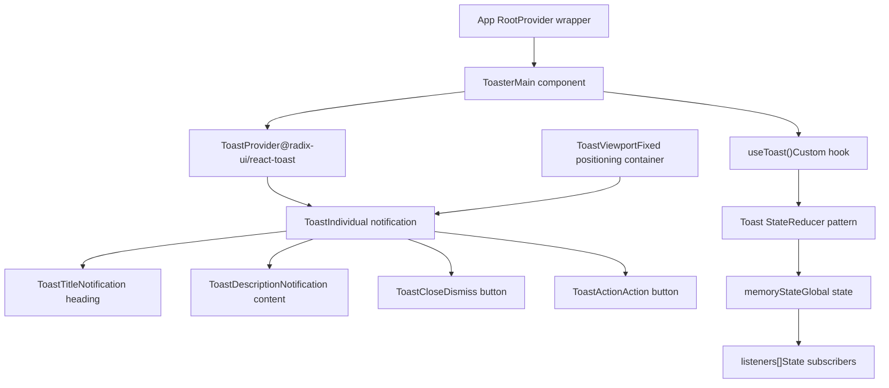
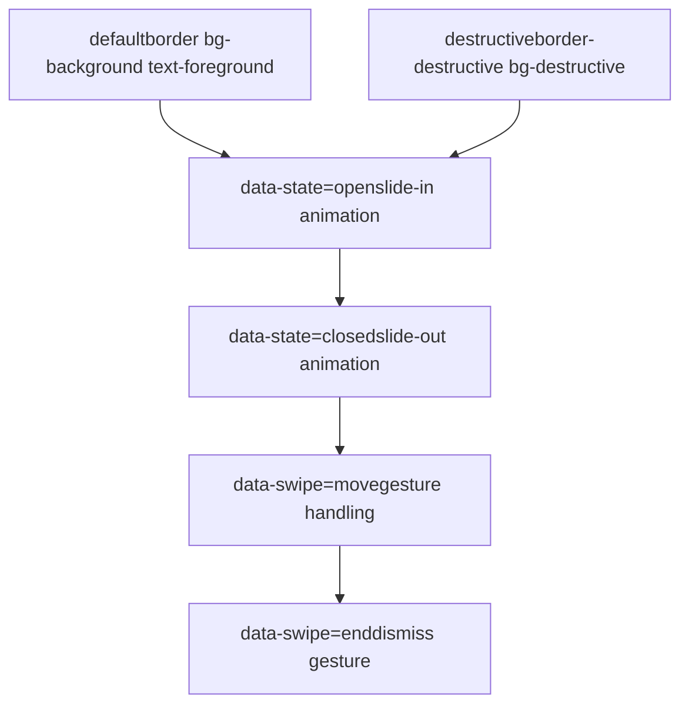
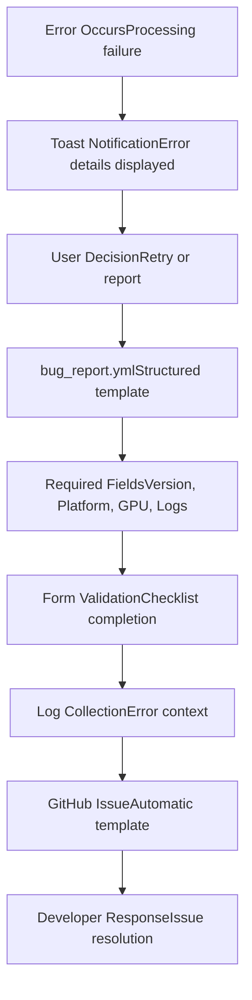
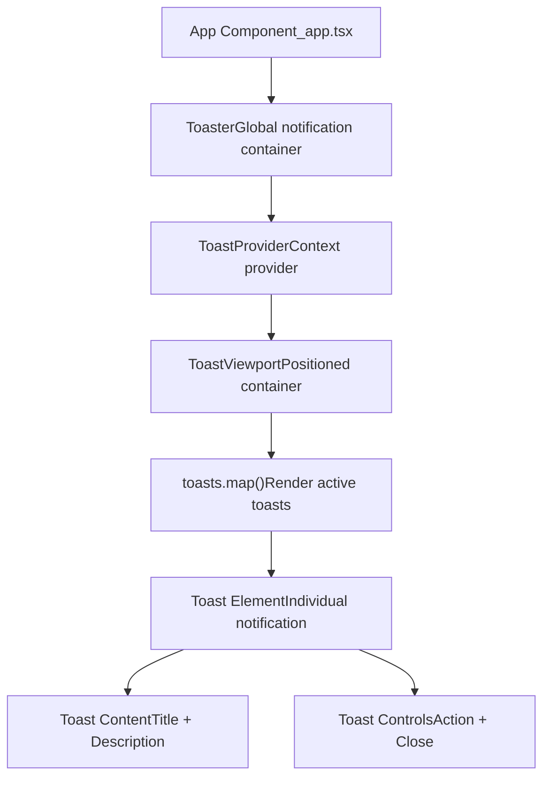

# Notifications and Feedback

Relevant source files

-   [.github/ISSUE\_TEMPLATE/bug\_report.yml](https://github.com/upscayl/upscayl/blob/1fdbd3e5/.github/ISSUE_TEMPLATE/bug_report.yml)
-   [renderer/components/ui/toast.tsx](https://github.com/upscayl/upscayl/blob/1fdbd3e5/renderer/components/ui/toast.tsx)
-   [renderer/components/ui/toaster.tsx](https://github.com/upscayl/upscayl/blob/1fdbd3e5/renderer/components/ui/toaster.tsx)
-   [renderer/components/ui/use-toast.ts](https://github.com/upscayl/upscayl/blob/1fdbd3e5/renderer/components/ui/use-toast.ts)
-   [renderer/public/Upscayl New Page.png](https://github.com/upscayl/upscayl/blob/1fdbd3e5/renderer/public/Upscayl New Page.png)

This document covers the user feedback mechanisms in Upscayl, including the toast notification system, progress indicators, and error handling. These systems provide immediate visual feedback to users during image processing operations and general application interactions.

For information about styling and theming of these UI components, see [Styling and Theming](/upscayl/upscayl/4.2-styling-and-theming). For details about the main UI components that display this feedback, see [Main UI Components](/upscayl/upscayl/4.1-main-ui-components).

## Toast Notification System

Upscayl implements a sophisticated toast notification system using Radix UI primitives with custom state management. The system is designed to provide non-intrusive feedback to users about application status, errors, and operation results.

### Core Components Architecture


Sources: [renderer/components/ui/toast.tsx1-127](https://github.com/upscayl/upscayl/blob/1fdbd3e5/renderer/components/ui/toast.tsx#L1-L127) [renderer/components/ui/toaster.tsx1-33](https://github.com/upscayl/upscayl/blob/1fdbd3e5/renderer/components/ui/toaster.tsx#L1-L33) [renderer/components/ui/use-toast.ts1-192](https://github.com/upscayl/upscayl/blob/1fdbd3e5/renderer/components/ui/use-toast.ts#L1-L192)

### Toast State Management

The toast system uses a custom reducer-based state management approach with the following key characteristics:

| Feature | Implementation | Value |
| --- | --- | --- |
| **Toast Limit** | `TOAST_LIMIT` | 1 notification at a time |
| **Removal Delay** | `TOAST_REMOVE_DELAY` | 1,000,000ms (persistent) |
| **State Pattern** | Reducer with actions | ADD, UPDATE, DISMISS, REMOVE |
| **ID Generation** | Incremental counter | Thread-safe counting |

The state management follows this flow:

Sources: [renderer/components/ui/use-toast.ts75-128](https://github.com/upscayl/upscayl/blob/1fdbd3e5/renderer/components/ui/use-toast.ts#L75-L128) [renderer/components/ui/use-toast.ts9-10](https://github.com/upscayl/upscayl/blob/1fdbd3e5/renderer/components/ui/use-toast.ts#L9-L10)

### Toast Variants and Styling

The toast system supports multiple visual variants through the `toastVariants` configuration:


Sources: [renderer/components/ui/toast.tsx25-39](https://github.com/upscayl/upscayl/blob/1fdbd3e5/renderer/components/ui/toast.tsx#L25-L39)

## Progress Feedback Integration

While the specific progress indicator implementations are handled by other UI components, the toast system provides a foundation for progress-related notifications during image upscaling operations.

### Progress Update Flow

> **[Mermaid sequence]**
> *(图表结构无法解析)*

Sources: [renderer/components/ui/use-toast.ts143-170](https://github.com/upscayl/upscayl/blob/1fdbd3e5/renderer/components/ui/use-toast.ts#L143-L170)

## Error Handling and User Feedback

The notification system provides standardized error reporting mechanisms that integrate with the application's error handling patterns.

### Error Feedback Patterns

| Error Type | Toast Configuration | User Action |
| --- | --- | --- |
| **Processing Errors** | `variant: "destructive"` | Retry operation |
| **File System Errors** | `variant: "destructive"` | Check permissions |
| **GPU/Hardware Errors** | `variant: "destructive"` | Check hardware |
| **Network Errors** | `variant: "default"` | Retry connection |

### Bug Report Integration

The application's feedback system is designed to work with the structured bug reporting template:


Sources: [.github/ISSUE\_TEMPLATE/bug\_report.yml1-78](https://github.com/upscayl/upscayl/blob/1fdbd3e5/.github/ISSUE_TEMPLATE/bug_report.yml#L1-L78)

## Implementation Details

### Toast Hook Usage Pattern

The `useToast` hook provides a React-friendly interface for triggering notifications:

```
// Basic usage pattern from the codebaseconst { toast } = useToast(); // Success notificationtoast({  title: "Processing Complete",  description: "Image upscaled successfully"}); // Error notification  toast({  variant: "destructive",  title: "Processing Failed",  description: "Check logs for details"});
```
### Component Integration

The toast system integrates with the application through the `Toaster` component:


Sources: [renderer/components/ui/toaster.tsx11-32](https://github.com/upscayl/upscayl/blob/1fdbd3e5/renderer/components/ui/toaster.tsx#L11-L32)

### Configuration Constants

The toast system behavior is controlled by key constants:

-   **TOAST\_LIMIT**: Set to `1` to prevent notification overflow
-   **TOAST\_REMOVE\_DELAY**: Set to `1000000` (1000 seconds) for persistent notifications
-   **Positioning**: Fixed viewport at top on mobile, bottom-right on desktop

Sources: [renderer/components/ui/use-toast.ts9-10](https://github.com/upscayl/upscayl/blob/1fdbd3e5/renderer/components/ui/use-toast.ts#L9-L10) [renderer/components/ui/toast.tsx16-21](https://github.com/upscayl/upscayl/blob/1fdbd3e5/renderer/components/ui/toast.tsx#L16-L21)

This notification system provides a robust foundation for user feedback throughout the Upscayl application, ensuring users receive appropriate visual feedback for all application states and operations.
