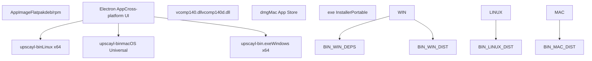
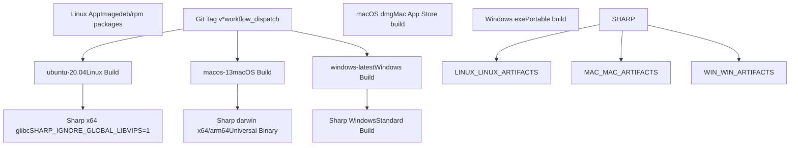
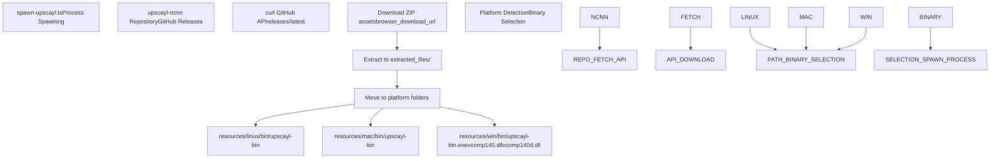

# Platform Support

Relevant source files

-   [.github/workflows/main.yml](https://github.com/upscayl/upscayl/blob/1fdbd3e5/.github/workflows/main.yml)
-   [download.jpg](https://github.com/upscayl/upscayl/blob/1fdbd3e5/download.jpg)
-   [resources/linux/bin/upscayl-bin](https://github.com/upscayl/upscayl/blob/1fdbd3e5/resources/linux/bin/upscayl-bin)
-   [resources/mac/bin/upscayl-bin](https://github.com/upscayl/upscayl/blob/1fdbd3e5/resources/mac/bin/upscayl-bin)
-   [resources/win/bin/upscayl-bin.exe](https://github.com/upscayl/upscayl/blob/1fdbd3e5/resources/win/bin/upscayl-bin.exe)
-   [resources/win/bin/vcomp140.dll](https://github.com/upscayl/upscayl/blob/1fdbd3e5/resources/win/bin/vcomp140.dll)
-   [resources/win/bin/vcomp140d.dll](https://github.com/upscayl/upscayl/blob/1fdbd3e5/resources/win/bin/vcomp140d.dll)
-   [screen1.png](https://github.com/upscayl/upscayl/blob/1fdbd3e5/screen1.png)
-   [update\_upscayl\_ncnn\_binaries.sh](https://github.com/upscayl/upscayl/blob/1fdbd3e5/update_upscayl_ncnn_binaries.sh)

This document covers Upscayl's cross-platform architecture, build system, and platform-specific implementations. It details how the application supports Windows, macOS, and Linux through automated builds, platform-specific binary distribution, and multiple packaging formats.

For information about the overall application architecture, see [Application Architecture](/upscayl/upscayl/2-application-architecture). For details about the build and deployment processes, see [Build and Deployment](/upscayl/upscayl/6-build-and-deployment).

## Supported Platforms Overview

Upscayl provides native support for three major desktop platforms through a combination of Electron's cross-platform capabilities and platform-specific AI processing binaries.


**Sources:** [.github/workflows/main.yml11-69](https://github.com/upscayl/upscayl/blob/1fdbd3e5/.github/workflows/main.yml#L11-L69) [resources/linux/bin/upscayl-bin](https://github.com/upscayl/upscayl/blob/1fdbd3e5/resources/linux/bin/upscayl-bin) [resources/mac/bin/upscayl-bin](https://github.com/upscayl/upscayl/blob/1fdbd3e5/resources/mac/bin/upscayl-bin) [resources/win/bin/upscayl-bin.exe](https://github.com/upscayl/upscayl/blob/1fdbd3e5/resources/win/bin/upscayl-bin.exe)

## Build System Architecture

The platform support is orchestrated through GitHub Actions workflows that handle cross-platform builds, dependency management, and distribution packaging.


**Sources:** [.github/workflows/main.yml4-8](https://github.com/upscayl/upscayl/blob/1fdbd3e5/.github/workflows/main.yml#L4-L8) [.github/workflows/main.yml11-28](https://github.com/upscayl/upscayl/blob/1fdbd3e5/.github/workflows/main.yml#L11-L28) [.github/workflows/main.yml30-52](https://github.com/upscayl/upscayl/blob/1fdbd3e5/.github/workflows/main.yml#L30-L52) [.github/workflows/main.yml54-68](https://github.com/upscayl/upscayl/blob/1fdbd3e5/.github/workflows/main.yml#L54-L68)

### Platform-Specific Build Configuration

Each platform requires specific build configurations and dependencies:

| Platform | Runner | Node Version | Special Dependencies | Build Command |
| --- | --- | --- | --- | --- |
| Linux | `ubuntu-20.04` | 18 | `elfutils`, `rpm`, `node-gyp` | `npm run publish-linux-app` |
| macOS | `macos-13` | 18 | Code signing certificates, provisioning profile | `npm run publish-mac-universal-app` |
| Windows | `windows-latest` | 18 | None | `npm run publish-win-app` |

**Sources:** [.github/workflows/main.yml12-13](https://github.com/upscayl/upscayl/blob/1fdbd3e5/.github/workflows/main.yml#L12-L13) [.github/workflows/main.yml31-32](https://github.com/upscayl/upscayl/blob/1fdbd3e5/.github/workflows/main.yml#L31-L32) [.github/workflows/main.yml55-56](https://github.com/upscayl/upscayl/blob/1fdbd3e5/.github/workflows/main.yml#L55-L56)

## Platform-Specific Binary Management

The core AI processing functionality relies on platform-specific `upscayl-ncnn` binaries that are distributed through the `upscayl-ncnn` repository and integrated into the main application.


**Sources:** [update\_upscayl\_ncnn\_binaries.sh3-11](https://github.com/upscayl/upscayl/blob/1fdbd3e5/update_upscayl_ncnn_binaries.sh#L3-L11) [update\_upscayl\_ncnn\_binaries.sh20-35](https://github.com/upscayl/upscayl/blob/1fdbd3e5/update_upscayl_ncnn_binaries.sh#L20-L35)

### Binary Update Automation

The `update_upscayl_ncnn_binaries.sh` script automates the process of fetching and organizing platform-specific binaries:

```
# Fetch latest release assetsassets_url=$(curl -s https://api.github.com/repos/upscayl/upscayl-ncnn/releases/latest | jq -r '.assets_url') # Download and extract platform-specific binariescurl -s $assets_url | jq -r '.[] | .browser_download_url' | while read -r download_url; do    filename=$(basename $download_url)    curl -LO $download_urldone
```
**Sources:** [update\_upscayl\_ncnn\_binaries.sh4](https://github.com/upscayl/upscayl/blob/1fdbd3e5/update_upscayl_ncnn_binaries.sh#L4-L4) [update\_upscayl\_ncnn\_binaries.sh7-11](https://github.com/upscayl/upscayl/blob/1fdbd3e5/update_upscayl_ncnn_binaries.sh#L7-L11)

## Windows-Specific Dependencies

Windows builds require additional Visual C++ runtime libraries for the `upscayl-ncnn` binary to function properly:

| File | Purpose | Location |
| --- | --- | --- |
| `vcomp140.dll` | Visual C++ OpenMP Runtime (Release) | `resources/win/bin/` |
| `vcomp140d.dll` | Visual C++ OpenMP Runtime (Debug) | `resources/win/bin/` |
| `upscayl-bin.exe` | Main AI processing binary | `resources/win/bin/` |

These dependencies are automatically included during the binary update process and packaged with Windows distributions.

**Sources:** [update\_upscayl\_ncnn\_binaries.sh31-32](https://github.com/upscayl/upscayl/blob/1fdbd3e5/update_upscayl_ncnn_binaries.sh#L31-L32) [resources/win/bin/vcomp140.dll](https://github.com/upscayl/upscayl/blob/1fdbd3e5/resources/win/bin/vcomp140.dll) [resources/win/bin/vcomp140d.dll](https://github.com/upscayl/upscayl/blob/1fdbd3e5/resources/win/bin/vcomp140d.dll)

## Build Environment Configuration

### Linux Build Environment

The Linux build process includes specific configurations for Sharp image processing library and package generation:

```
sudo apt-get install elfutils -ysudo apt install rpmnpm install -g node-gypSHARP_IGNORE_GLOBAL_LIBVIPS=1 npm install --arch=x64 --platform=linux --libc=glibc --build-from-source sharp
```
**Sources:** [.github/workflows/main.yml22-27](https://github.com/upscayl/upscayl/blob/1fdbd3e5/.github/workflows/main.yml#L22-L27)

### macOS Build Environment

macOS builds require code signing and notarization with specific environment variables:

-   `CSC_KEY_PASSWORD`: Code signing certificate password
-   `CSC_LINK`: Code signing certificate
-   `APPLEID`: Apple Developer ID
-   `APPLEIDPASS`: App-specific password
-   `TEAMID`: Apple Developer Team ID
-   `PROVISION_PROFILE`: Provisioning profile for Mac App Store

**Sources:** [.github/workflows/main.yml32-39](https://github.com/upscayl/upscayl/blob/1fdbd3e5/.github/workflows/main.yml#L32-L39) [.github/workflows/main.yml49](https://github.com/upscayl/upscayl/blob/1fdbd3e5/.github/workflows/main.yml#L49-L49)

### Windows Build Environment

Windows builds use the standard Node.js environment without additional system dependencies, relying on the bundled Visual C++ runtime libraries.

**Sources:** [.github/workflows/main.yml64-68](https://github.com/upscayl/upscayl/blob/1fdbd3e5/.github/workflows/main.yml#L64-L68)

## Distribution Integration

The platform support system integrates with various distribution mechanisms to deliver the application across different platforms and package managers. Each platform supports multiple distribution formats to accommodate different user preferences and system requirements.

**Sources:** [.github/workflows/main.yml28](https://github.com/upscayl/upscayl/blob/1fdbd3e5/.github/workflows/main.yml#L28-L28) [.github/workflows/main.yml52](https://github.com/upscayl/upscayl/blob/1fdbd3e5/.github/workflows/main.yml#L52-L52) [.github/workflows/main.yml68](https://github.com/upscayl/upscayl/blob/1fdbd3e5/.github/workflows/main.yml#L68-L68)
