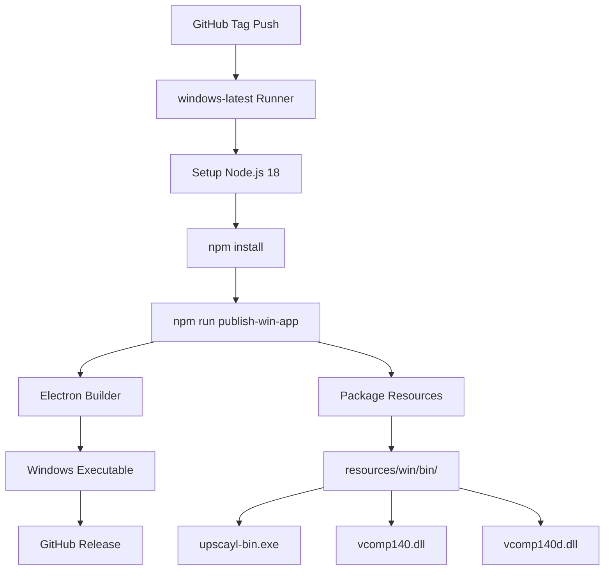
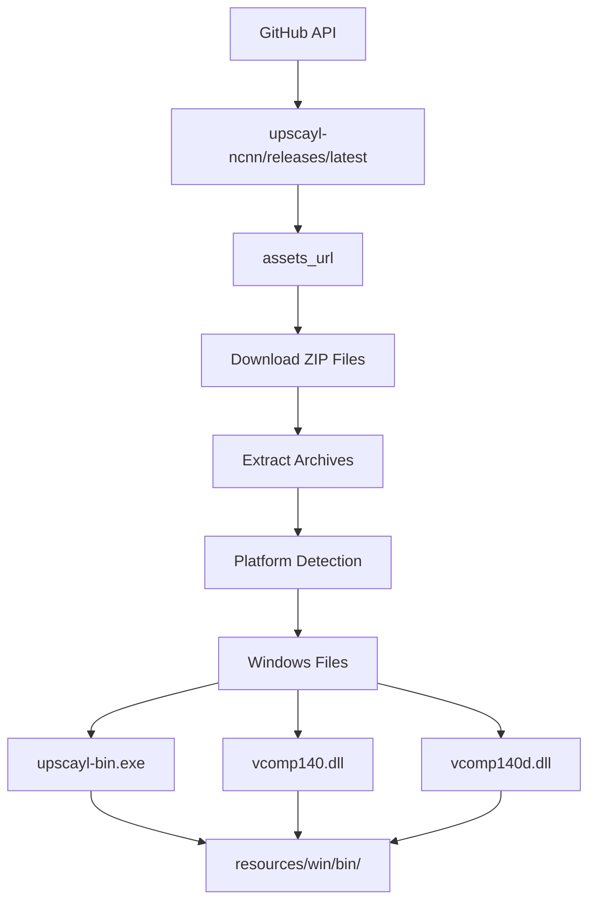
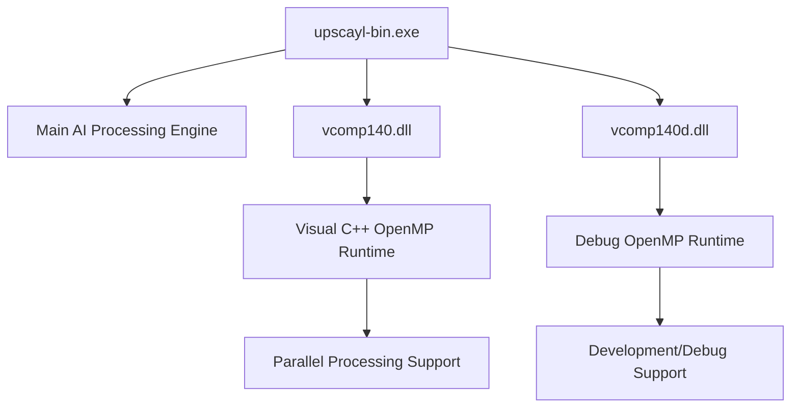

# Windows Support

Relevant source files

-   [.github/workflows/main.yml](https://github.com/upscayl/upscayl/blob/1fdbd3e5/.github/workflows/main.yml)
-   [download.jpg](https://github.com/upscayl/upscayl/blob/1fdbd3e5/download.jpg)
-   [resources/linux/bin/upscayl-bin](https://github.com/upscayl/upscayl/blob/1fdbd3e5/resources/linux/bin/upscayl-bin)
-   [resources/mac/bin/upscayl-bin](https://github.com/upscayl/upscayl/blob/1fdbd3e5/resources/mac/bin/upscayl-bin)
-   [resources/win/bin/upscayl-bin.exe](https://github.com/upscayl/upscayl/blob/1fdbd3e5/resources/win/bin/upscayl-bin.exe)
-   [resources/win/bin/vcomp140.dll](https://github.com/upscayl/upscayl/blob/1fdbd3e5/resources/win/bin/vcomp140.dll)
-   [resources/win/bin/vcomp140d.dll](https://github.com/upscayl/upscayl/blob/1fdbd3e5/resources/win/bin/vcomp140d.dll)
-   [screen1.png](https://github.com/upscayl/upscayl/blob/1fdbd3e5/screen1.png)
-   [update\_upscayl\_ncnn\_binaries.sh](https://github.com/upscayl/upscayl/blob/1fdbd3e5/update_upscayl_ncnn_binaries.sh)

This document covers Windows-specific implementation details for Upscayl, including the build process, binary distribution, and platform-specific dependencies. For general platform support information, see [Platform Support](/upscayl/upscayl/5-platform-support). For build and deployment processes across all platforms, see [Build and Deployment](/upscayl/upscayl/6-build-and-deployment).

## Overview

Upscayl provides native Windows support through a dedicated build pipeline that produces Windows executables and manages platform-specific dependencies. The Windows implementation includes the main `upscayl-bin.exe` executable and required Visual C++ runtime libraries for optimal performance on Windows systems.

## Windows Build Pipeline

The Windows build process is automated through GitHub Actions and produces platform-specific binaries that are distributed through multiple channels.

### CI/CD Build Process

**Windows Build Workflow**

The Windows build is triggered when tags matching `v*` are pushed to the repository. The process runs on `windows-latest` GitHub runners and uses the `GH_TOKEN` environment variable for authentication during publishing.

Sources: [.github/workflows/main.yml54-68](https://github.com/upscayl/upscayl/blob/1fdbd3e5/.github/workflows/main.yml#L54-L68)

### Build Configuration

The Windows build process uses Electron Builder to package the application with Windows-specific configurations:

| Component | Description | Location |
| --- | --- | --- |
| `upscayl-bin.exe` | Main Windows executable for AI processing | `resources/win/bin/upscayl-bin.exe` |
| `vcomp140.dll` | Visual C++ OpenMP runtime library | `resources/win/bin/vcomp140.dll` |
| `vcomp140d.dll` | Debug version of OpenMP runtime | `resources/win/bin/vcomp140d.dll` |

Sources: [.github/workflows/main.yml54-68](https://github.com/upscayl/upscayl/blob/1fdbd3e5/.github/workflows/main.yml#L54-L68) [update\_upscayl\_ncnn\_binaries.sh29-33](https://github.com/upscayl/upscayl/blob/1fdbd3e5/update_upscayl_ncnn_binaries.sh#L29-L33)

## Windows Binary Management

Upscayl uses a sophisticated binary distribution system that automatically downloads and manages platform-specific executables from the `upscayl-ncnn` repository.

### Binary Update Process

**Binary Distribution System**

The `update_upscayl_ncnn_binaries.sh` script automatically fetches the latest Windows binaries and their dependencies, ensuring the Windows build always uses the most recent AI processing engine.

Sources: [update\_upscayl\_ncnn\_binaries.sh1-43](https://github.com/upscayl/upscayl/blob/1fdbd3e5/update_upscayl_ncnn_binaries.sh#L1-L43)

### Platform-Specific Dependencies

Windows builds require additional runtime libraries that are not needed on other platforms:

**Windows Dependency Structure**

The Windows implementation includes OpenMP runtime libraries (`vcomp140.dll` and `vcomp140d.dll`) to support parallel processing capabilities of the AI upscaling engine. These libraries are automatically included in the Windows distribution but not required for other platforms.

Sources: [update\_upscayl\_ncnn\_binaries.sh31-32](https://github.com/upscayl/upscayl/blob/1fdbd3e5/update_upscayl_ncnn_binaries.sh#L31-L32)

## Binary Architecture

The Windows executable is a compiled binary that interfaces with the Electron main process to provide AI image upscaling functionality.

### File Structure

| File | Size | Purpose |
| --- | --- | --- |
| `upscayl-bin.exe` | ~6.6MB | Main processing executable |
| `vcomp140.dll` | ~195KB | OpenMP runtime library |
| `vcomp140d.dll` | ~220KB | Debug OpenMP runtime |

The Windows executable uses the PE (Portable Executable) format and includes embedded dependencies for AI processing operations.

Sources: [resources/win/bin/upscayl-bin.exe1-3](https://github.com/upscayl/upscayl/blob/1fdbd3e5/resources/win/bin/upscayl-bin.exe#L1-L3) [resources/win/bin/vcomp140.dll1-3](https://github.com/upscayl/upscayl/blob/1fdbd3e5/resources/win/bin/vcomp140.dll#L1-L3) [resources/win/bin/vcomp140d.dll1-3](https://github.com/upscayl/upscayl/blob/1fdbd3e5/resources/win/bin/vcomp140d.dll#L1-L3)

## Integration with Main Application

The Windows binaries are integrated into the main Electron application through the same cross-platform interface used for Linux and macOS builds, ensuring consistent behavior across all supported platforms.

### Process Communication

> **[Mermaid sequence]**
> *(图表结构无法解析)*

**Windows Process Communication Flow**

The Windows executable communicates with the main Electron process using the same IPC mechanisms as other platforms, ensuring platform-agnostic operation from the application's perspective.

Sources: [.github/workflows/main.yml54-68](https://github.com/upscayl/upscayl/blob/1fdbd3e5/.github/workflows/main.yml#L54-L68) [update\_upscayl\_ncnn\_binaries.sh29-33](https://github.com/upscayl/upscayl/blob/1fdbd3e5/update_upscayl_ncnn_binaries.sh#L29-L33)
