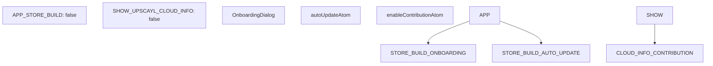
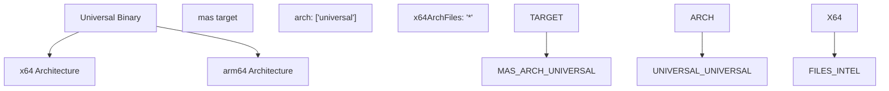

# macOS Support

Relevant source files

-   [.prettierignore](https://github.com/upscayl/upscayl/blob/1fdbd3e5/.prettierignore)
-   [common/feature-flags.ts](https://github.com/upscayl/upscayl/blob/1fdbd3e5/common/feature-flags.ts)
-   [mas.json](https://github.com/upscayl/upscayl/blob/1fdbd3e5/mas.json)
-   [renderer/components/main-content/onboarding-dialog.tsx](https://github.com/upscayl/upscayl/blob/1fdbd3e5/renderer/components/main-content/onboarding-dialog.tsx)
-   [resources/entitlements.mac.plist](https://github.com/upscayl/upscayl/blob/1fdbd3e5/resources/entitlements.mac.plist)
-   [resources/entitlements.mas.inherit.plist](https://github.com/upscayl/upscayl/blob/1fdbd3e5/resources/entitlements.mas.inherit.plist)
-   [resources/entitlements.mas.plist](https://github.com/upscayl/upscayl/blob/1fdbd3e5/resources/entitlements.mas.plist)
-   [resources/icons/128x128.png](https://github.com/upscayl/upscayl/blob/1fdbd3e5/resources/icons/128x128.png)
-   [resources/icons/512x512.png](https://github.com/upscayl/upscayl/blob/1fdbd3e5/resources/icons/512x512.png)
-   [resources/models/high-fidelity-4x.bin](https://github.com/upscayl/upscayl/blob/1fdbd3e5/resources/models/high-fidelity-4x.bin)
-   [resources/models/high-fidelity-4x.param](https://github.com/upscayl/upscayl/blob/1fdbd3e5/resources/models/high-fidelity-4x.param)

This document covers Upscayl's macOS platform implementation, including build configurations, entitlements, code signing, and distribution through both direct download and the Mac App Store. For Windows-specific features, see [Windows Support](/upscayl/upscayl/5.1-windows-support). For Linux distribution methods, see [Linux Support](/upscayl/upscayl/5.3-linux-support).

## Build Configuration

Upscayl supports two distinct macOS build targets: standard macOS distribution and Mac App Store (MAS) builds, each with different configurations and requirements.

### Mac App Store Configuration

The primary MAS configuration is defined in `mas.json`, which specifies build parameters, entitlements, and packaging requirements for App Store distribution.

```mermaid
flowchart TD
    MAS_JSON["mas.json"]
    ENTITLEMENTS_MAS["entitlements.mas.plist"]
    ENTITLEMENTS_INHERIT["entitlements.mas.inherit.plist"]
    FEATURE_FLAGS["feature-flags.ts"]
    MAS_BUILD["Mac App Store Build"]
    MAC_BUILD["Standard macOS Build"]
    APP_ID["org.upscayl.Upscayl"]
    BUILD_VERSION["buildVersion"]
    HARDENED_RUNTIME["hardenedRuntime"]
    GATEKEEPER["gatekeeperAssess"]

    MAS --> JSON_MAS_BUILD
    MAS --> JSON_MAC_BUILD
    MAS --> JSON_APP_ID
    MAS --> JSON_BUILD_VERSION
    ENTITLEMENTS --> MAS_MAS_BUILD
    ENTITLEMENTS --> INHERIT_MAS_BUILD
    FEATURE --> FLAGS_MAS_BUILD
    MAC --> BUILD_HARDENED_RUNTIME
    MAC --> BUILD_GATEKEEPER
```

**Sources:** [mas.json1-52](https://github.com/upscayl/upscayl/blob/1fdbd3e5/mas.json#L1-L52) [common/feature-flags.ts1-10](https://github.com/upscayl/upscayl/blob/1fdbd3e5/common/feature-flags.ts#L1-L10)

### Build Properties and Requirements

| Property | MAS Value | Standard macOS Value | Purpose |
| --- | --- | --- | --- |
| `hardenedRuntime` | `false` | `true` | Runtime security enforcement |
| `gatekeeperAssess` | `false` | `false` | Gatekeeper validation bypass |
| `minimumSystemVersion` | Not set | `"12.0.0"` | Minimum macOS version requirement |
| `type` | `"distribution"` | `"distribution"` | Certificate type for signing |
| `category` | `"public.app-category.photography"` | `"public.app-category.photography"` | App Store category |

**Sources:** [mas.json20-50](https://github.com/upscayl/upscayl/blob/1fdbd3e5/mas.json#L20-L50)

## Entitlements System

macOS builds require specific entitlements to access system resources and maintain sandboxing compliance, particularly for Mac App Store distribution.

### Mac App Store Entitlements

```mermaid
flowchart TD
    NETWORK["com.apple.security.network.client"]
    TEAM_ID["com.apple.developer.team-identifier"]
    APP_IDENTIFIER["com.apple.application-identifier"]
    APP_GROUPS["com.apple.security.application-groups"]
    JIT["com.apple.security.cs.allow-jit"]
    UNSIGNED_MEM["com.apple.security.cs.allow-unsigned-executable-memory"]
    DISABLE_LIB["com.apple.security.cs.disable-library-validation"]
    DYLD_ENV["com.apple.security.cs.allow-dyld-environment-variables"]
    SANDBOX["com.apple.security.app-sandbox"]
    USER_FILES["com.apple.security.files.user-selected.read-write"]
    BOOKMARKS_DOC["com.apple.security.files.bookmarks.document-scope"]
    BOOKMARKS_APP["com.apple.security.files.bookmarks.app-scope"]
    INHERIT["com.apple.security.inherit"]

    TEAM --> ID_APP_IDENTIFIER
    APP --> GROUPS_TEAM_ID
    JIT --> UNSIGNED_MEM
    JIT --> DISABLE_LIB
    SANDBOX --> USER_FILES
    SANDBOX --> BOOKMARKS_DOC
    SANDBOX --> BOOKMARKS_APP
```

**Sources:** [resources/entitlements.mas.plist1-34](https://github.com/upscayl/upscayl/blob/1fdbd3e5/resources/entitlements.mas.plist#L1-L34) [resources/entitlements.mas.inherit.plist1-11](https://github.com/upscayl/upscayl/blob/1fdbd3e5/resources/entitlements.mas.inherit.plist#L1-L11)

### Standard macOS Entitlements

For non-App Store distributions, the entitlement set is more permissive and includes additional development capabilities:

-   `com.apple.security.automation.apple-events` - AppleScript automation
-   `com.apple.security.cs.debugger` - Debugging capabilities
-   `com.apple.security.network.server` - Network server functionality

**Sources:** [resources/entitlements.mac.plist1-26](https://github.com/upscayl/upscayl/blob/1fdbd3e5/resources/entitlements.mac.plist#L1-L26)

## Code Signing and Notarization

The macOS build process incorporates automatic code signing and notarization for distribution outside the App Store.

> **[Mermaid sequence]**
> *(图表结构无法解析)*

**Sources:** [mas.json4](https://github.com/upscayl/upscayl/blob/1fdbd3e5/mas.json#L4-L4)

## Feature Flags and Platform Detection

macOS-specific functionality is controlled through feature flags that enable or disable certain capabilities based on the build target.

**Sources:** [common/feature-flags.ts1-10](https://github.com/upscayl/upscayl/blob/1fdbd3e5/common/feature-flags.ts#L1-L10) [renderer/components/main-content/onboarding-dialog.tsx66-74](https://github.com/upscayl/upscayl/blob/1fdbd3e5/renderer/components/main-content/onboarding-dialog.tsx#L66-L74)

## Resource Bundling and Distribution

macOS builds include platform-specific binaries and models that are bundled as extra files during the build process.

### Resource Structure

| Resource Type | Source Path | Target Path | Purpose |
| --- | --- | --- | --- |
| Platform Binaries | `resources/${os}/bin` | `resources/bin` | upscayl-ncnn executables |
| AI Models | `resources/models` | `resources/models` | Real-ESRGAN model files |
| Sharp Dependencies | `node_modules/sharp/**/*` | Unpacked | Image processing library |
| IMG Dependencies | `node_modules/@img/**/*` | Unpacked | Additional image utilities |

**Sources:** [mas.json7-19](https://github.com/upscayl/upscayl/blob/1fdbd3e5/mas.json#L7-L19)

## App Store Compliance

Mac App Store builds require specific configurations to pass App Store review and maintain compliance with Apple's guidelines.

```mermaid
flowchart TD
    SANDBOX_ENABLE["App Sandbox Enabled"]
    FILE_ACCESS["User-Selected File Access Only"]
    NETWORK_CLIENT["Network Client Access"]
    NO_PRIVILEGED["No Privileged Operations"]
    ENTITLEMENTS["entitlements.mas.plist"]
    TEAM_CERT["Team Certificate"]
    PROVISION_PROFILE["Provisioning Profile"]
    APP_GROUPS["Application Groups"]

    SANDBOX --> ENABLE_FILE_ACCESS
    FILE --> ACCESS_ENTITLEMENTS
    NETWORK --> CLIENT_ENTITLEMENTS
    TEAM --> CERT_PROVISION_PROFILE
    PROVISION --> PROFILE_APP_GROUPS
    APP --> GROUPS_ENTITLEMENTS
```

**Sources:** [resources/entitlements.mas.plist5-33](https://github.com/upscayl/upscayl/blob/1fdbd3e5/resources/entitlements.mas.plist#L5-L33)

## Universal Binary Support

The macOS build configuration supports universal binaries for both Intel and Apple Silicon Macs through the build target specification.

**Sources:** [mas.json30-35](https://github.com/upscayl/upscayl/blob/1fdbd3e5/mas.json#L30-L35) [mas.json43](https://github.com/upscayl/upscayl/blob/1fdbd3e5/mas.json#L43-L43)

## Platform-Specific UI Considerations

While most UI components are platform-agnostic, certain elements like the onboarding dialog include platform-aware features such as auto-update settings that may be disabled for App Store builds.

**Sources:** [renderer/components/main-content/onboarding-dialog.tsx66-68](https://github.com/upscayl/upscayl/blob/1fdbd3e5/renderer/components/main-content/onboarding-dialog.tsx#L66-L68)
