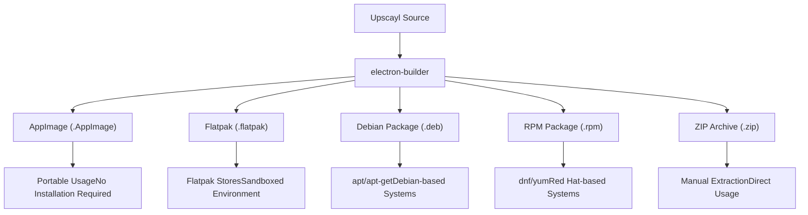
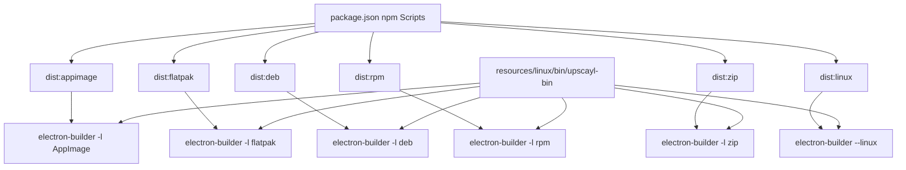
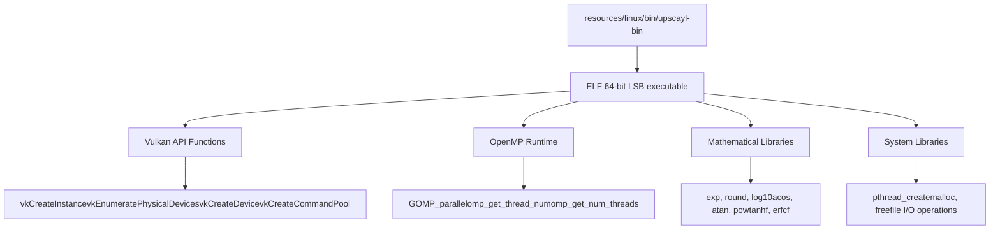
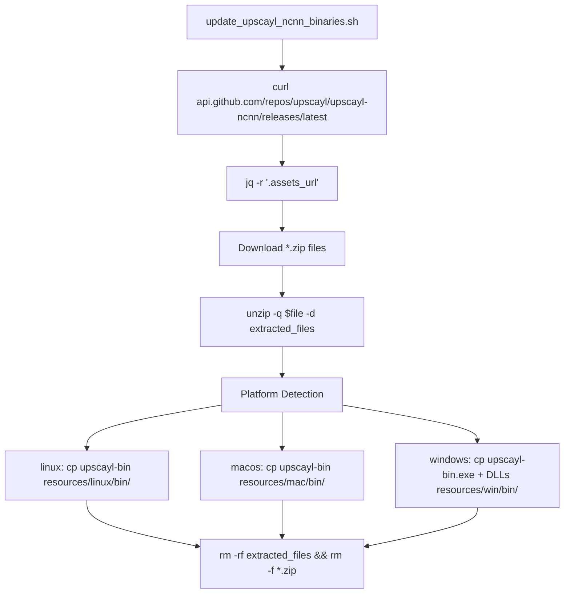

# Linux Support

Relevant source files

-   [1080p\_banner.jpg](https://github.com/upscayl/upscayl/blob/1fdbd3e5/1080p_banner.jpg)
-   [1080p\_explainer.jpg](https://github.com/upscayl/upscayl/blob/1fdbd3e5/1080p_explainer.jpg)
-   [flatpak/org.upscayl.Upscayl.json](https://github.com/upscayl/upscayl/blob/1fdbd3e5/flatpak/org.upscayl.Upscayl.json)
-   [flatpak/org.upscayl.Upscayl.metainfo.xml](https://github.com/upscayl/upscayl/blob/1fdbd3e5/flatpak/org.upscayl.Upscayl.metainfo.xml)
-   [resources/linux/bin/upscayl-bin](https://github.com/upscayl/upscayl/blob/1fdbd3e5/resources/linux/bin/upscayl-bin)
-   [resources/mac/bin/upscayl-bin](https://github.com/upscayl/upscayl/blob/1fdbd3e5/resources/mac/bin/upscayl-bin)
-   [resources/win/bin/upscayl-bin.exe](https://github.com/upscayl/upscayl/blob/1fdbd3e5/resources/win/bin/upscayl-bin.exe)
-   [resources/win/bin/vcomp140.dll](https://github.com/upscayl/upscayl/blob/1fdbd3e5/resources/win/bin/vcomp140.dll)
-   [resources/win/bin/vcomp140d.dll](https://github.com/upscayl/upscayl/blob/1fdbd3e5/resources/win/bin/vcomp140d.dll)
-   [update\_upscayl\_ncnn\_binaries.sh](https://github.com/upscayl/upscayl/blob/1fdbd3e5/update_upscayl_ncnn_binaries.sh)

This document explains the Linux-specific implementations and distribution methods for Upscayl, detailing how the application is built, packaged, and distributed for Linux platforms. It covers the different package formats, binary integration, and considerations specific to Linux environments.

## Supported Package Formats

Upscayl provides multiple distribution formats to ensure compatibility across the Linux ecosystem:


| Format | Purpose | Benefits | Installation Method |
| --- | --- | --- | --- |
| AppImage | Single-file portable application | No installation required, runs on most distributions | Make executable and run directly |
| Flatpak | Sandboxed application package | Consistent runtime, improved security | Via Flatpak command or app stores |
| DEB | Native Debian package | Integration with apt package manager | `sudo apt install ./upscayl.deb` |
| RPM | Native Red Hat package | Integration with dnf/yum package managers | `sudo dnf install ./upscayl.rpm` |
| ZIP | Simple archive | Manual installation, useful for custom setups | Extract and run manually |

Sources: [package.json169-180](https://github.com/upscayl/upscayl/blob/1fdbd3e5/package.json#L169-L180) [package.json46-50](https://github.com/upscayl/upscayl/blob/1fdbd3e5/package.json#L46-L50)

## Linux Build Configuration

Upscayl uses Electron Builder to create Linux packages with the following configuration from `package.json`:

```
"linux": {  "target": [    "AppImage",    "zip",    "deb",    "rpm"  ],  "maintainer": "Nayam Amarshe <simplelogin-newsletter.j1zez@aleeas.com>",  "category": "Graphics;2DGraphics;RasterGraphics;ImageProcessing;",  "synopsis": "AI Image Upscaler",  "description": "Free and Open Source AI Image Upscaler",  "icon": "resources/icons/"}
```
The build process for Linux is triggered using these npm scripts:


Sources: [package.json169-180](https://github.com/upscayl/upscayl/blob/1fdbd3e5/package.json#L169-L180) [package.json46-50](https://github.com/upscayl/upscayl/blob/1fdbd3e5/package.json#L46-L50)

## Linux Binary Management

Upscayl relies on a platform-specific binary (`upscayl-bin`) to perform the AI image upscaling. This binary is an ELF 64-bit executable stored at `resources/linux/bin/upscayl-bin` and leverages Vulkan API for GPU acceleration.

### upscayl-ncnn Binary Architecture


### Binary Update Process

The `update_upscayl_ncnn_binaries.sh` script handles fetching and updating the platform-specific binaries:


The script performs these key actions:

1.  Fetches the latest release from `api.github.com/repos/upscayl/upscayl-ncnn/releases/latest`
2.  Downloads platform-specific ZIP packages using `curl -LO $download_url`
3.  Extracts packages to `extracted_files/` directory using `unzip -q`
4.  Identifies Linux binaries and copies to `resources/linux/bin/upscayl-bin`
5.  Cleans up with `rm -rf extracted_files && rm -f *.zip`

Sources: [update\_upscayl\_ncnn\_binaries.sh1-43](https://github.com/upscayl/upscayl/blob/1fdbd3e5/update_upscayl_ncnn_binaries.sh#L1-L43) [resources/linux/bin/upscayl-bin1-28](https://github.com/upscayl/upscayl/blob/1fdbd3e5/resources/linux/bin/upscayl-bin#L1-L28)

## Upscaling Process Integration

The integration between the Electron application and the Linux binary follows this process:

> **[Mermaid sequence]**
> *(图表结构无法解析)*

When a user initiates an upscaling operation:

1.  The React UI sends a request to the Electron main process
2.  The main process spawns the Linux binary as a child process
3.  The binary leverages the GPU through Vulkan to process the image
4.  Results are passed back to the main process and displayed in the UI

Sources: [resources/linux/bin/upscayl-bin](https://github.com/upscayl/upscayl/blob/1fdbd3e5/resources/linux/bin/upscayl-bin)

## Linux-Specific Considerations

### Binary Dependencies

The analysis of the `upscayl-bin` binary shows it requires these external dependencies:

| Dependency | Description | Purpose |
| --- | --- | --- |
| libvulkan.so.1 | Vulkan loader library | GPU acceleration for image processing |
| libgomp.so.1 | GNU OpenMP runtime | Parallel processing support |
| libpthread.so.0 | POSIX threads library | Multithreading support |

These libraries must be available on the user's system for Upscayl to function properly. Different Linux package formats handle dependencies differently:

-   **AppImage**: Bundles some dependencies, but Vulkan must be installed on the system
-   **Flatpak**: Contains all dependencies in the runtime
-   **DEB/RPM**: Specifies dependencies that will be installed by the package manager

### File Permissions

When installing from certain package formats like AppImage or ZIP, users may need to manually set execution permissions:

```
chmod +x resources/linux/bin/upscayl-bin
```
Package formats like DEB, RPM, and Flatpak handle permissions automatically during installation.

### System Integration

The different package formats provide different levels of system integration:

-   **DEB/RPM**: Creates desktop entries and file associations automatically
-   **AppImage**: Can be integrated using tools like AppImageLauncher
-   **Flatpak**: Integrates through the Flatpak runtime and portal system

Sources: [resources/linux/bin/upscayl-bin](https://github.com/upscayl/upscayl/blob/1fdbd3e5/resources/linux/bin/upscayl-bin)

## Building from Source for Linux

To build Upscayl from source for Linux:

1.  Clone the repository
2.  Install dependencies: `npm install`
3.  Update binaries: `./update_upscayl_ncnn_binaries.sh`
4.  Build for your preferred format:
    -   All formats: `npm run dist:linux`
    -   AppImage only: `npm run dist:appimage`
    -   Flatpak only: `npm run dist:flatpak`
    -   DEB only: `npm run dist:deb`
    -   RPM only: `npm run dist:rpm`
    -   ZIP only: `npm run dist:zip`

The built packages will be placed in the `dist` directory.

Sources: [package.json46-50](https://github.com/upscayl/upscayl/blob/1fdbd3e5/package.json#L46-L50) [package.json61](https://github.com/upscayl/upscayl/blob/1fdbd3e5/package.json#L61-L61) [update\_upscayl\_ncnn\_binaries.sh1-43](https://github.com/upscayl/upscayl/blob/1fdbd3e5/update_upscayl_ncnn_binaries.sh#L1-L43)
