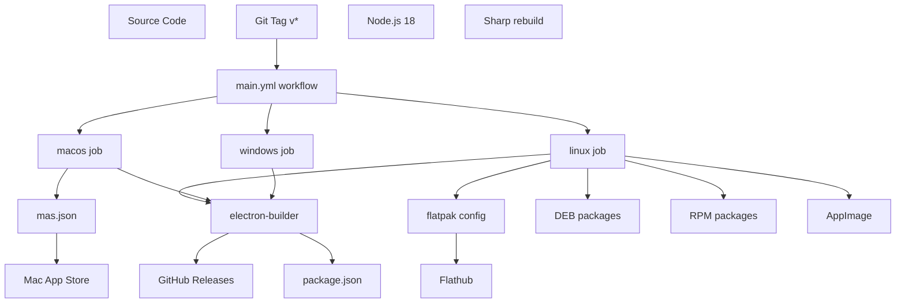
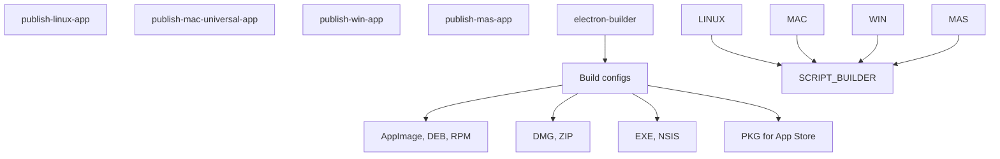
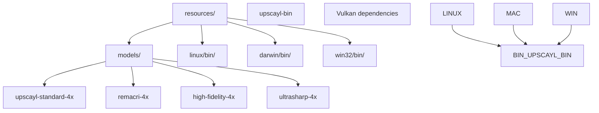
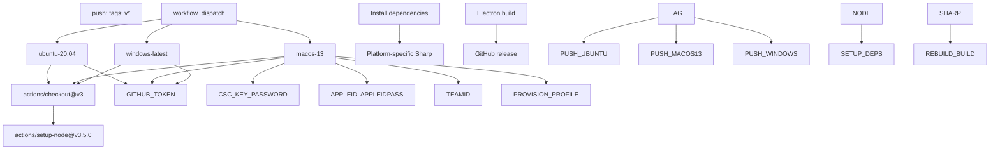
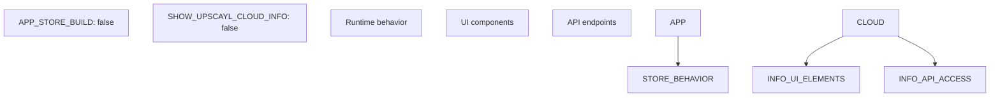

# Build and Deployment

Relevant source files

-   [.github/workflows/main.yml](https://github.com/upscayl/upscayl/blob/1fdbd3e5/.github/workflows/main.yml)
-   [common/feature-flags.ts](https://github.com/upscayl/upscayl/blob/1fdbd3e5/common/feature-flags.ts)
-   [download.jpg](https://github.com/upscayl/upscayl/blob/1fdbd3e5/download.jpg)
-   [mas.json](https://github.com/upscayl/upscayl/blob/1fdbd3e5/mas.json)
-   [renderer/components/main-content/onboarding-dialog.tsx](https://github.com/upscayl/upscayl/blob/1fdbd3e5/renderer/components/main-content/onboarding-dialog.tsx)
-   [resources/models/high-fidelity-4x.bin](https://github.com/upscayl/upscayl/blob/1fdbd3e5/resources/models/high-fidelity-4x.bin)
-   [resources/models/high-fidelity-4x.param](https://github.com/upscayl/upscayl/blob/1fdbd3e5/resources/models/high-fidelity-4x.param)
-   [screen1.png](https://github.com/upscayl/upscayl/blob/1fdbd3e5/screen1.png)

This document covers Upscayl's build system, packaging configuration, CI/CD pipeline, and deployment process across multiple platforms. It details how the Electron application is compiled, packaged, and distributed through various channels including GitHub Releases, Mac App Store, Flathub, and other package managers.

For information about platform-specific features and runtime considerations, see [Platform Support](/upscayl/upscayl/5-platform-support). For development setup and local building, see [Setup Development Environment](/upscayl/upscayl/7.1-setup-development-environment).

## Build System Overview

Upscayl uses a multi-platform build system centered around Electron Builder with GitHub Actions for automated CI/CD. The build process handles cross-platform compilation, code signing, and distribution to multiple channels simultaneously.

### Build Architecture

Sources: [.github/workflows/main.yml1-69](https://github.com/upscayl/upscayl/blob/1fdbd3e5/.github/workflows/main.yml#L1-L69) [mas.json1-52](https://github.com/upscayl/upscayl/blob/1fdbd3e5/mas.json#L1-L52)

### Key Build Components

| Component | Purpose | Configuration |
| --- | --- | --- |
| `electron-builder` | Main packaging tool | `package.json` scripts |
| `mas.json` | Mac App Store builds | Code signing, entitlements |
| `main.yml` | CI/CD automation | Platform matrix, secrets |
| `Sharp` | Image processing library | Platform-specific rebuilds |
| Resource binaries | AI processing executables | `resources/*/bin/` |

Sources: [.github/workflows/main.yml20-28](https://github.com/upscayl/upscayl/blob/1fdbd3e5/.github/workflows/main.yml#L20-L28) [mas.json4-51](https://github.com/upscayl/upscayl/blob/1fdbd3e5/mas.json#L4-L51)

## Build Configuration

### Electron Builder Setup

The build system uses npm scripts to orchestrate different build targets:

-   `publish-linux-app` - Linux builds with multiple formats
-   `publish-mac-universal-app` - Universal macOS builds
-   `publish-win-app` - Windows builds
-   `publish-mas-app` - Mac App Store specific builds

Sources: [.github/workflows/main.yml28](https://github.com/upscayl/upscayl/blob/1fdbd3e5/.github/workflows/main.yml#L28-L28) [.github/workflows/main.yml52](https://github.com/upscayl/upscayl/blob/1fdbd3e5/.github/workflows/main.yml#L52-L52) [.github/workflows/main.yml68](https://github.com/upscayl/upscayl/blob/1fdbd3e5/.github/workflows/main.yml#L68-L68)

### Resource Management

The build process includes platform-specific resources:

Sources: [mas.json8-19](https://github.com/upscayl/upscayl/blob/1fdbd3e5/mas.json#L8-L19) [resources/models/high-fidelity-4x.param1-10](https://github.com/upscayl/upscayl/blob/1fdbd3e5/resources/models/high-fidelity-4x.param#L1-L10)

## CI/CD Pipeline

### GitHub Actions Workflow

The main deployment workflow is triggered by version tags and handles parallel builds across platforms:

Sources: [.github/workflows/main.yml4-8](https://github.com/upscayl/upscayl/blob/1fdbd3e5/.github/workflows/main.yml#L4-L8) [.github/workflows/main.yml32-39](https://github.com/upscayl/upscayl/blob/1fdbd3e5/.github/workflows/main.yml#L32-L39) [.github/workflows/main.yml11-69](https://github.com/upscayl/upscayl/blob/1fdbd3e5/.github/workflows/main.yml#L11-L69)

### Platform-Specific Build Steps

Each platform requires specific handling:

**Linux Build Process:**

-   Install system dependencies (`elfutils`, `rpm`)
-   Global `node-gyp` installation
-   Sharp rebuild for `x64/linux/glibc`
-   Multiple output formats (AppImage, DEB, RPM)

**macOS Build Process:**

-   Code signing certificate setup (`CSC_LINK`, `CSC_KEY_PASSWORD`)
-   Provisioning profile deployment
-   Universal binary creation (x64 + arm64)
-   Notarization with Apple ID credentials

**Windows Build Process:**

-   Standard npm dependencies installation
-   Windows-specific electron-builder configuration
-   NSIS installer generation

Sources: [.github/workflows/main.yml20-28](https://github.com/upscayl/upscayl/blob/1fdbd3e5/.github/workflows/main.yml#L20-L28) [.github/workflows/main.yml45-52](https://github.com/upscayl/upscayl/blob/1fdbd3e5/.github/workflows/main.yml#L45-L52) [.github/workflows/main.yml63-68](https://github.com/upscayl/upscayl/blob/1fdbd3e5/.github/workflows/main.yml#L63-L68)

## Platform-Specific Builds

### macOS Configuration

The Mac App Store build uses specialized configuration in `mas.json`:

```mermaid
flowchart TD
    MAS_BUILD["mas (App Store)"]
    MAC_BUILD["mac (Direct)"]
    CERT["CSC_LINK certificate"]
    PASSWORD["CSC_KEY_PASSWORD"]
    PROVISION_PROF["embedded.provisionprofile"]
    MAS_ENTITLE["entitlements.mas.plist"]
    MAS_INHERIT["entitlements.mas.inherit.plist"]
    MAC_ENTITLE["entitlements.mac.plist"]
    APP_ID["org.upscayl.Upscayl"]
    CATEGORY["public.app-category.photography"]
    MIN_VERSION["macOS 12.0.0"]
    UNIVERSAL["Universal (x64 + arm64)"]

    MAS --> BUILD_CERT
    MAC --> BUILD_CERT
    CERT --> PASSWORD
    MAS --> BUILD_PROVISION_PROF
    MAS --> BUILD_MAS_ENTITLE
    MAS --> BUILD_MAS_INHERIT
    MAC --> BUILD_MAC_ENTITLE
    MAS --> BUILD_APP_ID
    MAC --> BUILD_APP_ID
    APP --> ID_CATEGORY
    APP --> ID_MIN_VERSION
    APP --> ID_UNIVERSAL
```

Sources: [mas.json20-50](https://github.com/upscayl/upscayl/blob/1fdbd3e5/mas.json#L20-L50) [.github/workflows/main.yml49-50](https://github.com/upscayl/upscayl/blob/1fdbd3e5/.github/workflows/main.yml#L49-L50)

### Linux Distribution

Linux builds support multiple distribution formats and package managers:

| Format | Use Case | Generated By |
| --- | --- | --- |
| AppImage | Universal Linux binary | electron-builder |
| DEB | Debian/Ubuntu packages | electron-builder |
| RPM | RedHat/Fedora packages | electron-builder |
| Flatpak | Sandboxed distribution | Separate workflow |

The build process installs distribution-specific tools like `rpm` package manager support.

Sources: [.github/workflows/main.yml22-23](https://github.com/upscayl/upscayl/blob/1fdbd3e5/.github/workflows/main.yml#L22-L23)

### Feature Flags in Builds

Build-time feature flags control certain functionality:

Sources: [common/feature-flags.ts1-9](https://github.com/upscayl/upscayl/blob/1fdbd3e5/common/feature-flags.ts#L1-L9)

## Distribution Channels

### Automated Publishing

The build system automatically publishes to multiple channels upon successful builds:

```mermaid
flowchart TD
    LINUX_BUILD["Linux build"]
    MAC_BUILD["macOS build"]
    WIN_BUILD["Windows build"]
    GITHUB_RELEASES["GitHub Releases"]
    MAC_STORE["Mac App Store"]
    FLATHUB_STORE["Flathub"]
    HOMEBREW["Homebrew"]
    AUR["Arch AUR"]
    CHOCOLATEY["Chocolatey"]

    LINUX --> BUILD_GITHUB_RELEASES
    MAC --> BUILD_GITHUB_RELEASES
    WIN --> BUILD_GITHUB_RELEASES
    MAC --> BUILD_MAC_STORE
    LINUX --> BUILD_FLATHUB_STORE
    GITHUB --> RELEASES_HOMEBREW
    GITHUB --> RELEASES_AUR
    GITHUB --> RELEASES_CHOCOLATEY
```

Sources: [.github/workflows/main.yml28](https://github.com/upscayl/upscayl/blob/1fdbd3e5/.github/workflows/main.yml#L28-L28) [.github/workflows/main.yml38](https://github.com/upscayl/upscayl/blob/1fdbd3e5/.github/workflows/main.yml#L38-L38) [.github/workflows/main.yml65](https://github.com/upscayl/upscayl/blob/1fdbd3e5/.github/workflows/main.yml#L65-L65)

### Release Asset Management

Each platform build generates specific assets:

-   **Linux**: `.AppImage`, `.deb`, `.rpm` files
-   **macOS**: `.dmg`, `.zip` for direct distribution; `.pkg` for App Store
-   **Windows**: `.exe` installer, portable builds

The GitHub token (`GH_TOKEN`) enables automatic release creation and asset uploads to the repository's releases page.

Sources: [.github/workflows/main.yml28](https://github.com/upscayl/upscayl/blob/1fdbd3e5/.github/workflows/main.yml#L28-L28) [.github/workflows/main.yml38](https://github.com/upscayl/upscayl/blob/1fdbd3e5/.github/workflows/main.yml#L38-L38) [.github/workflows/main.yml65](https://github.com/upscayl/upscayl/blob/1fdbd3e5/.github/workflows/main.yml#L65-L65)
