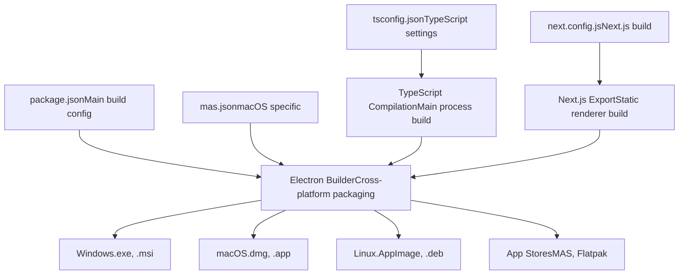
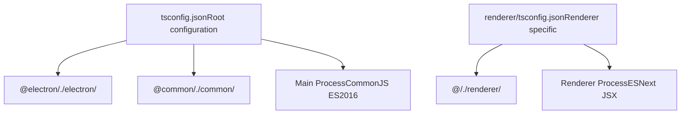
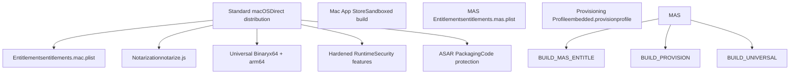
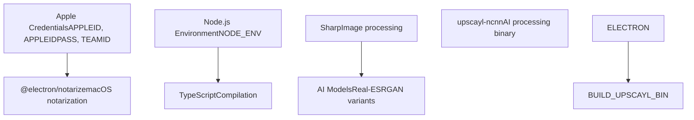
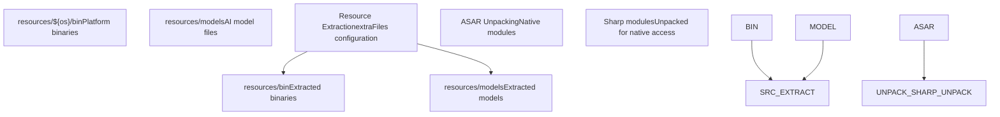
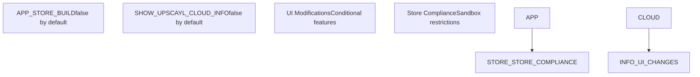
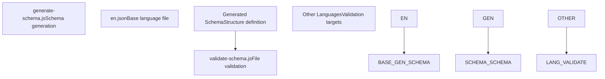

# Build Configuration

Relevant source files

-   [.gitignore](https://github.com/upscayl/upscayl/blob/1fdbd3e5/.gitignore)
-   [common/feature-flags.ts](https://github.com/upscayl/upscayl/blob/1fdbd3e5/common/feature-flags.ts)
-   [mas.json](https://github.com/upscayl/upscayl/blob/1fdbd3e5/mas.json)
-   [next.config.js](https://github.com/upscayl/upscayl/blob/1fdbd3e5/next.config.js)
-   [notarize.js](https://github.com/upscayl/upscayl/blob/1fdbd3e5/notarize.js)
-   [renderer/components/main-content/onboarding-dialog.tsx](https://github.com/upscayl/upscayl/blob/1fdbd3e5/renderer/components/main-content/onboarding-dialog.tsx)
-   [renderer/components/sidebar/upscayl-tab/upscayl-steps.tsx](https://github.com/upscayl/upscayl/blob/1fdbd3e5/renderer/components/sidebar/upscayl-tab/upscayl-steps.tsx)
-   [renderer/tsconfig.json](https://github.com/upscayl/upscayl/blob/1fdbd3e5/renderer/tsconfig.json)
-   [resources/models/high-fidelity-4x.bin](https://github.com/upscayl/upscayl/blob/1fdbd3e5/resources/models/high-fidelity-4x.bin)
-   [resources/models/high-fidelity-4x.param](https://github.com/upscayl/upscayl/blob/1fdbd3e5/resources/models/high-fidelity-4x.param)
-   [scripts/generate-schema.js](https://github.com/upscayl/upscayl/blob/1fdbd3e5/scripts/generate-schema.js)
-   [scripts/validate-schema.js](https://github.com/upscayl/upscayl/blob/1fdbd3e5/scripts/validate-schema.js)
-   [tsconfig.json](https://github.com/upscayl/upscayl/blob/1fdbd3e5/tsconfig.json)

This document details the build configurations, environment setup, dependencies, and platform-specific build requirements for Upscayl. It covers the core build system architecture, configuration files, and the process for creating distributable packages across Windows, macOS, and Linux platforms.

For information about the CI/CD pipeline and automated builds, see [CI/CD Pipeline](/upscayl/upscayl/6.2-cicd-pipeline). For details about the release and distribution process, see [Release Process](/upscayl/upscayl/6.3-release-process).

## Build System Architecture

Upscayl uses a multi-layered build system combining Electron Builder, Next.js, and TypeScript compilation. The build process handles both the main Electron process and the Next.js-based renderer, along with platform-specific native dependencies and AI model resources.

### Core Build Configuration Flow

Sources: [package.json](https://github.com/upscayl/upscayl/blob/1fdbd3e5/package.json) [tsconfig.json1-26](https://github.com/upscayl/upscayl/blob/1fdbd3e5/tsconfig.json#L1-L26) [next.config.js1-18](https://github.com/upscayl/upscayl/blob/1fdbd3e5/next.config.js#L1-L18) [mas.json1-51](https://github.com/upscayl/upscayl/blob/1fdbd3e5/mas.json#L1-L51)

### TypeScript Configuration

The build system uses multiple TypeScript configurations for different parts of the application:

The root TypeScript configuration targets ES2016 with CommonJS modules for the main process, while the renderer uses ESNext with JSX preservation for Next.js processing.

Sources: [tsconfig.json2-16](https://github.com/upscayl/upscayl/blob/1fdbd3e5/tsconfig.json#L2-L16) [renderer/tsconfig.json17-22](https://github.com/upscayl/upscayl/blob/1fdbd3e5/renderer/tsconfig.json#L17-L22)

## Platform-Specific Build Configurations

### macOS Configuration

The macOS build process includes both standard distribution and Mac App Store variants, each with specific entitlements and signing requirements.

The macOS configuration in `mas.json` defines key build parameters including minimum system version, architecture support, and security settings:

-   **Universal Architecture**: Targets both x64 and ARM64 architectures using the `universal` target
-   **Hardened Runtime**: Enabled for standard builds but disabled for MAS builds
-   **ASAR Unpacking**: Excludes Sharp and @img modules from ASAR packaging for native module compatibility
-   **Resource Extraction**: Copies platform-specific binaries and AI models to the app bundle

Sources: [mas.json20-35](https://github.com/upscayl/upscayl/blob/1fdbd3e5/mas.json#L20-L35) [mas.json37-49](https://github.com/upscayl/upscayl/blob/1fdbd3e5/mas.json#L37-L49) [mas.json7-18](https://github.com/upscayl/upscayl/blob/1fdbd3e5/mas.json#L7-L18)

### Windows and Linux Configuration

While the provided files don't show Windows and Linux specific configurations, the build system supports these platforms through Electron Builder's default configurations and the cross-platform binary management system.

Sources: [mas.json29-34](https://github.com/upscayl/upscayl/blob/1fdbd3e5/mas.json#L29-L34)

## Environment Setup and Dependencies

### Build Environment Requirements

The build process requires specific environment configurations for different platforms and distribution channels.

The notarization process for macOS requires Apple Developer credentials stored in environment variables:

Sources: [notarize.js1-19](https://github.com/upscayl/upscayl/blob/1fdbd3e5/notarize.js#L1-L19)

### Next.js Build Configuration

The renderer process uses Next.js with specific export settings for Electron integration:

-   **Static Export**: Configured with `output: "export"` for file-based serving
-   **Unoptimized Images**: Disables Next.js image optimization for Electron compatibility
-   **External Directory**: Enables imports from parent directories
-   **Console Removal**: Strips console logs in production builds

Sources: [next.config.js5-15](https://github.com/upscayl/upscayl/blob/1fdbd3e5/next.config.js#L5-L15)

## Asset and Resource Management

### Binary and Model Distribution

The build system manages platform-specific binaries and AI models through a structured resource extraction process.

The build configuration handles several critical resource management tasks:

-   **Platform-Specific Binaries**: The `upscayl-ncnn` executable is copied from `resources/${os}/bin` to maintain platform compatibility
-   **AI Model Files**: Model files like `high-fidelity-4x.param` and `high-fidelity-4x.bin` are extracted to the application bundle
-   **Native Module Handling**: Sharp and @img modules are excluded from ASAR packaging to preserve native functionality

Sources: [mas.json8-18](https://github.com/upscayl/upscayl/blob/1fdbd3e5/mas.json#L8-L18) [mas.json7](https://github.com/upscayl/upscayl/blob/1fdbd3e5/mas.json#L7-L7) [resources/models/high-fidelity-4x.param1-10](https://github.com/upscayl/upscayl/blob/1fdbd3e5/resources/models/high-fidelity-4x.param#L1-L10)

## Feature Flags and Build Variants

The build system supports different application variants through compile-time feature flags:

These flags control application behavior and feature availability in different distribution channels, particularly for app store compliance requirements.

Sources: [common/feature-flags.ts1-9](https://github.com/upscayl/upscayl/blob/1fdbd3e5/common/feature-flags.ts#L1-L9)

## Build Validation and Quality Assurance

### Schema Validation System

The build process includes validation scripts to ensure consistency across internationalization files:

The validation system ensures all localization files maintain consistent structure with the base English locale, preventing runtime errors from missing translation keys.

Sources: [scripts/generate-schema.js1-36](https://github.com/upscayl/upscayl/blob/1fdbd3e5/scripts/generate-schema.js#L1-L36) [scripts/validate-schema.js8-36](https://github.com/upscayl/upscayl/blob/1fdbd3e5/scripts/validate-schema.js#L8-L36)

### Build Artifact Management

The `.gitignore` configuration excludes build artifacts and sensitive files from version control:

-   **Compiled Output**: `/main/*.js`, `/dist/`, `/export/` directories
-   **Next.js Build**: `/renderer/.next/`, `/renderer/out/` directories
-   **Platform Packages**: `.flatpak/`, `build-dir/` directories
-   **Sensitive Files**: `*.provisionprofile`, `*.p12` certificates

Sources: [.gitignore8-9](https://github.com/upscayl/upscayl/blob/1fdbd3e5/.gitignore#L8-L9) [.gitignore15-21](https://github.com/upscayl/upscayl/blob/1fdbd3e5/.gitignore#L15-L21) [.gitignore41-56](https://github.com/upscayl/upscayl/blob/1fdbd3e5/.gitignore#L41-L56)
