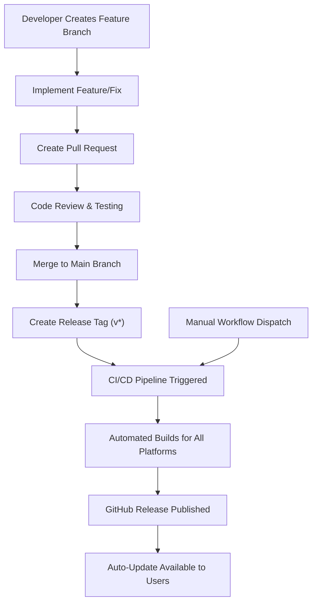
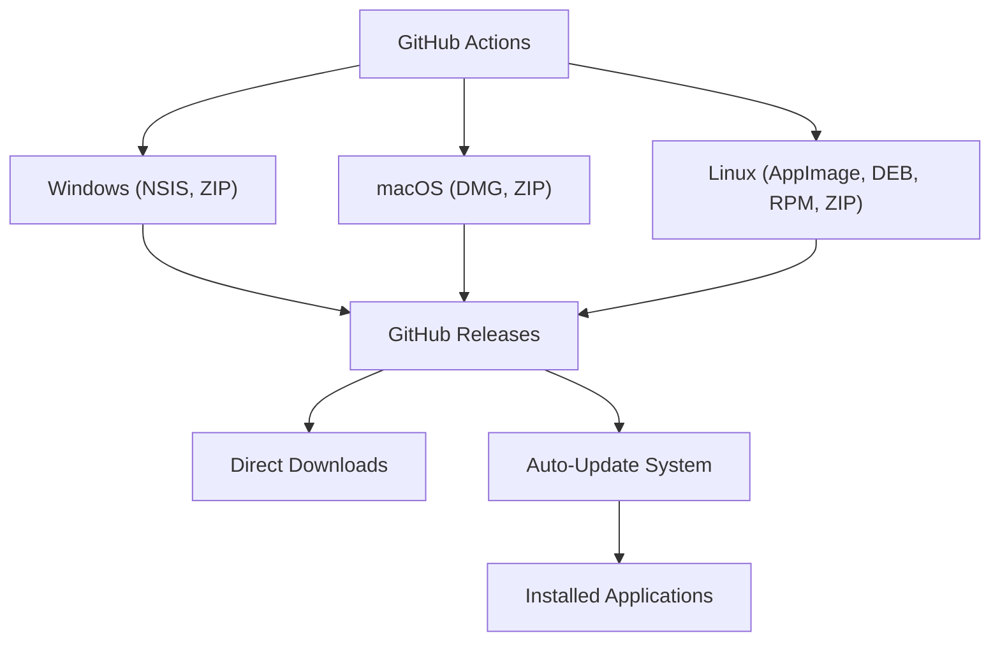
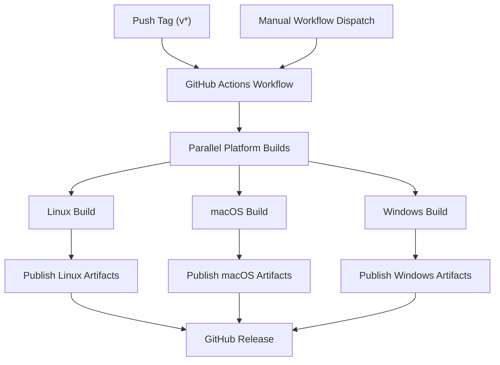
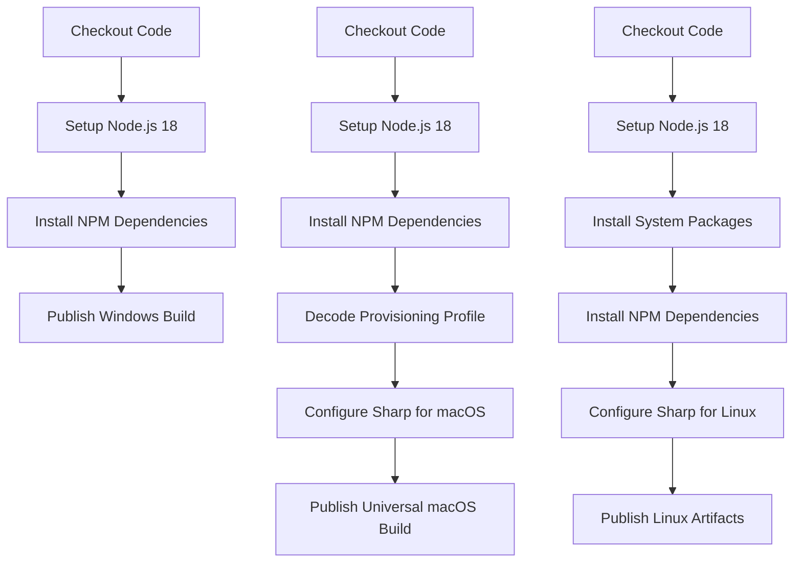
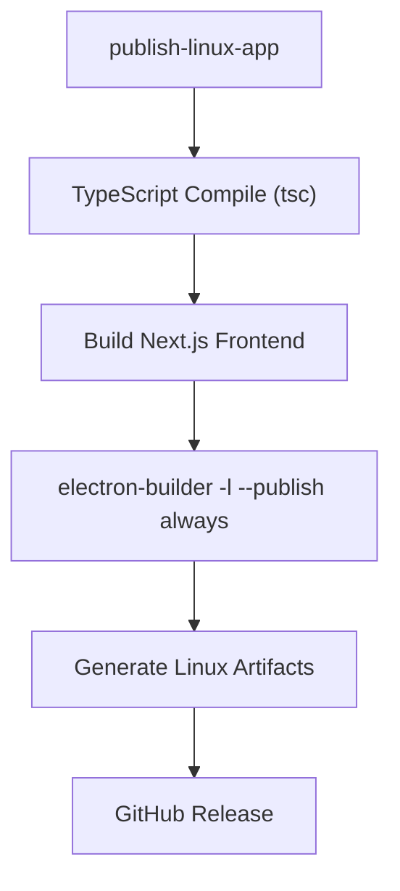
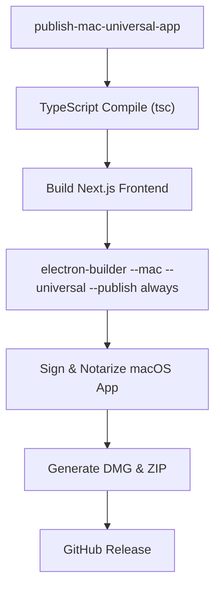
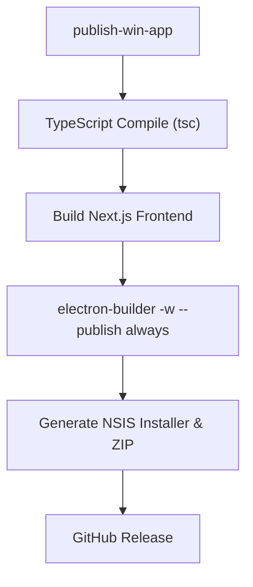
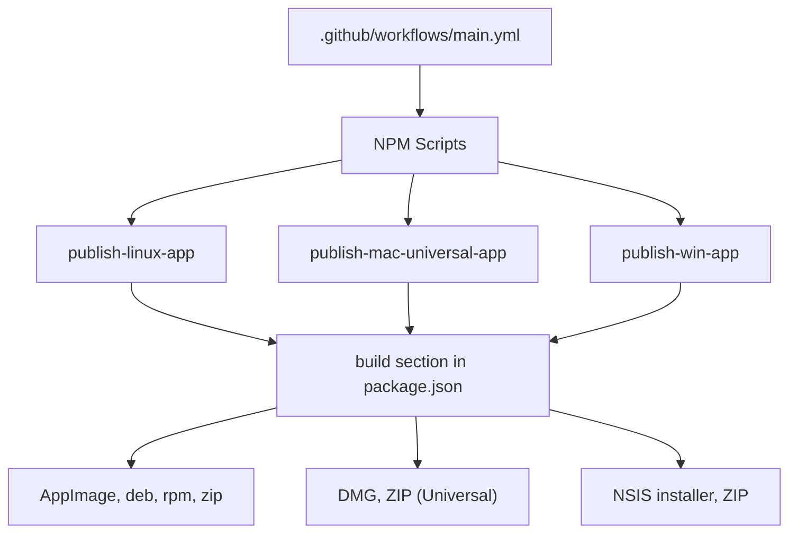

# CI/CD Pipeline

<details>
<summary>Relevant Source Files</summary>

- [.github/workflows/main.yml](https://github.com/upscayl/upscayl/blob/1fdbd3e5/.github/workflows/main.yml)
- [.prettierignore](https://github.com/upscayl/upscayl/blob/1fdbd3e5/.prettierignore)
- [download.jpg](https://github.com/upscayl/upscayl/blob/1fdbd3e5/download.jpg)
- [resources/entitlements.mac.plist](https://github.com/upscayl/upscayl/blob/1fdbd3e5/resources/entitlements.mac.plist)
- [resources/entitlements.mas.inherit.plist](https://github.com/upscayl/upscayl/blob/1fdbd3e5/resources/entitlements.mas.inherit.plist)
- [resources/entitlements.mas.plist](https://github.com/upscayl/upscayl/blob/1fdbd3e5/resources/entitlements.mas.plist)
- [resources/icons/128x128.png](https://github.com/upscayl/upscayl/blob/1fdbd3e5/resources/icons/128x128.png)
- [resources/icons/512x512.png](https://github.com/upscayl/upscayl/blob/1fdbd3e5/resources/icons/512x512.png)
- [screen1.png](https://github.com/upscayl/upscayl/blob/1fdbd3e5/screen1.png)
- [.github/workflows/main.yml4-8](https://github.com/upscayl/upscayl/blob/1fdbd3e5/.github/workflows/main.yml#L4-L8)
- [package.json128-195](https://github.com/upscayl/upscayl/blob/1fdbd3e5/package.json#L128-L195)
- [package.json200-202](https://github.com/upscayl/upscayl/blob/1fdbd3e5/package.json#L200-L202)
- [.github/workflows/main.yml11-68](https://github.com/upscayl/upscayl/blob/1fdbd3e5/.github/workflows/main.yml#L11-L68)
- [.github/workflows/main.yml11-28](https://github.com/upscayl/upscayl/blob/1fdbd3e5/.github/workflows/main.yml#L11-L28)
- [package.json63-64](https://github.com/upscayl/upscayl/blob/1fdbd3e5/package.json#L63-L64)
- [.github/workflows/main.yml30-52](https://github.com/upscayl/upscayl/blob/1fdbd3e5/.github/workflows/main.yml#L30-L52)
- [package.json65-66](https://github.com/upscayl/upscayl/blob/1fdbd3e5/package.json#L65-L66)
- [.github/workflows/main.yml54-68](https://github.com/upscayl/upscayl/blob/1fdbd3e5/.github/workflows/main.yml#L54-L68)
- [package.json64-65](https://github.com/upscayl/upscayl/blob/1fdbd3e5/package.json#L64-L65)
- [package.json73-202](https://github.com/upscayl/upscayl/blob/1fdbd3e5/package.json#L73-L202)
- [package.json169-181](https://github.com/upscayl/upscayl/blob/1fdbd3e5/package.json#L169-L181)
- [package.json128-152](https://github.com/upscayl/upscayl/blob/1fdbd3e5/package.json#L128-L152)
- [package.json182-195](https://github.com/upscayl/upscayl/blob/1fdbd3e5/package.json#L182-L195)
- [.github/workflows/main.yml32-39](https://github.com/upscayl/upscayl/blob/1fdbd3e5/.github/workflows/main.yml#L32-L39)
- [.github/workflows/main.yml65](https://github.com/upscayl/upscayl/blob/1fdbd3e5/.github/workflows/main.yml#L65-L65)
- [.github/workflows/main.yml25-27](https://github.com/upscayl/upscayl/blob/1fdbd3e5/.github/workflows/main.yml#L25-L27)
- [.github/workflows/main.yml47-51](https://github.com/upscayl/upscayl/blob/1fdbd3e5/.github/workflows/main.yml#L47-L51)
- [.github/workflows/main.yml28](https://github.com/upscayl/upscayl/blob/1fdbd3e5/.github/workflows/main.yml#L28-L28)
- [.github/workflows/main.yml38](https://github.com/upscayl/upscayl/blob/1fdbd3e5/.github/workflows/main.yml#L38-L38)
- [main/index.ts](https://github.com/upscayl/upscayl/blob/1fdbd3e5/main/index.ts)
- [package.json82-104](https://github.com/upscayl/upscayl/blob/1fdbd3e5/package.json#L82-L104)
- [package.json76](https://github.com/upscayl/upscayl/blob/1fdbd3e5/package.json#L76-L76)

</details>

## CI/CD Pipeline and Development Workflow

The CI/CD pipeline integrates with the overall development workflow as follows:


This workflow ensures that every official release goes through proper review and testing before being automatically built and distributed to users.

Sources: [.github/workflows/main.yml4-8](https://github.com/upscayl/upscayl/blob/1fdbd3e5/.github/workflows/main.yml#L4-L8)

## Build Artifacts and Distribution Channels

The following diagram shows how build artifacts from the CI/CD pipeline are distributed through various channels:


This multi-channel distribution approach ensures that users can access Upscayl through their preferred method, whether that's downloading directly from GitHub or receiving automatic updates to an existing installation.

Sources: [package.json128-195](https://github.com/upscayl/upscayl/blob/1fdbd3e5/package.json#L128-L195) [package.json200-202](https://github.com/upscayl/upscayl/blob/1fdbd3e5/package.json#L200-L202)

# CI/CD Pipeline

Relevant source files

-   [.github/workflows/main.yml](https://github.com/upscayl/upscayl/blob/1fdbd3e5/.github/workflows/main.yml)
-   [.prettierignore](https://github.com/upscayl/upscayl/blob/1fdbd3e5/.prettierignore)
-   [download.jpg](https://github.com/upscayl/upscayl/blob/1fdbd3e5/download.jpg)
-   [resources/entitlements.mac.plist](https://github.com/upscayl/upscayl/blob/1fdbd3e5/resources/entitlements.mac.plist)
-   [resources/entitlements.mas.inherit.plist](https://github.com/upscayl/upscayl/blob/1fdbd3e5/resources/entitlements.mas.inherit.plist)
-   [resources/entitlements.mas.plist](https://github.com/upscayl/upscayl/blob/1fdbd3e5/resources/entitlements.mas.plist)
-   [resources/icons/128x128.png](https://github.com/upscayl/upscayl/blob/1fdbd3e5/resources/icons/128x128.png)
-   [resources/icons/512x512.png](https://github.com/upscayl/upscayl/blob/1fdbd3e5/resources/icons/512x512.png)
-   [screen1.png](https://github.com/upscayl/upscayl/blob/1fdbd3e5/screen1.png)

This page documents the Continuous Integration and Continuous Deployment (CI/CD) pipeline used for automating the build and release process of Upscayl across multiple platforms (Windows, macOS, and Linux). For information about the build configuration itself, see [Build Configuration](/upscayl/upscayl/6.1-build-configuration).

## Overview

Upscayl's CI/CD pipeline is implemented using GitHub Actions and is configured to automatically build and publish application releases when a version tag is pushed or when manually triggered.

### Workflow Trigger Mechanism

The pipeline is triggered in two ways:

1.  Automatically when a tag starting with "v" is pushed to the repository
2.  Manually through GitHub's workflow dispatch feature


Sources: [.github/workflows/main.yml4-8](https://github.com/upscayl/upscayl/blob/1fdbd3e5/.github/workflows/main.yml#L4-L8)

## Workflow Structure

The pipeline consists of three parallel jobs, each responsible for building and publishing artifacts for a specific platform.


Sources: [.github/workflows/main.yml11-68](https://github.com/upscayl/upscayl/blob/1fdbd3e5/.github/workflows/main.yml#L11-L68)

## Platform-Specific Builds

### Linux Build

The Linux build runs on Ubuntu 20.04 and performs the following steps:

1.  Sets up the environment with Node.js 18
2.  Installs required system packages (elfutils, rpm)
3.  Installs npm dependencies
4.  Configures the Sharp module specifically for Linux
5.  Publishes Linux artifacts (AppImage, deb, rpm, zip) using the `publish-linux-app` script


Sources: [.github/workflows/main.yml11-28](https://github.com/upscayl/upscayl/blob/1fdbd3e5/.github/workflows/main.yml#L11-L28) [package.json63-64](https://github.com/upscayl/upscayl/blob/1fdbd3e5/package.json#L63-L64)

### macOS Build

The macOS build runs on macOS 13 and handles:

1.  Environment configuration with required secrets for code signing
2.  Provisioning profile setup for App Store compliance
3.  Special handling of the Sharp module for universal builds (Intel + ARM)
4.  Building and publishing a universal macOS application


Sources: [.github/workflows/main.yml30-52](https://github.com/upscayl/upscayl/blob/1fdbd3e5/.github/workflows/main.yml#L30-L52) [package.json65-66](https://github.com/upscayl/upscayl/blob/1fdbd3e5/package.json#L65-L66)

### Windows Build

The Windows build job:

1.  Sets up Node.js 18 environment
2.  Installs dependencies
3.  Builds and publishes Windows artifacts (NSIS installer and ZIP)


Sources: [.github/workflows/main.yml54-68](https://github.com/upscayl/upscayl/blob/1fdbd3e5/.github/workflows/main.yml#L54-L68) [package.json64-65](https://github.com/upscayl/upscayl/blob/1fdbd3e5/package.json#L64-L65)

## Build Configuration Integration

The CI/CD pipeline leverages configuration defined in the `package.json` file under the `build` section, which specifies how Electron Builder should package the application for each platform.


Sources: [package.json73-202](https://github.com/upscayl/upscayl/blob/1fdbd3e5/package.json#L73-L202)

## Platform-Specific Configuration Details

### Linux Configuration

The Linux build generates multiple distribution formats:

-   AppImage (universal Linux package)
-   DEB (Debian/Ubuntu packages)
-   RPM (Red Hat/Fedora packages)
-   ZIP archive

```
"linux": {
  "target": ["AppImage", "zip", "deb", "rpm"],
  "category": "Graphics;2DGraphics;RasterGraphics;ImageProcessing;"
}
```
Sources: [package.json169-181](https://github.com/upscayl/upscayl/blob/1fdbd3e5/package.json#L169-L181)

### macOS Configuration

macOS builds include special handling for:

-   Code signing with Apple Developer certificates
-   App notarization process
-   Universal binary support (Intel + ARM)
-   Mac App Store compliance (when needed)

```
"mac": {
  "hardenedRuntime": true,
  "minimumSystemVersion": "12.0.0",
  "target": [
    { "target": "dmg", "arch": ["universal"] },
    { "target": "zip", "arch": ["universal"] }
  ]
}
```
Sources: [package.json128-152](https://github.com/upscayl/upscayl/blob/1fdbd3e5/package.json#L128-L152)

### Windows Configuration

Windows builds generate:

-   NSIS installer (with customization options)
-   ZIP archive

```
"win": {
  "target": ["nsis", "zip"]
},
"nsis": {
  "allowToChangeInstallationDirectory": true,
  "oneClick": false,
  "perMachine": true
}
```
Sources: [package.json182-195](https://github.com/upscayl/upscayl/blob/1fdbd3e5/package.json#L182-L195)

## Environment Variables and Secrets

The CI/CD pipeline uses several GitHub secrets to handle sensitive information:

### macOS Secrets

-   `CSC_KEY_PASSWORD`: Password for code signing certificate
-   `CSC_LINK`: Base64-encoded signing certificate
-   `APPLEID`: Apple Developer ID
-   `APPLEIDPASS`: Apple Developer account password
-   `TEAMID`: Apple Developer Team ID
-   `PROVISION_PROFILE`: Base64-encoded provisioning profile

### Common Secrets

-   `GITHUB_TOKEN`: GitHub token for publishing releases

Sources: [.github/workflows/main.yml32-39](https://github.com/upscayl/upscayl/blob/1fdbd3e5/.github/workflows/main.yml#L32-L39) [.github/workflows/main.yml65](https://github.com/upscayl/upscayl/blob/1fdbd3e5/.github/workflows/main.yml#L65-L65)

## Native Dependencies Handling

The Sharp image processing library requires special handling due to its native dependencies:

### Linux Build

```
rm -rf node_modules/sharpSHARP_IGNORE_GLOBAL_LIBVIPS=1 npm install --arch=x64 --platform=linux --libc=glibc --build-from-source sharp
```
### macOS Build

```
rm -rf node_modules/sharpnpm install --platform=darwin --arch=x64 sharpnpm rebuild --platform=darwin --arch=arm64 sharp
```
This ensures that Sharp is compiled correctly for each target platform architecture. The special handling is necessary because Sharp contains native code that must be compiled specifically for each target platform and architecture to ensure optimal performance.

Sources: [.github/workflows/main.yml25-27](https://github.com/upscayl/upscayl/blob/1fdbd3e5/.github/workflows/main.yml#L25-L27) [.github/workflows/main.yml47-51](https://github.com/upscayl/upscayl/blob/1fdbd3e5/.github/workflows/main.yml#L47-L51)

## Publishing Configuration

Upscayl uses GitHub as its release provider, automatically publishing artifacts to GitHub Releases:

```
"publish": {
  "provider": "github"
}
```
This configuration enables Electron's auto-update feature, allowing users to receive updates automatically when new releases are published. The GitHub token provided in the workflow environment variables (`GH_TOKEN`) is used to authenticate with GitHub's API for publishing releases.

Sources: [package.json200-202](https://github.com/upscayl/upscayl/blob/1fdbd3e5/package.json#L200-L202) [.github/workflows/main.yml28](https://github.com/upscayl/upscayl/blob/1fdbd3e5/.github/workflows/main.yml#L28-L28) [.github/workflows/main.yml38](https://github.com/upscayl/upscayl/blob/1fdbd3e5/.github/workflows/main.yml#L38-L38) [.github/workflows/main.yml65](https://github.com/upscayl/upscayl/blob/1fdbd3e5/.github/workflows/main.yml#L65-L65)

## Relationship to Auto-Update Mechanism

The CI/CD pipeline directly supports Upscayl's auto-update functionality:

> **[Mermaid sequence]**
> *(图表结构无法解析)*

The auto-update mechanism uses the artifacts generated by the CI/CD process to deliver seamless updates to users. Upscayl implements this using the `electron-updater` module, which checks GitHub releases for new versions and handles the download and installation process.

Sources: [package.json200-202](https://github.com/upscayl/upscayl/blob/1fdbd3e5/package.json#L200-L202) [main/index.ts](https://github.com/upscayl/upscayl/blob/1fdbd3e5/main/index.ts)

## Asset Management

The CI/CD process handles inclusion of all required assets in the final application packages:

```
"extraFiles": [
  {
    "from": "resources/${os}/bin",
    "to": "resources/bin",
    "filter": ["**/*"]
  },
  {
    "from": "resources/models",
    "to": "resources/models",
    "filter": ["**/*"]
  }
]
```
This ensures that platform-specific binaries and AI models are properly included in the final application packages. The `${os}` variable is automatically replaced with the target platform name during the build process, allowing for platform-specific binaries to be included correctly.

The AI models included are the Real-ESRGAN models used for image upscaling, which are essential for the application's core functionality.

Sources: [package.json82-104](https://github.com/upscayl/upscayl/blob/1fdbd3e5/package.json#L82-L104)

## Artifact Naming Convention

Artifacts built by the CI/CD pipeline follow a consistent naming convention:

```
"artifactName": "${name}-${version}-${os}.${ext}"
```
For example: `upscayl-2.15.0-win.exe` or `upscayl-2.15.0-mac.dmg`

Sources: [package.json76](https://github.com/upscayl/upscayl/blob/1fdbd3e5/package.json#L76-L76)
