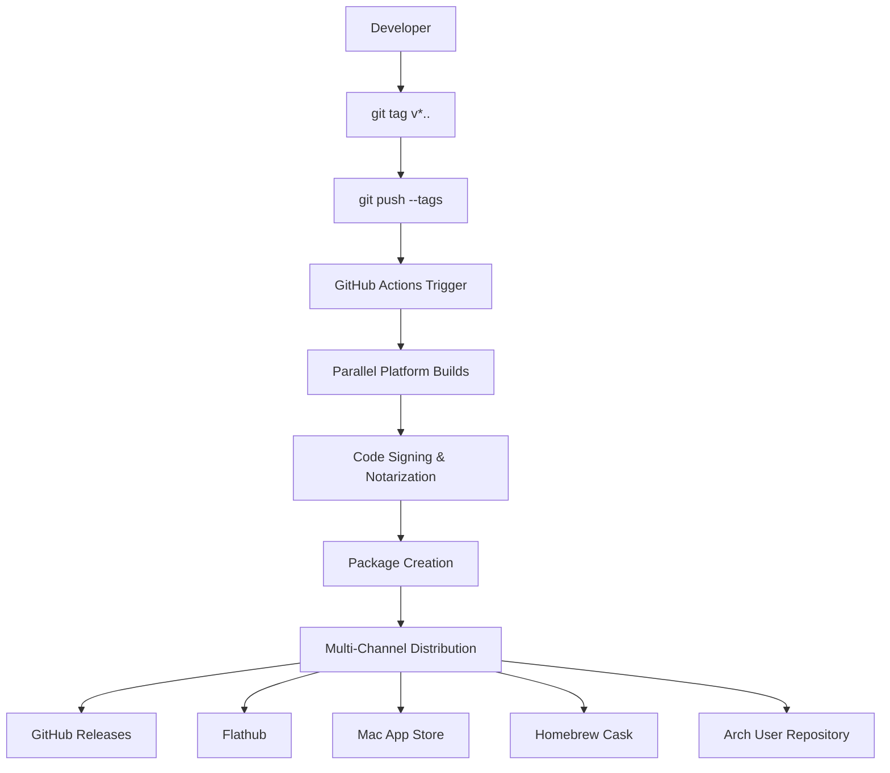
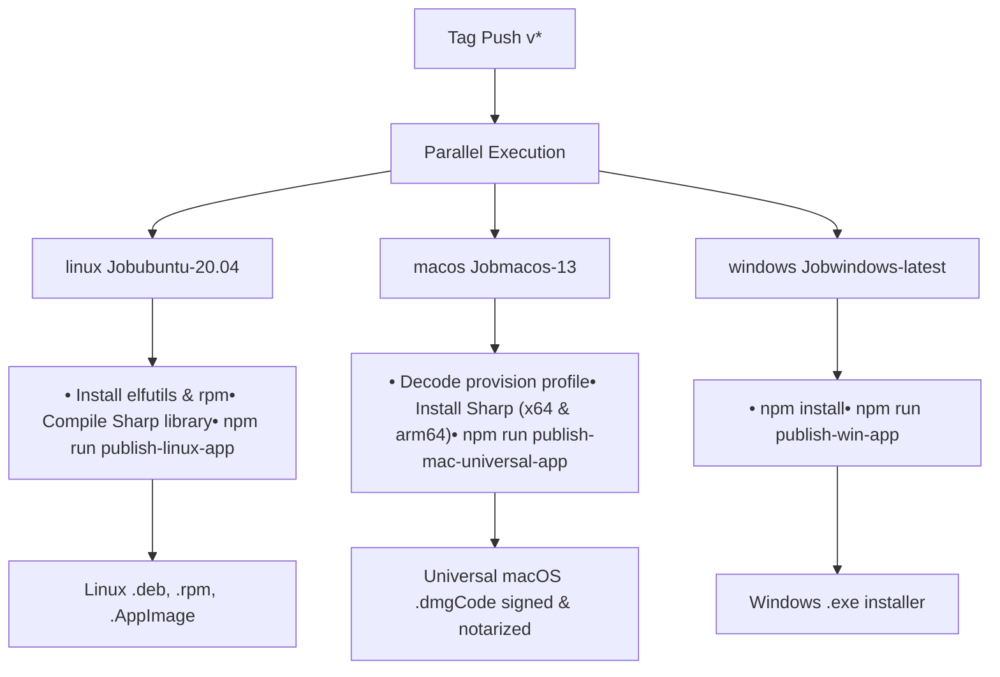
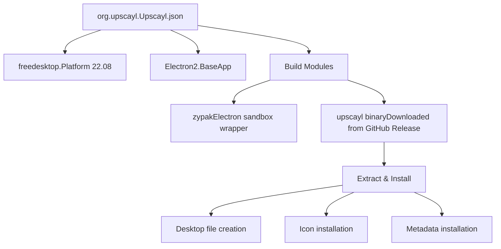

# Release Process

Relevant source files

-   [.github/workflows/main.yml](https://github.com/upscayl/upscayl/blob/1fdbd3e5/.github/workflows/main.yml)
-   [1080p\_banner.jpg](https://github.com/upscayl/upscayl/blob/1fdbd3e5/1080p_banner.jpg)
-   [1080p\_explainer.jpg](https://github.com/upscayl/upscayl/blob/1fdbd3e5/1080p_explainer.jpg)
-   [download.jpg](https://github.com/upscayl/upscayl/blob/1fdbd3e5/download.jpg)
-   [flatpak/org.upscayl.Upscayl.json](https://github.com/upscayl/upscayl/blob/1fdbd3e5/flatpak/org.upscayl.Upscayl.json)
-   [flatpak/org.upscayl.Upscayl.metainfo.xml](https://github.com/upscayl/upscayl/blob/1fdbd3e5/flatpak/org.upscayl.Upscayl.metainfo.xml)
-   [screen1.png](https://github.com/upscayl/upscayl/blob/1fdbd3e5/screen1.png)

This document covers the release workflow for Upscayl, including version management, automated builds, code signing, and distribution across multiple platforms and channels. The release process is primarily driven by GitHub Actions and supports Windows, macOS, and Linux distributions.

For information about build configuration and environment setup, see [Build Configuration](/upscayl/upscayl/6.1-build-configuration). For details about the CI/CD pipeline implementation, see [CI/CD Pipeline](/upscayl/upscayl/6.2-cicd-pipeline).

## Release Trigger and Version Management

The release process is triggered by pushing Git tags that follow the pattern `v*` (e.g., `v2.9.1`). This automated approach ensures consistent versioning and eliminates manual release initiation.

### Release Workflow Overview

**Sources:** [.github/workflows/main.yml1-10](https://github.com/upscayl/upscayl/blob/1fdbd3e5/.github/workflows/main.yml#L1-L10)

## CI/CD Pipeline Architecture

The GitHub Actions workflow consists of three parallel jobs that build platform-specific distributions. Each job runs on its respective platform to ensure native compilation and proper binary generation.

### Pipeline Job Structure

**Sources:** [.github/workflows/main.yml10-69](https://github.com/upscayl/upscayl/blob/1fdbd3e5/.github/workflows/main.yml#L10-L69)

## Platform-Specific Build Processes

### Linux Build Process

The Linux build job performs several specialized tasks including system package installation and Sharp library compilation:

-   Installs `elfutils` and `rpm` system packages for build tools
-   Removes existing Sharp module and rebuilds it with specific architecture flags
-   Uses `SHARP_IGNORE_GLOBAL_LIBVIPS=1` to ensure proper compilation
-   Executes `publish-linux-app` script for final packaging

### macOS Build Process

The macOS build includes universal binary creation and code signing:

-   Decodes provision profile from base64 encoded secret
-   Compiles Sharp library for both x64 and ARM64 architectures
-   Creates universal macOS application bundle
-   Performs code signing and notarization using Apple Developer certificates

Environment variables required:

-   `CSC_KEY_PASSWORD`: Certificate password
-   `CSC_LINK`: Certificate file
-   `APPLEID`: Apple ID for notarization
-   `APPLEIDPASS`: App-specific password
-   `TEAMID`: Apple Developer Team ID
-   `PROVISION_PROFILE`: Base64 encoded provisioning profile

### Windows Build Process

The Windows build is the most straightforward, requiring only standard npm operations without additional system dependencies or signing requirements.

**Sources:** [.github/workflows/main.yml11-68](https://github.com/upscayl/upscayl/blob/1fdbd3e5/.github/workflows/main.yml#L11-L68)

## Distribution Channels

### GitHub Releases

The primary distribution method uses GitHub Releases, automatically created by the CI/CD pipeline. Each platform job publishes its artifacts using the `GH_TOKEN` secret.

### Flatpak Distribution

Flatpak packages are distributed through Flathub and defined by the manifest configuration:

The Flatpak build references specific release versions and SHA256 checksums to ensure integrity.

### Additional Distribution Channels

-   **Mac App Store**: Uses separate MAS build configuration with App Store specific entitlements
-   **Homebrew**: Community-maintained cask formula
-   **AUR (Arch User Repository)**: Community-maintained package for Arch Linux users

**Sources:** [flatpak/org.upscayl.Upscayl.json1-62](https://github.com/upscayl/upscayl/blob/1fdbd3e5/flatpak/org.upscayl.Upscayl.json#L1-L62) [flatpak/org.upscayl.Upscayl.metainfo.xml1-130](https://github.com/upscayl/upscayl/blob/1fdbd3e5/flatpak/org.upscayl.Upscayl.metainfo.xml#L1-L130)

## Release Metadata Management

### Version History Tracking

Release information is maintained in the Flatpak metadata file, which includes:

-   Version numbers and release dates
-   Changelog entries with feature descriptions
-   Platform compatibility information
-   License and project metadata

### Metadata Structure

| Field | Purpose | Example |
| --- | --- | --- |
| `version` | Release version tag | `v2.9.1` |
| `date` | Release date | `2023-10-28` |
| `description` | Changelog entries | Feature lists and bug fixes |

The metadata follows the AppStream specification and includes screenshots, project URLs, and content ratings.

**Sources:** [flatpak/org.upscayl.Upscayl.metainfo.xml51-129](https://github.com/upscayl/upscayl/blob/1fdbd3e5/flatpak/org.upscayl.Upscayl.metainfo.xml#L51-L129)

## Automated Release Checklist

When initiating a release, the following automated processes occur:

1.  **Tag Validation**: Ensures tag follows `v*` pattern
2.  **Dependency Installation**: Platform-specific build tools and libraries
3.  **Sharp Library Compilation**: Platform-specific image processing library builds
4.  **Code Signing**: macOS binaries are signed and notarized
5.  **Package Creation**: Native installers for each platform
6.  **GitHub Release**: Automated release creation with artifacts
7.  **Distribution Updates**: Flatpak and other channels receive new version information

The entire process is designed to be fully automated, requiring only the initial tag push to trigger a complete multi-platform release cycle.

**Sources:** [.github/workflows/main.yml1-69](https://github.com/upscayl/upscayl/blob/1fdbd3e5/.github/workflows/main.yml#L1-L69)
