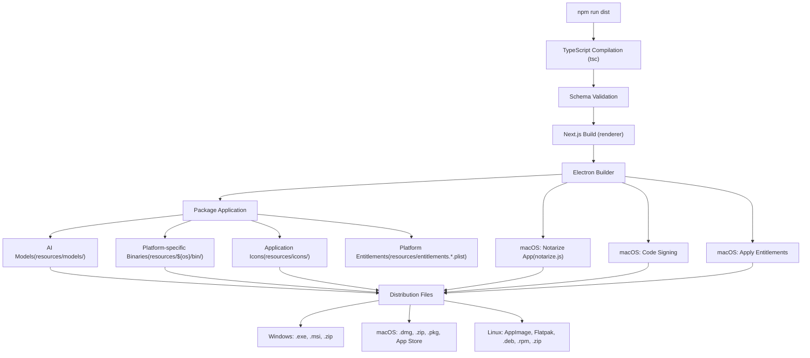
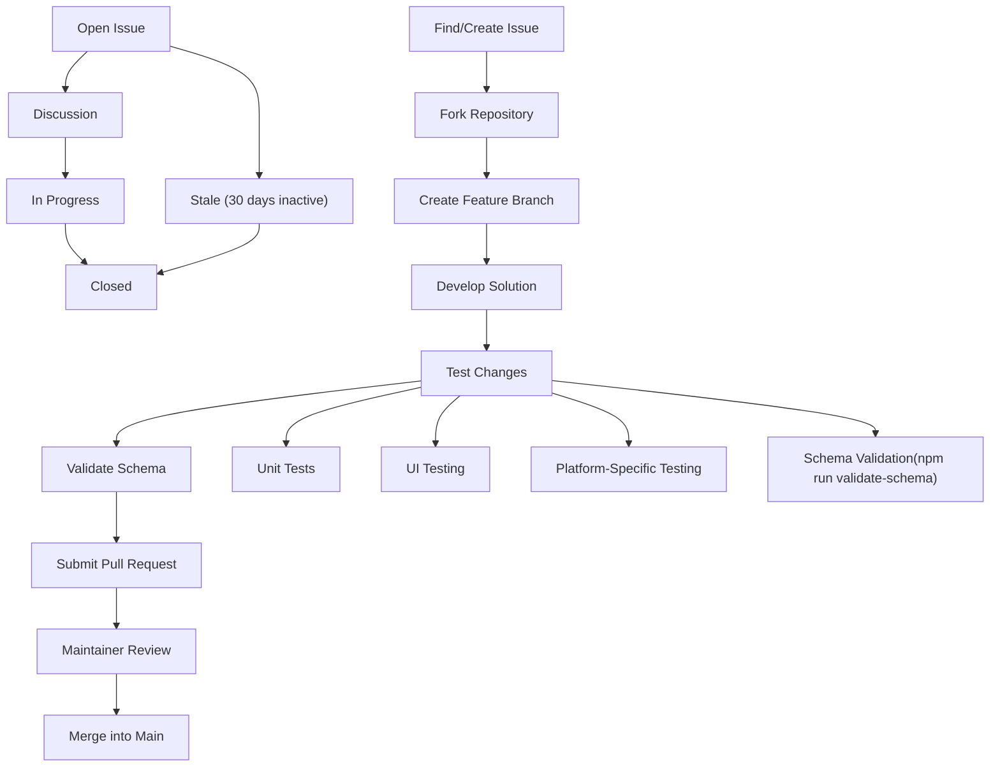
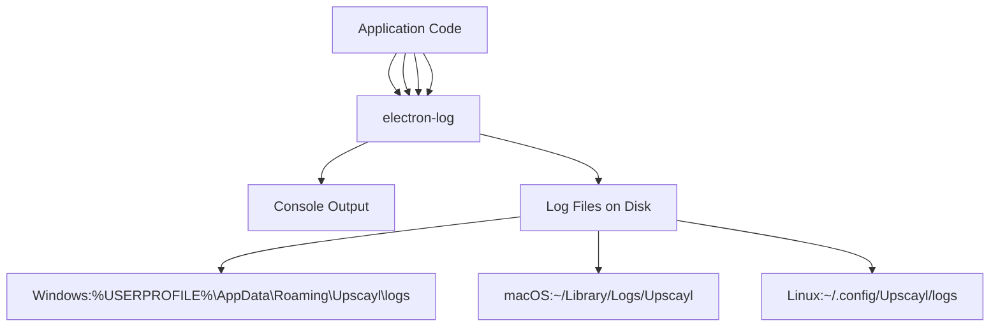

# Development Guide

Relevant source files

-   [.github/ISSUE\_TEMPLATE/bug\_report.yml](https://github.com/upscayl/upscayl/blob/1fdbd3e5/.github/ISSUE_TEMPLATE/bug_report.yml)
-   [package-lock.json](https://github.com/upscayl/upscayl/blob/1fdbd3e5/package-lock.json)
-   [package.json](https://github.com/upscayl/upscayl/blob/1fdbd3e5/package.json)
-   [renderer/components/sidebar/settings-tab/auto-update-toggle.tsx](https://github.com/upscayl/upscayl/blob/1fdbd3e5/renderer/components/sidebar/settings-tab/auto-update-toggle.tsx)
-   [renderer/components/sidebar/settings-tab/enable-contributions-toggle.tsx](https://github.com/upscayl/upscayl/blob/1fdbd3e5/renderer/components/sidebar/settings-tab/enable-contributions-toggle.tsx)

This guide provides essential information for developers who want to contribute to Upscayl, focusing on setting up the development environment and understanding the contribution process. For information about the application architecture and core systems, see [Application Architecture](/upscayl/upscayl/2-application-architecture).

## Development Environment Setup

### Prerequisites

Before you begin development, ensure you have:

-   Git for version control
-   Node.js (preferably managed with Volta)
-   A Vulkan-compatible GPU for testing upscaling functionality
-   Platform-specific build tools (if building for distribution)

### Installation Steps

1.  **Install Volta (recommended):**

    ```
    curl https://get.volta.sh | bash# Or follow instructions at https://volta.sh
    ```

    Upscayl uses Volta to manage Node.js versions (specified in `package.json`).

2.  **Install Node.js using Volta:**

    ```
    volta install node@18.20.5
    ```

3.  **Clone the repository:**

    ```
    git clone https://github.com/upscayl/upscaylcd upscayl
    ```

4.  **Install dependencies:**

    ```
    npm install
    ```

5.  **Start the development server:**

    ```
    npm run start# ornpm run dev
    ```


This will compile TypeScript files and launch the application. Your logs will appear in the terminal.

Sources: [package.json38-41](https://github.com/upscayl/upscayl/blob/1fdbd3e5/package.json#L38-L41) [package.json257-259](https://github.com/upscayl/upscayl/blob/1fdbd3e5/package.json#L257-L259)

## Development Workflow

### Project Structure Diagram

```mermaid
flowchart TD
    MainProcess["Electron Main Process"]
    Renderer["React Renderer Process"]
    Resources["Application Resources"]
    Common["Common Modules"]
    MainIndex["index.ts - Entry point"]
    Commands["commands/ - IPC handlers"]
    Utils["utils/ - Utility functions"]
    UpscaylSpawner["spawnUpscayl.ts - Core upscaling process"]
    Pages["pages/ - Next.js pages"]
    Components["components/ - UI components"]
    StateAtoms["atoms/ - Jotai state atoms"]
    Styles["styles/ - Tailwind CSS"]
    Lib["lib/ - Utility functions"]
    Types["types.ts - Shared type definitions"]
    Constants["constants.ts - Shared constants"]
    FeatureFlags["feature-flags.ts - Feature toggles"]
    Models["models/ - AI models"]
    Binaries["bin/ - Platform binaries"]
    Icons["icons/ - Application icons"]
    Entitlements["entitlements.*.plist - macOS entitlements"]

    MainProcess --> MainIndex
    MainIndex --> Commands
    MainIndex --> Utils
    Utils --> UpscaylSpawner
    Renderer --> Pages
    Renderer --> Components
    Renderer --> StateAtoms
    Renderer --> Styles
    Renderer --> Lib
    Common --> Types
    Common --> Constants
    Common --> FeatureFlags
    Resources --> Models
    Resources --> Binaries
    Resources --> Icons
    Resources --> Entitlements
    MainProcess --> Renderer
    MainProcess --> Resources
    MainProcess --> Common
    Renderer --> Resources
    Renderer --> Common
```


Sources: [package.json37](https://github.com/upscayl/upscayl/blob/1fdbd3e5/package.json#L37-L37) [package.json196-199](https://github.com/upscayl/upscayl/blob/1fdbd3e5/package.json#L196-L199) [renderer/tsconfig.json17-22](https://github.com/upscayl/upscayl/blob/1fdbd3e5/renderer/tsconfig.json#L17-L22) [resources/entitlements.mas.plist](https://github.com/upscayl/upscayl/blob/1fdbd3e5/resources/entitlements.mas.plist)

### Development Process Flow

> **[Mermaid sequence]**
> *(图表结构无法解析)*

Sources: [package.json38-42](https://github.com/upscayl/upscayl/blob/1fdbd3e5/package.json#L38-L42) [package.json71](https://github.com/upscayl/upscayl/blob/1fdbd3e5/package.json#L71-L71)

## Building and Packaging

Upscayl supports multiple build targets and platforms. The build process is handled by Electron Builder, which packages the application with all necessary resources.

### Available Build Commands

| Command | Description |
| --- | --- |
| `npm run dist` | Build for all platforms |
| `npm run dist:win` | Build for Windows (exe) |
| `npm run dist:mac` | Build for macOS (universal) |
| `npm run dist:mac-arm64` | Build for macOS (Apple Silicon) |
| `npm run dist:linux` | Build for Linux (all formats) |
| `npm run dist:appimage` | Build Linux AppImage |
| `npm run dist:flatpak` | Build Linux Flatpak |
| `npm run dist:deb` | Build Debian package |
| `npm run dist:rpm` | Build RPM package |
| `npm run dist:zip` | Build Linux zip package |
| `npm run dist:mac-zip` | Build macOS zip package |
| `npm run dist:dmg` | Build macOS DMG |
| `npm run dist:mas` | Build for Mac App Store |
| `npm run dist:mas-dev` | Build for Mac App Store (development) |

For publishing to distribution channels:

| Command | Description |
| --- | --- |
| `npm run publish-app` | Publish for all platforms |
| `npm run publish-linux-app` | Publish Linux builds |
| `npm run publish-win-app` | Publish Windows builds |
| `npm run publish-mac-universal-app` | Publish macOS universal builds |
| `npm run publish-mac-app` | Publish macOS x64 builds |
| `npm run publish-mac-arm-app` | Publish macOS arm64 builds |

Sources: [package.json45-67](https://github.com/upscayl/upscayl/blob/1fdbd3e5/package.json#L45-L67) [package.json62-67](https://github.com/upscayl/upscayl/blob/1fdbd3e5/package.json#L62-L67)

### Build Process Diagram


Sources: [package.json42-70](https://github.com/upscayl/upscayl/blob/1fdbd3e5/package.json#L42-L70) [package.json73-202](https://github.com/upscayl/upscayl/blob/1fdbd3e5/package.json#L73-L202) [notarize.js1-19](https://github.com/upscayl/upscayl/blob/1fdbd3e5/notarize.js#L1-L19) [resources/entitlements.mas.plist](https://github.com/upscayl/upscayl/blob/1fdbd3e5/resources/entitlements.mas.plist)

## Contributing Guidelines

### Pull Request Process

1.  Fork the repository and create a feature branch
2.  Make your changes, following the code style guidelines
3.  Test your changes thoroughly
4.  Submit a pull request with a clear description

### Contribution Workflow Diagram


Sources: [package.json71](https://github.com/upscayl/upscayl/blob/1fdbd3e5/package.json#L71-L71) [.gitignore1-57](https://github.com/upscayl/upscayl/blob/1fdbd3e5/.gitignore#L1-L57)

### Code Style Guidelines

-   Use TypeScript for type safety
-   Follow existing code patterns in the repository
-   Keep components small and focused
-   Use Tailwind CSS and DaisyUI for styling
-   Use Jotai for state management
-   Format code with Prettier (configured in the project)
-   Comment complex logic to explain your approach

### Schema Validation

Before submitting a PR, run the schema validation to ensure all localization files and other schema-based resources are valid:

```
npm run validate-schema
```
This validation is also part of the build process and will fail the build if schemas are invalid.

Sources: [package.json71](https://github.com/upscayl/upscayl/blob/1fdbd3e5/package.json#L71-L71)

## Debugging Tips

### Electron Process Debugging

The Electron main process logs can be viewed in the terminal where you run `npm run start`. These logs are crucial for debugging issues related to file system operations, upscaling processes, and IPC communication.

For more detailed debugging, you can use the `DEBUG` environment variable:

```
cross-env DEBUG=* npm run start
```
This is especially useful when debugging build issues:

```
cross-env DEBUG=* npm run dist
```
Sources: [package.json45](https://github.com/upscayl/upscayl/blob/1fdbd3e5/package.json#L45-L45)

### Renderer Process Debugging

For the React renderer process:

1.  Use Chrome DevTools by pressing `Ctrl+Shift+I` (or `Cmd+Option+I` on macOS) in the running application
2.  Check the Console tab for errors and warnings
3.  Use the Elements tab to inspect the UI components
4.  Use the Network tab to debug network requests (for Upscayl Cloud API)
5.  Use the React DevTools extension for component debugging

### Logging System

Upscayl uses `electron-log` for logging. This provides consistent logging across platforms and persists logs to disk for debugging production builds:


Sources: [package.json236](https://github.com/upscayl/upscayl/blob/1fdbd3e5/package.json#L236-L236)

## Platform-Specific Development

### macOS Development

For macOS App Store development:

-   Use `npm run dist:mas-dev` to create a development build for Mac App Store
-   Note that App Store builds have special entitlements and restrictions

### Linux Development

When developing for Linux:

-   Test on the specific distribution you're targeting if possible
-   Use `npm run dist:appimage` for the most portable format during testing

### Windows Development

For Windows development:

-   Ensure you have Administrator privileges when installing dependencies
-   Use `npm run dist:win` to test Windows-specific packaging

## Additional Resources

-   For model conversion and custom models, see the [Wiki](https://github.com/upscayl/upscayl/blob/1fdbd3e5/Wiki)
-   For troubleshooting during development, refer to the [Troubleshooting](https://github.com/upscayl/upscayl/blob/1fdbd3e5/Troubleshooting) page

Remember that Upscayl requires a Vulkan-compatible GPU to function correctly. Most integrated GPUs do not support the required features for the upscaling process.
