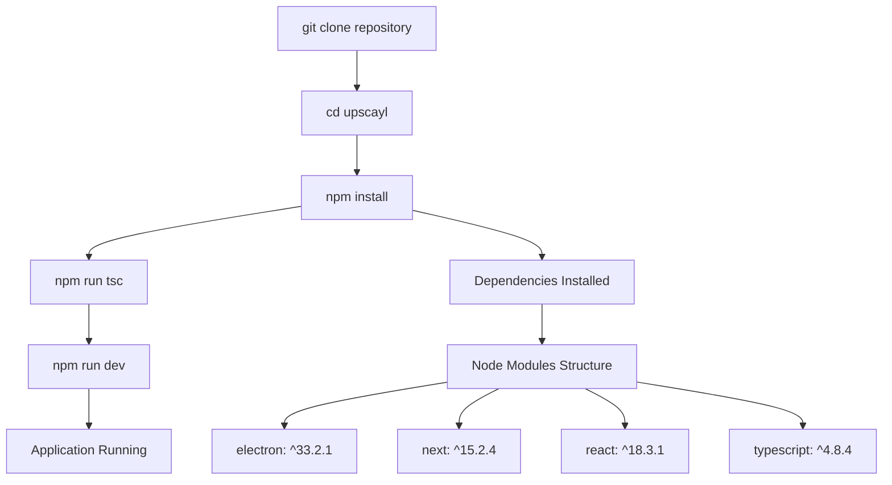
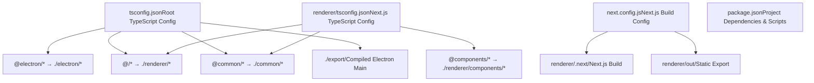
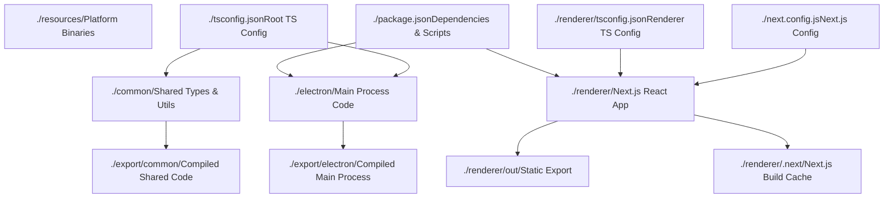

# Setup Development Environment

Relevant source files

-   [.gitignore](https://github.com/upscayl/upscayl/blob/1fdbd3e5/.gitignore)
-   [next.config.js](https://github.com/upscayl/upscayl/blob/1fdbd3e5/next.config.js)
-   [notarize.js](https://github.com/upscayl/upscayl/blob/1fdbd3e5/notarize.js)
-   [package-lock.json](https://github.com/upscayl/upscayl/blob/1fdbd3e5/package-lock.json)
-   [package.json](https://github.com/upscayl/upscayl/blob/1fdbd3e5/package.json)
-   [renderer/components/sidebar/settings-tab/auto-update-toggle.tsx](https://github.com/upscayl/upscayl/blob/1fdbd3e5/renderer/components/sidebar/settings-tab/auto-update-toggle.tsx)
-   [renderer/components/sidebar/settings-tab/enable-contributions-toggle.tsx](https://github.com/upscayl/upscayl/blob/1fdbd3e5/renderer/components/sidebar/settings-tab/enable-contributions-toggle.tsx)
-   [renderer/components/sidebar/upscayl-tab/upscayl-steps.tsx](https://github.com/upscayl/upscayl/blob/1fdbd3e5/renderer/components/sidebar/upscayl-tab/upscayl-steps.tsx)
-   [renderer/tsconfig.json](https://github.com/upscayl/upscayl/blob/1fdbd3e5/renderer/tsconfig.json)
-   [scripts/generate-schema.js](https://github.com/upscayl/upscayl/blob/1fdbd3e5/scripts/generate-schema.js)
-   [scripts/validate-schema.js](https://github.com/upscayl/upscayl/blob/1fdbd3e5/scripts/validate-schema.js)
-   [tsconfig.json](https://github.com/upscayl/upscayl/blob/1fdbd3e5/tsconfig.json)

This document provides a comprehensive guide for setting up a local development environment for Upscayl. It covers prerequisite installations, project setup, and development workflows needed to contribute to the codebase.

For information about the overall project structure, see [Project Structure](/upscayl/upscayl/1.1-project-structure). For details about building and distributing the application, see [Build Configuration](/upscayl/upscayl/6.1-build-configuration).

## Prerequisites

Upscayl requires specific software versions and system dependencies to run properly in development mode.

### Node.js and Package Manager

The project uses Node.js version `18.20.5` as specified in [package.json258-260](https://github.com/upscayl/upscayl/blob/1fdbd3e5/package.json#L258-L260) Install the exact version using your preferred Node.js version manager:

| Tool | Installation Command |
| --- | --- |
| Volta (Recommended) | `volta install node@18.20.5` |
| nvm | `nvm install 18.20.5 && nvm use 18.20.5` |
| Direct Download | Download from [Node.js official website](https://nodejs.org/) |

### System Dependencies

Upscayl requires platform-specific dependencies for AI processing:

| Platform | Requirements |
| --- | --- |
| **All Platforms** | Vulkan-compatible GPU and drivers |
| **Linux** | `vulkan-tools`, `vulkan-utils`, build essentials |
| **macOS** | Xcode Command Line Tools, MoltenVK (included) |
| **Windows** | Visual Studio Build Tools, Vulkan SDK |

### Development Tools

Install these optional but recommended development tools:

-   **TypeScript**: Global installation via `npm install -g typescript`
-   **Git**: For version control and contribution workflow
-   **Code Editor**: VS Code with TypeScript and React extensions

Sources: [package.json258-260](https://github.com/upscayl/upscayl/blob/1fdbd3e5/package.json#L258-L260) [package.json204-224](https://github.com/upscayl/upscayl/blob/1fdbd3e5/package.json#L204-L224)

## Development Environment Setup

### Clone and Install Dependencies


**Installation Process:**

1.  **Clone Repository**

    ```
    git clone https://github.com/upscayl/upscayl.gitcd upscayl
    ```

2.  **Install Dependencies**

    ```
    npm install
    ```

    This installs all dependencies from [package.json225-257](https://github.com/upscayl/upscayl/blob/1fdbd3e5/package.json#L225-L257) and [package.json204-224](https://github.com/upscayl/upscayl/blob/1fdbd3e5/package.json#L204-L224)

3.  **Initial TypeScript Compilation**

    ```
    npm run tsc
    ```

    Compiles TypeScript files according to [tsconfig.json1-26](https://github.com/upscayl/upscayl/blob/1fdbd3e5/tsconfig.json#L1-L26)


Sources: [package.json38-71](https://github.com/upscayl/upscayl/blob/1fdbd3e5/package.json#L38-L71) [tsconfig.json1-26](https://github.com/upscayl/upscayl/blob/1fdbd3e5/tsconfig.json#L1-L26)

### Project Configuration Overview

The development environment uses multiple TypeScript configurations and build tools:


**Key Configuration Details:**

-   **Root TypeScript Config** [tsconfig.json12-16](https://github.com/upscayl/upscayl/blob/1fdbd3e5/tsconfig.json#L12-L16): Maps `@electron/*`, `@/*`, and `@common/*` paths
-   **Renderer TypeScript Config** [renderer/tsconfig.json17-22](https://github.com/upscayl/upscayl/blob/1fdbd3e5/renderer/tsconfig.json#L17-L22): Additional mappings for React components
-   **Next.js Config** [next.config.js5-16](https://github.com/upscayl/upscayl/blob/1fdbd3e5/next.config.js#L5-L16): Static export mode with unoptimized images
-   **Output Directories**: `./export` for main process, `renderer/out` for static files

Sources: [tsconfig.json12-16](https://github.com/upscayl/upscayl/blob/1fdbd3e5/tsconfig.json#L12-L16) [renderer/tsconfig.json17-22](https://github.com/upscayl/upscayl/blob/1fdbd3e5/renderer/tsconfig.json#L17-L22) [next.config.js5-16](https://github.com/upscayl/upscayl/blob/1fdbd3e5/next.config.js#L5-L16)

## Development Workflow

### Available Development Scripts

The project provides several npm scripts for different development tasks:

| Script | Command | Purpose |
| --- | --- | --- |
| **Development** | `npm run dev` | Start development server |
| **Alternative Start** | `npm start` | Same as `npm run dev` |
| **TypeScript Compilation** | `npm run tsc` | Compile TypeScript only |
| **Full Build** | `npm run build` | Build renderer + compile TypeScript |
| **Clean** | `npm run clean` | Remove build artifacts |

### Development Server Startup

> **[Mermaid sequence]**
> *(图表结构无法解析)*

**Startup Process Details:**

1.  **TypeScript Compilation** [package.json40-41](https://github.com/upscayl/upscayl/blob/1fdbd3e5/package.json#L40-L41): Compiles files from `/electron` and `/common` to `/export`
2.  **Electron Main Process**: Starts from [package.json37](https://github.com/upscayl/upscayl/blob/1fdbd3e5/package.json#L37-L37) entry point `export/electron/index.js`
3.  **Renderer Process**: Next.js development server serves React application
4.  **Hot Reload**: Changes to renderer files trigger automatic recompilation

Sources: [package.json40-41](https://github.com/upscayl/upscayl/blob/1fdbd3e5/package.json#L40-L41) [package.json37](https://github.com/upscayl/upscayl/blob/1fdbd3e5/package.json#L37-L37)

### File Watching and Hot Reload

The development environment supports different levels of file watching:

| Component | File Types | Reload Behavior |
| --- | --- | --- |
| **Electron Main** | `*.ts` in `/electron`, `/common` | Manual restart required |
| **Next.js Renderer** | `*.tsx`, `*.ts` in `/renderer` | Automatic hot reload |
| **Shared Common** | `*.ts` in `/common` | Restart main, reload renderer |

## Project Structure for Development

### Source Directory Organization


**Key Development Directories:**

-   **`/electron`**: Contains Electron main process TypeScript files, IPC handlers, and system integrations
-   **`/renderer`**: Next.js React application with components, pages, and UI logic
-   **`/common`**: Shared TypeScript definitions, constants, and utilities used by both processes
-   **`/resources`**: Platform-specific binaries (`upscayl-ncnn`) and AI models

Sources: [tsconfig.json18-25](https://github.com/upscayl/upscayl/blob/1fdbd3e5/tsconfig.json#L18-L25) [.gitignore8-22](https://github.com/upscayl/upscayl/blob/1fdbd3e5/.gitignore#L8-L22)

### Import Path Resolution

The TypeScript path mapping system allows clean imports across the codebase:

| Import Pattern | Resolves To | Usage Context |
| --- | --- | --- |
| `@electron/*` | `./electron/*` | Main process imports |
| `@/*` | `./renderer/*` | Renderer process imports |
| `@common/*` | `./common/*` | Cross-process shared code |
| `@components/*` | `./renderer/components/*` | React component imports |

**Example Import Usage:**

```
// In main processimport { ELECTRON_COMMANDS } from '@common/electron-commands'; // In renderer process  import { useAtom } from '@/atoms/user-settings-atom';import Button from '@components/ui/button';
```
Sources: [tsconfig.json12-16](https://github.com/upscayl/upscayl/blob/1fdbd3e5/tsconfig.json#L12-L16) [renderer/tsconfig.json17-22](https://github.com/upscayl/upscayl/blob/1fdbd3e5/renderer/tsconfig.json#L17-L22)

## Common Development Tasks

### Building for Testing

For testing the complete application without development tools:

```
# Full production buildnpm run build # Package application (without distribution)npm run pack-app
```
The build process follows this sequence defined in [package.json42-45](https://github.com/upscayl/upscayl/blob/1fdbd3e5/package.json#L42-L45):

1.  **TypeScript Compilation**: `tsc` compiles main process code
2.  **Schema Validation**: `npm run validate-schema` validates translation files
3.  **Next.js Build**: `next build renderer` creates optimized React bundle
4.  **Electron Builder**: `electron-builder --dir` packages the application

### Schema Validation

The project includes automatic validation for translation files using [scripts/validate-schema.js1-37](https://github.com/upscayl/upscayl/blob/1fdbd3e5/scripts/validate-schema.js#L1-L37):

```
npm run validate-schema
```
This ensures all locale files in `renderer/locales/` match the structure of the base English translation file.

### Debugging and Logging

During development, utilize these debugging approaches:

| Component | Debug Method | Output Location |
| --- | --- | --- |
| **Electron Main** | `console.log()` | Terminal running `npm run dev` |
| **Renderer Process** | `console.log()` | Electron DevTools Console |
| **IPC Communication** | Electron IPC debugging | Both main and renderer logs |

Access renderer DevTools via `Ctrl+Shift+I` (Windows/Linux) or `Cmd+Option+I` (macOS) in the Electron window.

Sources: [scripts/validate-schema.js1-37](https://github.com/upscayl/upscayl/blob/1fdbd3e5/scripts/validate-schema.js#L1-L37) [package.json42-45](https://github.com/upscayl/upscayl/blob/1fdbd3e5/package.json#L42-L45)

## Environment Variables and Configuration

### Development Environment Files

Create these optional environment files for development configuration:

| File | Purpose | Gitignored |
| --- | --- | --- |
| `.env` | General environment variables | Yes |
| `.env.local` | Local development overrides | Yes |
| `.env.development.local` | Development-specific variables | Yes |

### Platform-Specific Development

Different platforms may require additional setup for the AI processing binaries:

**Linux Development:**

-   Ensure Vulkan drivers are installed: `sudo apt install vulkan-tools vulkan-utils`
-   Verify GPU compatibility: `vulkaninfo`

**macOS Development:**

-   Install Xcode Command Line Tools: `xcode-select --install`
-   Enable developer tools if needed for notarization testing

**Windows Development:**

-   Install Visual Studio Build Tools with C++ support
-   Install Vulkan SDK from LunarG

Sources: [.gitignore32-37](https://github.com/upscayl/upscayl/blob/1fdbd3e5/.gitignore#L32-L37) [package.json106-127](https://github.com/upscayl/upscayl/blob/1fdbd3e5/package.json#L106-L127)

## Troubleshooting Common Issues

### TypeScript Compilation Errors

If TypeScript compilation fails:

1.  **Clean and reinstall dependencies:**

    ```
    npm run cleanrm -rf node_modules package-lock.jsonnpm install
    ```

2.  **Check path mappings** in [tsconfig.json12-16](https://github.com/upscayl/upscayl/blob/1fdbd3e5/tsconfig.json#L12-L16) and [renderer/tsconfig.json17-22](https://github.com/upscayl/upscayl/blob/1fdbd3e5/renderer/tsconfig.json#L17-L22)

3.  **Verify Node.js version** matches [package.json258-260](https://github.com/upscayl/upscayl/blob/1fdbd3e5/package.json#L258-L260)


### Electron Application Won't Start

Common startup issues and solutions:

| Problem | Solution |
| --- | --- |
| **"Module not found"** | Run `npm run tsc` to compile TypeScript |
| **"Permission denied"** | Check file permissions on `/resources` binaries |
| **"Vulkan not available"** | Install GPU drivers and Vulkan support |

### Next.js Build Failures

If the renderer build fails:

1.  **Check Next.js configuration** in [next.config.js5-16](https://github.com/upscayl/upscayl/blob/1fdbd3e5/next.config.js#L5-L16)
2.  **Verify React/TypeScript compatibility** in dependencies
3.  **Clear Next.js cache**: `rm -rf renderer/.next`

Sources: [package.json39](https://github.com/upscayl/upscayl/blob/1fdbd3e5/package.json#L39-L39) [next.config.js5-16](https://github.com/upscayl/upscayl/blob/1fdbd3e5/next.config.js#L5-L16) [.gitignore15-22](https://github.com/upscayl/upscayl/blob/1fdbd3e5/.gitignore#L15-L22)
