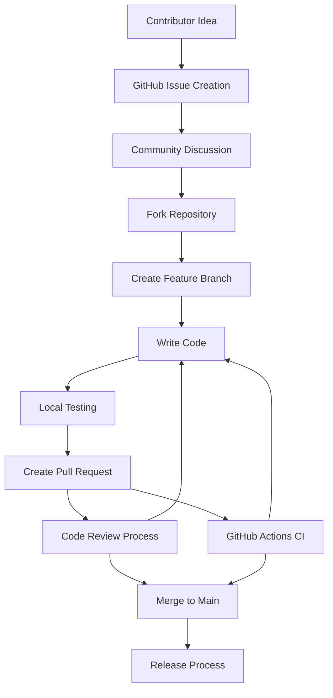
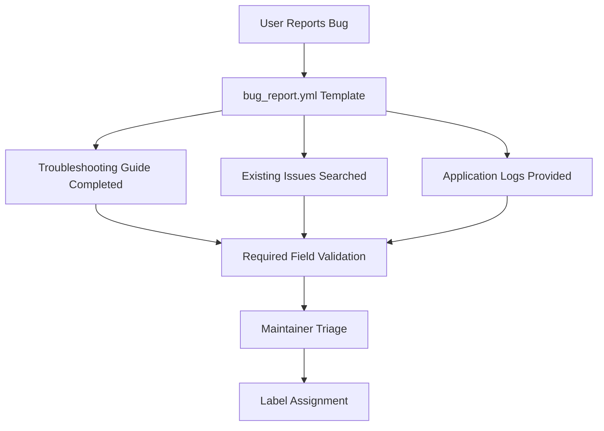
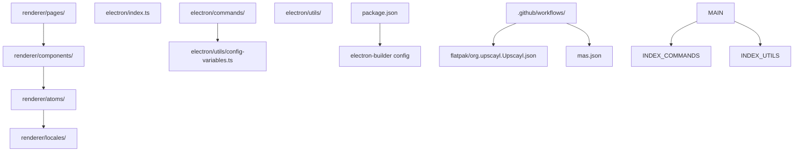
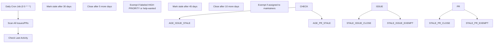

# Contributing Guidelines

Relevant source files

-   [.github/ISSUE\_TEMPLATE/bug\_report.yml](https://github.com/upscayl/upscayl/blob/1fdbd3e5/.github/ISSUE_TEMPLATE/bug_report.yml)
-   [.github/workflows/stale.yml](https://github.com/upscayl/upscayl/blob/1fdbd3e5/.github/workflows/stale.yml)
-   [README.md](https://github.com/upscayl/upscayl/blob/1fdbd3e5/README.md?plain=1)
-   [electron/utils/show-notification.ts](https://github.com/upscayl/upscayl/blob/1fdbd3e5/electron/utils/show-notification.ts)
-   [upscayl.mp4](https://github.com/upscayl/upscayl/blob/1fdbd3e5/upscayl.mp4)

This document outlines the processes, standards, and guidelines for contributing to the Upscayl project. It covers everything from reporting bugs and suggesting features to submitting code changes and participating in the development community.

For information about setting up the development environment, see [Setup Development Environment](/upscayl/upscayl/7.1-setup-development-environment). For details about the overall project architecture that contributors should understand, see [Application Architecture](/upscayl/upscayl/2-application-architecture).

## Types of Contributions

Upscayl welcomes various types of contributions from the community:

| Contribution Type | Description | Entry Point |
| --- | --- | --- |
| Bug Reports | Report issues with the application | [GitHub Issues](https://github.com/upscayl/upscayl/blob/1fdbd3e5/GitHub Issues) |
| Feature Requests | Suggest new functionality | GitHub Issues |
| Code Contributions | Submit bug fixes or new features | Pull Requests |
| Documentation | Improve documentation and guides | Pull Requests |
| Translations | Add or improve i18n support | Pull Requests |
| Model Contributions | Contribute AI models | [Custom Models Repository](https://github.com/upscayl/upscayl/blob/1fdbd3e5/Custom Models Repository) |

## Contribution Workflow

### Overall Contribution Process

Sources: [README.md162-181](https://github.com/upscayl/upscayl/blob/1fdbd3e5/README.md?plain=1#L162-L181) [.github/workflows/](https://github.com/upscayl/upscayl/blob/1fdbd3e5/.github/workflows/) [.github/ISSUE\_TEMPLATE/bug\_report.yml](https://github.com/upscayl/upscayl/blob/1fdbd3e5/.github/ISSUE_TEMPLATE/bug_report.yml)

### Issue Lifecycle Management

> **[Mermaid stateDiagram]**
> *(图表结构无法解析)*

Sources: [.github/workflows/stale.yml1-27](https://github.com/upscayl/upscayl/blob/1fdbd3e5/.github/workflows/stale.yml#L1-L27) [.github/ISSUE\_TEMPLATE/bug\_report.yml](https://github.com/upscayl/upscayl/blob/1fdbd3e5/.github/ISSUE_TEMPLATE/bug_report.yml)

## Bug Reporting Process

### Required Information

Before submitting a bug report, contributors must complete the structured checklist defined in the issue template:

| Field | Description | Required |
| --- | --- | --- |
| Troubleshooting Verification | Confirm all troubleshooting steps attempted | Yes |
| Issue Search | Verify issue hasn't been reported | Yes |
| Bug Description | Clear description of the problem | Yes |
| Reproduction Steps | Step-by-step reproduction guide | Yes |
| Version Information | Upscayl version or commit hash | Yes |
| Platform | Operating system and distribution method | Yes |
| OS Version | Specific OS version details | Yes |
| GPU Information | Graphics card specifications | Yes |
| Expected Behavior | What should have happened | No |
| Screenshots | Visual evidence of the issue | No |
| Logs | Application logs from the issue | Yes |

### Bug Report Template Structure

The bug reporting process is automated through GitHub's issue template system:

Sources: [.github/ISSUE\_TEMPLATE/bug\_report.yml1-78](https://github.com/upscayl/upscayl/blob/1fdbd3e5/.github/ISSUE_TEMPLATE/bug_report.yml#L1-L78)

## Code Standards and Practices

### Project Structure Understanding

Contributors should familiarize themselves with the codebase organization:

Sources: [Project Structure](/upscayl/upscayl/1.1-project-structure), [renderer/](https://github.com/upscayl/upscayl/blob/1fdbd3e5/renderer/) [electron/](https://github.com/upscayl/upscayl/blob/1fdbd3e5/electron/) [.github/workflows/](https://github.com/upscayl/upscayl/blob/1fdbd3e5/.github/workflows/)

### Development Commands

| Command | Purpose | Usage |
| --- | --- | --- |
| `npm install` | Install dependencies | Required before development |
| `npm run start` | Start development server | Local development and testing |
| `npm run dist` | Build production packages | Package verification |
| `npm run publish-app` | Publish release | Maintainers only |

Sources: [README.md175-195](https://github.com/upscayl/upscayl/blob/1fdbd3e5/README.md?plain=1#L175-L195)

### Code Quality Requirements

1.  **Type Safety**: The project uses TypeScript throughout both main and renderer processes
2.  **Linting**: Code must pass ESLint checks configured for the project
3.  **Testing**: Changes should include appropriate tests where applicable
4.  **Documentation**: New features require documentation updates

## Pull Request Process

### PR Submission Guidelines

> **[Mermaid sequence]**
> *(图表结构无法解析)*

Sources: [README.md162-195](https://github.com/upscayl/upscayl/blob/1fdbd3e5/README.md?plain=1#L162-L195) [.github/workflows/](https://github.com/upscayl/upscayl/blob/1fdbd3e5/.github/workflows/)

### Review Criteria

Maintainers evaluate pull requests based on:

1.  **Functionality**: Does the change work as intended?
2.  **Code Quality**: Is the code well-structured and maintainable?
3.  **Performance**: Does it impact application performance?
4.  **Compatibility**: Works across supported platforms?
5.  **Documentation**: Are changes properly documented?
6.  **Tests**: Are tests included and passing?

## Automated Issue Management

The project uses automated workflows to maintain issue hygiene:

### Stale Issue Handling

Sources: [.github/workflows/stale.yml1-27](https://github.com/upscayl/upscayl/blob/1fdbd3e5/.github/workflows/stale.yml#L1-L27)

### Exempt Categories

The automated system respects certain categories:

| Type | Exemption Rules | Reason |
| --- | --- | --- |
| High Priority Issues | `HIGH PRIORITY` label | Critical bugs or features |
| Help Wanted | `help-wanted` label | Community contribution opportunities |
| Assigned Issues | Assigned to `aaronliu0130`, `NayamAmarshe`, or `TGS963` | Active maintainer work |

Sources: [.github/workflows/stale.yml25-26](https://github.com/upscayl/upscayl/blob/1fdbd3e5/.github/workflows/stale.yml#L25-L26)

## Communication Channels

### Official Channels

| Platform | Purpose | Link |
| --- | --- | --- |
| GitHub Issues | Bug reports and feature requests | Repository issues tab |
| GitHub Discussions | General discussion and questions | Repository discussions |
| Telegram | Community chat | @iamnayam |
| X (Twitter) | Project updates | @upscayl |

Sources: [README.md44-50](https://github.com/upscayl/upscayl/blob/1fdbd3e5/README.md?plain=1#L44-L50)

### Maintainer Contact

The project is maintained by:

-   **NayamAmarshe** - Core maintainer
-   **TGS963** - Core maintainer
-   **aaronliu0130** - Community support

Sources: [README.md229](https://github.com/upscayl/upscayl/blob/1fdbd3e5/README.md?plain=1#L229-L229) [.github/workflows/stale.yml26](https://github.com/upscayl/upscayl/blob/1fdbd3e5/.github/workflows/stale.yml#L26-L26)

## Special Contribution Areas

### Custom AI Models

Contributors can extend Upscayl's capabilities by:

1.  Converting new AI models using the conversion guide
2.  Contributing to the [custom-models repository](https://github.com/upscayl/upscayl/blob/1fdbd3e5/custom-models repository)
3.  Testing model compatibility across platforms

### Internationalization

The project supports multiple languages through the i18n system located in [\`renderer/locales/\`](https://github.com/upscayl/upscayl/blob/1fdbd3e5/`renderer/locales/`) Contributors can:

1.  Add new language files
2.  Improve existing translations
3.  Test language switching functionality

### Platform-Specific Features

Platform maintainers can contribute to:

-   **Flatpak**: [\`flatpak/org.upscayl.Upscayl.json\`](https://github.com/upscayl/upscayl/blob/1fdbd3e5/`flatpak/org.upscayl.Upscayl.json`)
-   **macOS App Store**: [\`mas.json\`](https://github.com/upscayl/upscayl/blob/1fdbd3e5/`mas.json`)
-   **Windows**: Platform-specific notification handling
-   **Linux**: Distribution-specific packaging

Sources: [README.md146-149](https://github.com/upscayl/upscayl/blob/1fdbd3e5/README.md?plain=1#L146-L149) [flatpak/](https://github.com/upscayl/upscayl/blob/1fdbd3e5/flatpak/) [mas.json](https://github.com/upscayl/upscayl/blob/1fdbd3e5/mas.json) [electron/utils/show-notification.ts8-24](https://github.com/upscayl/upscayl/blob/1fdbd3e5/electron/utils/show-notification.ts#L8-L24)
