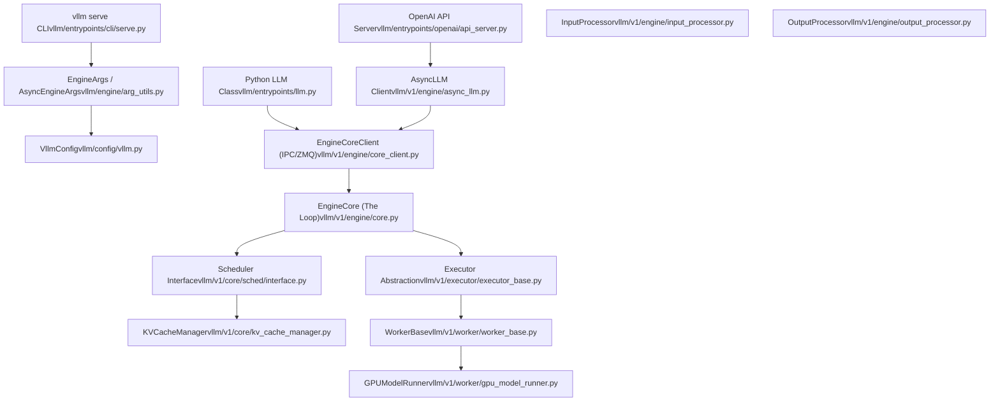

# Overview

Relevant source files

-   [.gitignore](https://github.com/vllm-project/vllm/blob/7cc302dd/.gitignore)
-   [README.md](https://github.com/vllm-project/vllm/blob/7cc302dd/README.md?plain=1)
-   [docs/.nav.yml](https://github.com/vllm-project/vllm/blob/7cc302dd/docs/.nav.yml)
-   [docs/README.md](https://github.com/vllm-project/vllm/blob/7cc302dd/docs/README.md?plain=1)
-   [docs/community/contact\_us.md](https://github.com/vllm-project/vllm/blob/7cc302dd/docs/community/contact_us.md?plain=1)
-   [docs/community/meetups.md](https://github.com/vllm-project/vllm/blob/7cc302dd/docs/community/meetups.md?plain=1)
-   [docs/community/sponsors.md](https://github.com/vllm-project/vllm/blob/7cc302dd/docs/community/sponsors.md?plain=1)
-   [docs/configuration/serve\_args.md](https://github.com/vllm-project/vllm/blob/7cc302dd/docs/configuration/serve_args.md?plain=1)
-   [docs/contributing/model/README.md](https://github.com/vllm-project/vllm/blob/7cc302dd/docs/contributing/model/README.md?plain=1)
-   [docs/contributing/model/basic.md](https://github.com/vllm-project/vllm/blob/7cc302dd/docs/contributing/model/basic.md?plain=1)
-   [docs/contributing/model/multimodal.md](https://github.com/vllm-project/vllm/blob/7cc302dd/docs/contributing/model/multimodal.md?plain=1)
-   [docs/contributing/model/registration.md](https://github.com/vllm-project/vllm/blob/7cc302dd/docs/contributing/model/registration.md?plain=1)
-   [docs/contributing/model/tests.md](https://github.com/vllm-project/vllm/blob/7cc302dd/docs/contributing/model/tests.md?plain=1)
-   [docs/contributing/model/transcription.md](https://github.com/vllm-project/vllm/blob/7cc302dd/docs/contributing/model/transcription.md?plain=1)
-   [docs/deployment/frameworks/hf\_inference\_endpoints.md](https://github.com/vllm-project/vllm/blob/7cc302dd/docs/deployment/frameworks/hf_inference_endpoints.md?plain=1)
-   [docs/design/plugin\_system.md](https://github.com/vllm-project/vllm/blob/7cc302dd/docs/design/plugin_system.md?plain=1)
-   [docs/examples/README.md](https://github.com/vllm-project/vllm/blob/7cc302dd/docs/examples/README.md?plain=1)
-   [docs/features/README.md](https://github.com/vllm-project/vllm/blob/7cc302dd/docs/features/README.md?plain=1)
-   [docs/features/prompt\_embeds.md](https://github.com/vllm-project/vllm/blob/7cc302dd/docs/features/prompt_embeds.md?plain=1)
-   [docs/getting\_started/quickstart.md](https://github.com/vllm-project/vllm/blob/7cc302dd/docs/getting_started/quickstart.md?plain=1)
-   [docs/mkdocs/hooks/generate\_argparse.py](https://github.com/vllm-project/vllm/blob/7cc302dd/docs/mkdocs/hooks/generate_argparse.py)
-   [docs/mkdocs/hooks/url\_schemes.py](https://github.com/vllm-project/vllm/blob/7cc302dd/docs/mkdocs/hooks/url_schemes.py)
-   [docs/mkdocs/javascript/edit\_and\_feedback.js](https://github.com/vllm-project/vllm/blob/7cc302dd/docs/mkdocs/javascript/edit_and_feedback.js)
-   [docs/mkdocs/javascript/mathjax.js](https://github.com/vllm-project/vllm/blob/7cc302dd/docs/mkdocs/javascript/mathjax.js)
-   [docs/mkdocs/javascript/slack\_and\_forum.js](https://github.com/vllm-project/vllm/blob/7cc302dd/docs/mkdocs/javascript/slack_and_forum.js)
-   [docs/mkdocs/stylesheets/extra.css](https://github.com/vllm-project/vllm/blob/7cc302dd/docs/mkdocs/stylesheets/extra.css)
-   [docs/models/generative\_models.md](https://github.com/vllm-project/vllm/blob/7cc302dd/docs/models/generative_models.md?plain=1)
-   [docs/models/pooling\_models/classify.md](https://github.com/vllm-project/vllm/blob/7cc302dd/docs/models/pooling_models/classify.md?plain=1)
-   [docs/models/pooling\_models/embed.md](https://github.com/vllm-project/vllm/blob/7cc302dd/docs/models/pooling_models/embed.md?plain=1)
-   [docs/models/pooling\_models/reward.md](https://github.com/vllm-project/vllm/blob/7cc302dd/docs/models/pooling_models/reward.md?plain=1)
-   [docs/models/pooling\_models/scoring.md](https://github.com/vllm-project/vllm/blob/7cc302dd/docs/models/pooling_models/scoring.md?plain=1)
-   [docs/serving/offline\_inference.md](https://github.com/vllm-project/vllm/blob/7cc302dd/docs/serving/offline_inference.md?plain=1)
-   [docs/serving/openai\_compatible\_server.md](https://github.com/vllm-project/vllm/blob/7cc302dd/docs/serving/openai_compatible_server.md?plain=1)
-   [docs/training/trl.md](https://github.com/vllm-project/vllm/blob/7cc302dd/docs/training/trl.md?plain=1)
-   [docs/usage/README.md](https://github.com/vllm-project/vllm/blob/7cc302dd/docs/usage/README.md?plain=1)
-   [docs/usage/troubleshooting.md](https://github.com/vllm-project/vllm/blob/7cc302dd/docs/usage/troubleshooting.md?plain=1)
-   [docs/usage/v1\_guide.md](https://github.com/vllm-project/vllm/blob/7cc302dd/docs/usage/v1_guide.md?plain=1)
-   [examples/online\_serving/disaggregated\_encoder/README.md](https://github.com/vllm-project/vllm/blob/7cc302dd/examples/online_serving/disaggregated_encoder/README.md?plain=1)
-   [mkdocs.yaml](https://github.com/vllm-project/vllm/blob/7cc302dd/mkdocs.yaml)
-   [requirements/docs.txt](https://github.com/vllm-project/vllm/blob/7cc302dd/requirements/docs.txt)
-   [tests/compile/README.md](https://github.com/vllm-project/vllm/blob/7cc302dd/tests/compile/README.md?plain=1)
-   [tests/compile/backend.py](https://github.com/vllm-project/vllm/blob/7cc302dd/tests/compile/backend.py)
-   [tests/compile/fullgraph/\_\_init\_\_.py](https://github.com/vllm-project/vllm/blob/7cc302dd/tests/compile/fullgraph/__init__.py)
-   [tests/compile/fullgraph/test\_basic\_correctness.py](https://github.com/vllm-project/vllm/blob/7cc302dd/tests/compile/fullgraph/test_basic_correctness.py)
-   [tests/compile/fullgraph/test\_full\_cudagraph.py](https://github.com/vllm-project/vllm/blob/7cc302dd/tests/compile/fullgraph/test_full_cudagraph.py)
-   [tests/compile/fullgraph/test\_full\_graph.py](https://github.com/vllm-project/vllm/blob/7cc302dd/tests/compile/fullgraph/test_full_graph.py)
-   [tests/entrypoints/test\_api\_server\_process\_manager.py](https://github.com/vllm-project/vllm/blob/7cc302dd/tests/entrypoints/test_api_server_process_manager.py)
-   [tests/utils\_/test\_cache.py](https://github.com/vllm-project/vllm/blob/7cc302dd/tests/utils_/test_cache.py)
-   [tests/v1/engine/test\_engine\_core.py](https://github.com/vllm-project/vllm/blob/7cc302dd/tests/v1/engine/test_engine_core.py)
-   [tests/v1/engine/test\_engine\_core\_client.py](https://github.com/vllm-project/vllm/blob/7cc302dd/tests/v1/engine/test_engine_core_client.py)
-   [vllm/benchmarks/\_\_init\_\_.py](https://github.com/vllm-project/vllm/blob/7cc302dd/vllm/benchmarks/__init__.py)
-   [vllm/config/parallel.py](https://github.com/vllm-project/vllm/blob/7cc302dd/vllm/config/parallel.py)
-   [vllm/engine/async\_llm\_engine.py](https://github.com/vllm-project/vllm/blob/7cc302dd/vllm/engine/async_llm_engine.py)
-   [vllm/engine/llm\_engine.py](https://github.com/vllm-project/vllm/blob/7cc302dd/vllm/engine/llm_engine.py)
-   [vllm/engine/protocol.py](https://github.com/vllm-project/vllm/blob/7cc302dd/vllm/engine/protocol.py)
-   [vllm/entrypoints/cli/serve.py](https://github.com/vllm-project/vllm/blob/7cc302dd/vllm/entrypoints/cli/serve.py)
-   [vllm/entrypoints/launcher.py](https://github.com/vllm-project/vllm/blob/7cc302dd/vllm/entrypoints/launcher.py)
-   [vllm/entrypoints/llm.py](https://github.com/vllm-project/vllm/blob/7cc302dd/vllm/entrypoints/llm.py)
-   [vllm/env\_override.py](https://github.com/vllm-project/vllm/blob/7cc302dd/vllm/env_override.py)
-   [vllm/model\_executor/models/config.py](https://github.com/vllm-project/vllm/blob/7cc302dd/vllm/model_executor/models/config.py)
-   [vllm/utils/cache.py](https://github.com/vllm-project/vllm/blob/7cc302dd/vllm/utils/cache.py)
-   [vllm/v1/engine/async\_llm.py](https://github.com/vllm-project/vllm/blob/7cc302dd/vllm/v1/engine/async_llm.py)
-   [vllm/v1/engine/coordinator.py](https://github.com/vllm-project/vllm/blob/7cc302dd/vllm/v1/engine/coordinator.py)
-   [vllm/v1/engine/core.py](https://github.com/vllm-project/vllm/blob/7cc302dd/vllm/v1/engine/core.py)
-   [vllm/v1/engine/core\_client.py](https://github.com/vllm-project/vllm/blob/7cc302dd/vllm/v1/engine/core_client.py)
-   [vllm/v1/engine/llm\_engine.py](https://github.com/vllm-project/vllm/blob/7cc302dd/vllm/v1/engine/llm_engine.py)
-   [vllm/v1/engine/utils.py](https://github.com/vllm-project/vllm/blob/7cc302dd/vllm/v1/engine/utils.py)
-   [vllm/v1/utils.py](https://github.com/vllm-project/vllm/blob/7cc302dd/vllm/v1/utils.py)
-   [vllm/vllm\_flash\_attn/\_\_init\_\_.py](https://github.com/vllm-project/vllm/blob/7cc302dd/vllm/vllm_flash_attn/__init__.py)

This page provides a high-level introduction to vLLM's architecture, core components, and design principles. It serves as an entry point for understanding how vLLM orchestrates large language model inference across multiple hardware platforms with optimized memory management and execution.

vLLM V1 represents a significant re-architecture of the core engine (scheduler, KV cache manager, worker, and sampler) to provide a cohesive, modular, and high-performance framework while retaining the stable model implementations and kernels from V0 [docs/usage/v1\_guide.md9-15](https://github.com/vllm-project/vllm/blob/7cc302dd/docs/usage/v1_guide.md?plain=1#L9-L15)

---

## What is vLLM

vLLM is a high-performance inference engine for large language models (LLMs) that optimizes throughput and memory efficiency through:

-   **PagedAttention**: Block-based KV cache management that eliminates memory fragmentation [README.md31](https://github.com/vllm-project/vllm/blob/7cc302dd/README.md?plain=1#L31-L31)
-   **Continuous Batching**: Dynamic request scheduling that maximizes GPU utilization [README.md32](https://github.com/vllm-project/vllm/blob/7cc302dd/README.md?plain=1#L32-L32)
-   **Chunked Prefill**: Enabled by default in V1, it processes large prefills in smaller chunks to balance compute-bound and memory-bound operations [docs/usage/v1\_guide.md37-39](https://github.com/vllm-project/vllm/blob/7cc302dd/docs/usage/v1_guide.md?plain=1#L37-L39)
-   **Multi-platform Support**: Native support for NVIDIA GPUs, AMD CPUs/GPUs, Intel CPUs/GPUs, PowerPC, Arm, and TPU [README.md46](https://github.com/vllm-project/vllm/blob/7cc302dd/README.md?plain=1#L46-L46)
-   **Speculative Decoding**: Support for various draft-and-verify mechanisms to accelerate generation [README.md36](https://github.com/vllm-project/vllm/blob/7cc302dd/README.md?plain=1#L36-L36)

**Sources:** [README.md24-62](https://github.com/vllm-project/vllm/blob/7cc302dd/README.md?plain=1#L24-L62) [docs/usage/v1\_guide.md1-31](https://github.com/vllm-project/vllm/blob/7cc302dd/docs/usage/v1_guide.md?plain=1#L1-L31)

---

## System Architecture

vLLM follows a layered architecture with clear separation of concerns across distinct functional layers. The V1 engine introduces a decoupled execution model where the `EngineCore` can run in a separate process from the API frontend [vllm/v1/engine/core\_client.py89-103](https://github.com/vllm-project/vllm/blob/7cc302dd/vllm/v1/engine/core_client.py#L89-L103)

### High-Level System Components

Title: vLLM System Architecture (Natural Language to Code Entities)

**Layered Architecture Overview**

| Layer | Purpose | Key Components |
| --- | --- | --- |
| **External Interface** | Entry points for users | `LLM`, `AsyncLLM`, OpenAI API server, CLI commands |
| **Configuration** | Argument parsing and config assembly | `EngineArgs`, `VllmConfig`, `ModelConfig` |
| **Engine Orchestration** | Request scheduling and coordination | `EngineCore`, `InputProcessor`, `OutputProcessor` |
| **Scheduling & Memory** | Resource management | `Scheduler`, `KVCacheManager`, `BlockPool` |
| **Execution** | Model forward passes on devices | `Executor`, `Worker`, `GPUModelRunner` |

**Sources:** [vllm/v1/engine/core.py87-150](https://github.com/vllm-project/vllm/blob/7cc302dd/vllm/v1/engine/core.py#L87-L150) [vllm/v1/engine/async\_llm.py71-161](https://github.com/vllm-project/vllm/blob/7cc302dd/vllm/v1/engine/async_llm.py#L71-L161) [vllm/entrypoints/llm.py111-200](https://github.com/vllm-project/vllm/blob/7cc302dd/vllm/entrypoints/llm.py#L111-L200) [vllm/v1/engine/core\_client.py69-103](https://github.com/vllm-project/vllm/blob/7cc302dd/vllm/v1/engine/core_client.py#L69-L103)

---

## Core Components

### EngineCore: The Central Serving Loop

`EngineCore` is the inner loop of the V1 engine. It manages the lifecycle of the `Scheduler` and the `Executor` [vllm/v1/engine/core.py87-97](https://github.com/vllm-project/vllm/blob/7cc302dd/vllm/v1/engine/core.py#L87-L97) It is typically launched in a background process using `EngineCoreProc` [vllm/v1/engine/core.py756-760](https://github.com/vllm-project/vllm/blob/7cc302dd/vllm/v1/engine/core.py#L756-L760)

**Key responsibilities:**

-   **Initialization**: Sets up KV caches, the model executor, and the scheduler based on `VllmConfig` [vllm/v1/engine/core.py113-150](https://github.com/vllm-project/vllm/blob/7cc302dd/vllm/v1/engine/core.py#L113-L150)
-   **Request Handling**: Receives `EngineCoreRequest` objects (Add, Abort, Reset) through a ZMQ-based IPC mechanism [vllm/v1/engine/core.py545-580](https://github.com/vllm-project/vllm/blob/7cc302dd/vllm/v1/engine/core.py#L545-L580)
-   **Iteration Loop**: Executes the `_run_iteration` method, which calls the scheduler, executes the model, and processes outputs [vllm/v1/engine/core.py410-480](https://github.com/vllm-project/vllm/blob/7cc302dd/vllm/v1/engine/core.py#L410-L480)
-   **State Management**: Tracks request status and manages preemption via the scheduler [vllm/v1/engine/core.py415-430](https://github.com/vllm-project/vllm/blob/7cc302dd/vllm/v1/engine/core.py#L415-L430)

### EngineCoreClient and IPC

To support high-throughput serving, V1 decouples the Python API from the engine loop. `EngineCoreClient` provides an abstraction for interacting with the engine [vllm/v1/engine/core\_client.py69-78](https://github.com/vllm-project/vllm/blob/7cc302dd/vllm/v1/engine/core_client.py#L69-L78):

-   **InprocClient**: Runs the engine in the same process (V0-style compatibility) [vllm/v1/engine/core\_client.py103](https://github.com/vllm-project/vllm/blob/7cc302dd/vllm/v1/engine/core_client.py#L103-L103)
-   **AsyncMPClient**: Uses ZMQ and multiprocessing to communicate with a background `EngineCore` process, ideal for `AsyncLLM` [vllm/v1/engine/core\_client.py114-130](https://github.com/vllm-project/vllm/blob/7cc302dd/vllm/v1/engine/core_client.py#L114-L130)
-   **DPLBAsyncMPClient**: Provides internal load balancing across multiple Data Parallel (DP) engine ranks [vllm/v1/engine/core\_client.py129](https://github.com/vllm-project/vllm/blob/7cc302dd/vllm/v1/engine/core_client.py#L129-L129)

**Sources:** [vllm/v1/engine/core.py87-180](https://github.com/vllm-project/vllm/blob/7cc302dd/vllm/v1/engine/core.py#L87-L180) [vllm/v1/engine/core\_client.py69-130](https://github.com/vllm-project/vllm/blob/7cc302dd/vllm/v1/engine/core_client.py#L69-L130) [vllm/v1/engine/async\_llm.py154-161](https://github.com/vllm-project/vllm/blob/7cc302dd/vllm/v1/engine/async_llm.py#L154-L161)

---

## Request Processing Flow

The following diagram shows the end-to-end flow of a request in the V1 architecture, bridging the gap between the user-facing API and the low-level execution.

Title: vLLM V1 Request Lifecycle (Code Entity Space)

> **[Mermaid sequence]**
> *(图表结构无法解析)*

**Request Lifecycle Stages:**

1.  **Input Processing**: The `InputProcessor` converts high-level `EngineInput` (text, tokens, or multimodal) into `EngineCoreRequest` [vllm/v1/engine/input\_processor.py44-55](https://github.com/vllm-project/vllm/blob/7cc302dd/vllm/v1/engine/input_processor.py#L44-L55)
2.  **Scheduling**: The `Scheduler` selects requests from the waiting queue, ensuring they fit within the token budget and KV cache capacity [vllm/v1/engine/core.py415-425](https://github.com/vllm-project/vllm/blob/7cc302dd/vllm/v1/engine/core.py#L415-L425)
3.  **Execution**: The `Executor` (e.g., `MultiprocExecutor`) coordinates the model forward pass across workers [vllm/v1/engine/core.py455-465](https://github.com/vllm-project/vllm/blob/7cc302dd/vllm/v1/engine/core.py#L455-L465)
4.  **Output Processing**: `ModelRunnerOutput` is collected and transformed into `EngineCoreOutputs`, which are then streamed back to the client [vllm/v1/engine/core.py470-485](https://github.com/vllm-project/vllm/blob/7cc302dd/vllm/v1/engine/core.py#L470-L485)
5.  **Detokenization**: The `OutputProcessor` in the client process handles detokenization and formatting the final `RequestOutput` [vllm/v1/engine/async\_llm.py146-151](https://github.com/vllm-project/vllm/blob/7cc302dd/vllm/v1/engine/async_llm.py#L146-L151)

**Sources:** [vllm/v1/engine/core.py410-485](https://github.com/vllm-project/vllm/blob/7cc302dd/vllm/v1/engine/core.py#L410-L485) [vllm/v1/engine/async\_llm.py143-161](https://github.com/vllm-project/vllm/blob/7cc302dd/vllm/v1/engine/async_llm.py#L143-L161) [vllm/v1/engine/input\_processor.py44-60](https://github.com/vllm-project/vllm/blob/7cc302dd/vllm/v1/engine/input_processor.py#L44-L60)

---

## Multi-Modal and Specialized Support

vLLM V1 extends its core architecture to support complex model types:

-   **Multimodal**: Uses `InputProcessor` to handle images/audio and `mm_receiver_cache` in `EngineCore` for efficient data transfer [vllm/v1/engine/core.py155-158](https://github.com/vllm-project/vllm/blob/7cc302dd/vllm/v1/engine/core.py#L155-L158)
-   **Speculative Decoding**: Managed within the scheduler and model runner to coordinate draft and target model executions [vllm/v1/engine/core.py151](https://github.com/vllm-project/vllm/blob/7cc302dd/vllm/v1/engine/core.py#L151-L151)
-   **Hybrid Models**: Specialized configurations (e.g., `HybridAttentionMambaModelConfig`) ensure compatibility between different layer types like Attention and Mamba in the KV cache [vllm/model\_executor/models/config.py103-135](https://github.com/vllm-project/vllm/blob/7cc302dd/vllm/model_executor/models/config.py#L103-L135)

**Sources:** [vllm/v1/engine/core.py151-158](https://github.com/vllm-project/vllm/blob/7cc302dd/vllm/v1/engine/core.py#L151-L158) [vllm/model\_executor/models/config.py103-140](https://github.com/vllm-project/vllm/blob/7cc302dd/vllm/model_executor/models/config.py#L103-L140)

---

## Optimization and Hardware

The V1 engine is designed for hardware-agnostic high performance:

-   **Compilation**: Supports various optimization levels (`O0` to `O3`) and CUDA graph captures [vllm/model\_executor/models/config.py70-80](https://github.com/vllm-project/vllm/blob/7cc302dd/vllm/model_executor/models/config.py#L70-L80)
-   **Distributed Execution**: Orchestrates Tensor Parallelism (TP) and Pipeline Parallelism (PP) via the `Executor` and `ParallelConfig` [vllm/config/parallel.py96-105](https://github.com/vllm-project/vllm/blob/7cc302dd/vllm/config/parallel.py#L96-L105)
-   **Elastic Serving**: Supports dynamic scaling of Data Parallel (DP) ranks through the `DPCoordinator` and `scale_elastic_ep` [vllm/v1/engine/core\_client.py207-208](https://github.com/vllm-project/vllm/blob/7cc302dd/vllm/v1/engine/core_client.py#L207-L208)

**Sources:** [vllm/config/parallel.py96-122](https://github.com/vllm-project/vllm/blob/7cc302dd/vllm/config/parallel.py#L96-L122) [vllm/v1/engine/core\_client.py207-208](https://github.com/vllm-project/vllm/blob/7cc302dd/vllm/v1/engine/core_client.py#L207-L208) [vllm/model\_executor/models/config.py70-80](https://github.com/vllm-project/vllm/blob/7cc302dd/vllm/model_executor/models/config.py#L70-L80)
