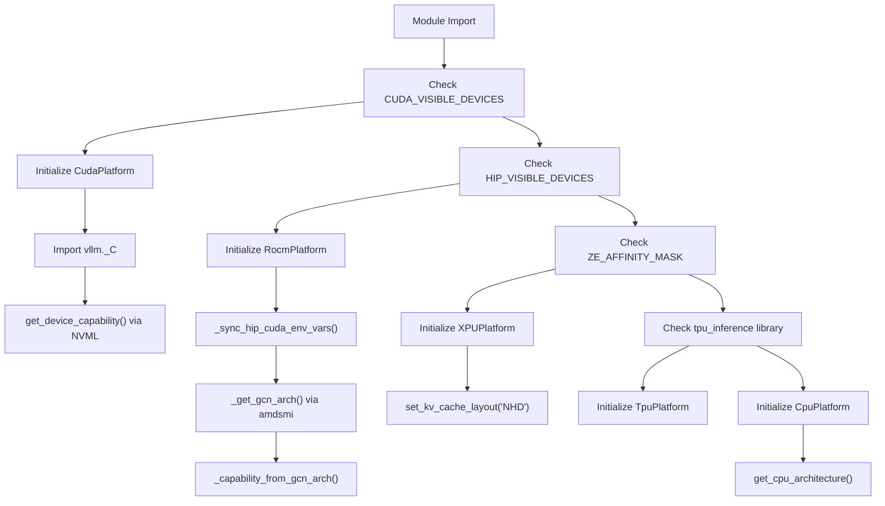
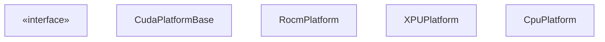
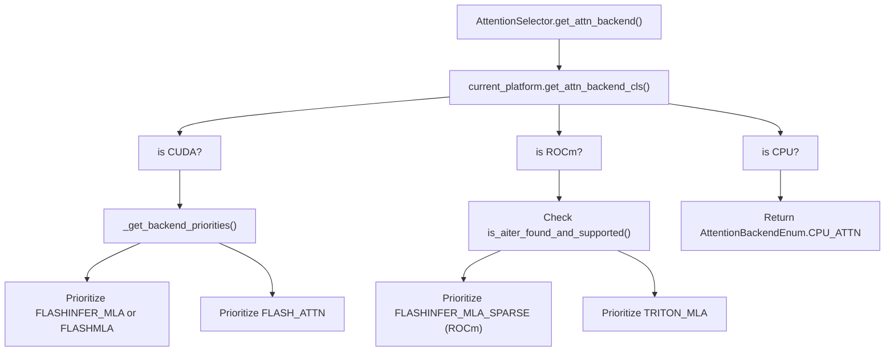

# Platform Support

Relevant source files

-   [vllm/\_aiter\_ops.py](https://github.com/vllm-project/vllm/blob/7cc302dd/vllm/_aiter_ops.py)
-   [vllm/model\_executor/layers/quantization/quark/schemes/quark\_ocp\_mx.py](https://github.com/vllm-project/vllm/blob/7cc302dd/vllm/model_executor/layers/quantization/quark/schemes/quark_ocp_mx.py)
-   [vllm/platforms/cpu.py](https://github.com/vllm-project/vllm/blob/7cc302dd/vllm/platforms/cpu.py)
-   [vllm/platforms/cuda.py](https://github.com/vllm-project/vllm/blob/7cc302dd/vllm/platforms/cuda.py)
-   [vllm/platforms/interface.py](https://github.com/vllm-project/vllm/blob/7cc302dd/vllm/platforms/interface.py)
-   [vllm/platforms/rocm.py](https://github.com/vllm-project/vllm/blob/7cc302dd/vllm/platforms/rocm.py)
-   [vllm/platforms/tpu.py](https://github.com/vllm-project/vllm/blob/7cc302dd/vllm/platforms/tpu.py)
-   [vllm/platforms/xpu.py](https://github.com/vllm-project/vllm/blob/7cc302dd/vllm/platforms/xpu.py)

## Purpose and Scope

This document describes vLLM's platform abstraction layer, which enables cross-platform execution on NVIDIA GPUs (CUDA), AMD GPUs (ROCm), Intel GPUs (XPU), CPUs, and TPUs. The platform layer provides a unified interface for hardware detection, device capability queries, attention backend selection, and platform-specific configuration adjustments.

For attention backend implementations, see [Attention Backends](/vllm-project/vllm/8-attention-backends). For distributed execution and communication backends, see [Distributed Execution](/vllm-project/vllm/9-distributed-execution).

---

## Platform Abstraction Architecture

### Platform Detection and Initialization

vLLM detects the hardware platform at module load time by examining environment variables and library availability. The detection follows a priority order and initializes the corresponding platform singleton.

**Sources:** [vllm/platforms/interface.py36-46](https://github.com/vllm-project/vllm/blob/7cc302dd/vllm/platforms/interface.py#L36-L46) [vllm/platforms/rocm.py70-91](https://github.com/vllm-project/vllm/blob/7cc302dd/vllm/platforms/rocm.py#L70-L91) [vllm/platforms/rocm.py125-146](https://github.com/vllm-project/vllm/blob/7cc302dd/vllm/platforms/rocm.py#L125-L146) [vllm/platforms/xpu.py31-40](https://github.com/vllm-project/vllm/blob/7cc302dd/vllm/platforms/xpu.py#L31-L40) [vllm/platforms/xpu.py55-61](https://github.com/vllm-project/vllm/blob/7cc302dd/vllm/platforms/xpu.py#L55-L61) [vllm/platforms/cpu.py72-79](https://github.com/vllm-project/vllm/blob/7cc302dd/vllm/platforms/cpu.py#L72-L79) [vllm/platforms/tpu.py9-21](https://github.com/vllm-project/vllm/blob/7cc302dd/vllm/platforms/tpu.py#L9-L21)

---

### Platform Interface

The `Platform` base class defines the interface that all platform implementations must provide. Key responsibilities include device management, configuration validation, and backend selection.

**Sources:** [vllm/platforms/interface.py100-210](https://github.com/vllm-project/vllm/blob/7cc302dd/vllm/platforms/interface.py#L100-L210) [vllm/platforms/cuda.py128-140](https://github.com/vllm-project/vllm/blob/7cc302dd/vllm/platforms/cuda.py#L128-L140) [vllm/platforms/rocm.py355-385](https://github.com/vllm-project/vllm/blob/7cc302dd/vllm/platforms/rocm.py#L355-L385) [vllm/platforms/xpu.py31-40](https://github.com/vllm-project/vllm/blob/7cc302dd/vllm/platforms/xpu.py#L31-L40) [vllm/platforms/cpu.py72-79](https://github.com/vllm-project/vllm/blob/7cc302dd/vllm/platforms/cpu.py#L72-L79)

---

### Device Capability Detection

Each platform provides methods to query hardware capabilities, which inform backend selection and configuration validation. Capabilities are often represented as a `DeviceCapability` named tuple containing `major` and `minor` versions.

| Platform | Capability Representation | Detection Method | Key Attributes |
| --- | --- | --- | --- |
| **CUDA** | `DeviceCapability(major, minor)` | NVML API: `nvmlDeviceGetCudaComputeCapability()` | SM version (e.g., 8.0, 9.0, 10.0) |
| **ROCm** | `DeviceCapability(major, minor)` | GCN arch string parsing: `gfx942` → `(9, 4)` | GCN family (gfx942, gfx11, etc.) |
| **XPU** | `None` | Not applicable | Device name queries via `torch.xpu` |
| **CPU** | `None` | Not applicable | `CpuArchEnum` (x86, ARM, POWERPC, etc.) |
| **TPU** | Not defined | External package | TPU version from `tpu_inference` |

**Sources:** [vllm/platforms/interface.py58-98](https://github.com/vllm-project/vllm/blob/7cc302dd/vllm/platforms/interface.py#L58-L98) [vllm/platforms/cuda.py164-165](https://github.com/vllm-project/vllm/blob/7cc302dd/vllm/platforms/cuda.py#L164-L165) [vllm/platforms/rocm.py155-204](https://github.com/vllm-project/vllm/blob/7cc302dd/vllm/platforms/rocm.py#L155-L204) [vllm/platforms/xpu.py128-134](https://github.com/vllm-project/vllm/blob/7cc302dd/vllm/platforms/xpu.py#L128-L134) [vllm/platforms/cpu.py81-98](https://github.com/vllm-project/vllm/blob/7cc302dd/vllm/platforms/cpu.py#L81-L98)

---

## Platform-Specific Implementations

### CUDA Platform

For details, see [CUDA Platform](/vllm-project/vllm/10.2-cuda-platform).

The CUDA platform supports NVIDIA GPUs. It utilizes `pynvml` for hardware discovery without initializing the CUDA context prematurely. It handles backend priorities for attention, favoring `FLASHINFER` or `FLASHMLA` on Blackwell (SM 10.0) and `FLASH_ATTN` on older architectures.

**Sources:** [vllm/platforms/cuda.py43-113](https://github.com/vllm-project/vllm/blob/7cc302dd/vllm/platforms/cuda.py#L43-L113) [vllm/platforms/cuda.py128-183](https://github.com/vllm-project/vllm/blob/7cc302dd/vllm/platforms/cuda.py#L128-L183)

### ROCm Platform

For details, see [ROCm Platform](/vllm-project/vllm/10.3-rocm-platform).

The ROCm platform supports AMD GPUs. It parses GCN architecture strings (e.g., `gfx942` for MI300X) using `amdsmi` to determine capabilities. It supports specialized `AITER` operations for MoE and MLA and handles environment variable synchronization between `HIP_VISIBLE_DEVICES` and `CUDA_VISIBLE_DEVICES`.

**Sources:** [vllm/platforms/rocm.py70-152](https://github.com/vllm-project/vllm/blob/7cc302dd/vllm/platforms/rocm.py#L70-L152) [vllm/platforms/rocm.py355-385](https://github.com/vllm-project/vllm/blob/7cc302dd/vllm/platforms/rocm.py#L355-L385) [vllm/\_aiter\_ops.py36-56](https://github.com/vllm-project/vllm/blob/7cc302dd/vllm/_aiter_ops.py#L36-L56)

### XPU, CPU, and TPU Platforms

For details, see [XPU, CPU, and TPU Platforms](/vllm-project/vllm/10.4-xpu-cpu-and-tpu-platforms).

-   **XPU**: Supports Intel GPUs. It forces the `NHD` KV cache layout and manages `XPU Graph` capture limitations.
-   **CPU**: Supports multiple architectures (x86, ARM, PowerPC). It implements NUMA-aware memory allocation and utilizes the `Gloo` distributed backend.
-   **TPU**: Integrates with the `tpu_inference` library for execution on Google TPUs.

**Sources:** [vllm/platforms/xpu.py31-61](https://github.com/vllm-project/vllm/blob/7cc302dd/vllm/platforms/xpu.py#L31-L61) [vllm/platforms/cpu.py72-98](https://github.com/vllm-project/vllm/blob/7cc302dd/vllm/platforms/cpu.py#L72-L98) [vllm/platforms/tpu.py9-21](https://github.com/vllm-project/vllm/blob/7cc302dd/vllm/platforms/tpu.py#L9-L21)

---

## Attention Backend Selection

The platform layer is central to selecting the optimal attention backend. Each platform implementation provides `get_attn_backend_cls` or defines priorities in `_get_backend_priorities`.

**Sources:** [vllm/platforms/cuda.py51-113](https://github.com/vllm-project/vllm/blob/7cc302dd/vllm/platforms/cuda.py#L51-L113) [vllm/platforms/rocm.py309-353](https://github.com/vllm-project/vllm/blob/7cc302dd/vllm/platforms/rocm.py#L309-L353) [vllm/platforms/cpu.py105-117](https://github.com/vllm-project/vllm/blob/7cc302dd/vllm/platforms/cpu.py#L105-L117) [vllm/\_aiter\_ops.py36-56](https://github.com/vllm-project/vllm/blob/7cc302dd/vllm/_aiter_ops.py#L36-L56)

---

## Configuration Lifecycle

Platforms participate in configuration assembly by validating and updating the `VllmConfig` object.

| Method | Role |
| --- | --- |
| `apply_config_platform_defaults` | Sets platform-specific defaults like `custom_ops` and quantization support. |
| `check_and_update_config` | Adjusts `block_size`, `worker_cls`, and disables incompatible features (e.g., chunked prefill on certain hardware). |
| `update_block_size_for_backend` | Finalizes block size based on the selected attention backend's requirements. |

**Sources:** [vllm/platforms/interface.py397-472](https://github.com/vllm-project/vllm/blob/7cc302dd/vllm/platforms/interface.py#L397-L472) [vllm/platforms/cuda.py184-205](https://github.com/vllm-project/vllm/blob/7cc302dd/vllm/platforms/cuda.py#L184-L205) [vllm/platforms/cpu.py157-210](https://github.com/vllm-project/vllm/blob/7cc302dd/vllm/platforms/cpu.py#L157-L210) [vllm/platforms/xpu.py162-229](https://github.com/vllm-project/vllm/blob/7cc302dd/vllm/platforms/xpu.py#L162-L229)

---

## Testing Platform Support

vLLM uses specialized tests to ensure the platform abstraction correctly selects backends and handles device-specific constraints.

-   `test_backend_selection`: Validates the mapping between hardware capabilities and attention backends.
-   `test_rocm_attention_selector`: Specifically tests ROCm-specific logic like AITER activation.

**Sources:** [vllm/platforms/rocm.py148-152](https://github.com/vllm-project/vllm/blob/7cc302dd/vllm/platforms/rocm.py#L148-L152) [vllm/\_aiter\_ops.py36-56](https://github.com/vllm-project/vllm/blob/7cc302dd/vllm/_aiter_ops.py#L36-L56)
