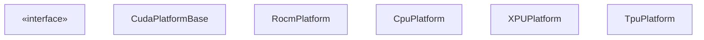
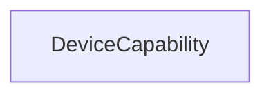
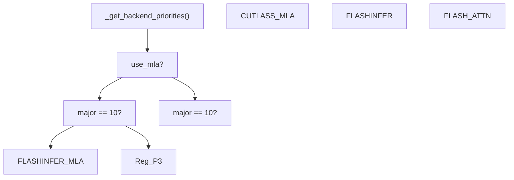
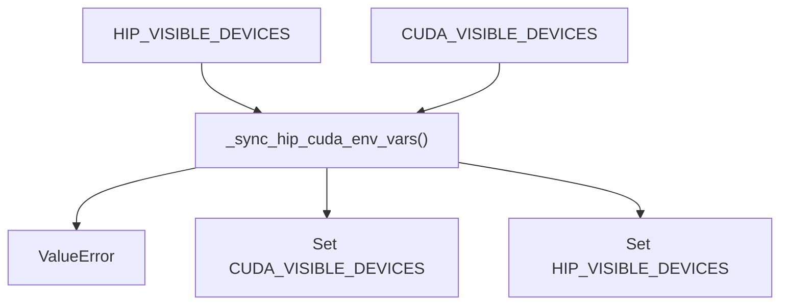

# Platform Abstraction Layer

Relevant source files

-   [vllm/\_aiter\_ops.py](https://github.com/vllm-project/vllm/blob/7cc302dd/vllm/_aiter_ops.py)
-   [vllm/model\_executor/layers/quantization/quark/schemes/quark\_ocp\_mx.py](https://github.com/vllm-project/vllm/blob/7cc302dd/vllm/model_executor/layers/quantization/quark/schemes/quark_ocp_mx.py)
-   [vllm/platforms/cpu.py](https://github.com/vllm-project/vllm/blob/7cc302dd/vllm/platforms/cpu.py)
-   [vllm/platforms/cuda.py](https://github.com/vllm-project/vllm/blob/7cc302dd/vllm/platforms/cuda.py)
-   [vllm/platforms/interface.py](https://github.com/vllm-project/vllm/blob/7cc302dd/vllm/platforms/interface.py)
-   [vllm/platforms/rocm.py](https://github.com/vllm-project/vllm/blob/7cc302dd/vllm/platforms/rocm.py)
-   [vllm/platforms/tpu.py](https://github.com/vllm-project/vllm/blob/7cc302dd/vllm/platforms/tpu.py)
-   [vllm/platforms/xpu.py](https://github.com/vllm-project/vllm/blob/7cc302dd/vllm/platforms/xpu.py)

The Platform Abstraction Layer provides a unified interface for vLLM to operate across different hardware accelerators (NVIDIA CUDA, AMD ROCm, Intel XPU, Google TPU, and CPU). This layer encapsulates platform-specific device capabilities, kernel operations, backend selection logic, and configuration requirements, allowing the rest of vLLM's codebase to remain hardware-agnostic where possible.

For information about distributed communication backends, see [Communication Infrastructure](/vllm-project/vllm/9.2-communication-infrastructure). For attention backend implementation details, see [Attention Backend Selection](/vllm-project/vllm/8.1-attention-backend-selection).

---

## Architecture Overview

The platform abstraction layer consists of a base `Platform` class that defines the common interface, and platform-specific implementations that override methods to provide hardware-specific behavior. Each platform implementation handles device detection, capability queries, kernel imports, attention backend selection, and configuration validation.

### Platform Class Hierarchy

The hierarchy follows a strategy pattern where `current_platform` is a singleton instance of a `Platform` subclass determined at runtime.

Title: Platform Class Hierarchy

**Sources:** [vllm/platforms/interface.py100-205](https://github.com/vllm-project/vllm/blob/7cc302dd/vllm/platforms/interface.py#L100-L205) [vllm/platforms/cuda.py128-181](https://github.com/vllm-project/vllm/blob/7cc302dd/vllm/platforms/cuda.py#L128-L181) [vllm/platforms/rocm.py258-285](https://github.com/vllm-project/vllm/blob/7cc302dd/vllm/platforms/rocm.py#L258-L285) [vllm/platforms/cpu.py72-98](https://github.com/vllm-project/vllm/blob/7cc302dd/vllm/platforms/cpu.py#L72-L98) [vllm/platforms/xpu.py31-41](https://github.com/vllm-project/vllm/blob/7cc302dd/vllm/platforms/xpu.py#L31-L41) [vllm/platforms/tpu.py9-21](https://github.com/vllm-project/vllm/blob/7cc302dd/vllm/platforms/tpu.py#L9-L21)

---

## Platform Enumeration and Detection

### PlatformEnum

The `PlatformEnum` defines the supported hardware platforms used throughout the codebase for conditional logic.

| Enum Value | Description |
| --- | --- |
| `CUDA` | NVIDIA GPUs with CUDA support |
| `ROCM` | AMD GPUs with ROCm support |
| `TPU` | Google Cloud TPUs |
| `XPU` | Intel GPUs (Data Center GPU Max, Arc) |
| `CPU` | x86, ARM, PowerPC, RISC-V CPUs |
| `OOT` | Out-of-tree custom platforms |
| `UNSPECIFIED` | Platform not yet determined |

**Sources:** [vllm/platforms/interface.py36-46](https://github.com/vllm-project/vllm/blob/7cc302dd/vllm/platforms/interface.py#L36-L46)

---

## Device Capability System

The `DeviceCapability` class represents compute capability for devices, primarily used for CUDA/ROCm GPUs to determine feature support (e.g., FP8 or specific attention kernels).

### DeviceCapability Class

Title: Device Capability Data Structure

**DeviceCapability Methods:**

| Method | Description | Example |
| --- | --- | --- |
| `as_version_str()` | Returns "major.minor" string | "8.0", "9.4" |
| `to_int()` | Returns `major*10 + minor` | 80, 94 |
| Comparison operators | Compare capabilities | `DeviceCapability(8,0) < DeviceCapability(9,0)` |

**Sources:** [vllm/platforms/interface.py58-98](https://github.com/vllm-project/vllm/blob/7cc302dd/vllm/platforms/interface.py#L58-L98)

---

## Platform Base Class

The `Platform` base class defines the interface that all platform implementations must follow. It includes PyTorch dispatch keys and Ray-specific resource keys.

### Core Platform Attributes

| Attribute | Purpose | Example (CUDA) |
| --- | --- | --- |
| `device_name` | String identifier for the device | "cuda" |
| `dispatch_key` | PyTorch internal dispatch key | "CUDA" |
| `ray_device_key` | Resource key for Ray actor placement | "GPU" |
| `dist_backend` | Default `torch.distributed` backend | "nccl" |
| `device_control_env_var` | Variable to mask devices | "CUDA\_VISIBLE\_DEVICES" |

**Sources:** [vllm/platforms/interface.py100-141](https://github.com/vllm-project/vllm/blob/7cc302dd/vllm/platforms/interface.py#L100-L141) [vllm/platforms/cuda.py128-139](https://github.com/vllm-project/vllm/blob/7cc302dd/vllm/platforms/cuda.py#L128-L139)

---

## CUDA Platform

The CUDA platform supports NVIDIA GPUs. It utilizes NVML (via `pynvml`) to query device information without initializing the CUDA context, which is critical for multi-process coordination.

### CUDA Attention Backend Selection

CUDA uses `_get_backend_priorities` to rank attention kernels based on the device's compute capability (major version 10 for Blackwell) and whether Multi-Latent Attention (MLA) is requested.

Title: CUDA Attention Backend Priority Logic

**Sources:** [vllm/platforms/cuda.py50-113](https://github.com/vllm-project/vllm/blob/7cc302dd/vllm/platforms/cuda.py#L50-L113)

### CUDA Configuration Updates

In `check_and_update_config()`, the CUDA platform:

1.  Sets the default worker to `vllm.v1.worker.gpu_worker.Worker` [vllm/platforms/cuda.py188-189](https://github.com/vllm-project/vllm/blob/7cc302dd/vllm/platforms/cuda.py#L188-L189)
2.  Disables chunked multimodal input for specific model types [vllm/platforms/cuda.py193-203](https://github.com/vllm-project/vllm/blob/7cc302dd/vllm/platforms/cuda.py#L193-L203)

---

## ROCm Platform

The ROCm platform supports AMD GPUs. It performs extensive environment synchronization to ensure `HIP_VISIBLE_DEVICES` and `CUDA_VISIBLE_DEVICES` are consistent.

### ROCm Architecture Detection

ROCm detects architectures using `amdsmi` to avoid premature HIP initialization. This allows Ray workers to set visibility after the module is imported.

| GCN Architecture | Detection Flag | Example Hardware |
| --- | --- | --- |
| `gfx942`, `gfx950` | `_ON_MI3XX` | MI300X, MI325X |
| `gfx90a`, `gfx942` | `_ON_GFX9` | MI200, MI300 |
| `gfx11`, `gfx12` | `_ON_GFX1X` | Radeon RX 7900 |

**Sources:** [vllm/platforms/rocm.py146-152](https://github.com/vllm-project/vllm/blob/7cc302dd/vllm/platforms/rocm.py#L146-L152) [vllm/platforms/rocm.py111-123](https://github.com/vllm-project/vllm/blob/7cc302dd/vllm/platforms/rocm.py#L111-L123)

### ROCm AITER Integration

ROCm integrates with the `aiter` library for optimized kernels (MoE, Attention). The `is_aiter_found_and_supported()` check ensures the platform is ROCm and the hardware is MI3xx.

**Sources:** [vllm/\_aiter\_ops.py36-56](https://github.com/vllm-project/vllm/blob/7cc302dd/vllm/_aiter_ops.py#L36-L56) [vllm/model\_executor/layers/quantization/quark/schemes/quark\_ocp\_mx.py49-60](https://github.com/vllm-project/vllm/blob/7cc302dd/vllm/model_executor/layers/quantization/quark/schemes/quark_ocp_mx.py#L49-L60)

---

## CPU Platform

The CPU platform supports multiple architectures (x86, ARM, PowerPC, RISC-V) and is NUMA-aware.

### CPU Architecture and Memory

The CPU platform calculates `kv_cache_space` by checking `VLLM_CPU_KVCACHE_SPACE`. If unset, it defaults to 50% of the total system memory divided by the number of NUMA nodes to prevent OOM in multi-node setups.

**Sources:** [vllm/platforms/cpu.py120-143](https://github.com/vllm-project/vllm/blob/7cc302dd/vllm/platforms/cpu.py#L120-L143)

### CPU Configuration Constraints

1.  **Block Size**: Prefers multiples of 32 for performance [vllm/platforms/cpu.py168-173](https://github.com/vllm-project/vllm/blob/7cc302dd/vllm/platforms/cpu.py#L168-L173)
2.  **Scheduling**: Disables `async_scheduling` as it is not required for CPU [vllm/platforms/cpu.py176](https://github.com/vllm-project/vllm/blob/7cc302dd/vllm/platforms/cpu.py#L176-L176)
3.  **Quantization**: Does not support KV cache quantization; falls back to "auto" [vllm/platforms/cpu.py186-190](https://github.com/vllm-project/vllm/blob/7cc302dd/vllm/platforms/cpu.py#L186-L190)

---

## XPU Platform

The XPU platform supports Intel GPUs and uses the `xccl` distributed backend.

### XPU-Specific Logic

1.  **KV Cache Layout**: Forces `VLLM_KV_CACHE_LAYOUT` to `NHD` as it is the only layout supported by XPU kernels [vllm/platforms/xpu.py57-61](https://github.com/vllm-project/vllm/blob/7cc302dd/vllm/platforms/xpu.py#L57-L61)
2.  **Graph Support**: Disables `cudagraph_mode` if XPU graphs are not supported by the PyTorch version or disabled via `VLLM_XPU_ENABLE_XPU_GRAPH` [vllm/platforms/xpu.py179-190](https://github.com/vllm-project/vllm/blob/7cc302dd/vllm/platforms/xpu.py#L179-L190)

**Sources:** [vllm/platforms/xpu.py54-90](https://github.com/vllm-project/vllm/blob/7cc302dd/vllm/platforms/xpu.py#L54-L90) [vllm/platforms/xpu.py162-192](https://github.com/vllm-project/vllm/blob/7cc302dd/vllm/platforms/xpu.py#L162-L192)

---

## Platform-Agnostic Environment Synchronization

ROCm requires strict synchronization between HIP and CUDA environment variables to prevent library conflicts.

Title: ROCm Environment Sync Logic

**Sources:** [vllm/platforms/rocm.py70-88](https://github.com/vllm-project/vllm/blob/7cc302dd/vllm/platforms/rocm.py#L70-L88)
