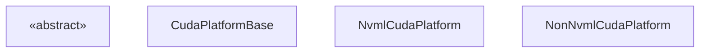
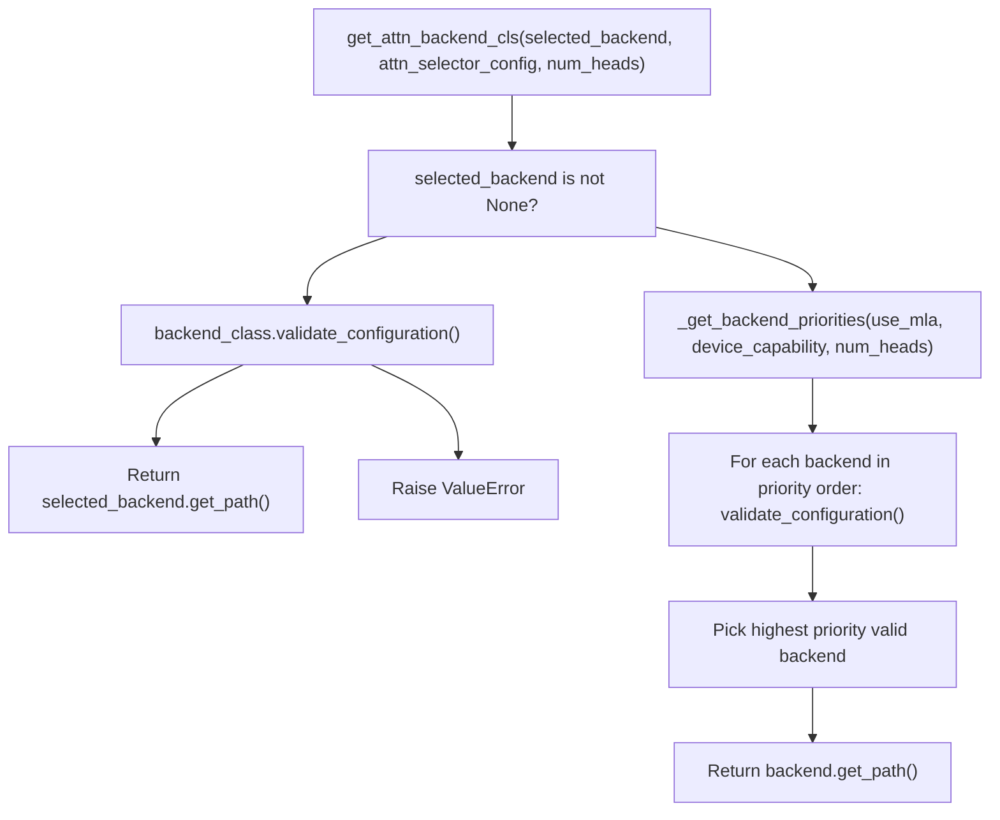
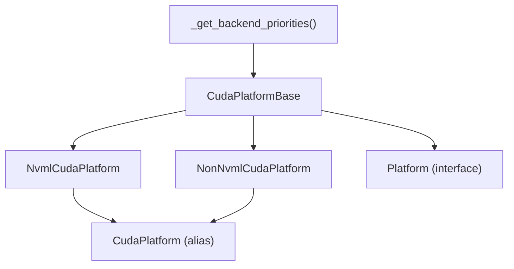

# CUDA Platform

Relevant source files

-   [CMakeLists.txt](https://github.com/vllm-project/vllm/blob/7cc302dd/CMakeLists.txt)
-   [benchmarks/kernels/bench\_cp\_gather\_fp8.py](https://github.com/vllm-project/vllm/blob/7cc302dd/benchmarks/kernels/bench_cp_gather_fp8.py)
-   [cmake/utils.cmake](https://github.com/vllm-project/vllm/blob/7cc302dd/cmake/utils.cmake)
-   [csrc/cache.h](https://github.com/vllm-project/vllm/blob/7cc302dd/csrc/cache.h)
-   [csrc/cache\_kernels.cu](https://github.com/vllm-project/vllm/blob/7cc302dd/csrc/cache_kernels.cu)
-   [csrc/ops.h](https://github.com/vllm-project/vllm/blob/7cc302dd/csrc/ops.h)
-   [csrc/sampler.cu](https://github.com/vllm-project/vllm/blob/7cc302dd/csrc/sampler.cu)
-   [csrc/topk.cu](https://github.com/vllm-project/vllm/blob/7cc302dd/csrc/topk.cu)
-   [csrc/torch\_bindings.cpp](https://github.com/vllm-project/vllm/blob/7cc302dd/csrc/torch_bindings.cpp)
-   [tests/kernels/attention/test\_cache.py](https://github.com/vllm-project/vllm/blob/7cc302dd/tests/kernels/attention/test_cache.py)
-   [tests/kernels/attention/test\_deepgemm\_attention.py](https://github.com/vllm-project/vllm/blob/7cc302dd/tests/kernels/attention/test_deepgemm_attention.py)
-   [tests/kernels/test\_apply\_repetition\_penalties.py](https://github.com/vllm-project/vllm/blob/7cc302dd/tests/kernels/test_apply_repetition_penalties.py)
-   [tests/kernels/test\_cp\_gather\_fp8.py](https://github.com/vllm-project/vllm/blob/7cc302dd/tests/kernels/test_cp_gather_fp8.py)
-   [tests/kernels/test\_top\_k\_per\_row.py](https://github.com/vllm-project/vllm/blob/7cc302dd/tests/kernels/test_top_k_per_row.py)
-   [vllm/\_aiter\_ops.py](https://github.com/vllm-project/vllm/blob/7cc302dd/vllm/_aiter_ops.py)
-   [vllm/\_custom\_ops.py](https://github.com/vllm-project/vllm/blob/7cc302dd/vllm/_custom_ops.py)
-   [vllm/model\_executor/layers/quantization/quark/schemes/quark\_ocp\_mx.py](https://github.com/vllm-project/vllm/blob/7cc302dd/vllm/model_executor/layers/quantization/quark/schemes/quark_ocp_mx.py)
-   [vllm/model\_executor/layers/sparse\_attn\_indexer.py](https://github.com/vllm-project/vllm/blob/7cc302dd/vllm/model_executor/layers/sparse_attn_indexer.py)
-   [vllm/platforms/cpu.py](https://github.com/vllm-project/vllm/blob/7cc302dd/vllm/platforms/cpu.py)
-   [vllm/platforms/cuda.py](https://github.com/vllm-project/vllm/blob/7cc302dd/vllm/platforms/cuda.py)
-   [vllm/platforms/interface.py](https://github.com/vllm-project/vllm/blob/7cc302dd/vllm/platforms/interface.py)
-   [vllm/platforms/rocm.py](https://github.com/vllm-project/vllm/blob/7cc302dd/vllm/platforms/rocm.py)
-   [vllm/platforms/tpu.py](https://github.com/vllm-project/vllm/blob/7cc302dd/vllm/platforms/tpu.py)
-   [vllm/platforms/xpu.py](https://github.com/vllm-project/vllm/blob/7cc302dd/vllm/platforms/xpu.py)
-   [vllm/v1/attention/backends/mla/indexer.py](https://github.com/vllm-project/vllm/blob/7cc302dd/vllm/v1/attention/backends/mla/indexer.py)

This page documents the CUDA platform implementation in vLLM: the class hierarchy, device capability detection, attention backend selection logic, memory management, and configuration validation specific to NVIDIA GPUs.

For background on the abstract `Platform` interface that `CudaPlatform` implements, see [Platform Abstraction Layer](/vllm-project/vllm/10.1-platform-abstraction-layer). For the ROCm implementation that follows a similar but distinct pattern, see [ROCm Platform](/vllm-project/vllm/10.3-rocm-platform).

---

## Class Hierarchy

The CUDA platform is implemented across three concrete classes and one module-level alias. At import time, vLLM automatically selects between two implementations based on whether NVML (NVIDIA Management Library) is available.

**Class hierarchy diagram**


The module-level alias `CudaPlatform` is assigned at the bottom of `vllm/platforms/cuda.py` based on `nvml_available`.

Sources: [vllm/platforms/cuda.py128-735](https://github.com/vllm-project/vllm/blob/7cc302dd/vllm/platforms/cuda.py#L128-L735) [vllm/platforms/interface.py100-204](https://github.com/vllm-project/vllm/blob/7cc302dd/vllm/platforms/interface.py#L100-L204)

---

## NVML vs. Non-NVML Selection

On import, `vllm/platforms/cuda.py` attempts to import `pynvml` via `import_pynvml()`. If successful, it uses `NvmlCudaPlatform`. Otherwise, it falls back to `NonNvmlCudaPlatform`, which uses `torch.cuda` calls directly.

| Feature | `NvmlCudaPlatform` | `NonNvmlCudaPlatform` |
| --- | --- | --- |
| Compute capability | Via `pynvml.nvmlDeviceGetCudaComputeCapability` | Via `torch.cuda.get_device_capability` |
| Device name | Via `pynvml.nvmlDeviceGetName` | Via `torch.cuda.get_device_name` |
| Total memory | Via `pynvml.nvmlDeviceGetMemoryInfo` | Via `torch.cuda.get_device_properties().total_memory` |
| NVLink check | Via `pynvml.nvmlDeviceGetP2PStatus` | Returns `False`, logs a warning |
| Device UUID | Via `pynvml.nvmlDeviceGetUUID` | Not implemented |
| CUDA context init | Avoids it (NVML is independent) | Initializes CUDA context on first call |

The key advantage of NVML is that it queries device properties **without initializing the CUDA context**, which matters for Ray-based deployments where workers set `CUDA_VISIBLE_DEVICES` after the module is imported.

Sources: [vllm/platforms/cuda.py43](https://github.com/vllm-project/vllm/blob/7cc302dd/vllm/platforms/cuda.py#L43-L43) [vllm/platforms/cuda.py598-735](https://github.com/vllm-project/vllm/blob/7cc302dd/vllm/platforms/cuda.py#L598-L735)

---

## Device Capability Detection

`DeviceCapability` is a `NamedTuple` with `major` and `minor` fields, defined in `vllm/platforms/interface.py`. Comparison operators are implemented so that capability checks like `has_device_capability(80)` work cleanly.

`NvmlCudaPlatform.get_device_capability` uses the `with_nvml_context` decorator to wrap `pynvml` init/shutdown around the call:

```
@cache@with_nvml_contextdef get_device_capability(cls, device_id: int = 0) -> DeviceCapability | None:    physical_device_id = cls.device_id_to_physical_device_id(device_id)    handle = pynvml.nvmlDeviceGetHandleByIndex(physical_device_id)    major, minor = pynvml.nvmlDeviceGetCudaComputeCapability(handle)    return DeviceCapability(major=major, minor=minor)
```
The `device_id_to_physical_device_id` method (inherited from `Platform`) reads `CUDA_VISIBLE_DEVICES` to map logical to physical device IDs.

Sources: [vllm/platforms/cuda.py116-125](https://github.com/vllm-project/vllm/blob/7cc302dd/vllm/platforms/cuda.py#L116-L125) [vllm/platforms/cuda.py602-613](https://github.com/vllm-project/vllm/blob/7cc302dd/vllm/platforms/cuda.py#L602-L613) [vllm/platforms/interface.py58-98](https://github.com/vllm-project/vllm/blob/7cc302dd/vllm/platforms/interface.py#L58-L98) [vllm/platforms/interface.py209-222](https://github.com/vllm-project/vllm/blob/7cc302dd/vllm/platforms/interface.py#L209-L222)

### Capability Thresholds Used in vLLM

| Minimum Capability | Integer | GPU Families | Feature Unlocked |
| --- | --- | --- | --- |
| 6.0 | 60 | Pascal, Volta, Turing | FP16 support |
| 8.0 | 80 | Ampere, Hopper | BF16 support |
| 8.9 | 89 | Ada Lovelace, H100 | FP8 support |
| 10.x | 100 | Blackwell | FlashInfer MLA / CUTLASS MLA preferred |

Sources: [vllm/platforms/cuda.py142-150](https://github.com/vllm-project/vllm/blob/7cc302dd/vllm/platforms/cuda.py#L142-L150) [vllm/platforms/cuda.py488-491](https://github.com/vllm-project/vllm/blob/7cc302dd/vllm/platforms/cuda.py#L488-L491)

---

## Attention Backend Selection

`CudaPlatformBase.get_attn_backend_cls` implements a selection process that builds a prioritized list of candidates via `_get_backend_priorities`.

**Backend priority selection flow**


Sources: [vllm/platforms/cuda.py359-429](https://github.com/vllm-project/vllm/blob/7cc302dd/vllm/platforms/cuda.py#L359-L429)

### Backend Priority Tables

`_get_backend_priorities` (cached) returns different orderings based on `use_mla` and `device_capability.major`.

**Non-MLA backends**

| Priority | Blackwell (CC 10.x) | Other NVIDIA GPUs |
| --- | --- | --- |
| 1 | `FLASHINFER` | `FLASH_ATTN` |
| 2 | `FLASH_ATTN` | `FLASHINFER` |
| 3 | `TRITON_ATTN` | `TRITON_ATTN` |
| 4 | `FLEX_ATTENTION` | `FLEX_ATTENTION` |

**MLA backends**

| Priority | Blackwell (CC 10.x) | Other NVIDIA GPUs |
| --- | --- | --- |
| 1 | `FLASHINFER_MLA` | `FLASH_ATTN_MLA` |
| 2 | `CUTLASS_MLA` | `FLASHMLA` |
| 3 | `FLASH_ATTN_MLA` | `FLASHINFER_MLA` |
| 4 | `FLASHMLA` | `TRITON_MLA` |
| 5 | `TRITON_MLA` | `FLASHMLA_SPARSE` |

On Blackwell with MLA, if `kv_cache_dtype` is `fp8`, `FLASHINFER_MLA_SPARSE` is preferred over `FLASHMLA_SPARSE`.

Sources: [vllm/platforms/cuda.py51-113](https://github.com/vllm-project/vllm/blob/7cc302dd/vllm/platforms/cuda.py#L51-L113)

---

## Configuration Validation: `check_and_update_config`

`CudaPlatformBase.check_and_update_config` is called during engine initialization to enforce CUDA-specific constraints on `VllmConfig`.

**Responsibilities:**

1.  **Worker class**: If `parallel_config.worker_cls == "auto"`, sets it to `"vllm.v1.worker.gpu_worker.Worker"`.
2.  **KV cache block size**: Sets `cache_config.block_size = 16` if not already set.
3.  **MLA block size enforcement**:
    -   `FLASHMLA`: 64
    -   `CUTLASS_MLA`: 128
    -   `FLASHINFER_MLA`: 32 or 64
4.  **Multimodal chunking**: If the model uses `is_mm_prefix_lm`, forces `scheduler_config.disable_chunked_mm_input = True`.

Sources: [vllm/platforms/cuda.py184-314](https://github.com/vllm-project/vllm/blob/7cc302dd/vllm/platforms/cuda.py#L184-L314)

---

## Memory Management

`CudaPlatformBase` provides implementations for GPU memory operations:

### Current Memory Usage

```
@classmethoddef get_current_memory_usage(cls, device=None) -> float:    torch.cuda.empty_cache()    torch.cuda.reset_peak_memory_stats(device)    return torch.cuda.max_memory_allocated(device)
```
Sources: [vllm/platforms/cuda.py316-323](https://github.com/vllm-project/vllm/blob/7cc302dd/vllm/platforms/cuda.py#L316-L323)

### Block Transfer Utilities

| Method | Operation |
| --- | --- |
| `insert_blocks_to_device` | GPU → GPU: Copies blocks between cache tensors. |
| `swap_out_blocks_to_host` | GPU → CPU: Copies blocks to host memory. |

Sources: [vllm/platforms/cuda.py561-584](https://github.com/vllm-project/vllm/blob/7cc302dd/vllm/platforms/cuda.py#L561-L584)

---

## NVLink Connectivity Check

`NvmlCudaPlatform.is_fully_connected` queries `pynvml.nvmlDeviceGetP2PStatus` for every pair of physical device IDs. It checks the `NVML_P2P_CAPS_INDEX_NVLINK` capability to ensure all devices in the group can communicate via NVLink.

Sources: [vllm/platforms/cuda.py647-671](https://github.com/vllm-project/vllm/blob/7cc302dd/vllm/platforms/cuda.py#L647-L671)

---

## Dtype and FP8 Support

`CudaPlatformBase.supported_dtypes` returns a capability-gated list:

-   CC >= 8.0: `[bfloat16, float16, float32]`
-   CC >= 6.0: `[float16, float32]`
-   Otherwise: `[float32]`

`supports_fp8()` returns `True` when `has_device_capability(89)`.

Sources: [vllm/platforms/cuda.py141-150](https://github.com/vllm-project/vllm/blob/7cc302dd/vllm/platforms/cuda.py#L141-L150) [vllm/platforms/cuda.py488-491](https://github.com/vllm-project/vllm/blob/7cc302dd/vllm/platforms/cuda.py#L488-L491)

---

## Custom Ops and Kernels

The CUDA platform integrates several custom C++ and CUDA kernels for performance-critical operations. These are registered via `TORCH_LIBRARY_EXPAND` in `csrc/torch_bindings.cpp`.

| Op Category | Code Entities |
| --- | --- |
| Attention | `paged_attention_v1`, `paged_attention_v2`, `merge_attn_states` |
| Normalization | `rms_norm`, `fused_add_rms_norm`, `fused_qk_norm_rope` |
| Activation | `silu_and_mul`, `gelu_and_mul`, `fatrelu_and_mul` |
| MoE | `topk_softmax`, `moe_align_block_size`, `moe_sum` |

Sources: [csrc/torch\_bindings.cpp19-172](https://github.com/vllm-project/vllm/blob/7cc302dd/csrc/torch_bindings.cpp#L19-L172) [vllm/\_custom\_ops.py108-200](https://github.com/vllm-project/vllm/blob/7cc302dd/vllm/_custom_ops.py#L108-L200)

---

## Module-Level Side Effects

On import of `vllm/platforms/cuda.py`, several side effects occur:

| Side Effect | Purpose |
| --- | --- |
| `import vllm._C` | Triggers registration of custom CUDA ops. |
| `torch.backends.cuda.enable_cudnn_sdp(False)` | Disables cuDNN SDPA to avoid crashes on certain models. |
| `import_pynvml()` | Probes for NVML availability. |

Sources: [vllm/platforms/cuda.py21](https://github.com/vllm-project/vllm/blob/7cc302dd/vllm/platforms/cuda.py#L21-L21) [vllm/platforms/cuda.py43-47](https://github.com/vllm-project/vllm/blob/7cc302dd/vllm/platforms/cuda.py#L43-L47)

---

## Summary: Key Class Responsibilities


Sources: [vllm/platforms/cuda.py51-113](https://github.com/vllm-project/vllm/blob/7cc302dd/vllm/platforms/cuda.py#L51-L113) [vllm/platforms/cuda.py128-735](https://github.com/vllm-project/vllm/blob/7cc302dd/vllm/platforms/cuda.py#L128-L735)
