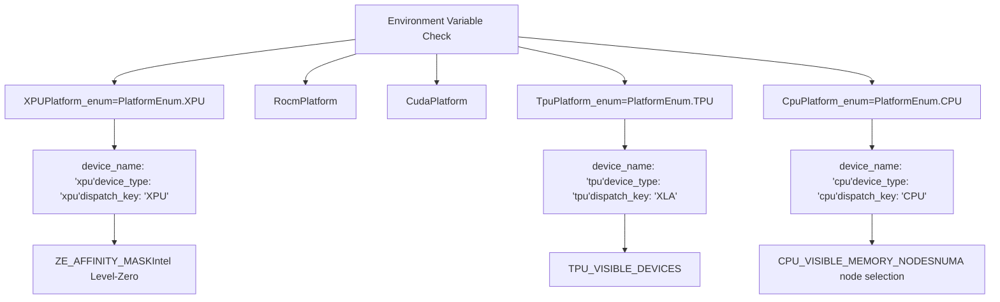
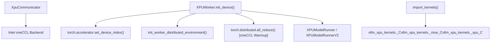

# XPU, CPU, and TPU Platforms

Relevant source files

-   [.buildkite/hardware\_tests/cpu.yaml](https://github.com/vllm-project/vllm/blob/7cc302dd/.buildkite/hardware_tests/cpu.yaml)
-   [.buildkite/scripts/hardware\_ci/run-cpu-test-arm.sh](https://github.com/vllm-project/vllm/blob/7cc302dd/.buildkite/scripts/hardware_ci/run-cpu-test-arm.sh)
-   [.buildkite/scripts/hardware\_ci/run-cpu-test-s390x.sh](https://github.com/vllm-project/vllm/blob/7cc302dd/.buildkite/scripts/hardware_ci/run-cpu-test-s390x.sh)
-   [.buildkite/scripts/hardware\_ci/run-cpu-test.sh](https://github.com/vllm-project/vllm/blob/7cc302dd/.buildkite/scripts/hardware_ci/run-cpu-test.sh)
-   [.buildkite/scripts/hardware\_ci/run-xpu-test.sh](https://github.com/vllm-project/vllm/blob/7cc302dd/.buildkite/scripts/hardware_ci/run-xpu-test.sh)
-   [cmake/cpu\_extension.cmake](https://github.com/vllm-project/vllm/blob/7cc302dd/cmake/cpu_extension.cmake)
-   [csrc/cpu/cpu\_types\_vsx.hpp](https://github.com/vllm-project/vllm/blob/7cc302dd/csrc/cpu/cpu_types_vsx.hpp)
-   [csrc/cpu/shm.cpp](https://github.com/vllm-project/vllm/blob/7cc302dd/csrc/cpu/shm.cpp)
-   [csrc/cpu/torch\_bindings.cpp](https://github.com/vllm-project/vllm/blob/7cc302dd/csrc/cpu/torch_bindings.cpp)
-   [csrc/cpu/utils.cpp](https://github.com/vllm-project/vllm/blob/7cc302dd/csrc/cpu/utils.cpp)
-   [docker/Dockerfile.cpu](https://github.com/vllm-project/vllm/blob/7cc302dd/docker/Dockerfile.cpu)
-   [docker/Dockerfile.s390x](https://github.com/vllm-project/vllm/blob/7cc302dd/docker/Dockerfile.s390x)
-   [docker/Dockerfile.tpu](https://github.com/vllm-project/vllm/blob/7cc302dd/docker/Dockerfile.tpu)
-   [docker/Dockerfile.xpu](https://github.com/vllm-project/vllm/blob/7cc302dd/docker/Dockerfile.xpu)
-   [docs/deployment/frameworks/anything-llm.md](https://github.com/vllm-project/vllm/blob/7cc302dd/docs/deployment/frameworks/anything-llm.md?plain=1)
-   [docs/getting\_started/installation/.nav.yml](https://github.com/vllm-project/vllm/blob/7cc302dd/docs/getting_started/installation/.nav.yml)
-   [docs/getting\_started/installation/README.md](https://github.com/vllm-project/vllm/blob/7cc302dd/docs/getting_started/installation/README.md?plain=1)
-   [docs/getting\_started/installation/cpu.md](https://github.com/vllm-project/vllm/blob/7cc302dd/docs/getting_started/installation/cpu.md?plain=1)
-   [examples/tool\_chat\_template\_phi4\_mini.jinja](https://github.com/vllm-project/vllm/blob/7cc302dd/examples/tool_chat_template_phi4_mini.jinja)
-   [requirements/cpu-build.txt](https://github.com/vllm-project/vllm/blob/7cc302dd/requirements/cpu-build.txt)
-   [requirements/cpu.txt](https://github.com/vllm-project/vllm/blob/7cc302dd/requirements/cpu.txt)
-   [requirements/tpu.txt](https://github.com/vllm-project/vllm/blob/7cc302dd/requirements/tpu.txt)
-   [requirements/xpu-test.in](https://github.com/vllm-project/vllm/blob/7cc302dd/requirements/xpu-test.in)
-   [requirements/xpu-test.txt](https://github.com/vllm-project/vllm/blob/7cc302dd/requirements/xpu-test.txt)
-   [requirements/xpu.txt](https://github.com/vllm-project/vllm/blob/7cc302dd/requirements/xpu.txt)
-   [tests/entrypoints/llm/test\_accuracy.py](https://github.com/vllm-project/vllm/blob/7cc302dd/tests/entrypoints/llm/test_accuracy.py)
-   [tests/transformers\_utils/test\_config.py](https://github.com/vllm-project/vllm/blob/7cc302dd/tests/transformers_utils/test_config.py)
-   [tools/install\_nixl\_from\_source\_ubuntu.py](https://github.com/vllm-project/vllm/blob/7cc302dd/tools/install_nixl_from_source_ubuntu.py)
-   [vllm/distributed/device\_communicators/cpu\_communicator.py](https://github.com/vllm-project/vllm/blob/7cc302dd/vllm/distributed/device_communicators/cpu_communicator.py)
-   [vllm/model\_executor/layers/fused\_moe/xpu\_fused\_moe.py](https://github.com/vllm-project/vllm/blob/7cc302dd/vllm/model_executor/layers/fused_moe/xpu_fused_moe.py)
-   [vllm/model\_executor/layers/quantization/utils/marlin\_utils\_test.py](https://github.com/vllm-project/vllm/blob/7cc302dd/vllm/model_executor/layers/quantization/utils/marlin_utils_test.py)
-   [vllm/platforms/\_\_init\_\_.py](https://github.com/vllm-project/vllm/blob/7cc302dd/vllm/platforms/__init__.py)
-   [vllm/plugins/\_\_init\_\_.py](https://github.com/vllm-project/vllm/blob/7cc302dd/vllm/plugins/__init__.py)
-   [vllm/plugins/io\_processors/\_\_init\_\_.py](https://github.com/vllm-project/vllm/blob/7cc302dd/vllm/plugins/io_processors/__init__.py)
-   [vllm/utils/cpu\_triton\_utils.py](https://github.com/vllm-project/vllm/blob/7cc302dd/vllm/utils/cpu_triton_utils.py)
-   [vllm/v1/worker/cpu\_model\_runner.py](https://github.com/vllm-project/vllm/blob/7cc302dd/vllm/v1/worker/cpu_model_runner.py)
-   [vllm/v1/worker/cpu\_worker.py](https://github.com/vllm-project/vllm/blob/7cc302dd/vllm/v1/worker/cpu_worker.py)
-   [vllm/v1/worker/xpu\_model\_runner.py](https://github.com/vllm-project/vllm/blob/7cc302dd/vllm/v1/worker/xpu_model_runner.py)
-   [vllm/v1/worker/xpu\_worker.py](https://github.com/vllm-project/vllm/blob/7cc302dd/vllm/v1/worker/xpu_worker.py)

This document describes the Intel XPU, CPU, and TPU platform implementations in vLLM. These platforms extend vLLM's hardware support beyond NVIDIA CUDA and AMD ROCm GPUs, enabling inference on alternative hardware through a unified platform abstraction layer.

For information about the platform abstraction interface and detection mechanism, see [Platform Abstraction Layer](/vllm-project/vllm/10.1-platform-abstraction-layer). For GPU platforms (CUDA and ROCm), see [CUDA Platform](/vllm-project/vllm/10.2-cuda-platform) and [ROCm Platform](/vllm-project/vllm/10.3-rocm-platform).

## Overview

vLLM supports three additional hardware platforms through dedicated platform implementations:

-   **XPU Platform**: Intel Data Center GPUs (e.g., Max Series) and Arc GPUs, using Intel's oneAPI stack and Intel Extension for PyTorch.
-   **CPU Platform**: General-purpose CPUs (x86, ARM, PowerPC, S390X, RISC-V) with NUMA topology awareness and architecture-specific optimizations.
-   **TPU Platform**: Google TPUs via an external `tpu-inference` package.

Each platform inherits from the `Platform` base class and overrides methods to provide hardware-specific behavior for device management, attention backend selection, memory management, and distributed communication.

**Sources:** [vllm/platforms/xpu.py30-39](https://github.com/vllm-project/vllm/blob/7cc302dd/vllm/platforms/xpu.py#L30-L39) [vllm/platforms/cpu.py72-78](https://github.com/vllm-project/vllm/blob/7cc302dd/vllm/platforms/cpu.py#L72-L78) [requirements/tpu.txt14](https://github.com/vllm-project/vllm/blob/7cc302dd/requirements/tpu.txt#L14-L14)

## Platform Enumeration and Detection

The platform system identifies supported hardware through the `PlatformEnum` and detects the active environment during initialization.

### Detection Mechanism

Title: Platform Detection and Environment Mapping

**Sources:** [vllm/platforms/xpu.py30-39](https://github.com/vllm-project/vllm/blob/7cc302dd/vllm/platforms/xpu.py#L30-L39) [vllm/platforms/cpu.py72-78](https://github.com/vllm-project/vllm/blob/7cc302dd/vllm/platforms/cpu.py#L72-L78) [vllm/platforms/\_\_init\_\_.py10-50](https://github.com/vllm-project/vllm/blob/7cc302dd/vllm/platforms/__init__.py#L10-L50)

## XPU Platform (Intel GPUs)

The `XPUPlatform` provides support for Intel Data Center GPUs and Arc GPUs. It utilizes the Intel oneAPI Base Toolkit and Level Zero drivers.

### XPU Architecture and Initialization

The XPU implementation relies on `vllm_xpu_kernels` and Intel's oneCCL for distributed communication.

Title: XPU Worker Initialization and Data Flow

**Sources:** [vllm/platforms/xpu.py41-46](https://github.com/vllm-project/vllm/blob/7cc302dd/vllm/platforms/xpu.py#L41-L46) [vllm/v1/worker/xpu\_worker.py55-119](https://github.com/vllm-project/vllm/blob/7cc302dd/vllm/v1/worker/xpu_worker.py#L55-L119) [docker/Dockerfile.xpu54-61](https://github.com/vllm-project/vllm/blob/7cc302dd/docker/Dockerfile.xpu#L54-L61) [requirements/xpu.txt18](https://github.com/vllm-project/vllm/blob/7cc302dd/requirements/xpu.txt#L18-L18)

### XPU-Specific Features and Capabilities

-   **Attention Backends**: Supports `TRITON_ATTN` and optimized XPU kernels. Flash Attention is a primary target but has specific dtype constraints [vllm/platforms/xpu.py48-116](https://github.com/vllm-project/vllm/blob/7cc302dd/vllm/platforms/xpu.py#L48-L116)
-   **Quantization**: Validated for `fp8` and `GPTQ-Int4` models [docker/Dockerfile.xpu41-42](https://github.com/vllm-project/vllm/blob/7cc302dd/docker/Dockerfile.xpu#L41-L42)
-   **Distributed**: Supports both Ray and Multiprocessing (`mp`) backends [vllm/v1/worker/xpu\_worker.py104](https://github.com/vllm-project/vllm/blob/7cc302dd/vllm/v1/worker/xpu_worker.py#L104-L104)
-   **Memory Management**: Uses Level Zero affinity masks (`ZE_AFFINITY_MASK`) for device isolation [vllm/v1/worker/xpu\_worker.py30](https://github.com/vllm-project/vllm/blob/7cc302dd/vllm/v1/worker/xpu_worker.py#L30-L30)

**Sources:** [vllm/v1/worker/xpu\_worker.py55-119](https://github.com/vllm-project/vllm/blob/7cc302dd/vllm/v1/worker/xpu_worker.py#L55-L119) [.buildkite/scripts/hardware\_ci/run-xpu-test.sh36-44](https://github.com/vllm-project/vllm/blob/7cc302dd/.buildkite/scripts/hardware_ci/run-xpu-test.sh#L36-L44)

## CPU Platform

The `CpuPlatform` supports inference across diverse architectures with a focus on NUMA locality and SIMD optimizations.

### CPU Architecture and Worker Flow

The `CPUWorker` manages the execution environment, including OpenMP thread affinity and NUMA binding.

Title: CPU Execution Pipeline and Native Bindings

```mermaid
flowchart TD
    Bindings["TORCH_LIBRARY_EXPAND"]
    OneDNN["onednn_mm / onednn_scaled_mm"]
    Attn["cpu_attention_with_kv_cache"]
    MoE["cpu_fused_moe / dynamic_4bit_int_moe_cpu"]
    CPURunner["CPUModelRunner"]
    Load["load_model() -> get_model()"]
    PostProcess["_postprocess_tensors() [Move to CPU]"]
    Warmup["warming_up_model() [Inductor Freezing]"]
    Init["CPUWorker.init_device()"]
    LibCheck["Check LD_PRELOAD (libtcmalloc, libiomp)"]
    Affinity["_get_autobind_cpu_ids() [NUMA Aware]"]
    OMP["torch.ops._C.init_cpu_threads_env()"]
    Runner["CPUModelRunner"]

    Bindings --> OneDNN
    Bindings --> Attn
    Bindings --> MoE
    CPURunner --> Load
    CPURunner --> PostProcess
    CPURunner --> Warmup
    Init --> LibCheck
    Init --> Affinity
    Init --> OMP
    Init --> Runner
```

**Sources:** [vllm/v1/worker/cpu\_worker.py55-125](https://github.com/vllm-project/vllm/blob/7cc302dd/vllm/v1/worker/cpu_worker.py#L55-L125) [vllm/v1/worker/cpu\_model\_runner.py19-84](https://github.com/vllm-project/vllm/blob/7cc302dd/vllm/v1/worker/cpu_model_runner.py#L19-L84) [csrc/cpu/torch\_bindings.cpp135-165](https://github.com/vllm-project/vllm/blob/7cc302dd/csrc/cpu/torch_bindings.cpp#L135-L165)

### CPU Architecture Support Matrix

vLLM detects the ISA and selects optimized kernels during the build and runtime via CMake logic.

| Architecture | Detection Symbol | Optimization Features |
| --- | --- | --- |
| **x86\_64** | `ENABLE_X86_ISA` | AVX512 (F/VL/BW/DQ), AVX2, AMX (BF16/Tile), VNNI [cmake/cpu\_extension.cmake92-112](https://github.com/vllm-project/vllm/blob/7cc302dd/cmake/cpu_extension.cmake#L92-L112) |
| **ARM** | `ASIMD_FOUND` | NEON (ASIMD), SVE, BF16 extensions, dotprod [cmake/cpu\_extension.cmake128-138](https://github.com/vllm-project/vllm/blob/7cc302dd/cmake/cpu_extension.cmake#L128-L138) |
| **PowerPC** | `POWERPC` | VSX (Power9/10/11), mcpu/mtune optimizations [cmake/cpu\_extension.cmake114-127](https://github.com/vllm-project/vllm/blob/7cc302dd/cmake/cpu_extension.cmake#L114-L127) |
| **S390X** | `S390_FOUND` | Vector Facility (VX/VXE), mzvector [cmake/cpu\_extension.cmake139-146](https://github.com/vllm-project/vllm/blob/7cc302dd/cmake/cpu_extension.cmake#L139-L146) |
| **RISC-V** | `riscv64` | Vector extensions (RVV), BF16/FP16 support (zvfh/zfbfmin) [cmake/cpu\_extension.cmake147-160](https://github.com/vllm-project/vllm/blob/7cc302dd/cmake/cpu_extension.cmake#L147-L160) |

**Sources:** [cmake/cpu\_extension.cmake92-160](https://github.com/vllm-project/vllm/blob/7cc302dd/cmake/cpu_extension.cmake#L92-L160) [vllm/v1/worker/cpu\_worker.py78-91](https://github.com/vllm-project/vllm/blob/7cc302dd/vllm/v1/worker/cpu_worker.py#L78-L91)

### Memory and Thread Management

The CPU platform manages KV cache space in system RAM and ensures workers are pinned to physical cores.

-   **KV Cache Space**: Configured via `VLLM_CPU_KVCACHE_SPACE` (in GiB). The `determine_available_memory` method returns the configured space [vllm/v1/worker/cpu\_worker.py137-138](https://github.com/vllm-project/vllm/blob/7cc302dd/vllm/v1/worker/cpu_worker.py#L137-L138)
-   **NUMA Binding**: Workers are bound to specific NUMA nodes. `_get_autobind_cpu_ids` calculates IDs based on available nodes and local rank [vllm/v1/worker/cpu\_worker.py147-176](https://github.com/vllm-project/vllm/blob/7cc302dd/vllm/v1/worker/cpu_worker.py#L147-L176)
-   **Thread Affinity**: Uses `torch.ops._C.init_cpu_threads_env` to bind OpenMP threads to specific CPU IDs to avoid SMT contention and improve cache locality [vllm/v1/worker/cpu\_worker.py106-109](https://github.com/vllm-project/vllm/blob/7cc302dd/vllm/v1/worker/cpu_worker.py#L106-L109)

**Sources:** [vllm/v1/worker/cpu\_worker.py74-109](https://github.com/vllm-project/vllm/blob/7cc302dd/vllm/v1/worker/cpu_worker.py#L74-L109) [docs/getting\_started/installation/cpu.md147-150](https://github.com/vllm-project/vllm/blob/7cc302dd/docs/getting_started/installation/cpu.md?plain=1#L147-L150)

## TPU Platform

The TPU implementation is integrated as a pluggable platform that delegates core logic to the `tpu-inference` package and uses `nixl` for high-performance communication.

### TPU Platform Characteristics

-   **Device Type**: Identified as `tpu` in vLLM configuration [requirements/tpu.txt4](https://github.com/vllm-project/vllm/blob/7cc302dd/requirements/tpu.txt#L4-L4)
-   **Dependencies**: Requires `tpu-inference` (v0.12.0+) and `nixl` (v0.3.0+) [requirements/tpu.txt13-14](https://github.com/vllm-project/vllm/blob/7cc302dd/requirements/tpu.txt#L13-L14)
-   **Distributed Execution**: Leverages Ray for multi-host coordination and data parallel operations [requirements/tpu.txt10-11](https://github.com/vllm-project/vllm/blob/7cc302dd/requirements/tpu.txt#L10-L11)
-   **Dispatch**: Uses the `XLA` dispatch key for operations [requirements/tpu.txt14](https://github.com/vllm-project/vllm/blob/7cc302dd/requirements/tpu.txt#L14-L14)

**Sources:** [requirements/tpu.txt1-15](https://github.com/vllm-project/vllm/blob/7cc302dd/requirements/tpu.txt#L1-L15)

## Platform Comparison Matrix

| Feature | XPU (Intel) | CPU (Generic) | TPU (Google) |
| --- | --- | --- | --- |
| **Runtime Backend** | Intel Extension for PyTorch | oneDNN / Native C++ | tpu-inference / XLA |
| **Attention** | XPU Kernels / Triton | `cpu_attention_with_kv_cache` | XLA Optimized |
| **Dist. Backend** | oneCCL / NIXL | Gloo / SHM AllReduce | NIXL / Ray |
| **Quantization** | FP8, GPTQ, AWQ | Int8 (oneDNN), 4bit | (External) |
| **KV Cache** | Device Memory (HBM) | System RAM (NUMA Aware) | TPU HBM |
| **Parallelism** | TP, EP, DP | TP, DP | TP, DP |

**Sources:** [vllm/v1/worker/cpu\_worker.py41](https://github.com/vllm-project/vllm/blob/7cc302dd/vllm/v1/worker/cpu_worker.py#L41-L41) [vllm/v1/worker/xpu\_worker.py111](https://github.com/vllm-project/vllm/blob/7cc302dd/vllm/v1/worker/xpu_worker.py#L111-L111) [csrc/cpu/torch\_bindings.cpp97](https://github.com/vllm-project/vllm/blob/7cc302dd/csrc/cpu/torch_bindings.cpp#L97-L97) [docker/Dockerfile.xpu121-123](https://github.com/vllm-project/vllm/blob/7cc302dd/docker/Dockerfile.xpu#L121-L123) [requirements/tpu.txt13-14](https://github.com/vllm-project/vllm/blob/7cc302dd/requirements/tpu.txt#L13-L14)
