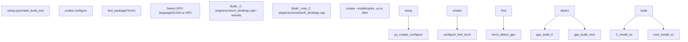
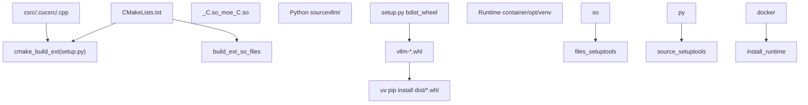

# Build System and Deployment

Relevant source files

-   [.buildkite/scripts/generate-nightly-index.py](https://github.com/vllm-project/vllm/blob/7cc302dd/.buildkite/scripts/generate-nightly-index.py)
-   [.pre-commit-config.yaml](https://github.com/vllm-project/vllm/blob/7cc302dd/.pre-commit-config.yaml)
-   [docker/Dockerfile](https://github.com/vllm-project/vllm/blob/7cc302dd/docker/Dockerfile)
-   [docker/Dockerfile.nightly\_torch](https://github.com/vllm-project/vllm/blob/7cc302dd/docker/Dockerfile.nightly_torch)
-   [docker/Dockerfile.rocm](https://github.com/vllm-project/vllm/blob/7cc302dd/docker/Dockerfile.rocm)
-   [docker/Dockerfile.rocm\_base](https://github.com/vllm-project/vllm/blob/7cc302dd/docker/Dockerfile.rocm_base)
-   [docker/docker-bake.hcl](https://github.com/vllm-project/vllm/blob/7cc302dd/docker/docker-bake.hcl)
-   [docker/versions.json](https://github.com/vllm-project/vllm/blob/7cc302dd/docker/versions.json)
-   [docs/assets/contributing/dockerfile-stages-dependency.png](https://github.com/vllm-project/vllm/blob/7cc302dd/docs/assets/contributing/dockerfile-stages-dependency.png)
-   [docs/deployment/docker.md](https://github.com/vllm-project/vllm/blob/7cc302dd/docs/deployment/docker.md?plain=1)
-   [docs/deployment/frameworks/lws.md](https://github.com/vllm-project/vllm/blob/7cc302dd/docs/deployment/frameworks/lws.md?plain=1)
-   [docs/deployment/integrations/kaito.md](https://github.com/vllm-project/vllm/blob/7cc302dd/docs/deployment/integrations/kaito.md?plain=1)
-   [docs/deployment/integrations/kserve.md](https://github.com/vllm-project/vllm/blob/7cc302dd/docs/deployment/integrations/kserve.md?plain=1)
-   [docs/deployment/integrations/kthena.md](https://github.com/vllm-project/vllm/blob/7cc302dd/docs/deployment/integrations/kthena.md?plain=1)
-   [docs/deployment/integrations/llm-d.md](https://github.com/vllm-project/vllm/blob/7cc302dd/docs/deployment/integrations/llm-d.md?plain=1)
-   [docs/deployment/k8s.md](https://github.com/vllm-project/vllm/blob/7cc302dd/docs/deployment/k8s.md?plain=1)
-   [docs/getting\_started/installation/cpu.apple.inc.md](https://github.com/vllm-project/vllm/blob/7cc302dd/docs/getting_started/installation/cpu.apple.inc.md?plain=1)
-   [docs/getting\_started/installation/cpu.arm.inc.md](https://github.com/vllm-project/vllm/blob/7cc302dd/docs/getting_started/installation/cpu.arm.inc.md?plain=1)
-   [docs/getting\_started/installation/cpu.s390x.inc.md](https://github.com/vllm-project/vllm/blob/7cc302dd/docs/getting_started/installation/cpu.s390x.inc.md?plain=1)
-   [docs/getting\_started/installation/cpu.x86.inc.md](https://github.com/vllm-project/vllm/blob/7cc302dd/docs/getting_started/installation/cpu.x86.inc.md?plain=1)
-   [docs/getting\_started/installation/gpu.cuda.inc.md](https://github.com/vllm-project/vllm/blob/7cc302dd/docs/getting_started/installation/gpu.cuda.inc.md?plain=1)
-   [docs/getting\_started/installation/gpu.md](https://github.com/vllm-project/vllm/blob/7cc302dd/docs/getting_started/installation/gpu.md?plain=1)
-   [docs/getting\_started/installation/gpu.rocm.inc.md](https://github.com/vllm-project/vllm/blob/7cc302dd/docs/getting_started/installation/gpu.rocm.inc.md?plain=1)
-   [docs/getting\_started/installation/gpu.xpu.inc.md](https://github.com/vllm-project/vllm/blob/7cc302dd/docs/getting_started/installation/gpu.xpu.inc.md?plain=1)
-   [docs/getting\_started/installation/python\_env\_setup.inc.md](https://github.com/vllm-project/vllm/blob/7cc302dd/docs/getting_started/installation/python_env_setup.inc.md?plain=1)
-   [docs/models/extensions/runai\_model\_streamer.md](https://github.com/vllm-project/vllm/blob/7cc302dd/docs/models/extensions/runai_model_streamer.md?plain=1)
-   [examples/online\_serving/multi-node-serving.sh](https://github.com/vllm-project/vllm/blob/7cc302dd/examples/online_serving/multi-node-serving.sh)
-   [pyproject.toml](https://github.com/vllm-project/vllm/blob/7cc302dd/pyproject.toml)
-   [requirements/build.txt](https://github.com/vllm-project/vllm/blob/7cc302dd/requirements/build.txt)
-   [requirements/common.txt](https://github.com/vllm-project/vllm/blob/7cc302dd/requirements/common.txt)
-   [requirements/cuda.txt](https://github.com/vllm-project/vllm/blob/7cc302dd/requirements/cuda.txt)
-   [requirements/nightly\_torch\_test.txt](https://github.com/vllm-project/vllm/blob/7cc302dd/requirements/nightly_torch_test.txt)
-   [requirements/rocm-build.txt](https://github.com/vllm-project/vllm/blob/7cc302dd/requirements/rocm-build.txt)
-   [requirements/rocm-test.in](https://github.com/vllm-project/vllm/blob/7cc302dd/requirements/rocm-test.in)
-   [requirements/rocm-test.txt](https://github.com/vllm-project/vllm/blob/7cc302dd/requirements/rocm-test.txt)
-   [requirements/rocm.txt](https://github.com/vllm-project/vllm/blob/7cc302dd/requirements/rocm.txt)
-   [requirements/test.in](https://github.com/vllm-project/vllm/blob/7cc302dd/requirements/test.in)
-   [requirements/test.txt](https://github.com/vllm-project/vllm/blob/7cc302dd/requirements/test.txt)
-   [setup.py](https://github.com/vllm-project/vllm/blob/7cc302dd/setup.py)
-   [tests/model\_executor/model\_loader/runai\_streamer\_loader/test\_runai\_utils.py](https://github.com/vllm-project/vllm/blob/7cc302dd/tests/model_executor/model_loader/runai_streamer_loader/test_runai_utils.py)
-   [tests/quantization/test\_cpu\_wna16.py](https://github.com/vllm-project/vllm/blob/7cc302dd/tests/quantization/test_cpu_wna16.py)
-   [tests/standalone\_tests/python\_only\_compile.sh](https://github.com/vllm-project/vllm/blob/7cc302dd/tests/standalone_tests/python_only_compile.sh)
-   [tests/tools/\_\_init\_\_.py](https://github.com/vllm-project/vllm/blob/7cc302dd/tests/tools/__init__.py)
-   [tests/v1/kv\_connector/unit/test\_moriio\_connector.py](https://github.com/vllm-project/vllm/blob/7cc302dd/tests/v1/kv_connector/unit/test_moriio_connector.py)
-   [tools/generate\_versions\_json.py](https://github.com/vllm-project/vllm/blob/7cc302dd/tools/generate_versions_json.py)
-   [tools/install\_deepgemm.sh](https://github.com/vllm-project/vllm/blob/7cc302dd/tools/install_deepgemm.sh)
-   [use\_existing\_torch.py](https://github.com/vllm-project/vllm/blob/7cc302dd/use_existing_torch.py)
-   [vllm/transformers\_utils/runai\_utils.py](https://github.com/vllm-project/vllm/blob/7cc302dd/vllm/transformers_utils/runai_utils.py)

This page documents how vLLM is built, packaged, and deployed. It covers the Python packaging configuration, the CMake build system for CUDA/HIP extensions, Docker image construction, and dependency management.

For information about environment variables that affect runtime behavior, see [Environment Variables System](/vllm-project/vllm/2.3-environment-variables-system). For information about `torch.compile` integration and compilation modes, see [Compilation Configuration and Optimization Levels](/vllm-project/vllm/2.4-compilation-configuration-and-optimization-levels). For platform-specific runtime details (CUDA, ROCm, CPU, TPU), see [Platform Support](/vllm-project/vllm/10-platform-support).

---

## Overview

vLLM has two distinct build phases:

1.  **C++/CUDA extension build** — A CMake-driven compilation of GPU kernels and custom ops into shared libraries (`.so` files). This is the expensive step that requires CUDA/ROCm toolchains and handles architecture-specific code generation.
2.  **Python wheel build** — A standard `setuptools` build that packages the Python source along with the compiled `.so` files into a distributable wheel.

The Docker build further separates these phases into parallel stages to minimize rebuild time and optimize image size.

Sources: [setup.py1-50](https://github.com/vllm-project/vllm/blob/7cc302dd/setup.py#L1-L50) [docker/Dockerfile1-50](https://github.com/vllm-project/vllm/blob/7cc302dd/docker/Dockerfile#L1-L50)

---

## Python Packaging

### pyproject.toml

[pyproject.toml](https://github.com/vllm-project/vllm/blob/7cc302dd/pyproject.toml) is the authoritative packaging configuration, using `setuptools` as the build backend.

| Field | Value |
| --- | --- |
| Package name | `vllm` |
| Build backend | `setuptools.build_meta` |
| Versioning | `setuptools-scm` (derived from git tags) |
| Python requires | `>=3.10,<3.14` |
| Console entrypoint | `vllm = "vllm.entrypoints.cli.main:main"` |
| License | Apache-2.0 |

**Build-system requirements** ([pyproject.toml3-12](https://github.com/vllm-project/vllm/blob/7cc302dd/pyproject.toml#L3-L12)):

-   `cmake>=3.26.1`
-   `ninja`
-   `packaging>=24.2`
-   `setuptools>=77.0.3,<81.0.0`
-   `setuptools-scm>=8.0`
-   `torch == 2.10.0`
-   `wheel`
-   `jinja2`

**Plugin entry points** ([pyproject.toml44-46](https://github.com/vllm-project/vllm/blob/7cc302dd/pyproject.toml#L44-L46)):

-   `lora_filesystem_resolver` — `vllm.plugins.lora_resolvers.filesystem_resolver:register_filesystem_resolver`
-   `lora_hf_hub_resolver` — `vllm.plugins.lora_resolvers.hf_hub_resolver:register_hf_hub_resolver`

Sources: [pyproject.toml1-53](https://github.com/vllm-project/vllm/blob/7cc302dd/pyproject.toml#L1-L53)

### setup.py

`setup.py` orchestrates the build by bridging Python's `setuptools` with CMake. Key classes:

| Class | Purpose |
| --- | --- |
| `CMakeExtension` | Declares a C++ extension backed by a CMake project [setup.py145-149](https://github.com/vllm-project/vllm/blob/7cc302dd/setup.py#L145-L149) |
| `cmake_build_ext` | Custom `build_ext` command; invokes `cmake` configure and build steps [setup.py151-200](https://github.com/vllm-project/vllm/blob/7cc302dd/setup.py#L151-L200) |

**Target device detection** ([setup.py40-65](https://github.com/vllm-project/vllm/blob/7cc302dd/setup.py#L40-L65)): The `VLLM_TARGET_DEVICE` environment variable controls what gets compiled. If unset, `setup.py` auto-detects based on `torch.version`:

-   `torch.version.hip is not None` → `"rocm"` [setup.py54-55](https://github.com/vllm-project/vllm/blob/7cc302dd/setup.py#L54-L55)
-   `torch.version.xpu is not None` → `"xpu"` [setup.py57-58](https://github.com/vllm-project/vllm/blob/7cc302dd/setup.py#L57-L58)
-   `torch.version.cuda is not None` → `"cuda"` [setup.py60-61](https://github.com/vllm-project/vllm/blob/7cc302dd/setup.py#L60-L61)
-   macOS → `"cpu"` [setup.py42-44](https://github.com/vllm-project/vllm/blob/7cc302dd/setup.py#L42-L44)

**Compiler caching** ([setup.py67-75](https://github.com/vllm-project/vllm/blob/7cc302dd/setup.py#L67-L75)): `setup.py` checks for `sccache` first, then `ccache`. If found, it enables them to speed up subsequent builds.

**Job parallelism** ([setup.py158-195](https://github.com/vllm-project/vllm/blob/7cc302dd/setup.py#L158-L195)): `compute_num_jobs` reads `MAX_JOBS` (env) and `NVCC_THREADS` (env) to determine build concurrency. When `NVCC_THREADS` is set (for CUDA 11.2+), `num_jobs` is reduced proportionally to avoid system overload [setup.py182-191](https://github.com/vllm-project/vllm/blob/7cc302dd/setup.py#L182-L191)

Sources: [setup.py1-200](https://github.com/vllm-project/vllm/blob/7cc302dd/setup.py#L1-L200)

---

## CMake Build System

The top-level CMake system builds all C++/CUDA extensions, including the main `_C` bindings and specialized modules like MoE.

### Architecture Handling

**CUDA architecture sets**: vLLM supports a wide range of compute capabilities. Architecture-specific flags are generated based on the detected or specified target device.

**HIP/ROCm architecture set** ([docker/Dockerfile.rocm\_base30-33](https://github.com/vllm-project/vllm/blob/7cc302dd/docker/Dockerfile.rocm_base#L30-L33)):

```
gfx90a;gfx942;gfx950;gfx1100;gfx1101;gfx1200;gfx1201;gfx1150;gfx1151
```
### CMake Build Flow Diagram

**CMake extension build process**


Sources: [setup.py137-180](https://github.com/vllm-project/vllm/blob/7cc302dd/setup.py#L137-L180) [docker/Dockerfile.rocm\_base30-33](https://github.com/vllm-project/vllm/blob/7cc302dd/docker/Dockerfile.rocm_base#L30-L33)

---

## Dependency Management

### Requirements File Structure

vLLM uses a modular requirements structure to handle different hardware backends and testing environments.

| File | Purpose |
| --- | --- |
| `requirements/common.txt` | Runtime deps shared across all platforms (e.g., `transformers`, `fastapi`, `pydantic`) [requirements/common.txt1-57](https://github.com/vllm-project/vllm/blob/7cc302dd/requirements/common.txt#L1-L57) |
| `requirements/cuda.txt` | CUDA platform: includes `common.txt`, adds `torch`, `flashinfer-python`, and `quack-kernels` [requirements/cuda.txt1-20](https://github.com/vllm-project/vllm/blob/7cc302dd/requirements/cuda.txt#L1-L20) |
| `requirements/rocm.txt` | ROCm platform: includes `common.txt`, adds AMD-specific packages. |
| `requirements/build.txt` | Build-time only: `cmake`, `ninja`, `setuptools`, `torch` [pyproject.toml3-12](https://github.com/vllm-project/vllm/blob/7cc302dd/pyproject.toml#L3-L12) |
| `requirements/test.txt` | Full pinned test dependency lockfile for CUDA [requirements/test.txt1-100](https://github.com/vllm-project/vllm/blob/7cc302dd/requirements/test.txt#L1-L100) |
| `requirements/rocm-test.txt` | ROCm test deps [requirements/rocm-test.txt1-115](https://github.com/vllm-project/vllm/blob/7cc302dd/requirements/rocm-test.txt#L1-L115) |

### Key Pinned Versions

| Package | Pinned Version | Source |
| --- | --- | --- |
| `torch` | 2.10.0 | [requirements/cuda.txt7](https://github.com/vllm-project/vllm/blob/7cc302dd/requirements/cuda.txt#L7-L7) |
| `flashinfer-python` | 0.6.6 | [requirements/cuda.txt12](https://github.com/vllm-project/vllm/blob/7cc302dd/requirements/cuda.txt#L12-L12) |
| `transformers` | 4.56.0+ | [requirements/common.txt10](https://github.com/vllm-project/vllm/blob/7cc302dd/requirements/common.txt#L10-L10) |
| `vllm` (test) | 0.22.0 (tokenizers) | [requirements/test.in43](https://github.com/vllm-project/vllm/blob/7cc302dd/requirements/test.in#L43-L43) |

Sources: [requirements/common.txt1-60](https://github.com/vllm-project/vllm/blob/7cc302dd/requirements/common.txt#L1-L60) [requirements/cuda.txt1-21](https://github.com/vllm-project/vllm/blob/7cc302dd/requirements/cuda.txt#L1-L21) [requirements/test.txt1-100](https://github.com/vllm-project/vllm/blob/7cc302dd/requirements/test.txt#L1-L100) [requirements/test.in1-80](https://github.com/vllm-project/vllm/blob/7cc302dd/requirements/test.in#L1-L80)

---

## Docker Multi-Stage Build (CUDA)

The main [docker/Dockerfile](https://github.com/vllm-project/vllm/blob/7cc302dd/docker/Dockerfile) uses a multi-stage build to maximize layer caching. For details, see [Docker Multi-Stage Build](/vllm-project/vllm/11.1-docker-multi-stage-build).

### Build Arguments

| Argument | Default | Purpose |
| --- | --- | --- |
| `CUDA_VERSION` | `12.9.1` | Base CUDA version [docker/Dockerfile25](https://github.com/vllm-project/vllm/blob/7cc302dd/docker/Dockerfile#L25-L25) |
| `PYTHON_VERSION` | `3.12` | Python version [docker/Dockerfile26](https://github.com/vllm-project/vllm/blob/7cc302dd/docker/Dockerfile#L26-L26) |
| `PYTORCH_NIGHTLY` | unset | Enables nightly PyTorch installation [docker/Dockerfile157](https://github.com/vllm-project/vllm/blob/7cc302dd/docker/Dockerfile#L157-L157) |
| `INSTALL_KV_CONNECTORS` | `false` | Includes KV-connector libs [docker/Dockerfile89](https://github.com/vllm-project/vllm/blob/7cc302dd/docker/Dockerfile#L89-L89) |

### Stage Details

**`base` stage** ([docker/Dockerfile93-126](https://github.com/vllm-project/vllm/blob/7cc302dd/docker/Dockerfile#L93-L126)):

-   Installs GCC 10 to avoid CUTLASS compilation issues [docker/Dockerfile110-112](https://github.com/vllm-project/vllm/blob/7cc302dd/docker/Dockerfile#L110-L112)
-   Installs `uv` for high-performance package management [docker/Dockerfile120](https://github.com/vllm-project/vllm/blob/7cc302dd/docker/Dockerfile#L120-L120)
-   Creates `/opt/venv` virtual environment [docker/Dockerfile121](https://github.com/vllm-project/vllm/blob/7cc302dd/docker/Dockerfile#L121-L121)

**`build` stage**:

-   Compiles C++ extensions and bundles them into the final wheel.

Sources: [docker/Dockerfile1-150](https://github.com/vllm-project/vllm/blob/7cc302dd/docker/Dockerfile#L1-L150)

---

## ROCm-Specific Build

The ROCm build utilizes a separate pipeline to handle AMD's software stack. For details, see [Build Variants and Configuration](/vllm-project/vllm/11.3-build-variants-and-configuration).

### Dockerfile.rocm\_base

[docker/Dockerfile.rocm\_base](https://github.com/vllm-project/vllm/blob/7cc302dd/docker/Dockerfile.rocm_base) compiles the entire ROCm stack from source:

-   **Triton**: `github.com/ROCm/triton.git` [docker/Dockerfile.rocm\_base3](https://github.com/vllm-project/vllm/blob/7cc302dd/docker/Dockerfile.rocm_base#L3-L3)
-   **PyTorch**: `github.com/ROCm/pytorch.git` [docker/Dockerfile.rocm\_base5](https://github.com/vllm-project/vllm/blob/7cc302dd/docker/Dockerfile.rocm_base#L5-L5)
-   **AITER**: `github.com/ROCm/aiter.git` [docker/Dockerfile.rocm\_base13](https://github.com/vllm-project/vllm/blob/7cc302dd/docker/Dockerfile.rocm_base#L13-L13)

### Dockerfile.rocm

[docker/Dockerfile.rocm](https://github.com/vllm-project/vllm/blob/7cc302dd/docker/Dockerfile.rocm) builds vLLM for ROCm. It supports building from local source or cloning a remote repository via `REMOTE_VLLM` [docker/Dockerfile.rocm81-95](https://github.com/vllm-project/vllm/blob/7cc302dd/docker/Dockerfile.rocm#L81-L95) It also handles specialized ROCm components like `RIXL` and `DeepEP` [docker/Dockerfile.rocm117-191](https://github.com/vllm-project/vllm/blob/7cc302dd/docker/Dockerfile.rocm#L117-L191)

Sources: [docker/Dockerfile.rocm1-115](https://github.com/vllm-project/vllm/blob/7cc302dd/docker/Dockerfile.rocm#L1-L115) [docker/Dockerfile.rocm\_base1-136](https://github.com/vllm-project/vllm/blob/7cc302dd/docker/Dockerfile.rocm_base#L1-L136)

---

## Runtime JIT Compilation

vLLM performs Just-In-Time (JIT) compilation for several high-performance kernels at runtime to adapt to specific model configurations. For details, see [Runtime JIT Compilation](/vllm-project/vllm/11.4-runtime-jit-compilation).

-   **FlashInfer JIT**: Generates specialized attention kernels.
-   **DeepGemm**: JIT-compiled kernels for FP8 and MoE operations [docker/Dockerfile311](https://github.com/vllm-project/vllm/blob/7cc302dd/docker/Dockerfile#L311-L311)

---

## Build Artifact Flow

**Artifact flow from source to runtime**


Sources: [docker/Dockerfile191-437](https://github.com/vllm-project/vllm/blob/7cc302dd/docker/Dockerfile#L191-L437) [setup.py145-180](https://github.com/vllm-project/vllm/blob/7cc302dd/setup.py#L145-L180)
