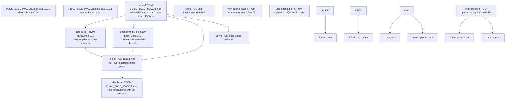
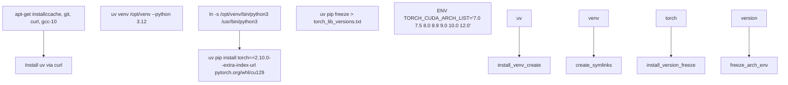
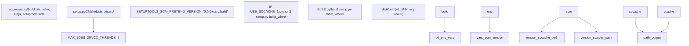
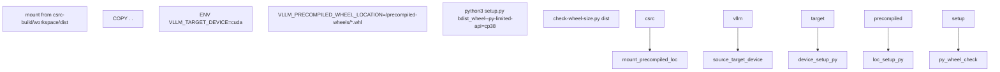
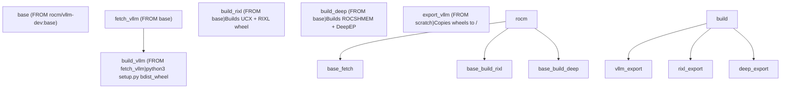

# Docker Multi-Stage Build

Relevant source files

-   [.buildkite/scripts/generate-nightly-index.py](https://github.com/vllm-project/vllm/blob/7cc302dd/.buildkite/scripts/generate-nightly-index.py)
-   [.pre-commit-config.yaml](https://github.com/vllm-project/vllm/blob/7cc302dd/.pre-commit-config.yaml)
-   [docker/Dockerfile](https://github.com/vllm-project/vllm/blob/7cc302dd/docker/Dockerfile)
-   [docker/Dockerfile.nightly\_torch](https://github.com/vllm-project/vllm/blob/7cc302dd/docker/Dockerfile.nightly_torch)
-   [docker/Dockerfile.rocm](https://github.com/vllm-project/vllm/blob/7cc302dd/docker/Dockerfile.rocm)
-   [docker/Dockerfile.rocm\_base](https://github.com/vllm-project/vllm/blob/7cc302dd/docker/Dockerfile.rocm_base)
-   [docker/docker-bake.hcl](https://github.com/vllm-project/vllm/blob/7cc302dd/docker/docker-bake.hcl)
-   [docker/versions.json](https://github.com/vllm-project/vllm/blob/7cc302dd/docker/versions.json)
-   [docs/assets/contributing/dockerfile-stages-dependency.png](https://github.com/vllm-project/vllm/blob/7cc302dd/docs/assets/contributing/dockerfile-stages-dependency.png)
-   [docs/deployment/docker.md](https://github.com/vllm-project/vllm/blob/7cc302dd/docs/deployment/docker.md?plain=1)
-   [docs/deployment/frameworks/lws.md](https://github.com/vllm-project/vllm/blob/7cc302dd/docs/deployment/frameworks/lws.md?plain=1)
-   [docs/deployment/integrations/kaito.md](https://github.com/vllm-project/vllm/blob/7cc302dd/docs/deployment/integrations/kaito.md?plain=1)
-   [docs/deployment/integrations/kserve.md](https://github.com/vllm-project/vllm/blob/7cc302dd/docs/deployment/integrations/kserve.md?plain=1)
-   [docs/deployment/integrations/kthena.md](https://github.com/vllm-project/vllm/blob/7cc302dd/docs/deployment/integrations/kthena.md?plain=1)
-   [docs/deployment/integrations/llm-d.md](https://github.com/vllm-project/vllm/blob/7cc302dd/docs/deployment/integrations/llm-d.md?plain=1)
-   [docs/deployment/k8s.md](https://github.com/vllm-project/vllm/blob/7cc302dd/docs/deployment/k8s.md?plain=1)
-   [docs/getting\_started/installation/cpu.apple.inc.md](https://github.com/vllm-project/vllm/blob/7cc302dd/docs/getting_started/installation/cpu.apple.inc.md?plain=1)
-   [docs/getting\_started/installation/cpu.arm.inc.md](https://github.com/vllm-project/vllm/blob/7cc302dd/docs/getting_started/installation/cpu.arm.inc.md?plain=1)
-   [docs/getting\_started/installation/cpu.s390x.inc.md](https://github.com/vllm-project/vllm/blob/7cc302dd/docs/getting_started/installation/cpu.s390x.inc.md?plain=1)
-   [docs/getting\_started/installation/cpu.x86.inc.md](https://github.com/vllm-project/vllm/blob/7cc302dd/docs/getting_started/installation/cpu.x86.inc.md?plain=1)
-   [docs/getting\_started/installation/gpu.cuda.inc.md](https://github.com/vllm-project/vllm/blob/7cc302dd/docs/getting_started/installation/gpu.cuda.inc.md?plain=1)
-   [docs/getting\_started/installation/gpu.md](https://github.com/vllm-project/vllm/blob/7cc302dd/docs/getting_started/installation/gpu.md?plain=1)
-   [docs/getting\_started/installation/gpu.rocm.inc.md](https://github.com/vllm-project/vllm/blob/7cc302dd/docs/getting_started/installation/gpu.rocm.inc.md?plain=1)
-   [docs/getting\_started/installation/gpu.xpu.inc.md](https://github.com/vllm-project/vllm/blob/7cc302dd/docs/getting_started/installation/gpu.xpu.inc.md?plain=1)
-   [docs/getting\_started/installation/python\_env\_setup.inc.md](https://github.com/vllm-project/vllm/blob/7cc302dd/docs/getting_started/installation/python_env_setup.inc.md?plain=1)
-   [docs/models/extensions/runai\_model\_streamer.md](https://github.com/vllm-project/vllm/blob/7cc302dd/docs/models/extensions/runai_model_streamer.md?plain=1)
-   [examples/online\_serving/multi-node-serving.sh](https://github.com/vllm-project/vllm/blob/7cc302dd/examples/online_serving/multi-node-serving.sh)
-   [pyproject.toml](https://github.com/vllm-project/vllm/blob/7cc302dd/pyproject.toml)
-   [requirements/build.txt](https://github.com/vllm-project/vllm/blob/7cc302dd/requirements/build.txt)
-   [requirements/common.txt](https://github.com/vllm-project/vllm/blob/7cc302dd/requirements/common.txt)
-   [requirements/cuda.txt](https://github.com/vllm-project/vllm/blob/7cc302dd/requirements/cuda.txt)
-   [requirements/nightly\_torch\_test.txt](https://github.com/vllm-project/vllm/blob/7cc302dd/requirements/nightly_torch_test.txt)
-   [requirements/rocm-build.txt](https://github.com/vllm-project/vllm/blob/7cc302dd/requirements/rocm-build.txt)
-   [requirements/rocm-test.in](https://github.com/vllm-project/vllm/blob/7cc302dd/requirements/rocm-test.in)
-   [requirements/rocm-test.txt](https://github.com/vllm-project/vllm/blob/7cc302dd/requirements/rocm-test.txt)
-   [requirements/rocm.txt](https://github.com/vllm-project/vllm/blob/7cc302dd/requirements/rocm.txt)
-   [requirements/test.in](https://github.com/vllm-project/vllm/blob/7cc302dd/requirements/test.in)
-   [requirements/test.txt](https://github.com/vllm-project/vllm/blob/7cc302dd/requirements/test.txt)
-   [setup.py](https://github.com/vllm-project/vllm/blob/7cc302dd/setup.py)
-   [tests/model\_executor/model\_loader/runai\_streamer\_loader/test\_runai\_utils.py](https://github.com/vllm-project/vllm/blob/7cc302dd/tests/model_executor/model_loader/runai_streamer_loader/test_runai_utils.py)
-   [tests/quantization/test\_cpu\_wna16.py](https://github.com/vllm-project/vllm/blob/7cc302dd/tests/quantization/test_cpu_wna16.py)
-   [tests/standalone\_tests/python\_only\_compile.sh](https://github.com/vllm-project/vllm/blob/7cc302dd/tests/standalone_tests/python_only_compile.sh)
-   [tests/tools/\_\_init\_\_.py](https://github.com/vllm-project/vllm/blob/7cc302dd/tests/tools/__init__.py)
-   [tests/v1/kv\_connector/unit/test\_moriio\_connector.py](https://github.com/vllm-project/vllm/blob/7cc302dd/tests/v1/kv_connector/unit/test_moriio_connector.py)
-   [tools/generate\_versions\_json.py](https://github.com/vllm-project/vllm/blob/7cc302dd/tools/generate_versions_json.py)
-   [tools/install\_deepgemm.sh](https://github.com/vllm-project/vllm/blob/7cc302dd/tools/install_deepgemm.sh)
-   [use\_existing\_torch.py](https://github.com/vllm-project/vllm/blob/7cc302dd/use_existing_torch.py)
-   [vllm/transformers\_utils/runai\_utils.py](https://github.com/vllm-project/vllm/blob/7cc302dd/vllm/transformers_utils/runai_utils.py)

## Purpose and Scope

This document describes vLLM's multi-stage Docker build architecture as defined in [docker/Dockerfile1-823](https://github.com/vllm-project/vllm/blob/7cc302dd/docker/Dockerfile#L1-L823) The build system uses Docker multi-stage builds to:

1.  Compile C++/CUDA kernels and extensions in parallel.
2.  Minimize final image size by separating build-time and runtime dependencies.
3.  Enable layer caching for frequently-unchanged dependencies (PyTorch, FlashInfer).
4.  Support precompiled wheel distribution for faster CI builds.

The build process produces multiple image targets:

-   **base**: Build environment with Python, CUDA toolkit, and PyTorch.
-   **csrc-build**: Compiles vLLM's C++/CUDA kernels from `csrc/` directory.
-   **extensions-build**: Compiles third-party extensions (DeepGEMM, EP kernels) in parallel.
-   **build**: Assembles final Python wheel from compiled components.
-   **vllm-base**: Minimal runtime image with JIT compilation support.
-   **vllm-openai**: Production API server image.

For the CMake build system used within these stages, see [setup.py151-210](https://github.com/vllm-project/vllm/blob/7cc302dd/setup.py#L151-L210) For Python package metadata and wheel generation, see [pyproject.toml1-175](https://github.com/vllm-project/vllm/blob/7cc302dd/pyproject.toml#L1-L175)

Sources: [docker/Dockerfile1-823](https://github.com/vllm-project/vllm/blob/7cc302dd/docker/Dockerfile#L1-L823) [setup.py151-210](https://github.com/vllm-project/vllm/blob/7cc302dd/setup.py#L151-L210) [pyproject.toml1-175](https://github.com/vllm-project/vllm/blob/7cc302dd/pyproject.toml#L1-L175)

## Build Stage Overview

The Dockerfile defines multiple build stages with specific roles. The following diagram shows the stage dependencies and data flow:

**Diagram: Docker Build Stage Dependencies**

**Stage Purposes:**

| Stage | Base Image | Primary Output | Lines |
| --- | --- | --- | --- |
| `base` | nvidia/cuda:12.9.1-devel-ubuntu20.04 | Build environment with PyTorch | [docker/Dockerfile92-188](https://github.com/vllm-project/vllm/blob/7cc302dd/docker/Dockerfile#L92-L188) |
| `csrc-build` | base | vLLM C++/CUDA wheel (dist/\*.whl) | [docker/Dockerfile191-308](https://github.com/vllm-project/vllm/blob/7cc302dd/docker/Dockerfile#L191-L308) |
| `extensions-build` | base | DeepGEMM + EP kernel wheels | [docker/Dockerfile313-354](https://github.com/vllm-project/vllm/blob/7cc302dd/docker/Dockerfile#L313-L354) |
| `build` | base | Final vLLM wheel with all binaries | [docker/Dockerfile357-439](https://github.com/vllm-project/vllm/blob/7cc302dd/docker/Dockerfile#L357-L439) |
| `vllm-base` | nvidia/cuda:12.9.1-base-ubuntu22.04 | Runtime image with vLLM installed | [docker/Dockerfile488-695](https://github.com/vllm-project/vllm/blob/7cc302dd/docker/Dockerfile#L488-L695) |
| `vllm-openai` | vllm-openai-base | Production API server | [docker/Dockerfile820-822](https://github.com/vllm-project/vllm/blob/7cc302dd/docker/Dockerfile#L820-L822) |

**Key Design Decisions:**

1.  **Parallel Compilation**: `csrc-build` and `extensions-build` execute independently, significantly reducing total build time.
2.  **Build vs Runtime Base Images**: Build uses `ubuntu20.04` for broad `glibc` compatibility [docker/Dockerfile36-39](https://github.com/vllm-project/vllm/blob/7cc302dd/docker/Dockerfile#L36-L39) while runtime uses `ubuntu22.04` for newer system libraries [docker/Dockerfile42](https://github.com/vllm-project/vllm/blob/7cc302dd/docker/Dockerfile#L42-L42)
3.  **Wheel-Based Assembly**: The `build` stage extracts precompiled `.so` files from wheels generated in earlier stages rather than copying raw build directories [docker/Dockerfile416-421](https://github.com/vllm-project/vllm/blob/7cc302dd/docker/Dockerfile#L416-L421)
4.  **JIT-Capable Runtime**: `vllm-base` includes `cuda-nvcc` and `cuda-nvrtc` to support runtime kernel generation for FlashInfer and DeepGEMM [docker/Dockerfile545-557](https://github.com/vllm-project/vllm/blob/7cc302dd/docker/Dockerfile#L545-L557)

Sources: [docker/Dockerfile1-823](https://github.com/vllm-project/vllm/blob/7cc302dd/docker/Dockerfile#L1-L823) [docker/Dockerfile36-42](https://github.com/vllm-project/vllm/blob/7cc302dd/docker/Dockerfile#L36-L42) [docker/Dockerfile92-188](https://github.com/vllm-project/vllm/blob/7cc302dd/docker/Dockerfile#L92-L188) [docker/Dockerfile191-308](https://github.com/vllm-project/vllm/blob/7cc302dd/docker/Dockerfile#L191-L308) [docker/Dockerfile313-354](https://github.com/vllm-project/vllm/blob/7cc302dd/docker/Dockerfile#L313-L354) [docker/Dockerfile357-439](https://github.com/vllm-project/vllm/blob/7cc302dd/docker/Dockerfile#L357-L439) [docker/Dockerfile488-695](https://github.com/vllm-project/vllm/blob/7cc302dd/docker/Dockerfile#L488-L695) [docker/Dockerfile545-557](https://github.com/vllm-project/vllm/blob/7cc302dd/docker/Dockerfile#L545-L557)

## base Stage (Lines 92-188)

The `base` stage creates the common build environment. It uses `uv` for high-performance Python package management and installs the core PyTorch dependency.

**Diagram: base Stage Component Installation Order**

**Key Configuration Steps:**

| Step | Line Range | Purpose | Key Files/Commands |
| --- | --- | --- | --- |
| GCC Upgrade | [docker/Dockerfile112-115](https://github.com/vllm-project/vllm/blob/7cc302dd/docker/Dockerfile#L112-L115) | Install GCC 10 to avoid CUTLASS kernel compilation warnings. | `update-alternatives --install /usr/bin/gcc gcc /usr/bin/gcc-10 110` |
| uv Installation | [docker/Dockerfile120](https://github.com/vllm-project/vllm/blob/7cc302dd/docker/Dockerfile#L120-L120) | Install fast package manager. | `curl -LsSf https://astral.sh/uv/install.sh` |
| Python Environment | [docker/Dockerfile121-126](https://github.com/vllm-project/vllm/blob/7cc302dd/docker/Dockerfile#L121-L126) | Create isolated Python venv. | `uv venv /opt/venv --python ${PYTHON_VERSION}` |
| PyTorch Installation | [docker/Dockerfile160-172](https://github.com/vllm-project/vllm/blob/7cc302dd/docker/Dockerfile#L160-L172) | Install PyTorch 2.10.0 and CUDA dependencies. | `uv pip install -r requirements/cuda.txt` |
| CUDA Arch List | [docker/Dockerfile186-187](https://github.com/vllm-project/vllm/blob/7cc302dd/docker/Dockerfile#L186-L187) | Define target GPU architectures. | `ENV TORCH_CUDA_ARCH_LIST='7.0 7.5 8.0 8.9 9.0 10.0 12.0'` |

Sources: [docker/Dockerfile112-126](https://github.com/vllm-project/vllm/blob/7cc302dd/docker/Dockerfile#L112-L126) [docker/Dockerfile160-172](https://github.com/vllm-project/vllm/blob/7cc302dd/docker/Dockerfile#L160-L172) [docker/Dockerfile186-187](https://github.com/vllm-project/vllm/blob/7cc302dd/docker/Dockerfile#L186-L187) [requirements/cuda.txt7-10](https://github.com/vllm-project/vllm/blob/7cc302dd/requirements/cuda.txt#L7-L10)

## csrc-build Stage (Lines 191-308)

This stage compiles the core vLLM C++ and CUDA extensions. It supports both local `ccache` and distributed `sccache` for compilation speed.

**Diagram: csrc-build Compilation Pipeline**

**Compilation Caching:**

1.  **sccache** ([docker/Dockerfile265-291](https://github.com/vllm-project/vllm/blob/7cc302dd/docker/Dockerfile#L265-L291)): Distributed S3-backed cache for CI/CD. Configuration includes `SCCACHE_BUCKET` and `SCCACHE_REGION`.
2.  **ccache** ([docker/Dockerfile296-306](https://github.com/vllm-project/vllm/blob/7cc302dd/docker/Dockerfile#L296-L306)): Local disk cache using Docker cache mounts. Automatically used if `sccache` is not enabled.

The stage produces a binary-only wheel with a dummy version `0.0.0+csrc.build` [docker/Dockerfile255](https://github.com/vllm-project/vllm/blob/7cc302dd/docker/Dockerfile#L255-L255) This wheel is later used to extract `.so` files into the final package.

Sources: [docker/Dockerfile191-308](https://github.com/vllm-project/vllm/blob/7cc302dd/docker/Dockerfile#L191-L308) [docker/Dockerfile255](https://github.com/vllm-project/vllm/blob/7cc302dd/docker/Dockerfile#L255-L255) [docker/Dockerfile265-291](https://github.com/vllm-project/vllm/blob/7cc302dd/docker/Dockerfile#L265-L291) [docker/Dockerfile296-306](https://github.com/vllm-project/vllm/blob/7cc302dd/docker/Dockerfile#L296-L306) [requirements/build.txt1-12](https://github.com/vllm-project/vllm/blob/7cc302dd/requirements/build.txt#L1-L12)

## extensions-build Stage (Lines 313-354)

The `extensions-build` stage compiles third-party libraries: `DeepGEMM`, `pplx-kernels`, and `DeepEP`.

**Extension Library Details:**

| Library | Purpose | Repository | Git Ref (ARG) |
| --- | --- | --- | --- |
| DeepGEMM | FP8 MoE inference kernels | `DeepSeek-AI/DeepGEMM` | [docker/Dockerfile325](https://github.com/vllm-project/vllm/blob/7cc302dd/docker/Dockerfile#L325-L325) |
| pplx-kernels | Expert parallel communication | `nvcr.io/nvidia/pplx-kernels` | [docker/Dockerfile341](https://github.com/vllm-project/vllm/blob/7cc302dd/docker/Dockerfile#L341-L341) |
| DeepEP | DeepSeek expert parallelism | `DeepSeek-AI/DeepEP` | [docker/Dockerfile342](https://github.com/vllm-project/vllm/blob/7cc302dd/docker/Dockerfile#L342-L342) |

DeepGEMM is conditionally built only if CUDA >= 12.8 [docker/Dockerfile327-333](https://github.com/vllm-project/vllm/blob/7cc302dd/docker/Dockerfile#L327-L333) After building EP kernels, static NVSHMEM libraries are removed to minimize wheel size [docker/Dockerfile353](https://github.com/vllm-project/vllm/blob/7cc302dd/docker/Dockerfile#L353-L353)

Sources: [docker/Dockerfile313-354](https://github.com/vllm-project/vllm/blob/7cc302dd/docker/Dockerfile#L313-L354) [docker/Dockerfile325-342](https://github.com/vllm-project/vllm/blob/7cc302dd/docker/Dockerfile#L325-L342) [docker/Dockerfile353](https://github.com/vllm-project/vllm/blob/7cc302dd/docker/Dockerfile#L353-L353)

## build Stage (Lines 357-439)

The `build` stage assembles the final vLLM wheel by merging the Python source with the precompiled binaries from `csrc-build`.

**Diagram: build Stage Assembly Process**

The build process uses `VLLM_PRECOMPILED_WHEEL_LOCATION` [docker/Dockerfile418-420](https://github.com/vllm-project/vllm/blob/7cc302dd/docker/Dockerfile#L418-L420) to signal `setup.py` to extract `.so` files from the binary wheel instead of triggering a full CMake build.

Sources: [docker/Dockerfile357-439](https://github.com/vllm-project/vllm/blob/7cc302dd/docker/Dockerfile#L357-L439) [docker/Dockerfile418-421](https://github.com/vllm-project/vllm/blob/7cc302dd/docker/Dockerfile#L418-L421) [docker/Dockerfile428-437](https://github.com/vllm-project/vllm/blob/7cc302dd/docker/Dockerfile#L428-L437)

## vllm-base Stage (Lines 488-695)

The `vllm-base` stage creates the final runtime environment. It installs vLLM and its extensions into a clean image based on `nvidia/cuda:base`.

**Key Components:**

1.  **CUDA Dev Tools**: Includes `cuda-nvcc` and `cuda-nvrtc` to support JIT compilation for FlashInfer and DeepGEMM at runtime [docker/Dockerfile545-557](https://github.com/vllm-project/vllm/blob/7cc302dd/docker/Dockerfile#L545-L557)
2.  **FlashInfer**: Installs `flashinfer-cubin` and `flashinfer-jit-cache` [docker/Dockerfile589-594](https://github.com/vllm-project/vllm/blob/7cc302dd/docker/Dockerfile#L589-L594)
3.  **OpenAI Extras**: Installs `accelerate`, `hf_transfer`, and `runai-model-streamer` [docker/Dockerfile616-631](https://github.com/vllm-project/vllm/blob/7cc302dd/docker/Dockerfile#L616-L631)
4.  **vLLM Wheel**: Installs the final wheel generated in the `build` stage [docker/Dockerfile648-661](https://github.com/vllm-project/vllm/blob/7cc302dd/docker/Dockerfile#L648-L661)

Sources: [docker/Dockerfile488-695](https://github.com/vllm-project/vllm/blob/7cc302dd/docker/Dockerfile#L488-L695) [docker/Dockerfile545-557](https://github.com/vllm-project/vllm/blob/7cc302dd/docker/Dockerfile#L545-L557) [docker/Dockerfile589-594](https://github.com/vllm-project/vllm/blob/7cc302dd/docker/Dockerfile#L589-L594) [docker/Dockerfile616-631](https://github.com/vllm-project/vllm/blob/7cc302dd/docker/Dockerfile#L616-L631) [docker/Dockerfile648-661](https://github.com/vllm-project/vllm/blob/7cc302dd/docker/Dockerfile#L648-L661)

## ROCm Platform Build (Dockerfile.rocm)

The ROCm build uses a distinct multi-stage architecture to handle AMD-specific dependencies like RIXL and DeepEP.

**Diagram: ROCm Build Architecture**

**ROCm Optimizations:**

-   Uses `sccache` wrappers for `clang++` to speed up HIP compilation [docker/Dockerfile.rocm\_base89-97](https://github.com/vllm-project/vllm/blob/7cc302dd/docker/Dockerfile.rocm_base#L89-L97)
-   Bundles `UCX` and `RIXL` for high-performance communication [docker/Dockerfile.rocm117-186](https://github.com/vllm-project/vllm/blob/7cc302dd/docker/Dockerfile.rocm#L117-L186)
-   Includes `ROCSHMEM` and `DeepEP` for efficient MoE execution on AMD hardware [docker/Dockerfile.rocm188-210](https://github.com/vllm-project/vllm/blob/7cc302dd/docker/Dockerfile.rocm#L188-L210)

Sources: [docker/Dockerfile.rocm1-210](https://github.com/vllm-project/vllm/blob/7cc302dd/docker/Dockerfile.rocm#L1-L210) [docker/Dockerfile.rocm\_base89-97](https://github.com/vllm-project/vllm/blob/7cc302dd/docker/Dockerfile.rocm_base#L89-L97)

## Final Image Variants

vLLM provides several production-ready image variants:

| Variant | Purpose | Entrypoint |
| --- | --- | --- |
| `vllm-openai` | Standard production serving. | `["vllm", "serve"]` [docker/Dockerfile822](https://github.com/vllm-project/vllm/blob/7cc302dd/docker/Dockerfile#L822-L822) |
| `vllm-sagemaker` | AWS SageMaker integration. | `["./sagemaker-entrypoint.sh"]` [docker/Dockerfile818](https://github.com/vllm-project/vllm/blob/7cc302dd/docker/Dockerfile#L818-L818) |
| `vllm-test` | CI/CD testing environment. | Includes full source and test utils [docker/Dockerfile699-767](https://github.com/vllm-project/vllm/blob/7cc302dd/docker/Dockerfile#L699-L767) |

Sources: [docker/Dockerfile699-767](https://github.com/vllm-project/vllm/blob/7cc302dd/docker/Dockerfile#L699-L767) [docker/Dockerfile818](https://github.com/vllm-project/vllm/blob/7cc302dd/docker/Dockerfile#L818-L818) [docker/Dockerfile822](https://github.com/vllm-project/vllm/blob/7cc302dd/docker/Dockerfile#L822-L822)

## Build Arguments and Configuration

The Dockerfile exposes numerous build arguments for customization:

| Argument | Default | Description |
| --- | --- | --- |
| `CUDA_VERSION` | `12.9.1` | CUDA toolkit version [docker/Dockerfile25](https://github.com/vllm-project/vllm/blob/7cc302dd/docker/Dockerfile#L25-L25) |
| `PYTHON_VERSION` | `3.12` | Python interpreter version [docker/Dockerfile26](https://github.com/vllm-project/vllm/blob/7cc302dd/docker/Dockerfile#L26-L26) |
| `USE_SCCACHE` | (empty) | Enable distributed compilation caching [docker/Dockerfile242](https://github.com/vllm-project/vllm/blob/7cc302dd/docker/Dockerfile#L242-L242) |
| `VLLM_USE_PRECOMPILED` | (empty) | Use prebuilt kernels from wheels.vllm.ai [docker/Dockerfile250](https://github.com/vllm-project/vllm/blob/7cc302dd/docker/Dockerfile#L250-L250) |
| `INSTALL_KV_CONNECTORS` | `false` | Install Redis/LMCache dependencies [docker/Dockerfile89](https://github.com/vllm-project/vllm/blob/7cc302dd/docker/Dockerfile#L89-L89) |

Sources: [docker/Dockerfile25-26](https://github.com/vllm-project/vllm/blob/7cc302dd/docker/Dockerfile#L25-L26) [docker/Dockerfile89](https://github.com/vllm-project/vllm/blob/7cc302dd/docker/Dockerfile#L89-L89) [docker/Dockerfile242](https://github.com/vllm-project/vllm/blob/7cc302dd/docker/Dockerfile#L242-L242) [docker/Dockerfile250](https://github.com/vllm-project/vllm/blob/7cc302dd/docker/Dockerfile#L250-L250)
