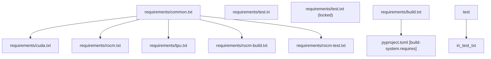
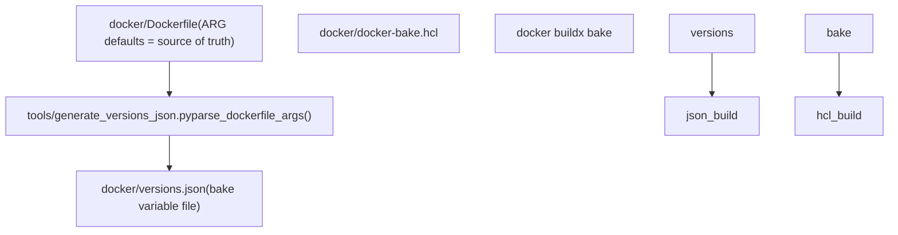

# Dependency Management

Relevant source files

-   [.pre-commit-config.yaml](https://github.com/vllm-project/vllm/blob/7cc302dd/.pre-commit-config.yaml)
-   [docker/Dockerfile](https://github.com/vllm-project/vllm/blob/7cc302dd/docker/Dockerfile)
-   [docker/Dockerfile.nightly\_torch](https://github.com/vllm-project/vllm/blob/7cc302dd/docker/Dockerfile.nightly_torch)
-   [docker/Dockerfile.rocm](https://github.com/vllm-project/vllm/blob/7cc302dd/docker/Dockerfile.rocm)
-   [docker/Dockerfile.rocm\_base](https://github.com/vllm-project/vllm/blob/7cc302dd/docker/Dockerfile.rocm_base)
-   [docker/docker-bake.hcl](https://github.com/vllm-project/vllm/blob/7cc302dd/docker/docker-bake.hcl)
-   [docker/versions.json](https://github.com/vllm-project/vllm/blob/7cc302dd/docker/versions.json)
-   [docs/assets/contributing/dockerfile-stages-dependency.png](https://github.com/vllm-project/vllm/blob/7cc302dd/docs/assets/contributing/dockerfile-stages-dependency.png)
-   [docs/models/extensions/runai\_model\_streamer.md](https://github.com/vllm-project/vllm/blob/7cc302dd/docs/models/extensions/runai_model_streamer.md?plain=1)
-   [pyproject.toml](https://github.com/vllm-project/vllm/blob/7cc302dd/pyproject.toml)
-   [requirements/build.txt](https://github.com/vllm-project/vllm/blob/7cc302dd/requirements/build.txt)
-   [requirements/common.txt](https://github.com/vllm-project/vllm/blob/7cc302dd/requirements/common.txt)
-   [requirements/cuda.txt](https://github.com/vllm-project/vllm/blob/7cc302dd/requirements/cuda.txt)
-   [requirements/nightly\_torch\_test.txt](https://github.com/vllm-project/vllm/blob/7cc302dd/requirements/nightly_torch_test.txt)
-   [requirements/rocm-build.txt](https://github.com/vllm-project/vllm/blob/7cc302dd/requirements/rocm-build.txt)
-   [requirements/rocm-test.in](https://github.com/vllm-project/vllm/blob/7cc302dd/requirements/rocm-test.in)
-   [requirements/rocm-test.txt](https://github.com/vllm-project/vllm/blob/7cc302dd/requirements/rocm-test.txt)
-   [requirements/rocm.txt](https://github.com/vllm-project/vllm/blob/7cc302dd/requirements/rocm.txt)
-   [requirements/test.in](https://github.com/vllm-project/vllm/blob/7cc302dd/requirements/test.in)
-   [requirements/test.txt](https://github.com/vllm-project/vllm/blob/7cc302dd/requirements/test.txt)
-   [setup.py](https://github.com/vllm-project/vllm/blob/7cc302dd/setup.py)
-   [tests/model\_executor/model\_loader/runai\_streamer\_loader/test\_runai\_utils.py](https://github.com/vllm-project/vllm/blob/7cc302dd/tests/model_executor/model_loader/runai_streamer_loader/test_runai_utils.py)
-   [tests/tools/\_\_init\_\_.py](https://github.com/vllm-project/vllm/blob/7cc302dd/tests/tools/__init__.py)
-   [tools/generate\_versions\_json.py](https://github.com/vllm-project/vllm/blob/7cc302dd/tools/generate_versions_json.py)
-   [tools/install\_deepgemm.sh](https://github.com/vllm-project/vllm/blob/7cc302dd/tools/install_deepgemm.sh)
-   [use\_existing\_torch.py](https://github.com/vllm-project/vllm/blob/7cc302dd/use_existing_torch.py)
-   [vllm/transformers\_utils/runai\_utils.py](https://github.com/vllm-project/vllm/blob/7cc302dd/vllm/transformers_utils/runai_utils.py)

This page documents how vLLM's Python package dependencies are declared, organized, tracked, and installed. It covers the `requirements/` directory structure, version pinning for Docker builds, the `generate_versions_json.py` tool, and the `use_existing_torch.py` helper for nightly PyTorch builds.

For how dependencies are consumed during Docker image construction, see [docker/Dockerfile1-122](https://github.com/vllm-project/vllm/blob/7cc302dd/docker/Dockerfile#L1-L122) For the CMake build system and C extension dependencies, see [setup.py82-200](https://github.com/vllm-project/vllm/blob/7cc302dd/setup.py#L82-L200) For ROCm-specific build setup, see [docker/Dockerfile.rocm1-115](https://github.com/vllm-project/vllm/blob/7cc302dd/docker/Dockerfile.rocm#L1-L115)

---

## Requirements Files Overview

All Python dependency declarations live in the `requirements/` directory. The files split dependencies by purpose (runtime, build, test) and by platform (CUDA, ROCm, TPU).

| File | Purpose | Locked? |
| --- | --- | --- |
| `requirements/common.txt` | Core runtime dependencies, all platforms | No |
| `requirements/cuda.txt` | CUDA runtime deps; includes `common.txt` | No |
| `requirements/rocm.txt` | ROCm runtime deps; includes `common.txt` | No |
| `requirements/tpu.txt` | TPU runtime deps; includes `common.txt` | No |
| `requirements/build.txt` | Build-time deps (cmake, setuptools, torch) | No |
| `requirements/rocm-build.txt` | ROCm build deps; includes `common.txt` | No |
| `requirements/test.in` | Test dep declarations (human-edited) | No |
| `requirements/test.txt` | Fully-locked test deps (auto-generated) | Yes |
| `requirements/rocm-test.txt` | ROCm test deps; includes `common.txt` | No |
| `requirements/nightly_torch_test.txt` | Test deps for nightly PyTorch builds | No |

Sources: [requirements/common.txt1-58](https://github.com/vllm-project/vllm/blob/7cc302dd/requirements/common.txt#L1-L58) [requirements/cuda.txt1-20](https://github.com/vllm-project/vllm/blob/7cc302dd/requirements/cuda.txt#L1-L20) [requirements/rocm.txt1-2](https://github.com/vllm-project/vllm/blob/7cc302dd/requirements/rocm.txt#L1-L2) [requirements/test.in1-79](https://github.com/vllm-project/vllm/blob/7cc302dd/requirements/test.in#L1-L79) [requirements/test.txt1-5](https://github.com/vllm-project/vllm/blob/7cc302dd/requirements/test.txt#L1-L5) [requirements/rocm-test.txt1-115](https://github.com/vllm-project/vllm/blob/7cc302dd/requirements/rocm-test.txt#L1-L115) [requirements/nightly\_torch\_test.txt1-49](https://github.com/vllm-project/vllm/blob/7cc302dd/requirements/nightly_torch_test.txt#L1-L49) [requirements/build.txt1-15](https://github.com/vllm-project/vllm/blob/7cc302dd/requirements/build.txt#L1-L15)

---

## File Hierarchy

The following diagram shows the include relationships between requirements files and how they map to the files on disk.

**Requirements File Include Graph**


Sources: [requirements/cuda.txt1-2](https://github.com/vllm-project/vllm/blob/7cc302dd/requirements/cuda.txt#L1-L2) [requirements/rocm.txt1-2](https://github.com/vllm-project/vllm/blob/7cc302dd/requirements/rocm.txt#L1-L2) [requirements/rocm-test.txt1-2](https://github.com/vllm-project/vllm/blob/7cc302dd/requirements/rocm-test.txt#L1-L2) [requirements/test.txt1-3](https://github.com/vllm-project/vllm/blob/7cc302dd/requirements/test.txt#L1-L3) [requirements/build.txt1-3](https://github.com/vllm-project/vllm/blob/7cc302dd/requirements/build.txt#L1-L3) [pyproject.toml1-14](https://github.com/vllm-project/vllm/blob/7cc302dd/pyproject.toml#L1-L14)

---

## Core Runtime Dependencies (`common.txt`)

`requirements/common.txt` lists packages required on every platform. Notable categories:

| Category | Key Packages |
| --- | --- |
| Tokenization | `transformers >= 4.56.0, < 5`, `tokenizers >= 0.21.1`, `sentencepiece`, `tiktoken >= 0.6.0` |
| Serving | `fastapi[standard] >= 0.115.0`, `openai >= 2.0.0`, `aiohttp >= 3.13.3`, `pydantic >= 2.12.0` |
| Observability | `prometheus_client >= 0.18.0`, `opentelemetry-sdk >= 1.27.0`, `python-json-logger` |
| Structured output | `xgrammar >= 0.1.32`, `outlines_core == 0.2.11`, `lm-format-enforcer == 0.11.3`, `llguidance >= 1.3.0` |
| Quantization | `compressed-tensors == 0.14.0.1`, `gguf >= 0.17.0` |
| Communication | `pyzmq >= 25.0.0`, `msgspec`, `grpcio`, `mcp` |
| Multimodal | `pillow`, `mistral_common[image] >= 1.10.0`, `opencv-python-headless >= 4.13.0`, `einops` |
| Build tooling | `ninja`, `setuptools >= 77.0.3, < 81.0.0` |

Sources: [requirements/common.txt1-58](https://github.com/vllm-project/vllm/blob/7cc302dd/requirements/common.txt#L1-L58)

---

## Platform-Specific Dependencies

### CUDA (`cuda.txt`)

`requirements/cuda.txt` adds the CUDA-specific stack on top of `common.txt`:

```
-r common.txt

numba == 0.61.2
torch==2.10.0
torchaudio==2.10.0
torchvision==0.25.0
flashinfer-python==0.6.6
nvidia-cudnn-frontend>=1.13.0,<1.19.0
nvidia-cutlass-dsl>=4.4.0.dev1
quack-kernels>=0.2.7
```
PyTorch is pinned to an exact version (`torch==2.10.0`). The corresponding CUDA wheel index is defined by `PYTORCH_CUDA_INDEX_BASE_URL` in the Dockerfile [docker/Dockerfile76](https://github.com/vllm-project/vllm/blob/7cc302dd/docker/Dockerfile#L76-L76)

Sources: [requirements/cuda.txt1-20](https://github.com/vllm-project/vllm/blob/7cc302dd/requirements/cuda.txt#L1-L20) [docker/Dockerfile152-164](https://github.com/vllm-project/vllm/blob/7cc302dd/docker/Dockerfile#L152-L164)

### ROCm (`rocm.txt`)

`requirements/rocm.txt` adds the AMD-specific stack. Unlike the CUDA file, `torch` is often built from source or installed from specialized ROCm repositories in the Docker layers [docker/Dockerfile.rocm\_base136-175](https://github.com/vllm-project/vllm/blob/7cc302dd/docker/Dockerfile.rocm_base#L136-L175)

Sources: [requirements/rocm.txt](https://github.com/vllm-project/vllm/blob/7cc302dd/requirements/rocm.txt) [docker/Dockerfile.rocm101-104](https://github.com/vllm-project/vllm/blob/7cc302dd/docker/Dockerfile.rocm#L101-L104)

---

## Build Dependencies

`requirements/build.txt` and `pyproject.toml` list packages required during the build step (`python setup.py bdist_wheel`). vLLM enforces that these are mirrored.

```
# pyproject.toml [build-system]requires = [    "cmake>=3.26.1",    "ninja",    "packaging>=24.2",    "setuptools>=77.0.3,<81.0.0",    "setuptools-scm>=8.0",    "torch == 2.10.0",    "wheel",    "jinja2",]
```
`setup.py` uses these dependencies to coordinate CMake builds [setup.py82-153](https://github.com/vllm-project/vllm/blob/7cc302dd/setup.py#L82-L153) and auto-detect target devices (CUDA vs ROCm) [setup.py53-61](https://github.com/vllm-project/vllm/blob/7cc302dd/setup.py#L53-L61)

Sources: [pyproject.toml1-14](https://github.com/vllm-project/vllm/blob/7cc302dd/pyproject.toml#L1-L14) [requirements/build.txt1-15](https://github.com/vllm-project/vllm/blob/7cc302dd/requirements/build.txt#L1-L15) [setup.py53-61](https://github.com/vllm-project/vllm/blob/7cc302dd/setup.py#L53-L61)

---

## Test Dependencies

### Source File: `test.in`

`requirements/test.in` is the human-maintained list of test requirements. It includes:

-   **ML evaluation**: `lm-eval[api]>=0.4.11`, `mteb[bm25s]>=2, <3` [requirements/test.in40-41](https://github.com/vllm-project/vllm/blob/7cc302dd/requirements/test.in#L40-L41)
-   **Multimodal**: `decord==0.6.0`, `terratorch >= 1.2.2`, `av` [requirements/test.in13-65](https://github.com/vllm-project/vllm/blob/7cc302dd/requirements/test.in#L13-L65)
-   **Quantization**: `bitsandbytes==0.49.2` [requirements/test.in46](https://github.com/vllm-project/vllm/blob/7cc302dd/requirements/test.in#L46-L46)
-   **Infrastructure**: `ray[cgraph,default]>=2.48.0`, `tensorizer==2.10.1` [requirements/test.in3-23](https://github.com/vllm-project/vllm/blob/7cc302dd/requirements/test.in#L3-L23)

### Locked File: `test.txt`

`requirements/test.txt` is generated from `test.in` by `uv pip compile`. The generation command used is: `uv pip compile requirements/test.in -o requirements/test.txt --index-strategy unsafe-best-match --torch-backend cu129 --python-platform x86_64-manylinux_2_28 --python-version 3.12` [requirements/test.txt1-2](https://github.com/vllm-project/vllm/blob/7cc302dd/requirements/test.txt#L1-L2)

---

## Version Tracking: `docker/versions.json`

The `docker/versions.json` file is the authoritative machine-readable source of pinned versions used in Docker builds.

**Version tracking flow diagram:**


Key versions currently tracked:

-   `CUDA_VERSION`: `12.9.1` [docker/Dockerfile25](https://github.com/vllm-project/vllm/blob/7cc302dd/docker/Dockerfile#L25-L25)
-   `PYTHON_VERSION`: `3.12` [docker/Dockerfile26](https://github.com/vllm-project/vllm/blob/7cc302dd/docker/Dockerfile#L26-L26)

Sources: [docker/Dockerfile9-26](https://github.com/vllm-project/vllm/blob/7cc302dd/docker/Dockerfile#L9-L26) [tools/generate\_versions\_json.py1-20](https://github.com/vllm-project/vllm/blob/7cc302dd/tools/generate_versions_json.py#L1-L20)

---

## Nightly PyTorch Handling: `use_existing_torch.py`

When building against nightly PyTorch (`PYTORCH_NIGHTLY=1`), version-pinned lines in requirements files conflict with the nightly wheel. `use_existing_torch.py` strips PyTorch-related lines from `requirements/*.txt` and `pyproject.toml` before running `uv pip install` [docker/Dockerfile161-172](https://github.com/vllm-project/vllm/blob/7cc302dd/docker/Dockerfile#L161-L172)

The Docker build stages invoke it as follows:

1.  Detect `PYTORCH_NIGHTLY=1`.
2.  Install torch nightly from the nightly index [docker/Dockerfile161-164](https://github.com/vllm-project/vllm/blob/7cc302dd/docker/Dockerfile#L161-L164)
3.  Run `use_existing_torch.py` to strip conflicting pins from local requirement files [docker/Dockerfile163](https://github.com/vllm-project/vllm/blob/7cc302dd/docker/Dockerfile#L163-L163)
4.  Install remaining requirements [docker/Dockerfile167](https://github.com/vllm-project/vllm/blob/7cc302dd/docker/Dockerfile#L167-L167)

Sources: [use\_existing\_torch.py1-50](https://github.com/vllm-project/vllm/blob/7cc302dd/use_existing_torch.py#L1-L50) [docker/Dockerfile152-172](https://github.com/vllm-project/vllm/blob/7cc302dd/docker/Dockerfile#L152-L172)

---

## Package Installer: `uv`

vLLM uses `uv` for high-performance dependency resolution. Key environment variables set in Docker [docker/Dockerfile129-136](https://github.com/vllm-project/vllm/blob/7cc302dd/docker/Dockerfile#L129-L136):

| Variable | Value | Effect |
| --- | --- | --- |
| `UV_HTTP_TIMEOUT` | `500` | Prevents timeout for large wheels |
| `UV_INDEX_STRATEGY` | `unsafe-best-match` | Optimizes index lookups |
| `UV_LINK_MODE` | `copy` | Prevents hardlink issues in Docker |

`pyproject.toml` also configures `uv` to disable build isolation for `torch` [pyproject.toml173-175](https://github.com/vllm-project/vllm/blob/7cc302dd/pyproject.toml#L173-L175)

Sources: [docker/Dockerfile120-136](https://github.com/vllm-project/vllm/blob/7cc302dd/docker/Dockerfile#L120-L136) [pyproject.toml173-175](https://github.com/vllm-project/vllm/blob/7cc302dd/pyproject.toml#L173-L175)
