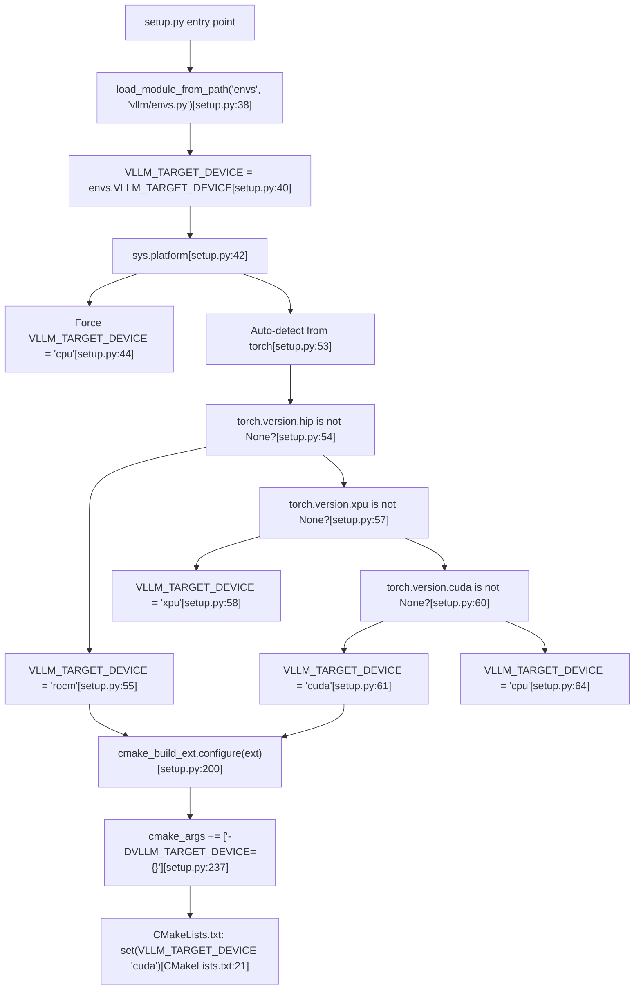
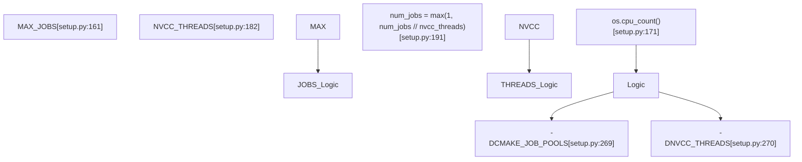

# Build Variants and Configuration

Relevant source files

-   [.pre-commit-config.yaml](https://github.com/vllm-project/vllm/blob/7cc302dd/.pre-commit-config.yaml)
-   [CMakeLists.txt](https://github.com/vllm-project/vllm/blob/7cc302dd/CMakeLists.txt)
-   [benchmarks/kernels/bench\_cp\_gather\_fp8.py](https://github.com/vllm-project/vllm/blob/7cc302dd/benchmarks/kernels/bench_cp_gather_fp8.py)
-   [cmake/utils.cmake](https://github.com/vllm-project/vllm/blob/7cc302dd/cmake/utils.cmake)
-   [csrc/cache.h](https://github.com/vllm-project/vllm/blob/7cc302dd/csrc/cache.h)
-   [csrc/cache\_kernels.cu](https://github.com/vllm-project/vllm/blob/7cc302dd/csrc/cache_kernels.cu)
-   [csrc/ops.h](https://github.com/vllm-project/vllm/blob/7cc302dd/csrc/ops.h)
-   [csrc/sampler.cu](https://github.com/vllm-project/vllm/blob/7cc302dd/csrc/sampler.cu)
-   [csrc/topk.cu](https://github.com/vllm-project/vllm/blob/7cc302dd/csrc/topk.cu)
-   [csrc/torch\_bindings.cpp](https://github.com/vllm-project/vllm/blob/7cc302dd/csrc/torch_bindings.cpp)
-   [docker/Dockerfile](https://github.com/vllm-project/vllm/blob/7cc302dd/docker/Dockerfile)
-   [docker/Dockerfile.nightly\_torch](https://github.com/vllm-project/vllm/blob/7cc302dd/docker/Dockerfile.nightly_torch)
-   [docker/Dockerfile.rocm](https://github.com/vllm-project/vllm/blob/7cc302dd/docker/Dockerfile.rocm)
-   [docker/Dockerfile.rocm\_base](https://github.com/vllm-project/vllm/blob/7cc302dd/docker/Dockerfile.rocm_base)
-   [docker/docker-bake.hcl](https://github.com/vllm-project/vllm/blob/7cc302dd/docker/docker-bake.hcl)
-   [docker/versions.json](https://github.com/vllm-project/vllm/blob/7cc302dd/docker/versions.json)
-   [docs/assets/contributing/dockerfile-stages-dependency.png](https://github.com/vllm-project/vllm/blob/7cc302dd/docs/assets/contributing/dockerfile-stages-dependency.png)
-   [docs/models/extensions/runai\_model\_streamer.md](https://github.com/vllm-project/vllm/blob/7cc302dd/docs/models/extensions/runai_model_streamer.md?plain=1)
-   [pyproject.toml](https://github.com/vllm-project/vllm/blob/7cc302dd/pyproject.toml)
-   [requirements/build.txt](https://github.com/vllm-project/vllm/blob/7cc302dd/requirements/build.txt)
-   [requirements/common.txt](https://github.com/vllm-project/vllm/blob/7cc302dd/requirements/common.txt)
-   [requirements/cuda.txt](https://github.com/vllm-project/vllm/blob/7cc302dd/requirements/cuda.txt)
-   [requirements/nightly\_torch\_test.txt](https://github.com/vllm-project/vllm/blob/7cc302dd/requirements/nightly_torch_test.txt)
-   [requirements/rocm-build.txt](https://github.com/vllm-project/vllm/blob/7cc302dd/requirements/rocm-build.txt)
-   [requirements/rocm-test.in](https://github.com/vllm-project/vllm/blob/7cc302dd/requirements/rocm-test.in)
-   [requirements/rocm-test.txt](https://github.com/vllm-project/vllm/blob/7cc302dd/requirements/rocm-test.txt)
-   [requirements/rocm.txt](https://github.com/vllm-project/vllm/blob/7cc302dd/requirements/rocm.txt)
-   [requirements/test.in](https://github.com/vllm-project/vllm/blob/7cc302dd/requirements/test.in)
-   [requirements/test.txt](https://github.com/vllm-project/vllm/blob/7cc302dd/requirements/test.txt)
-   [setup.py](https://github.com/vllm-project/vllm/blob/7cc302dd/setup.py)
-   [tests/kernels/attention/test\_cache.py](https://github.com/vllm-project/vllm/blob/7cc302dd/tests/kernels/attention/test_cache.py)
-   [tests/kernels/attention/test\_deepgemm\_attention.py](https://github.com/vllm-project/vllm/blob/7cc302dd/tests/kernels/attention/test_deepgemm_attention.py)
-   [tests/kernels/test\_apply\_repetition\_penalties.py](https://github.com/vllm-project/vllm/blob/7cc302dd/tests/kernels/test_apply_repetition_penalties.py)
-   [tests/kernels/test\_cp\_gather\_fp8.py](https://github.com/vllm-project/vllm/blob/7cc302dd/tests/kernels/test_cp_gather_fp8.py)
-   [tests/kernels/test\_top\_k\_per\_row.py](https://github.com/vllm-project/vllm/blob/7cc302dd/tests/kernels/test_top_k_per_row.py)
-   [tests/model\_executor/model\_loader/runai\_streamer\_loader/test\_runai\_utils.py](https://github.com/vllm-project/vllm/blob/7cc302dd/tests/model_executor/model_loader/runai_streamer_loader/test_runai_utils.py)
-   [tests/tools/\_\_init\_\_.py](https://github.com/vllm-project/vllm/blob/7cc302dd/tests/tools/__init__.py)
-   [tools/generate\_versions\_json.py](https://github.com/vllm-project/vllm/blob/7cc302dd/tools/generate_versions_json.py)
-   [tools/install\_deepgemm.sh](https://github.com/vllm-project/vllm/blob/7cc302dd/tools/install_deepgemm.sh)
-   [use\_existing\_torch.py](https://github.com/vllm-project/vllm/blob/7cc302dd/use_existing_torch.py)
-   [vllm/\_custom\_ops.py](https://github.com/vllm-project/vllm/blob/7cc302dd/vllm/_custom_ops.py)
-   [vllm/model\_executor/layers/sparse\_attn\_indexer.py](https://github.com/vllm-project/vllm/blob/7cc302dd/vllm/model_executor/layers/sparse_attn_indexer.py)
-   [vllm/transformers\_utils/runai\_utils.py](https://github.com/vllm-project/vllm/blob/7cc302dd/vllm/transformers_utils/runai_utils.py)
-   [vllm/v1/attention/backends/mla/indexer.py](https://github.com/vllm-project/vllm/blob/7cc302dd/vllm/v1/attention/backends/mla/indexer.py)

## Purpose and Scope

This document explains the different build variants of vLLM (CUDA, ROCm, CPU, XPU), nightly PyTorch support, and build-time configuration options. It covers how vLLM detects the target platform, variant-specific dependencies, and the build-time environment variables that control compilation behavior. For Docker build architecture, see [11.1 Docker Multi-Stage Build](https://github.com/vllm-project/vllm/blob/7cc302dd/11.1 Docker Multi-Stage Build) For dependency management details, see [11.2 Dependency Management](https://github.com/vllm-project/vllm/blob/7cc302dd/11.2 Dependency Management) For runtime kernel compilation, see [11.4 Runtime JIT Compilation](https://github.com/vllm-project/vllm/blob/7cc302dd/11.4 Runtime JIT Compilation)

---

## Build Variant Overview

vLLM supports four primary build variants, each optimized for different hardware platforms:

| Variant | Target Hardware | PyTorch Backend | Default Dependencies | Primary Distribution |
| --- | --- | --- | --- | --- |
| **CUDA** | NVIDIA GPUs | `torch==2.10.0` | FlashInfer, CUTLASS, DeepGEMM | PyPI, Docker Hub |
| **ROCm** | AMD GPUs | `torch==2.10.0` | AITER, Triton (ROCm) | AMD PyPI Index |
| **CPU** | x86/ARM CPUs | `torch+cpu` | OpenMP, minimal kernels | PyPI (VLLM\_TARGET\_DEVICE=cpu) |
| **XPU** | Intel GPUs | `torch+xpu` | XCCL, Intel extensions | Source build only |

The build variant is determined at compile time and cannot be changed without rebuilding. Platform auto-detection occurs in `setup.py` based on the installed PyTorch version and environment variables.

**Diagram: Build Variant Detection and Configuration Flow**


Sources: [setup.py38-64](https://github.com/vllm-project/vllm/blob/7cc302dd/setup.py#L38-L64) [setup.py200-240](https://github.com/vllm-project/vllm/blob/7cc302dd/setup.py#L200-L240) [CMakeLists.txt21-23](https://github.com/vllm-project/vllm/blob/7cc302dd/CMakeLists.txt#L21-L23)

---

## CUDA Build Variant (Default)

The CUDA variant is the primary build configuration, targeting NVIDIA GPUs with CUDA 12.9.1+.

### CUDA-Specific Dependencies

From [requirements/cuda.txt1-10](https://github.com/vllm-project/vllm/blob/7cc302dd/requirements/cuda.txt#L1-L10):

-   `torch==2.10.0`: The primary tensor library backend.
-   `numba == 0.61.2`: Required for N-gram speculative decoding.
-   `flashinfer-python`: Optimized attention kernels for NVIDIA.
-   `nvidia-cutlass-dsl`: Support for CUTLASS-based kernel generation.

### CUDA Architecture Support

The build system extracts target architectures from the environment or auto-detects them via CMake. Supported NVIDIA architectures are defined based on the CUDA compiler version.

| CUDA Version | Supported Architectures | Example GPUs |
| --- | --- | --- |
| \>= 13.0 | 7.5, 8.0, 8.6, 8.7, 8.9, 9.0, 10.0, 11.0, 12.0 | Blackwell (B100/B200) |
| \>= 12.8 | 7.0, 7.2, 7.5, 8.0, 8.6, 8.7, 8.9, 9.0, 10.0, 10.1, 12.0 | Hopper, Blackwell |
| < 12.8 | 7.0, 7.2, 7.5, 8.0, 8.6, 8.7, 8.9, 9.0 | Volta, Ampere, Ada |

Sources: [CMakeLists.txt95-103](https://github.com/vllm-project/vllm/blob/7cc302dd/CMakeLists.txt#L95-L103) [requirements/cuda.txt1-10](https://github.com/vllm-project/vllm/blob/7cc302dd/requirements/cuda.txt#L1-L10) [pyproject.toml9-12](https://github.com/vllm-project/vllm/blob/7cc302dd/pyproject.toml#L9-L12)

---

## ROCm Build Variant

The ROCm variant targets AMD GPUs (CDNA and RDNA architectures).

### ROCm Architecture Support

Supported AMD GPU architectures are explicitly listed in [CMakeLists.txt40](https://github.com/vllm-project/vllm/blob/7cc302dd/CMakeLists.txt#L40-L40): `gfx906;gfx908;gfx90a;gfx942;gfx950;gfx1030;gfx1100;gfx1101;gfx1150;gfx1151;gfx1152;gfx1153;gfx1200;gfx1201`.

### ROCm-Specific Dependencies

ROCm builds use a specialized set of requirements to ensure compatibility with the ROCm software stack.

From [requirements/rocm.txt1-10](https://github.com/vllm-project/vllm/blob/7cc302dd/requirements/rocm.txt#L1-L10):

-   `conch-triton-kernels`: AMD-optimized Triton kernels.
-   `amd-quark`: Quark quantization for AMD.
-   `aiter`: AMD optimized kernels for various operations.

### Build-Time Kernel Registration

ROCm-specific kernels are registered in the torch extension via specialized bindings. For example, `paged_attention_rocm` is defined to handle AMD's MFMA (Matrix Fused Multiply-Add) units and specific FP8 MFMA support.

Sources: [CMakeLists.txt40](https://github.com/vllm-project/vllm/blob/7cc302dd/CMakeLists.txt#L40-L40) [vllm/\_custom\_ops.py202-245](https://github.com/vllm-project/vllm/blob/7cc302dd/vllm/_custom_ops.py#L202-L245) [requirements/rocm.txt1-10](https://github.com/vllm-project/vllm/blob/7cc302dd/requirements/rocm.txt#L1-L10)

---

## Nightly PyTorch Build Support

vLLM provides a mechanism to build against PyTorch nightly versions, which is useful for testing upcoming features or new hardware support.

### Version Management

The Dockerfile uses `PYTORCH_NIGHTLY` to toggle between stable and nightly indexes.

```
# Example logic in Dockerfile:166-168if [ "${PYTORCH_NIGHTLY}" = "1" ]; then \    # Logic to install pre-release torch from nightly indexfi
```
The `use_existing_torch.py` script is used during these builds to strip version constraints from `requirements/*.txt` files, preventing conflicts with the already-installed nightly version by replacing them with the current environment's version.

Sources: [docker/Dockerfile157-170](https://github.com/vllm-project/vllm/blob/7cc302dd/docker/Dockerfile#L157-L170) [use\_existing\_torch.py1-20](https://github.com/vllm-project/vllm/blob/7cc302dd/use_existing_torch.py#L1-L20) [requirements/nightly\_torch\_test.txt1-30](https://github.com/vllm-project/vllm/blob/7cc302dd/requirements/nightly_torch_test.txt#L1-L30)

---

## Build-Time Configuration Options

### Parallelism and Resource Control

The build system calculates the number of parallel jobs to avoid system overload during heavy template instantiation.

**Diagram: Parallelism Calculation Logic**


### Compiler Caching

vLLM supports both `ccache` and `sccache` to speed up subsequent builds. The build system automatically detects these tools in the path via `which()`.

From [setup.py67-75](https://github.com/vllm-project/vllm/blob/7cc302dd/setup.py#L67-L75):

-   `is_sccache_available()` checks for the `sccache` binary and respects `VLLM_DISABLE_SCCACHE`.
-   `is_ccache_available()` checks for the `ccache` binary.

### FetchContent Cache

To avoid re-downloading dependencies like CUTLASS on every build, vLLM overrides the `FETCHCONTENT_BASE_DIR` to a local `.deps` folder within the build directory.

Sources: [setup.py67-75](https://github.com/vllm-project/vllm/blob/7cc302dd/setup.py#L67-L75) [setup.py158-195](https://github.com/vllm-project/vllm/blob/7cc302dd/setup.py#L158-L195) [setup.py250-280](https://github.com/vllm-project/vllm/blob/7cc302dd/setup.py#L250-L280) [CMakeLists.txt30-31](https://github.com/vllm-project/vllm/blob/7cc302dd/CMakeLists.txt#L30-L31)

---

## Platform-Specific Attention Implementations

The build system handles the compilation of different attention backends through C++ and Python bindings.

| Feature | CUDA Implementation | ROCm Implementation |
| --- | --- | --- |
| PagedAttention V1 | `paged_attention_v1` [csrc/ops.h33](https://github.com/vllm-project/vllm/blob/7cc302dd/csrc/ops.h#L33-L33) | `paged_attention` [vllm/\_custom\_ops.py224](https://github.com/vllm-project/vllm/blob/7cc302dd/vllm/_custom_ops.py#L224-L224) |
| PagedAttention V2 | `paged_attention_v2` [csrc/ops.h44](https://github.com/vllm-project/vllm/blob/7cc302dd/csrc/ops.h#L44-L44) | Supported via `mfma_type` [vllm/\_custom\_ops.py222](https://github.com/vllm-project/vllm/blob/7cc302dd/vllm/_custom_ops.py#L222-L222) |
| FP4 Quantization | `scaled_fp4_quant` [vllm/\_custom\_ops.py83](https://github.com/vllm-project/vllm/blob/7cc302dd/vllm/_custom_ops.py#L83-L83) | N/A (NVIDIA specific) |
| RMS Norm | `rms_norm` [csrc/ops.h89](https://github.com/vllm-project/vllm/blob/7cc302dd/csrc/ops.h#L89-L89) | ROCm optimized via AITER |

Sources: [csrc/ops.h33-54](https://github.com/vllm-project/vllm/blob/7cc302dd/csrc/ops.h#L33-L54) [vllm/\_custom\_ops.py83-104](https://github.com/vllm-project/vllm/blob/7cc302dd/vllm/_custom_ops.py#L83-L104) [vllm/\_custom\_ops.py202-245](https://github.com/vllm-project/vllm/blob/7cc302dd/vllm/_custom_ops.py#L202-L245) [csrc/torch\_bindings.cpp40-64](https://github.com/vllm-project/vllm/blob/7cc302dd/csrc/torch_bindings.cpp#L40-L64)
