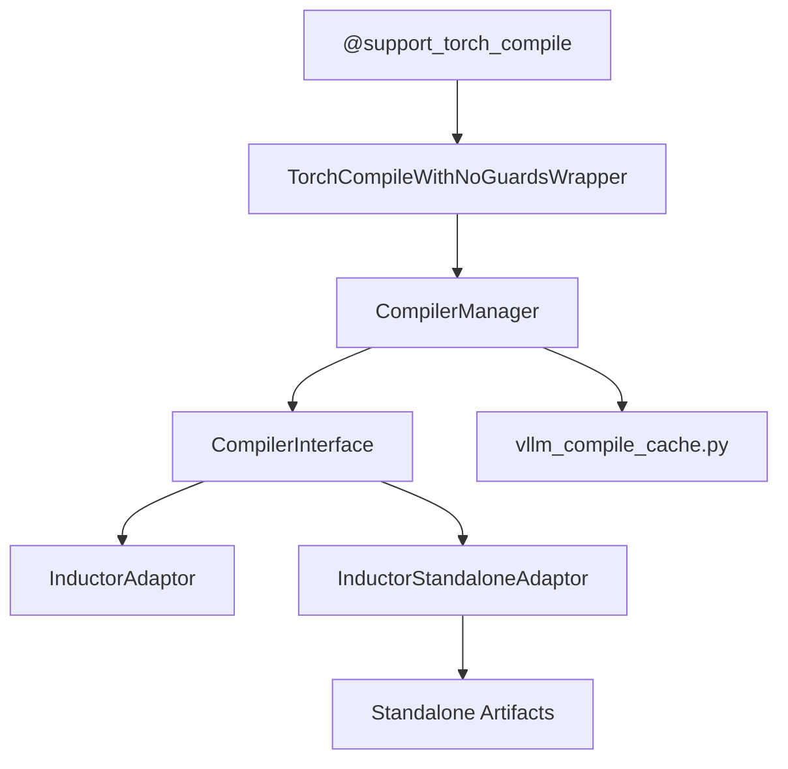
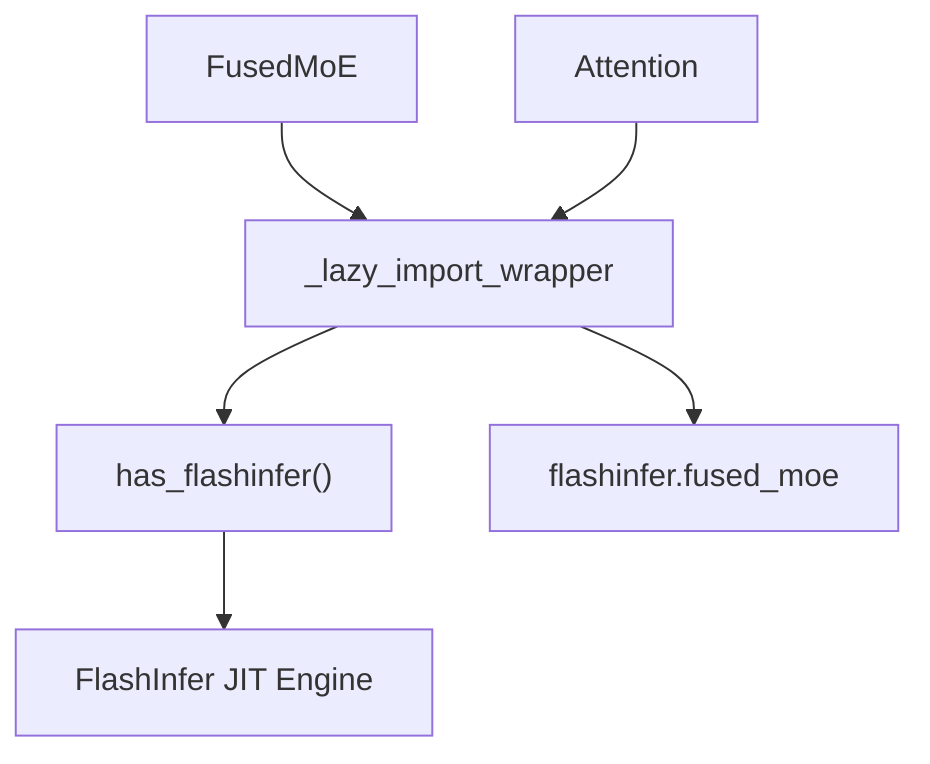
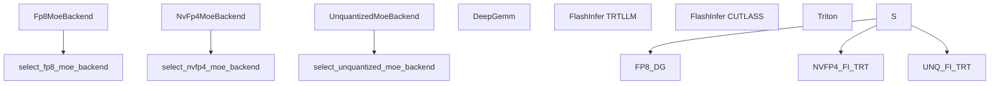

# Runtime JIT Compilation

Relevant source files

-   [.buildkite/test\_areas/weight\_loading.yaml](https://github.com/vllm-project/vllm/blob/7cc302dd/.buildkite/test_areas/weight_loading.yaml)
-   [tests/evals/gsm8k/configs/Qwen3-Next-FP8-EP2.yaml](https://github.com/vllm-project/vllm/blob/7cc302dd/tests/evals/gsm8k/configs/Qwen3-Next-FP8-EP2.yaml)
-   [tests/evals/gsm8k/configs/moe-refactor-dp-ep/Qwen3-30B-A3B-BF16-triton.yaml](https://github.com/vllm-project/vllm/blob/7cc302dd/tests/evals/gsm8k/configs/moe-refactor-dp-ep/Qwen3-30B-A3B-BF16-triton.yaml)
-   [tests/evals/gsm8k/configs/moe-refactor-dp-ep/Qwen3-30B-A3B-NvFp4-CT-fi-cutedsl-deepep-ll.yaml](https://github.com/vllm-project/vllm/blob/7cc302dd/tests/evals/gsm8k/configs/moe-refactor-dp-ep/Qwen3-30B-A3B-NvFp4-CT-fi-cutedsl-deepep-ll.yaml)
-   [tests/evals/gsm8k/configs/moe-refactor-dp-ep/Qwen3-30B-A3B-NvFp4-CT-fi-cutlass.yaml](https://github.com/vllm-project/vllm/blob/7cc302dd/tests/evals/gsm8k/configs/moe-refactor-dp-ep/Qwen3-30B-A3B-NvFp4-CT-fi-cutlass.yaml)
-   [tests/evals/gsm8k/configs/moe-refactor-dp-ep/Qwen3-30B-A3B-NvFp4-ModelOpt-fi-cutedsl-deepep-ll.yaml](https://github.com/vllm-project/vllm/blob/7cc302dd/tests/evals/gsm8k/configs/moe-refactor-dp-ep/Qwen3-30B-A3B-NvFp4-ModelOpt-fi-cutedsl-deepep-ll.yaml)
-   [tests/evals/gsm8k/configs/moe-refactor-dp-ep/Qwen3-30B-A3B-NvFp4-ModelOpt-fi-cutlass.yaml](https://github.com/vllm-project/vllm/blob/7cc302dd/tests/evals/gsm8k/configs/moe-refactor-dp-ep/Qwen3-30B-A3B-NvFp4-ModelOpt-fi-cutlass.yaml)
-   [tests/evals/gsm8k/configs/moe-refactor-dp-ep/Qwen3-30B-A3B-NvFp4-ModelOpt-fi-trtllm.yaml](https://github.com/vllm-project/vllm/blob/7cc302dd/tests/evals/gsm8k/configs/moe-refactor-dp-ep/Qwen3-30B-A3B-NvFp4-ModelOpt-fi-trtllm.yaml)
-   [tests/evals/gsm8k/configs/moe-refactor-dp-ep/config-b200.txt](https://github.com/vllm-project/vllm/blob/7cc302dd/tests/evals/gsm8k/configs/moe-refactor-dp-ep/config-b200.txt)
-   [tests/evals/gsm8k/configs/moe-refactor/Llama-4-Scout-BF16-fi-cutlass.yaml](https://github.com/vllm-project/vllm/blob/7cc302dd/tests/evals/gsm8k/configs/moe-refactor/Llama-4-Scout-BF16-fi-cutlass.yaml)
-   [tests/evals/gsm8k/configs/moe-refactor/Llama-4-Scout-BF16-triton.yaml](https://github.com/vllm-project/vllm/blob/7cc302dd/tests/evals/gsm8k/configs/moe-refactor/Llama-4-Scout-BF16-triton.yaml)
-   [tests/evals/gsm8k/configs/moe-refactor/Mixtral-8x7B-BF16-fi-cutlass.yaml](https://github.com/vllm-project/vllm/blob/7cc302dd/tests/evals/gsm8k/configs/moe-refactor/Mixtral-8x7B-BF16-fi-cutlass.yaml)
-   [tests/evals/gsm8k/configs/moe-refactor/Mixtral-8x7B-BF16-triton.yaml](https://github.com/vllm-project/vllm/blob/7cc302dd/tests/evals/gsm8k/configs/moe-refactor/Mixtral-8x7B-BF16-triton.yaml)
-   [tests/evals/gsm8k/configs/moe-refactor/Qwen3-30B-A3B-BF16-fi-cutlass.yaml](https://github.com/vllm-project/vllm/blob/7cc302dd/tests/evals/gsm8k/configs/moe-refactor/Qwen3-30B-A3B-BF16-fi-cutlass.yaml)
-   [tests/evals/gsm8k/configs/moe-refactor/Qwen3-30B-A3B-BF16-triton.yaml](https://github.com/vllm-project/vllm/blob/7cc302dd/tests/evals/gsm8k/configs/moe-refactor/Qwen3-30B-A3B-BF16-triton.yaml)
-   [tests/evals/gsm8k/configs/moe-refactor/config-h100.txt](https://github.com/vllm-project/vllm/blob/7cc302dd/tests/evals/gsm8k/configs/moe-refactor/config-h100.txt)
-   [tests/evals/gsm8k/configs/moe-refactor/config-test.txt](https://github.com/vllm-project/vllm/blob/7cc302dd/tests/evals/gsm8k/configs/moe-refactor/config-test.txt)
-   [tests/kernels/moe/test\_cutedsl\_moe.py](https://github.com/vllm-project/vllm/blob/7cc302dd/tests/kernels/moe/test_cutedsl_moe.py)
-   [tests/quantization/test\_blackwell\_moe.py](https://github.com/vllm-project/vllm/blob/7cc302dd/tests/quantization/test_blackwell_moe.py)
-   [vllm/model\_executor/layers/fused\_moe/experts/flashinfer\_cutedsl\_moe.py](https://github.com/vllm-project/vllm/blob/7cc302dd/vllm/model_executor/layers/fused_moe/experts/flashinfer_cutedsl_moe.py)
-   [vllm/model\_executor/layers/fused\_moe/experts/trtllm\_fp8\_moe.py](https://github.com/vllm-project/vllm/blob/7cc302dd/vllm/model_executor/layers/fused_moe/experts/trtllm_fp8_moe.py)
-   [vllm/model\_executor/layers/fused\_moe/experts/trtllm\_nvfp4\_moe.py](https://github.com/vllm-project/vllm/blob/7cc302dd/vllm/model_executor/layers/fused_moe/experts/trtllm_nvfp4_moe.py)
-   [vllm/model\_executor/layers/fused\_moe/oracle/fp8.py](https://github.com/vllm-project/vllm/blob/7cc302dd/vllm/model_executor/layers/fused_moe/oracle/fp8.py)
-   [vllm/model\_executor/layers/fused\_moe/oracle/nvfp4.py](https://github.com/vllm-project/vllm/blob/7cc302dd/vllm/model_executor/layers/fused_moe/oracle/nvfp4.py)
-   [vllm/model\_executor/layers/fused\_moe/oracle/unquantized.py](https://github.com/vllm-project/vllm/blob/7cc302dd/vllm/model_executor/layers/fused_moe/oracle/unquantized.py)
-   [vllm/model\_executor/layers/quantization/utils/flashinfer\_fp4\_moe.py](https://github.com/vllm-project/vllm/blob/7cc302dd/vllm/model_executor/layers/quantization/utils/flashinfer_fp4_moe.py)
-   [vllm/model\_executor/warmup/deep\_gemm\_warmup.py](https://github.com/vllm-project/vllm/blob/7cc302dd/vllm/model_executor/warmup/deep_gemm_warmup.py)
-   [vllm/model\_executor/warmup/kernel\_warmup.py](https://github.com/vllm-project/vllm/blob/7cc302dd/vllm/model_executor/warmup/kernel_warmup.py)
-   [vllm/utils/flashinfer.py](https://github.com/vllm-project/vllm/blob/7cc302dd/vllm/utils/flashinfer.py)

## Purpose and Scope

This document covers the runtime Just-In-Time (JIT) compilation infrastructure in vLLM. It details the integration of `torch.compile`, FlashInfer's JIT kernel generation, DeepGemm compilation, and the specialized MoE kernel dispatch mechanisms. These components allow vLLM to generate and optimize GPU kernels at runtime based on specific model architectures, quantization schemes, and hardware capabilities.

For information about build-time compilation of vLLM's C++/CUDA extensions, see [Build Variants and Configuration](/vllm-project/vllm/11.3-build-variants-and-configuration).

---

## Overview

vLLM employs runtime JIT compilation to bridge the gap between generic model definitions and hardware-optimal execution. This is primarily achieved through:

-   **Torch Compile Integration**: Using `torch.compile` with custom backends (Inductor) to optimize model forward passes.
-   **FlashInfer JIT**: Dynamic generation of attention and MoE kernels tailored to specific head dimensions and data types, particularly for Blackwell (SM 10.0) and Hopper (SM 9.0) architectures.
-   **DeepGemm**: High-performance GEMM kernels for MoE models that support JIT warmup and specialized FP8/FP4 dispatch.
-   **Modular Kernels**: A framework for composing MoE kernels from specialized building blocks at runtime.

**Sources:** [vllm/utils/flashinfer.py35-62](https://github.com/vllm-project/vllm/blob/7cc302dd/vllm/utils/flashinfer.py#L35-L62) [vllm/model\_executor/warmup/kernel\_warmup.py27-46](https://github.com/vllm-project/vllm/blob/7cc302dd/vllm/model_executor/warmup/kernel_warmup.py#L27-L46) [vllm/model\_executor/warmup/deep\_gemm\_warmup.py3-7](https://github.com/vllm-project/vllm/blob/7cc302dd/vllm/model_executor/warmup/deep_gemm_warmup.py#L3-L7)

---

## Torch Compile and Backend Management

vLLM provides a structured way to apply `torch.compile` to model layers using the `@support_torch_compile` decorator. This infrastructure manages the compilation lifecycle, including caching and graph partitioning.

### Compiler Architecture

The `CompilerManager` handles the orchestration of the compilation process, including cache initialization and artifact loading.

**Key Entities:**

-   `CompilerManager`: Manages the compilation cache and selects the appropriate compiler adaptor.
-   `InductorStandaloneAdaptor`: A specialized adaptor that uses `torch._inductor.standalone_compile` to generate persistent artifacts.
-   `support_torch_compile`: A decorator that marks `nn.Module` forward methods for compilation, handling dynamic dimensions.

**Sources:** [vllm/model\_executor/warmup/kernel\_warmup.py39-46](https://github.com/vllm-project/vllm/blob/7cc302dd/vllm/model_executor/warmup/kernel_warmup.py#L39-L46) [vllm/model\_executor/layers/fused\_moe/oracle/unquantized.py90-111](https://github.com/vllm-project/vllm/blob/7cc302dd/vllm/model_executor/layers/fused_moe/oracle/unquantized.py#L90-L111)

---

## FlashInfer JIT and MoE Kernels

FlashInfer provides highly optimized kernels for attention and MoE. While many kernels are pre-compiled (CUBINs), FlashInfer also supports JIT compilation for specialized configurations, especially for newer hardware like Blackwell.

### FlashInfer Integration Flow

vLLM uses lazy import wrappers to interface with FlashInfer, ensuring that CUDA is not initialized prematurely and that kernels are only loaded when needed.

**Implementation Details:**

-   `has_flashinfer()`: Checks for the `flashinfer` package and availability of `nvcc` if pre-compiled CUBINs are missing [vllm/utils/flashinfer.py47-62](https://github.com/vllm-project/vllm/blob/7cc302dd/vllm/utils/flashinfer.py#L47-L62)
-   `flashinfer_trtllm_fp8_block_scale_moe`: Dispatched for FP8 block-scaled MoE models [vllm/utils/flashinfer.py108-110](https://github.com/vllm-project/vllm/blob/7cc302dd/vllm/utils/flashinfer.py#L108-L110)
-   `prepare_nvfp4_moe_layer_for_fi_or_cutlass`: Prepares weights and scales specifically for FlashInfer or CUTLASS NVFP4 backends [vllm/model\_executor/layers/quantization/utils/flashinfer\_fp4\_moe.py192-213](https://github.com/vllm-project/vllm/blob/7cc302dd/vllm/model_executor/layers/quantization/utils/flashinfer_fp4_moe.py#L192-L213)
-   `flashinfer_autotune`: Benchmarks multiple implementations to store optimal configurations for the specific GPU [vllm/model\_executor/warmup/kernel\_warmup.py81-110](https://github.com/vllm-project/vllm/blob/7cc302dd/vllm/model_executor/warmup/kernel_warmup.py#L81-L110)

**Sources:** [vllm/utils/flashinfer.py83-133](https://github.com/vllm-project/vllm/blob/7cc302dd/vllm/utils/flashinfer.py#L83-L133) [vllm/model\_executor/warmup/kernel\_warmup.py81-110](https://github.com/vllm-project/vllm/blob/7cc302dd/vllm/model_executor/warmup/kernel_warmup.py#L81-L110) [vllm/model\_executor/layers/quantization/utils/flashinfer\_fp4\_moe.py192-213](https://github.com/vllm-project/vllm/blob/7cc302dd/vllm/model_executor/layers/quantization/utils/flashinfer_fp4_moe.py#L192-L213)

---

## DeepGemm and Specialized MoE Dispatch

DeepGemm is used for high-performance GEMM operations in MoE layers, particularly for FP8 and FP4 data types on NVIDIA Hopper/Blackwell.

### DeepGemm Logic and Warmup

DeepGemm kernels JIT-compile based on heuristics. vLLM performs a warmup phase to ensure all required kernels are compiled before serving requests.

| Function | Role |
| --- | --- |
| `deep_gemm_warmup` | Orchestrates the JIT compilation of all expected GEMM shapes [vllm/model\_executor/warmup/deep\_gemm\_warmup.py33-37](https://github.com/vllm-project/vllm/blob/7cc302dd/vllm/model_executor/warmup/deep_gemm_warmup.py#L33-L37) |
| `_generate_optimal_warmup_m_values` | Calculates M-dimension values (tokens) that trigger different wave patterns in DeepGemm [vllm/model\_executor/warmup/deep\_gemm\_warmup.py33-76](https://github.com/vllm-project/vllm/blob/7cc302dd/vllm/model_executor/warmup/deep_gemm_warmup.py#L33-L76) |
| `_fp8_linear_may_use_deep_gemm` | Validates if a linear layer's quantization and alignment are compatible with DeepGemm [vllm/model\_executor/warmup/deep\_gemm\_warmup.py129-152](https://github.com/vllm-project/vllm/blob/7cc302dd/vllm/model_executor/warmup/deep_gemm_warmup.py#L129-L152) |

### MoE Backend Selection

The selection of a JIT-compiled backend for MoE depends on the quantization scheme and hardware capability.

**Sources:** [vllm/model\_executor/layers/fused\_moe/oracle/fp8.py57-102](https://github.com/vllm-project/vllm/blob/7cc302dd/vllm/model_executor/layers/fused_moe/oracle/fp8.py#L57-L102) [vllm/model\_executor/layers/fused\_moe/oracle/nvfp4.py129-176](https://github.com/vllm-project/vllm/blob/7cc302dd/vllm/model_executor/layers/fused_moe/oracle/nvfp4.py#L129-L176) [vllm/model\_executor/layers/fused\_moe/oracle/unquantized.py71-112](https://github.com/vllm-project/vllm/blob/7cc302dd/vllm/model_executor/layers/fused_moe/oracle/unquantized.py#L71-L112)

---

## Modular Kernel Framework

vLLM implements a modular approach to MoE kernels where different parts of the kernel (routing, expert execution, activation) can be JIT-composed.

### FusedMoE Modular Dispatch

The `FusedMoEModularMethod` utilizes specialized expert classes that interface with JIT libraries:

-   **TRTLLM NVFP4 Experts**: `TrtLlmNvFp4ExpertsModular` invokes `flashinfer.fused_moe.trtllm_fp4_block_scale_routed_moe` [vllm/model\_executor/layers/fused\_moe/experts/trtllm\_nvfp4\_moe.py127-200](https://github.com/vllm-project/vllm/blob/7cc302dd/vllm/model_executor/layers/fused_moe/experts/trtllm_nvfp4_moe.py#L127-L200)
-   **FlashInfer CuteDSL**: `FlashInferCuteDSLExperts` uses FlashInfer's Cute DSL for grouped GEMM on NVFP4 [vllm/model\_executor/layers/fused\_moe/experts/flashinfer\_cutedsl\_moe.py34-51](https://github.com/vllm-project/vllm/blob/7cc302dd/vllm/model_executor/layers/fused_moe/experts/flashinfer_cutedsl_moe.py#L34-L51)
-   **Expert Alignment**: Kernels often require specific data layouts. For example, `prepare_static_weights_for_trtllm_fp4_moe` reshapes and shuffles weights to match the expected JIT kernel layout [vllm/model\_executor/layers/quantization/utils/flashinfer\_fp4\_moe.py63-189](https://github.com/vllm-project/vllm/blob/7cc302dd/vllm/model_executor/layers/quantization/utils/flashinfer_fp4_moe.py#L63-L189)

**Sources:** [vllm/model\_executor/layers/fused\_moe/experts/trtllm\_nvfp4\_moe.py127-200](https://github.com/vllm-project/vllm/blob/7cc302dd/vllm/model_executor/layers/fused_moe/experts/trtllm_nvfp4_moe.py#L127-L200) [vllm/model\_executor/layers/fused\_moe/experts/flashinfer\_cutedsl\_moe.py34-51](https://github.com/vllm-project/vllm/blob/7cc302dd/vllm/model_executor/layers/fused_moe/experts/flashinfer_cutedsl_moe.py#L34-L51) [vllm/model\_executor/layers/quantization/utils/flashinfer\_fp4\_moe.py63-189](https://github.com/vllm-project/vllm/blob/7cc302dd/vllm/model_executor/layers/quantization/utils/flashinfer_fp4_moe.py#L63-L189)

---

## Runtime Warmup and Autotuning

To avoid JIT latency during inference, vLLM executes a warmup phase in `kernel_warmup`.

1.  **DeepGemm Warmup**: Iterates through possible token counts (M) and expert configurations to trigger JIT compilation [vllm/model\_executor/warmup/deep\_gemm\_warmup.py184-199](https://github.com/vllm-project/vllm/blob/7cc302dd/vllm/model_executor/warmup/deep_gemm_warmup.py#L184-L199)
2.  **FlashInfer Autotune**: Runs a `_dummy_run` with the maximum number of batched tokens. FlashInfer records the performance of various implementation candidates (e.g., different tile sizes) and caches the best one [vllm/model\_executor/warmup/kernel\_warmup.py81-107](https://github.com/vllm-project/vllm/blob/7cc302dd/vllm/model_executor/warmup/kernel_warmup.py#L81-L107)
3.  **FlashInfer Attention Warmup**: Specifically warms up attention kernels with a mixed batch of prefill and decode tokens [vllm/model\_executor/warmup/kernel\_warmup.py48-78](https://github.com/vllm-project/vllm/blob/7cc302dd/vllm/model_executor/warmup/kernel_warmup.py#L48-L78)

**Sources:** [vllm/model\_executor/warmup/kernel\_warmup.py27-110](https://github.com/vllm-project/vllm/blob/7cc302dd/vllm/model_executor/warmup/kernel_warmup.py#L27-L110) [vllm/model\_executor/warmup/deep\_gemm\_warmup.py184-202](https://github.com/vllm-project/vllm/blob/7cc302dd/vllm/model_executor/warmup/deep_gemm_warmup.py#L184-L202)
