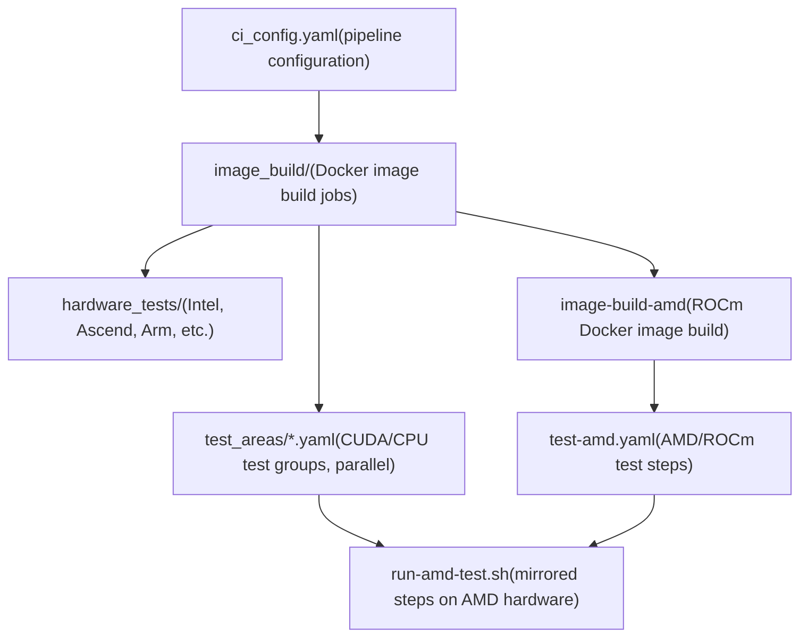
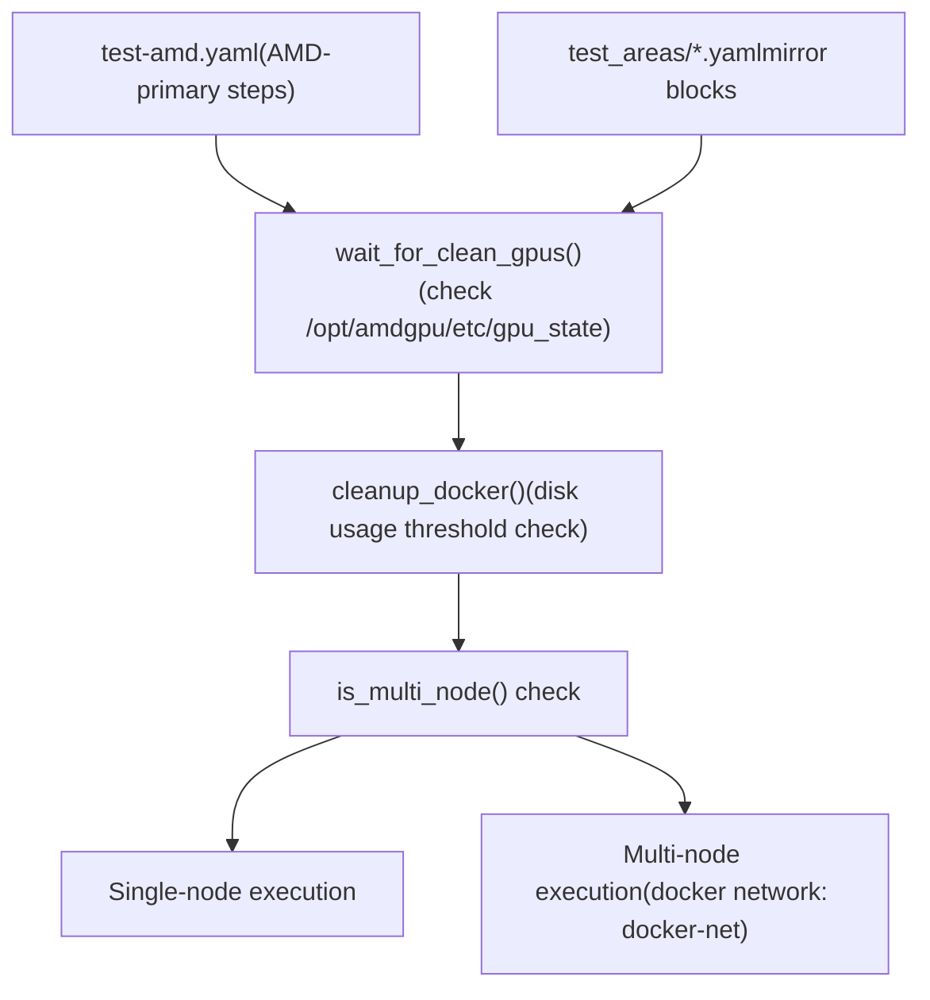
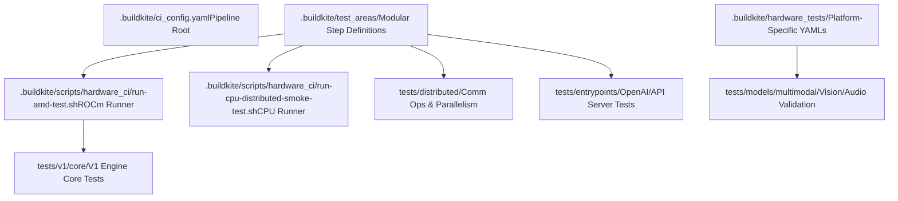

# Testing and CI/CD

Relevant source files

-   [.buildkite/hardware\_tests/amd.yaml](https://github.com/vllm-project/vllm/blob/7cc302dd/.buildkite/hardware_tests/amd.yaml)
-   [.buildkite/hardware\_tests/ascend\_npu.yaml](https://github.com/vllm-project/vllm/blob/7cc302dd/.buildkite/hardware_tests/ascend_npu.yaml)
-   [.buildkite/hardware\_tests/gh200.yaml](https://github.com/vllm-project/vllm/blob/7cc302dd/.buildkite/hardware_tests/gh200.yaml)
-   [.buildkite/hardware\_tests/intel.yaml](https://github.com/vllm-project/vllm/blob/7cc302dd/.buildkite/hardware_tests/intel.yaml)
-   [.buildkite/scripts/hardware\_ci/run-amd-test.sh](https://github.com/vllm-project/vllm/blob/7cc302dd/.buildkite/scripts/hardware_ci/run-amd-test.sh)
-   [.buildkite/scripts/hardware\_ci/run-cpu-distributed-smoke-test.sh](https://github.com/vllm-project/vllm/blob/7cc302dd/.buildkite/scripts/hardware_ci/run-cpu-distributed-smoke-test.sh)
-   [.buildkite/test-amd.yaml](https://github.com/vllm-project/vllm/blob/7cc302dd/.buildkite/test-amd.yaml)
-   [.buildkite/test-pipeline.yaml](https://github.com/vllm-project/vllm/blob/7cc302dd/.buildkite/test-pipeline.yaml)
-   [.buildkite/test\_areas/basic\_correctness.yaml](https://github.com/vllm-project/vllm/blob/7cc302dd/.buildkite/test_areas/basic_correctness.yaml)
-   [.buildkite/test\_areas/distributed.yaml](https://github.com/vllm-project/vllm/blob/7cc302dd/.buildkite/test_areas/distributed.yaml)
-   [.buildkite/test\_areas/entrypoints.yaml](https://github.com/vllm-project/vllm/blob/7cc302dd/.buildkite/test_areas/entrypoints.yaml)
-   [.buildkite/test\_areas/misc.yaml](https://github.com/vllm-project/vllm/blob/7cc302dd/.buildkite/test_areas/misc.yaml)
-   [.buildkite/test\_areas/models\_basic.yaml](https://github.com/vllm-project/vllm/blob/7cc302dd/.buildkite/test_areas/models_basic.yaml)
-   [.buildkite/test\_areas/models\_language.yaml](https://github.com/vllm-project/vllm/blob/7cc302dd/.buildkite/test_areas/models_language.yaml)
-   [.buildkite/test\_areas/models\_multimodal.yaml](https://github.com/vllm-project/vllm/blob/7cc302dd/.buildkite/test_areas/models_multimodal.yaml)
-   [.buildkite/test\_areas/plugins.yaml](https://github.com/vllm-project/vllm/blob/7cc302dd/.buildkite/test_areas/plugins.yaml)
-   [.buildkite/test\_areas/samplers.yaml](https://github.com/vllm-project/vllm/blob/7cc302dd/.buildkite/test_areas/samplers.yaml)
-   [.github/CODEOWNERS](https://github.com/vllm-project/vllm/blob/7cc302dd/.github/CODEOWNERS)
-   [.github/mergify.yml](https://github.com/vllm-project/vllm/blob/7cc302dd/.github/mergify.yml)
-   [AGENTS.md](https://github.com/vllm-project/vllm/blob/7cc302dd/AGENTS.md?plain=1)
-   [CLAUDE.md](https://github.com/vllm-project/vllm/blob/7cc302dd/CLAUDE.md?plain=1)
-   [docs/contributing/README.md](https://github.com/vllm-project/vllm/blob/7cc302dd/docs/contributing/README.md?plain=1)
-   [docs/contributing/editing-agent-instructions.md](https://github.com/vllm-project/vllm/blob/7cc302dd/docs/contributing/editing-agent-instructions.md?plain=1)
-   [docs/contributing/incremental\_build.md](https://github.com/vllm-project/vllm/blob/7cc302dd/docs/contributing/incremental_build.md?plain=1)
-   [docs/design/dbo.md](https://github.com/vllm-project/vllm/blob/7cc302dd/docs/design/dbo.md?plain=1)
-   [docs/governance/collaboration.md](https://github.com/vllm-project/vllm/blob/7cc302dd/docs/governance/collaboration.md?plain=1)
-   [docs/governance/committers.md](https://github.com/vllm-project/vllm/blob/7cc302dd/docs/governance/committers.md?plain=1)
-   [docs/governance/process.md](https://github.com/vllm-project/vllm/blob/7cc302dd/docs/governance/process.md?plain=1)
-   [examples/offline\_inference/data\_parallel.py](https://github.com/vllm-project/vllm/blob/7cc302dd/examples/offline_inference/data_parallel.py)
-   [requirements/lint.txt](https://github.com/vllm-project/vllm/blob/7cc302dd/requirements/lint.txt)
-   [tests/detokenizer/test\_disable\_detokenization.py](https://github.com/vllm-project/vllm/blob/7cc302dd/tests/detokenizer/test_disable_detokenization.py)
-   [tests/plugins\_tests/test\_terratorch\_io\_processor\_plugins.py](https://github.com/vllm-project/vllm/blob/7cc302dd/tests/plugins_tests/test_terratorch_io_processor_plugins.py)
-   [tests/v1/spec\_decode/\_\_init\_\_.py](https://github.com/vllm-project/vllm/blob/7cc302dd/tests/v1/spec_decode/__init__.py)
-   [tests/v1/spec\_decode/test\_acceptance\_length.py](https://github.com/vllm-project/vllm/blob/7cc302dd/tests/v1/spec_decode/test_acceptance_length.py)
-   [tools/generate\_cmake\_presets.py](https://github.com/vllm-project/vllm/blob/7cc302dd/tools/generate_cmake_presets.py)
-   [vllm/distributed/device\_communicators/xpu\_communicator.py](https://github.com/vllm-project/vllm/blob/7cc302dd/vllm/distributed/device_communicators/xpu_communicator.py)
-   [vllm/usage/usage\_lib.py](https://github.com/vllm-project/vllm/blob/7cc302dd/vllm/usage/usage_lib.py)

This page describes how vLLM is tested and how its continuous integration pipelines are structured. It covers the overall layout of the test infrastructure, the Buildkite CI pipeline organization, hardware-specific testing (including AMD/ROCm, Intel XPU, and TPU), and the model correctness verification framework.

For details on individual topics, see the child pages:

-   **Test Organization and Infrastructure** — directory layout, test categories, and fixtures: see [Test Organization and Infrastructure](/vllm-project/vllm/12.1-test-organization-and-infrastructure)
-   **Buildkite CI Pipelines** — pipeline generation, step configuration, and release pipeline: see [Buildkite CI Pipelines](/vllm-project/vllm/12.2-buildkite-ci-pipelines)
-   **Hardware-Specific Testing** — ROCm hardware setup, `run-amd-test.sh`, and multi-node configurations: see [Hardware-Specific Testing](/vllm-project/vllm/12.3-hardware-specific-testing)
-   **Model Correctness Validation** — model correctness tests, reference comparisons, and acceptance criteria: see [Model Correctness Validation](/vllm-project/vllm/12.4-model-correctness-validation)

---

## Overview

vLLM uses [Buildkite](https://buildkite.com) as its primary CI platform. Each pull request triggers a pipeline that builds Docker images and dispatches parallelized test steps across NVIDIA and AMD GPU pools, as well as CPU, TPU, and XPU environments.

The pipeline configuration was migrated in early 2026 from a single monolithic file [.buildkite/test-pipeline.yaml](https://github.com/vllm-project/vllm/blob/7cc302dd/.buildkite/test-pipeline.yaml) to a modular structure. The old file now serves as a pointer to the new organization:

-   `.buildkite/test_areas/` — Test job definitions for CUDA, CPU, and general logic (e.g., [distributed.yaml](https://github.com/vllm-project/vllm/blob/7cc302dd/distributed.yaml) [entrypoints.yaml](https://github.com/vllm-project/vllm/blob/7cc302dd/entrypoints.yaml) [misc.yaml](https://github.com/vllm-project/vllm/blob/7cc302dd/misc.yaml)).
-   `.buildkite/image_build/` — Docker image building jobs.
-   `.buildkite/hardware_tests/` — Jobs for specific hardware architectures (e.g., [amd.yaml](https://github.com/vllm-project/vllm/blob/7cc302dd/amd.yaml) [intel.yaml](https://github.com/vllm-project/vllm/blob/7cc302dd/intel.yaml) [ascend\_npu.yaml](https://github.com/vllm-project/vllm/blob/7cc302dd/ascend_npu.yaml) [gh200.yaml](https://github.com/vllm-project/vllm/blob/7cc302dd/gh200.yaml)).
-   `.buildkite/ci_config.yaml` — Central configuration for the CI pipeline.

Sources: [.buildkite/test-pipeline.yaml1-9](https://github.com/vllm-project/vllm/blob/7cc302dd/.buildkite/test-pipeline.yaml#L1-L9) [.buildkite/test\_areas/distributed.yaml1-4](https://github.com/vllm-project/vllm/blob/7cc302dd/.buildkite/test_areas/distributed.yaml#L1-L4) [.buildkite/test\_areas/misc.yaml1-4](https://github.com/vllm-project/vllm/blob/7cc302dd/.buildkite/test_areas/misc.yaml#L1-L4)

---

## CI Pipeline Architecture

**Buildkite Pipeline High-Level Flow**


Each test area YAML defines a `group` with multiple `steps`. Steps typically depend on the completion of image builds. For example, the `Distributed` group in [.buildkite/test\_areas/distributed.yaml1-4](https://github.com/vllm-project/vllm/blob/7cc302dd/.buildkite/test_areas/distributed.yaml#L1-L4) depends on `image-build`.

Sources: [.buildkite/test-pipeline.yaml1-9](https://github.com/vllm-project/vllm/blob/7cc302dd/.buildkite/test-pipeline.yaml#L1-L9) [.buildkite/test\_areas/misc.yaml1-4](https://github.com/vllm-project/vllm/blob/7cc302dd/.buildkite/test_areas/misc.yaml#L1-L4) [.buildkite/test\_areas/distributed.yaml1-4](https://github.com/vllm-project/vllm/blob/7cc302dd/.buildkite/test_areas/distributed.yaml#L1-L4)

---

## Test Areas and Step Configuration

Test steps are defined with metadata that controls execution environment and triggering logic.

**Test Step Field Reference**

| Field | Description |
| --- | --- |
| `label` | Display name in Buildkite UI. |
| `timeout_in_minutes` | Maximum runtime before the step is killed. |
| `commands` | List of shell commands to execute (e.g., `pytest`). |
| `source_file_dependencies` | File path prefixes; step runs only if these files change. |
| `device` / `gpu` | Specifies hardware requirements (e.g., `cpu-small`, `h100`, `mi325_1`). |
| `num_devices` / `num_devices` | Number of GPUs required (e.g., 2, 4, 8). |
| `mirror` | Configuration to re-run the step on other hardware (e.g., `amd`). |

**Example step from `.buildkite/test_areas/misc.yaml`:**

```
- label: Regression  timeout_in_minutes: 20  source_file_dependencies:  - vllm/  - tests/test_regression  commands:  - pip install modelscope  - pytest -v -s test_regression.py
```
Sources: [.buildkite/test-amd.yaml8-27](https://github.com/vllm-project/vllm/blob/7cc302dd/.buildkite/test-amd.yaml#L8-L27) [.buildkite/test\_areas/misc.yaml87-95](https://github.com/vllm-project/vllm/blob/7cc302dd/.buildkite/test_areas/misc.yaml#L87-L95) [.buildkite/test\_areas/distributed.yaml5-12](https://github.com/vllm-project/vllm/blob/7cc302dd/.buildkite/test_areas/distributed.yaml#L5-L12)

---

## Hardware-Specific Testing Infrastructure

vLLM supports a wide array of hardware. Testing for non-NVIDIA platforms is often managed via dedicated scripts and YAML configurations.

### AMD/ROCm Infrastructure

AMD tests are managed via [.buildkite/test-amd.yaml](https://github.com/vllm-project/vllm/blob/7cc302dd/.buildkite/test-amd.yaml) and `mirror` blocks in standard test areas. Execution is handled by the [.buildkite/scripts/hardware\_ci/run-amd-test.sh](https://github.com/vllm-project/vllm/blob/7cc302dd/.buildkite/scripts/hardware_ci/run-amd-test.sh) wrapper.

**AMD Test Infrastructure Diagram**


The runner script includes `re_quote_pytest_markers` to handle shell quote stripping when passing complex `pytest -m` expressions through Buildkite to the ROCm container.

Sources: [.buildkite/test-amd.yaml1-44](https://github.com/vllm-project/vllm/blob/7cc302dd/.buildkite/test-amd.yaml#L1-L44) [.buildkite/scripts/hardware\_ci/run-amd-test.sh38-100](https://github.com/vllm-project/vllm/blob/7cc302dd/.buildkite/scripts/hardware_ci/run-amd-test.sh#L38-L100) [.buildkite/scripts/hardware\_ci/run-amd-test.sh141-158](https://github.com/vllm-project/vllm/blob/7cc302dd/.buildkite/scripts/hardware_ci/run-amd-test.sh#L141-L158)

### Other Platforms

-   **Intel XPU/CPU**: Defined in [.buildkite/hardware\_tests/intel.yaml](https://github.com/vllm-project/vllm/blob/7cc302dd/.buildkite/hardware_tests/intel.yaml) and [.buildkite/scripts/hardware\_ci/run-cpu-distributed-smoke-test.sh](https://github.com/vllm-project/vllm/blob/7cc302dd/.buildkite/scripts/hardware_ci/run-cpu-distributed-smoke-test.sh)
-   **TPU**: Platform detection and info collection for usage reporting are handled in [vllm/usage/usage\_lib.py177-187](https://github.com/vllm-project/vllm/blob/7cc302dd/vllm/usage/usage_lib.py#L177-L187)
-   **Ascend NPU**: Configuration located in [.buildkite/hardware\_tests/ascend\_npu.yaml](https://github.com/vllm-project/vllm/blob/7cc302dd/.buildkite/hardware_tests/ascend_npu.yaml)

---

## Test Infrastructure Code Map

The following diagram maps CI components to their corresponding code entities and the `tests/` directory structure:


Sources: [.buildkite/test-pipeline.yaml1-9](https://github.com/vllm-project/vllm/blob/7cc302dd/.buildkite/test-pipeline.yaml#L1-L9) [.buildkite/test\_areas/distributed.yaml5-16](https://github.com/vllm-project/vllm/blob/7cc302dd/.buildkite/test_areas/distributed.yaml#L5-L16) [.buildkite/test\_areas/entrypoints.yaml5-13](https://github.com/vllm-project/vllm/blob/7cc302dd/.buildkite/test_areas/entrypoints.yaml#L5-L13) [.buildkite/test\_areas/models\_multimodal.yaml5-13](https://github.com/vllm-project/vllm/blob/7cc302dd/.buildkite/test_areas/models_multimodal.yaml#L5-L13)

---

## Relationship to Other Subsystems

Testing infrastructure bridges the gap between development and deployment:

-   **Distributed Execution**: Tests in [.buildkite/test\_areas/distributed.yaml](https://github.com/vllm-project/vllm/blob/7cc302dd/.buildkite/test_areas/distributed.yaml) validate `TP`, `PP`, and `DP` strategies using `torchrun` and custom executors.
-   **V1 Engine**: Dedicated test labels in [.buildkite/test\_areas/misc.yaml](https://github.com/vllm-project/vllm/blob/7cc302dd/.buildkite/test_areas/misc.yaml) cover `V1 Spec Decode`, `V1 Sample + Logits`, and `V1 Core + KV + Metrics`.
-   **Entrypoints**: API correctness is validated in [.buildkite/test\_areas/entrypoints.yaml](https://github.com/vllm-project/vllm/blob/7cc302dd/.buildkite/test_areas/entrypoints.yaml) including OpenAI-compatible chat and completion endpoints.
-   **Observability**: Usage reporting and platform telemetry are verified via [vllm/usage/usage\_lib.py](https://github.com/vllm-project/vllm/blob/7cc302dd/vllm/usage/usage_lib.py) which detects cloud providers and hardware runtimes.

Sources: [.buildkite/test\_areas/distributed.yaml98-108](https://github.com/vllm-project/vllm/blob/7cc302dd/.buildkite/test_areas/distributed.yaml#L98-L108) [.buildkite/test\_areas/misc.yaml5-42](https://github.com/vllm-project/vllm/blob/7cc302dd/.buildkite/test_areas/misc.yaml#L5-L42) [.buildkite/test\_areas/entrypoints.yaml28-37](https://github.com/vllm-project/vllm/blob/7cc302dd/.buildkite/test_areas/entrypoints.yaml#L28-L37) [vllm/usage/usage\_lib.py77-110](https://github.com/vllm-project/vllm/blob/7cc302dd/vllm/usage/usage_lib.py#L77-L110)
