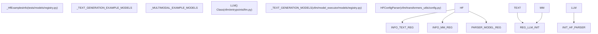
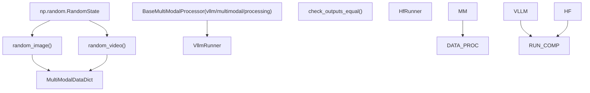

# Test Organization and Infrastructure

Relevant source files

-   [docs/models/supported\_models.md](https://github.com/vllm-project/vllm/blob/7cc302dd/docs/models/supported_models.md?plain=1)
-   [examples/offline\_inference/audio\_language.py](https://github.com/vllm-project/vllm/blob/7cc302dd/examples/offline_inference/audio_language.py)
-   [examples/offline\_inference/vision\_language.py](https://github.com/vllm-project/vllm/blob/7cc302dd/examples/offline_inference/vision_language.py)
-   [examples/offline\_inference/vision\_language\_multi\_image.py](https://github.com/vllm-project/vllm/blob/7cc302dd/examples/offline_inference/vision_language_multi_image.py)
-   [tests/conftest.py](https://github.com/vllm-project/vllm/blob/7cc302dd/tests/conftest.py)
-   [tests/distributed/test\_pipeline\_parallel.py](https://github.com/vllm-project/vllm/blob/7cc302dd/tests/distributed/test_pipeline_parallel.py)
-   [tests/models/fixtures/qwen2\_5\_math\_prm\_reward\_step.json](https://github.com/vllm-project/vllm/blob/7cc302dd/tests/models/fixtures/qwen2_5_math_prm_reward_step.json)
-   [tests/models/language/pooling/embed\_utils.py](https://github.com/vllm-project/vllm/blob/7cc302dd/tests/models/language/pooling/embed_utils.py)
-   [tests/models/language/pooling/test\_embedding.py](https://github.com/vllm-project/vllm/blob/7cc302dd/tests/models/language/pooling/test_embedding.py)
-   [tests/models/language/pooling/test\_reward.py](https://github.com/vllm-project/vllm/blob/7cc302dd/tests/models/language/pooling/test_reward.py)
-   [tests/models/multimodal/generation/test\_common.py](https://github.com/vllm-project/vllm/blob/7cc302dd/tests/models/multimodal/generation/test_common.py)
-   [tests/models/multimodal/generation/vlm\_utils/model\_utils.py](https://github.com/vllm-project/vllm/blob/7cc302dd/tests/models/multimodal/generation/vlm_utils/model_utils.py)
-   [tests/models/multimodal/processing/test\_common.py](https://github.com/vllm-project/vllm/blob/7cc302dd/tests/models/multimodal/processing/test_common.py)
-   [tests/models/multimodal/processing/test\_tensor\_schema.py](https://github.com/vllm-project/vllm/blob/7cc302dd/tests/models/multimodal/processing/test_tensor_schema.py)
-   [tests/models/registry.py](https://github.com/vllm-project/vllm/blob/7cc302dd/tests/models/registry.py)
-   [tests/models/test\_initialization.py](https://github.com/vllm-project/vllm/blob/7cc302dd/tests/models/test_initialization.py)
-   [tests/models/utils.py](https://github.com/vllm-project/vllm/blob/7cc302dd/tests/models/utils.py)
-   [vllm/model\_executor/models/adapters.py](https://github.com/vllm-project/vllm/blob/7cc302dd/vllm/model_executor/models/adapters.py)
-   [vllm/model\_executor/models/mistral\_large\_3\_eagle.py](https://github.com/vllm-project/vllm/blob/7cc302dd/vllm/model_executor/models/mistral_large_3_eagle.py)
-   [vllm/model\_executor/models/registry.py](https://github.com/vllm-project/vllm/blob/7cc302dd/vllm/model_executor/models/registry.py)
-   [vllm/transformers\_utils/config.py](https://github.com/vllm-project/vllm/blob/7cc302dd/vllm/transformers_utils/config.py)
-   [vllm/transformers\_utils/configs/\_\_init\_\_.py](https://github.com/vllm-project/vllm/blob/7cc302dd/vllm/transformers_utils/configs/__init__.py)
-   [vllm/transformers\_utils/configs/mistral.py](https://github.com/vllm-project/vllm/blob/7cc302dd/vllm/transformers_utils/configs/mistral.py)
-   [vllm/transformers\_utils/model\_arch\_config\_convertor.py](https://github.com/vllm-project/vllm/blob/7cc302dd/vllm/transformers_utils/model_arch_config_convertor.py)

## Purpose and Scope

This document explains the organization of tests in the vLLM codebase, including the directory structure, pytest configuration, test categories, fixtures, and the test registry system. It covers how tests are structured, categorized, and selected for execution based on various hardware and functional criteria.

For information about the CI/CD pipeline configuration and test execution infrastructure, see [Buildkite CI Pipelines](/vllm-project/vllm/12.2-buildkite-ci-pipelines). For hardware-specific testing details, see [Hardware-Specific Testing](/vllm-project/vllm/12.3-hardware-specific-testing). For model correctness testing methodology, see [Model Correctness Validation](/vllm-project/vllm/12.4-model-correctness-validation).

---

## Test Directory Structure

vLLM organizes tests in a hierarchical directory structure under the `tests/` directory. Each directory corresponds to a major functional area of the codebase.

### Top-Level Test Organization

```mermaid
flowchart TD
    tests["tests/"]
    basic_correctness["basic_correctness/Basic inference correctness"]
    entrypoints["entrypoints/API and entrypoint tests"]
    distributed["distributed/Multi-GPU/node tests"]
    kernels["kernels/Low-level kernel tests"]
    models["models/Model-specific tests"]
    engine["engine/Engine component tests"]
    compile["compile/PyTorch compilation tests"]
    lora["lora/LoRA adapter tests"]
    quantization["quantization/Quantization tests"]
    samplers["samplers/Sampling tests"]
    v1["v1/V1 engine tests"]
    benchmarks_t["benchmarks/Test suite for benchmarks"]
    utils["utils_/Utility tests"]
    multimodal["multimodal/Multimodal input tests"]
    config["config/Configuration tests"]
    standalone_tests["standalone_tests/Standalone test scripts"]

    tests --> basic_correctness
    tests --> entrypoints
    tests --> distributed
    tests --> kernels
    tests --> models
    tests --> engine
    tests --> compile
    tests --> lora
    tests --> quantization
    tests --> samplers
    tests --> v1
    tests --> benchmarks_t
    tests --> utils
    tests --> multimodal
    tests --> config
    tests --> standalone_tests
```

**Sources:** [tests/conftest.py130-133](https://github.com/vllm-project/vllm/blob/7cc302dd/tests/conftest.py#L130-L133) [tests/models/registry.py193-205](https://github.com/vllm-project/vllm/blob/7cc302dd/tests/models/registry.py#L193-L205)

### Detailed Directory Breakdown

| Directory | Purpose | Key Tests |
| --- | --- | --- |
| `basic_correctness/` | Fundamental inference correctness | `test_basic_correctness.py`, `test_cpu_offload.py` |
| `entrypoints/` | API and interface tests | `llm/`, `openai/`, `rpc/`, `pooling/` |
| `distributed/` | Parallel execution tests | `test_pipeline_parallel.py` |
| `models/` | Model loading and execution | `language/`, `multimodal/`, `test_initialization.py` |
| `models/multimodal/` | Vision/Audio/Video processing | `processing/test_common.py`, `generation/test_common.py` |

**Sources:** [tests/models/test\_initialization.py32-45](https://github.com/vllm-project/vllm/blob/7cc302dd/tests/models/test_initialization.py#L32-L45) [tests/models/multimodal/processing/test\_common.py193-212](https://github.com/vllm-project/vllm/blob/7cc302dd/tests/models/multimodal/processing/test_common.py#L193-L212)

---

## Model Test Registry System

vLLM uses a specialized registry system to manage the vast number of supported models and their testing requirements. This bridges the gap between HuggingFace architectures and vLLM's internal execution logic.

### Model Registry Data Flow

**Sources:** [tests/models/registry.py15-120](https://github.com/vllm-project/vllm/blob/7cc302dd/tests/models/registry.py#L15-L120) [vllm/model\_executor/models/registry.py70-158](https://github.com/vllm-project/vllm/blob/7cc302dd/vllm/model_executor/models/registry.py#L70-L158) [vllm/transformers\_utils/config.py156-200](https://github.com/vllm-project/vllm/blob/7cc302dd/vllm/transformers_utils/config.py#L156-L200)

### Key Registry Components

-   **\_HfExamplesInfo**: A dataclass that stores metadata for testing a specific architecture, including default model IDs, required `transformers` versions, and CI-specific overrides like `max_model_len` [tests/models/registry.py15-120](https://github.com/vllm-project/vllm/blob/7cc302dd/tests/models/registry.py#L15-L120)
-   **HF\_EXAMPLE\_MODELS**: A registry class (aliased from `HfExampleModels`) that provides helper methods like `get_hf_info()` to retrieve model metadata during test parametrization [tests/models/multimodal/processing/test\_common.py87-91](https://github.com/vllm-project/vllm/blob/7cc302dd/tests/models/multimodal/processing/test_common.py#L87-L91)
-   **Transformers Modeling Backend**: Models listed in `_TRANSFORMERS_BACKEND_MODELS` are tested using the HuggingFace Transformers implementation within vLLM, rather than native vLLM kernels [tests/models/test\_initialization.py166-168](https://github.com/vllm-project/vllm/blob/7cc302dd/tests/models/test_initialization.py#L166-L168) [docs/models/supported\_models.md16-18](https://github.com/vllm-project/vllm/blob/7cc302dd/docs/models/supported_models.md?plain=1#L16-L18)

**Sources:** [tests/models/registry.py15-120](https://github.com/vllm-project/vllm/blob/7cc302dd/tests/models/registry.py#L15-L120) [tests/models/test\_initialization.py166-168](https://github.com/vllm-project/vllm/blob/7cc302dd/tests/models/test_initialization.py#L166-L168) [docs/models/supported\_models.md16-18](https://github.com/vllm-project/vllm/blob/7cc302dd/docs/models/supported_models.md?plain=1#L16-L18)

---

## Test Categories and Pytest Markers

vLLM uses pytest markers to categorize tests and enable selective execution, particularly for managing hardware requirements.

### Model Initialization Subsets

To optimize CI time, model initialization tests are split into two categories:

1.  **MINIMAL\_MODEL\_ARCH\_LIST**: A hand-picked subset of representative architectures (e.g., `LlavaForConditionalGeneration`, `Gemma3nForCausalLM`, `DeepSeekMTPModel`) tested on every PR [tests/models/test\_initialization.py32-45](https://github.com/vllm-project/vllm/blob/7cc302dd/tests/models/test_initialization.py#L32-L45)
2.  **OTHER\_MODEL\_ARCH\_LIST**: The complement of the minimal list, tested less frequently or in specialized pipelines [tests/models/test\_initialization.py47-52](https://github.com/vllm-project/vllm/blob/7cc302dd/tests/models/test_initialization.py#L47-L52)

### Common Pytest Markers

-   `core_model`: Essential models that must pass for any release [tests/models/multimodal/generation/test\_common.py108](https://github.com/vllm-project/vllm/blob/7cc302dd/tests/models/multimodal/generation/test_common.py#L108-L108)
-   `cpu_model`: Models capable of running initialization or basic processing on CPU [tests/models/multimodal/generation/test\_common.py108](https://github.com/vllm-project/vllm/blob/7cc302dd/tests/models/multimodal/generation/test_common.py#L108-L108)
-   `large_gpu_mark`: Tests requiring high VRAM (e.g., A100/H100) [tests/models/multimodal/generation/test\_common.py32](https://github.com/vllm-project/vllm/blob/7cc302dd/tests/models/multimodal/generation/test_common.py#L32-L32)

**Sources:** [tests/models/test\_initialization.py32-52](https://github.com/vllm-project/vllm/blob/7cc302dd/tests/models/test_initialization.py#L32-L52) [tests/models/multimodal/generation/test\_common.py108](https://github.com/vllm-project/vllm/blob/7cc302dd/tests/models/multimodal/generation/test_common.py#L108-L108)

---

## Test Infrastructure and Fixtures

vLLM utilizes `pytest` fixtures in `tests/conftest.py` to manage the lifecycle of models and distributed environments.

### Core Fixtures and Utilities

| Fixture / Utility | Purpose |
| --- | --- |
| `dist_init` | Initializes a single-process distributed environment using `init_distributed_environment` [tests/conftest.py224-237](https://github.com/vllm-project/vllm/blob/7cc302dd/tests/conftest.py#L224-L237) |
| `IMAGE_ASSETS` | Singleton providing standardized images (e.g., "stop\_sign", "cherry\_blossom") for multimodal tests [tests/conftest.py208-209](https://github.com/vllm-project/vllm/blob/7cc302dd/tests/conftest.py#L208-L209) |
| `create_new_process_for_each_test` | Decorator to isolate GPU memory and state by spawning a fresh process for every test case [tests/models/test\_initialization.py55-65](https://github.com/vllm-project/vllm/blob/7cc302dd/tests/models/test_initialization.py#L55-L65) |
| `HFConfigParser` | Component that adapts HuggingFace configs, applying `hf_overrides` defined in the test registry [vllm/transformers\_utils/config.py156-183](https://github.com/vllm-project/vllm/blob/7cc302dd/vllm/transformers_utils/config.py#L156-L183) |

**Sources:** [tests/conftest.py208-237](https://github.com/vllm-project/vllm/blob/7cc302dd/tests/conftest.py#L208-L237) [tests/models/test\_initialization.py55-65](https://github.com/vllm-project/vllm/blob/7cc302dd/tests/models/test_initialization.py#L55-L65) [vllm/transformers\_utils/config.py156-183](https://github.com/vllm-project/vllm/blob/7cc302dd/vllm/transformers_utils/config.py#L156-L183)

### Multimodal Testing Infrastructure

Multimodal tests use a common processing framework to validate that inputs (images, audio, video) are correctly tokenized and formatted for the model.

**Sources:** [tests/models/multimodal/processing/test\_common.py121-168](https://github.com/vllm-project/vllm/blob/7cc302dd/tests/models/multimodal/processing/test_common.py#L121-L168) [tests/models/multimodal/generation/test\_common.py33-41](https://github.com/vllm-project/vllm/blob/7cc302dd/tests/models/multimodal/generation/test_common.py#L33-L41)

---

## Model Initialization Flow in Tests

The `can_initialize` function in `tests/models/test_initialization.py` provides a standardized way to verify that a model can be loaded into the vLLM engine without executing a full forward pass.

1.  **Version Check**: Verifies the installed `transformers` version against the model's requirements [tests/models/test\_initialization.py69-73](https://github.com/vllm-project/vllm/blob/7cc302dd/tests/models/test_initialization.py#L69-L73)
2.  **Mock KV Cache**: Patches `V1EngineCore._initialize_kv_caches` to avoid allocating massive memory blocks during simple init tests [tests/models/test\_initialization.py83-99](https://github.com/vllm-project/vllm/blob/7cc302dd/tests/models/test_initialization.py#L83-L99)
3.  **Dummy Load**: Sets `load_format="dummy"` to skip loading actual weights while still building the model architecture [tests/models/test\_initialization.py165](https://github.com/vllm-project/vllm/blob/7cc302dd/tests/models/test_initialization.py#L165-L165)
4.  **Backend Selection**: Automatically chooses between `vllm` and `transformers` backends based on the registry [tests/models/test\_initialization.py166-168](https://github.com/vllm-project/vllm/blob/7cc302dd/tests/models/test_initialization.py#L166-L168)

**Sources:** [tests/models/test\_initialization.py69-173](https://github.com/vllm-project/vllm/blob/7cc302dd/tests/models/test_initialization.py#L69-L173)
