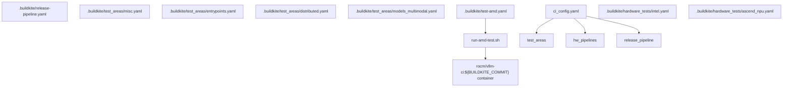
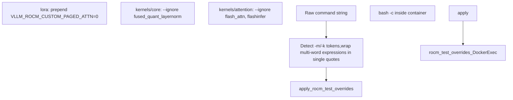
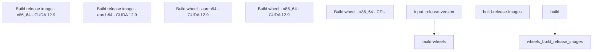

# Buildkite CI Pipelines

Relevant source files

-   [.buildkite/hardware\_tests/amd.yaml](https://github.com/vllm-project/vllm/blob/7cc302dd/.buildkite/hardware_tests/amd.yaml)
-   [.buildkite/hardware\_tests/ascend\_npu.yaml](https://github.com/vllm-project/vllm/blob/7cc302dd/.buildkite/hardware_tests/ascend_npu.yaml)
-   [.buildkite/hardware\_tests/gh200.yaml](https://github.com/vllm-project/vllm/blob/7cc302dd/.buildkite/hardware_tests/gh200.yaml)
-   [.buildkite/hardware\_tests/intel.yaml](https://github.com/vllm-project/vllm/blob/7cc302dd/.buildkite/hardware_tests/intel.yaml)
-   [.buildkite/release-pipeline.yaml](https://github.com/vllm-project/vllm/blob/7cc302dd/.buildkite/release-pipeline.yaml)
-   [.buildkite/scripts/annotate-release.sh](https://github.com/vllm-project/vllm/blob/7cc302dd/.buildkite/scripts/annotate-release.sh)
-   [.buildkite/scripts/annotate-rocm-release.sh](https://github.com/vllm-project/vllm/blob/7cc302dd/.buildkite/scripts/annotate-rocm-release.sh)
-   [.buildkite/scripts/cache-rocm-base-wheels.sh](https://github.com/vllm-project/vllm/blob/7cc302dd/.buildkite/scripts/cache-rocm-base-wheels.sh)
-   [.buildkite/scripts/cleanup-nightly-builds.sh](https://github.com/vllm-project/vllm/blob/7cc302dd/.buildkite/scripts/cleanup-nightly-builds.sh)
-   [.buildkite/scripts/hardware\_ci/run-amd-test.sh](https://github.com/vllm-project/vllm/blob/7cc302dd/.buildkite/scripts/hardware_ci/run-amd-test.sh)
-   [.buildkite/scripts/hardware\_ci/run-cpu-distributed-smoke-test.sh](https://github.com/vllm-project/vllm/blob/7cc302dd/.buildkite/scripts/hardware_ci/run-cpu-distributed-smoke-test.sh)
-   [.buildkite/scripts/push-nightly-builds-rocm.sh](https://github.com/vllm-project/vllm/blob/7cc302dd/.buildkite/scripts/push-nightly-builds-rocm.sh)
-   [.buildkite/scripts/push-nightly-builds.sh](https://github.com/vllm-project/vllm/blob/7cc302dd/.buildkite/scripts/push-nightly-builds.sh)
-   [.buildkite/scripts/upload-release-wheels-pypi.sh](https://github.com/vllm-project/vllm/blob/7cc302dd/.buildkite/scripts/upload-release-wheels-pypi.sh)
-   [.buildkite/scripts/upload-rocm-wheels.sh](https://github.com/vllm-project/vllm/blob/7cc302dd/.buildkite/scripts/upload-rocm-wheels.sh)
-   [.buildkite/test-amd.yaml](https://github.com/vllm-project/vllm/blob/7cc302dd/.buildkite/test-amd.yaml)
-   [.buildkite/test-pipeline.yaml](https://github.com/vllm-project/vllm/blob/7cc302dd/.buildkite/test-pipeline.yaml)
-   [.buildkite/test\_areas/basic\_correctness.yaml](https://github.com/vllm-project/vllm/blob/7cc302dd/.buildkite/test_areas/basic_correctness.yaml)
-   [.buildkite/test\_areas/distributed.yaml](https://github.com/vllm-project/vllm/blob/7cc302dd/.buildkite/test_areas/distributed.yaml)
-   [.buildkite/test\_areas/entrypoints.yaml](https://github.com/vllm-project/vllm/blob/7cc302dd/.buildkite/test_areas/entrypoints.yaml)
-   [.buildkite/test\_areas/misc.yaml](https://github.com/vllm-project/vllm/blob/7cc302dd/.buildkite/test_areas/misc.yaml)
-   [.buildkite/test\_areas/models\_basic.yaml](https://github.com/vllm-project/vllm/blob/7cc302dd/.buildkite/test_areas/models_basic.yaml)
-   [.buildkite/test\_areas/models\_language.yaml](https://github.com/vllm-project/vllm/blob/7cc302dd/.buildkite/test_areas/models_language.yaml)
-   [.buildkite/test\_areas/models\_multimodal.yaml](https://github.com/vllm-project/vllm/blob/7cc302dd/.buildkite/test_areas/models_multimodal.yaml)
-   [.buildkite/test\_areas/plugins.yaml](https://github.com/vllm-project/vllm/blob/7cc302dd/.buildkite/test_areas/plugins.yaml)
-   [.buildkite/test\_areas/samplers.yaml](https://github.com/vllm-project/vllm/blob/7cc302dd/.buildkite/test_areas/samplers.yaml)
-   [docs/design/dbo.md](https://github.com/vllm-project/vllm/blob/7cc302dd/docs/design/dbo.md?plain=1)
-   [examples/offline\_inference/data\_parallel.py](https://github.com/vllm-project/vllm/blob/7cc302dd/examples/offline_inference/data_parallel.py)
-   [tests/detokenizer/test\_disable\_detokenization.py](https://github.com/vllm-project/vllm/blob/7cc302dd/tests/detokenizer/test_disable_detokenization.py)
-   [tests/plugins\_tests/test\_terratorch\_io\_processor\_plugins.py](https://github.com/vllm-project/vllm/blob/7cc302dd/tests/plugins_tests/test_terratorch_io_processor_plugins.py)
-   [tests/v1/spec\_decode/\_\_init\_\_.py](https://github.com/vllm-project/vllm/blob/7cc302dd/tests/v1/spec_decode/__init__.py)
-   [tests/v1/spec\_decode/test\_acceptance\_length.py](https://github.com/vllm-project/vllm/blob/7cc302dd/tests/v1/spec_decode/test_acceptance_length.py)
-   [tools/vllm-rocm/generate-rocm-wheels-root-index.sh](https://github.com/vllm-project/vllm/blob/7cc302dd/tools/vllm-rocm/generate-rocm-wheels-root-index.sh)
-   [tools/vllm-rocm/pin\_rocm\_dependencies.py](https://github.com/vllm-project/vllm/blob/7cc302dd/tools/vllm-rocm/pin_rocm_dependencies.py)
-   [vllm/distributed/device\_communicators/xpu\_communicator.py](https://github.com/vllm-project/vllm/blob/7cc302dd/vllm/distributed/device_communicators/xpu_communicator.py)
-   [vllm/usage/usage\_lib.py](https://github.com/vllm-project/vllm/blob/7cc302dd/vllm/usage/usage_lib.py)

This document describes the Buildkite continuous integration (CI) pipeline configuration system used for automated testing in vLLM. It covers the pipeline organization, YAML configuration format, test categorization, hardware-specific pipelines, agent pool management, and Docker-based test execution environments. For general test organization and pytest configuration, see page 12.1. For AMD-specific GPU testing procedures and state management, see page 12.3.

## Pipeline Organization

The Buildkite CI configuration has been reorganized from a single monolithic file into a modular structure. The deprecated `.buildkite/test-pipeline.yaml` file indicates the migration completed on February 18, 2026, with content split across multiple directories:

| Directory/File | Purpose |
| --- | --- |
| `.buildkite/test_areas/` | Test job definitions organized by functional area (NVIDIA/general) |
| `.buildkite/image_build/` | Docker image building jobs |
| `.buildkite/hardware_tests/` | Hardware-specific test jobs (Intel, Ascend NPU, Arm, etc.) |
| `.buildkite/ci_config.yaml` | CI pipeline configuration settings |
| `.buildkite/test-amd.yaml` | AMD GPU-specific test pipeline (separate schema from test\_areas/) |
| `.buildkite/release-pipeline.yaml` | Release pipeline: wheels, Docker images, PyPI publishing |

There are **two distinct YAML schemas** in use:

-   **`test_areas/*.yaml`**: Used for NVIDIA/general CI. Each file defines a named group with steps that can optionally mirror to AMD hardware via a `mirror:` sub-key.
-   **`test-amd.yaml`**: Used for the AMD GPU pipeline. Uses `agent_pool:`, `mirror_hardwares:`, `fast_check:`, and `torch_nightly:` fields not present in the test\_areas schema.

Sources: [.buildkite/test-pipeline.yaml1-9](https://github.com/vllm-project/vllm/blob/7cc302dd/ .buildkite/test-pipeline.yaml#L1-L9) [.buildkite/test\_areas/misc.yaml1-4](https://github.com/vllm-project/vllm/blob/7cc302dd/ .buildkite/test_areas/misc.yaml#L1-L4) [.buildkite/test-amd.yaml1-34](https://github.com/vllm-project/vllm/blob/7cc302dd/ .buildkite/test-amd.yaml#L1-L34)

### Pipeline Architecture

**Pipeline File Map**


Sources: [.buildkite/test-pipeline.yaml1-9](https://github.com/vllm-project/vllm/blob/7cc302dd/ .buildkite/test-pipeline.yaml#L1-L9) [.buildkite/test-amd.yaml1-34](https://github.com/vllm-project/vllm/blob/7cc302dd/ .buildkite/test-amd.yaml#L1-L34) [.buildkite/scripts/hardware\_ci/run-amd-test.sh1-28](https://github.com/vllm-project/vllm/blob/7cc302dd/ .buildkite/scripts/hardware_ci/run-amd-test.sh#L1-L28)

## Test Step Configuration

There are two distinct YAML schemas used in the CI configuration.

### test\_areas/\*.yaml Schema

Each file in `.buildkite/test_areas/` defines a named group of steps for NVIDIA/general testing. Individual steps can optionally mirror to AMD hardware.

**Top-level fields:**

| Field | Type | Description |
| --- | --- | --- |
| `group` | string | Display group name in Buildkite UI |
| `depends_on` | list | Step keys that must complete first (e.g., `image-build`) |
| `steps` | list | List of step definitions |

**Per-step fields (test\_areas/):**

| Field | Type | Description |
| --- | --- | --- |
| `label` | string | Step display name |
| `timeout_in_minutes` | int | Step timeout |
| `commands` | list | Shell commands to run |
| `source_file_dependencies` | list | Path prefixes; step skipped if no changes match |
| `working_dir` | string | Working directory inside container |
| `num_devices` | int | Number of GPUs (1, 2, 4, 8) |
| `parallelism` | int | Number of parallel shards |
| `optional` | bool | Requires manual unblock to run |
| `device` | string | Target device type (e.g., `cpu`, `h100`, `a100`) |
| `mirror.amd.device` | string | AMD agent pool to mirror on (e.g., `mi325_1`) |

Example from `.buildkite/test_areas/distributed.yaml`:

```
group: Distributeddepends_on:   - image-buildsteps:- label: Distributed Comm Ops  timeout_in_minutes: 20  working_dir: "/vllm-workspace/tests"  num_devices: 2  source_file_dependencies:  - vllm/distributed  - tests/distributed  commands:  - pytest -v -s distributed/test_comm_ops.py
```
Sources: [.buildkite/test\_areas/distributed.yaml1-17](https://github.com/vllm-project/vllm/blob/7cc302dd/ .buildkite/test_areas/distributed.yaml#L1-L17) [.buildkite/test\_areas/misc.yaml1-35](https://github.com/vllm-project/vllm/blob/7cc302dd/ .buildkite/test_areas/misc.yaml#L1-L35)

### test-amd.yaml Schema

The `.buildkite/test-amd.yaml` file uses a different schema processed through a Jinja2 template. It has AMD-specific fields not present in `test_areas/`:

| Field | Type | Description |
| --- | --- | --- |
| `agent_pool` | string | AMD GPU pool: `mi250_1`, `mi325_1`, etc. |
| `mirror_hardwares` | list | Also run on: `amdexperimental`, `amdproduction`, `amdgfx90a` |
| `fast_check` | bool | Run on every commit in the fast-check pipeline |
| `torch_nightly` | bool | Include in torch nightly pipeline |
| `num_gpus` | int | GPU count override |
| `num_nodes` | int | Simulate multi-node via multiple containers on one host |

Sources: [.buildkite/test-amd.yaml8-27](https://github.com/vllm-project/vllm/blob/7cc302dd/ .buildkite/test-amd.yaml#L8-L27)

## Test Categories and Organization

### Distributed and Multi-GPU Testing

Distributed tests are categorized by GPU count and specific features like Data Parallelism (DP) or Pipeline Parallelism (PP).

| Test Label | GPU Count | Key Commands / Environment |
| --- | --- | --- |
| Distributed DP Tests | 2 / 4 GPUs | `TP_SIZE=1 DP_SIZE=2 pytest ...` |
| Distributed Torchrun | 4 GPUs | `torchrun --nproc-per-node=4 ...` |
| Distributed Comm Ops | 2 GPUs | `pytest -v -s distributed/test_comm_ops.py` |

Sources: [.buildkite/test\_areas/distributed.yaml5-38](https://github.com/vllm-project/vllm/blob/7cc302dd/ .buildkite/test_areas/distributed.yaml#L5-L38) [.buildkite/test\_areas/distributed.yaml83-114](https://github.com/vllm-project/vllm/blob/7cc302dd/ .buildkite/test_areas/distributed.yaml#L83-L114)

### Multimodal Model Testing

Multimodal tests are split into "Standard" groups to manage execution time and "Extended" groups for deeper validation.

| Group | Sub-category | Models Covered |
| --- | --- | --- |
| Standard 1 | Qwen2 | `qwen2`, `ultravox` |
| Standard 2 | Qwen3/Gemma | `qwen3`, `gemma`, `qwen2_5_vl` |
| Standard 3 | LLaVA | `llava`, `qwen2_vl` |
| Standard 4 | Whisper/Other | `whisper`, `mantis` |

Sources: [.buildkite/test\_areas/models\_multimodal.yaml5-64](https://github.com/vllm-project/vllm/blob/7cc302dd/ .buildkite/test_areas/models_multimodal.yaml#L5-L64)

## Test Execution Environment

Tests execute inside Docker containers with specific GPU access and resource configurations. The `run-amd-test.sh` script manages the container lifecycle for ROCm environments.

### Docker Container Execution Flow

> **[Mermaid sequence]**
> *(图表结构无法解析)*

Sources: [.buildkite/scripts/hardware\_ci/run-amd-test.sh38-74](https://github.com/vllm-project/vllm/blob/7cc302dd/ .buildkite/scripts/hardware_ci/run-amd-test.sh#L38-L74) [.buildkite/scripts/hardware\_ci/run-amd-test.sh141-205](https://github.com/vllm-project/vllm/blob/7cc302dd/ .buildkite/scripts/hardware_ci/run-amd-test.sh#L141-L205)

### GPU State Management

The script ensures clean GPU state before test execution by checking the hardware state file `/opt/amdgpu/etc/gpu_state`:

```
wait_for_clean_gpus() {  local timeout=${1:-300}  while true; do    if grep -q clean /opt/amdgpu/etc/gpu_state; then      echo "GPUs state is \"clean\""      return    fi    # ... timeout logic ...    sleep 3  done}
```
Sources: [.buildkite/scripts/hardware\_ci/run-amd-test.sh38-53](https://github.com/vllm-project/vllm/blob/7cc302dd/ .buildkite/scripts/hardware_ci/run-amd-test.sh#L38-L53)

### Command Transformation Pipeline

The `run-amd-test.sh` script applies transformations to command strings to handle shell quote stripping and ROCm-specific overrides.

**`run-amd-test.sh` command transformation flow**


Sources: [.buildkite/scripts/hardware\_ci/run-amd-test.sh141-205](https://github.com/vllm-project/vllm/blob/7cc302dd/ .buildkite/scripts/hardware_ci/run-amd-test.sh#L141-L205)

## Release Pipeline

The `.buildkite/release-pipeline.yaml` file orchestrates publishing vLLM releases, including wheels and Docker images across multiple architectures (x86\_64, aarch64) and backends (CUDA 12.9, CUDA 13.0, CPU).

### Release Pipeline Structure

**`.buildkite/release-pipeline.yaml` step groups**


Sources: [.buildkite/release-pipeline.yaml1-118](https://github.com/vllm-project/vllm/blob/7cc302dd/ .buildkite/release-pipeline.yaml#L1-L118)

### Key Release Actions

| Action | Target / Command |
| --- | --- |
| **Wheel Build** | `DOCKER_BUILDKIT=1 docker build --target build -f docker/Dockerfile` |
| **Image Build** | `DOCKER_BUILDKIT=1 docker build --target vllm-openai -f docker/Dockerfile` |
| **S3 Upload** | `bash .buildkite/scripts/upload-nightly-wheels.sh` |
| **ECR Push** | `docker push public.ecr.aws/q9t5s3a7/vllm-release-repo:$BUILDKITE_COMMIT` |

Sources: [.buildkite/release-pipeline.yaml19-22](https://github.com/vllm-project/vllm/blob/7cc302dd/ .buildkite/release-pipeline.yaml#L19-L22) [.buildkite/release-pipeline.yaml103-107](https://github.com/vllm-project/vllm/blob/7cc302dd/ .buildkite/release-pipeline.yaml#L103-L107)

## Source File Dependencies

The `source_file_dependencies` field enables selective test execution based on file modifications. Tests only run if any of their listed file prefixes have changed in the current commit.

```
- label: Distributed Comm Ops  source_file_dependencies:  - vllm/distributed  - tests/distributed  commands:  - pytest -v -s distributed/test_comm_ops.py
```
Sources: [.buildkite/test\_areas/distributed.yaml9-13](https://github.com/vllm-project/vllm/blob/7cc302dd/ .buildkite/test_areas/distributed.yaml#L9-L13) [.buildkite/test\_areas/misc.yaml5-10](https://github.com/vllm-project/vllm/blob/7cc302dd/ .buildkite/test_areas/misc.yaml#L5-L10)
