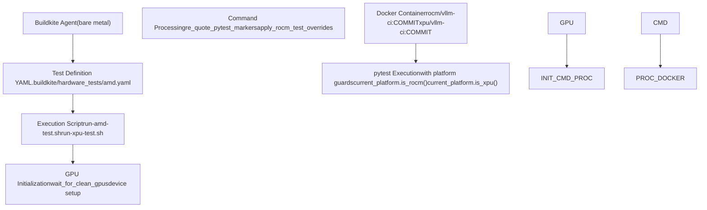
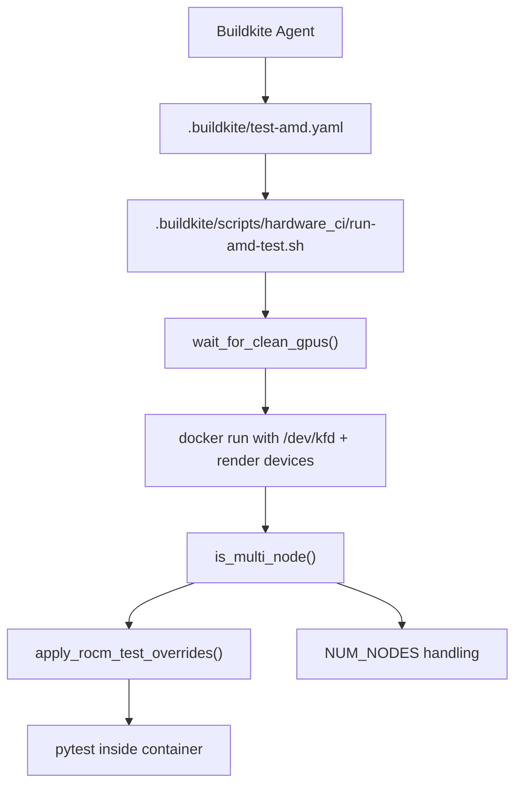
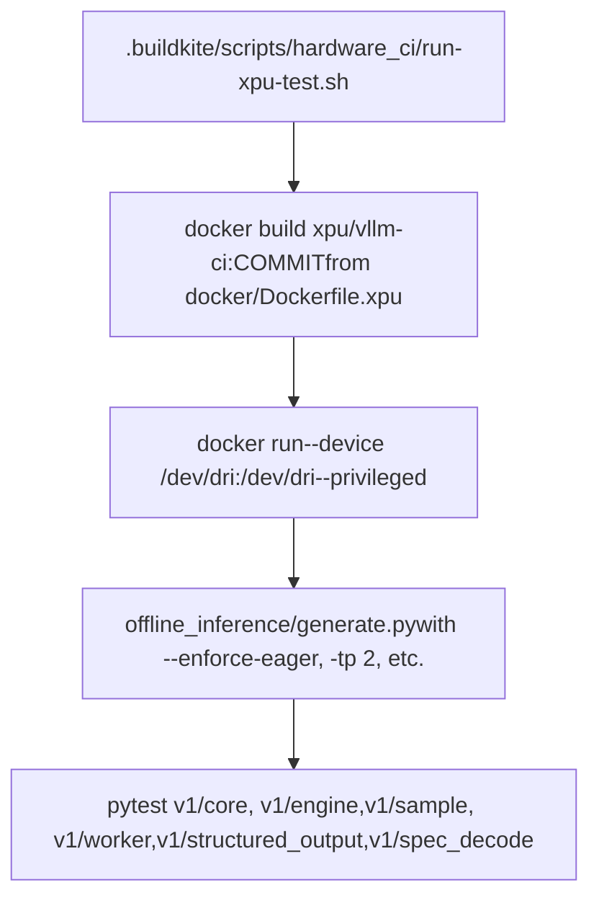

# Hardware-Specific Testing

Relevant source files

-   [.buildkite/hardware\_tests/amd.yaml](https://github.com/vllm-project/vllm/blob/7cc302dd/.buildkite/hardware_tests/amd.yaml)
-   [.buildkite/hardware\_tests/ascend\_npu.yaml](https://github.com/vllm-project/vllm/blob/7cc302dd/.buildkite/hardware_tests/ascend_npu.yaml)
-   [.buildkite/hardware\_tests/gh200.yaml](https://github.com/vllm-project/vllm/blob/7cc302dd/.buildkite/hardware_tests/gh200.yaml)
-   [.buildkite/hardware\_tests/intel.yaml](https://github.com/vllm-project/vllm/blob/7cc302dd/.buildkite/hardware_tests/intel.yaml)
-   [.buildkite/scripts/hardware\_ci/run-amd-test.sh](https://github.com/vllm-project/vllm/blob/7cc302dd/.buildkite/scripts/hardware_ci/run-amd-test.sh)
-   [.buildkite/scripts/hardware\_ci/run-cpu-distributed-smoke-test.sh](https://github.com/vllm-project/vllm/blob/7cc302dd/.buildkite/scripts/hardware_ci/run-cpu-distributed-smoke-test.sh)
-   [.buildkite/scripts/hardware\_ci/run-tpu-v1-test-part2.sh](https://github.com/vllm-project/vllm/blob/7cc302dd/.buildkite/scripts/hardware_ci/run-tpu-v1-test-part2.sh)
-   [.buildkite/scripts/hardware\_ci/run-tpu-v1-test.sh](https://github.com/vllm-project/vllm/blob/7cc302dd/.buildkite/scripts/hardware_ci/run-tpu-v1-test.sh)
-   [.buildkite/scripts/hardware\_ci/run-xpu-test.sh](https://github.com/vllm-project/vllm/blob/7cc302dd/.buildkite/scripts/hardware_ci/run-xpu-test.sh)
-   [.buildkite/test-amd.yaml](https://github.com/vllm-project/vllm/blob/7cc302dd/.buildkite/test-amd.yaml)
-   [.buildkite/test-pipeline.yaml](https://github.com/vllm-project/vllm/blob/7cc302dd/.buildkite/test-pipeline.yaml)
-   [.buildkite/test\_areas/basic\_correctness.yaml](https://github.com/vllm-project/vllm/blob/7cc302dd/.buildkite/test_areas/basic_correctness.yaml)
-   [.buildkite/test\_areas/distributed.yaml](https://github.com/vllm-project/vllm/blob/7cc302dd/.buildkite/test_areas/distributed.yaml)
-   [.buildkite/test\_areas/entrypoints.yaml](https://github.com/vllm-project/vllm/blob/7cc302dd/.buildkite/test_areas/entrypoints.yaml)
-   [.buildkite/test\_areas/misc.yaml](https://github.com/vllm-project/vllm/blob/7cc302dd/.buildkite/test_areas/misc.yaml)
-   [.buildkite/test\_areas/models\_basic.yaml](https://github.com/vllm-project/vllm/blob/7cc302dd/.buildkite/test_areas/models_basic.yaml)
-   [.buildkite/test\_areas/models\_language.yaml](https://github.com/vllm-project/vllm/blob/7cc302dd/.buildkite/test_areas/models_language.yaml)
-   [.buildkite/test\_areas/models\_multimodal.yaml](https://github.com/vllm-project/vllm/blob/7cc302dd/.buildkite/test_areas/models_multimodal.yaml)
-   [.buildkite/test\_areas/plugins.yaml](https://github.com/vllm-project/vllm/blob/7cc302dd/.buildkite/test_areas/plugins.yaml)
-   [.buildkite/test\_areas/samplers.yaml](https://github.com/vllm-project/vllm/blob/7cc302dd/.buildkite/test_areas/samplers.yaml)
-   [docker/Dockerfile.xpu](https://github.com/vllm-project/vllm/blob/7cc302dd/docker/Dockerfile.xpu)
-   [docs/design/dbo.md](https://github.com/vllm-project/vllm/blob/7cc302dd/docs/design/dbo.md?plain=1)
-   [examples/offline\_inference/data\_parallel.py](https://github.com/vllm-project/vllm/blob/7cc302dd/examples/offline_inference/data_parallel.py)
-   [requirements/xpu-test.in](https://github.com/vllm-project/vllm/blob/7cc302dd/requirements/xpu-test.in)
-   [requirements/xpu-test.txt](https://github.com/vllm-project/vllm/blob/7cc302dd/requirements/xpu-test.txt)
-   [requirements/xpu.txt](https://github.com/vllm-project/vllm/blob/7cc302dd/requirements/xpu.txt)
-   [tests/detokenizer/test\_disable\_detokenization.py](https://github.com/vllm-project/vllm/blob/7cc302dd/tests/detokenizer/test_disable_detokenization.py)
-   [tests/entrypoints/llm/test\_struct\_output\_generate.py](https://github.com/vllm-project/vllm/blob/7cc302dd/tests/entrypoints/llm/test_struct_output_generate.py)
-   [tests/entrypoints/openai/chat\_completion/test\_chat\_completion.py](https://github.com/vllm-project/vllm/blob/7cc302dd/tests/entrypoints/openai/chat_completion/test_chat_completion.py)
-   [tests/entrypoints/openai/chat\_completion/test\_completion\_with\_image\_embeds.py](https://github.com/vllm-project/vllm/blob/7cc302dd/tests/entrypoints/openai/chat_completion/test_completion_with_image_embeds.py)
-   [tests/plugins\_tests/test\_terratorch\_io\_processor\_plugins.py](https://github.com/vllm-project/vllm/blob/7cc302dd/tests/plugins_tests/test_terratorch_io_processor_plugins.py)
-   [tests/transformers\_utils/test\_config.py](https://github.com/vllm-project/vllm/blob/7cc302dd/tests/transformers_utils/test_config.py)
-   [tests/v1/spec\_decode/\_\_init\_\_.py](https://github.com/vllm-project/vllm/blob/7cc302dd/tests/v1/spec_decode/__init__.py)
-   [tests/v1/spec\_decode/test\_acceptance\_length.py](https://github.com/vllm-project/vllm/blob/7cc302dd/tests/v1/spec_decode/test_acceptance_length.py)
-   [tools/install\_nixl\_from\_source\_ubuntu.py](https://github.com/vllm-project/vllm/blob/7cc302dd/tools/install_nixl_from_source_ubuntu.py)
-   [vllm/distributed/device\_communicators/xpu\_communicator.py](https://github.com/vllm-project/vllm/blob/7cc302dd/vllm/distributed/device_communicators/xpu_communicator.py)
-   [vllm/model\_executor/layers/fused\_moe/xpu\_fused\_moe.py](https://github.com/vllm-project/vllm/blob/7cc302dd/vllm/model_executor/layers/fused_moe/xpu_fused_moe.py)
-   [vllm/platforms/\_\_init\_\_.py](https://github.com/vllm-project/vllm/blob/7cc302dd/vllm/platforms/__init__.py)
-   [vllm/plugins/\_\_init\_\_.py](https://github.com/vllm-project/vllm/blob/7cc302dd/vllm/plugins/__init__.py)
-   [vllm/plugins/io\_processors/\_\_init\_\_.py](https://github.com/vllm-project/vllm/blob/7cc302dd/vllm/plugins/io_processors/__init__.py)
-   [vllm/usage/usage\_lib.py](https://github.com/vllm-project/vllm/blob/7cc302dd/vllm/usage/usage_lib.py)
-   [vllm/v1/worker/xpu\_model\_runner.py](https://github.com/vllm-project/vllm/blob/7cc302dd/vllm/v1/worker/xpu_model_runner.py)
-   [vllm/v1/worker/xpu\_worker.py](https://github.com/vllm-project/vllm/blob/7cc302dd/vllm/v1/worker/xpu_worker.py)

This page documents vLLM's hardware-specific CI test infrastructure, including execution scripts, test definitions, command processing, platform-specific test overrides, and multi-node configurations for AMD/ROCm, Intel XPU, and TPU hardware.

For general test organization and directory structure, see [Test Organization and Infrastructure](/vllm-project/vllm/12.1-test-organization-and-infrastructure). For Buildkite CI pipeline structure and the modular `test_areas/` YAML system, see [Buildkite CI Pipelines](/vllm-project/vllm/12.2-buildkite-ci-pipelines). For platform implementations, see [CUDA Platform](/vllm-project/vllm/10.2-cuda-platform) (CUDA), [ROCm Platform](/vllm-project/vllm/10.3-rocm-platform) (ROCm), and [XPU, CPU, and TPU Platforms](/vllm-project/vllm/10.4-xpu-cpu-and-tpu-platforms) (XPU/CPU/TPU).

---

## Overview

vLLM's test suite runs on multiple hardware platforms, with dedicated infrastructure for platform-specific testing. Each platform has:

1.  **Execution script** — Shell script that orchestrates Docker containers, GPU state management, and test invocation.
2.  **Test definition YAML** — Declares test steps, hardware requirements, and exclusions.
3.  **Command processors** — Rewrite `pytest` commands to add platform-specific flags and exclusions.
4.  **Platform guards** — Runtime checks in test code that adapt behavior or skip tests based on detected hardware.

**Diagram: Hardware-Specific Test Infrastructure**

Sources: [.buildkite/scripts/hardware\_ci/run-amd-test.sh3-9](https://github.com/vllm-project/vllm/blob/7cc302dd/.buildkite/scripts/hardware_ci/run-amd-test.sh#L3-L9) [.buildkite/scripts/hardware\_ci/run-xpu-test.sh1-11](https://github.com/vllm-project/vllm/blob/7cc302dd/.buildkite/scripts/hardware_ci/run-xpu-test.sh#L1-L11) [vllm/platforms/\_\_init\_\_.py111-151](https://github.com/vllm-project/vllm/blob/7cc302dd/vllm/platforms/__init__.py#L111-L151) [.buildkite/test-amd.yaml1-33](https://github.com/vllm-project/vllm/blob/7cc302dd/.buildkite/test-amd.yaml#L1-L33)

---

## AMD/ROCm Testing Infrastructure

AMD/ROCm tests run inside Docker containers pulled from a per-commit image (`rocm/vllm-ci:${BUILDKITE_COMMIT}`) on bare-metal Buildkite agents equipped with AMD GPUs. The entry point for all AMD test execution is [.buildkite/scripts/hardware\_ci/run-amd-test.sh](https://github.com/vllm-project/vllm/blob/7cc302dd/.buildkite/scripts/hardware_ci/run-amd-test.sh)

**Test definition file:** [.buildkite/test-amd.yaml](https://github.com/vllm-project/vllm/blob/7cc302dd/.buildkite/test-amd.yaml) — defines test steps that run on AMD hardware, using a schema that includes `mirror_hardwares`, `num_gpus`, and `num_nodes`.

**Diagram: AMD CI Execution Flow**

Sources: [.buildkite/scripts/hardware\_ci/run-amd-test.sh38-53](https://github.com/vllm-project/vllm/blob/7cc302dd/.buildkite/scripts/hardware_ci/run-amd-test.sh#L38-L53) [.buildkite/scripts/hardware\_ci/run-amd-test.sh88-100](https://github.com/vllm-project/vllm/blob/7cc302dd/.buildkite/scripts/hardware_ci/run-amd-test.sh#L88-L100) [.buildkite/test-amd.yaml8-26](https://github.com/vllm-project/vllm/blob/7cc302dd/.buildkite/test-amd.yaml#L8-L26)

### Agent Pools and Hardware Tiers

AMD CI utilizes several generations of hardware. CI jobs are sharded across these pools based on labels and device requirements.

| Agent / Device | Typical Usage | Source |
| --- | --- | --- |
| `mi250` | Standard AMD unit testing | [.buildkite/test-amd.yaml42](https://github.com/vllm-project/vllm/blob/7cc302dd/.buildkite/test-amd.yaml#L42-L42) |
| `mi325_1` | High-performance MI325 nodes | [.buildkite/test\_areas/misc.yaml16](https://github.com/vllm-project/vllm/blob/7cc302dd/.buildkite/test_areas/misc.yaml#L16-L16) |
| `mi355` | Newest generation AMD hardware | [.buildkite/test-amd.yaml42](https://github.com/vllm-project/vllm/blob/7cc302dd/.buildkite/test-amd.yaml#L42-L42) |

Sources: [.buildkite/test-amd.yaml41-44](https://github.com/vllm-project/vllm/blob/7cc302dd/.buildkite/test-amd.yaml#L41-L44) [.buildkite/test\_areas/misc.yaml14-18](https://github.com/vllm-project/vllm/blob/7cc302dd/.buildkite/test_areas/misc.yaml#L14-L18)

---

## The `run-amd-test.sh` Script

The script [.buildkite/scripts/hardware\_ci/run-amd-test.sh](https://github.com/vllm-project/vllm/blob/7cc302dd/.buildkite/scripts/hardware_ci/run-amd-test.sh) performs all setup and orchestration before invoking the Docker container.

### Key Functions

-   `wait_for_clean_gpus()`: Polls `/opt/amdgpu/etc/gpu_state` to ensure the hardware is ready for a fresh test run. [\[.buildkite/scripts/hardware\_ci/run-amd-test.sh38-53](https://github.com/vllm-project/vllm/blob/7cc302dd/[.buildkite/scripts/hardware_ci/run-amd-test.sh#L38-L53)\]
-   `re_quote_pytest_markers()`: Reconstructs quotes around `-m` and `-k` expressions that are stripped when passed as positional arguments through shell layers. [\[.buildkite/scripts/hardware\_ci/run-amd-test.sh141-245](https://github.com/vllm-project/vllm/blob/7cc302dd/[.buildkite/scripts/hardware_ci/run-amd-test.sh#L141-L245)\]
-   `apply_rocm_test_overrides()`: Appends `--ignore` flags for tests known to fail or be unsupported on ROCm (e.g., `test_flash_attn.py`, `test_marlin_gemm.py`). [\[.buildkite/scripts/hardware\_ci/run-amd-test.sh247-331](https://github.com/vllm-project/vllm/blob/7cc302dd/[.buildkite/scripts/hardware_ci/run-amd-test.sh#L247-L331)\]

### Multi-Node Detection

Multi-node is detected structurally by `is_multi_node()` which looks for the bracket command syntax `[...] && [...]` or via the `NUM_NODES` environment variable. [\[.buildkite/scripts/hardware\_ci/run-amd-test.sh88-100](https://github.com/vllm-project/vllm/blob/7cc302dd/[.buildkite/scripts/hardware_ci/run-amd-test.sh#L88-L100)\]

---

## XPU (Intel GPU) Testing

XPU testing uses a dedicated Docker build and execution script. It serves as a sanity check for compilation and basic model usage on Intel hardware.

**Diagram: XPU Test Lifecycle**

Sources: [.buildkite/scripts/hardware\_ci/run-xpu-test.sh1-54](https://github.com/vllm-project/vllm/blob/7cc302dd/.buildkite/scripts/hardware_ci/run-xpu-test.sh#L1-L54) [docker/Dockerfile.xpu1-110](https://github.com/vllm-project/vllm/blob/7cc302dd/docker/Dockerfile.xpu#L1-L110)

### XPU CI Environment

The XPU environment is built on `intel/deep-learning-essentials` and includes specific Intel optimizations:

-   **OneCCL**: Installed via `intel-oneccl-2021.15.7.8_offline.sh` for distributed communication. [\[docker/Dockerfile.xpu54-59](https://github.com/vllm-project/vllm/blob/7cc302dd/[docker/Dockerfile.xpu#L54-L59)\]
-   **NIXL/UCX**: Built from source to support Intel GPU fabric. [\[docker/Dockerfile.xpu121-171](https://github.com/vllm-project/vllm/blob/7cc302dd/[docker/Dockerfile.xpu#L121-L171)\]
-   **Target Device**: `VLLM_TARGET_DEVICE=xpu` environment variable is set. [\[docker/Dockerfile.xpu103](https://github.com/vllm-project/vllm/blob/7cc302dd/[docker/Dockerfile.xpu#L103-L103)\]

### XPU Test Exclusions

The CI script [.buildkite/scripts/hardware\_ci/run-xpu-test.sh](https://github.com/vllm-project/vllm/blob/7cc302dd/.buildkite/scripts/hardware_ci/run-xpu-test.sh) explicitly ignores tests that are incompatible with current XPU support:

-   `v1/core`: Ignores prefix cache and scheduler E2E tests. [\[.buildkite/scripts/hardware\_ci/run-xpu-test.sh46](https://github.com/vllm-project/vllm/blob/7cc302dd/[.buildkite/scripts/hardware_ci/run-xpu-test.sh#L46-L46)\]
-   `v1/worker`: Ignores `test_gpu_model_runner.py` as XPU uses `XPUModelRunner`. [\[.buildkite/scripts/hardware\_ci/run-xpu-test.sh49](https://github.com/vllm-project/vllm/blob/7cc302dd/[.buildkite/scripts/hardware_ci/run-xpu-test.sh#L49-L49)\]
-   `v1/spec_decode`: Ignores tree attention and eagle speculators. [\[.buildkite/scripts/hardware\_ci/run-xpu-test.sh51](https://github.com/vllm-project/vllm/blob/7cc302dd/[.buildkite/scripts/hardware_ci/run-xpu-test.sh#L51-L51)\]

---

## TPU Testing

TPU testing is orchestrated via scripts like [.buildkite/scripts/hardware\_ci/run-tpu-v1-test.sh](https://github.com/vllm-project/vllm/blob/7cc302dd/.buildkite/scripts/hardware_ci/run-tpu-v1-test.sh) which builds a TPU-specific image and runs a series of accuracy and performance tests.

### Test Execution Logic

The script uses a `run_and_track_test` helper to execute multiple `pytest` suites sequentially while tracking an overall exit code. This ensures that a single test failure marks the CI job as failed without stopping the remaining tests. [\[.buildkite/scripts/hardware\_ci/run-tpu-v1-test.sh112-126](https://github.com/vllm-project/vllm/blob/7cc302dd/[.buildkite/scripts/hardware_ci/run-tpu-v1-test.sh#L112-L126)\]

**Key TPU Tests:**

-   `test_perf.py`: Latency and throughput benchmarks. [\[.buildkite/scripts/hardware\_ci/run-tpu-v1-test.sh129-130](https://github.com/vllm-project/vllm/blob/7cc302dd/[.buildkite/scripts/hardware_ci/run-tpu-v1-test.sh#L129-L130)\]
-   `test_compilation.py`: Validates XLA graph compilation and `VLLM_XLA_CHECK_RECOMPILATION`. [\[.buildkite/scripts/hardware\_ci/run-tpu-v1-test.sh131-132](https://github.com/vllm-project/vllm/blob/7cc302dd/[.buildkite/scripts/hardware_ci/run-tpu-v1-test.sh#L131-L132)\]
-   `test_pallas.py`: Tests custom Pallas kernels on TPU. [\[.buildkite/scripts/hardware\_ci/run-tpu-v1-test.sh149-150](https://github.com/vllm-project/vllm/blob/7cc302dd/[.buildkite/scripts/hardware_ci/run-tpu-v1-test.sh#L149-L150)\]

Sources: [.buildkite/scripts/hardware\_ci/run-tpu-v1-test.sh1-158](https://github.com/vllm-project/vllm/blob/7cc302dd/.buildkite/scripts/hardware_ci/run-tpu-v1-test.sh#L1-L158) [.buildkite/scripts/hardware\_ci/run-tpu-v1-test.sh68](https://github.com/vllm-project/vllm/blob/7cc302dd/.buildkite/scripts/hardware_ci/run-tpu-v1-test.sh#L68-L68)

---

## Platform Guards and Overrides

vLLM uses a platform abstraction layer to dynamically adjust test behavior based on the underlying hardware.

| Function/Class | Role | Source |
| --- | --- | --- |
| `current_platform.is_rocm()` | Checks for AMD ROCm environment | [vllm/platforms/\_\_init\_\_.py111-129](https://github.com/vllm-project/vllm/blob/7cc302dd/vllm/platforms/__init__.py#L111-L129) |
| `current_platform.is_xpu()` | Checks for Intel XPU environment | [vllm/platforms/\_\_init\_\_.py132-151](https://github.com/vllm-project/vllm/blob/7cc302dd/vllm/platforms/__init__.py#L132-L151) |
| `XPUWorker` | Specialized worker for Intel XPU hardware | [vllm/v1/worker/xpu\_worker.py25-38](https://github.com/vllm-project/vllm/blob/7cc302dd/vllm/v1/worker/xpu_worker.py#L25-L38) |
| `VLLM_WORKER_MULTIPROC_METHOD` | Often set to `spawn` in CI for stability | [.buildkite/test\_areas/misc.yaml11](https://github.com/vllm-project/vllm/blob/7cc302dd/.buildkite/test_areas/misc.yaml#L11-L11) |

### Command Processing for Distributed Tests

Distributed tests often require environment variable overrides such as `NCCL_CUMEM_HOST_ENABLE=0` to avoid known issues with certain drivers or hardware configurations. [\[.buildkite/test\_areas/distributed.yaml33](https://github.com/vllm-project/vllm/blob/7cc302dd/[.buildkite/test_areas/distributed.yaml#L33-L33)\]

**Table: Distributed Test Configurations**

| Test Category | Command / Flag | Source |
| --- | --- | --- |
| DP Tests | `TP_SIZE=1 DP_SIZE=2 pytest ...` | [.buildkite/test\_areas/distributed.yaml34](https://github.com/vllm-project/vllm/blob/7cc302dd/.buildkite/test_areas/distributed.yaml#L34-L34) |
| Torchrun | `torchrun --nproc-per-node=4 ...` | [.buildkite/test\_areas/distributed.yaml78](https://github.com/vllm-project/vllm/blob/7cc302dd/.buildkite/test_areas/distributed.yaml#L78-L78) |
| Multi-node TP | `test_multiproc_executor_multi_node` | [.buildkite/test\_areas/distributed.yaml154](https://github.com/vllm-project/vllm/blob/7cc302dd/.buildkite/test_areas/distributed.yaml#L154-L154) |

Sources: [.buildkite/test\_areas/distributed.yaml1-155](https://github.com/vllm-project/vllm/blob/7cc302dd/.buildkite/test_areas/distributed.yaml#L1-L155) [vllm/platforms/\_\_init\_\_.py1-151](https://github.com/vllm-project/vllm/blob/7cc302dd/vllm/platforms/__init__.py#L1-L151) [vllm/v1/worker/xpu\_worker.py1-41](https://github.com/vllm-project/vllm/blob/7cc302dd/vllm/v1/worker/xpu_worker.py#L1-L41)
