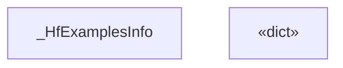
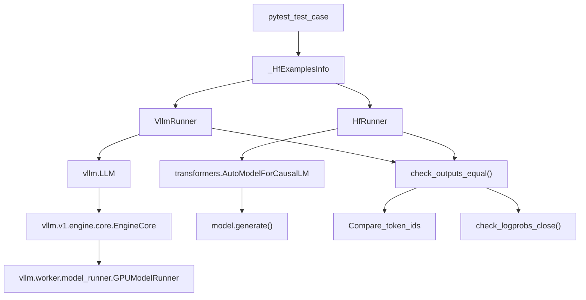
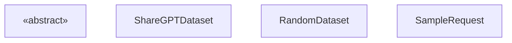

# Model Correctness Validation

Relevant source files

-   [benchmarks/README.md](https://github.com/vllm-project/vllm/blob/7cc302dd/benchmarks/README.md?plain=1)
-   [benchmarks/backend\_request\_func.py](https://github.com/vllm-project/vllm/blob/7cc302dd/benchmarks/backend_request_func.py)
-   [benchmarks/benchmark\_latency.py](https://github.com/vllm-project/vllm/blob/7cc302dd/benchmarks/benchmark_latency.py)
-   [benchmarks/benchmark\_long\_document\_qa\_throughput.py](https://github.com/vllm-project/vllm/blob/7cc302dd/benchmarks/benchmark_long_document_qa_throughput.py)
-   [benchmarks/benchmark\_prefix\_caching.py](https://github.com/vllm-project/vllm/blob/7cc302dd/benchmarks/benchmark_prefix_caching.py)
-   [benchmarks/benchmark\_prioritization.py](https://github.com/vllm-project/vllm/blob/7cc302dd/benchmarks/benchmark_prioritization.py)
-   [benchmarks/benchmark\_serving.py](https://github.com/vllm-project/vllm/blob/7cc302dd/benchmarks/benchmark_serving.py)
-   [benchmarks/benchmark\_serving\_structured\_output.py](https://github.com/vllm-project/vllm/blob/7cc302dd/benchmarks/benchmark_serving_structured_output.py)
-   [benchmarks/benchmark\_throughput.py](https://github.com/vllm-project/vllm/blob/7cc302dd/benchmarks/benchmark_throughput.py)
-   [benchmarks/run\_structured\_output\_benchmark.sh](https://github.com/vllm-project/vllm/blob/7cc302dd/benchmarks/run_structured_output_benchmark.sh)
-   [docs/benchmarking/cli.md](https://github.com/vllm-project/vllm/blob/7cc302dd/docs/benchmarking/cli.md?plain=1)
-   [docs/cli/bench/mm\_processor.md](https://github.com/vllm-project/vllm/blob/7cc302dd/docs/cli/bench/mm_processor.md?plain=1)
-   [docs/models/supported\_models.md](https://github.com/vllm-project/vllm/blob/7cc302dd/docs/models/supported_models.md?plain=1)
-   [examples/offline\_inference/audio\_language.py](https://github.com/vllm-project/vllm/blob/7cc302dd/examples/offline_inference/audio_language.py)
-   [examples/offline\_inference/context\_extension.py](https://github.com/vllm-project/vllm/blob/7cc302dd/examples/offline_inference/context_extension.py)
-   [examples/offline\_inference/spec\_decode.py](https://github.com/vllm-project/vllm/blob/7cc302dd/examples/offline_inference/spec_decode.py)
-   [examples/offline\_inference/vision\_language.py](https://github.com/vllm-project/vllm/blob/7cc302dd/examples/offline_inference/vision_language.py)
-   [examples/offline\_inference/vision\_language\_multi\_image.py](https://github.com/vllm-project/vllm/blob/7cc302dd/examples/offline_inference/vision_language_multi_image.py)
-   [tests/benchmarks/\_\_init\_\_.py](https://github.com/vllm-project/vllm/blob/7cc302dd/tests/benchmarks/__init__.py)
-   [tests/benchmarks/test\_bench\_startup.py](https://github.com/vllm-project/vllm/blob/7cc302dd/tests/benchmarks/test_bench_startup.py)
-   [tests/benchmarks/test\_latency\_cli.py](https://github.com/vllm-project/vllm/blob/7cc302dd/tests/benchmarks/test_latency_cli.py)
-   [tests/benchmarks/test\_random\_dataset.py](https://github.com/vllm-project/vllm/blob/7cc302dd/tests/benchmarks/test_random_dataset.py)
-   [tests/benchmarks/test\_random\_multimodal\_dataset\_video.py](https://github.com/vllm-project/vllm/blob/7cc302dd/tests/benchmarks/test_random_multimodal_dataset_video.py)
-   [tests/benchmarks/test\_serve\_cli.py](https://github.com/vllm-project/vllm/blob/7cc302dd/tests/benchmarks/test_serve_cli.py)
-   [tests/benchmarks/test\_throughput\_cli.py](https://github.com/vllm-project/vllm/blob/7cc302dd/tests/benchmarks/test_throughput_cli.py)
-   [tests/distributed/test\_pipeline\_parallel.py](https://github.com/vllm-project/vllm/blob/7cc302dd/tests/distributed/test_pipeline_parallel.py)
-   [tests/models/language/pooling/test\_nomic\_max\_model\_len.py](https://github.com/vllm-project/vllm/blob/7cc302dd/tests/models/language/pooling/test_nomic_max_model_len.py)
-   [tests/models/multimodal/generation/test\_common.py](https://github.com/vllm-project/vllm/blob/7cc302dd/tests/models/multimodal/generation/test_common.py)
-   [tests/models/multimodal/generation/vlm\_utils/model\_utils.py](https://github.com/vllm-project/vllm/blob/7cc302dd/tests/models/multimodal/generation/vlm_utils/model_utils.py)
-   [tests/models/multimodal/processing/test\_common.py](https://github.com/vllm-project/vllm/blob/7cc302dd/tests/models/multimodal/processing/test_common.py)
-   [tests/models/registry.py](https://github.com/vllm-project/vllm/blob/7cc302dd/tests/models/registry.py)
-   [tests/models/test\_initialization.py](https://github.com/vllm-project/vllm/blob/7cc302dd/tests/models/test_initialization.py)
-   [vllm/benchmarks/datasets.py](https://github.com/vllm-project/vllm/blob/7cc302dd/vllm/benchmarks/datasets.py)
-   [vllm/benchmarks/latency.py](https://github.com/vllm-project/vllm/blob/7cc302dd/vllm/benchmarks/latency.py)
-   [vllm/benchmarks/lib/\_\_init\_\_.py](https://github.com/vllm-project/vllm/blob/7cc302dd/vllm/benchmarks/lib/__init__.py)
-   [vllm/benchmarks/lib/endpoint\_request\_func.py](https://github.com/vllm-project/vllm/blob/7cc302dd/vllm/benchmarks/lib/endpoint_request_func.py)
-   [vllm/benchmarks/lib/ready\_checker.py](https://github.com/vllm-project/vllm/blob/7cc302dd/vllm/benchmarks/lib/ready_checker.py)
-   [vllm/benchmarks/mm\_processor.py](https://github.com/vllm-project/vllm/blob/7cc302dd/vllm/benchmarks/mm_processor.py)
-   [vllm/benchmarks/serve.py](https://github.com/vllm-project/vllm/blob/7cc302dd/vllm/benchmarks/serve.py)
-   [vllm/benchmarks/startup.py](https://github.com/vllm-project/vllm/blob/7cc302dd/vllm/benchmarks/startup.py)
-   [vllm/benchmarks/sweep/serve\_workload.py](https://github.com/vllm-project/vllm/blob/7cc302dd/vllm/benchmarks/sweep/serve_workload.py)
-   [vllm/benchmarks/throughput.py](https://github.com/vllm-project/vllm/blob/7cc302dd/vllm/benchmarks/throughput.py)
-   [vllm/entrypoints/cli/benchmark/mm\_processor.py](https://github.com/vllm-project/vllm/blob/7cc302dd/vllm/entrypoints/cli/benchmark/mm_processor.py)
-   [vllm/model\_executor/models/mistral\_large\_3\_eagle.py](https://github.com/vllm-project/vllm/blob/7cc302dd/vllm/model_executor/models/mistral_large_3_eagle.py)
-   [vllm/model\_executor/models/registry.py](https://github.com/vllm-project/vllm/blob/7cc302dd/vllm/model_executor/models/registry.py)
-   [vllm/transformers\_utils/config.py](https://github.com/vllm-project/vllm/blob/7cc302dd/vllm/transformers_utils/config.py)
-   [vllm/transformers\_utils/configs/\_\_init\_\_.py](https://github.com/vllm-project/vllm/blob/7cc302dd/vllm/transformers_utils/configs/__init__.py)
-   [vllm/transformers\_utils/configs/mistral.py](https://github.com/vllm-project/vllm/blob/7cc302dd/vllm/transformers_utils/configs/mistral.py)
-   [vllm/transformers\_utils/model\_arch\_config\_convertor.py](https://github.com/vllm-project/vllm/blob/7cc302dd/vllm/transformers_utils/model_arch_config_convertor.py)

This document describes vLLM's model correctness validation system, which ensures that models produce accurate outputs compared to reference implementations. For information about the broader test infrastructure and organization, see [12.1 Test Organization and Infrastructure](https://github.com/vllm-project/vllm/blob/7cc302dd/12.1 Test Organization and Infrastructure) For CI pipeline execution details, see [12.2 Buildkite CI Pipelines](https://github.com/vllm-project/vllm/blob/7cc302dd/12.2 Buildkite CI Pipelines)

Model correctness validation focuses on:

-   **Processing correctness**: Verifying that input tokenization and multimodal processing matches reference implementations.
-   **Generation correctness**: Comparing generated text outputs against reference models.
-   **Benchmark-based validation**: Using standard datasets (e.g., ShareGPT, GSM8K) to verify model quality.
-   **Cross-implementation testing**: Validating vLLM models against HuggingFace Transformers implementations.

## Model Test Registry

vLLM maintains a comprehensive test registry that defines test configurations for each supported model architecture. This registry is separate from the model implementation registry and focuses on test metadata and validation requirements.

### Test Configuration Data Structure

The `_HfExamplesInfo` class defines test configuration for each model architecture, including version requirements for the `transformers` library and speculative decoding settings.

Title: Model Test Registry Structure

Sources: [tests/models/registry.py15-185](https://github.com/vllm-project/vllm/blob/7cc302dd/tests/models/registry.py#L15-L185)

### Registry Organization

Models are organized into task-specific registries that map architecture names to test configurations. The registry includes a `MINIMAL_MODEL_ARCH_LIST` used for regression testing to cover representative workloads like causal LM, multimodal, and speculative decoding [tests/models/test\_initialization.py32-45](https://github.com/vllm-project/vllm/blob/7cc302dd/tests/models/test_initialization.py#L32-L45)

| Registry | Purpose | Example Architectures |
| --- | --- | --- |
| `_TEXT_GENERATION_EXAMPLE_MODELS` | Decoder-only text generation models | `AfmoeForCausalLM`, `LlamaForCausalLM`, `Qwen2ForCausalLM` [tests/models/registry.py193-201](https://github.com/vllm-project/vllm/blob/7cc302dd/tests/models/registry.py#L193-L201) |
| `_MULTIMODAL_EXAMPLE_MODELS` | Vision-language and audio-language models | `LlavaForConditionalGeneration`, `UltravoxModel`, `Qwen2_5_VL` [tests/models/registry.py650-713](https://github.com/vllm-project/vllm/blob/7cc302dd/tests/models/registry.py#L650-L713) |
| `_TRANSFORMERS_BACKEND_MODELS` | Models using the Transformers fallback | `XLMRobertaModel`, `BertForSequenceClassification` [tests/models/test\_initialization.py19-45](https://github.com/vllm-project/vllm/blob/7cc302dd/tests/models/test_initialization.py#L19-L45) |

Sources: [tests/models/registry.py187-713](https://github.com/vllm-project/vllm/blob/7cc302dd/tests/models/registry.py#L187-L713) [tests/models/test\_initialization.py32-52](https://github.com/vllm-project/vllm/blob/7cc302dd/tests/models/test_initialization.py#L32-L52)

## Reference Comparison Methodology

Model correctness is validated by comparing vLLM outputs against reference implementations (typically HuggingFace Transformers). This dual-runner approach ensures functional equivalence.

### Test Runner Architecture

Title: vLLM vs HuggingFace Reference Comparison

Sources: [tests/models/test\_initialization.py9-15](https://github.com/vllm-project/vllm/blob/7cc302dd/tests/models/test_initialization.py#L9-L15) [tests/models/multimodal/generation/test\_common.py24-33](https://github.com/vllm-project/vllm/blob/7cc302dd/tests/models/multimodal/generation/test_common.py#L24-L33) [vllm/v1/engine/core.py15](https://github.com/vllm-project/vllm/blob/7cc302dd/vllm/v1/engine/core.py#L15-L15)

### Initialization Validation

Correctness begins with initialization. The `can_initialize` function verifies that models can be loaded into the engine with appropriate `ModelConfig` and `ParallelConfig` [tests/models/test\_initialization.py56-173](https://github.com/vllm-project/vllm/blob/7cc302dd/tests/models/test_initialization.py#L56-L173) It specifically handles platform capabilities, skipping models like `DeepseekV32` if the GPU compute capability is below 9.0 (Hopper) [tests/models/test\_initialization.py112-122](https://github.com/vllm-project/vllm/blob/7cc302dd/tests/models/test_initialization.py#L112-L122)

## Generation Correctness Validation

Generation tests compare actual text output and token sequences between vLLM and reference implementations. These tests cover various architectures including those using specialized kernels like `TRITON_ATTN` [tests/models/test\_initialization.py130-135](https://github.com/vllm-project/vllm/blob/7cc302dd/tests/models/test_initialization.py#L130-L135)

### Multimodal Processing Correctness

For multimodal models (VLMs), validation includes verifying that the `BaseMultiModalProcessor` correctly transforms raw inputs (images/video) into tokens and features that match the `transformers` reference [tests/models/multimodal/processing/test\_common.py22-24](https://github.com/vllm-project/vllm/blob/7cc302dd/tests/models/multimodal/processing/test_common.py#L22-L24)

-   **Video Metadata**: Models like `Qwen3VL` require specific video metadata (FPS, duration) to process temporal data correctly [tests/models/multimodal/processing/test\_common.py34-59](https://github.com/vllm-project/vllm/blob/7cc302dd/tests/models/multimodal/processing/test_common.py#L34-L59)
-   **Patching**: Some models like `GLM-ASR` require specific patches to match text and audio inputs 1:1 during validation [tests/models/multimodal/processing/test\_common.py62-72](https://github.com/vllm-project/vllm/blob/7cc302dd/tests/models/multimodal/processing/test_common.py#L62-L72)

Sources: [tests/models/multimodal/processing/test\_common.py22-72](https://github.com/vllm-project/vllm/blob/7cc302dd/tests/models/multimodal/processing/test_common.py#L22-L72) [tests/models/multimodal/generation/test\_common.py154-162](https://github.com/vllm-project/vllm/blob/7cc302dd/tests/models/multimodal/generation/test_common.py#L154-L162)

### Speculative Decoding Correctness

Speculative decoding (e.g., using `EAGLE` or `ngram` methods) is validated by comparing the output of the speculative engine against a non-speculative baseline. Metrics tracked via the Prometheus endpoint include:

-   `num_draft_tokens`: Total tokens proposed by the draft model [vllm/benchmarks/serve.py100](https://github.com/vllm-project/vllm/blob/7cc302dd/vllm/benchmarks/serve.py#L100-L100)
-   `num_accepted_tokens`: Tokens verified and accepted by the target model [vllm/benchmarks/serve.py101](https://github.com/vllm-project/vllm/blob/7cc302dd/vllm/benchmarks/serve.py#L101-L101)
-   `accepted_per_pos`: Histogram of acceptance based on token position [vllm/benchmarks/serve.py102](https://github.com/vllm-project/vllm/blob/7cc302dd/vllm/benchmarks/serve.py#L102-L102)

Sources: [vllm/benchmarks/serve.py95-160](https://github.com/vllm-project/vllm/blob/7cc302dd/vllm/benchmarks/serve.py#L95-L160)

## Benchmark-Based Validation

vLLM utilizes a dedicated benchmarking suite to validate model performance and correctness at scale.

### Dataset Sampling Framework

The `BenchmarkDataset` class provides a unified interface for sampling requests from various sources like ShareGPT, Sonnet, or synthetic "Random" datasets [vllm/benchmarks/datasets.py87-116](https://github.com/vllm-project/vllm/blob/7cc302dd/vllm/benchmarks/datasets.py#L87-L116)

Title: Benchmark Dataset Abstraction

Sources: [vllm/benchmarks/datasets.py68-116](https://github.com/vllm-project/vllm/blob/7cc302dd/vllm/benchmarks/datasets.py#L68-L116)

### Serving Correctness and Goodput

The `vllm bench serve` command validates the online serving stack. It measures `request_goodput`, which is the fraction of requests that meet specific latency targets [vllm/benchmarks/serve.py171-200](https://github.com/vllm-project/vllm/blob/7cc302dd/vllm/benchmarks/serve.py#L171-L200)

Key metrics calculated in `BenchmarkMetrics`:

-   **TTFT (Time to First Token)**: Latency for the first generated token [vllm/benchmarks/serve.py180-183](https://github.com/vllm-project/vllm/blob/7cc302dd/vllm/benchmarks/serve.py#L180-L183)
-   **TPOT (Time Per Output Token)**: Average latency for subsequent tokens [vllm/benchmarks/serve.py184-187](https://github.com/vllm-project/vllm/blob/7cc302dd/vllm/benchmarks/serve.py#L184-L187)
-   **ITL (Inter-Token Latency)**: Distribution of pauses between tokens [vllm/benchmarks/serve.py188-191](https://github.com/vllm-project/vllm/blob/7cc302dd/vllm/benchmarks/serve.py#L188-L191)

Sources: [vllm/benchmarks/serve.py171-200](https://github.com/vllm-project/vllm/blob/7cc302dd/vllm/benchmarks/serve.py#L171-L200) [vllm/benchmarks/datasets.py68-80](https://github.com/vllm-project/vllm/blob/7cc302dd/vllm/benchmarks/datasets.py#L68-L80)

## Summary of Acceptance Criteria

| Validation Type | Tool/Test | Primary Acceptance Criteria |
| --- | --- | --- |
| **Functional** | `test_models` | Greedy token IDs and logprobs match HF reference [tests/models/multimodal/generation/test\_common.py33-41](https://github.com/vllm-project/vllm/blob/7cc302dd/tests/models/multimodal/generation/test_common.py#L33-L41) |
| **Initialization** | `can_initialize` | Successful engine startup with `load_format="dummy"` [tests/models/test\_initialization.py165-173](https://github.com/vllm-project/vllm/blob/7cc302dd/tests/models/test_initialization.py#L165-L173) |
| **Throughput** | `vllm bench throughput` | Successful completion of offline batch without crashes [vllm/benchmarks/throughput.py47-53](https://github.com/vllm-project/vllm/blob/7cc302dd/vllm/benchmarks/throughput.py#L47-L53) |
| **Serving** | `vllm bench serve` | `success` rate of 100% and positive `goodput` [vllm/benchmarks/serve.py171-177](https://github.com/vllm-project/vllm/blob/7cc302dd/vllm/benchmarks/serve.py#L171-L177) |
| **VLM Processing** | `_test_processing_correctness` | Multi-modal features match reference processor [tests/models/multimodal/processing/test\_common.py193-212](https://github.com/vllm-project/vllm/blob/7cc302dd/tests/models/multimodal/processing/test_common.py#L193-L212) |

Sources: [tests/models/test\_initialization.py](https://github.com/vllm-project/vllm/blob/7cc302dd/tests/models/test_initialization.py) [vllm/benchmarks/serve.py](https://github.com/vllm-project/vllm/blob/7cc302dd/vllm/benchmarks/serve.py) [tests/models/multimodal/processing/test\_common.py](https://github.com/vllm-project/vllm/blob/7cc302dd/tests/models/multimodal/processing/test_common.py)
