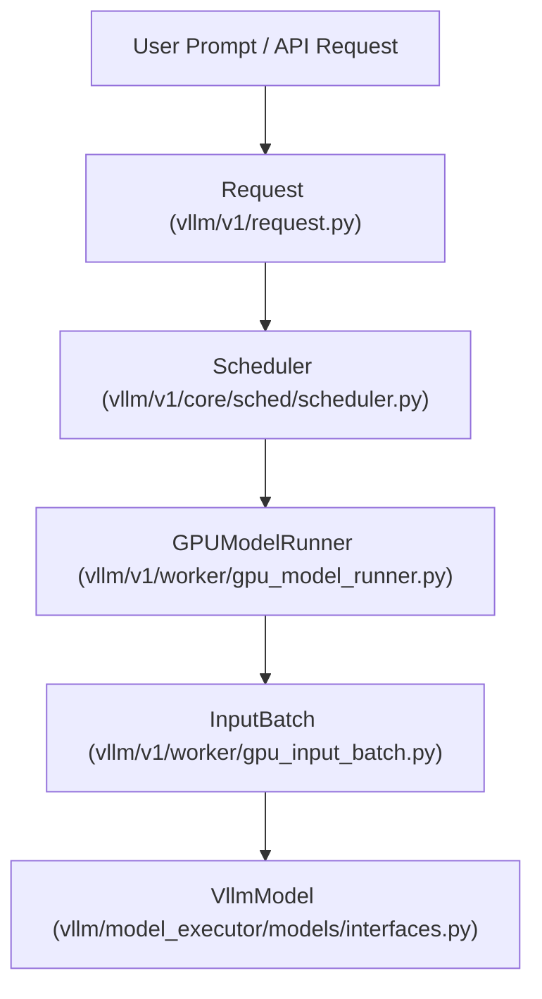
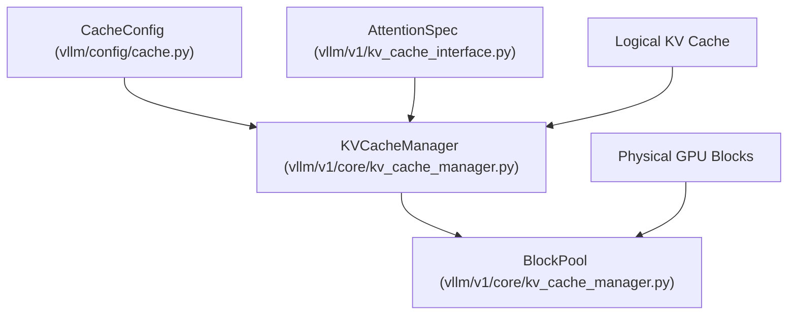

# Glossary

Relevant source files

-   [docs/design/moe\_kernel\_features.md](https://github.com/vllm-project/vllm/blob/7cc302dd/docs/design/moe_kernel_features.md?plain=1)
-   [docs/usage/troubleshooting.md](https://github.com/vllm-project/vllm/blob/7cc302dd/docs/usage/troubleshooting.md?plain=1)
-   [docs/usage/v1\_guide.md](https://github.com/vllm-project/vllm/blob/7cc302dd/docs/usage/v1_guide.md?plain=1)
-   [tests/basic\_correctness/test\_cumem.py](https://github.com/vllm-project/vllm/blob/7cc302dd/tests/basic_correctness/test_cumem.py)
-   [tests/compile/README.md](https://github.com/vllm-project/vllm/blob/7cc302dd/tests/compile/README.md?plain=1)
-   [tests/compile/backend.py](https://github.com/vllm-project/vllm/blob/7cc302dd/tests/compile/backend.py)
-   [tests/compile/fullgraph/\_\_init\_\_.py](https://github.com/vllm-project/vllm/blob/7cc302dd/tests/compile/fullgraph/__init__.py)
-   [tests/compile/fullgraph/test\_basic\_correctness.py](https://github.com/vllm-project/vllm/blob/7cc302dd/tests/compile/fullgraph/test_basic_correctness.py)
-   [tests/compile/fullgraph/test\_full\_cudagraph.py](https://github.com/vllm-project/vllm/blob/7cc302dd/tests/compile/fullgraph/test_full_cudagraph.py)
-   [tests/compile/fullgraph/test\_full\_graph.py](https://github.com/vllm-project/vllm/blob/7cc302dd/tests/compile/fullgraph/test_full_graph.py)
-   [tests/compile/test\_aot\_compile.py](https://github.com/vllm-project/vllm/blob/7cc302dd/tests/compile/test_aot_compile.py)
-   [tests/compile/test\_compile\_ranges.py](https://github.com/vllm-project/vllm/blob/7cc302dd/tests/compile/test_compile_ranges.py)
-   [tests/compile/test\_config.py](https://github.com/vllm-project/vllm/blob/7cc302dd/tests/compile/test_config.py)
-   [tests/compile/test\_graph\_partition.py](https://github.com/vllm-project/vllm/blob/7cc302dd/tests/compile/test_graph_partition.py)
-   [tests/compile/test\_structured\_logging.py](https://github.com/vllm-project/vllm/blob/7cc302dd/tests/compile/test_structured_logging.py)
-   [tests/engine/test\_arg\_utils.py](https://github.com/vllm-project/vllm/blob/7cc302dd/tests/engine/test_arg_utils.py)
-   [tests/kernels/moe/modular\_kernel\_tools/mk\_objects.py](https://github.com/vllm-project/vllm/blob/7cc302dd/tests/kernels/moe/modular_kernel_tools/mk_objects.py)
-   [tests/model\_executor/test\_eagle\_quantization.py](https://github.com/vllm-project/vllm/blob/7cc302dd/tests/model_executor/test_eagle_quantization.py)
-   [tests/test\_config.py](https://github.com/vllm-project/vllm/blob/7cc302dd/tests/test_config.py)
-   [tests/utils.py](https://github.com/vllm-project/vllm/blob/7cc302dd/tests/utils.py)
-   [tests/v1/core/test\_kv\_cache\_utils.py](https://github.com/vllm-project/vllm/blob/7cc302dd/tests/v1/core/test_kv_cache_utils.py)
-   [tests/v1/core/test\_prefix\_caching.py](https://github.com/vllm-project/vllm/blob/7cc302dd/tests/v1/core/test_prefix_caching.py)
-   [tests/v1/core/test\_scheduler.py](https://github.com/vllm-project/vllm/blob/7cc302dd/tests/v1/core/test_scheduler.py)
-   [tests/v1/core/test\_single\_type\_kv\_cache\_manager.py](https://github.com/vllm-project/vllm/blob/7cc302dd/tests/v1/core/test_single_type_kv_cache_manager.py)
-   [tests/v1/core/utils.py](https://github.com/vllm-project/vllm/blob/7cc302dd/tests/v1/core/utils.py)
-   [tests/v1/e2e/spec\_decode/test\_spec\_decode.py](https://github.com/vllm-project/vllm/blob/7cc302dd/tests/v1/e2e/spec_decode/test_spec_decode.py)
-   [tests/v1/executor/test\_executor.py](https://github.com/vllm-project/vllm/blob/7cc302dd/tests/v1/executor/test_executor.py)
-   [tests/v1/kv\_connector/unit/test\_output\_aggregator.py](https://github.com/vllm-project/vllm/blob/7cc302dd/tests/v1/kv_connector/unit/test_output_aggregator.py)
-   [tests/v1/spec\_decode/test\_eagle.py](https://github.com/vllm-project/vllm/blob/7cc302dd/tests/v1/spec_decode/test_eagle.py)
-   [tests/v1/spec\_decode/test\_mtp.py](https://github.com/vllm-project/vllm/blob/7cc302dd/tests/v1/spec_decode/test_mtp.py)
-   [tests/v1/worker/test\_gpu\_input\_batch.py](https://github.com/vllm-project/vllm/blob/7cc302dd/tests/v1/worker/test_gpu_input_batch.py)
-   [tests/v1/worker/test\_gpu\_model\_runner.py](https://github.com/vllm-project/vllm/blob/7cc302dd/tests/v1/worker/test_gpu_model_runner.py)
-   [vllm/compilation/backends.py](https://github.com/vllm-project/vllm/blob/7cc302dd/vllm/compilation/backends.py)
-   [vllm/compilation/caching.py](https://github.com/vllm-project/vllm/blob/7cc302dd/vllm/compilation/caching.py)
-   [vllm/compilation/compiler\_interface.py](https://github.com/vllm-project/vllm/blob/7cc302dd/vllm/compilation/compiler_interface.py)
-   [vllm/compilation/counter.py](https://github.com/vllm-project/vllm/blob/7cc302dd/vllm/compilation/counter.py)
-   [vllm/compilation/decorators.py](https://github.com/vllm-project/vllm/blob/7cc302dd/vllm/compilation/decorators.py)
-   [vllm/compilation/monitor.py](https://github.com/vllm-project/vllm/blob/7cc302dd/vllm/compilation/monitor.py)
-   [vllm/compilation/piecewise\_backend.py](https://github.com/vllm-project/vllm/blob/7cc302dd/vllm/compilation/piecewise_backend.py)
-   [vllm/compilation/wrapper.py](https://github.com/vllm-project/vllm/blob/7cc302dd/vllm/compilation/wrapper.py)
-   [vllm/config/\_\_init\_\_.py](https://github.com/vllm-project/vllm/blob/7cc302dd/vllm/config/__init__.py)
-   [vllm/config/compilation.py](https://github.com/vllm-project/vllm/blob/7cc302dd/vllm/config/compilation.py)
-   [vllm/config/model.py](https://github.com/vllm-project/vllm/blob/7cc302dd/vllm/config/model.py)
-   [vllm/config/speculative.py](https://github.com/vllm-project/vllm/blob/7cc302dd/vllm/config/speculative.py)
-   [vllm/config/vllm.py](https://github.com/vllm-project/vllm/blob/7cc302dd/vllm/config/vllm.py)
-   [vllm/distributed/device\_communicators/all2all.py](https://github.com/vllm-project/vllm/blob/7cc302dd/vllm/distributed/device_communicators/all2all.py)
-   [vllm/distributed/device\_communicators/base\_device\_communicator.py](https://github.com/vllm-project/vllm/blob/7cc302dd/vllm/distributed/device_communicators/base_device_communicator.py)
-   [vllm/distributed/device\_communicators/cuda\_communicator.py](https://github.com/vllm-project/vllm/blob/7cc302dd/vllm/distributed/device_communicators/cuda_communicator.py)
-   [vllm/distributed/device\_communicators/pynccl.py](https://github.com/vllm-project/vllm/blob/7cc302dd/vllm/distributed/device_communicators/pynccl.py)
-   [vllm/distributed/elastic\_ep/elastic\_execute.py](https://github.com/vllm-project/vllm/blob/7cc302dd/vllm/distributed/elastic_ep/elastic_execute.py)
-   [vllm/distributed/elastic\_ep/elastic\_state.py](https://github.com/vllm-project/vllm/blob/7cc302dd/vllm/distributed/elastic_ep/elastic_state.py)
-   [vllm/distributed/parallel\_state.py](https://github.com/vllm-project/vllm/blob/7cc302dd/vllm/distributed/parallel_state.py)
-   [vllm/distributed/utils.py](https://github.com/vllm-project/vllm/blob/7cc302dd/vllm/distributed/utils.py)
-   [vllm/engine/arg\_utils.py](https://github.com/vllm-project/vllm/blob/7cc302dd/vllm/engine/arg_utils.py)
-   [vllm/env\_override.py](https://github.com/vllm-project/vllm/blob/7cc302dd/vllm/env_override.py)
-   [vllm/envs.py](https://github.com/vllm-project/vllm/blob/7cc302dd/vllm/envs.py)
-   [vllm/model\_executor/layers/fused\_moe/all2all\_utils.py](https://github.com/vllm-project/vllm/blob/7cc302dd/vllm/model_executor/layers/fused_moe/all2all_utils.py)
-   [vllm/model\_executor/layers/fused\_moe/batched\_deep\_gemm\_moe.py](https://github.com/vllm-project/vllm/blob/7cc302dd/vllm/model_executor/layers/fused_moe/batched_deep_gemm_moe.py)
-   [vllm/model\_executor/layers/fused\_moe/config.py](https://github.com/vllm-project/vllm/blob/7cc302dd/vllm/model_executor/layers/fused_moe/config.py)
-   [vllm/model\_executor/layers/fused\_moe/cutlass\_moe.py](https://github.com/vllm-project/vllm/blob/7cc302dd/vllm/model_executor/layers/fused_moe/cutlass_moe.py)
-   [vllm/model\_executor/layers/fused\_moe/deep\_gemm\_moe.py](https://github.com/vllm-project/vllm/blob/7cc302dd/vllm/model_executor/layers/fused_moe/deep_gemm_moe.py)
-   [vllm/model\_executor/layers/fused\_moe/fused\_batched\_moe.py](https://github.com/vllm-project/vllm/blob/7cc302dd/vllm/model_executor/layers/fused_moe/fused_batched_moe.py)
-   [vllm/model\_executor/layers/fused\_moe/fused\_marlin\_moe.py](https://github.com/vllm-project/vllm/blob/7cc302dd/vllm/model_executor/layers/fused_moe/fused_marlin_moe.py)
-   [vllm/model\_executor/layers/fused\_moe/fused\_moe.py](https://github.com/vllm-project/vllm/blob/7cc302dd/vllm/model_executor/layers/fused_moe/fused_moe.py)
-   [vllm/model\_executor/layers/fused\_moe/gpt\_oss\_triton\_kernels\_moe.py](https://github.com/vllm-project/vllm/blob/7cc302dd/vllm/model_executor/layers/fused_moe/gpt_oss_triton_kernels_moe.py)
-   [vllm/model\_executor/layers/fused\_moe/layer.py](https://github.com/vllm-project/vllm/blob/7cc302dd/vllm/model_executor/layers/fused_moe/layer.py)
-   [vllm/model\_executor/layers/fused\_moe/modular\_kernel.py](https://github.com/vllm-project/vllm/blob/7cc302dd/vllm/model_executor/layers/fused_moe/modular_kernel.py)
-   [vllm/model\_executor/layers/fused\_moe/rocm\_aiter\_fused\_moe.py](https://github.com/vllm-project/vllm/blob/7cc302dd/vllm/model_executor/layers/fused_moe/rocm_aiter_fused_moe.py)
-   [vllm/model\_executor/layers/fused\_moe/triton\_deep\_gemm\_moe.py](https://github.com/vllm-project/vllm/blob/7cc302dd/vllm/model_executor/layers/fused_moe/triton_deep_gemm_moe.py)
-   [vllm/model\_executor/layers/fused\_moe/utils.py](https://github.com/vllm-project/vllm/blob/7cc302dd/vllm/model_executor/layers/fused_moe/utils.py)
-   [vllm/model\_executor/layers/quantization/awq\_marlin.py](https://github.com/vllm-project/vllm/blob/7cc302dd/vllm/model_executor/layers/quantization/awq_marlin.py)
-   [vllm/model\_executor/layers/quantization/bitsandbytes.py](https://github.com/vllm-project/vllm/blob/7cc302dd/vllm/model_executor/layers/quantization/bitsandbytes.py)
-   [vllm/model\_executor/layers/quantization/compressed\_tensors/compressed\_tensors\_moe.py](https://github.com/vllm-project/vllm/blob/7cc302dd/vllm/model_executor/layers/quantization/compressed_tensors/compressed_tensors_moe.py)
-   [vllm/model\_executor/layers/quantization/experts\_int8.py](https://github.com/vllm-project/vllm/blob/7cc302dd/vllm/model_executor/layers/quantization/experts_int8.py)
-   [vllm/model\_executor/layers/quantization/fp8.py](https://github.com/vllm-project/vllm/blob/7cc302dd/vllm/model_executor/layers/quantization/fp8.py)
-   [vllm/model\_executor/layers/quantization/gguf.py](https://github.com/vllm-project/vllm/blob/7cc302dd/vllm/model_executor/layers/quantization/gguf.py)
-   [vllm/model\_executor/layers/quantization/gptq\_marlin.py](https://github.com/vllm-project/vllm/blob/7cc302dd/vllm/model_executor/layers/quantization/gptq_marlin.py)
-   [vllm/model\_executor/layers/quantization/modelopt.py](https://github.com/vllm-project/vllm/blob/7cc302dd/vllm/model_executor/layers/quantization/modelopt.py)
-   [vllm/model\_executor/layers/quantization/moe\_wna16.py](https://github.com/vllm-project/vllm/blob/7cc302dd/vllm/model_executor/layers/quantization/moe_wna16.py)
-   [vllm/model\_executor/layers/quantization/mxfp4.py](https://github.com/vllm-project/vllm/blob/7cc302dd/vllm/model_executor/layers/quantization/mxfp4.py)
-   [vllm/model\_executor/layers/quantization/quark/quark\_moe.py](https://github.com/vllm-project/vllm/blob/7cc302dd/vllm/model_executor/layers/quantization/quark/quark_moe.py)
-   [vllm/model\_executor/models/deepseek\_eagle.py](https://github.com/vllm-project/vllm/blob/7cc302dd/vllm/model_executor/models/deepseek_eagle.py)
-   [vllm/model\_executor/models/llama.py](https://github.com/vllm-project/vllm/blob/7cc302dd/vllm/model_executor/models/llama.py)
-   [vllm/model\_executor/models/llama4\_eagle.py](https://github.com/vllm-project/vllm/blob/7cc302dd/vllm/model_executor/models/llama4_eagle.py)
-   [vllm/model\_executor/models/llama\_eagle.py](https://github.com/vllm-project/vllm/blob/7cc302dd/vllm/model_executor/models/llama_eagle.py)
-   [vllm/model\_executor/models/llama\_eagle3.py](https://github.com/vllm-project/vllm/blob/7cc302dd/vllm/model_executor/models/llama_eagle3.py)
-   [vllm/model\_executor/models/qwen2.py](https://github.com/vllm-project/vllm/blob/7cc302dd/vllm/model_executor/models/qwen2.py)
-   [vllm/model\_executor/models/qwen3.py](https://github.com/vllm-project/vllm/blob/7cc302dd/vllm/model_executor/models/qwen3.py)
-   [vllm/model\_executor/models/utils.py](https://github.com/vllm-project/vllm/blob/7cc302dd/vllm/model_executor/models/utils.py)
-   [vllm/transformers\_utils/configs/eagle.py](https://github.com/vllm-project/vllm/blob/7cc302dd/vllm/transformers_utils/configs/eagle.py)
-   [vllm/transformers\_utils/configs/extract\_hidden\_states.py](https://github.com/vllm-project/vllm/blob/7cc302dd/vllm/transformers_utils/configs/extract_hidden_states.py)
-   [vllm/transformers\_utils/configs/medusa.py](https://github.com/vllm-project/vllm/blob/7cc302dd/vllm/transformers_utils/configs/medusa.py)
-   [vllm/utils/mem\_utils.py](https://github.com/vllm-project/vllm/blob/7cc302dd/vllm/utils/mem_utils.py)
-   [vllm/v1/core/block\_pool.py](https://github.com/vllm-project/vllm/blob/7cc302dd/vllm/v1/core/block_pool.py)
-   [vllm/v1/core/kv\_cache\_coordinator.py](https://github.com/vllm-project/vllm/blob/7cc302dd/vllm/v1/core/kv_cache_coordinator.py)
-   [vllm/v1/core/kv\_cache\_manager.py](https://github.com/vllm-project/vllm/blob/7cc302dd/vllm/v1/core/kv_cache_manager.py)
-   [vllm/v1/core/kv\_cache\_utils.py](https://github.com/vllm-project/vllm/blob/7cc302dd/vllm/v1/core/kv_cache_utils.py)
-   [vllm/v1/core/sched/output.py](https://github.com/vllm-project/vllm/blob/7cc302dd/vllm/v1/core/sched/output.py)
-   [vllm/v1/core/sched/scheduler.py](https://github.com/vllm-project/vllm/blob/7cc302dd/vllm/v1/core/sched/scheduler.py)
-   [vllm/v1/core/single\_type\_kv\_cache\_manager.py](https://github.com/vllm-project/vllm/blob/7cc302dd/vllm/v1/core/single_type_kv_cache_manager.py)
-   [vllm/v1/engine/\_\_init\_\_.py](https://github.com/vllm-project/vllm/blob/7cc302dd/vllm/v1/engine/__init__.py)
-   [vllm/v1/executor/abstract.py](https://github.com/vllm-project/vllm/blob/7cc302dd/vllm/v1/executor/abstract.py)
-   [vllm/v1/executor/multiproc\_executor.py](https://github.com/vllm-project/vllm/blob/7cc302dd/vllm/v1/executor/multiproc_executor.py)
-   [vllm/v1/executor/ray\_executor.py](https://github.com/vllm-project/vllm/blob/7cc302dd/vllm/v1/executor/ray_executor.py)
-   [vllm/v1/executor/ray\_utils.py](https://github.com/vllm-project/vllm/blob/7cc302dd/vllm/v1/executor/ray_utils.py)
-   [vllm/v1/executor/uniproc\_executor.py](https://github.com/vllm-project/vllm/blob/7cc302dd/vllm/v1/executor/uniproc_executor.py)
-   [vllm/v1/kv\_cache\_interface.py](https://github.com/vllm-project/vllm/blob/7cc302dd/vllm/v1/kv_cache_interface.py)
-   [vllm/v1/request.py](https://github.com/vllm-project/vllm/blob/7cc302dd/vllm/v1/request.py)
-   [vllm/v1/spec\_decode/draft\_model.py](https://github.com/vllm-project/vllm/blob/7cc302dd/vllm/v1/spec_decode/draft_model.py)
-   [vllm/v1/spec\_decode/eagle.py](https://github.com/vllm-project/vllm/blob/7cc302dd/vllm/v1/spec_decode/eagle.py)
-   [vllm/v1/spec\_decode/utils.py](https://github.com/vllm-project/vllm/blob/7cc302dd/vllm/v1/spec_decode/utils.py)
-   [vllm/v1/worker/block\_table.py](https://github.com/vllm-project/vllm/blob/7cc302dd/vllm/v1/worker/block_table.py)
-   [vllm/v1/worker/gpu\_input\_batch.py](https://github.com/vllm-project/vllm/blob/7cc302dd/vllm/v1/worker/gpu_input_batch.py)
-   [vllm/v1/worker/gpu\_model\_runner.py](https://github.com/vllm-project/vllm/blob/7cc302dd/vllm/v1/worker/gpu_model_runner.py)
-   [vllm/v1/worker/gpu\_worker.py](https://github.com/vllm-project/vllm/blob/7cc302dd/vllm/v1/worker/gpu_worker.py)
-   [vllm/v1/worker/utils.py](https://github.com/vllm-project/vllm/blob/7cc302dd/vllm/v1/worker/utils.py)
-   [vllm/v1/worker/worker\_base.py](https://github.com/vllm-project/vllm/blob/7cc302dd/vllm/v1/worker/worker_base.py)

This glossary provides definitions for codebase-specific terms, jargon, and domain concepts used throughout vLLM. It is intended for onboarding engineers to bridge the gap between high-level concepts and their technical implementation.

---

## A

### Attention Backend

The specific implementation of the attention mechanism (e.g., FlashAttention, FlashInfer, Triton). vLLM selects a backend based on the hardware (CUDA vs. ROCm), model architecture, and optimization settings.

-   **Implementation**: Defined by the `AttentionBackend` interface [vllm/v1/attention/backend.py115](https://github.com/vllm-project/vllm/blob/7cc302dd/vllm/v1/attention/backend.py#L115-L115)
-   **Registry**: Backends are selected via `AttentionBackendEnum` [vllm/v1/attention/backends/registry.py110](https://github.com/vllm-project/vllm/blob/7cc302dd/vllm/v1/attention/backends/registry.py#L110-L110)
-   **Metadata**: `AttentionMetadata` encapsulates batch-specific info like sequence lengths and block tables [vllm/v1/attention/backend.py117-121](https://github.com/vllm-project/vllm/blob/7cc302dd/vllm/v1/attention/backend.py#L117-L121)

## B

### BlockPool

The physical memory management unit for KV caches. It manages a pool of fixed-size memory blocks (typically 16 tokens) allocated on the GPU or CPU.

-   **Implementation**: Managed within `KVCacheManager` [vllm/v1/core/kv\_cache\_manager.py39](https://github.com/vllm-project/vllm/blob/7cc302dd/vllm/v1/core/kv_cache_manager.py#L39-L39)
-   **Configuration**: Block size and count are governed by `CacheConfig` [vllm/config/cache.py35](https://github.com/vllm-project/vllm/blob/7cc302dd/vllm/config/cache.py#L35-L35)

## C

### CompilationConfig

A configuration object that controls how `torch.compile` and Dynamo are applied to the model. It defines optimization levels (O0-O3) and custom operator fusions.

-   **Definition**: `CompilationConfig` class [vllm/config/compilation.py104](https://github.com/vllm-project/vllm/blob/7cc302dd/vllm/config/compilation.py#L104-L104)
-   **Optimization Levels**: `OptimizationLevel` enum [vllm/config/vllm.py67-79](https://github.com/vllm-project/vllm/blob/7cc302dd/vllm/config/vllm.py#L67-L79)
-   **Custom Ops**: Controls fusions like `fuse_norm_quant` or `fuse_act_quant` [vllm/config/compilation.py119-122](https://github.com/vllm-project/vllm/blob/7cc302dd/vllm/config/compilation.py#L119-L122)

### CUDA Graph

A feature that allows capturing a sequence of CUDA kernels and replaying them with minimal CPU overhead. vLLM uses "Piecewise" and "Full" CUDA graphs to accelerate the decode phase.

-   **Dispatcher**: `CudagraphDispatcher` manages the capture and replay logic [vllm/v1/cudagraph\_dispatcher.py130](https://github.com/vllm-project/vllm/blob/7cc302dd/vllm/v1/cudagraph_dispatcher.py#L130-L130)
-   **Modes**: Defined in `CUDAGraphMode` (NONE, PIECEWISE, FULL) [vllm/config/compilation.py51-62](https://github.com/vllm-project/vllm/blob/7cc302dd/vllm/config/compilation.py#L51-L62)

## D

### DCP (Decode Context Parallelism)

A parallelism strategy that splits the context of a single request across multiple GPUs during the decode phase to handle very long sequences or increase throughput.

-   **Group**: Accessed via `get_dcp_group()` [vllm/v1/worker/gpu\_model\_runner.py41](https://github.com/vllm-project/vllm/blob/7cc302dd/vllm/v1/worker/gpu_model_runner.py#L41-L41)
-   **Metadata**: Local sequence lengths are calculated in `get_dcp_local_seq_lens` [vllm/v1/worker/gpu\_model\_runner.py126](https://github.com/vllm-project/vllm/blob/7cc302dd/vllm/v1/worker/gpu_model_runner.py#L126-L126)

## E

### EngineCore

The central orchestration layer in V1 that coordinates the scheduler, executors, and output processing.

-   **Implementation**: Interfaces with the scheduler [vllm/v1/core/sched/scheduler.py67](https://github.com/vllm-project/vllm/blob/7cc302dd/vllm/v1/core/sched/scheduler.py#L67-L67)
-   **Outputs**: Produces `EngineCoreOutput` containing generated tokens and metadata [vllm/v1/core/sched/scheduler.py54](https://github.com/vllm-project/vllm/blob/7cc302dd/vllm/v1/core/sched/scheduler.py#L54-L54)

### EPLB (Expert Parallel Load Balancing)

A mechanism to balance the workload across experts in Mixture-of-Experts (MoE) models, preventing hardware idling on specific ranks.

-   **State**: Tracked via `EplbState` [vllm/v1/worker/gpu\_model\_runner.py37](https://github.com/vllm-project/vllm/blob/7cc302dd/vllm/v1/worker/gpu_model_runner.py#L37-L37)
-   **Integration**: Used in `FusedMoE` layers [vllm/model\_executor/layers/fused\_moe/layer.py20](https://github.com/vllm-project/vllm/blob/7cc302dd/vllm/model_executor/layers/fused_moe/layer.py#L20-L20)

## F

### FusedMoE

An optimized implementation of the Mixture-of-Experts layer that fuses the router, permutation, and expert GEMMs into a minimal number of kernels.

-   **Main Class**: `FusedMoE` [vllm/model\_executor/layers/fused\_moe/layer.py21-22](https://github.com/vllm-project/vllm/blob/7cc302dd/vllm/model_executor/layers/fused_moe/layer.py#L21-L22)
-   **Backends**: Supports multiple backends like `DeepGemm`, `Triton`, and `Cutlass` [vllm/model\_executor/layers/fused\_moe/layer.py30-47](https://github.com/vllm-project/vllm/blob/7cc302dd/vllm/model_executor/layers/fused_moe/layer.py#L30-L47)
-   **Quantization**: Supports FP8, GPTQ, and AWQ via specialized methods [vllm/model\_executor/layers/fused\_moe/fused\_moe.py78](https://github.com/vllm-project/vllm/blob/7cc302dd/vllm/model_executor/layers/fused_moe/fused_moe.py#L78-L78)

## G

### GPUModelRunner

The component responsible for preparing inputs (tensors) and executing the model forward pass on the GPU. It bridges the Scheduler's high-level requests to low-level CUDA kernels.

-   **Implementation**: `GPUModelRunner` [vllm/v1/worker/gpu\_model\_runner.py188](https://github.com/vllm-project/vllm/blob/7cc302dd/vllm/v1/worker/gpu_model_runner.py#L188-L188)
-   **Input Batching**: Uses `InputBatch` to manage the state of the current execution batch [vllm/v1/worker/gpu\_model\_runner.py186](https://github.com/vllm-project/vllm/blob/7cc302dd/vllm/v1/worker/gpu_model_runner.py#L186-L186)

## I

### InputBatch

A container for all data required for a single model forward pass, including token IDs, position IDs, and attention metadata.

-   **Implementation**: `InputBatch` class [vllm/v1/worker/gpu\_input\_batch.py186](https://github.com/vllm-project/vllm/blob/7cc302dd/vllm/v1/worker/gpu_input_batch.py#L186-L186)
-   **State**: Tracks `CachedRequestState` for each request in the batch [vllm/v1/worker/gpu\_input\_batch.py186](https://github.com/vllm-project/vllm/blob/7cc302dd/vllm/v1/worker/gpu_input_batch.py#L186-L186)

## K

### KV Cache Manager

The subsystem that manages the allocation, deallocation, and sharing (prefix caching) of Key-Value cache blocks.

-   **Core Logic**: `KVCacheManager` [vllm/v1/core/kv\_cache\_manager.py39](https://github.com/vllm-project/vllm/blob/7cc302dd/vllm/v1/core/kv_cache_manager.py#L39-L39)
-   **Metrics**: Collected via `KVCacheMetricsCollector` [vllm/v1/core/sched/scheduler.py89](https://github.com/vllm-project/vllm/blob/7cc302dd/vllm/v1/core/sched/scheduler.py#L89-L89)

## P

### Prefix Caching

An optimization that allows different requests to share KV cache blocks for common prefixes (e.g., system prompts).

-   **Hashing**: Uses `PrefixCachingHashAlgo` to identify shared prefixes [vllm/config/cache.py70](https://github.com/vllm-project/vllm/blob/7cc302dd/vllm/config/cache.py#L70-L70)
-   **Stats**: Tracked in `PrefixCacheStats` [vllm/v1/core/sched/scheduler.py57](https://github.com/vllm-project/vllm/blob/7cc302dd/vllm/v1/core/sched/scheduler.py#L57-L57)

## S

### Speculative Decoding

A technique where a smaller "proposer" model (or algorithm) predicts multiple future tokens, which are then validated in parallel by the large "target" model.

-   **Proposers**: Includes `EagleProposer` [vllm/v1/spec\_decode/eagle.py59](https://github.com/vllm-project/vllm/blob/7cc302dd/vllm/v1/spec_decode/eagle.py#L59-L59) `NgramProposerGPU` [vllm/v1/worker/gpu\_model\_runner.py168](https://github.com/vllm-project/vllm/blob/7cc302dd/vllm/v1/worker/gpu_model_runner.py#L168-L168) and `DraftModelProposer` [vllm/v1/worker/gpu\_model\_runner.py163](https://github.com/vllm-project/vllm/blob/7cc302dd/vllm/v1/worker/gpu_model_runner.py#L163-L163)
-   **Metadata**: `SpecDecodeMetadata` [vllm/v1/worker/gpu\_model\_runner.py167](https://github.com/vllm-project/vllm/blob/7cc302dd/vllm/v1/worker/gpu_model_runner.py#L167-L167)

---

## Diagrams: Mapping Concepts to Code

### Request Flow: Natural Language to Execution

This diagram bridges the conceptual "Request" to the specific code entities that handle it through the pipeline.

*Sources: [vllm/v1/request.py59](https://github.com/vllm-project/vllm/blob/7cc302dd/vllm/v1/request.py#L59-L59) [vllm/v1/core/sched/scheduler.py67](https://github.com/vllm-project/vllm/blob/7cc302dd/vllm/v1/core/sched/scheduler.py#L67-L67) [vllm/v1/worker/gpu\_model\_runner.py188](https://github.com/vllm-project/vllm/blob/7cc302dd/vllm/v1/worker/gpu_model_runner.py#L188-L188) [vllm/v1/worker/gpu\_input\_batch.py186](https://github.com/vllm-project/vllm/blob/7cc302dd/vllm/v1/worker/gpu_input_batch.py#L186-L186) [vllm/model\_executor/models/interfaces.py68](https://github.com/vllm-project/vllm/blob/7cc302dd/vllm/model_executor/models/interfaces.py#L68-L68)*

### Memory Management: Concepts to Entities

This diagram maps the abstract concept of "KV Memory" to the actual classes and configurations that manage it.

*Sources: [vllm/config/cache.py35](https://github.com/vllm-project/vllm/blob/7cc302dd/vllm/config/cache.py#L35-L35) [vllm/v1/core/kv\_cache\_manager.py39](https://github.com/vllm-project/vllm/blob/7cc302dd/vllm/v1/core/kv_cache_manager.py#L39-L39) [vllm/v1/kv\_cache\_interface.py132](https://github.com/vllm-project/vllm/blob/7cc302dd/vllm/v1/kv_cache_interface.py#L132-L132)*

---

## Technical Terms Table

| Term | Definition | Code Pointer |
| --- | --- | --- |
| **TP (Tensor Parallelism)** | Sharding model weights across multiple GPUs within a node. | `ParallelConfig.tensor_parallel_size` [vllm/config/parallel.py43](https://github.com/vllm-project/vllm/blob/7cc302dd/vllm/config/parallel.py#L43-L43) |
| **PP (Pipeline Parallelism)** | Splitting model layers across different GPUs. | `ParallelConfig.pipeline_parallel_size` [vllm/config/parallel.py43](https://github.com/vllm-project/vllm/blob/7cc302dd/vllm/config/parallel.py#L43-L43) |
| **LoRA (Low-Rank Adaptation)** | Efficiently fine-tuning models by adding small trainable matrices. | `LoRAModelRunnerMixin` [vllm/v1/worker/gpu\_model\_runner.py189](https://github.com/vllm-project/vllm/blob/7cc302dd/vllm/v1/worker/gpu_model_runner.py#L189-L189) |
| **SamplingParams** | Parameters governing token selection (temperature, top-p, etc.). | `vllm/sampling_params.py` [vllm/v1/worker/gpu\_model\_runner.py101](https://github.com/vllm-project/vllm/blob/7cc302dd/vllm/v1/worker/gpu_model_runner.py#L101-L101) |
| **Worker** | A process that manages a single GPU and executes model operations. | `Worker` class [vllm/v1/worker/gpu\_worker.py105](https://github.com/vllm-project/vllm/blob/7cc302dd/vllm/v1/worker/gpu_worker.py#L105-L105) |
| **VllmConfig** | The root configuration object containing all sub-configs (Model, Parallel, etc.). | `VllmConfig` class [vllm/config/vllm.py49](https://github.com/vllm-project/vllm/blob/7cc302dd/vllm/config/vllm.py#L49-L49) |
| **FlashInfer** | A high-performance attention and sampling library used as a backend. | `vllm/v1/attention/backends/flashinfer.py` [vllm/config/vllm.py119](https://github.com/vllm-project/vllm/blob/7cc302dd/vllm/config/vllm.py#L119-L119) |
| **MLA (Multi-Latent Attention)** | A memory-efficient attention mechanism (used in DeepSeek models). | `MLAAttention` [vllm/v1/worker/gpu\_model\_runner.py54](https://github.com/vllm-project/vllm/blob/7cc302dd/vllm/v1/worker/gpu_model_runner.py#L54-L54) |

*Sources: [vllm/config/vllm.py49](https://github.com/vllm-project/vllm/blob/7cc302dd/vllm/config/vllm.py#L49-L49) [vllm/v1/worker/gpu\_worker.py105](https://github.com/vllm-project/vllm/blob/7cc302dd/vllm/v1/worker/gpu_worker.py#L105-L105) [vllm/model\_executor/layers/attention.py54](https://github.com/vllm-project/vllm/blob/7cc302dd/vllm/model_executor/layers/attention.py#L54-L54) [vllm/config/parallel.py43](https://github.com/vllm-project/vllm/blob/7cc302dd/vllm/config/parallel.py#L43-L43)*
