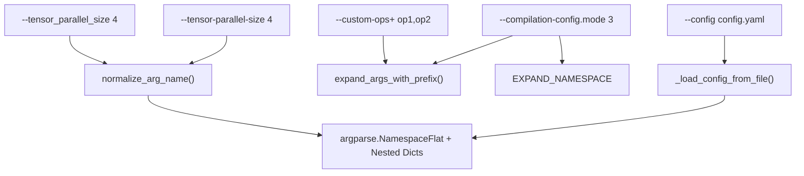

# Configuration and Initialization

Relevant source files

-   [examples/online\_serving/kv\_events\_subscriber.py](https://github.com/vllm-project/vllm/blob/7cc302dd/examples/online_serving/kv_events_subscriber.py)
-   [tests/compile/test\_aot\_compile.py](https://github.com/vllm-project/vllm/blob/7cc302dd/tests/compile/test_aot_compile.py)
-   [tests/compile/test\_compile\_ranges.py](https://github.com/vllm-project/vllm/blob/7cc302dd/tests/compile/test_compile_ranges.py)
-   [tests/compile/test\_config.py](https://github.com/vllm-project/vllm/blob/7cc302dd/tests/compile/test_config.py)
-   [tests/compile/test\_graph\_partition.py](https://github.com/vllm-project/vllm/blob/7cc302dd/tests/compile/test_graph_partition.py)
-   [tests/compile/test\_structured\_logging.py](https://github.com/vllm-project/vllm/blob/7cc302dd/tests/compile/test_structured_logging.py)
-   [tests/distributed/conftest.py](https://github.com/vllm-project/vllm/blob/7cc302dd/tests/distributed/conftest.py)
-   [tests/distributed/test\_events.py](https://github.com/vllm-project/vllm/blob/7cc302dd/tests/distributed/test_events.py)
-   [tests/engine/test\_arg\_utils.py](https://github.com/vllm-project/vllm/blob/7cc302dd/tests/engine/test_arg_utils.py)
-   [tests/test\_config.py](https://github.com/vllm-project/vllm/blob/7cc302dd/tests/test_config.py)
-   [tests/v1/kv\_connector/unit/test\_lmcache\_connector.py](https://github.com/vllm-project/vllm/blob/7cc302dd/tests/v1/kv_connector/unit/test_lmcache_connector.py)
-   [vllm/compilation/backends.py](https://github.com/vllm-project/vllm/blob/7cc302dd/vllm/compilation/backends.py)
-   [vllm/compilation/caching.py](https://github.com/vllm-project/vllm/blob/7cc302dd/vllm/compilation/caching.py)
-   [vllm/compilation/compiler\_interface.py](https://github.com/vllm-project/vllm/blob/7cc302dd/vllm/compilation/compiler_interface.py)
-   [vllm/compilation/counter.py](https://github.com/vllm-project/vllm/blob/7cc302dd/vllm/compilation/counter.py)
-   [vllm/compilation/decorators.py](https://github.com/vllm-project/vllm/blob/7cc302dd/vllm/compilation/decorators.py)
-   [vllm/compilation/monitor.py](https://github.com/vllm-project/vllm/blob/7cc302dd/vllm/compilation/monitor.py)
-   [vllm/compilation/piecewise\_backend.py](https://github.com/vllm-project/vllm/blob/7cc302dd/vllm/compilation/piecewise_backend.py)
-   [vllm/compilation/wrapper.py](https://github.com/vllm-project/vllm/blob/7cc302dd/vllm/compilation/wrapper.py)
-   [vllm/config/\_\_init\_\_.py](https://github.com/vllm-project/vllm/blob/7cc302dd/vllm/config/__init__.py)
-   [vllm/config/compilation.py](https://github.com/vllm-project/vllm/blob/7cc302dd/vllm/config/compilation.py)
-   [vllm/config/device.py](https://github.com/vllm-project/vllm/blob/7cc302dd/vllm/config/device.py)
-   [vllm/config/kernel.py](https://github.com/vllm-project/vllm/blob/7cc302dd/vllm/config/kernel.py)
-   [vllm/config/kv\_events.py](https://github.com/vllm-project/vllm/blob/7cc302dd/vllm/config/kv_events.py)
-   [vllm/config/lora.py](https://github.com/vllm-project/vllm/blob/7cc302dd/vllm/config/lora.py)
-   [vllm/config/model.py](https://github.com/vllm-project/vllm/blob/7cc302dd/vllm/config/model.py)
-   [vllm/config/pooler.py](https://github.com/vllm-project/vllm/blob/7cc302dd/vllm/config/pooler.py)
-   [vllm/config/scheduler.py](https://github.com/vllm-project/vllm/blob/7cc302dd/vllm/config/scheduler.py)
-   [vllm/config/utils.py](https://github.com/vllm-project/vllm/blob/7cc302dd/vllm/config/utils.py)
-   [vllm/config/vllm.py](https://github.com/vllm-project/vllm/blob/7cc302dd/vllm/config/vllm.py)
-   [vllm/distributed/kv\_events.py](https://github.com/vllm-project/vllm/blob/7cc302dd/vllm/distributed/kv_events.py)
-   [vllm/engine/arg\_utils.py](https://github.com/vllm-project/vllm/blob/7cc302dd/vllm/engine/arg_utils.py)
-   [vllm/envs.py](https://github.com/vllm-project/vllm/blob/7cc302dd/vllm/envs.py)
-   [vllm/model\_executor/layers/fused\_moe/config.py](https://github.com/vllm-project/vllm/blob/7cc302dd/vllm/model_executor/layers/fused_moe/config.py)
-   [vllm/model\_executor/layers/fused\_moe/gpt\_oss\_triton\_kernels\_moe.py](https://github.com/vllm-project/vllm/blob/7cc302dd/vllm/model_executor/layers/fused_moe/gpt_oss_triton_kernels_moe.py)
-   [vllm/model\_executor/layers/fused\_moe/layer.py](https://github.com/vllm-project/vllm/blob/7cc302dd/vllm/model_executor/layers/fused_moe/layer.py)
-   [vllm/model\_executor/layers/fused\_moe/rocm\_aiter\_fused\_moe.py](https://github.com/vllm-project/vllm/blob/7cc302dd/vllm/model_executor/layers/fused_moe/rocm_aiter_fused_moe.py)
-   [vllm/model\_executor/layers/quantization/awq\_marlin.py](https://github.com/vllm-project/vllm/blob/7cc302dd/vllm/model_executor/layers/quantization/awq_marlin.py)
-   [vllm/model\_executor/layers/quantization/bitsandbytes.py](https://github.com/vllm-project/vllm/blob/7cc302dd/vllm/model_executor/layers/quantization/bitsandbytes.py)
-   [vllm/model\_executor/layers/quantization/compressed\_tensors/compressed\_tensors\_moe.py](https://github.com/vllm-project/vllm/blob/7cc302dd/vllm/model_executor/layers/quantization/compressed_tensors/compressed_tensors_moe.py)
-   [vllm/model\_executor/layers/quantization/experts\_int8.py](https://github.com/vllm-project/vllm/blob/7cc302dd/vllm/model_executor/layers/quantization/experts_int8.py)
-   [vllm/model\_executor/layers/quantization/fp8.py](https://github.com/vllm-project/vllm/blob/7cc302dd/vllm/model_executor/layers/quantization/fp8.py)
-   [vllm/model\_executor/layers/quantization/gguf.py](https://github.com/vllm-project/vllm/blob/7cc302dd/vllm/model_executor/layers/quantization/gguf.py)
-   [vllm/model\_executor/layers/quantization/gptq\_marlin.py](https://github.com/vllm-project/vllm/blob/7cc302dd/vllm/model_executor/layers/quantization/gptq_marlin.py)
-   [vllm/model\_executor/layers/quantization/modelopt.py](https://github.com/vllm-project/vllm/blob/7cc302dd/vllm/model_executor/layers/quantization/modelopt.py)
-   [vllm/model\_executor/layers/quantization/moe\_wna16.py](https://github.com/vllm-project/vllm/blob/7cc302dd/vllm/model_executor/layers/quantization/moe_wna16.py)
-   [vllm/model\_executor/layers/quantization/mxfp4.py](https://github.com/vllm-project/vllm/blob/7cc302dd/vllm/model_executor/layers/quantization/mxfp4.py)
-   [vllm/model\_executor/layers/quantization/quark/quark\_moe.py](https://github.com/vllm-project/vllm/blob/7cc302dd/vllm/model_executor/layers/quantization/quark/quark_moe.py)

## Purpose and Scope

This document describes vLLM's configuration and initialization system, covering how user-provided parameters flow from CLI arguments, Python API calls, or environment variables into a structured hierarchy of configuration objects that control engine behavior.

**Covered in this document:**

-   Argument parsing with `FlexibleArgumentParser` [vllm/utils/argparse\_utils.py49-400](https://github.com/vllm-project/vllm/blob/7cc302dd/vllm/utils/argparse_utils.py#L49-L400) and `EngineArgs` [vllm/engine/arg\_utils.py361-617](https://github.com/vllm-project/vllm/blob/7cc302dd/vllm/engine/arg_utils.py#L361-L617)
-   The `VllmConfig` hierarchy [vllm/config/vllm.py246-438](https://github.com/vllm-project/vllm/blob/7cc302dd/vllm/config/vllm.py#L246-L438) and specialized configuration dataclasses
-   Configuration file loading (YAML/JSON) via `_load_config_from_file` [vllm/utils/argparse\_utils.py213-266](https://github.com/vllm-project/vllm/blob/7cc302dd/vllm/utils/argparse_utils.py#L213-L266)
-   Environment variable integration through `vllm.envs` module [vllm/envs.py473-1241](https://github.com/vllm-project/vllm/blob/7cc302dd/vllm/envs.py#L473-L1241)
-   Configuration validation via `__post_init__` methods and Pydantic validators
-   Optimization levels (`O0`\-`O3`) and compilation configuration

**For related topics, see:**

-   Engine startup and request processing: [Engine Architecture](/vllm-project/vllm/3-engine-architecture)
-   Distributed execution configuration: [Parallelism Strategies](/vllm-project/vllm/9.1-parallelism-strategies)
-   Compilation configuration details: [Compilation Configuration and Optimization Levels](/vllm-project/vllm/2.4-compilation-configuration-and-optimization-levels)

---

## Configuration Architecture Overview

vLLM's configuration system transforms user inputs into a validated, structured configuration hierarchy through three main stages:

**Diagram: Configuration System Flow from User Input to VllmConfig**

```mermaid
flowchart TD
    CLI["CLI Argumentsvllm serve --model X"]
    API["Python APILLM(model=X)"]
    CONFIG_FILE["Config Fileconfig.yaml/json"]
    ENV["Environment Variablesenvs.VLLM_*"]
    PARSER["FlexibleArgumentParserparse_args()normalize_arg_name()"]
    FILE_LOADER["_load_config_from_fileyaml.safe_load"]
    ENGINE_ARGS["EngineArgs dataclasspost_initcreate_engine_config"]
    VLLM_CONFIG["VllmConfigpost_initcompute_hash"]
    MODEL_CFG["ModelConfigget_configinspect_model_cls"]
    PARALLEL_CFG["ParallelConfig_get_pp_config_verify_args"]
    CACHE_CFG["CacheConfig_verify_args"]
    SCHED_CFG["SchedulerConfigdefault_factory"]
    COMPILE_CFG["CompilationConfigPassConfig"]
    DEVICE_CFG["DeviceConfig"]
    LOAD_CFG["LoadConfig"]
    LORA_CFG["LoRAConfig"]
    MM_CFG["MultiModalConfig"]
    OBS_CFG["ObservabilityConfig"]

    CLI --> PARSER
    API --> ENGINE_ARGS
    CONFIG --> FILE_FILE_LOADER
    FILE --> LOADER_PARSER
    PARSER --> ENGINE_ARGS
    ENV --> ENGINE_ARGS
    ENGINE --> ARGS_VLLM_CONFIG
    VLLM --> CONFIG_MODEL_CFG
    VLLM --> CONFIG_PARALLEL_CFG
    VLLM --> CONFIG_CACHE_CFG
    VLLM --> CONFIG_SCHED_CFG
    VLLM --> CONFIG_COMPILE_CFG
    VLLM --> CONFIG_DEVICE_CFG
    VLLM --> CONFIG_LOAD_CFG
    VLLM --> CONFIG_LORA_CFG
    VLLM --> CONFIG_MM_CFG
    VLLM --> CONFIG_OBS_CFG
```

**Sources:** [vllm/engine/arg\_utils.py361-617](https://github.com/vllm-project/vllm/blob/7cc302dd/vllm/engine/arg_utils.py#L361-L617) [vllm/engine/arg\_utils.py1196-1459](https://github.com/vllm-project/vllm/blob/7cc302dd/vllm/engine/arg_utils.py#L1196-L1459) [vllm/config/vllm.py246-438](https://github.com/vllm-project/vllm/blob/7cc302dd/vllm/config/vllm.py#L246-L438) [vllm/utils/argparse\_utils.py49-400](https://github.com/vllm-project/vllm/blob/7cc302dd/vllm/utils/argparse_utils.py#L49-L400)

---

## EngineArgs: The Configuration Container

`EngineArgs` [vllm/engine/arg\_utils.py361-617](https://github.com/vllm-project/vllm/blob/7cc302dd/vllm/engine/arg_utils.py#L361-L617) is a `@dataclass` that serves as the primary configuration container, bridging user input and the structured `VllmConfig` hierarchy. It contains fields that map directly to CLI arguments and API parameters.

### Key Characteristics

-   **Defined in:** [vllm/engine/arg\_utils.py361-617](https://github.com/vllm-project/vllm/blob/7cc302dd/vllm/engine/arg_utils.py#L361-L617)
-   **Type:** Python dataclass with default values from config classes
-   **Key methods:**
    -   `add_cli_args(parser)` [vllm/engine/arg\_utils.py660-1036](https://github.com/vllm-project/vllm/blob/7cc302dd/vllm/engine/arg_utils.py#L660-L1036): Registers arguments with `FlexibleArgumentParser`.
    -   `from_cli_args(args)` [vllm/engine/arg\_utils.py1060-1194](https://github.com/vllm-project/vllm/blob/7cc302dd/vllm/engine/arg_utils.py#L1060-L1194): Creates `EngineArgs` from parsed CLI arguments.
    -   `create_engine_config()` [vllm/engine/arg\_utils.py1196-1459](https://github.com/vllm-project/vllm/blob/7cc302dd/vllm/engine/arg_utils.py#L1196-L1459): Converts `EngineArgs` to `VllmConfig`.

### Field Categories

`EngineArgs` organizes its fields into logical groups that map to specialized config classes:

| Category | Key Fields | Target Config Class | Line Reference |
| --- | --- | --- | --- |
| **Model** | `model`, `tokenizer`, `dtype`, `quantization`, `max_model_len` | `ModelConfig` | [vllm/engine/arg\_utils.py365-387](https://github.com/vllm-project/vllm/blob/7cc302dd/vllm/engine/arg_utils.py#L365-L387) |
| **Parallelism** | `tensor_parallel_size`, `pipeline_parallel_size`, `data_parallel_size` | `ParallelConfig` | [vllm/engine/arg\_utils.py396-441](https://github.com/vllm-project/vllm/blob/7cc302dd/vllm/engine/arg_utils.py#L396-L441) |
| **Memory** | `gpu_memory_utilization`, `block_size`, `enable_prefix_caching` | `CacheConfig` | [vllm/engine/arg\_utils.py442-457](https://github.com/vllm-project/vllm/blob/7cc302dd/vllm/engine/arg_utils.py#L442-L457) |
| **Scheduling** | `max_num_seqs`, `max_num_batched_tokens`, `scheduling_policy` | `SchedulerConfig` | [vllm/engine/arg\_utils.py458-462](https://github.com/vllm-project/vllm/blob/7cc302dd/vllm/engine/arg_utils.py#L458-L462) |
| **Compilation** | `compilation_config`, `enforce_eager`, `optimization_level` | `CompilationConfig` | [vllm/engine/arg\_utils.py387-393](https://github.com/vllm-project/vllm/blob/7cc302dd/vllm/engine/arg_utils.py#L387-L393) [vllm/engine/arg\_utils.py602](https://github.com/vllm-project/vllm/blob/7cc302dd/vllm/engine/arg_utils.py#L602-L602) |

**Sources:** [vllm/engine/arg\_utils.py361-617](https://github.com/vllm-project/vllm/blob/7cc302dd/vllm/engine/arg_utils.py#L361-L617)

---

## Argument Parsing System

vLLM uses `FlexibleArgumentParser`, a custom `ArgumentParser` subclass that provides enhanced usability for complex configurations.

### FlexibleArgumentParser Features

**Diagram: FlexibleArgumentParser Processing Flow**

**Sources:** [vllm/utils/argparse\_utils.py49-400](https://github.com/vllm-project/vllm/blob/7cc302dd/vllm/utils/argparse_utils.py#L49-L400) [vllm/utils/argparse\_utils.py147-212](https://github.com/vllm-project/vllm/blob/7cc302dd/vllm/utils/argparse_utils.py#L147-L212) [vllm/utils/argparse\_utils.py213-266](https://github.com/vllm-project/vllm/blob/7cc302dd/vllm/utils/argparse_utils.py#L213-L266)

### Key Features

#### 1\. Underscore/Dash Equivalence

Both `--tensor_parallel_size` and `--tensor-parallel-size` are accepted and normalized. **Implementation:** [vllm/utils/argparse\_utils.py147-212](https://github.com/vllm-project/vllm/blob/7cc302dd/vllm/utils/argparse_utils.py#L147-L212)

#### 2\. Dot Notation for Nested Configs

Nested configuration objects can be set using dot notation (e.g., `--compilation-config.mode 3`). **Implementation:** [vllm/utils/argparse\_utils.py267-398](https://github.com/vllm-project/vllm/blob/7cc302dd/vllm/utils/argparse_utils.py#L267-L398)

#### 3\. Configuration File Loading

YAML or JSON configuration files can be specified via `--config config.yaml`. **Implementation:** [vllm/utils/argparse\_utils.py213-266](https://github.com/vllm-project/vllm/blob/7cc302dd/vllm/utils/argparse_utils.py#L213-L266)

---

## Configuration Hierarchy

`VllmConfig` [vllm/config/vllm.py246](https://github.com/vllm-project/vllm/blob/7cc302dd/vllm/config/vllm.py#L246-L246) is the root configuration object that contains all specialized configuration classes.

### Core Configuration Classes

| Config Class | File | Primary Responsibilities |
| --- | --- | --- |
| `ModelConfig` | [vllm/config/model.py106](https://github.com/vllm-project/vllm/blob/7cc302dd/vllm/config/model.py#L106-L106) | Model path, architecture detection, dtype, quantization. |
| `ParallelConfig` | [vllm/config/parallel.py94](https://github.com/vllm-project/vllm/blob/7cc302dd/vllm/config/parallel.py#L94-L94) | Tensor/pipeline/data parallelism sizes, world\_size calculation. |
| `CacheConfig` | [vllm/config/cache.py29](https://github.com/vllm-project/vllm/blob/7cc302dd/vllm/config/cache.py#L29-L29) | KV cache block size, memory allocation, prefix caching. |
| `SchedulerConfig` | [vllm/config/scheduler.py42](https://github.com/vllm-project/vllm/blob/7cc302dd/vllm/config/scheduler.py#L42-L42) | Scheduling policy, max\_num\_seqs, chunked prefill. |
| `CompilationConfig` | [vllm/config/compilation.py314](https://github.com/vllm-project/vllm/blob/7cc302dd/vllm/config/compilation.py#L314-L314) | torch.compile mode, CUDA graph configuration, PassConfig. |
| `DeviceConfig` | [vllm/config/device.py25](https://github.com/vllm-project/vllm/blob/7cc302dd/vllm/config/device.py#L25-L25) | Device type detection (CUDA/ROCM/CPU/TPU/XPU). |

**Sources:** [vllm/config/\_\_init\_\_.py1-131](https://github.com/vllm-project/vllm/blob/7cc302dd/vllm/config/__init__.py#L1-L131) [vllm/config/vllm.py246-438](https://github.com/vllm-project/vllm/blob/7cc302dd/vllm/config/vllm.py#L246-L438)

---

## Environment Variables Integration

vLLM reads `VLLM_*` environment variables to control runtime behavior. These are defined in [vllm/envs.py15-170](https://github.com/vllm-project/vllm/blob/7cc302dd/vllm/envs.py#L15-L170)

### Environment Variable Categories

The environment variables system is defined using a dictionary `environment_variables` [vllm/envs.py473](https://github.com/vllm-project/vllm/blob/7cc302dd/vllm/envs.py#L473-L473) that evaluates values via lambdas.

| Category | Example Variables | Purpose |
| --- | --- | --- |
| **Parallelism** | `VLLM_DP_SIZE`, `VLLM_DP_RANK` | Data parallel configuration. [vllm/envs.py133-135](https://github.com/vllm-project/vllm/blob/7cc302dd/vllm/envs.py#L133-L135) |
| **Memory** | `VLLM_CPU_KVCACHE_SPACE` | Memory allocation overrides. [vllm/envs.py50](https://github.com/vllm-project/vllm/blob/7cc302dd/vllm/envs.py#L50-L50) |
| **Backend** | `VLLM_ROCM_USE_AITER` | Force specific kernel backends. [vllm/envs.py103](https://github.com/vllm-project/vllm/blob/7cc302dd/vllm/envs.py#L103-L103) |
| **Features** | `VLLM_USE_AOT_COMPILE` | Enable experimental features. [vllm/envs.py92](https://github.com/vllm-project/vllm/blob/7cc302dd/vllm/envs.py#L92-L92) |

**Sources:** [vllm/envs.py1-1241](https://github.com/vllm-project/vllm/blob/7cc302dd/vllm/envs.py#L1-L1241)

---

## Optimization Levels

vLLM provides preset optimization levels (`-O0` through `-O3`) that configure compilation and performance settings via `OptimizationLevel` enum [vllm/config/vllm.py67-79](https://github.com/vllm-project/vllm/blob/7cc302dd/vllm/config/vllm.py#L67-L79) and the `OPTIMIZATION_LEVEL_TO_CONFIG` mapping [vllm/config/vllm.py238](https://github.com/vllm-project/vllm/blob/7cc302dd/vllm/config/vllm.py#L238-L238)

### Optimization Level Configuration

| Level | Enum Value | CUDAGraphMode | PassConfig Defaults |
| --- | --- | --- | --- |
| `O0` | `OptimizationLevel.O0` | `NONE` | All fusion disabled. [vllm/config/vllm.py167-185](https://github.com/vllm-project/vllm/blob/7cc302dd/vllm/config/vllm.py#L167-L185) |
| `O1` | `OptimizationLevel.O1` | `PIECEWISE` | Basic fusion enabled. [vllm/config/vllm.py186-204](https://github.com/vllm-project/vllm/blob/7cc302dd/vllm/config/vllm.py#L186-L204) |
| `O2` | `OptimizationLevel.O2` | `FULL_AND_PIECEWISE` | Full fusion enabled. [vllm/config/vllm.py205-223](https://github.com/vllm-project/vllm/blob/7cc302dd/vllm/config/vllm.py#L205-L223) |

**Sources:** [vllm/config/vllm.py67-243](https://github.com/vllm-project/vllm/blob/7cc302dd/vllm/config/vllm.py#L67-L243)

---

## Configuration Hashing

Configuration objects implement hashing logic that generate unique identifiers for cache invalidation, primarily used in the compilation cache.

### Hash Computation Implementation

`VllmConfig` aggregates properties for hashing. Individual configs like `ModelConfig` or `ParallelConfig` provide factors to the hashing engine. `CompilationConfig` utilizes `hash_factors` [vllm/config/compilation.py19](https://github.com/vllm-project/vllm/blob/7cc302dd/vllm/config/compilation.py#L19-L19) to determine if a recompilation is necessary.

**Sources:** [vllm/config/vllm.py336-438](https://github.com/vllm-project/vllm/blob/7cc302dd/vllm/config/vllm.py#L336-L438) [vllm/config/compilation.py15-28](https://github.com/vllm-project/vllm/blob/7cc302dd/vllm/config/compilation.py#L15-L28) [vllm/config/utils.py213-266](https://github.com/vllm-project/vllm/blob/7cc302dd/vllm/config/utils.py#L213-L266)

---

## Summary

vLLM's configuration system provides a flexible, type-safe way to specify engine parameters through a hierarchy of validated dataclasses.

**For details, see:**

-   [Argument Parsing and EngineArgs](/vllm-project/vllm/2.1-argument-parsing-and-engineargs) — Explain EngineArgs, AsyncEngineArgs, CLI argument parsing, and the conversion to configuration objects.
-   [VllmConfig and Specialized Configuration Objects](/vllm-project/vllm/2.2-vllmconfig-and-specialized-configuration-objects) — Document VllmConfig structure, ModelConfig, ParallelConfig, CacheConfig, SchedulerConfig, and their relationships.
-   [Environment Variables System](/vllm-project/vllm/2.3-environment-variables-system) — Document all VLLM\_\* environment variables and their effects on system behavior.
-   [Compilation Configuration and Optimization Levels](/vllm-project/vllm/2.4-compilation-configuration-and-optimization-levels) — Explain CompilationConfig, optimization levels (O0-O3), torch.compile integration, and CUDA graph modes.
