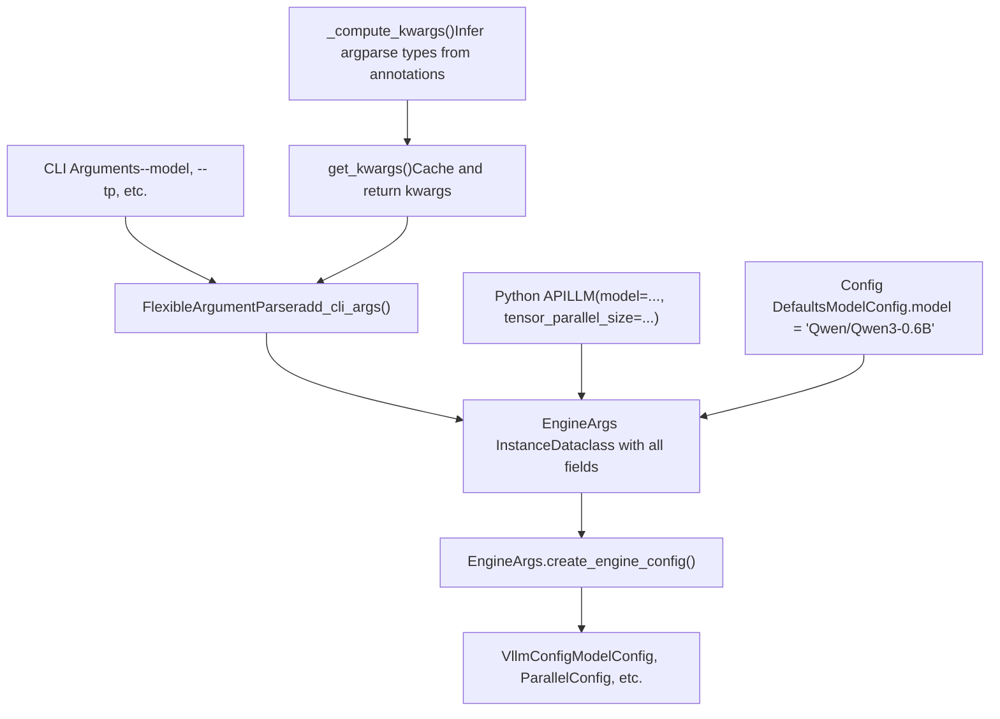
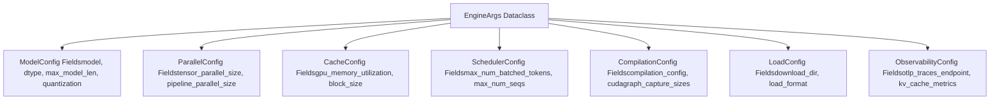
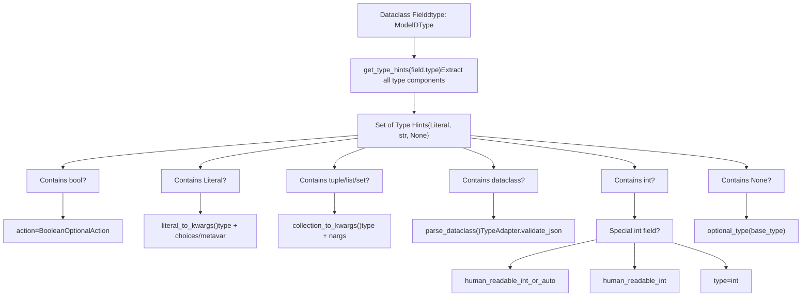
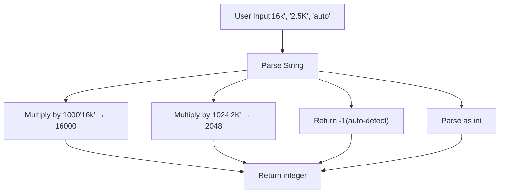

# Argument Parsing and EngineArgs

Relevant source files

-   [tests/compile/test\_aot\_compile.py](https://github.com/vllm-project/vllm/blob/7cc302dd/tests/compile/test_aot_compile.py)
-   [tests/compile/test\_compile\_ranges.py](https://github.com/vllm-project/vllm/blob/7cc302dd/tests/compile/test_compile_ranges.py)
-   [tests/compile/test\_config.py](https://github.com/vllm-project/vllm/blob/7cc302dd/tests/compile/test_config.py)
-   [tests/compile/test\_graph\_partition.py](https://github.com/vllm-project/vllm/blob/7cc302dd/tests/compile/test_graph_partition.py)
-   [tests/compile/test\_structured\_logging.py](https://github.com/vllm-project/vllm/blob/7cc302dd/tests/compile/test_structured_logging.py)
-   [tests/engine/test\_arg\_utils.py](https://github.com/vllm-project/vllm/blob/7cc302dd/tests/engine/test_arg_utils.py)
-   [tests/test\_config.py](https://github.com/vllm-project/vllm/blob/7cc302dd/tests/test_config.py)
-   [vllm/compilation/backends.py](https://github.com/vllm-project/vllm/blob/7cc302dd/vllm/compilation/backends.py)
-   [vllm/compilation/caching.py](https://github.com/vllm-project/vllm/blob/7cc302dd/vllm/compilation/caching.py)
-   [vllm/compilation/compiler\_interface.py](https://github.com/vllm-project/vllm/blob/7cc302dd/vllm/compilation/compiler_interface.py)
-   [vllm/compilation/counter.py](https://github.com/vllm-project/vllm/blob/7cc302dd/vllm/compilation/counter.py)
-   [vllm/compilation/decorators.py](https://github.com/vllm-project/vllm/blob/7cc302dd/vllm/compilation/decorators.py)
-   [vllm/compilation/monitor.py](https://github.com/vllm-project/vllm/blob/7cc302dd/vllm/compilation/monitor.py)
-   [vllm/compilation/piecewise\_backend.py](https://github.com/vllm-project/vllm/blob/7cc302dd/vllm/compilation/piecewise_backend.py)
-   [vllm/compilation/wrapper.py](https://github.com/vllm-project/vllm/blob/7cc302dd/vllm/compilation/wrapper.py)
-   [vllm/config/\_\_init\_\_.py](https://github.com/vllm-project/vllm/blob/7cc302dd/vllm/config/__init__.py)
-   [vllm/config/compilation.py](https://github.com/vllm-project/vllm/blob/7cc302dd/vllm/config/compilation.py)
-   [vllm/config/model.py](https://github.com/vllm-project/vllm/blob/7cc302dd/vllm/config/model.py)
-   [vllm/config/vllm.py](https://github.com/vllm-project/vllm/blob/7cc302dd/vllm/config/vllm.py)
-   [vllm/engine/arg\_utils.py](https://github.com/vllm-project/vllm/blob/7cc302dd/vllm/engine/arg_utils.py)

## Purpose and Scope

This document describes vLLM's argument parsing system, centered around the `EngineArgs` dataclass and associated utilities that convert command-line arguments and Python API parameters into configuration objects. This system bridges user-facing interfaces (CLI, Python API) with the internal `VllmConfig` object that drives engine initialization.

For information about the configuration objects that `EngineArgs` produces, see [VllmConfig and Specialized Configuration Objects](/vllm-project/vllm/2.2-vllmconfig-and-specialized-configuration-objects). For environment variable configuration, see [Environment Variables System](/vllm-project/vllm/2.3-environment-variables-system). For compilation-specific configuration, see [Compilation Configuration and Optimization Levels](/vllm-project/vllm/2.4-compilation-configuration-and-optimization-levels).

---

## System Overview

The argument parsing system transforms user inputs into validated configuration objects through a multi-stage pipeline:

Title: Argument Parsing Pipeline


**Sources:** [vllm/engine/arg\_utils.py1-1467](https://github.com/vllm-project/vllm/blob/7cc302dd/vllm/engine/arg_utils.py#L1-L1467) [vllm/utils/argparse\_utils.py1-200](https://github.com/vllm-project/vllm/blob/7cc302dd/vllm/utils/argparse_utils.py#L1-L200)

---

## EngineArgs Dataclass

The `EngineArgs` dataclass serves as the central aggregation point for all engine configuration parameters. It contains approximately 150 fields covering model loading, parallelism, caching, scheduling, and specialized features.

### Key Characteristics

| Aspect | Details |
| --- | --- |
| **Location** | [vllm/engine/arg\_utils.py362-615](https://github.com/vllm-project/vllm/blob/7cc302dd/vllm/engine/arg_utils.py#L362-L615) |
| **Type** | `@dataclass` with field defaults from specialized configs |
| **Field Count** | ~150 fields across all configuration domains |
| **Initialization** | `__post_init__()` handles plugin loading and model path resolution |

### Field Organization

Fields in `EngineArgs` are organized by their target configuration object:

Title: EngineArgs Field Mapping


**Example field definitions:**

```
# From vllm/engine/arg_utils.py:365-406model: str = ModelConfig.modeltensor_parallel_size: int = ParallelConfig.tensor_parallel_sizepipeline_parallel_size: int = ParallelConfig.pipeline_parallel_sizegpu_memory_utilization: float = CacheConfig.gpu_memory_utilizationmax_model_len: int = ModelConfig.max_model_len
```
**Sources:** [vllm/engine/arg\_utils.py362-615](https://github.com/vllm-project/vllm/blob/7cc302dd/vllm/engine/arg_utils.py#L362-L615) [vllm/config/model.py100-143](https://github.com/vllm-project/vllm/blob/7cc302dd/vllm/config/model.py#L100-L143) [vllm/config/cache.py31-49](https://github.com/vllm-project/vllm/blob/7cc302dd/vllm/config/cache.py#L31-L49)

### Post-Initialization Processing

The `__post_init__()` method performs critical setup:

Title: EngineArgs Initialization Flow

> **[Mermaid sequence]**
> *(图表结构无法解析)*

**Key operations in `__post_init__()`:**

1.  **Config object conversion** - [vllm/engine/arg\_utils.py622-633](https://github.com/vllm-project/vllm/blob/7cc302dd/vllm/engine/arg_utils.py#L622-L633)
    -   Converts dict-valued `compilation_config`, `attention_config`, etc. to proper config objects using `TypeAdapter`.
2.  **Plugin loading** - [vllm/engine/arg\_utils.py635-637](https://github.com/vllm-project/vllm/blob/7cc302dd/vllm/engine/arg_utils.py#L635-L637)
    -   Loads general plugins via `load_general_plugins()`.
3.  **Offline model path resolution** - [vllm/engine/arg\_utils.py639-657](https://github.com/vllm-project/vllm/blob/7cc302dd/vllm/engine/arg_utils.py#L639-L657)
    -   When `HF_HUB_OFFLINE=1`, replaces model IDs with local cache paths via `get_model_path`.

**Sources:** [vllm/engine/arg\_utils.py618-658](https://github.com/vllm-project/vllm/blob/7cc302dd/vllm/engine/arg_utils.py#L618-L658) [vllm/transformers\_utils/repo\_utils.py1-50](https://github.com/vllm-project/vllm/blob/7cc302dd/vllm/transformers_utils/repo_utils.py#L1-L50)

---

## CLI Argument Registration

The `add_cli_args()` static method populates an `ArgumentParser` with all vLLM engine arguments, organized into logical groups.

### Argument Group Structure

Title: CLI Argument Groups

```mermaid
flowchart TD
    Parser["FlexibleArgumentParser"]
    ModelGroup["ModelConfig Group--model, --dtype, --quantization--max-model-len, --tokenizer"]
    LoadGroup["LoadConfig Group--load-format, --download-dir"]
    AttentionGroup["AttentionConfig Group--attention-backend"]
    StructuredOutputsGroup["StructuredOutputsConfig Group--reasoning-parser"]
    ParallelGroup["ParallelConfig Group--tp, --pp, --dp--distributed-executor-backend"]
    SchedulerGroup["SchedulerConfig Group--max-num-batched-tokens--max-num-seqs, --policy"]
    CacheGroup["CacheConfig Group--gpu-memory-utilization--block-size, --kv-cache-dtype"]
    MultiModalGroup["MultiModalConfig Group--limit-mm-per-prompt--mm-processor-kwargs"]
    LoRAGroup["LoRAConfig Group--enable-lora, --max-loras--max-lora-rank"]
    CompilationGroup["CompilationConfig Group--compilation-configJSON or -cc.key=value"]
    ObservabilityGroup["ObservabilityConfig Group--otlp-traces-endpoint--kv-cache-metrics"]

    Parser --> ModelGroup
    Parser --> LoadGroup
    Parser --> AttentionGroup
    Parser --> StructuredOutputsGroup
    Parser --> ParallelGroup
    Parser --> SchedulerGroup
    Parser --> CacheGroup
    Parser --> MultiModalGroup
    Parser --> LoRAGroup
    Parser --> CompilationGroup
    Parser --> ObservabilityGroup
```


**Implementation pattern:**

```
# From vllm/engine/arg_utils.py:660-752@staticmethoddef add_cli_args(parser: FlexibleArgumentParser) -> FlexibleArgumentParser:    # Model arguments    model_kwargs = get_kwargs(ModelConfig)    model_group = parser.add_argument_group(        title="ModelConfig",        description=ModelConfig.__doc__,    )    model_group.add_argument("--model", **model_kwargs["model"])    model_group.add_argument("--dtype", **model_kwargs["dtype"])    # ... more model arguments
```
**Sources:** [vllm/engine/arg\_utils.py660-1162](https://github.com/vllm-project/vllm/blob/7cc302dd/vllm/engine/arg_utils.py#L660-L1162)

### Special Argument Handling

Some arguments require custom handling beyond automated type inference:

| Argument | Special Handling | Location |
| --- | --- | --- |
| `--hf-token` | Supports bool or str (const=True for flag) | [vllm/engine/arg\_utils.py723-730](https://github.com/vllm-project/vllm/blob/7cc302dd/vllm/engine/arg_utils.py#L723-L730) |
| `--max-model-len` | Uses `human_readable_int_or_auto()` parser | [vllm/engine/arg\_utils.py309-311](https://github.com/vllm-project/vllm/blob/7cc302dd/vllm/engine/arg_utils.py#L309-L311) |
| `--compilation-config` | JSON or shorthand `-cc.key=value` syntax | [vllm/engine/arg\_utils.py1128-1136](https://github.com/vllm-project/vllm/blob/7cc302dd/vllm/engine/arg_utils.py#L1128-L1136) |
| `--data-parallel-*` | External load balancer mode arguments | [vllm/engine/arg\_utils.py851-897](https://github.com/vllm-project/vllm/blob/7cc302dd/vllm/engine/arg_utils.py#L851-L897) |

**Sources:** [vllm/engine/arg\_utils.py660-1162](https://github.com/vllm-project/vllm/blob/7cc302dd/vllm/engine/arg_utils.py#L660-L1162)

---

## Type Inference and Argument Generation

The `get_kwargs()` and `_compute_kwargs()` functions implement sophisticated type inference to automatically generate `argparse` argument specifications from config dataclass type annotations.

### Type Inference Pipeline

Title: Annotation to Argparse Logic


### Type Annotation to Argparse Mapping

| Type Annotation | Argparse Configuration | Example |
| --- | --- | --- |
| `bool` | `action=BooleanOptionalAction` | `--enable-lora / --no-enable-lora` |
| `Literal["a", "b"]` | `type=str, choices=["a", "b"]` | `--policy fcfs/priority` |
| `Literal["a", "b"] | str` | `type=str, metavar=["a", "b"]` | Accepts literal or custom |
| `list[int]` | `type=int, nargs="+"` | `--cudagraph-capture-sizes 1 2 4` |
| `tuple[int, int]` | `type=int, nargs=2` | Fixed-length tuple |
| `int | None` | `type=optional_type(int)` | Accepts int or "None" |
| `SomeDataclass` | `type=parse_dataclass` | JSON string validated via Pydantic |

**Sources:** [vllm/engine/arg\_utils.py132-346](https://github.com/vllm-project/vllm/blob/7cc302dd/vllm/engine/arg_utils.py#L132-L346)

---

## Configuration Object Creation

The `create_engine_config()` method transforms an `EngineArgs` instance into a fully validated `VllmConfig` object.

### Configuration Assembly Flow

Title: EngineConfig Assembly

> **[Mermaid sequence]**
> *(图表结构无法解析)*

**Key steps in configuration creation:**

1.  **Model Configuration** - [vllm/engine/arg\_utils.py1169-1225](https://github.com/vllm-project/vllm/blob/7cc302dd/vllm/engine/arg_utils.py#L1169-L1225)

    -   Creates `ModelConfig` from model-related args.
    -   Sets pooler config for pooling models via `get_pooling_config`.
2.  **Cache Configuration** - [vllm/engine/arg\_utils.py1232-1250](https://github.com/vllm-project/vllm/blob/7cc302dd/vllm/engine/arg_utils.py#L1232-L1250)

    -   Sets KV cache parameters like `gpu_memory_utilization` and `block_size`.
3.  **Parallel Configuration** - [vllm/engine/arg\_utils.py1252-1281](https://github.com/vllm-project/vllm/blob/7cc302dd/vllm/engine/arg_utils.py#L1252-L1281)

    -   Configures tensor/pipeline/data parallelism sizes.
4.  **Scheduler Configuration** - [vllm/engine/arg\_utils.py1227-1230](https://github.com/vllm-project/vllm/blob/7cc302dd/vllm/engine/arg_utils.py#L1227-L1230)

    -   Sets max tokens and sequences.

**Sources:** [vllm/engine/arg\_utils.py1164-1413](https://github.com/vllm-project/vllm/blob/7cc302dd/vllm/engine/arg_utils.py#L1164-L1413) [vllm/config/vllm.py49-160](https://github.com/vllm-project/vllm/blob/7cc302dd/vllm/config/vllm.py#L49-L160)

---

## Special Argument Types

### Human-Readable Integer Parsing

The `human_readable_int()` and `human_readable_int_or_auto()` functions parse integers with human-readable suffixes:

Title: Human-Readable Integer Parsing


**Sources:** [vllm/engine/arg\_utils.py1393-1464](https://github.com/vllm-project/vllm/blob/7cc302dd/vllm/engine/arg_utils.py#L1393-L1464)

### Compilation Config Shorthand

The `--compilation-config` argument supports both full JSON and shorthand `-cc.key=value` syntax. The shorthand syntax is processed in `EngineArgs.from_cli_args()` by converting `-cc.key=value` arguments into nested dictionary updates.

**Sources:** [vllm/engine/arg\_utils.py1128-1162](https://github.com/vllm-project/vllm/blob/7cc302dd/vllm/engine/arg_utils.py#L1128-L1162)

---

## Validation and Error Handling

Validation occurs at multiple stages, primarily within the `__post_init__` methods of the configuration classes and via Pydantic model validation.

### Validation Stages

| Stage | Validator | Checks |
| --- | --- | --- |
| **Argument Parsing** | `argparse` type checkers | Type validity, choice constraints |
| **EngineArgs Creation** | `__post_init__()` | Plugin loading, path resolution |
| **Config Object Creation** | Individual config `__post_init__()` | Field-specific constraints |
| **VllmConfig Assembly** | `VllmConfig.__post_init__()` | Cross-config consistency, optimization levels |

**Sources:** [vllm/config/vllm.py658-830](https://github.com/vllm-project/vllm/blob/7cc302dd/vllm/config/vllm.py#L658-L830) [vllm/engine/arg\_utils.py618-658](https://github.com/vllm-project/vllm/blob/7cc302dd/vllm/engine/arg_utils.py#L618-L658)

---

## Summary Table: Key Classes and Functions

| Symbol | Type | Purpose | Location |
| --- | --- | --- | --- |
| `EngineArgs` | `dataclass` | Central argument aggregation | [vllm/engine/arg\_utils.py362-615](https://github.com/vllm-project/vllm/blob/7cc302dd/vllm/engine/arg_utils.py#L362-L615) |
| `AsyncEngineArgs` | `dataclass` | Async-specific engine arguments | [vllm/engine/arg\_utils.py1416-1436](https://github.com/vllm-project/vllm/blob/7cc302dd/vllm/engine/arg_utils.py#L1416-L1436) |
| `add_cli_args()` | Static method | Register CLI arguments | [vllm/engine/arg\_utils.py660-1162](https://github.com/vllm-project/vllm/blob/7cc302dd/vllm/engine/arg_utils.py#L660-L1162) |
| `create_engine_config()` | Method | Convert to `VllmConfig` | [vllm/engine/arg\_utils.py1164-1413](https://github.com/vllm-project/vllm/blob/7cc302dd/vllm/engine/arg_utils.py#L1164-L1413) |
| `get_kwargs()` | Function | Get argparse kwargs for config | [vllm/engine/arg\_utils.py348-359](https://github.com/vllm-project/vllm/blob/7cc302dd/vllm/engine/arg_utils.py#L348-L359) |
| `_compute_kwargs()` | Function | Infer argparse kwargs from types | [vllm/engine/arg\_utils.py246-346](https://github.com/vllm-project/vllm/blob/7cc302dd/vllm/engine/arg_utils.py#L246-L346) |
| `VllmConfig` | Class | Final assembled configuration | [vllm/config/vllm.py49-160](https://github.com/vllm-project/vllm/blob/7cc302dd/vllm/config/vllm.py#L49-L160) |
| `FlexibleArgumentParser` | Class | Extended ArgumentParser | [vllm/utils/argparse\_utils.py14-200](https://github.com/vllm-project/vllm/blob/7cc302dd/vllm/utils/argparse_utils.py#L14-L200) |

**Sources:** [vllm/engine/arg\_utils.py1-1467](https://github.com/vllm-project/vllm/blob/7cc302dd/vllm/engine/arg_utils.py#L1-L1467) [vllm/config/vllm.py1-160](https://github.com/vllm-project/vllm/blob/7cc302dd/vllm/config/vllm.py#L1-L160)
