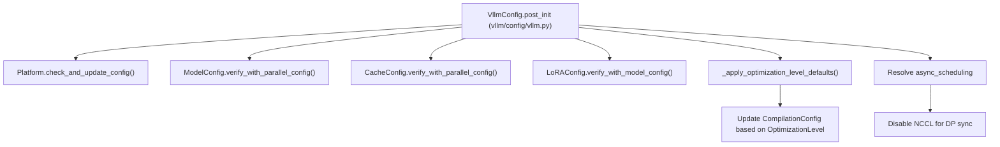

# VllmConfig and Specialized Configuration Objects

Relevant source files

-   [cmake/external\_projects/vllm\_flash\_attn.cmake](https://github.com/vllm-project/vllm/blob/7cc302dd/cmake/external_projects/vllm_flash_attn.cmake)
-   [examples/online\_serving/kv\_events\_subscriber.py](https://github.com/vllm-project/vllm/blob/7cc302dd/examples/online_serving/kv_events_subscriber.py)
-   [tests/compile/test\_aot\_compile.py](https://github.com/vllm-project/vllm/blob/7cc302dd/tests/compile/test_aot_compile.py)
-   [tests/compile/test\_compile\_ranges.py](https://github.com/vllm-project/vllm/blob/7cc302dd/tests/compile/test_compile_ranges.py)
-   [tests/compile/test\_config.py](https://github.com/vllm-project/vllm/blob/7cc302dd/tests/compile/test_config.py)
-   [tests/compile/test\_graph\_partition.py](https://github.com/vllm-project/vllm/blob/7cc302dd/tests/compile/test_graph_partition.py)
-   [tests/compile/test\_structured\_logging.py](https://github.com/vllm-project/vllm/blob/7cc302dd/tests/compile/test_structured_logging.py)
-   [tests/distributed/conftest.py](https://github.com/vllm-project/vllm/blob/7cc302dd/tests/distributed/conftest.py)
-   [tests/distributed/test\_events.py](https://github.com/vllm-project/vllm/blob/7cc302dd/tests/distributed/test_events.py)
-   [tests/engine/test\_arg\_utils.py](https://github.com/vllm-project/vllm/blob/7cc302dd/tests/engine/test_arg_utils.py)
-   [tests/test\_config.py](https://github.com/vllm-project/vllm/blob/7cc302dd/tests/test_config.py)
-   [tests/v1/cudagraph/test\_cudagraph\_dispatch.py](https://github.com/vllm-project/vllm/blob/7cc302dd/tests/v1/cudagraph/test_cudagraph_dispatch.py)
-   [tests/v1/cudagraph/test\_cudagraph\_mode.py](https://github.com/vllm-project/vllm/blob/7cc302dd/tests/v1/cudagraph/test_cudagraph_mode.py)
-   [tests/v1/kv\_connector/unit/test\_config.py](https://github.com/vllm-project/vllm/blob/7cc302dd/tests/v1/kv_connector/unit/test_config.py)
-   [tests/v1/kv\_connector/unit/test\_lmcache\_connector.py](https://github.com/vllm-project/vllm/blob/7cc302dd/tests/v1/kv_connector/unit/test_lmcache_connector.py)
-   [tools/pre\_commit/mypy.py](https://github.com/vllm-project/vllm/blob/7cc302dd/tools/pre_commit/mypy.py)
-   [vllm/compilation/backends.py](https://github.com/vllm-project/vllm/blob/7cc302dd/vllm/compilation/backends.py)
-   [vllm/compilation/caching.py](https://github.com/vllm-project/vllm/blob/7cc302dd/vllm/compilation/caching.py)
-   [vllm/compilation/compiler\_interface.py](https://github.com/vllm-project/vllm/blob/7cc302dd/vllm/compilation/compiler_interface.py)
-   [vllm/compilation/counter.py](https://github.com/vllm-project/vllm/blob/7cc302dd/vllm/compilation/counter.py)
-   [vllm/compilation/decorators.py](https://github.com/vllm-project/vllm/blob/7cc302dd/vllm/compilation/decorators.py)
-   [vllm/compilation/monitor.py](https://github.com/vllm-project/vllm/blob/7cc302dd/vllm/compilation/monitor.py)
-   [vllm/compilation/piecewise\_backend.py](https://github.com/vllm-project/vllm/blob/7cc302dd/vllm/compilation/piecewise_backend.py)
-   [vllm/compilation/wrapper.py](https://github.com/vllm-project/vllm/blob/7cc302dd/vllm/compilation/wrapper.py)
-   [vllm/config/\_\_init\_\_.py](https://github.com/vllm-project/vllm/blob/7cc302dd/vllm/config/__init__.py)
-   [vllm/config/attention.py](https://github.com/vllm-project/vllm/blob/7cc302dd/vllm/config/attention.py)
-   [vllm/config/cache.py](https://github.com/vllm-project/vllm/blob/7cc302dd/vllm/config/cache.py)
-   [vllm/config/compilation.py](https://github.com/vllm-project/vllm/blob/7cc302dd/vllm/config/compilation.py)
-   [vllm/config/device.py](https://github.com/vllm-project/vllm/blob/7cc302dd/vllm/config/device.py)
-   [vllm/config/kernel.py](https://github.com/vllm-project/vllm/blob/7cc302dd/vllm/config/kernel.py)
-   [vllm/config/kv\_events.py](https://github.com/vllm-project/vllm/blob/7cc302dd/vllm/config/kv_events.py)
-   [vllm/config/lora.py](https://github.com/vllm-project/vllm/blob/7cc302dd/vllm/config/lora.py)
-   [vllm/config/model.py](https://github.com/vllm-project/vllm/blob/7cc302dd/vllm/config/model.py)
-   [vllm/config/pooler.py](https://github.com/vllm-project/vllm/blob/7cc302dd/vllm/config/pooler.py)
-   [vllm/config/scheduler.py](https://github.com/vllm-project/vllm/blob/7cc302dd/vllm/config/scheduler.py)
-   [vllm/config/utils.py](https://github.com/vllm-project/vllm/blob/7cc302dd/vllm/config/utils.py)
-   [vllm/config/vllm.py](https://github.com/vllm-project/vllm/blob/7cc302dd/vllm/config/vllm.py)
-   [vllm/distributed/kv\_events.py](https://github.com/vllm-project/vllm/blob/7cc302dd/vllm/distributed/kv_events.py)
-   [vllm/engine/arg\_utils.py](https://github.com/vllm-project/vllm/blob/7cc302dd/vllm/engine/arg_utils.py)
-   [vllm/forward\_context.py](https://github.com/vllm-project/vllm/blob/7cc302dd/vllm/forward_context.py)
-   [vllm/model\_executor/layers/attention/mla\_attention.py](https://github.com/vllm-project/vllm/blob/7cc302dd/vllm/model_executor/layers/attention/mla_attention.py)
-   [vllm/v1/attention/backend.py](https://github.com/vllm-project/vllm/blob/7cc302dd/vllm/v1/attention/backend.py)
-   [vllm/v1/attention/backends/fa\_utils.py](https://github.com/vllm-project/vllm/blob/7cc302dd/vllm/v1/attention/backends/fa_utils.py)
-   [vllm/v1/attention/ops/paged\_attn.py](https://github.com/vllm-project/vllm/blob/7cc302dd/vllm/v1/attention/ops/paged_attn.py)
-   [vllm/v1/cudagraph\_dispatcher.py](https://github.com/vllm-project/vllm/blob/7cc302dd/vllm/v1/cudagraph_dispatcher.py)
-   [vllm/v1/worker/dp\_utils.py](https://github.com/vllm-project/vllm/blob/7cc302dd/vllm/v1/worker/dp_utils.py)

## Purpose and Scope

This page documents the configuration architecture of vLLM, centered around the `VllmConfig` root object and its specialized sub-configurations. It covers the structure, key fields, and validation logic of `ModelConfig`, `ParallelConfig`, `CacheConfig`, `SchedulerConfig`, and others located in `vllm/config/`.

For the CLI/YAML argument parsing pipeline that constructs these objects, see [2.1](https://github.com/vllm-project/vllm/blob/7cc302dd/2.1) For environment variables that supplement configuration, see [2.3](https://github.com/vllm-project/vllm/blob/7cc302dd/2.3) For `CompilationConfig` and `torch.compile` integration, see [2.4](https://github.com/vllm-project/vllm/blob/7cc302dd/2.4)

---

## Package Layout

All configuration classes are defined within the `vllm/config/` directory and re-exported through `vllm/config/__init__.py`. vLLM uses a custom `@config` decorator that applies Pydantic validation to Python dataclasses, allowing for strict type checking and range validation (e.g., `ge`, `le`).

| File | Primary Class(es) |
| --- | --- |
| `vllm/config/vllm.py` | `VllmConfig`, `OptimizationLevel`, `PerformanceMode` |
| `vllm/config/model.py` | `ModelConfig` |
| `vllm/config/cache.py` | `CacheConfig` |
| `vllm/config/parallel.py` | `ParallelConfig`, `EPLBConfig` |
| `vllm/config/scheduler.py` | `SchedulerConfig` |
| `vllm/config/compilation.py` | `CompilationConfig`, `PassConfig`, `CompilationMode`, `CUDAGraphMode` |
| `vllm/config/attention.py` | `AttentionConfig` |
| `vllm/config/load.py` | `LoadConfig` |
| `vllm/config/lora.py` | `LoRAConfig` |
| `vllm/config/speculative.py` | `SpeculativeConfig` |
| `vllm/config/multimodal.py` | `MultiModalConfig` |
| `vllm/config/kernel.py` | `KernelConfig` |

Sources: [vllm/config/\_\_init\_\_.py4-58](https://github.com/vllm-project/vllm/blob/7cc302dd/vllm/config/__init__.py#L4-L58) [vllm/config/utils.py41-49](https://github.com/vllm-project/vllm/blob/7cc302dd/vllm/config/utils.py#L41-L49)

---

## VllmConfig — Root Container

`VllmConfig` is the central configuration object passed throughout the engine, workers, and execution pipeline. It aggregates all specialized configuration objects as typed fields.

**VllmConfig composition — Mapping Concepts to Code Entities:**

```mermaid
flowchart TD
    VC["VllmConfig (vllm/config/vllm.py)"]
    MC["ModelConfig (vllm/config/model.py)"]
    CC["CacheConfig (vllm/config/cache.py)"]
    PC["ParallelConfig (vllm/config/parallel.py)"]
    SC["SchedulerConfig (vllm/config/scheduler.py)"]
    AC["AttentionConfig (vllm/config/attention.py)"]
    CPC["CompilationConfig (vllm/config/compilation.py)"]
    LC["LoadConfig (vllm/config/load.py)"]
    KC["KernelConfig (vllm/config/kernel.py)"]
    DC["DeviceConfig (vllm/config/device.py)"]
    LRC["LoRAConfig (vllm/config/lora.py)"]
    SPC["SpeculativeConfig (vllm/config/speculative.py)"]
    KVTC["KVTransferConfig (vllm/config/kv_transfer.py)"]
    SOC["StructuredOutputsConfig (vllm/config/structured_outputs.py)"]

    VC --> MC
    VC --> CC
    VC --> PC
    VC --> SC
    VC --> AC
    VC --> CPC
    VC --> LC
    VC --> KC
    VC --> DC
    VC --> LRC
    VC --> SPC
    VC --> KVTC
    VC --> SOC
```

Sources: [vllm/config/vllm.py247-328](https://github.com/vllm-project/vllm/blob/7cc302dd/vllm/config/vllm.py#L247-L328)

### Key Fields on VllmConfig

| Field | Type | Default | Description |
| --- | --- | --- | --- |
| `model_config` | `ModelConfig` | `None` | Model identity, dtype, and tokenizer settings. |
| `cache_config` | `CacheConfig` | `CacheConfig()` | KV cache block allocation and memory limits. |
| `parallel_config` | `ParallelConfig` | `ParallelConfig()` | Distributed execution (TP/PP/DP) degrees. |
| `scheduler_config` | `SchedulerConfig` | factory | Batch sizing and chunked prefill settings. |
| `compilation_config` | `CompilationConfig` | `CompilationConfig()` | `torch.compile` and CUDA graph settings. |
| `optimization_level` | `OptimizationLevel` | `O2` | Preset for compilation/graph optimizations. |
| `performance_mode` | `PerformanceMode` | `"balanced"` | Strategy for latency vs throughput. |

Sources: [vllm/config/vllm.py246-329](https://github.com/vllm-project/vllm/blob/7cc302dd/vllm/config/vllm.py#L246-L329)

---

## ModelConfig

`ModelConfig` manages model-specific metadata, including architecture detection and tokenizer modes. It resolves the Hugging Face configuration (`hf_config`) during initialization.

| Field | Type | Default | Notes |
| --- | --- | --- | --- |
| `model` | `str` | `"Qwen/Qwen3-0.6B"` | HF repo ID or local path. |
| `tokenizer_mode` | `TokenizerMode` | `"auto"` | `"auto"`, `"hf"`, `"slow"`, `"mistral"`, `"deepseek_v32"`. |
| `dtype` | `ModelDType` | `"auto"` | Resolved to `torch.dtype` or string representation. |
| `max_model_len` | `int` | `None` | Auto-derived from HF config if unset. |
| `runner` | `RunnerOption` | `"auto"` | `"auto"`, `"generate"`, `"pooling"`, `"draft"`. |
| `trust_remote_code` | `bool` | `False` | Allow custom model code execution. |

Sources: [vllm/config/model.py106-175](https://github.com/vllm-project/vllm/blob/7cc302dd/vllm/config/model.py#L106-L175)

### Runner and Conversion Logic

The `runner` field determines the `runner_type` (e.g., `generate` or `pooling`). For pooling models, `ModelConfig` may trigger an adapter conversion (e.g., `embed` or `classify`) via the `convert` field.

Sources: [vllm/config/model.py82-98](https://github.com/vllm-project/vllm/blob/7cc302dd/vllm/config/model.py#L82-L98) [vllm/config/model.py381-408](https://github.com/vllm-project/vllm/blob/7cc302dd/vllm/config/model.py#L381-L408)

---

## CacheConfig

`CacheConfig` defines how the KV cache is partitioned and stored.

| Field | Type | Default | Notes |
| --- | --- | --- | --- |
| `block_size` | `int` | `None` | Contiguous block size in tokens (defaults to 16). |
| `gpu_memory_utilization` | `float` | `0.9` | Fraction of VRAM reserved for KV cache. |
| `cache_dtype` | `CacheDType` | `"auto"` | `"auto"`, `"fp8"`, `"half"`. |
| `enable_prefix_caching` | `bool` | `True` | Enables prompt/prefix sharing. |
| `mamba_cache_mode` | `MambaCacheMode` | `"none"` | Strategy for Mamba state caching. |

Sources: [vllm/config/cache.py31-115](https://github.com/vllm-project/vllm/blob/7cc302dd/vllm/config/cache.py#L31-L115)

---

## ParallelConfig

`ParallelConfig` describes the distributed execution topology. It supports Tensor Parallelism (TP), Pipeline Parallelism (PP), and Data Parallelism (DP).

| Field | Type | Default | Notes |
| --- | --- | --- | --- |
| `tensor_parallel_size` | `int` | `1` | Shards per pipeline stage. |
| `pipeline_parallel_size` | `int` | `1` | Number of pipeline stages. |
| `data_parallel_size` | `int` | `1` | Number of engine replicas. |
| `enable_expert_parallel` | `bool` | `False` | Shard MoE experts across ranks. |
| `all2all_backend` | `All2AllBackend` | `"allgather_reducescatter"` | Communication backend for MoE. |

Sources: [vllm/config/parallel.py99-173](https://github.com/vllm-project/vllm/blob/7cc302dd/vllm/config/parallel.py#L99-L173)

---

## SchedulerConfig

`SchedulerConfig` controls the request lifecycle and batching constraints.

| Field | Type | Default | Notes |
| --- | --- | --- | --- |
| `max_num_batched_tokens` | `int` | `2048` | Budget per iteration. |
| `max_num_seqs` | `int` | `128` | Max concurrent sequences. |
| `enable_chunked_prefill` | `bool` | `True` | Split long prompts into chunks. |
| `async_scheduling` | `bool` | `None` | Overlap scheduling with GPU execution. |
| `policy` | `SchedulerPolicy` | `"fcfs"` | `"fcfs"` or `"priority"`. |

Sources: [vllm/config/scheduler.py26-148](https://github.com/vllm-project/vllm/blob/7cc302dd/vllm/config/scheduler.py#L26-L148)

---

## CompilationConfig and PassConfig

`CompilationConfig` drives the `torch.compile` backend and CUDA graph capture.

-   **`CompilationMode`**: `NONE`, `STOCK_TORCH_COMPILE`, `DYNAMO_TRACE_ONCE`, or `VLLM_COMPILE`. [vllm/config/compilation.py35-48](https://github.com/vllm-project/vllm/blob/7cc302dd/vllm/config/compilation.py#L35-L48)
-   **`CUDAGraphMode`**: `NONE`, `PIECEWISE`, `FULL`, or `FULL_AND_PIECEWISE`. [vllm/config/compilation.py51-61](https://github.com/vllm-project/vllm/blob/7cc302dd/vllm/config/compilation.py#L51-L61)
-   **`PassConfig`**: Contains flags for custom Inductor passes like `fuse_norm_quant`, `fuse_act_quant`, and `fuse_allreduce_rms`. [vllm/config/compilation.py105-142](https://github.com/vllm-project/vllm/blob/7cc302dd/vllm/config/compilation.py#L105-L142)

---

## VllmConfig Initialization and Validation

The `VllmConfig.__post_init__` method acts as a central validation hub, ensuring consistency across sub-configurations.

**Cross-Entity Validation and Data Flow:**

Sources: [vllm/config/vllm.py652-780](https://github.com/vllm-project/vllm/blob/7cc302dd/vllm/config/vllm.py#L652-L780)

### Optimization Level Presets

`OptimizationLevel` (O0-O3) provides presets for performance. For example, `O2` (the default) enables piecewise CUDA graphs and various fusion passes in `PassConfig`.

| Preset | CUDA Graph Mode | Fusion Passes |
| --- | --- | --- |
| `O0` | `NONE` | All False |
| `O1` | `PIECEWISE` | Norm/Act Fusion enabled |
| `O2` | `FULL_AND_PIECEWISE` | All fusions (including AllReduce) enabled |

Sources: [vllm/config/vllm.py161-230](https://github.com/vllm-project/vllm/blob/7cc302dd/vllm/config/vllm.py#L161-L230)

### Configuration Hashing

`VllmConfig` implements `compute_hash()` to generate a unique fingerprint of the configuration. This hash is used to cache compiled artifacts (e.g., Triton kernels, CUDA graphs). Fields that do not affect the execution graph (like `seed` or `served_model_name`) are excluded from the hash.

Sources: [vllm/config/vllm.py330-432](https://github.com/vllm-project/vllm/blob/7cc302dd/vllm/config/vllm.py#L330-L432) [vllm/config/model.py311-366](https://github.com/vllm-project/vllm/blob/7cc302dd/vllm/config/model.py#L311-L366)
