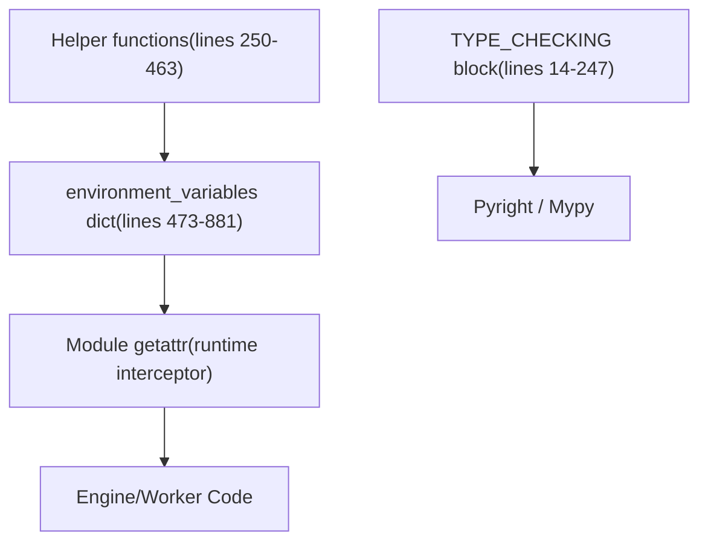
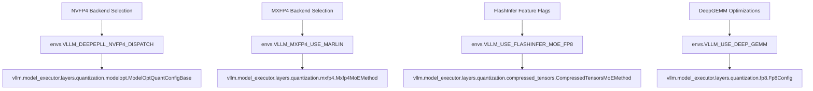
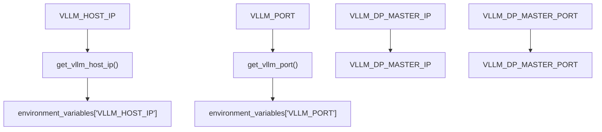

# Environment Variables System

Relevant source files

-   [vllm/envs.py](https://github.com/vllm-project/vllm/blob/7cc302dd/vllm/envs.py)
-   [vllm/model\_executor/layers/fused\_moe/config.py](https://github.com/vllm-project/vllm/blob/7cc302dd/vllm/model_executor/layers/fused_moe/config.py)
-   [vllm/model\_executor/layers/fused\_moe/gpt\_oss\_triton\_kernels\_moe.py](https://github.com/vllm-project/vllm/blob/7cc302dd/vllm/model_executor/layers/fused_moe/gpt_oss_triton_kernels_moe.py)
-   [vllm/model\_executor/layers/fused\_moe/layer.py](https://github.com/vllm-project/vllm/blob/7cc302dd/vllm/model_executor/layers/fused_moe/layer.py)
-   [vllm/model\_executor/layers/fused\_moe/rocm\_aiter\_fused\_moe.py](https://github.com/vllm-project/vllm/blob/7cc302dd/vllm/model_executor/layers/fused_moe/rocm_aiter_fused_moe.py)
-   [vllm/model\_executor/layers/quantization/awq\_marlin.py](https://github.com/vllm-project/vllm/blob/7cc302dd/vllm/model_executor/layers/quantization/awq_marlin.py)
-   [vllm/model\_executor/layers/quantization/bitsandbytes.py](https://github.com/vllm-project/vllm/blob/7cc302dd/vllm/model_executor/layers/quantization/bitsandbytes.py)
-   [vllm/model\_executor/layers/quantization/compressed\_tensors/compressed\_tensors\_moe.py](https://github.com/vllm-project/vllm/blob/7cc302dd/vllm/model_executor/layers/quantization/compressed_tensors/compressed_tensors_moe.py)
-   [vllm/model\_executor/layers/quantization/experts\_int8.py](https://github.com/vllm-project/vllm/blob/7cc302dd/vllm/model_executor/layers/quantization/experts_int8.py)
-   [vllm/model\_executor/layers/quantization/fp8.py](https://github.com/vllm-project/vllm/blob/7cc302dd/vllm/model_executor/layers/quantization/fp8.py)
-   [vllm/model\_executor/layers/quantization/gguf.py](https://github.com/vllm-project/vllm/blob/7cc302dd/vllm/model_executor/layers/quantization/gguf.py)
-   [vllm/model\_executor/layers/quantization/gptq\_marlin.py](https://github.com/vllm-project/vllm/blob/7cc302dd/vllm/model_executor/layers/quantization/gptq_marlin.py)
-   [vllm/model\_executor/layers/quantization/modelopt.py](https://github.com/vllm-project/vllm/blob/7cc302dd/vllm/model_executor/layers/quantization/modelopt.py)
-   [vllm/model\_executor/layers/quantization/moe\_wna16.py](https://github.com/vllm-project/vllm/blob/7cc302dd/vllm/model_executor/layers/quantization/moe_wna16.py)
-   [vllm/model\_executor/layers/quantization/mxfp4.py](https://github.com/vllm-project/vllm/blob/7cc302dd/vllm/model_executor/layers/quantization/mxfp4.py)
-   [vllm/model\_executor/layers/quantization/quark/quark\_moe.py](https://github.com/vllm-project/vllm/blob/7cc302dd/vllm/model_executor/layers/quantization/quark/quark_moe.py)

This page documents `vllm/envs.py`, vLLM's centralized environment variable registry. It covers the module's structure, the access mechanism, helper utilities, and a categorized reference of all `VLLM_*` variables. For information on how these variables feed into strongly-typed configuration objects at engine startup, see [Configuration Objects](/vllm-project/vllm/2.2-vllmconfig-and-specialized-configuration-objects). For compilation-specific settings, see [VllmConfig](/vllm-project/vllm/2.2-vllmconfig-and-specialized-configuration-objects) and [Compilation Configuration](/vllm-project/vllm/2.4-compilation-configuration-and-optimization-levels).

---

## Overview

`vllm/envs.py` serves as the single authoritative source for all environment variable definitions in vLLM. Rather than scattering `os.environ.get(...)` calls throughout the codebase, every variable is declared in one place with its type, default value, and validation logic. The rest of the codebase reads variables through a module-level `__getattr__` that lazily evaluates the appropriate callable from the `environment_variables` dict. [vllm/envs.py1-13](https://github.com/vllm-project/vllm/blob/7cc302dd/vllm/envs.py#L1-L13)

Usage pattern throughout the codebase:

```
import vllm.envs as envs # Access is evaluated lazily at read time:if envs.VLLM_ROCM_USE_AITER:    ... chunk_size = envs.VLLM_V1_OUTPUT_PROC_CHUNK_SIZE
```
---

## Module Structure

The file is organized into three layers that work together to provide type safety and runtime flexibility.

**Module structure diagram: `vllm/envs.py`**


Sources: `<FileRef file-url="https://github.com/vllm-project/vllm/blob/7cc302dd/vllm/envs.py#L14-L247" min=14 max=247 file-path="vllm/envs.py">Hii</FileRef>`, `<FileRef file-url="https://github.com/vllm-project/vllm/blob/7cc302dd/vllm/envs.py#L250-L463" min=250 max=463 file-path="vllm/envs.py">Hii</FileRef>`, `<FileRef file-url="https://github.com/vllm-project/vllm/blob/7cc302dd/vllm/envs.py#L473-L881" min=473 max=881 file-path="vllm/envs.py">Hii</FileRef>`

### The `TYPE_CHECKING` Block

`<FileRef file-url="https://github.com/vllm-project/vllm/blob/7cc302dd/vllm/envs.py#L14-L247" min=14 max=247 file-path="vllm/envs.py">Hii</FileRef>` contains a block guarded by `if TYPE_CHECKING:`. This block declares all variables with their Python types and default values. It is **never executed at runtime**; its sole purpose is to give type checkers and IDE tooling accurate type information when code does `import vllm.envs as envs; envs.VLLM_CACHE_ROOT`.

### The `environment_variables` Dict

`<FileRef file-url="https://github.com/vllm-project/vllm/blob/7cc302dd/vllm/envs.py#L473-L881" min=473 max=881 file-path="vllm/envs.py">Hii</FileRef>` defines the dict where each entry is a zero-argument callable (usually a lambda). These lambdas are evaluated **each time the variable is accessed**, ensuring that environment changes after import are reflected in the system.

### Module `__getattr__`

The module defines a `__getattr__` function that intercepts attribute access. It looks up the requested name in the `environment_variables` dictionary and executes the associated lambda. This implementation ensures that environment variables are not cached at the module level unless explicitly intended.

---

## Helper Utilities

Several utility functions are defined to reduce repetition and provide consistent parsing logic for types like booleans, integers, and lists.

| Function | Location | Purpose |
| --- | --- | --- |
| `maybe_convert_int` | `<FileRef file-url="https://github.com/vllm-project/vllm/blob/7cc302dd/vllm/envs.py#L264-L267" min=264 max=267 file-path="vllm/envs.py">Hii</FileRef>` | Converts string to int or returns `None`. |
| `maybe_convert_bool` | `<FileRef file-url="https://github.com/vllm-project/vllm/blob/7cc302dd/vllm/envs.py#L270-L273" min=270 max=273 file-path="vllm/envs.py">Hii</FileRef>` | Converts `"0"`/`"1"` or `"True"`/`"False"` to bool. |
| `env_with_choices` | `<FileRef file-url="https://github.com/vllm-project/vllm/blob/7cc302dd/vllm/envs.py#L298-L340" min=298 max=340 file-path="vllm/envs.py">Hii</FileRef>` | Validates env var against a set of allowed strings. |
| `env_list_with_choices` | `<FileRef file-url="https://github.com/vllm-project/vllm/blob/7cc302dd/vllm/envs.py#L343-L395" min=343 max=395 file-path="vllm/envs.py">Hii</FileRef>` | Parses comma-separated list with validation. |
| `get_vllm_port` | `<FileRef file-url="https://github.com/vllm-project/vllm/blob/7cc302dd/vllm/envs.py#L416-L442" min=416 max=442 file-path="vllm/envs.py">Hii</FileRef>` | Parses `VLLM_PORT` with specific logic for Kubernetes URL strings. |

Sources: `<FileRef file-url="https://github.com/vllm-project/vllm/blob/7cc302dd/vllm/envs.py#L250-L463" min=250 max=463 file-path="vllm/envs.py">Hii</FileRef>`

---

## Access Pattern Across the Codebase

The following diagram bridges the "Natural Language" environment settings to the specific "Code Entities" that consume them, particularly within the quantization and MoE subsystems.

**Environment Variable Consumers in Code Space**


Sources: `<FileRef file-url="https://github.com/vllm-project/vllm/blob/7cc302dd/vllm/envs.py#L148-L154" min=148 max=154 file-path="vllm/envs.py">Hii</FileRef>`, `<FileRef file-url="https://github.com/vllm-project/vllm/blob/7cc302dd/vllm/model_executor/layers/quantization/modelopt.py#L133-L144" min=133 max=144 file-path="vllm/model_executor/layers/quantization/modelopt.py">Hii</FileRef>`, `<FileRef file-url="https://github.com/vllm-project/vllm/blob/7cc302dd/vllm/model_executor/layers/quantization/mxfp4.py#L126-L130" min=126 max=130 file-path="vllm/model_executor/layers/quantization/mxfp4.py">Hii</FileRef>`, `<FileRef file-url="https://github.com/vllm-project/vllm/blob/7cc302dd/vllm/model_executor/layers/quantization/compressed_tensors/compressed_tensors_moe.py#L119-L125" min=119 max=125 file-path="vllm/model_executor/layers/quantization/compressed_tensors/compressed_tensors_moe.py">Hii</FileRef>`, `<FileRef file-url="https://github.com/vllm-project/vllm/blob/7cc302dd/vllm/model_executor/layers/quantization/fp8.py#L96-L105" min=96 max=105 file-path="vllm/model_executor/layers/quantization/fp8.py">Hii</FileRef>`

---

## Variable Reference by Category

### Quantization and Kernels

These variables control the selection of optimized kernels and quantization backends, especially for FP8 and FP4 formats.

| Variable | Type | Default | Purpose |
| --- | --- | --- | --- |
| `VLLM_USE_DEEP_GEMM` | `bool` | `True` | Master switch for using DeepGEMM FP8 kernels. `<FileRef file-url="https://github.com/vllm-project/vllm/blob/7cc302dd/vllm/envs.py#L154-L154" min=154 file-path="vllm/envs.py">Hii</FileRef>` |
| `VLLM_MOE_USE_DEEP_GEMM` | `bool` | `True` | Enable DeepGEMM specifically for MoE layers. `<FileRef file-url="https://github.com/vllm-project/vllm/blob/7cc302dd/vllm/envs.py#L155-L155" min=155 file-path="vllm/envs.py">Hii</FileRef>` |
| `VLLM_MXFP4_USE_MARLIN` | `bool` | `None` | If True, forces MXFP4 to use Marlin backend. `<FileRef file-url="https://github.com/vllm-project/vllm/blob/7cc302dd/vllm/envs.py#L148-L148" min=148 file-path="vllm/envs.py">Hii</FileRef>` |
| `VLLM_MARLIN_USE_ATOMIC_ADD` | `bool` | `False` | Use atomic add in Marlin kernels to improve performance. `<FileRef file-url="https://github.com/vllm-project/vllm/blob/7cc302dd/vllm/envs.py#L146-L146" min=146 file-path="vllm/envs.py">Hii</FileRef>` |
| `VLLM_USE_FLASHINFER_MOE_FP8` | `bool` | `False` | Enable FlashInfer FP8 MoE kernels. `<FileRef file-url="https://github.com/vllm-project/vllm/blob/7cc302dd/vllm/envs.py#L166-L166" min=166 file-path="vllm/envs.py">Hii</FileRef>` |
| `VLLM_FLASHINFER_MOE_BACKEND` | `str` | `"latency"` | Choose between `"throughput"`, `"latency"`, or `"masked_gemm"`. `<FileRef file-url="https://github.com/vllm-project/vllm/blob/7cc302dd/vllm/envs.py#L169-L169" min=169 file-path="vllm/envs.py">Hii</FileRef>` |

Sources: `<FileRef file-url="https://github.com/vllm-project/vllm/blob/7cc302dd/vllm/envs.py#L146-L170" min=146 max=170 file-path="vllm/envs.py">Hii</FileRef>`, `<FileRef file-url="https://github.com/vllm-project/vllm/blob/7cc302dd/vllm/model_executor/layers/quantization/fp8.py#L84-L86" min=84 max=86 file-path="vllm/model_executor/layers/quantization/fp8.py">Hii</FileRef>`, `<FileRef file-url="https://github.com/vllm-project/vllm/blob/7cc302dd/vllm/model_executor/layers/quantization/mxfp4.py#L126-L130" min=126 max=130 file-path="vllm/model_executor/layers/quantization/mxfp4.py">Hii</FileRef>`

### Distributed and Multi-GPU

Variables governing process management and inter-process communication in distributed environments.

| Variable | Type | Default | Purpose |
| --- | --- | --- | --- |
| `VLLM_WORKER_MULTIPROC_METHOD` | `str` | `"fork"` | Process start method: `"fork"` or `"spawn"`. `<FileRef file-url="https://github.com/vllm-project/vllm/blob/7cc302dd/vllm/envs.py#L61-L61" min=61 file-path="vllm/envs.py">Hii</FileRef>` |
| `VLLM_DP_SIZE` | `int` | `1` | Data Parallel world size. `<FileRef file-url="https://github.com/vllm-project/vllm/blob/7cc302dd/vllm/envs.py#L135-L135" min=135 file-path="vllm/envs.py">Hii</FileRef>` |
| `VLLM_USE_RAY_COMPILED_DAG_CHANNEL_TYPE` | `str` | `"auto"` | Channel type for Ray Compiled DAG (`"nccl"`, `"shm"`). `<FileRef file-url="https://github.com/vllm-project/vllm/blob/7cc302dd/vllm/envs.py#L57-L57" min=57 file-path="vllm/envs.py">Hii</FileRef>` |
| `VLLM_RAY_PER_WORKER_GPUS` | `float` | `1.0` | GPUs assigned to each Ray worker. `<FileRef file-url="https://github.com/vllm-project/vllm/blob/7cc302dd/vllm/envs.py#L130-L130" min=130 file-path="vllm/envs.py">Hii</FileRef>` |

Sources: `<FileRef file-url="https://github.com/vllm-project/vllm/blob/7cc302dd/vllm/envs.py#L57-L143" min=57 max=143 file-path="vllm/envs.py">Hii</FileRef>`, `<FileRef file-url="https://github.com/vllm-project/vllm/blob/7cc302dd/vllm/model_executor/layers/fused_moe/layer.py#L15-L20" min=15 max=20 file-path="vllm/model_executor/layers/fused_moe/layer.py">Hii</FileRef>`

### MoE (Mixture of Experts)

Controls for the MoE subsystem, including parallelism strategies and kernel selection.

| Variable | Type | Default | Purpose |
| --- | --- | --- | --- |
| `VLLM_MOE_DP_CHUNK_SIZE` | `int` | `256` | Chunk size for MoE data parallelism. `<FileRef file-url="https://github.com/vllm-project/vllm/blob/7cc302dd/vllm/envs.py#L140-L140" min=140 file-path="vllm/envs.py">Hii</FileRef>` |
| `VLLM_ENABLE_MOE_DP_CHUNK` | `bool` | `True` | Enable chunking for MoE DP. `<FileRef file-url="https://github.com/vllm-project/vllm/blob/7cc302dd/vllm/envs.py#L141-L141" min=141 file-path="vllm/envs.py">Hii</FileRef>` |
| `VLLM_USE_FUSED_MOE_GROUPED_TOPK` | `bool` | `True` | Use grouped top-k algorithm in MoE routing. `<FileRef file-url="https://github.com/vllm-project/vllm/blob/7cc302dd/vllm/envs.py#L163-L163" min=163 file-path="vllm/envs.py">Hii</FileRef>` |
| `VLLM_ROCM_USE_AITER_MOE` | `bool` | `True` | Enable ROCm AITER optimized MoE kernels. `<FileRef file-url="https://github.com/vllm-project/vllm/blob/7cc302dd/vllm/envs.py#L106-L106" min=106 file-path="vllm/envs.py">Hii</FileRef>` |

Sources: `<FileRef file-url="https://github.com/vllm-project/vllm/blob/7cc302dd/vllm/envs.py#L106-L163" min=106 max=163 file-path="vllm/envs.py">Hii</FileRef>`, `<FileRef file-url="https://github.com/vllm-project/vllm/blob/7cc302dd/vllm/model_executor/layers/fused_moe/layer.py#L66-L101" min=66 max=101 file-path="vllm/model_executor/layers/fused_moe/layer.py">Hii</FileRef>`, `<FileRef file-url="https://github.com/vllm-project/vllm/blob/7cc302dd/vllm/model_executor/layers/fused_moe/rocm_aiter_fused_moe.py#L110-L121" min=110 max=121 file-path="vllm/model_executor/layers/fused_moe/rocm_aiter_fused_moe.py">Hii</FileRef>`

### Logging and Debugging

Configuration for observability and developer diagnostics.

| Variable | Type | Default | Purpose |
| --- | --- | --- | --- |
| `VLLM_LOGGING_LEVEL` | `str` | `"INFO"` | Log level for vLLM loggers. `<FileRef file-url="https://github.com/vllm-project/vllm/blob/7cc302dd/vllm/envs.py#L40-L40" min=40 file-path="vllm/envs.py">Hii</FileRef>` |
| `VLLM_DEBUG_LOG_API_SERVER_RESPONSE` | `bool` | `False` | Logs the full response body of the API server. `<FileRef file-url="https://github.com/vllm-project/vllm/blob/7cc302dd/vllm/envs.py#L28-L28" min=28 file-path="vllm/envs.py">Hii</FileRef>` |
| `VLLM_LOG_STATS_INTERVAL` | `float` | `10.0` | Interval in seconds for logging engine stats. `<FileRef file-url="https://github.com/vllm-project/vllm/blob/7cc302dd/vllm/envs.py#L46-L46" min=46 file-path="vllm/envs.py">Hii</FileRef>` |
| `VLLM_SERVER_DEV_MODE` | `bool` | `False` | Enables developer mode features. `<FileRef file-url="https://github.com/vllm-project/vllm/blob/7cc302dd/vllm/envs.py#L127-L127" min=127 file-path="vllm/envs.py">Hii</FileRef>` |

Sources: `<FileRef file-url="https://github.com/vllm-project/vllm/blob/7cc302dd/vllm/envs.py#L28-L127" min=28 max=127 file-path="vllm/envs.py">Hii</FileRef>`, `<FileRef file-url="https://github.com/vllm-project/vllm/blob/7cc302dd/vllm/model_executor/layers/fused_moe/layer.py#L56-L56" min=56 file-path="vllm/model_executor/layers/fused_moe/layer.py">Hii</FileRef>`

---

## Port and Host Resolution

The API server and distributed engine use a specific hierarchy for resolving network addresses.

**Network Resolution Flow**


Sources: `<FileRef file-url="https://github.com/vllm-project/vllm/blob/7cc302dd/vllm/envs.py#L416-L442" min=416 max=442 file-path="vllm/envs.py">Hii</FileRef>`, `<FileRef file-url="https://github.com/vllm-project/vllm/blob/7cc302dd/vllm/envs.py#L15-L16" min=15 max=16 file-path="vllm/envs.py">Hii</FileRef>`, `<FileRef file-url="https://github.com/vllm-project/vllm/blob/7cc302dd/vllm/envs.py#L138-L139" min=138 max=139 file-path="vllm/envs.py">Hii</FileRef>`

### Kubernetes Service Discovery

`get_vllm_port()` explicitly checks if `VLLM_PORT` contains a scheme (e.g., `tcp://`). This is a common failure mode in Kubernetes where a service named `vllm` causes an environment variable `VLLM_PORT` to be populated with a URL. vLLM will raise a `ValueError` in this case to guide the user toward correct configuration. `<FileRef file-url="https://github.com/vllm-project/vllm/blob/7cc302dd/vllm/envs.py#L416-L442" min=416 max=442 file-path="vllm/envs.py">Hii</FileRef>`
