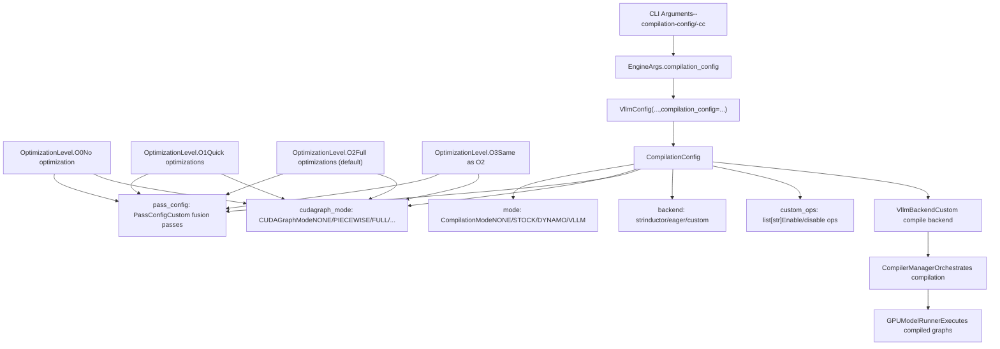
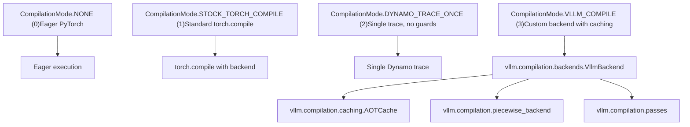
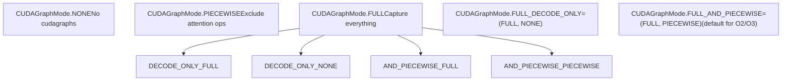
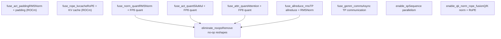
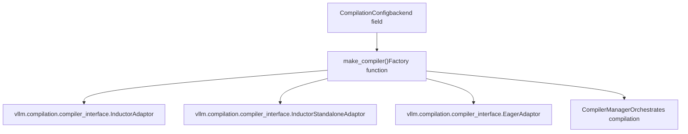

# Compilation Configuration and Optimization Levels

Relevant source files

-   [benchmarks/kernels/benchmark\_trtllm\_decode\_attention.py](https://github.com/vllm-project/vllm/blob/7cc302dd/benchmarks/kernels/benchmark_trtllm_decode_attention.py)
-   [benchmarks/kernels/benchmark\_trtllm\_prefill\_attention.py](https://github.com/vllm-project/vllm/blob/7cc302dd/benchmarks/kernels/benchmark_trtllm_prefill_attention.py)
-   [csrc/activation\_kernels.cu](https://github.com/vllm-project/vllm/blob/7cc302dd/csrc/activation_kernels.cu)
-   [docs/usage/troubleshooting.md](https://github.com/vllm-project/vllm/blob/7cc302dd/docs/usage/troubleshooting.md?plain=1)
-   [docs/usage/v1\_guide.md](https://github.com/vllm-project/vllm/blob/7cc302dd/docs/usage/v1_guide.md?plain=1)
-   [tests/compile/README.md](https://github.com/vllm-project/vllm/blob/7cc302dd/tests/compile/README.md?plain=1)
-   [tests/compile/backend.py](https://github.com/vllm-project/vllm/blob/7cc302dd/tests/compile/backend.py)
-   [tests/compile/fullgraph/\_\_init\_\_.py](https://github.com/vllm-project/vllm/blob/7cc302dd/tests/compile/fullgraph/__init__.py)
-   [tests/compile/fullgraph/test\_basic\_correctness.py](https://github.com/vllm-project/vllm/blob/7cc302dd/tests/compile/fullgraph/test_basic_correctness.py)
-   [tests/compile/fullgraph/test\_full\_cudagraph.py](https://github.com/vllm-project/vllm/blob/7cc302dd/tests/compile/fullgraph/test_full_cudagraph.py)
-   [tests/compile/fullgraph/test\_full\_graph.py](https://github.com/vllm-project/vllm/blob/7cc302dd/tests/compile/fullgraph/test_full_graph.py)
-   [tests/compile/test\_aot\_compile.py](https://github.com/vllm-project/vllm/blob/7cc302dd/tests/compile/test_aot_compile.py)
-   [tests/compile/test\_compile\_ranges.py](https://github.com/vllm-project/vllm/blob/7cc302dd/tests/compile/test_compile_ranges.py)
-   [tests/compile/test\_config.py](https://github.com/vllm-project/vllm/blob/7cc302dd/tests/compile/test_config.py)
-   [tests/compile/test\_graph\_partition.py](https://github.com/vllm-project/vllm/blob/7cc302dd/tests/compile/test_graph_partition.py)
-   [tests/compile/test\_structured\_logging.py](https://github.com/vllm-project/vllm/blob/7cc302dd/tests/compile/test_structured_logging.py)
-   [tests/engine/test\_arg\_utils.py](https://github.com/vllm-project/vllm/blob/7cc302dd/tests/engine/test_arg_utils.py)
-   [tests/kernels/attention/test\_flashinfer\_trtllm\_attention.py](https://github.com/vllm-project/vllm/blob/7cc302dd/tests/kernels/attention/test_flashinfer_trtllm_attention.py)
-   [tests/kernels/core/test\_activation.py](https://github.com/vllm-project/vllm/blob/7cc302dd/tests/kernels/core/test_activation.py)
-   [tests/models/quantization/test\_gpt\_oss.py](https://github.com/vllm-project/vllm/blob/7cc302dd/tests/models/quantization/test_gpt_oss.py)
-   [tests/test\_config.py](https://github.com/vllm-project/vllm/blob/7cc302dd/tests/test_config.py)
-   [vllm/compilation/backends.py](https://github.com/vllm-project/vllm/blob/7cc302dd/vllm/compilation/backends.py)
-   [vllm/compilation/caching.py](https://github.com/vllm-project/vllm/blob/7cc302dd/vllm/compilation/caching.py)
-   [vllm/compilation/compiler\_interface.py](https://github.com/vllm-project/vllm/blob/7cc302dd/vllm/compilation/compiler_interface.py)
-   [vllm/compilation/counter.py](https://github.com/vllm-project/vllm/blob/7cc302dd/vllm/compilation/counter.py)
-   [vllm/compilation/decorators.py](https://github.com/vllm-project/vllm/blob/7cc302dd/vllm/compilation/decorators.py)
-   [vllm/compilation/monitor.py](https://github.com/vllm-project/vllm/blob/7cc302dd/vllm/compilation/monitor.py)
-   [vllm/compilation/piecewise\_backend.py](https://github.com/vllm-project/vllm/blob/7cc302dd/vllm/compilation/piecewise_backend.py)
-   [vllm/compilation/wrapper.py](https://github.com/vllm-project/vllm/blob/7cc302dd/vllm/compilation/wrapper.py)
-   [vllm/config/\_\_init\_\_.py](https://github.com/vllm-project/vllm/blob/7cc302dd/vllm/config/__init__.py)
-   [vllm/config/compilation.py](https://github.com/vllm-project/vllm/blob/7cc302dd/vllm/config/compilation.py)
-   [vllm/config/model.py](https://github.com/vllm-project/vllm/blob/7cc302dd/vllm/config/model.py)
-   [vllm/config/vllm.py](https://github.com/vllm-project/vllm/blob/7cc302dd/vllm/config/vllm.py)
-   [vllm/engine/arg\_utils.py](https://github.com/vllm-project/vllm/blob/7cc302dd/vllm/engine/arg_utils.py)
-   [vllm/env\_override.py](https://github.com/vllm-project/vllm/blob/7cc302dd/vllm/env_override.py)
-   [vllm/model\_executor/layers/activation.py](https://github.com/vllm-project/vllm/blob/7cc302dd/vllm/model_executor/layers/activation.py)
-   [vllm/model\_executor/models/gpt\_oss.py](https://github.com/vllm-project/vllm/blob/7cc302dd/vllm/model_executor/models/gpt_oss.py)

This page documents vLLM's compilation configuration system, which controls `torch.compile` integration, CUDA graph capture, custom optimization passes, and performance tuning levels. For general configuration architecture, see [VllmConfig and Specialized Configuration Objects](/vllm-project/vllm/2.2-vllmconfig-and-specialized-configuration-objects). For runtime execution behavior, see [GPUModelRunner](/vllm-project/vllm/4.1-gpumodelrunner).

## Overview

vLLM uses PyTorch's compilation infrastructure to optimize model execution through multiple strategies:

1.  **torch.compile** integration with custom backends.
2.  **CUDA graph capture** to reduce launch overhead.
3.  **Custom Inductor passes** for fusion optimizations (FP8 quantization, sequence parallelism, etc.).
4.  **Optimization levels** (O0-O3) that bundle common configurations.

The compilation system is controlled by `CompilationConfig`, which is part of the larger `VllmConfig` object.

Title: Compilation Configuration Architecture


Sources: [vllm/config/compilation.py357-404](https://github.com/vllm-project/vllm/blob/7cc302dd/vllm/config/compilation.py#L357-L404) [vllm/config/vllm.py67-80](https://github.com/vllm-project/vllm/blob/7cc302dd/vllm/config/vllm.py#L67-L80) [vllm/config/vllm.py167-243](https://github.com/vllm-project/vllm/blob/7cc302dd/vllm/config/vllm.py#L167-L243)

## CompilationConfig Structure

`CompilationConfig` is organized into functional areas defined in `vllm/config/compilation.py`:

### Top-Level Compilation Control

| Field | Type | Default | Description |
| --- | --- | --- | --- |
| `mode` | `CompilationMode` | `None` (→ 3 for V1) | Compilation approach: NONE, STOCK\_TORCH\_COMPILE, DYNAMO\_TRACE\_ONCE, or VLLM\_COMPILE. |
| `backend` | `str` | `""` (→ inductor) | Backend name: "inductor", "eager", or qualified class name. |
| `custom_ops` | `list[str]` | `[]` | Fine-grained control over custom ops (e.g., `["+quant_fp8", "-rms_norm"]`). |
| `splitting_ops` | `list[str] | None` | `None` | Ops to exclude from cudagraphs for piecewise compilation. |
| `compile_mm_encoder` | `bool` | `False` | Whether to compile multimodal encoders. |
| `debug_dump_path` | `Path | None` | `None` | Directory for debug artifacts (depyf output, graphs). |
| `cache_dir` | `str` | `""` | Inductor cache directory (auto-generated if empty). |

### CUDA Graph Capture Settings

| Field | Type | Default | Description |
| --- | --- | --- | --- |
| `cudagraph_mode` | `CUDAGraphMode` | `None` (set by opt level) | Which cudagraph strategy to use. |
| `cudagraph_capture_sizes` | `list[int] | None` | `None` | Explicit batch sizes to capture (auto-generated if None). |
| `max_cudagraph_capture_size` | `int | None` | `None` | Maximum batch size for cudagraph capture. |
| `cudagraph_num_of_warmups` | `int` | `0` | Warmup iterations before capture. |
| `cudagraph_copy_inputs` | `bool` | `False` | Copy inputs to static buffers for cudagraph. |

### Inductor Compilation Settings

| Field | Type | Default | Description |
| --- | --- | --- | --- |
| `compile_sizes` | `list[int | str] | None` | `None` | Sizes for inductor compilation (can include "cudagraph\_capture\_sizes"). |
| `compile_ranges_endpoints` | `list[int] | None` | `None` | Range endpoints for piecewise compilation. |
| `inductor_compile_config` | `dict` | `{}` | Additional inductor configuration. |
| `pass_config` | `PassConfig` | `PassConfig()` | Configuration for custom fusion passes. |
| `use_inductor_graph_partition` | `bool` | `False` | Use inductor-level partitioning instead of FX-level. |

Sources: [vllm/config/compilation.py357-565](https://github.com/vllm-project/vllm/blob/7cc302dd/vllm/config/compilation.py#L357-L565)

## CompilationMode

The `CompilationMode` enum defines four approaches to compilation, specified at [vllm/config/compilation.py35-49](https://github.com/vllm-project/vllm/blob/7cc302dd/vllm/config/compilation.py#L35-L49):

Title: Compilation Mode Logic Space


### Mode Characteristics

-   **NONE (0)**: No compilation, fully eager PyTorch mode. The model runs as-is without any graph capture or optimization. Used for debugging or when compilation is undesirable.
-   **STOCK\_TORCH\_COMPILE (1)**: Uses standard `torch.compile(backend=...)` pipeline. The entire model forward pass is compiled as a single graph. Limited customization options.
-   **DYNAMO\_TRACE\_ONCE (2)**: Single Dynamo trace without recompilation guards. Avoids dynamic shape-dependent control flow. Requires that the model has no branching based on tensor sizes. Faster startup but less flexible.
-   **VLLM\_COMPILE (3)** (default for V1): Custom vLLM backend with:
    -   Piecewise compilation (splits graph at attention ops).
    -   AOT compilation cache for fast cold starts.
    -   Shape specialization and range-based compilation.
    -   Custom Inductor passes for fusions.

Sources: [vllm/config/compilation.py35-49](https://github.com/vllm-project/vllm/blob/7cc302dd/vllm/config/compilation.py#L35-L49) [vllm/compilation/backends.py90-116](https://github.com/vllm-project/vllm/blob/7cc302dd/vllm/compilation/backends.py#L90-L116)

## CUDAGraphMode

`CUDAGraphMode` controls CUDA graph capture strategy, defined at [vllm/config/compilation.py51-102](https://github.com/vllm-project/vllm/blob/7cc302dd/vllm/config/compilation.py#L51-L102):

Title: CUDA Graph Mode States


### Mode Details

-   **NONE**: No CUDA graph capture. All operations execute with standard CUDA kernel launches.
-   **PIECEWISE**: Builds piecewise cudagraphs, excluding cudagraph-incompatible ops (typically attention). These ops run outside the graph. Provides good balance of performance and compatibility.
-   **FULL**: Captures the entire forward pass in a CUDA graph. Best performance for small models or workloads with small prompts. Not supported by all attention backends.
-   **FULL\_DECODE\_ONLY**: Uses full cudagraphs for decode-only batches, but runs mixed prefill-decode batches without cudagraphs.
-   **FULL\_AND\_PIECEWISE** (default): Captures full cudagraphs for decode batches and piecewise cudagraphs for mixed batches. Best overall performance. Used by O2 and O3 optimization levels.

The mode provides helper methods like `decode_mode()`, `mixed_mode()`, `has_mode()`, and `requires_piecewise_compilation()` at [vllm/config/compilation.py63-96](https://github.com/vllm-project/vllm/blob/7cc302dd/vllm/config/compilation.py#L63-L96)

Sources: [vllm/config/compilation.py51-102](https://github.com/vllm-project/vllm/blob/7cc302dd/vllm/config/compilation.py#L51-L102) [vllm/v1/cudagraph\_dispatcher.py1-29](https://github.com/vllm-project/vllm/blob/7cc302dd/vllm/v1/cudagraph_dispatcher.py#L1-L29)

## PassConfig

`PassConfig` controls custom Inductor optimization passes for model-specific fusions, defined at [vllm/config/compilation.py105-292](https://github.com/vllm-project/vllm/blob/7cc302dd/vllm/config/compilation.py#L105-L292):

Title: Fusion Pass Configuration


### Key Pass Configuration Fields

| Field | Type | Default | Description |
| --- | --- | --- | --- |
| `fuse_norm_quant` | `bool` | Set by opt level | Fuse RMSNorm + FP8 quant custom ops. |
| `fuse_act_quant` | `bool` | Set by opt level | Fuse SiluMul + FP8 quant custom ops. |
| `fuse_attn_quant` | `bool` | Set by opt level | Fuse attention + FP8 quant ops. |
| `fuse_allreduce_rms` | `bool` | Set by opt level | Fuse TP allreduce + RMSNorm (Hopper/Blackwell only). |
| `enable_sp` | `bool` | Set by opt level | Enable sequence parallelism (TP > 1). |
| `fuse_gemm_comms` | `bool` | Set by opt level | Enable async TP communication. |
| `eliminate_noops` | `bool` | `True` | Remove no-op reshapes (required for many fusions). |

Sources: [vllm/config/compilation.py105-292](https://github.com/vllm-project/vllm/blob/7cc302dd/vllm/config/compilation.py#L105-L292) [vllm/compilation/passes/inductor\_pass.py1-49](https://github.com/vllm-project/vllm/blob/7cc302dd/vllm/compilation/passes/inductor_pass.py#L1-L49)

## Optimization Levels

vLLM provides four optimization levels (O0-O3) that bundle common configurations. These are applied during `VllmConfig` post-initialization.

### Optimization Level Definitions

```
class OptimizationLevel(IntEnum):    O0 = 0  # No optimization    O1 = 1  # Quick optimizations    O2 = 2  # Full optimizations (default)    O3 = 3  # Same as O2
```
Sources: [vllm/config/vllm.py67-80](https://github.com/vllm-project/vllm/blob/7cc302dd/vllm/config/vllm.py#L67-L80)

### Level Configurations

The mapping from optimization level to config is defined in `vllm/config/vllm.py`:

Title: Optimization Level Default Mappings

```mermaid
flowchart TD
    O2_Mode["cudagraph_mode: FULL_AND_PIECEWISE"]
    O2_Norm["fuse_norm_quant: enable_norm_fusion"]
    O2_Act["fuse_act_quant: enable_act_fusion"]
    O2_Allreduce["fuse_allreduce_rms: enable_allreduce_rms_fusion"]
    O2_AttnQuant["fuse_attn_quant: IS_QUANTIZED"]
    O2_SP["enable_sp: IS_DENSE"]
    O2_Gemm["fuse_gemm_comms: IS_DENSE"]
    O2_Autotune["enable_flashinfer_autotune: True"]
    O1_Mode["cudagraph_mode: PIECEWISE"]
    O1_Norm["fuse_norm_quant: enable_norm_fusion"]
    O1_Act["fuse_act_quant: enable_act_fusion"]
    O1_Autotune["enable_flashinfer_autotune: True"]
    O1_Other["Other fusions: False"]
    O0_Mode["cudagraph_mode: NONE"]
    O0_Passes["All fusion passes: False"]
    O0_Autotune["enable_flashinfer_autotune: False"]
    O0_Partition["use_inductor_graph_partition: False"]
```


### Conditional Fusion Enablement

Several fusions use dynamic enablement logic based on the engine configuration:

-   `enable_norm_fusion`: Active if RMS norm or quant FP8 custom ops are enabled [vllm/config/vllm.py94-101](https://github.com/vllm-project/vllm/blob/7cc302dd/vllm/config/vllm.py#L94-L101)
-   `enable_act_fusion`: Active if SiLU+Mul or quant FP8 custom ops are active, or for NVFP4 quantized models [vllm/config/vllm.py103-114](https://github.com/vllm-project/vllm/blob/7cc302dd/vllm/config/vllm.py#L103-L114)
-   `enable_allreduce_rms_fusion`: Active if TP > 1, running on Hopper/Blackwell with flashinfer, and DP=PP=1 [vllm/config/vllm.py116-135](https://github.com/vllm-project/vllm/blob/7cc302dd/vllm/config/vllm.py#L116-L135)
-   `enable_rope_kvcache_fusion`: Active for ROCm platforms if `rotary_embedding` custom op is active and graph partitioning is enabled [vllm/config/vllm.py138-151](https://github.com/vllm-project/vllm/blob/7cc302dd/vllm/config/vllm.py#L138-L151)

Sources: [vllm/config/vllm.py167-243](https://github.com/vllm-project/vllm/blob/7cc302dd/vllm/config/vllm.py#L167-L243) [vllm/config/vllm.py94-151](https://github.com/vllm-project/vllm/blob/7cc302dd/vllm/config/vllm.py#L94-L151)

## Backend Selection and Compiler Interface

### Backend Architecture

The compilation backend is selected and instantiated via `make_compiler` at [vllm/compilation/backends.py90-116](https://github.com/vllm-project/vllm/blob/7cc302dd/vllm/compilation/backends.py#L90-L116):

Title: Compiler Adaptor Registry


### CompilerInterface Methods

All compiler adaptors implement the `CompilerInterface` defined at [vllm/compilation/compiler\_interface.py26-114](https://github.com/vllm-project/vllm/blob/7cc302dd/vllm/compilation/compiler_interface.py#L26-L114):

| Method | Purpose |
| --- | --- |
| `initialize_cache` | Set up cache directory structure for the compiler. |
| `compute_hash` | Generate hash for cache key from `VllmConfig`. |
| `compile` | Compile FX graph, return callable and handle. |
| `load` | Load compiled artifact from handle. |

### Compilation Caching Flow

vLLM implements an AOT (Ahead-Of-Time) cache to avoid redundant compilation during engine restarts. The `CompilerManager` maintains a mapping of `(Range, graph_index, backend_name)` to compiled artifacts [vllm/compilation/backends.py118-138](https://github.com/vllm-project/vllm/blob/7cc302dd/vllm/compilation/backends.py#L118-L138)

Title: Compilation Caching Sequence

> **[Mermaid sequence]**
> *(图表结构无法解析)*

Sources: [vllm/compilation/backends.py118-210](https://github.com/vllm-project/vllm/blob/7cc302dd/vllm/compilation/backends.py#L118-L210) [vllm/compilation/compiler\_interface.py26-114](https://github.com/vllm-project/vllm/blob/7cc302dd/vllm/compilation/compiler_interface.py#L26-L114)

## Environment Variables

Compilation behavior can be fine-tuned using the following environment variables:

| Variable | Effect |
| --- | --- |
| `VLLM_DISABLE_COMPILE_CACHE` | Disables the AOT compilation cache [vllm/compilation/compiler\_interface.py181](https://github.com/vllm-project/vllm/blob/7cc302dd/vllm/compilation/compiler_interface.py#L181-L181) |
| `VLLM_USE_STANDALONE_COMPILE` | Forces the use of Inductor's standalone compilation pipeline [vllm/compilation/backends.py98](https://github.com/vllm-project/vllm/blob/7cc302dd/vllm/compilation/backends.py#L98-L98) |
| `VLLM_USE_MEGA_AOT_ARTIFACT` | Combines multiple AOT artifacts into a single file [vllm/compilation/backends.py91](https://github.com/vllm-project/vllm/blob/7cc302dd/vllm/compilation/backends.py#L91-L91) |
| `VLLM_COMPILE_CACHE_SAVE_FORMAT` | Sets save format to "binary" or "unpacked" [vllm/compilation/compiler\_interface.py103](https://github.com/vllm-project/vllm/blob/7cc302dd/vllm/compilation/compiler_interface.py#L103-L103) |

Sources: [vllm/compilation/backends.py90-116](https://github.com/vllm-project/vllm/blob/7cc302dd/vllm/compilation/backends.py#L90-L116) [vllm/compilation/compiler\_interface.py170-185](https://github.com/vllm-project/vllm/blob/7cc302dd/vllm/compilation/compiler_interface.py#L170-L185)
