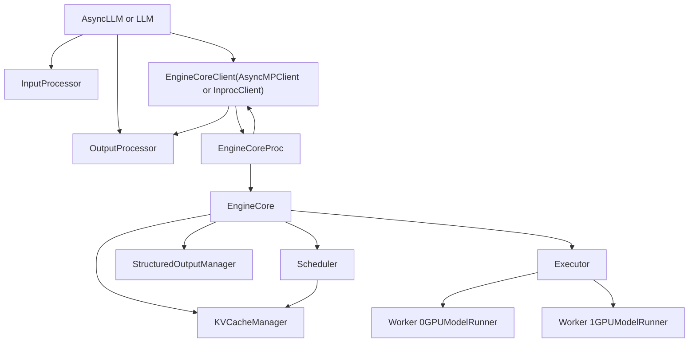
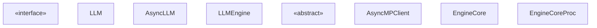
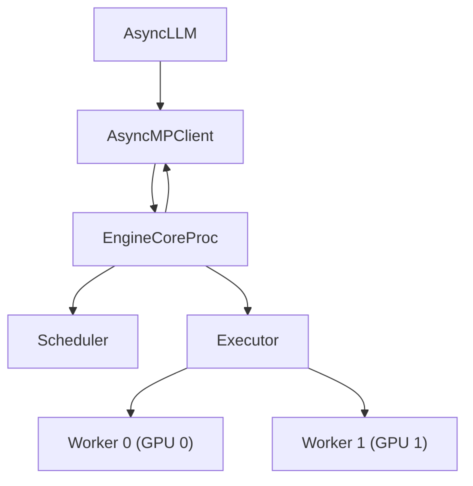

# Engine Architecture

Relevant source files

-   [tests/entrypoints/test\_api\_server\_process\_manager.py](https://github.com/vllm-project/vllm/blob/7cc302dd/tests/entrypoints/test_api_server_process_manager.py)
-   [tests/v1/core/test\_kv\_cache\_utils.py](https://github.com/vllm-project/vllm/blob/7cc302dd/tests/v1/core/test_kv_cache_utils.py)
-   [tests/v1/core/test\_prefix\_caching.py](https://github.com/vllm-project/vllm/blob/7cc302dd/tests/v1/core/test_prefix_caching.py)
-   [tests/v1/core/test\_scheduler.py](https://github.com/vllm-project/vllm/blob/7cc302dd/tests/v1/core/test_scheduler.py)
-   [tests/v1/core/test\_single\_type\_kv\_cache\_manager.py](https://github.com/vllm-project/vllm/blob/7cc302dd/tests/v1/core/test_single_type_kv_cache_manager.py)
-   [tests/v1/core/utils.py](https://github.com/vllm-project/vllm/blob/7cc302dd/tests/v1/core/utils.py)
-   [tests/v1/engine/test\_engine\_core.py](https://github.com/vllm-project/vllm/blob/7cc302dd/tests/v1/engine/test_engine_core.py)
-   [tests/v1/engine/test\_engine\_core\_client.py](https://github.com/vllm-project/vllm/blob/7cc302dd/tests/v1/engine/test_engine_core_client.py)
-   [vllm/config/parallel.py](https://github.com/vllm-project/vllm/blob/7cc302dd/vllm/config/parallel.py)
-   [vllm/engine/async\_llm\_engine.py](https://github.com/vllm-project/vllm/blob/7cc302dd/vllm/engine/async_llm_engine.py)
-   [vllm/engine/llm\_engine.py](https://github.com/vllm-project/vllm/blob/7cc302dd/vllm/engine/llm_engine.py)
-   [vllm/engine/protocol.py](https://github.com/vllm-project/vllm/blob/7cc302dd/vllm/engine/protocol.py)
-   [vllm/entrypoints/cli/serve.py](https://github.com/vllm-project/vllm/blob/7cc302dd/vllm/entrypoints/cli/serve.py)
-   [vllm/entrypoints/launcher.py](https://github.com/vllm-project/vllm/blob/7cc302dd/vllm/entrypoints/launcher.py)
-   [vllm/entrypoints/llm.py](https://github.com/vllm-project/vllm/blob/7cc302dd/vllm/entrypoints/llm.py)
-   [vllm/v1/core/block\_pool.py](https://github.com/vllm-project/vllm/blob/7cc302dd/vllm/v1/core/block_pool.py)
-   [vllm/v1/core/kv\_cache\_coordinator.py](https://github.com/vllm-project/vllm/blob/7cc302dd/vllm/v1/core/kv_cache_coordinator.py)
-   [vllm/v1/core/kv\_cache\_manager.py](https://github.com/vllm-project/vllm/blob/7cc302dd/vllm/v1/core/kv_cache_manager.py)
-   [vllm/v1/core/kv\_cache\_utils.py](https://github.com/vllm-project/vllm/blob/7cc302dd/vllm/v1/core/kv_cache_utils.py)
-   [vllm/v1/core/sched/scheduler.py](https://github.com/vllm-project/vllm/blob/7cc302dd/vllm/v1/core/sched/scheduler.py)
-   [vllm/v1/core/single\_type\_kv\_cache\_manager.py](https://github.com/vllm-project/vllm/blob/7cc302dd/vllm/v1/core/single_type_kv_cache_manager.py)
-   [vllm/v1/engine/\_\_init\_\_.py](https://github.com/vllm-project/vllm/blob/7cc302dd/vllm/v1/engine/__init__.py)
-   [vllm/v1/engine/async\_llm.py](https://github.com/vllm-project/vllm/blob/7cc302dd/vllm/v1/engine/async_llm.py)
-   [vllm/v1/engine/coordinator.py](https://github.com/vllm-project/vllm/blob/7cc302dd/vllm/v1/engine/coordinator.py)
-   [vllm/v1/engine/core.py](https://github.com/vllm-project/vllm/blob/7cc302dd/vllm/v1/engine/core.py)
-   [vllm/v1/engine/core\_client.py](https://github.com/vllm-project/vllm/blob/7cc302dd/vllm/v1/engine/core_client.py)
-   [vllm/v1/engine/llm\_engine.py](https://github.com/vllm-project/vllm/blob/7cc302dd/vllm/v1/engine/llm_engine.py)
-   [vllm/v1/engine/utils.py](https://github.com/vllm-project/vllm/blob/7cc302dd/vllm/v1/engine/utils.py)
-   [vllm/v1/kv\_cache\_interface.py](https://github.com/vllm-project/vllm/blob/7cc302dd/vllm/v1/kv_cache_interface.py)
-   [vllm/v1/request.py](https://github.com/vllm-project/vllm/blob/7cc302dd/vllm/v1/request.py)
-   [vllm/v1/utils.py](https://github.com/vllm-project/vllm/blob/7cc302dd/vllm/v1/utils.py)

This page describes the overall architecture of the vLLM v1 inference engine: its layered components, how they communicate, and how a request flows from API submission through GPU execution and back to the caller. Detailed documentation for each component is provided in the child pages listed below.

For configuration of these components at startup, see [Configuration and Initialization](/vllm-project/vllm/2-configuration-and-initialization). For details on how model inference is executed on the GPU, see [Model Execution on GPU](/vllm-project/vllm/4-model-execution-on-gpu). For the HTTP serving layer built on top of this engine, see [Serving APIs](/vllm-project/vllm/6-serving-apis).

---

## Overview

vLLM's v1 engine is organized into a multi-process, multi-layer architecture designed for high-throughput inference serving. The engine consists of:

| Layer | Purpose | Key Classes | Detailed Coverage |
| --- | --- | --- | --- |
| **Client API** | Accept and return requests | `LLM`, `AsyncLLM`, `EngineClient` | [EngineCore and Client APIs](/vllm-project/vllm/3.1-enginecore-and-client-apis) |
| **Engine Core** | Schedule, execute, coordinate | `EngineCore`, `EngineCoreProc`, `EngineCoreClient` | [EngineCore and Client APIs](/vllm-project/vllm/3.1-enginecore-and-client-apis) |
| **Request Management** | Track request lifecycle and state | `Request`, `RequestStatus`, `EngineCoreRequest` | [Request Lifecycle and State Management](/vllm-project/vllm/3.2-request-lifecycle-and-state-management) |
| **Scheduler** | Batch requests, allocate resources | `Scheduler`, scheduling policies | [Scheduler and Resource Allocation](/vllm-project/vllm/3.3-scheduler-and-resource-allocation) |
| **KV Cache** | Manage GPU memory for KV cache | `KVCacheManager`, `BlockPool` | [KV Cache Management and Prefix Caching](/vllm-project/vllm/3.4-kv-cache-management-and-prefix-caching) |
| **I/O Processing** | Tokenization, detokenization | `InputProcessor`, `OutputProcessor` | [Input and Output Processing](/vllm-project/vllm/3.5-input-and-output-processing) |
| **Observability** | Metrics, logging, monitoring | `StatLoggerManager`, metrics collectors | [Metrics and Observability](/vllm-project/vllm/3.6-metrics-and-observability) |

### Process Architecture

The v1 engine uses a **process-split architecture** where the client-facing layer and the GPU execution loop run in separate processes, communicating via ZMQ sockets. This design enables isolation of GPU work from HTTP/API handling and asynchronous pipelining of requests.

**High-level architecture diagram:**

**Alternative in-process mode**: When using `InprocClient`, `EngineCore` runs directly in the client process without separate processes or ZMQ communication. This is simpler but less scalable.

Sources: [vllm/v1/engine/core.py87-187](https://github.com/vllm-project/vllm/blob/7cc302dd/vllm/v1/engine/core.py#L87-L187) [vllm/v1/engine/async\_llm.py71-161](https://github.com/vllm-project/vllm/blob/7cc302dd/vllm/v1/engine/async_llm.py#L71-L161) [vllm/v1/engine/llm\_engine.py48-118](https://github.com/vllm-project/vllm/blob/7cc302dd/vllm/v1/engine/llm_engine.py#L48-L118) [vllm/v1/engine/core\_client.py69-103](https://github.com/vllm-project/vllm/blob/7cc302dd/vllm/v1/engine/core_client.py#L69-L103)

---

## Client API Layer

There are two main entry points into the engine:

### `LLM` — Synchronous Offline Inference

`LLM` ([vllm/entrypoints/llm.py111-395](https://github.com/vllm-project/vllm/blob/7cc302dd/vllm/entrypoints/llm.py#L111-L395)) is intended for offline batch inference. It wraps `LLMEngine` and drives the engine loop synchronously.

-   `LLM.generate()` accepts prompts and `SamplingParams`, submits them, and blocks until completion.
-   Internally uses `LLMEngine.from_engine_args()` to instantiate the engine.

### `AsyncLLM` — Asynchronous Online Serving

`AsyncLLM` ([vllm/v1/engine/async\_llm.py71-210](https://github.com/vllm-project/vllm/blob/7cc302dd/vllm/v1/engine/async_llm.py#L71-L210)) implements `EngineClient` ([vllm/engine/protocol.py71-130](https://github.com/vllm-project/vllm/blob/7cc302dd/vllm/engine/protocol.py#L71-L130)) and is the engine used by the HTTP server. It is asyncio-native and designed for concurrent request handling.

-   `AsyncLLM.generate()` is an `AsyncGenerator` that yields `RequestOutput` objects as tokens are produced.
-   Runs a background asyncio task (`output_handler`) that continuously pulls `EngineCoreOutputs` from the engine core.
-   Creates an `AsyncMPClient` that communicates with `EngineCoreProc` in a background process via ZMQ.

### `LLMEngine` — Legacy Compatibility Wrapper

`LLMEngine` ([vllm/v1/engine/llm\_engine.py48-185](https://github.com/vllm-project/vllm/blob/7cc302dd/vllm/v1/engine/llm_engine.py#L48-L185)) is kept for backward compatibility. It wraps `EngineCoreClient`, `InputProcessor`, and `OutputProcessor` into a synchronous step-based loop.

Sources: [vllm/entrypoints/llm.py111-395](https://github.com/vllm-project/vllm/blob/7cc302dd/vllm/entrypoints/llm.py#L111-L395) [vllm/v1/engine/async\_llm.py71-185](https://github.com/vllm-project/vllm/blob/7cc302dd/vllm/v1/engine/async_llm.py#L71-L185) [vllm/v1/engine/llm\_engine.py48-185](https://github.com/vllm-project/vllm/blob/7cc302dd/vllm/v1/engine/llm_engine.py#L48-L185) [vllm/engine/protocol.py71-130](https://github.com/vllm-project/vllm/blob/7cc302dd/vllm/engine/protocol.py#L71-L130)

---

## Engine Core Layer

### `EngineCore`

`EngineCore` ([vllm/v1/engine/core.py87-768](https://github.com/vllm-project/vllm/blob/7cc302dd/vllm/v1/engine/core.py#L87-L768)) is the inner execution loop. It is responsible for initializing the `Executor`, profiling GPU memory for the KV cache, and running the `step()` loop.

Key methods of `EngineCore`:

| Method | Description |
| --- | --- |
| `_initialize_kv_caches()` | Profiles GPU memory and initializes workers |
| `step()` | Single-step: schedule, execute model, update scheduler |
| `step_with_batch_queue()` | Pipelined step for pipeline-parallel deployments |
| `add_request()` | Forwards a `Request` to the scheduler |

The `step()` method ([vllm/v1/engine/core.py379-408](https://github.com/vllm-project/vllm/blob/7cc302dd/vllm/v1/engine/core.py#L379-L408)) coordinates the scheduler and executor:

1.  `scheduler.schedule()` produces a `SchedulerOutput`.
2.  `executor.execute_model()` runs the forward pass.
3.  `scheduler.update_from_output()` processes the results.

### `EngineCoreProc`

`EngineCoreProc` wraps `EngineCore` for multiprocess deployments. It exposes the engine over ZMQ sockets and handles serialization via `MsgpackEncoder`/`MsgpackDecoder`.

### `EngineCoreClient`

`EngineCoreClient` ([vllm/v1/engine/core\_client.py69-270](https://github.com/vllm-project/vllm/blob/7cc302dd/vllm/v1/engine/core_client.py#L69-L270)) is the abstract client interface. It has three main implementations:

-   `InprocClient`: Direct Python calls (no multiprocessing).
-   `SyncMPClient`: ZMQ communication for synchronous callers.
-   `AsyncMPClient`: ZMQ asyncio sockets for `AsyncLLM`.

**Class relationship diagram:**

Sources: [vllm/v1/engine/core.py87-768](https://github.com/vllm-project/vllm/blob/7cc302dd/vllm/v1/engine/core.py#L87-L768) [vllm/v1/engine/core\_client.py69-131](https://github.com/vllm-project/vllm/blob/7cc302dd/vllm/v1/engine/core_client.py#L69-L131) [vllm/v1/engine/async\_llm.py71-185](https://github.com/vllm-project/vllm/blob/7cc302dd/vllm/v1/engine/async_llm.py#L71-L185) [vllm/v1/engine/llm\_engine.py48-185](https://github.com/vllm-project/vllm/blob/7cc302dd/vllm/v1/engine/llm_engine.py#L48-L185)

---

## Scheduler and KV Cache Layer

### `Scheduler`

`Scheduler` ([vllm/v1/core/sched/scheduler.py67-270](https://github.com/vllm-project/vllm/blob/7cc302dd/vllm/v1/core/sched/scheduler.py#L67-L270)) manages request queues and KV cache allocation. It maintains priority queues for `waiting` and `running` requests. The `schedule()` method produces a `SchedulerOutput` specifying token budgets and KV block assignments.

### `KVCacheManager`

`KVCacheManager` ([vllm/v1/core/kv\_cache\_manager.py106-153](https://github.com/vllm-project/vllm/blob/7cc302dd/vllm/v1/core/kv_cache_manager.py#L106-L153)) manages physical GPU blocks. It delegates to the `KVCacheCoordinator` ([vllm/v1/core/kv\_cache\_manager.py131](https://github.com/vllm-project/vllm/blob/7cc302dd/vllm/v1/core/kv_cache_manager.py#L131-L131)) for different attention backends. It uses a `block_pool` ([vllm/v1/core/kv\_cache\_manager.py143](https://github.com/vllm-project/vllm/blob/7cc302dd/vllm/v1/core/kv_cache_manager.py#L143-L143)) for raw block accounting and prefix caching.

**Scheduler and KV Cache data flow:**

> **[Mermaid sequence]**
> *(图表结构无法解析)*

Sources: [vllm/v1/core/sched/scheduler.py67-166](https://github.com/vllm-project/vllm/blob/7cc302dd/vllm/v1/core/sched/scheduler.py#L67-L166) [vllm/v1/core/kv\_cache\_manager.py106-153](https://github.com/vllm-project/vllm/blob/7cc302dd/vllm/v1/core/kv_cache_manager.py#L106-L153) [vllm/v1/core/kv\_cache\_utils.py109-157](https://github.com/vllm-project/vllm/blob/7cc302dd/vllm/v1/core/kv_cache_utils.py#L109-L157)

---

## Request Lifecycle

### `Request` and `RequestStatus`

`Request` ([vllm/v1/request.py59-270](https://github.com/vllm-project/vllm/blob/7cc302dd/vllm/v1/request.py#L59-L270)) is the internal state container. It tracks generated tokens, computed token counts, and KV block hashes. Its lifecycle is managed via `RequestStatus` ([vllm/v1/request.py1-57](https://github.com/vllm-project/vllm/blob/7cc302dd/vllm/v1/request.py#L1-L57)), transitioning from `WAITING` to `RUNNING` and eventually `FINISHED`.

### End-to-End Request Flow

1.  **Input**: `InputProcessor` ([vllm/v1/engine/async\_llm.py143](https://github.com/vllm-project/vllm/blob/7cc302dd/vllm/v1/engine/async_llm.py#L143-L143)) tokenizes the prompt and extracts multimodal features.
2.  **Submission**: `AsyncLLM` sends an `EngineCoreRequest` to the `EngineCoreProc` via ZMQ.
3.  **Scheduling**: `Scheduler` ([vllm/v1/core/sched/scheduler.py67](https://github.com/vllm-project/vllm/blob/7cc302dd/vllm/v1/core/sched/scheduler.py#L67-L67)) moves the request to `RUNNING` and allocates KV blocks.
4.  **Execution**: `Executor` runs the model on GPUs.
5.  **Output**: `OutputProcessor` ([vllm/v1/engine/async\_llm.py146](https://github.com/vllm-project/vllm/blob/7cc302dd/vllm/v1/engine/async_llm.py#L146-L146)) detokenizes generated IDs and yields `RequestOutput`.

Sources: [vllm/v1/request.py59-270](https://github.com/vllm-project/vllm/blob/7cc302dd/vllm/v1/request.py#L59-L270) [vllm/v1/engine/async\_llm.py142-151](https://github.com/vllm-project/vllm/blob/7cc302dd/vllm/v1/engine/async_llm.py#L142-L151) [vllm/v1/core/sched/scheduler.py156-270](https://github.com/vllm-project/vllm/blob/7cc302dd/vllm/v1/core/sched/scheduler.py#L156-L270)

---

## Process Architecture and Communication

The engine utilizes ZMQ for inter-process communication when `VLLM_ENABLE_V1_MULTIPROCESSING` is set.

Communication is optimized using:

-   **`MsgpackEncoder`**: Efficient binary serialization ([vllm/v1/engine/core.py75](https://github.com/vllm-project/vllm/blob/7cc302dd/vllm/v1/engine/core.py#L75-L75)).
-   **Handshake**: `EngineHandshakeMetadata` ([vllm/v1/engine/core.py65](https://github.com/vllm-project/vllm/blob/7cc302dd/vllm/v1/engine/core.py#L65-L65)) coordinates ZMQ addresses between the client and engine processes during startup.

Sources: [vllm/v1/engine/core.py87-187](https://github.com/vllm-project/vllm/blob/7cc302dd/vllm/v1/engine/core.py#L87-L187) [vllm/v1/engine/core\_client.py20-55](https://github.com/vllm-project/vllm/blob/7cc302dd/vllm/v1/engine/core_client.py#L20-L55) [vllm/v1/engine/async\_llm.py154-161](https://github.com/vllm-project/vllm/blob/7cc302dd/vllm/v1/engine/async_llm.py#L154-L161)

---

## Supporting Subsystems

Inside `EngineCore`, several subsystems support the scheduling and execution pipeline:

| Component | Class | Purpose |
| --- | --- | --- |
| **Structured Output** | `StructuredOutputManager` | Manages grammars and bitmasks for guided decoding |
| **Multimodal Cache** | `mm_receiver_cache` | Caches multimodal features to avoid redundant processing |
| **Pipeline Parallelism** | `batch_queue` | Manages a queue of scheduled batches to eliminate bubbles |
| **KV Transfer** | `KVConnectorFactory` | Handles KV cache migration for disaggregated serving |

Sources: [vllm/v1/engine/core.py125-187](https://github.com/vllm-project/vllm/blob/7cc302dd/vllm/v1/engine/core.py#L125-L187) [vllm/v1/core/sched/scheduler.py120-148](https://github.com/vllm-project/vllm/blob/7cc302dd/vllm/v1/core/sched/scheduler.py#L120-L148)
