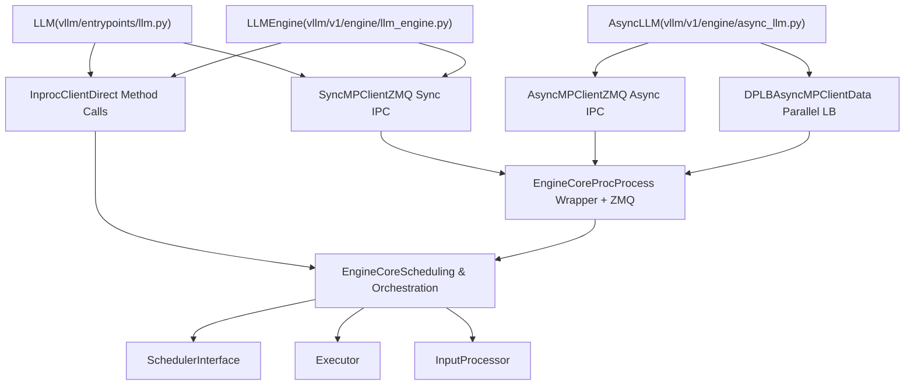
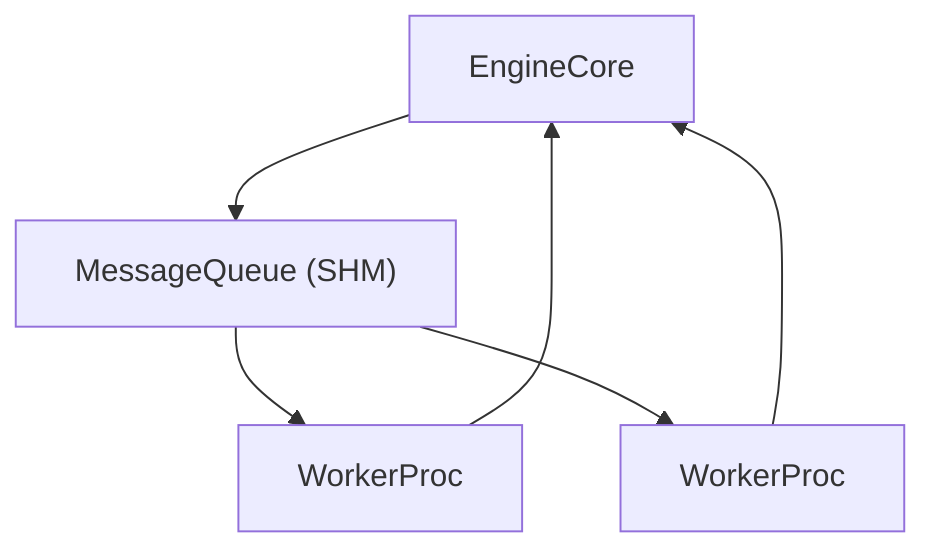

# EngineCore and Client APIs

Relevant source files

-   [tests/entrypoints/test\_api\_server\_process\_manager.py](https://github.com/vllm-project/vllm/blob/7cc302dd/tests/entrypoints/test_api_server_process_manager.py)
-   [tests/v1/engine/test\_engine\_core.py](https://github.com/vllm-project/vllm/blob/7cc302dd/tests/v1/engine/test_engine_core.py)
-   [tests/v1/engine/test\_engine\_core\_client.py](https://github.com/vllm-project/vllm/blob/7cc302dd/tests/v1/engine/test_engine_core_client.py)
-   [vllm/config/parallel.py](https://github.com/vllm-project/vllm/blob/7cc302dd/vllm/config/parallel.py)
-   [vllm/engine/async\_llm\_engine.py](https://github.com/vllm-project/vllm/blob/7cc302dd/vllm/engine/async_llm_engine.py)
-   [vllm/engine/llm\_engine.py](https://github.com/vllm-project/vllm/blob/7cc302dd/vllm/engine/llm_engine.py)
-   [vllm/engine/protocol.py](https://github.com/vllm-project/vllm/blob/7cc302dd/vllm/engine/protocol.py)
-   [vllm/entrypoints/cli/serve.py](https://github.com/vllm-project/vllm/blob/7cc302dd/vllm/entrypoints/cli/serve.py)
-   [vllm/entrypoints/launcher.py](https://github.com/vllm-project/vllm/blob/7cc302dd/vllm/entrypoints/launcher.py)
-   [vllm/entrypoints/llm.py](https://github.com/vllm-project/vllm/blob/7cc302dd/vllm/entrypoints/llm.py)
-   [vllm/v1/engine/async\_llm.py](https://github.com/vllm-project/vllm/blob/7cc302dd/vllm/v1/engine/async_llm.py)
-   [vllm/v1/engine/coordinator.py](https://github.com/vllm-project/vllm/blob/7cc302dd/vllm/v1/engine/coordinator.py)
-   [vllm/v1/engine/core.py](https://github.com/vllm-project/vllm/blob/7cc302dd/vllm/v1/engine/core.py)
-   [vllm/v1/engine/core\_client.py](https://github.com/vllm-project/vllm/blob/7cc302dd/vllm/v1/engine/core_client.py)
-   [vllm/v1/engine/llm\_engine.py](https://github.com/vllm-project/vllm/blob/7cc302dd/vllm/v1/engine/llm_engine.py)
-   [vllm/v1/engine/utils.py](https://github.com/vllm-project/vllm/blob/7cc302dd/vllm/v1/engine/utils.py)
-   [vllm/v1/utils.py](https://github.com/vllm-project/vllm/blob/7cc302dd/vllm/v1/utils.py)

## Purpose and Scope

This document describes the **EngineCore** and **EngineCoreClient** architecture, which forms the execution backbone of vLLM's V1 engine. EngineCore is the "inner loop" responsible for scheduling requests, orchestrating model execution, and producing outputs. EngineCoreClient provides an abstraction layer that allows EngineCore to run in-process or in a separate background process with different concurrency models.

For configuration that feeds into EngineCore, see [VllmConfig and Specialized Configuration Objects](/vllm-project/vllm/2.2-vllmconfig-and-specialized-configuration-objects). For scheduler internals, see [Scheduler and Resource Allocation](/vllm-project/vllm/3.3-scheduler-and-resource-allocation). For the model execution layer that EngineCore orchestrates, see [GPUModelRunner](/vllm-project/vllm/4.1-gpumodelrunner).

## Architecture Overview

The EngineCore and Client APIs separate execution concerns into two layers:

1.  **EngineCore Layer**: Core scheduling and execution logic.
2.  **Client Layer**: IPC abstraction and concurrency management.

### System Architecture Diagram

"Code Entity Space: Engine Architecture"

**Sources:** [vllm/v1/engine/core.py87-187](https://github.com/vllm-project/vllm/blob/7cc302dd/vllm/v1/engine/core.py#L87-L187) [vllm/v1/engine/core\_client.py69-131](https://github.com/vllm-project/vllm/blob/7cc302dd/vllm/v1/engine/core_client.py#L69-L131) [vllm/v1/engine/async\_llm.py71-161](https://github.com/vllm-project/vllm/blob/7cc302dd/vllm/v1/engine/async_llm.py#L71-L161) [vllm/v1/engine/llm\_engine.py48-117](https://github.com/vllm-project/vllm/blob/7cc302dd/vllm/v1/engine/llm_engine.py#L48-L117)

## EngineCore: Core Scheduling and Execution

### Class Structure

`EngineCore` is defined in [vllm/v1/engine/core.py87-187](https://github.com/vllm-project/vllm/blob/7cc302dd/vllm/v1/engine/core.py#L87-L187) and serves as the "inner loop" of vLLM's engine. It orchestrates the model executor, scheduler, and multimodal registries.

| Component | Purpose | Key Class/Interface |
| --- | --- | --- |
| **Model Executor** | Handles distributed forward passes | `vllm.v1.executor.Executor` [vllm/v1/engine/core.py114](https://github.com/vllm-project/vllm/blob/7cc302dd/vllm/v1/engine/core.py#L114-L114) |
| **Scheduler** | Manages request queues and KV blocks | `vllm.v1.core.sched.interface.SchedulerInterface` [vllm/v1/engine/core.py143-150](https://github.com/vllm-project/vllm/blob/7cc302dd/vllm/v1/engine/core.py#L143-L150) |
| **Input Processor** | Prepares requests and tokenization | `vllm.v1.engine.input_processor.InputProcessor` [vllm/v1/engine/async\_llm.py143](https://github.com/vllm-project/vllm/blob/7cc302dd/vllm/v1/engine/async_llm.py#L143-L143) |
| **Output Processor** | Detokenizes and streams outputs | `vllm.v1.engine.output_processor.OutputProcessor` [vllm/v1/engine/async\_llm.py146-151](https://github.com/vllm-project/vllm/blob/7cc302dd/vllm/v1/engine/async_llm.py#L146-L151) |

**Sources:** [vllm/v1/engine/core.py112-150](https://github.com/vllm-project/vllm/blob/7cc302dd/vllm/v1/engine/core.py#L112-L150) [vllm/v1/engine/async\_llm.py143-151](https://github.com/vllm-project/vllm/blob/7cc302dd/vllm/v1/engine/async_llm.py#L143-L151)

### Initialization Flow

The initialization sequence involves profiling GPU memory for KV caches before the scheduler is instantiated.

> **[Mermaid sequence]**
> *(图表结构无法解析)*

**Sources:** [vllm/v1/engine/core.py114-150](https://github.com/vllm-project/vllm/blob/7cc302dd/vllm/v1/engine/core.py#L114-L150)

### Step Functions

EngineCore provides two primary execution modes for processing batches:

1.  **Synchronous `step()`**: Executes one iteration of scheduling and model forward pass. [vllm/v1/engine/core.py385-414](https://github.com/vllm-project/vllm/blob/7cc302dd/vllm/v1/engine/core.py#L385-L414)
2.  **Pipelined `step_with_batch_queue()`**: Used when `max_concurrent_batches > 1` (Pipeline Parallelism). It maintains a `batch_queue` of futures to eliminate pipeline bubbles. [vllm/v1/engine/core.py426-541](https://github.com/vllm-project/vllm/blob/7cc302dd/vllm/v1/engine/core.py#L426-L541)

## EngineCoreClient Abstraction

### Client Interface

`EngineCoreClient` is an abstract base class that provides a uniform interface for interacting with `EngineCore` regardless of whether it is in-process or in a separate background process. [vllm/v1/engine/core\_client.py69-270](https://github.com/vllm-project/vllm/blob/7cc302dd/vllm/v1/engine/core_client.py#L69-L270)

### Client Selection Logic

Clients are instantiated via `EngineCoreClient.make_client()` based on the engine configuration.

| Client Implementation | Concurrency Model | Use Case |
| --- | --- | --- |
| `InprocClient` | Single Process | Legacy `LLMEngine` (V0-style), debugging. [vllm/v1/engine/core\_client.py103](https://github.com/vllm-project/vllm/blob/7cc302dd/vllm/v1/engine/core_client.py#L103-L103) |
| `SyncMPClient` | Multiprocessing (Threaded) | Offline `LLM` class. [vllm/v1/engine/core\_client.py101](https://github.com/vllm-project/vllm/blob/7cc302dd/vllm/v1/engine/core_client.py#L101-L101) |
| `AsyncMPClient` | Multiprocessing (Asyncio) | `AsyncLLM` (FastAPI / OpenAI Server). [vllm/v1/engine/core\_client.py107-130](https://github.com/vllm-project/vllm/blob/7cc302dd/vllm/v1/engine/core_client.py#L107-L130) |
| `DPLBAsyncMPClient` | Data Parallel LB | Multi-node/Multi-GPU data parallel serving. [vllm/v1/engine/core\_client.py129](https://github.com/vllm-project/vllm/blob/7cc302dd/vllm/v1/engine/core_client.py#L129-L129) |

**Sources:** [vllm/v1/engine/core\_client.py81-131](https://github.com/vllm-project/vllm/blob/7cc302dd/vllm/v1/engine/core_client.py#L81-L131)

## IPC Mechanisms and MultiprocExecutor

### ZMQ Communication

For multiprocessing modes, vLLM uses **ZeroMQ (ZMQ)** for low-latency IPC between the client and the `EngineCoreProc`.

-   **Input Socket**: `zmq.ROUTER` (Client) to `zmq.DEALER` (Engine). Used for sending `EngineCoreRequest`. [vllm/v1/engine/core\_client.py521-528](https://github.com/vllm-project/vllm/blob/7cc302dd/vllm/v1/engine/core_client.py#L521-L528)
-   **Output Socket**: `zmq.PUSH` (Engine) to `zmq.PULL` (Client). Used for streaming `EngineCoreOutputs`. [vllm/v1/engine/core\_client.py521-528](https://github.com/vllm-project/vllm/blob/7cc302dd/vllm/v1/engine/core_client.py#L521-L528)

### MultiprocExecutor

The `MultiprocExecutor` manages the lifecycle of worker processes and communication of `SchedulerOutput` via shared memory or specialized IPC.

"Code Entity Space: Distributed Execution IPC"

**Sources:** [vllm/v1/executor/multiproc\_executor.py129-151](https://github.com/vllm-project/vllm/blob/7cc302dd/vllm/v1/executor/multiproc_executor.py#L129-L151) [vllm/v1/executor/multiproc\_executor.py168-181](https://github.com/vllm-project/vllm/blob/7cc302dd/vllm/v1/executor/multiproc_executor.py#L168-L181)

## Data Parallel Coordination

When `data_parallel_size > 1`, the engine uses a `DPCoordinator` to aggregate statistics and a `DPLBAsyncMPClient` to perform load balancing.

-   **Stickiness**: For tasks like Late Interaction, the client uses `get_late_interaction_engine_index` to route related queries and documents to the same DP rank. [vllm/v1/engine/core\_client.py57](https://github.com/vllm-project/vllm/blob/7cc302dd/vllm/v1/engine/core_client.py#L57-L57) [vllm/v1/engine/core\_client.py1372-1385](https://github.com/vllm-project/vllm/blob/7cc302dd/vllm/v1/engine/core_client.py#L1372-L1385)
-   **Load Balancing**: The `DPLBAsyncMPClient` tracks `reqs_in_flight` and `lb_engines` (waiting/running counts) to distribute requests to the least-loaded rank. [vllm/v1/engine/core\_client.py1356-1370](https://github.com/vllm-project/vllm/blob/7cc302dd/vllm/v1/engine/core_client.py#L1356-L1370)

**Sources:** [vllm/v1/engine/core\_client.py1282-1473](https://github.com/vllm-project/vllm/blob/7cc302dd/vllm/v1/engine/core_client.py#L1282-L1473) [vllm/v1/engine/coordinator.py27-111](https://github.com/vllm-project/vllm/blob/7cc302dd/vllm/v1/engine/coordinator.py#L27-L111)

## Key Data Structures

### EngineCoreRequest

The primary input structure passed from clients to the engine. [vllm/v1/engine/\_\_init\_\_.py](https://github.com/vllm-project/vllm/blob/7cc302dd/vllm/v1/engine/__init__.py)

-   `request_id`: Unique ID for the request.
-   `prompt_token_ids`: The tokenized input.
-   `sampling_params`: Parameters for generation (e.g., temperature).
-   `mm_features`: Multimodal data (images, video).

### EngineCoreOutputs

The response structure streamed back from the engine. [vllm/v1/engine/\_\_init\_\_.py](https://github.com/vllm-project/vllm/blob/7cc302dd/vllm/v1/engine/__init__.py)

-   `outputs`: List of `EngineCoreOutput` (contains `new_token_ids`, `finished` flag).
-   `scheduler_stats`: Metadata about engine load and KV cache usage.

**Sources:** [vllm/v1/engine/core.py48-61](https://github.com/vllm-project/vllm/blob/7cc302dd/vllm/v1/engine/core.py#L48-L61)
