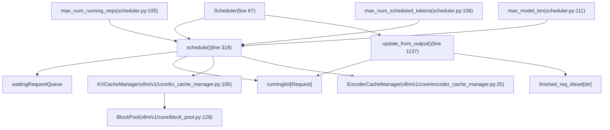
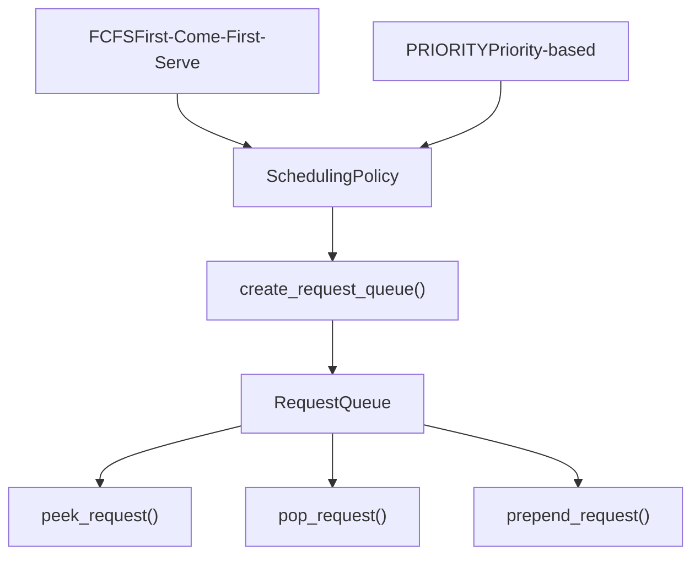

# Scheduler and Resource Allocation

Relevant source files

-   [tests/v1/core/test\_kv\_cache\_utils.py](https://github.com/vllm-project/vllm/blob/7cc302dd/tests/v1/core/test_kv_cache_utils.py)
-   [tests/v1/core/test\_prefix\_caching.py](https://github.com/vllm-project/vllm/blob/7cc302dd/tests/v1/core/test_prefix_caching.py)
-   [tests/v1/core/test\_scheduler.py](https://github.com/vllm-project/vllm/blob/7cc302dd/tests/v1/core/test_scheduler.py)
-   [tests/v1/core/test\_single\_type\_kv\_cache\_manager.py](https://github.com/vllm-project/vllm/blob/7cc302dd/tests/v1/core/test_single_type_kv_cache_manager.py)
-   [tests/v1/core/utils.py](https://github.com/vllm-project/vllm/blob/7cc302dd/tests/v1/core/utils.py)
-   [vllm/v1/core/block\_pool.py](https://github.com/vllm-project/vllm/blob/7cc302dd/vllm/v1/core/block_pool.py)
-   [vllm/v1/core/kv\_cache\_coordinator.py](https://github.com/vllm-project/vllm/blob/7cc302dd/vllm/v1/core/kv_cache_coordinator.py)
-   [vllm/v1/core/kv\_cache\_manager.py](https://github.com/vllm-project/vllm/blob/7cc302dd/vllm/v1/core/kv_cache_manager.py)
-   [vllm/v1/core/kv\_cache\_utils.py](https://github.com/vllm-project/vllm/blob/7cc302dd/vllm/v1/core/kv_cache_utils.py)
-   [vllm/v1/core/sched/scheduler.py](https://github.com/vllm-project/vllm/blob/7cc302dd/vllm/v1/core/sched/scheduler.py)
-   [vllm/v1/core/single\_type\_kv\_cache\_manager.py](https://github.com/vllm-project/vllm/blob/7cc302dd/vllm/v1/core/single_type_kv_cache_manager.py)
-   [vllm/v1/engine/\_\_init\_\_.py](https://github.com/vllm-project/vllm/blob/7cc302dd/vllm/v1/engine/__init__.py)
-   [vllm/v1/kv\_cache\_interface.py](https://github.com/vllm-project/vllm/blob/7cc302dd/vllm/v1/kv_cache_interface.py)
-   [vllm/v1/request.py](https://github.com/vllm-project/vllm/blob/7cc302dd/vllm/v1/request.py)

## Purpose and Scope

This page documents the scheduling algorithm and resource allocation mechanisms in vLLM's v1 engine architecture. The `Scheduler` class is responsible for deciding which requests to process at each step, allocating GPU memory (KV cache blocks) to requests, and managing resource constraints to maximize throughput while preventing out-of-memory conditions.

For information about how the scheduler fits into the overall engine architecture, see [Engine Core and Client APIs](https://github.com/vllm-project/vllm/blob/7cc302dd/Engine Core and Client APIs)(). For details on request state transitions and lifecycle, see [Request Lifecycle and State Management](https://github.com/vllm-project/vllm/blob/7cc302dd/Request Lifecycle and State Management)(). For the KV cache block management implementation details, see [KV Cache Management](https://github.com/vllm-project/vllm/blob/7cc302dd/KV Cache Management)().

**Sources:** [vllm/v1/core/sched/scheduler.py1-100](https://github.com/vllm-project/vllm/blob/7cc302dd/vllm/v1/core/sched/scheduler.py#L1-L100) [vllm/v1/request.py1-100](https://github.com/vllm-project/vllm/blob/7cc302dd/vllm/v1/request.py#L1-L100) [vllm/v1/core/kv\_cache\_manager.py1-120](https://github.com/vllm-project/vllm/blob/7cc302dd/vllm/v1/core/kv_cache_manager.py#L1-L120)

## Scheduler Architecture Overview

The `Scheduler` class operates as a central coordinator that makes scheduling decisions at each engine step. It maintains request queues, tracks resource usage, and interfaces with the `KVCacheManager` to allocate memory blocks for request execution.

### Scheduler Components Diagram

**Sources:** [vllm/v1/core/sched/scheduler.py67-115](https://github.com/vllm-project/vllm/blob/7cc302dd/vllm/v1/core/sched/scheduler.py#L67-L115) [vllm/v1/core/kv\_cache\_manager.py106-142](https://github.com/vllm-project/vllm/blob/7cc302dd/vllm/v1/core/kv_cache_manager.py#L106-L142) [vllm/v1/core/kv\_cache\_coordinator.py49-55](https://github.com/vllm-project/vllm/blob/7cc302dd/vllm/v1/core/kv_cache_coordinator.py#L49-L55) [vllm/v1/core/encoder\_cache\_manager.py35-40](https://github.com/vllm-project/vllm/blob/7cc302dd/vllm/v1/core/encoder_cache_manager.py#L35-L40)

## Request Queuing System

The scheduler maintains primary data structures for tracking requests based on their `RequestStatus` defined in [vllm/v1/request.py59](https://github.com/vllm-project/vllm/blob/7cc302dd/vllm/v1/request.py#L59-L59)

| Queue | Type | Purpose |
| --- | --- | --- |
| `waiting` | `RequestQueue` | Holds requests waiting to be scheduled (WAITING, WAITING\_FOR\_FSM, WAITING\_FOR\_REMOTE\_KVS status) [vllm/v1/core/sched/scheduler.py166](https://github.com/vllm-project/vllm/blob/7cc302dd/vllm/v1/core/sched/scheduler.py#L166-L166) |
| `running` | `list[Request]` | Holds requests currently being executed (RUNNING status) [vllm/v1/core/sched/scheduler.py168](https://github.com/vllm-project/vllm/blob/7cc302dd/vllm/v1/core/sched/scheduler.py#L168-L168) |
| `preempted_reqs` | `list[Request]` | Temporary storage for requests preempted during the current schedule call [vllm/v1/core/sched/scheduler.py321](https://github.com/vllm-project/vllm/blob/7cc302dd/vllm/v1/core/sched/scheduler.py#L321-L321) |

The `RequestQueue` implementation supports different scheduling policies via the `SchedulingPolicy` enum [vllm/v1/core/sched/request\_queue.py50](https://github.com/vllm-project/vllm/blob/7cc302dd/vllm/v1/core/sched/request_queue.py#L50-L50):

**Sources:** [vllm/v1/core/sched/scheduler.py158-169](https://github.com/vllm-project/vllm/blob/7cc302dd/vllm/v1/core/sched/scheduler.py#L158-L169) [vllm/v1/core/sched/request\_queue.py50-52](https://github.com/vllm-project/vllm/blob/7cc302dd/vllm/v1/core/sched/request_queue.py#L50-L52)

## Scheduling Algorithm

The `schedule()` method [vllm/v1/core/sched/scheduler.py318](https://github.com/vllm-project/vllm/blob/7cc302dd/vllm/v1/core/sched/scheduler.py#L318-L318) executes a multi-phase algorithm:

### Phase 1: Schedule Running Requests

The scheduler first attempts to continue requests already in the `running` list. If GPU memory is insufficient to grow the KV cache for a running request, the scheduler performs preemption [vllm/v1/core/sched/scheduler.py443](https://github.com/vllm-project/vllm/blob/7cc302dd/vllm/v1/core/sched/scheduler.py#L443-L443)

> **[Mermaid sequence]**
> *(图表结构无法解析)*

**Sources:** [vllm/v1/core/sched/scheduler.py318-520](https://github.com/vllm-project/vllm/blob/7cc302dd/vllm/v1/core/sched/scheduler.py#L318-L520)

### Phase 2: Schedule Waiting Requests

After satisfying running requests, the scheduler pulls from the `waiting` queue until the `token_budget` or `max_num_running_reqs` is reached [vllm/v1/core/sched/scheduler.py531](https://github.com/vllm-project/vllm/blob/7cc302dd/vllm/v1/core/sched/scheduler.py#L531-L531)

> **[Mermaid sequence]**
> *(图表结构无法解析)*

**Sources:** [vllm/v1/core/sched/scheduler.py531-831](https://github.com/vllm-project/vllm/blob/7cc302dd/vllm/v1/core/sched/scheduler.py#L531-L831)

## Resource Constraints and Budgets

The scheduler enforces multiple constraints to ensure stability and performance:

| Constraint | Code Entity | Purpose |
| --- | --- | --- |
| **Token Budget** | `max_num_scheduled_tokens` | Limits total tokens in a batch to prevent OOM/latency spikes [vllm/v1/core/sched/scheduler.py106](https://github.com/vllm-project/vllm/blob/7cc302dd/vllm/v1/core/sched/scheduler.py#L106-L106) |
| **Request Limit** | `max_num_running_reqs` | Limits concurrent sequences [vllm/v1/core/sched/scheduler.py105](https://github.com/vllm-project/vllm/blob/7cc302dd/vllm/v1/core/sched/scheduler.py#L105-L105) |
| **KV Cache** | `KVCacheManager` | Physical GPU memory availability [vllm/v1/core/kv\_cache\_manager.py106](https://github.com/vllm-project/vllm/blob/7cc302dd/vllm/v1/core/kv_cache_manager.py#L106-L106) |
| **Encoder Budget** | `max_num_encoder_input_tokens` | Limits multimodal encoder compute [vllm/v1/core/sched/scheduler.py1753](https://github.com/vllm-project/vllm/blob/7cc302dd/vllm/v1/core/sched/scheduler.py#L1753-L1753) |
| **LoRA Limit** | `max_loras` | Limits unique LoRA adapters in a batch [vllm/v1/core/sched/scheduler.py521](https://github.com/vllm-project/vllm/blob/7cc302dd/vllm/v1/core/sched/scheduler.py#L521-L521) |

**Sources:** [vllm/v1/core/sched/scheduler.py101-115](https://github.com/vllm-project/vllm/blob/7cc302dd/vllm/v1/core/sched/scheduler.py#L101-L115) [vllm/v1/core/sched/scheduler.py521-530](https://github.com/vllm-project/vllm/blob/7cc302dd/vllm/v1/core/sched/scheduler.py#L521-L530) [vllm/v1/core/sched/scheduler.py1753-1760](https://github.com/vllm-project/vllm/blob/7cc302dd/vllm/v1/core/sched/scheduler.py#L1753-L1760)

## KV Cache Slot Allocation

KV cache allocation is managed through the `KVCacheManager.allocate_slots()` method [vllm/v1/core/kv\_cache\_manager.py206](https://github.com/vllm-project/vllm/blob/7cc302dd/vllm/v1/core/kv_cache_manager.py#L206-L206) The manager coordinates across multiple KV cache groups (e.g., Attention, Mamba, Cross-Attention).

### Allocation Logic Flow

1.  **Prefix Caching:** Uses `get_computed_blocks()` to find existing blocks in the `BlockPool` [vllm/v1/core/kv\_cache\_manager.py176-187](https://github.com/vllm-project/vllm/blob/7cc302dd/vllm/v1/core/kv_cache_manager.py#L176-L187)
2.  **Growth Calculation:** Delegates to `KVCacheCoordinator.get_num_blocks_to_allocate()` to determine how many new blocks are needed across all groups [vllm/v1/core/kv\_cache\_coordinator.py71-79](https://github.com/vllm-project/vllm/blob/7cc302dd/vllm/v1/core/kv_cache_coordinator.py#L71-L79)
3.  **Physical Allocation:** Requests blocks from the `BlockPool` via `coordinator.allocate_new_blocks()` [vllm/v1/core/kv\_cache\_coordinator.py143-149](https://github.com/vllm-project/vllm/blob/7cc302dd/vllm/v1/core/kv_cache_coordinator.py#L143-L149)
4.  **Hashing:** Full blocks are hashed and indexed in `BlockHashToBlockMap` for future reuse [vllm/v1/core/block\_pool.py33-59](https://github.com/vllm-project/vllm/blob/7cc302dd/vllm/v1/core/block_pool.py#L33-L59)

**Sources:** [vllm/v1/core/kv\_cache\_manager.py176-376](https://github.com/vllm-project/vllm/blob/7cc302dd/vllm/v1/core/kv_cache_manager.py#L176-L376) [vllm/v1/core/kv\_cache\_coordinator.py71-177](https://github.com/vllm-project/vllm/blob/7cc302dd/vllm/v1/core/kv_cache_coordinator.py#L71-L177) [vllm/v1/core/block\_pool.py33-128](https://github.com/vllm-project/vllm/blob/7cc302dd/vllm/v1/core/block_pool.py#L33-L128)

## Preemption Strategy

When memory is exhausted, the scheduler invokes `_preempt_request()` [vllm/v1/core/sched/scheduler.py833](https://github.com/vllm-project/vllm/blob/7cc302dd/vllm/v1/core/sched/scheduler.py#L833-L833)

### Preemption Behavior

-   **Memory Release:** Calls `kv_cache_manager.free(request.request_id)` to return blocks to the `FreeKVCacheBlockQueue` [vllm/v1/core/sched/scheduler.py844](https://github.com/vllm-project/vllm/blob/7cc302dd/vllm/v1/core/sched/scheduler.py#L844-L844) [vllm/v1/core/kv\_cache\_utils.py158](https://github.com/vllm-project/vllm/blob/7cc302dd/vllm/v1/core/kv_cache_utils.py#L158-L158)
-   **State Reset:** Increments `request.num_preemptions` and sets status to `PREEMPTED` [vllm/v1/core/sched/scheduler.py863-864](https://github.com/vllm-project/vllm/blob/7cc302dd/vllm/v1/core/sched/scheduler.py#L863-L864)
-   **Re-queuing:** Prepends the request back to the `waiting` queue to be prioritized in the next step [vllm/v1/core/sched/scheduler.py874](https://github.com/vllm-project/vllm/blob/7cc302dd/vllm/v1/core/sched/scheduler.py#L874-L874)

**Sources:** [vllm/v1/core/sched/scheduler.py833-876](https://github.com/vllm-project/vllm/blob/7cc302dd/vllm/v1/core/sched/scheduler.py#L833-L876) [vllm/v1/core/kv\_cache\_manager.py383-385](https://github.com/vllm-project/vllm/blob/7cc302dd/vllm/v1/core/kv_cache_manager.py#L383-L385) [vllm/v1/core/kv\_cache\_utils.py158-178](https://github.com/vllm-project/vllm/blob/7cc302dd/vllm/v1/core/kv_cache_utils.py#L158-L178)

## Special Scheduling Cases

### Chunked Prefill

If `long_prefill_token_threshold` is set, the scheduler limits the tokens processed for a single request in one step [vllm/v1/core/sched/scheduler.py379-380](https://github.com/vllm-project/vllm/blob/7cc302dd/vllm/v1/core/sched/scheduler.py#L379-L380) The request remains in the `running` list but is marked as `is_prefill_chunk = True` [vllm/v1/request.py153](https://github.com/vllm-project/vllm/blob/7cc302dd/vllm/v1/request.py#L153-L153)

### Mamba Block Alignment

For models with Mamba layers, the scheduler enforces block-aligned splitting [vllm/v1/core/sched/scheduler.py407](https://github.com/vllm-project/vllm/blob/7cc302dd/vllm/v1/core/sched/scheduler.py#L407-L407) This is handled by `_mamba_block_aligned_split()` which ensures that prefill chunks align with the `block_size` required for Mamba state management [vllm/v1/core/sched/scheduler.py268-316](https://github.com/vllm-project/vllm/blob/7cc302dd/vllm/v1/core/sched/scheduler.py#L268-L316)

### Speculative Decoding

The scheduler allocates extra "lookahead" slots for draft tokens [vllm/v1/core/sched/scheduler.py491](https://github.com/vllm-project/vllm/blob/7cc302dd/vllm/v1/core/sched/scheduler.py#L491-L491) It tracks `scheduled_spec_decode_tokens` and coordinates with the `SpeculativeConfig` to manage the draft/verify cycle [vllm/v1/core/sched/scheduler.py205-214](https://github.com/vllm-project/vllm/blob/7cc302dd/vllm/v1/core/sched/scheduler.py#L205-L214)

**Sources:** [vllm/v1/core/sched/scheduler.py268-316](https://github.com/vllm-project/vllm/blob/7cc302dd/vllm/v1/core/sched/scheduler.py#L268-L316) [vllm/v1/core/sched/scheduler.py379-380](https://github.com/vllm-project/vllm/blob/7cc302dd/vllm/v1/core/sched/scheduler.py#L379-L380) [vllm/v1/core/sched/scheduler.py491-502](https://github.com/vllm-project/vllm/blob/7cc302dd/vllm/v1/core/sched/scheduler.py#L491-L502) [vllm/v1/request.py153-154](https://github.com/vllm-project/vllm/blob/7cc302dd/vllm/v1/request.py#L153-L154)
