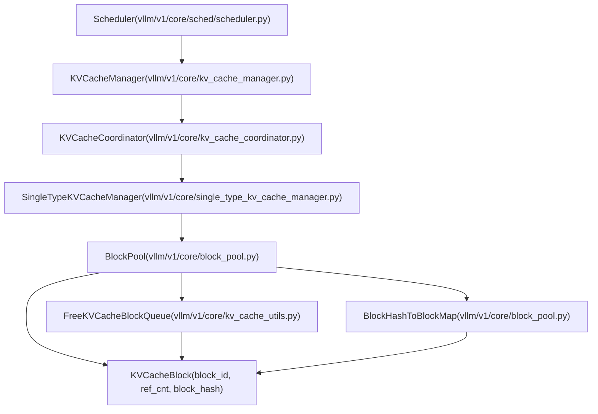
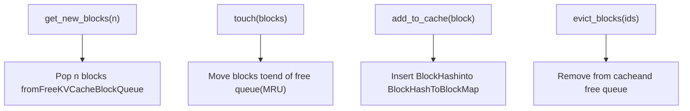
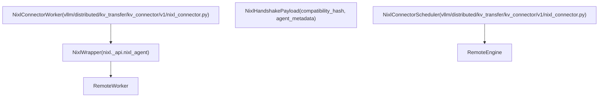

# KV Cache Management and Prefix Caching

Relevant source files

-   [docs/features/nixl\_connector\_usage.md](https://github.com/vllm-project/vllm/blob/7cc302dd/docs/features/nixl_connector_usage.md?plain=1)
-   [tests/v1/core/test\_kv\_cache\_utils.py](https://github.com/vllm-project/vllm/blob/7cc302dd/tests/v1/core/test_kv_cache_utils.py)
-   [tests/v1/core/test\_prefix\_caching.py](https://github.com/vllm-project/vllm/blob/7cc302dd/tests/v1/core/test_prefix_caching.py)
-   [tests/v1/core/test\_scheduler.py](https://github.com/vllm-project/vllm/blob/7cc302dd/tests/v1/core/test_scheduler.py)
-   [tests/v1/core/test\_single\_type\_kv\_cache\_manager.py](https://github.com/vllm-project/vllm/blob/7cc302dd/tests/v1/core/test_single_type_kv_cache_manager.py)
-   [tests/v1/core/utils.py](https://github.com/vllm-project/vllm/blob/7cc302dd/tests/v1/core/utils.py)
-   [tests/v1/kv\_connector/nixl\_integration/run\_accuracy\_test.sh](https://github.com/vllm-project/vllm/blob/7cc302dd/tests/v1/kv_connector/nixl_integration/run_accuracy_test.sh)
-   [tests/v1/kv\_connector/nixl\_integration/run\_edge\_case\_test.sh](https://github.com/vllm-project/vllm/blob/7cc302dd/tests/v1/kv_connector/nixl_integration/run_edge_case_test.sh)
-   [tests/v1/kv\_connector/unit/test\_multi\_connector.py](https://github.com/vllm-project/vllm/blob/7cc302dd/tests/v1/kv_connector/unit/test_multi_connector.py)
-   [tests/v1/kv\_connector/unit/test\_nixl\_connector.py](https://github.com/vllm-project/vllm/blob/7cc302dd/tests/v1/kv_connector/unit/test_nixl_connector.py)
-   [tests/v1/kv\_connector/unit/utils.py](https://github.com/vllm-project/vllm/blob/7cc302dd/tests/v1/kv_connector/unit/utils.py)
-   [vllm/distributed/kv\_transfer/kv\_connector/factory.py](https://github.com/vllm-project/vllm/blob/7cc302dd/vllm/distributed/kv_transfer/kv_connector/factory.py)
-   [vllm/distributed/kv\_transfer/kv\_connector/utils.py](https://github.com/vllm-project/vllm/blob/7cc302dd/vllm/distributed/kv_transfer/kv_connector/utils.py)
-   [vllm/distributed/kv\_transfer/kv\_connector/v1/base.py](https://github.com/vllm-project/vllm/blob/7cc302dd/vllm/distributed/kv_transfer/kv_connector/v1/base.py)
-   [vllm/distributed/kv\_transfer/kv\_connector/v1/multi\_connector.py](https://github.com/vllm-project/vllm/blob/7cc302dd/vllm/distributed/kv_transfer/kv_connector/v1/multi_connector.py)
-   [vllm/distributed/kv\_transfer/kv\_connector/v1/nixl\_connector.py](https://github.com/vllm-project/vllm/blob/7cc302dd/vllm/distributed/kv_transfer/kv_connector/v1/nixl_connector.py)
-   [vllm/distributed/kv\_transfer/kv\_transfer\_state.py](https://github.com/vllm-project/vllm/blob/7cc302dd/vllm/distributed/kv_transfer/kv_transfer_state.py)
-   [vllm/v1/core/block\_pool.py](https://github.com/vllm-project/vllm/blob/7cc302dd/vllm/v1/core/block_pool.py)
-   [vllm/v1/core/kv\_cache\_coordinator.py](https://github.com/vllm-project/vllm/blob/7cc302dd/vllm/v1/core/kv_cache_coordinator.py)
-   [vllm/v1/core/kv\_cache\_manager.py](https://github.com/vllm-project/vllm/blob/7cc302dd/vllm/v1/core/kv_cache_manager.py)
-   [vllm/v1/core/kv\_cache\_utils.py](https://github.com/vllm-project/vllm/blob/7cc302dd/vllm/v1/core/kv_cache_utils.py)
-   [vllm/v1/core/sched/scheduler.py](https://github.com/vllm-project/vllm/blob/7cc302dd/vllm/v1/core/sched/scheduler.py)
-   [vllm/v1/core/single\_type\_kv\_cache\_manager.py](https://github.com/vllm-project/vllm/blob/7cc302dd/vllm/v1/core/single_type_kv_cache_manager.py)
-   [vllm/v1/engine/\_\_init\_\_.py](https://github.com/vllm-project/vllm/blob/7cc302dd/vllm/v1/engine/__init__.py)
-   [vllm/v1/kv\_cache\_interface.py](https://github.com/vllm-project/vllm/blob/7cc302dd/vllm/v1/kv_cache_interface.py)
-   [vllm/v1/outputs.py](https://github.com/vllm-project/vllm/blob/7cc302dd/vllm/v1/outputs.py)
-   [vllm/v1/request.py](https://github.com/vllm-project/vllm/blob/7cc302dd/vllm/v1/request.py)
-   [vllm/v1/worker/kv\_connector\_model\_runner\_mixin.py](https://github.com/vllm-project/vllm/blob/7cc302dd/vllm/v1/worker/kv_connector_model_runner_mixin.py)

## Purpose and Scope

This document describes vLLM's KV cache management system and its prefix caching implementation (Automatic Prefix Caching - APC). The KV cache manager handles memory allocation for key-value tensors during inference, enabling efficient reuse of cached computations across requests with common token sequences.

**Scope:**

-   Block-based memory allocation and management via `KVCacheManager` and `BlockPool`.
-   Prefix caching mechanism for deduplicating computations using `BlockHash`.
-   Block allocation strategies for various attention types (Full, Sliding Window, MLA, Mamba).
-   Integration with the scheduler for memory-aware request scheduling.

**Related Pages:**

-   For scheduler integration and request management, see [Scheduler and Resource Allocation](/vllm-project/vllm/3.3-scheduler-and-resource-allocation).
-   For GPU execution and model runner details, see [GPUModelRunner](/vllm-project/vllm/4.1-gpumodelrunner).
-   For distributed KV cache transfer, see [KV Cache Transfer and Disaggregated Serving](/vllm-project/vllm/9.4-kv-cache-transfer-and-disaggregated-serving).

---

## Core Concepts

### Blocks and Block Size

The KV cache is organized into fixed-size **blocks**, where each block stores KV tensors for a fixed number of tokens (typically 16). This block-based approach enables:

1.  **Efficient memory management**: Allocate and free memory in block-sized chunks.
2.  **Prefix caching**: Share blocks across requests with common token prefixes.
3.  **Memory fragmentation control**: Fixed-size allocations reduce fragmentation.

A block stores KV tensors for `block_size` tokens. For a model with `num_kv_heads` attention heads and `head_size` dimensions:

-   Block memory = `2 * block_size * num_kv_heads * head_size * dtype_size`.
-   Factor of 2 accounts for both Key and Value tensors.

**Sources:** [vllm/v1/kv\_cache\_interface.py19-88](https://github.com/vllm-project/vllm/blob/7cc302dd/vllm/v1/kv_cache_interface.py#L19-L88) [vllm/v1/core/kv\_cache\_utils.py109-156](https://github.com/vllm-project/vllm/blob/7cc302dd/vllm/v1/core/kv_cache_utils.py#L109-L156)

### Prefix Caching Overview

**Prefix caching** (also called Automatic Prefix Caching or APC) allows vLLM to reuse KV cache blocks across requests that share common token sequences. When a new request arrives, the system:

1.  Computes block hashes for full blocks in the request's token sequence via `get_request_block_hasher` [vllm/v1/core/kv\_cache\_utils.py32](https://github.com/vllm-project/vllm/blob/7cc302dd/vllm/v1/core/kv_cache_utils.py#L32-L32)
2.  Looks up these hashes in the prefix cache via `BlockPool` [vllm/v1/core/kv\_cache\_manager.py143](https://github.com/vllm-project/vllm/blob/7cc302dd/vllm/v1/core/kv_cache_manager.py#L143-L143)
3.  Reuses cached blocks for matching prefixes.
4.  Only computes new tokens that aren't cached.

This provides significant performance improvements for repeated prompts, multi-turn conversations, and few-shot learning.

**Sources:** [vllm/v1/core/kv\_cache\_manager.py176-216](https://github.com/vllm-project/vllm/blob/7cc302dd/vllm/v1/core/kv_cache_manager.py#L176-L216) [tests/v1/core/test\_prefix\_caching.py1-40](https://github.com/vllm-project/vllm/blob/7cc302dd/tests/v1/core/test_prefix_caching.py#L1-L40)

### Block Hashing

Each full block is identified by a `BlockHash` computed from:

1.  **Parent block hash**: Hash of the previous block (forming a hash chain).
2.  **Current block tokens**: Token IDs in this block.
3.  **Extra keys** (optional):
    -   Multimodal identifiers for blocks containing MM tokens [vllm/v1/request.py138-139](https://github.com/vllm-project/vllm/blob/7cc302dd/vllm/v1/request.py#L138-L139)
    -   LoRA request names for LoRA-specific caching [vllm/v1/request.py82](https://github.com/vllm-project/vllm/blob/7cc302dd/vllm/v1/request.py#L82-L82)
    -   Cache salt for request-specific cache isolation [vllm/v1/request.py136](https://github.com/vllm-project/vllm/blob/7cc302dd/vllm/v1/request.py#L136-L136)
    -   Prompt embeddings hash for embedding-based inputs [vllm/v1/request.py118](https://github.com/vllm-project/vllm/blob/7cc302dd/vllm/v1/request.py#L118-L118)

The hash function (default `sha256`) produces a unique identifier for each block's content and context. `init_none_hash` initializes the base seed for the hash chain [vllm/v1/core/kv\_cache\_utils.py91-107](https://github.com/vllm-project/vllm/blob/7cc302dd/vllm/v1/core/kv_cache_utils.py#L91-L107)

**Sources:** [vllm/v1/core/kv\_cache\_utils.py49-107](https://github.com/vllm-project/vllm/blob/7cc302dd/vllm/v1/core/kv_cache_utils.py#L49-L107) [vllm/v1/request.py58-178](https://github.com/vllm-project/vllm/blob/7cc302dd/vllm/v1/request.py#L58-L178)

---

## Architecture Overview

### KV Cache System Hierarchy

The diagram below illustrates how high-level scheduling entities interact with the low-level block management classes.


**Sources:** [vllm/v1/core/kv\_cache\_manager.py106-154](https://github.com/vllm-project/vllm/blob/7cc302dd/vllm/v1/core/kv_cache_manager.py#L106-L154) [vllm/v1/core/kv\_cache\_coordinator.py11-40](https://github.com/vllm-project/vllm/blob/7cc302dd/vllm/v1/core/kv_cache_coordinator.py#L11-L40) [vllm/v1/core/block\_pool.py129-150](https://github.com/vllm-project/vllm/blob/7cc302dd/vllm/v1/core/block_pool.py#L129-L150) [vllm/v1/core/sched/scheduler.py39-40](https://github.com/vllm-project/vllm/blob/7cc302dd/vllm/v1/core/sched/scheduler.py#L39-L40)

---

## Key Components

### KVCacheManager

`KVCacheManager` is the main entry point for KV cache operations, providing a unified interface for the `Scheduler`. It wraps a `KVCacheCoordinator` to handle multiple `KVCacheGroup` specs (e.g., for hybrid models with both Attention and Mamba layers) [vllm/v1/core/kv\_cache\_manager.py131-142](https://github.com/vllm-project/vllm/blob/7cc302dd/vllm/v1/core/kv_cache_manager.py#L131-L142)

**Key Methods:**

| Method | Purpose | Returns |
| --- | --- | --- |
| `get_computed_blocks()` | Find prefix cache hits for a request | `(KVCacheBlocks, num_cached_tokens)` |
| `allocate_slots()` | Allocate blocks for new tokens | `KVCacheBlocks` or `None` if OOM |
| `free()` | Free all blocks for a completed request | `None` |
| `cache_blocks()` | Add blocks to prefix cache | `None` |
| `reset_prefix_cache()` | Clear all cached blocks | `bool` (success) |

**Sources:** [vllm/v1/core/kv\_cache\_manager.py106-154](https://github.com/vllm-project/vllm/blob/7cc302dd/vllm/v1/core/kv_cache_manager.py#L106-L154) [vllm/v1/core/kv\_cache\_manager.py176-507](https://github.com/vllm-project/vllm/blob/7cc302dd/vllm/v1/core/kv_cache_manager.py#L176-L507)

### BlockPool

`BlockPool` manages the physical blocks and implements the prefix cache. It maintains:

1.  **All blocks**: Array of `KVCacheBlock` objects (index = `block_id`).
2.  **Free block queue**: `FreeKVCacheBlockQueue` of available blocks in LRU order.
3.  **Cached block map**: `BlockHashToBlockMap` mapping `BlockHashWithGroupId` → `KVCacheBlock`.

**Key Operations:**


**Sources:** [vllm/v1/core/block\_pool.py129-507](https://github.com/vllm-project/vllm/blob/7cc302dd/vllm/v1/core/block_pool.py#L129-L507) [vllm/v1/core/kv\_cache\_utils.py158-180](https://github.com/vllm-project/vllm/blob/7cc302dd/vllm/v1/core/kv_cache_utils.py#L158-L180)

### KVCacheBlock

`KVCacheBlock` represents a single block with metadata. It uses `__slots__` to minimize memory overhead [vllm/v1/core/kv\_cache\_utils.py109](https://github.com/vllm-project/vllm/blob/7cc302dd/vllm/v1/core/kv_cache_utils.py#L109-L109)

```
# vllm/v1/core/kv_cache_utils.py:109-127@dataclass(slots=True)class KVCacheBlock:    block_id: int                              # Physical block ID    ref_cnt: int = 0                          # Reference count    _block_hash: BlockHashWithGroupId | None = None  # Hash when cached    prev_free_block: "KVCacheBlock | None" = None     # Free list prev    next_free_block: "KVCacheBlock | None" = None     # Free list next    is_null: bool = False                     # Null block flag
```
**Sources:** [vllm/v1/core/kv\_cache\_utils.py109-156](https://github.com/vllm-project/vllm/blob/7cc302dd/vllm/v1/core/kv_cache_utils.py#L109-L156)

### Block Hash System

#### BlockHash Types

```
# vllm/v1/core/kv_cache_utils.py:33-41BlockHash = NewType("BlockHash", bytes)  # Raw hash (e.g., SHA256 digest)BlockHashWithGroupId = NewType("BlockHashWithGroupId", bytes)  # Hash + group_id
```
The `BlockHashWithGroupId` packs both the hash and KV cache group ID into a single bytes key to allow different attention types to share the same physical pool while maintaining separate logical caches [vllm/v1/core/kv\_cache\_utils.py49-58](https://github.com/vllm-project/vllm/blob/7cc302dd/vllm/v1/core/kv_cache_utils.py#L49-L58)

**Sources:** [vllm/v1/core/kv\_cache\_utils.py49-68](https://github.com/vllm-project/vllm/blob/7cc302dd/vllm/v1/core/kv_cache_utils.py#L49-L68)

---

## Block Allocation Flow

### Detailed Allocation Sequence

The interaction between the `Scheduler` and the `KVCacheManager` follows a strict sequence during each scheduling step.

> **[Mermaid sequence]**
> *(图表结构无法解析)*

**Sources:** [vllm/v1/core/kv\_cache\_manager.py218-388](https://github.com/vllm-project/vllm/blob/7cc302dd/vllm/v1/core/kv_cache_manager.py#L218-L388) [vllm/v1/core/single\_type\_kv\_cache\_manager.py77-220](https://github.com/vllm-project/vllm/blob/7cc302dd/vllm/v1/core/single_type_kv_cache_manager.py#L77-L220) [vllm/v1/core/sched/scheduler.py615-625](https://github.com/vllm-project/vllm/blob/7cc302dd/vllm/v1/core/sched/scheduler.py#L615-L625)

### Block Eviction and LRU Policy

Blocks are evicted in LRU (Least Recently Used) order when allocating new blocks and the free queue is exhausted. The `FreeKVCacheBlockQueue` maintains this order [vllm/v1/core/kv\_cache\_utils.py158-166](https://github.com/vllm-project/vllm/blob/7cc302dd/vllm/v1/core/kv_cache_utils.py#L158-L166)

1.  **LRU ordering**: Least recently used blocks are at the front.
2.  **Chain tail first**: If two blocks have the same last accessed time (allocated by the same sequence), the one with more hash tokens (the tail) is at the front [vllm/v1/core/kv\_cache\_utils.py172-174](https://github.com/vllm-project/vllm/blob/7cc302dd/vllm/v1/core/kv_cache_utils.py#L172-L174)
3.  **Reference Counting**: Blocks are only eligible for the free queue when `ref_cnt == 0` [vllm/v1/core/kv\_cache\_utils.py110-114](https://github.com/vllm-project/vllm/blob/7cc302dd/vllm/v1/core/kv_cache_utils.py#L110-L114)

**Sources:** [vllm/v1/core/kv\_cache\_utils.py158-180](https://github.com/vllm-project/vllm/blob/7cc302dd/vllm/v1/core/kv_cache_utils.py#L158-L180) [vllm/v1/core/block\_pool.py180-240](https://github.com/vllm-project/vllm/blob/7cc302dd/vllm/v1/core/block_pool.py#L180-L240)

---

## Distributed KV Transfer (NIXL)

For disaggregated serving (Prefill/Decode separation), vLLM uses `NixlConnector` to transfer KV cache blocks between engines.

### NIXL Connector Components


**Sources:** [vllm/distributed/kv\_transfer/kv\_connector/v1/nixl\_connector.py171-187](https://github.com/vllm-project/vllm/blob/7cc302dd/vllm/distributed/kv_transfer/kv_connector/v1/nixl_connector.py#L171-L187) [vllm/distributed/kv\_transfer/kv\_connector/v1/nixl\_connector.py337-339](https://github.com/vllm-project/vllm/blob/7cc302dd/vllm/distributed/kv_transfer/kv_connector/v1/nixl_connector.py#L337-L339) [vllm/distributed/kv\_transfer/kv\_connector/v1/nixl\_connector.py410](https://github.com/vllm-project/vllm/blob/7cc302dd/vllm/distributed/kv_transfer/kv_connector/v1/nixl_connector.py#L410-L410)

### Compatibility and Versioning

NIXL uses a `compatibility_hash` to ensure that two engines can successfully transfer KV cache data. This hash includes factors like vLLM version, model architecture, and attention backend [vllm/distributed/kv\_transfer/kv\_connector/v1/nixl\_connector.py189-213](https://github.com/vllm-project/vllm/blob/7cc302dd/vllm/distributed/kv_transfer/kv_connector/v1/nixl_connector.py#L189-L213)

**Sources:** [vllm/distributed/kv\_transfer/kv\_connector/v1/nixl\_connector.py94](https://github.com/vllm-project/vllm/blob/7cc302dd/vllm/distributed/kv_transfer/kv_connector/v1/nixl_connector.py#L94-L94) [vllm/distributed/kv\_transfer/kv\_connector/v1/nixl\_connector.py189-213](https://github.com/vllm-project/vllm/blob/7cc302dd/vllm/distributed/kv_transfer/kv_connector/v1/nixl_connector.py#L189-L213)
