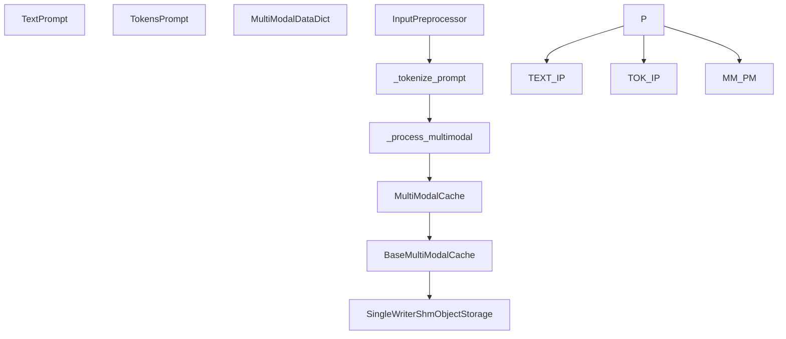

# Input and Output Processing

Relevant source files

-   [tests/config/test\_multimodal\_config.py](https://github.com/vllm-project/vllm/blob/7cc302dd/tests/config/test_multimodal_config.py)
-   [tests/distributed/test\_shm\_buffer.py](https://github.com/vllm-project/vllm/blob/7cc302dd/tests/distributed/test_shm_buffer.py)
-   [tests/distributed/test\_shm\_storage.py](https://github.com/vllm-project/vllm/blob/7cc302dd/tests/distributed/test_shm_storage.py)
-   [tests/multimodal/test\_cache.py](https://github.com/vllm-project/vllm/blob/7cc302dd/tests/multimodal/test_cache.py)
-   [tests/quantization/test\_mixed\_precision.py](https://github.com/vllm-project/vllm/blob/7cc302dd/tests/quantization/test_mixed_precision.py)
-   [tests/samplers/test\_logprobs.py](https://github.com/vllm-project/vllm/blob/7cc302dd/tests/samplers/test_logprobs.py)
-   [tests/test\_logprobs.py](https://github.com/vllm-project/vllm/blob/7cc302dd/tests/test_logprobs.py)
-   [tests/tool\_use/test\_tool\_choice\_required.py](https://github.com/vllm-project/vllm/blob/7cc302dd/tests/tool_use/test_tool_choice_required.py)
-   [tests/v1/engine/test\_output\_processor.py](https://github.com/vllm-project/vllm/blob/7cc302dd/tests/v1/engine/test_output_processor.py)
-   [tests/v1/engine/utils.py](https://github.com/vllm-project/vllm/blob/7cc302dd/tests/v1/engine/utils.py)
-   [tests/v1/structured\_output/test\_utils.py](https://github.com/vllm-project/vllm/blob/7cc302dd/tests/v1/structured_output/test_utils.py)
-   [tests/v1/test\_serial\_utils.py](https://github.com/vllm-project/vllm/blob/7cc302dd/tests/v1/test_serial_utils.py)
-   [tests/v1/test\_tensor\_ipc\_queue.py](https://github.com/vllm-project/vllm/blob/7cc302dd/tests/v1/test_tensor_ipc_queue.py)
-   [vllm/config/multimodal.py](https://github.com/vllm-project/vllm/blob/7cc302dd/vllm/config/multimodal.py)
-   [vllm/distributed/device\_communicators/shm\_object\_storage.py](https://github.com/vllm-project/vllm/blob/7cc302dd/vllm/distributed/device_communicators/shm_object_storage.py)
-   [vllm/logprobs.py](https://github.com/vllm-project/vllm/blob/7cc302dd/vllm/logprobs.py)
-   [vllm/multimodal/cache.py](https://github.com/vllm-project/vllm/blob/7cc302dd/vllm/multimodal/cache.py)
-   [vllm/outputs.py](https://github.com/vllm-project/vllm/blob/7cc302dd/vllm/outputs.py)
-   [vllm/sequence.py](https://github.com/vllm-project/vllm/blob/7cc302dd/vllm/sequence.py)
-   [vllm/v1/engine/logprobs.py](https://github.com/vllm-project/vllm/blob/7cc302dd/vllm/v1/engine/logprobs.py)
-   [vllm/v1/engine/output\_processor.py](https://github.com/vllm-project/vllm/blob/7cc302dd/vllm/v1/engine/output_processor.py)
-   [vllm/v1/engine/tensor\_ipc.py](https://github.com/vllm-project/vllm/blob/7cc302dd/vllm/v1/engine/tensor_ipc.py)
-   [vllm/v1/serial\_utils.py](https://github.com/vllm-project/vllm/blob/7cc302dd/vllm/v1/serial_utils.py)
-   [vllm/v1/structured\_output/\_\_init\_\_.py](https://github.com/vllm-project/vllm/blob/7cc302dd/vllm/v1/structured_output/__init__.py)
-   [vllm/v1/structured\_output/backend\_guidance.py](https://github.com/vllm-project/vllm/blob/7cc302dd/vllm/v1/structured_output/backend_guidance.py)
-   [vllm/v1/structured\_output/backend\_lm\_format\_enforcer.py](https://github.com/vllm-project/vllm/blob/7cc302dd/vllm/v1/structured_output/backend_lm_format_enforcer.py)
-   [vllm/v1/structured\_output/backend\_outlines.py](https://github.com/vllm-project/vllm/blob/7cc302dd/vllm/v1/structured_output/backend_outlines.py)
-   [vllm/v1/structured\_output/backend\_types.py](https://github.com/vllm-project/vllm/blob/7cc302dd/vllm/v1/structured_output/backend_types.py)
-   [vllm/v1/structured\_output/backend\_xgrammar.py](https://github.com/vllm-project/vllm/blob/7cc302dd/vllm/v1/structured_output/backend_xgrammar.py)
-   [vllm/v1/structured\_output/request.py](https://github.com/vllm-project/vllm/blob/7cc302dd/vllm/v1/structured_output/request.py)
-   [vllm/v1/structured\_output/utils.py](https://github.com/vllm-project/vllm/blob/7cc302dd/vllm/v1/structured_output/utils.py)

## Purpose and Scope

This page documents how vLLM processes input prompts into model-ready tensors and transforms raw model outputs — sampled token IDs and log probabilities emitted by `EngineCore` — into the `RequestOutput` and `CompletionOutput` objects returned to callers. The pipeline covers multimodal input parsing, incremental detokenization, stop-string detection, log probability accumulation, and structured output (grammar) processing.

For documentation on how tokens are sampled by the GPU model runner, see page [4.4](https://github.com/vllm-project/vllm/blob/7cc302dd/4.4) For how the scheduler produces `EngineCoreOutput` objects, see page [3.3](https://github.com/vllm-project/vllm/blob/7cc302dd/3.3)

---

## Input Preprocessing and Multimodal Handling

The `InputPreprocessor` is responsible for converting various prompt formats (text, tokens, or multimodal dictionaries) into a unified `LLMInputs` format.

### Multimodal Registry and Data Flow

vLLM uses a `MultiModalRegistry` to dispatch data processing based on the model architecture. Multimodal data is passed as a `MultiModalDataDict`, which maps modality names (e.g., "image", "audio") to their respective data items.

To optimize performance, vLLM implements a `MultiModalCache` [vllm/multimodal/cache.py98](https://github.com/vllm-project/vllm/blob/7cc302dd/vllm/multimodal/cache.py#L98-L98) and `BaseMultiModalCache` [vllm/multimodal/cache.py175](https://github.com/vllm-project/vllm/blob/7cc302dd/vllm/multimodal/cache.py#L175-L175) system. This system allows for mirroring cached multimodal items between the API frontend (P0) and the engine core (P1) using either Shared Memory (`shm`) or LRU-based mirroring [vllm/config/multimodal.py131-137](https://github.com/vllm-project/vllm/blob/7cc302dd/vllm/config/multimodal.py#L131-L137)

**Figure: Input Preprocessing and Multimodal Cache Pipeline**

Sources: [vllm/multimodal/cache.py98-230](https://github.com/vllm-project/vllm/blob/7cc302dd/vllm/multimodal/cache.py#L98-L230) [vllm/config/multimodal.py73-137](https://github.com/vllm-project/vllm/blob/7cc302dd/vllm/config/multimodal.py#L73-L137) [vllm/multimodal/inputs.py150-156](https://github.com/vllm-project/vllm/blob/7cc302dd/vllm/multimodal/inputs.py#L150-L156)

---

## Structured Output Processing

vLLM supports guided generation using grammars, JSON schemas, or regex through the `StructuredOutputManager` [vllm/v1/structured\_output/\_\_init\_\_.py35](https://github.com/vllm-project/vllm/blob/7cc302dd/vllm/v1/structured_output/__init__.py#L35-L35)

### Backend Architecture

vLLM supports multiple backends for structured output. The manager initializes the backend upon the first request [vllm/v1/structured\_output/\_\_init\_\_.py112-147](https://github.com/vllm-project/vllm/blob/7cc302dd/vllm/v1/structured_output/__init__.py#L112-L147)

| Backend | Class | Description |
| --- | --- | --- |
| **xgrammar** | `XgrammarBackend` | High-performance bitmask-based FSM using `xgrammar` [vllm/v1/structured\_output/backend\_xgrammar.py35](https://github.com/vllm-project/vllm/blob/7cc302dd/vllm/v1/structured_output/backend_xgrammar.py#L35-L35) |
| **guidance** | `GuidanceBackend` | Integration with `llguidance` library [vllm/v1/structured\_output/backend\_guidance.py86](https://github.com/vllm-project/vllm/blob/7cc302dd/vllm/v1/structured_output/backend_guidance.py#L86-L86) |
| **outlines** | `OutlinesBackend` | Integration with Outlines for FSM-based decoding [vllm/v1/structured\_output/backend\_outlines.py](https://github.com/vllm-project/vllm/blob/7cc302dd/vllm/v1/structured_output/backend_outlines.py) |
| **lm-format-enforcer** | `LMFormatEnforcerBackend` | Integration with LM Format Enforcer [vllm/v1/structured\_output/backend\_lm\_format\_enforcer.py](https://github.com/vllm-project/vllm/blob/7cc302dd/vllm/v1/structured_output/backend_lm_format_enforcer.py) |

### Bitmask Application and Serialization

The engine generates a token bitmask that is applied to the model's logits before sampling. For efficiency in distributed environments, vLLM uses a specialized `MsgpackEncoder` [vllm/v1/serial\_utils.py136](https://github.com/vllm-project/vllm/blob/7cc302dd/vllm/v1/serial_utils.py#L136-L136) to handle zero-copy serialization of tensors and numpy arrays [vllm/v1/serial\_utils.py147-165](https://github.com/vllm-project/vllm/blob/7cc302dd/vllm/v1/serial_utils.py#L147-L165)

The `apply_grammar_bitmask` function [vllm/v1/structured\_output/utils.py45](https://github.com/vllm-project/vllm/blob/7cc302dd/vllm/v1/structured_output/utils.py#L45-L45) reorders the bitmask to match the batch indices in the `InputBatch` [vllm/v1/structured\_output/utils.py76-98](https://github.com/vllm-project/vllm/blob/7cc302dd/vllm/v1/structured_output/utils.py#L76-L98) and applies it using `xgr.apply_token_bitmask_inplace` [vllm/v1/structured\_output/utils.py122](https://github.com/vllm-project/vllm/blob/7cc302dd/vllm/v1/structured_output/utils.py#L122-L122)

**Figure: Structured Output Logic and Serialization**

> **[Mermaid sequence]**
> *(图表结构无法解析)*

Sources: [vllm/v1/structured\_output/\_\_init\_\_.py97-153](https://github.com/vllm-project/vllm/blob/7cc302dd/vllm/v1/structured_output/__init__.py#L97-L153) [vllm/v1/structured\_output/backend\_xgrammar.py77-125](https://github.com/vllm-project/vllm/blob/7cc302dd/vllm/v1/structured_output/backend_xgrammar.py#L77-L125) [vllm/v1/structured\_output/utils.py45-136](https://github.com/vllm-project/vllm/blob/7cc302dd/vllm/v1/structured_output/utils.py#L45-L136) [vllm/v1/serial\_utils.py136-190](https://github.com/vllm-project/vllm/blob/7cc302dd/vllm/v1/serial_utils.py#L136-L190)

---

## Output Processor and Detokenization

Raw token IDs from the engine are processed into human-readable text by the `OutputProcessor` [vllm/v1/engine/output\_processor.py413](https://github.com/vllm-project/vllm/blob/7cc302dd/vllm/v1/engine/output_processor.py#L413-L413)

### RequestState and Incremental Detokenization

Each request is tracked by a `RequestState` [vllm/v1/engine/output\_processor.py129](https://github.com/vllm-project/vllm/blob/7cc302dd/vllm/v1/engine/output_processor.py#L129-L129) It manages metadata like `arrival_time`, `lora_request`, and the `IncrementalDetokenizer` [vllm/v1/engine/output\_processor.py130-152](https://github.com/vllm-project/vllm/blob/7cc302dd/vllm/v1/engine/output_processor.py#L130-L152)

**Detokenizer Types:**

1.  **`FastIncrementalDetokenizer`**: Uses high-performance decoding streams.
2.  **`SlowIncrementalDetokenizer`**: Python-based fallback.

### RequestOutputCollector

In `AsyncLLM`, the `RequestOutputCollector` [vllm/v1/engine/output\_processor.py45](https://github.com/vllm-project/vllm/blob/7cc302dd/vllm/v1/engine/output_processor.py#L45-L45) acts as a queue for streamed outputs.

-   **Aggregation**: If `output_kind` is `DELTA`, it merges subsequent `RequestOutput` objects [vllm/v1/engine/output\_processor.py72](https://github.com/vllm-project/vllm/blob/7cc302dd/vllm/v1/engine/output_processor.py#L72-L72)
-   **Non-blocking Operations**: Supports `put()` [vllm/v1/engine/output\_processor.py62](https://github.com/vllm-project/vllm/blob/7cc302dd/vllm/v1/engine/output_processor.py#L62-L62) and `get_nowait()` [vllm/v1/engine/output\_processor.py88](https://github.com/vllm-project/vllm/blob/7cc302dd/vllm/v1/engine/output_processor.py#L88-L88)

---

## Key Data Structures Summary

### Client-Side Output Objects

Defined in `vllm/outputs.py`.

| Class | Purpose |
| --- | --- |
| `RequestOutput` | Top-level object containing all completion sequences for a request [vllm/outputs.py85](https://github.com/vllm-project/vllm/blob/7cc302dd/vllm/outputs.py#L85-L85) |
| `CompletionOutput` | Data for a single generated sequence, including text, token IDs, and logprobs [vllm/outputs.py22](https://github.com/vllm-project/vllm/blob/7cc302dd/vllm/outputs.py#L22-L22) |
| `PoolingOutput` | Output for embedding models, containing the raw hidden state tensor [vllm/outputs.py67](https://github.com/vllm-project/vllm/blob/7cc302dd/vllm/outputs.py#L67-L67) |
| `PoolingRequestOutput` | Container for `PoolingOutput` associated with a request [vllm/outputs.py192](https://github.com/vllm-project/vllm/blob/7cc302dd/vllm/outputs.py#L192-L192) |

### Serialization Utilities

vLLM V1 uses `msgpack` for fast IPC between the API server and the engine core.

-   **`MsgpackEncoder`**: Custom encoder with `enc_hook` for `torch.Tensor` and `np.ndarray` [vllm/v1/serial\_utils.py191-212](https://github.com/vllm-project/vllm/blob/7cc302dd/vllm/v1/serial_utils.py#L191-L212)
-   **`MsgpackDecoder`**: Decodes byte streams back into Python objects or specific dataclasses [vllm/v1/serial\_utils.py270](https://github.com/vllm-project/vllm/blob/7cc302dd/vllm/v1/serial_utils.py#L270-L270)

Sources: [vllm/outputs.py22-192](https://github.com/vllm-project/vllm/blob/7cc302dd/vllm/outputs.py#L22-L192) [vllm/v1/engine/output\_processor.py45-187](https://github.com/vllm-project/vllm/blob/7cc302dd/vllm/v1/engine/output_processor.py#L45-L187) [vllm/v1/serial\_utils.py136-300](https://github.com/vllm-project/vllm/blob/7cc302dd/vllm/v1/serial_utils.py#L136-L300)
