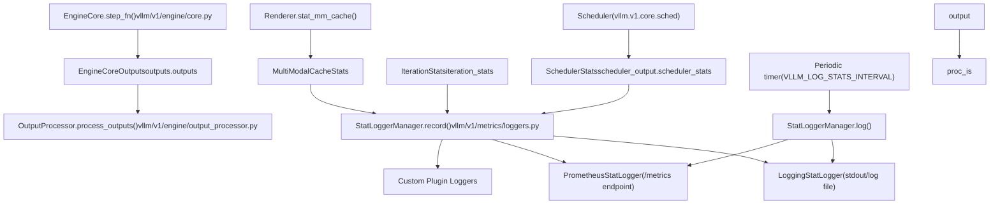
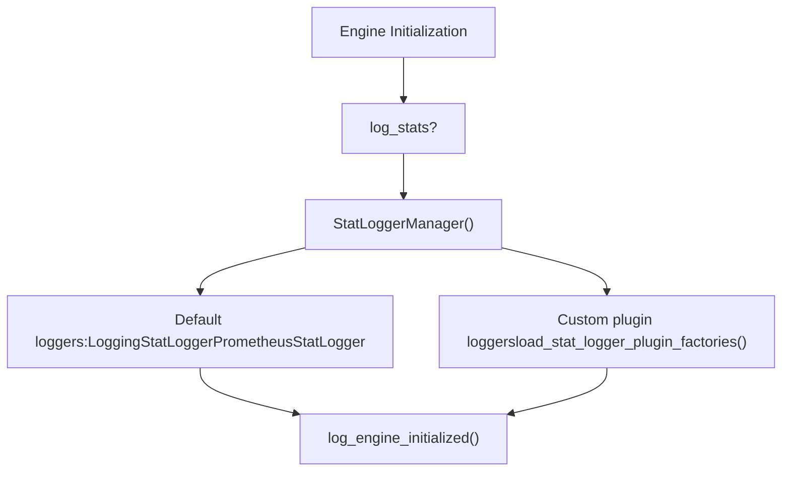
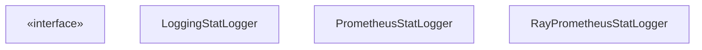

# Metrics and Observability

Relevant source files

-   [docs/cli/README.md](https://github.com/vllm-project/vllm/blob/7cc302dd/docs/cli/README.md?plain=1)
-   [docs/configuration/engine\_args.md](https://github.com/vllm-project/vllm/blob/7cc302dd/docs/configuration/engine_args.md?plain=1)
-   [docs/deployment/nginx.md](https://github.com/vllm-project/vllm/blob/7cc302dd/docs/deployment/nginx.md?plain=1)
-   [docs/design/fused\_moe\_modular\_kernel.md](https://github.com/vllm-project/vllm/blob/7cc302dd/docs/design/fused_moe_modular_kernel.md?plain=1)
-   [docs/design/metrics.md](https://github.com/vllm-project/vllm/blob/7cc302dd/docs/design/metrics.md?plain=1)
-   [docs/design/prefix\_caching.md](https://github.com/vllm-project/vllm/blob/7cc302dd/docs/design/prefix_caching.md?plain=1)
-   [docs/mkdocs/hooks/generate\_metrics.py](https://github.com/vllm-project/vllm/blob/7cc302dd/docs/mkdocs/hooks/generate_metrics.py)
-   [docs/usage/metrics.md](https://github.com/vllm-project/vllm/blob/7cc302dd/docs/usage/metrics.md?plain=1)
-   [docs/usage/reproducibility.md](https://github.com/vllm-project/vllm/blob/7cc302dd/docs/usage/reproducibility.md?plain=1)
-   [examples/offline\_inference/reproducibility.py](https://github.com/vllm-project/vllm/blob/7cc302dd/examples/offline_inference/reproducibility.py)
-   [tests/v1/metrics/test\_perf\_metrics.py](https://github.com/vllm-project/vllm/blob/7cc302dd/tests/v1/metrics/test_perf_metrics.py)
-   [tests/v1/metrics/test\_ray\_metrics.py](https://github.com/vllm-project/vllm/blob/7cc302dd/tests/v1/metrics/test_ray_metrics.py)
-   [tests/v1/metrics/test\_stats.py](https://github.com/vllm-project/vllm/blob/7cc302dd/tests/v1/metrics/test_stats.py)
-   [vllm/distributed/kv\_transfer/kv\_connector/v1/metrics.py](https://github.com/vllm-project/vllm/blob/7cc302dd/vllm/distributed/kv_transfer/kv_connector/v1/metrics.py)
-   [vllm/v1/metrics/loggers.py](https://github.com/vllm-project/vllm/blob/7cc302dd/vllm/v1/metrics/loggers.py)
-   [vllm/v1/metrics/perf.py](https://github.com/vllm-project/vllm/blob/7cc302dd/vllm/v1/metrics/perf.py)
-   [vllm/v1/metrics/ray\_wrappers.py](https://github.com/vllm-project/vllm/blob/7cc302dd/vllm/v1/metrics/ray_wrappers.py)
-   [vllm/v1/metrics/stats.py](https://github.com/vllm-project/vllm/blob/7cc302dd/vllm/v1/metrics/stats.py)
-   [vllm/v1/metrics/utils.py](https://github.com/vllm-project/vllm/blob/7cc302dd/vllm/v1/metrics/utils.py)
-   [vllm/v1/spec\_decode/metrics.py](https://github.com/vllm-project/vllm/blob/7cc302dd/vllm/v1/spec_decode/metrics.py)

This page documents how vLLM collects, aggregates, and exposes runtime metrics. It covers the v1 stats dataclasses, the logger hierarchy, Prometheus metrics, request latency breakdowns, and the integration with Ray and custom plugin loggers.

---

## Architecture Overview

The metrics system consists of a **stats collection layer** that assembles data after each engine step and a **logger layer** that consumes those stats to write to standard output or expose them via a Prometheus-compatible endpoint.

Metrics are collected in `LLMEngine.step()` for synchronous execution and `AsyncLLM._run_output_handler()` for asynchronous execution. Both paths create `IterationStats` from `EngineCoreOutput` and pass them to a `StatLoggerManager` instance.

**Data flow through the metrics system**

Sources: [vllm/v1/metrics/loggers.py40-64](https://github.com/vllm-project/vllm/blob/7cc302dd/vllm/v1/metrics/loggers.py#L40-L64) [vllm/v1/metrics/stats.py171-200](https://github.com/vllm-project/vllm/blob/7cc302dd/vllm/v1/metrics/stats.py#L171-L200) [vllm/v1/metrics/stats.py303-330](https://github.com/vllm-project/vllm/blob/7cc302dd/vllm/v1/metrics/stats.py#L303-L330) [vllm/v1/metrics/loggers.py1022-1050](https://github.com/vllm-project/vllm/blob/7cc302dd/vllm/v1/metrics/loggers.py#L1022-L1050)

---

## StatLoggerManager Initialization

`StatLoggerManager` coordinates all registered stat loggers. It is instantiated during engine initialization when `log_stats=True`. It manages a list of `StatLoggerBase` implementations.

**Initialization flow**

Sources: [vllm/v1/metrics/loggers.py1022-1118](https://github.com/vllm-project/vllm/blob/7cc302dd/vllm/v1/metrics/loggers.py#L1022-L1118) [vllm/v1/metrics/loggers.py70-84](https://github.com/vllm-project/vllm/blob/7cc302dd/vllm/v1/metrics/loggers.py#L70-L84) [vllm/v1/metrics/loggers.py1044-1065](https://github.com/vllm-project/vllm/blob/7cc302dd/vllm/v1/metrics/loggers.py#L1044-L1065)

---

## Stats Collection Layer

Stats objects are defined in `vllm/v1/metrics/stats.py` as dataclasses to facilitate easy transfer between the engine core and the frontend.

### SchedulerStats

Produced by the scheduler after each step, carrying the current state of resource allocation and cache usage.

| Field | Type | Description |
| --- | --- | --- |
| `num_running_reqs` | `int` | Requests currently in model execution batches. |
| `num_waiting_reqs` | `int` | Requests in the waiting queue. |
| `kv_cache_usage` | `float` | Fraction of KV cache blocks in use (0.0–1.0). |
| `prefix_cache_stats` | `PrefixCacheStats` | Local prefix cache hit/miss counts. |
| `spec_decoding_stats` | `SpecDecodingStats` | Statistics for speculative decoding performance. |
| `perf_stats` | `PerfStats` | MFU and hardware performance stats. |
| `kv_connector_stats` | `dict[str, Any]` | Stats for disaggregated KV transfer. |

Sources: [vllm/v1/metrics/stats.py171-198](https://github.com/vllm-project/vllm/blob/7cc302dd/vllm/v1/metrics/stats.py#L171-L198)

### IterationStats

Assembled by the `OutputProcessor` from a batch of `EngineCoreOutput` objects. It tracks token counts and finished request summaries.

| Field | Type | Description |
| --- | --- | --- |
| `num_generation_tokens` | `int` | Total generation tokens in this step. |
| `prompt_token_stats` | `PromptTokenStats` | Breakdown of prompt tokens by source (compute vs cache). |
| `finished_requests` | `list[FinishedRequestStats]` | Summary for completed requests in this iteration. |

Sources: [vllm/v1/metrics/stats.py303-330](https://github.com/vllm-project/vllm/blob/7cc302dd/vllm/v1/metrics/stats.py#L303-L330)

### CachingMetrics

Maintains a sliding window hit rate over the most recent $N$ requests (default 1000).

-   **Implementation**: Uses a `deque` of `(requests, queries, hits)` tuples.
-   **Hit Rate**: Calculated as `aggregated_query_hit / aggregated_query_total`.
-   **Reset**: Triggered by `BaseCacheStats.reset` (e.g., after a manual cache clear).

Sources: [vllm/v1/metrics/stats.py35-111](https://github.com/vllm-project/vllm/blob/7cc302dd/vllm/v1/metrics/stats.py#L35-L111)

---

## Logger Hierarchy

The system uses an abstract base class `StatLoggerBase` to define the interface for all loggers.

Sources: [vllm/v1/metrics/loggers.py40-64](https://github.com/vllm-project/vllm/blob/7cc302dd/vllm/v1/metrics/loggers.py#L40-L64) [vllm/v1/metrics/loggers.py95-100](https://github.com/vllm-project/vllm/blob/7cc302dd/vllm/v1/metrics/loggers.py#L95-L100) [vllm/v1/metrics/loggers.py389-400](https://github.com/vllm-project/vllm/blob/7cc302dd/vllm/v1/metrics/loggers.py#L389-L400) [vllm/v1/metrics/ray\_wrappers.py193-202](https://github.com/vllm-project/vllm/blob/7cc302dd/vllm/v1/metrics/ray_wrappers.py#L193-L202)

### LoggingStatLogger

Writes human-readable summaries to the standard info log. It tracks throughput over a local logging interval and resets counters after each `log()` call. It also handles logging for `SpecDecodingLogging` and `KVConnectorLogging`.

Sources: [vllm/v1/metrics/loggers.py95-134](https://github.com/vllm-project/vllm/blob/7cc302dd/vllm/v1/metrics/loggers.py#L95-L134) [vllm/v1/metrics/loggers.py165-190](https://github.com/vllm-project/vllm/blob/7cc302dd/vllm/v1/metrics/loggers.py#L165-L190)

### PrometheusStatLogger

Registers and updates Prometheus metrics. It uses `prometheus_client` to expose Gauges, Counters, and Histograms.

-   **Metric Prefix**: All metrics use the `vllm:` prefix.
-   **Multiprocess**: Supports `prometheus_client.multiprocess` for deployments with multiple API servers.
-   **MFU Metrics**: Optionally records Model Flops Utilization (MFU) using `PerfMetricsProm` if enabled in `ObservabilityConfig`.

Sources: [vllm/v1/metrics/loggers.py389-450](https://github.com/vllm-project/vllm/blob/7cc302dd/vllm/v1/metrics/loggers.py#L389-L450) [vllm/v1/metrics/loggers.py423-445](https://github.com/vllm-project/vllm/blob/7cc302dd/vllm/v1/metrics/loggers.py#L423-L445) [vllm/v1/metrics/perf.py1221-1250](https://github.com/vllm-project/vllm/blob/7cc302dd/vllm/v1/metrics/perf.py#L1221-L1250)

---

## Ray and Distributed Observability

For deployments running on Ray, vLLM provides `RayPrometheusStatLogger`. This logger wraps standard Prometheus metrics into Ray-compatible metrics using `ray.util.metrics`.

-   **RayGaugeWrapper / RayCounterWrapper**: Adapts the Prometheus API to Ray's metric system.
-   **Sanitization**: Metric names are sanitized via `_get_sanitized_opentelemetry_name` to replace characters like `:` with `_` for OpenTelemetry compatibility.
-   **Replica ID**: Automatically attaches the Ray Serve `ReplicaId` as a tag to all metrics.

Sources: [vllm/v1/metrics/ray\_wrappers.py30-75](https://github.com/vllm-project/vllm/blob/7cc302dd/vllm/v1/metrics/ray_wrappers.py#L30-L75) [vllm/v1/metrics/ray\_wrappers.py193-202](https://github.com/vllm-project/vllm/blob/7cc302dd/vllm/v1/metrics/ray_wrappers.py#L193-L202) [vllm/v1/metrics/ray\_wrappers.py78-134](https://github.com/vllm-project/vllm/blob/7cc302dd/vllm/v1/metrics/ray_wrappers.py#L78-L134)

---

## Request Latency Breakdown

The system tracks several latency intervals for each request, primarily calculated in `IterationStats.update_from_finished_request()`. These are exposed as histograms in Prometheus.

| Interval | Calculation | Code Entity |
| --- | --- | --- |
| `queue_time` | `scheduled_ts - queued_ts` | `FinishedRequestStats.queue_time` |
| `prefill_time` | `first_token_ts - scheduled_ts` | `FinishedRequestStats.prefill_time` |
| `decode_time` | `last_token_ts - first_token_ts` | `FinishedRequestStats.decode_time` |
| `e2e_latency` | `now - arrival_time` | `FinishedRequestStats.e2e_latency` |

Sources: [vllm/v1/metrics/stats.py222-238](https://github.com/vllm-project/vllm/blob/7cc302dd/vllm/v1/metrics/stats.py#L222-L238) [vllm/v1/metrics/stats.py410-456](https://github.com/vllm-project/vllm/blob/7cc302dd/vllm/v1/metrics/stats.py#L410-L456)

---

## Performance and MFU Metrics

vLLM includes an analytic flops/memory estimation module in `vllm/v1/metrics/perf.py`. This is used to derive Model Flops Utilization (MFU) stats for a running model.

-   **PerfStats**: Dataclass containing `num_flops_per_gpu`, `num_read_bytes_per_gpu`, and `num_write_bytes_per_gpu`.
-   **ExecutionContext**: Aggregates batch statistics (prefill vs decode) to provide context for flops calculations.
-   **Quantization Support**: The `_QUANT_WEIGHT_BYTE_SIZE` mapping allows the estimator to account for various quantization methods (FP8, GPTQ, AWQ, etc.) when calculating memory bandwidth usage.

Sources: [vllm/v1/metrics/perf.py52-77](https://github.com/vllm-project/vllm/blob/7cc302dd/vllm/v1/metrics/perf.py#L52-L77) [vllm/v1/metrics/perf.py96-100](https://github.com/vllm-project/vllm/blob/7cc302dd/vllm/v1/metrics/perf.py#L96-L100) [vllm/v1/metrics/perf.py104-142](https://github.com/vllm-project/vllm/blob/7cc302dd/vllm/v1/metrics/perf.py#L104-L142)

---

## Speculative Decoding Metrics

Speculative decoding performance is tracked via `SpecDecodingStats`. These stats are aggregated by `SpecDecodingLogging` (for stdout) and `SpecDecodingProm` (for Prometheus).

Key metrics include:

-   **Mean Acceptance Length**: The average number of tokens accepted per draft (calculated as `1 + (num_accepted_tokens / num_drafts)`).
-   **Acceptance Rate**: `num_accepted_tokens / num_draft_tokens`.
-   **Per-position Acceptance Rate**: A vector tracking the likelihood of acceptance at each specific draft position.

Sources: [vllm/v1/spec\_decode/metrics.py17-45](https://github.com/vllm-project/vllm/blob/7cc302dd/vllm/v1/spec_decode/metrics.py#L17-L45) [vllm/v1/spec\_decode/metrics.py88-99](https://github.com/vllm-project/vllm/blob/7cc302dd/vllm/v1/spec_decode/metrics.py#L88-L99) [vllm/v1/spec\_decode/metrics.py121-140](https://github.com/vllm-project/vllm/blob/7cc302dd/vllm/v1/spec_decode/metrics.py#L121-L140)

---

## Plugin System for Custom Loggers

Users can implement custom loggers by subclassing `StatLoggerBase` and registering them via the `vllm.stat_loggers` entry point group.

1.  **Discovery**: `load_stat_logger_plugin_factories()` searches for plugins at runtime using `load_plugins_by_group(STAT_LOGGER_PLUGINS_GROUP)`.
2.  **Validation**: The system ensures all plugins are subclasses of `StatLoggerBase`.
3.  **Execution**: The `StatLoggerManager` calls `record()` and `log()` on all registered plugins in addition to default loggers.

Sources: [vllm/v1/metrics/loggers.py70-84](https://github.com/vllm-project/vllm/blob/7cc302dd/vllm/v1/metrics/loggers.py#L70-L84) [vllm/v1/metrics/loggers.py1022-1050](https://github.com/vllm-project/vllm/blob/7cc302dd/vllm/v1/metrics/loggers.py#L1022-L1050) [vllm/v1/metrics/loggers.py19-20](https://github.com/vllm-project/vllm/blob/7cc302dd/vllm/v1/metrics/loggers.py#L19-L20)
