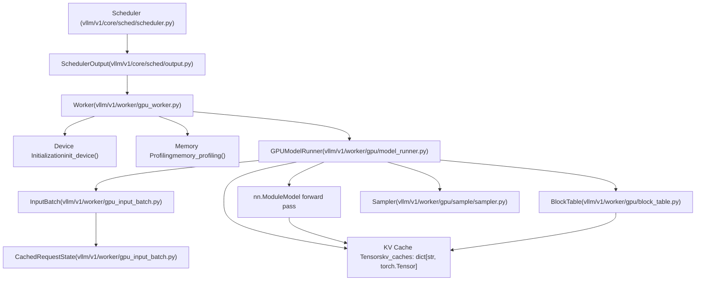
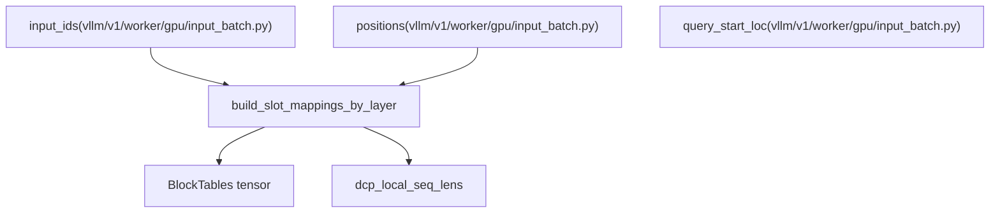

# Model Execution on GPU

Relevant source files

-   [.buildkite/test\_areas/model\_runner\_v2.yaml](https://github.com/vllm-project/vllm/blob/7cc302dd/.buildkite/test_areas/model_runner_v2.yaml)
-   [tests/v1/ec\_connector/integration/test\_epd\_correctness.py](https://github.com/vllm-project/vllm/blob/7cc302dd/tests/v1/ec_connector/integration/test_epd_correctness.py)
-   [tests/v1/executor/test\_executor.py](https://github.com/vllm-project/vllm/blob/7cc302dd/tests/v1/executor/test_executor.py)
-   [tests/v1/kv\_connector/unit/test\_output\_aggregator.py](https://github.com/vllm-project/vllm/blob/7cc302dd/tests/v1/kv_connector/unit/test_output_aggregator.py)
-   [tests/v1/spec\_decode/test\_synthetic\_rejection\_sampler\_utils.py](https://github.com/vllm-project/vllm/blob/7cc302dd/tests/v1/spec_decode/test_synthetic_rejection_sampler_utils.py)
-   [tests/v1/worker/test\_gpu\_input\_batch.py](https://github.com/vllm-project/vllm/blob/7cc302dd/tests/v1/worker/test_gpu_input_batch.py)
-   [tests/v1/worker/test\_gpu\_model\_runner.py](https://github.com/vllm-project/vllm/blob/7cc302dd/tests/v1/worker/test_gpu_model_runner.py)
-   [vllm/v1/core/sched/output.py](https://github.com/vllm-project/vllm/blob/7cc302dd/vllm/v1/core/sched/output.py)
-   [vllm/v1/executor/abstract.py](https://github.com/vllm-project/vllm/blob/7cc302dd/vllm/v1/executor/abstract.py)
-   [vllm/v1/executor/multiproc\_executor.py](https://github.com/vllm-project/vllm/blob/7cc302dd/vllm/v1/executor/multiproc_executor.py)
-   [vllm/v1/executor/ray\_executor.py](https://github.com/vllm-project/vllm/blob/7cc302dd/vllm/v1/executor/ray_executor.py)
-   [vllm/v1/executor/ray\_utils.py](https://github.com/vllm-project/vllm/blob/7cc302dd/vllm/v1/executor/ray_utils.py)
-   [vllm/v1/executor/uniproc\_executor.py](https://github.com/vllm-project/vllm/blob/7cc302dd/vllm/v1/executor/uniproc_executor.py)
-   [vllm/v1/worker/block\_table.py](https://github.com/vllm-project/vllm/blob/7cc302dd/vllm/v1/worker/block_table.py)
-   [vllm/v1/worker/gpu/async\_utils.py](https://github.com/vllm-project/vllm/blob/7cc302dd/vllm/v1/worker/gpu/async_utils.py)
-   [vllm/v1/worker/gpu/attn\_utils.py](https://github.com/vllm-project/vllm/blob/7cc302dd/vllm/v1/worker/gpu/attn_utils.py)
-   [vllm/v1/worker/gpu/block\_table.py](https://github.com/vllm-project/vllm/blob/7cc302dd/vllm/v1/worker/gpu/block_table.py)
-   [vllm/v1/worker/gpu/buffer\_utils.py](https://github.com/vllm-project/vllm/blob/7cc302dd/vllm/v1/worker/gpu/buffer_utils.py)
-   [vllm/v1/worker/gpu/cudagraph\_utils.py](https://github.com/vllm-project/vllm/blob/7cc302dd/vllm/v1/worker/gpu/cudagraph_utils.py)
-   [vllm/v1/worker/gpu/dp\_utils.py](https://github.com/vllm-project/vllm/blob/7cc302dd/vllm/v1/worker/gpu/dp_utils.py)
-   [vllm/v1/worker/gpu/input\_batch.py](https://github.com/vllm-project/vllm/blob/7cc302dd/vllm/v1/worker/gpu/input_batch.py)
-   [vllm/v1/worker/gpu/mm/\_\_init\_\_.py](https://github.com/vllm-project/vllm/blob/7cc302dd/vllm/v1/worker/gpu/mm/__init__.py)
-   [vllm/v1/worker/gpu/mm/encoder\_cache.py](https://github.com/vllm-project/vllm/blob/7cc302dd/vllm/v1/worker/gpu/mm/encoder_cache.py)
-   [vllm/v1/worker/gpu/mm/encoder\_runner.py](https://github.com/vllm-project/vllm/blob/7cc302dd/vllm/v1/worker/gpu/mm/encoder_runner.py)
-   [vllm/v1/worker/gpu/mm/rope.py](https://github.com/vllm-project/vllm/blob/7cc302dd/vllm/v1/worker/gpu/mm/rope.py)
-   [vllm/v1/worker/gpu/model\_runner.py](https://github.com/vllm-project/vllm/blob/7cc302dd/vllm/v1/worker/gpu/model_runner.py)
-   [vllm/v1/worker/gpu/sample/\_\_init\_\_.py](https://github.com/vllm-project/vllm/blob/7cc302dd/vllm/v1/worker/gpu/sample/__init__.py)
-   [vllm/v1/worker/gpu/sample/bad\_words.py](https://github.com/vllm-project/vllm/blob/7cc302dd/vllm/v1/worker/gpu/sample/bad_words.py)
-   [vllm/v1/worker/gpu/sample/gumbel.py](https://github.com/vllm-project/vllm/blob/7cc302dd/vllm/v1/worker/gpu/sample/gumbel.py)
-   [vllm/v1/worker/gpu/sample/logit\_bias.py](https://github.com/vllm-project/vllm/blob/7cc302dd/vllm/v1/worker/gpu/sample/logit_bias.py)
-   [vllm/v1/worker/gpu/sample/logprob.py](https://github.com/vllm-project/vllm/blob/7cc302dd/vllm/v1/worker/gpu/sample/logprob.py)
-   [vllm/v1/worker/gpu/sample/min\_p.py](https://github.com/vllm-project/vllm/blob/7cc302dd/vllm/v1/worker/gpu/sample/min_p.py)
-   [vllm/v1/worker/gpu/sample/output.py](https://github.com/vllm-project/vllm/blob/7cc302dd/vllm/v1/worker/gpu/sample/output.py)
-   [vllm/v1/worker/gpu/sample/penalties.py](https://github.com/vllm-project/vllm/blob/7cc302dd/vllm/v1/worker/gpu/sample/penalties.py)
-   [vllm/v1/worker/gpu/sample/prompt\_logprob.py](https://github.com/vllm-project/vllm/blob/7cc302dd/vllm/v1/worker/gpu/sample/prompt_logprob.py)
-   [vllm/v1/worker/gpu/sample/sampler.py](https://github.com/vllm-project/vllm/blob/7cc302dd/vllm/v1/worker/gpu/sample/sampler.py)
-   [vllm/v1/worker/gpu/sample/states.py](https://github.com/vllm-project/vllm/blob/7cc302dd/vllm/v1/worker/gpu/sample/states.py)
-   [vllm/v1/worker/gpu/spec\_decode/eagle/cudagraph.py](https://github.com/vllm-project/vllm/blob/7cc302dd/vllm/v1/worker/gpu/spec_decode/eagle/cudagraph.py)
-   [vllm/v1/worker/gpu/spec\_decode/eagle/speculator.py](https://github.com/vllm-project/vllm/blob/7cc302dd/vllm/v1/worker/gpu/spec_decode/eagle/speculator.py)
-   [vllm/v1/worker/gpu/spec\_decode/rejection\_sampler.py](https://github.com/vllm-project/vllm/blob/7cc302dd/vllm/v1/worker/gpu/spec_decode/rejection_sampler.py)
-   [vllm/v1/worker/gpu/spec\_decode/synthetic\_rejection\_sampler\_utils.py](https://github.com/vllm-project/vllm/blob/7cc302dd/vllm/v1/worker/gpu/spec_decode/synthetic_rejection_sampler_utils.py)
-   [vllm/v1/worker/gpu/states.py](https://github.com/vllm-project/vllm/blob/7cc302dd/vllm/v1/worker/gpu/states.py)
-   [vllm/v1/worker/gpu/structured\_outputs.py](https://github.com/vllm-project/vllm/blob/7cc302dd/vllm/v1/worker/gpu/structured_outputs.py)
-   [vllm/v1/worker/gpu\_input\_batch.py](https://github.com/vllm-project/vllm/blob/7cc302dd/vllm/v1/worker/gpu_input_batch.py)
-   [vllm/v1/worker/gpu\_model\_runner.py](https://github.com/vllm-project/vllm/blob/7cc302dd/vllm/v1/worker/gpu_model_runner.py)
-   [vllm/v1/worker/gpu\_worker.py](https://github.com/vllm-project/vllm/blob/7cc302dd/vllm/v1/worker/gpu_worker.py)
-   [vllm/v1/worker/utils.py](https://github.com/vllm-project/vllm/blob/7cc302dd/vllm/v1/worker/utils.py)
-   [vllm/v1/worker/worker\_base.py](https://github.com/vllm-project/vllm/blob/7cc302dd/vllm/v1/worker/worker_base.py)

## Purpose and Scope

This document describes the GPU-based model execution subsystem in vLLM, which is responsible for running model forward passes, managing device resources, and coordinating memory allocation for inference. The execution layer sits between the scheduler (which decides what to run) and the model implementations (which define the computation).

**Scope**: This page covers the overall architecture and lifecycle of GPU execution. For detailed information on specific components, see:

-   GPUModelRunner implementation details: [GPUModelRunner](/vllm-project/vllm/4.1-gpumodelrunner)
-   Worker initialization and device management: [Worker and Executor Architecture](/vllm-project/vllm/4.2-worker-and-executor-architecture)
-   Request batching and state tracking: [InputBatch and Request State Management](/vllm-project/vllm/4.3-inputbatch-and-request-state-management)
-   Token sampling methods: [Sampling and Token Generation](/vllm-project/vllm/4.4-sampling-and-token-generation)
-   Speculative decoding mechanisms: [Speculative Decoding](/vllm-project/vllm/4.5-speculative-decoding)

---

## Architecture Overview

The GPU execution subsystem consists of three primary components that work together to execute model inference:

**Sources**: [vllm/v1/worker/gpu\_worker.py105-156](https://github.com/vllm-project/vllm/blob/7cc302dd/vllm/v1/worker/gpu_worker.py#L105-L156) [vllm/v1/worker/gpu/model\_runner.py103-173](https://github.com/vllm-project/vllm/blob/7cc302dd/vllm/v1/worker/gpu/model_runner.py#L103-L173) [vllm/v1/worker/gpu\_input\_batch.py29-157](https://github.com/vllm-project/vllm/blob/7cc302dd/vllm/v1/worker/gpu_input_batch.py#L29-L157) [vllm/v1/core/sched/output.py179-190](https://github.com/vllm-project/vllm/blob/7cc302dd/vllm/v1/core/sched/output.py#L179-L190)

---

## Worker Lifecycle

The `Worker` class manages the complete lifecycle of GPU resources, from device initialization through model loading and memory profiling.

### Device Initialization

The worker initializes the GPU device and distributed environment before any model operations:

> **[Mermaid sequence]**
> *(图表结构无法解析)*

**Key operations in `Worker`**:

1.  **Precision Setup**: Configures `torch.set_float32_matmul_precision` based on environment variables [vllm/v1/worker/gpu\_worker.py123-124](https://github.com/vllm-project/vllm/blob/7cc302dd/vllm/v1/worker/gpu_worker.py#L123-L124)
2.  **Distributed Initialization**: Establishes communication groups for Tensor Parallelism (TP), Pipeline Parallelism (PP), and Data Parallelism (DP) [vllm/v1/worker/gpu\_worker.py20-37](https://github.com/vllm-project/vllm/blob/7cc302dd/vllm/v1/worker/gpu_worker.py#L20-L37)
3.  **Memory Management**: Uses `CuMemAllocator` for managing memory during sleep/wake cycles to free up GiB of memory when idle [vllm/v1/worker/gpu\_worker.py157-180](https://github.com/vllm-project/vllm/blob/7cc302dd/vllm/v1/worker/gpu_worker.py#L157-L180)

**Sources**: [vllm/v1/worker/gpu\_worker.py105-180](https://github.com/vllm-project/vllm/blob/7cc302dd/vllm/v1/worker/gpu_worker.py#L105-L180) [vllm/v1/worker/gpu\_worker.py20-49](https://github.com/vllm-project/vllm/blob/7cc302dd/vllm/v1/worker/gpu_worker.py#L20-L49) [vllm/v1/executor/multiproc\_executor.py168-181](https://github.com/vllm-project/vllm/blob/7cc302dd/vllm/v1/executor/multiproc_executor.py#L168-L181)

### Memory Profiling and CUDA Graphs

After loading the model, the worker profiles available memory to determine the KV cache capacity. This includes accounting for CUDA Graph overhead.

**The profiling process**:

1.  **Profile Run**: Executes dummy forward passes to measure peak activation memory [vllm/v1/worker/gpu\_worker.py48-50](https://github.com/vllm-project/vllm/blob/7cc302dd/vllm/v1/worker/gpu_worker.py#L48-L50)
2.  **CUDA Graph Management**: The `CudaGraphManager` builds priority-ordered candidate lists for different token counts to minimize graph capture overhead [vllm/v1/worker/gpu/cudagraph\_utils.py108-155](https://github.com/vllm-project/vllm/blob/7cc302dd/vllm/v1/worker/gpu/cudagraph_utils.py#L108-L155)
3.  **Capture Logic**: Graphs are captured for both `PIECEWISE` and `FULL` modes to optimize different batch shapes [vllm/v1/worker/gpu/cudagraph\_utils.py123-155](https://github.com/vllm-project/vllm/blob/7cc302dd/vllm/v1/worker/gpu/cudagraph_utils.py#L123-L155)

**Sources**: [vllm/v1/worker/gpu/cudagraph\_utils.py80-155](https://github.com/vllm-project/vllm/blob/7cc302dd/vllm/v1/worker/gpu/cudagraph_utils.py#L80-L155) [vllm/v1/worker/gpu\_worker.py48-50](https://github.com/vllm-project/vllm/blob/7cc302dd/vllm/v1/worker/gpu_worker.py#L48-L50)

---

## Model Execution Pipeline

The execution pipeline transforms a `SchedulerOutput` into a `ModelRunnerOutput` through several stages.

### Stage 1: Update States

The `GPUModelRunner` synchronizes its internal state with the scheduler's decisions.

**Operations**:

-   **Input Batching**: Uses `InputBatch` to manage the lifecycle of requests on the GPU, including `token_ids`, `positions`, and `block_table` mappings [vllm/v1/worker/gpu\_input\_batch.py81-157](https://github.com/vllm-project/vllm/blob/7cc302dd/vllm/v1/worker/gpu_input_batch.py#L81-L157)
-   **Request State**: Tracks per-request metadata such as `num_computed_tokens` and `output_token_ids` in `CachedRequestState` [vllm/v1/worker/gpu\_input\_batch.py30-55](https://github.com/vllm-project/vllm/blob/7cc302dd/vllm/v1/worker/gpu_input_batch.py#L30-L55)
-   **V2 Runner State**: The experimental V2 runner uses `RequestState` to manage `all_token_ids` in UVA memory to save GPU memory [vllm/v1/worker/gpu/states.py30-38](https://github.com/vllm-project/vllm/blob/7cc302dd/vllm/v1/worker/gpu/states.py#L30-L38)

**Sources**: [vllm/v1/worker/gpu\_input\_batch.py29-157](https://github.com/vllm-project/vllm/blob/7cc302dd/vllm/v1/worker/gpu_input_batch.py#L29-L157) [vllm/v1/worker/gpu/model\_runner.py103-173](https://github.com/vllm-project/vllm/blob/7cc302dd/vllm/v1/worker/gpu/model_runner.py#L103-L173) [vllm/v1/worker/gpu/states.py9-53](https://github.com/vllm-project/vllm/blob/7cc302dd/vllm/v1/worker/gpu/states.py#L9-L53)

### Stage 2: Prepare Inputs

The runner constructs GPU tensors for the model forward pass:

**Key Tensors Prepared**:

-   `input_ids`: Token IDs for the current step [vllm/v1/worker/gpu/input\_batch.py23](https://github.com/vllm-project/vllm/blob/7cc302dd/vllm/v1/worker/gpu/input_batch.py#L23-L23)
-   `positions`: Sequence positions for RoPE [vllm/v1/worker/gpu/input\_batch.py24](https://github.com/vllm-project/vllm/blob/7cc302dd/vllm/v1/worker/gpu/input_batch.py#L24-L24)
-   `query_start_loc`: Cumulative offsets for variable-length sequences in a batch [vllm/v1/worker/gpu/input\_batch.py25](https://github.com/vllm-project/vllm/blob/7cc302dd/vllm/v1/worker/gpu/input_batch.py#L25-L25)

**Sources**: [vllm/v1/worker/gpu/input\_batch.py12-33](https://github.com/vllm-project/vllm/blob/7cc302dd/vllm/v1/worker/gpu/input_batch.py#L12-L33) [vllm/v1/worker/gpu/attn\_utils.py173-177](https://github.com/vllm-project/vllm/blob/7cc302dd/vllm/v1/worker/gpu/attn_utils.py#L173-L177)

### Stage 3: Execute Model and Sample

The model forward pass is followed by token sampling.

**Execution Flow**:

1.  **Forward Pass**: Dispatched via `CudagraphDispatcher` (V1) or `ModelCudaGraphManager` (V2) if compatible, otherwise eager [vllm/v1/worker/gpu/model\_runner.py61](https://github.com/vllm-project/vllm/blob/7cc302dd/vllm/v1/worker/gpu/model_runner.py#L61-L61)
2.  **Sampling**: The `Sampler` applies `SamplingParams` (temperature, top-p, top-k) and penalties (frequency, presence) [vllm/v1/worker/gpu\_input\_batch.py166-188](https://github.com/vllm-project/vllm/blob/7cc302dd/vllm/v1/worker/gpu_input_batch.py#L166-L188)
3.  **Logits Processing**: `LogitsProcessors` are used to modify the distribution before sampling [vllm/v1/worker/gpu\_input\_batch.py19-24](https://github.com/vllm-project/vllm/blob/7cc302dd/vllm/v1/worker/gpu_input_batch.py#L19-L24)

**Sources**: [vllm/v1/worker/gpu/model\_runner.py59-90](https://github.com/vllm-project/vllm/blob/7cc302dd/vllm/v1/worker/gpu/model_runner.py#L59-L90) [vllm/v1/worker/gpu\_input\_batch.py159-188](https://github.com/vllm-project/vllm/blob/7cc302dd/vllm/v1/worker/gpu_input_batch.py#L159-L188)

---

## Memory and KV Cache Management

### Block Table Translation

The `MultiGroupBlockTable` translates logical request indices to physical GPU memory blocks. It handles multiple KV cache groups (e.g., for different layers or encoder-decoder architectures) [vllm/v1/worker/gpu\_input\_batch.py153-163](https://github.com/vllm-project/vllm/blob/7cc302dd/vllm/v1/worker/gpu_input_batch.py#L153-L163)

### KV Cache Zeroing

Newly allocated blocks must be zeroed before use to prevent garbage data from affecting attention. The `KVBlockZeroer` uses a specialized Triton kernel to efficiently zero blocks across all segments in a single launch [vllm/v1/worker/utils.py40-78](https://github.com/vllm-project/vllm/blob/7cc302dd/vllm/v1/worker/utils.py#L40-L78)

**Sources**: [vllm/v1/worker/gpu\_input\_batch.py147-157](https://github.com/vllm-project/vllm/blob/7cc302dd/vllm/v1/worker/gpu_input_batch.py#L147-L157) [vllm/v1/worker/utils.py80-190](https://github.com/vllm-project/vllm/blob/7cc302dd/vllm/v1/worker/utils.py#L80-L190)

---

## Child Pages

For detailed technical information, please refer to the following child pages:

-   **[GPUModelRunner](/vllm-project/vllm/4.1-gpumodelrunner)**: Deep dive into the `GPUModelRunner` class, coordinating forward passes, KV cache interaction, and multi-modal support. Covers both the stable runner and V2.
-   **[Worker and Executor Architecture](/vllm-project/vllm/4.2-worker-and-executor-architecture)**: Details on `Worker` initialization, `CuMemAllocator` for memory management, and distributed coordination via `MultiprocExecutor`.
-   **[InputBatch and Request State Management](/vllm-project/vllm/4.3-inputbatch-and-request-state-management)**: Detailed explanation of how `InputBatch` and `CachedRequestState` track request data across steps.
-   **[Sampling and Token Generation](/vllm-project/vllm/4.4-sampling-and-token-generation)**: Documentation of the sampling pipeline, including logits processors and penalty kernels.
-   **[Speculative Decoding](/vllm-project/vllm/4.5-speculative-decoding)**: Overview of speculative methods like Eagle and Medusa, and how draft tokens are verified.
