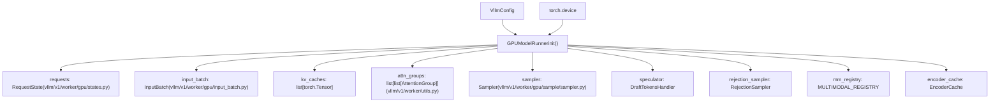
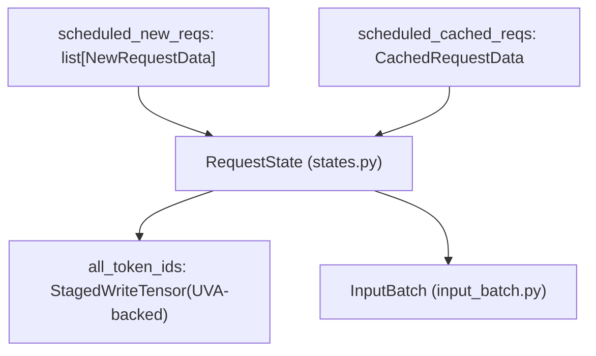

# GPUModelRunner

Relevant source files

-   [.buildkite/test\_areas/model\_runner\_v2.yaml](https://github.com/vllm-project/vllm/blob/7cc302dd/.buildkite/test_areas/model_runner_v2.yaml)
-   [tests/v1/ec\_connector/integration/test\_epd\_correctness.py](https://github.com/vllm-project/vllm/blob/7cc302dd/tests/v1/ec_connector/integration/test_epd_correctness.py)
-   [tests/v1/executor/test\_executor.py](https://github.com/vllm-project/vllm/blob/7cc302dd/tests/v1/executor/test_executor.py)
-   [tests/v1/kv\_connector/unit/test\_output\_aggregator.py](https://github.com/vllm-project/vllm/blob/7cc302dd/tests/v1/kv_connector/unit/test_output_aggregator.py)
-   [tests/v1/spec\_decode/test\_synthetic\_rejection\_sampler\_utils.py](https://github.com/vllm-project/vllm/blob/7cc302dd/tests/v1/spec_decode/test_synthetic_rejection_sampler_utils.py)
-   [tests/v1/worker/test\_gpu\_input\_batch.py](https://github.com/vllm-project/vllm/blob/7cc302dd/tests/v1/worker/test_gpu_input_batch.py)
-   [tests/v1/worker/test\_gpu\_model\_runner.py](https://github.com/vllm-project/vllm/blob/7cc302dd/tests/v1/worker/test_gpu_model_runner.py)
-   [vllm/v1/core/sched/output.py](https://github.com/vllm-project/vllm/blob/7cc302dd/vllm/v1/core/sched/output.py)
-   [vllm/v1/executor/abstract.py](https://github.com/vllm-project/vllm/blob/7cc302dd/vllm/v1/executor/abstract.py)
-   [vllm/v1/executor/multiproc\_executor.py](https://github.com/vllm-project/vllm/blob/7cc302dd/vllm/v1/executor/multiproc_executor.py)
-   [vllm/v1/executor/ray\_executor.py](https://github.com/vllm-project/vllm/blob/7cc302dd/vllm/v1/executor/ray_executor.py)
-   [vllm/v1/executor/ray\_utils.py](https://github.com/vllm-project/vllm/blob/7cc302dd/vllm/v1/executor/ray_utils.py)
-   [vllm/v1/executor/uniproc\_executor.py](https://github.com/vllm-project/vllm/blob/7cc302dd/vllm/v1/executor/uniproc_executor.py)
-   [vllm/v1/worker/block\_table.py](https://github.com/vllm-project/vllm/blob/7cc302dd/vllm/v1/worker/block_table.py)
-   [vllm/v1/worker/gpu/async\_utils.py](https://github.com/vllm-project/vllm/blob/7cc302dd/vllm/v1/worker/gpu/async_utils.py)
-   [vllm/v1/worker/gpu/attn\_utils.py](https://github.com/vllm-project/vllm/blob/7cc302dd/vllm/v1/worker/gpu/attn_utils.py)
-   [vllm/v1/worker/gpu/block\_table.py](https://github.com/vllm-project/vllm/blob/7cc302dd/vllm/v1/worker/gpu/block_table.py)
-   [vllm/v1/worker/gpu/buffer\_utils.py](https://github.com/vllm-project/vllm/blob/7cc302dd/vllm/v1/worker/gpu/buffer_utils.py)
-   [vllm/v1/worker/gpu/cudagraph\_utils.py](https://github.com/vllm-project/vllm/blob/7cc302dd/vllm/v1/worker/gpu/cudagraph_utils.py)
-   [vllm/v1/worker/gpu/dp\_utils.py](https://github.com/vllm-project/vllm/blob/7cc302dd/vllm/v1/worker/gpu/dp_utils.py)
-   [vllm/v1/worker/gpu/input\_batch.py](https://github.com/vllm-project/vllm/blob/7cc302dd/vllm/v1/worker/gpu/input_batch.py)
-   [vllm/v1/worker/gpu/mm/\_\_init\_\_.py](https://github.com/vllm-project/vllm/blob/7cc302dd/vllm/v1/worker/gpu/mm/__init__.py)
-   [vllm/v1/worker/gpu/mm/encoder\_cache.py](https://github.com/vllm-project/vllm/blob/7cc302dd/vllm/v1/worker/gpu/mm/encoder_cache.py)
-   [vllm/v1/worker/gpu/mm/encoder\_runner.py](https://github.com/vllm-project/vllm/blob/7cc302dd/vllm/v1/worker/gpu/mm/encoder_runner.py)
-   [vllm/v1/worker/gpu/mm/rope.py](https://github.com/vllm-project/vllm/blob/7cc302dd/vllm/v1/worker/gpu/mm/rope.py)
-   [vllm/v1/worker/gpu/model\_runner.py](https://github.com/vllm-project/vllm/blob/7cc302dd/vllm/v1/worker/gpu/model_runner.py)
-   [vllm/v1/worker/gpu/sample/\_\_init\_\_.py](https://github.com/vllm-project/vllm/blob/7cc302dd/vllm/v1/worker/gpu/sample/__init__.py)
-   [vllm/v1/worker/gpu/sample/bad\_words.py](https://github.com/vllm-project/vllm/blob/7cc302dd/vllm/v1/worker/gpu/sample/bad_words.py)
-   [vllm/v1/worker/gpu/sample/gumbel.py](https://github.com/vllm-project/vllm/blob/7cc302dd/vllm/v1/worker/gpu/sample/gumbel.py)
-   [vllm/v1/worker/gpu/sample/logit\_bias.py](https://github.com/vllm-project/vllm/blob/7cc302dd/vllm/v1/worker/gpu/sample/logit_bias.py)
-   [vllm/v1/worker/gpu/sample/logprob.py](https://github.com/vllm-project/vllm/blob/7cc302dd/vllm/v1/worker/gpu/sample/logprob.py)
-   [vllm/v1/worker/gpu/sample/min\_p.py](https://github.com/vllm-project/vllm/blob/7cc302dd/vllm/v1/worker/gpu/sample/min_p.py)
-   [vllm/v1/worker/gpu/sample/output.py](https://github.com/vllm-project/vllm/blob/7cc302dd/vllm/v1/worker/gpu/sample/output.py)
-   [vllm/v1/worker/gpu/sample/penalties.py](https://github.com/vllm-project/vllm/blob/7cc302dd/vllm/v1/worker/gpu/sample/penalties.py)
-   [vllm/v1/worker/gpu/sample/prompt\_logprob.py](https://github.com/vllm-project/vllm/blob/7cc302dd/vllm/v1/worker/gpu/sample/prompt_logprob.py)
-   [vllm/v1/worker/gpu/sample/sampler.py](https://github.com/vllm-project/vllm/blob/7cc302dd/vllm/v1/worker/gpu/sample/sampler.py)
-   [vllm/v1/worker/gpu/sample/states.py](https://github.com/vllm-project/vllm/blob/7cc302dd/vllm/v1/worker/gpu/sample/states.py)
-   [vllm/v1/worker/gpu/spec\_decode/eagle/cudagraph.py](https://github.com/vllm-project/vllm/blob/7cc302dd/vllm/v1/worker/gpu/spec_decode/eagle/cudagraph.py)
-   [vllm/v1/worker/gpu/spec\_decode/eagle/speculator.py](https://github.com/vllm-project/vllm/blob/7cc302dd/vllm/v1/worker/gpu/spec_decode/eagle/speculator.py)
-   [vllm/v1/worker/gpu/spec\_decode/rejection\_sampler.py](https://github.com/vllm-project/vllm/blob/7cc302dd/vllm/v1/worker/gpu/spec_decode/rejection_sampler.py)
-   [vllm/v1/worker/gpu/spec\_decode/synthetic\_rejection\_sampler\_utils.py](https://github.com/vllm-project/vllm/blob/7cc302dd/vllm/v1/worker/gpu/spec_decode/synthetic_rejection_sampler_utils.py)
-   [vllm/v1/worker/gpu/states.py](https://github.com/vllm-project/vllm/blob/7cc302dd/vllm/v1/worker/gpu/states.py)
-   [vllm/v1/worker/gpu/structured\_outputs.py](https://github.com/vllm-project/vllm/blob/7cc302dd/vllm/v1/worker/gpu/structured_outputs.py)
-   [vllm/v1/worker/gpu\_input\_batch.py](https://github.com/vllm-project/vllm/blob/7cc302dd/vllm/v1/worker/gpu_input_batch.py)
-   [vllm/v1/worker/gpu\_model\_runner.py](https://github.com/vllm-project/vllm/blob/7cc302dd/vllm/v1/worker/gpu_model_runner.py)
-   [vllm/v1/worker/gpu\_worker.py](https://github.com/vllm-project/vllm/blob/7cc302dd/vllm/v1/worker/gpu_worker.py)
-   [vllm/v1/worker/utils.py](https://github.com/vllm-project/vllm/blob/7cc302dd/vllm/v1/worker/utils.py)
-   [vllm/v1/worker/worker\_base.py](https://github.com/vllm-project/vllm/blob/7cc302dd/vllm/v1/worker/worker_base.py)

## Overview

`GPUModelRunner` is the central coordinator for model execution on GPU devices in vLLM's v1 engine. It orchestrates the forward pass of language models, manages request state, coordinates KV cache allocation, and integrates with the sampling subsystem to generate tokens. This component bridges the scheduling layer (which decides what to execute) with the actual model execution, handling all GPU-specific operations including attention metadata preparation, batch assembly, and token sampling.

vLLM provides two implementations: the stable `gpu_model_runner` and the experimental Model Runner V2 (located in `vllm/v1/worker/gpu/`). The V2 architecture is designed for modularity, separating concerns like state management, input buffering, and speculative decoding into specialized classes.

**Scope:** This page covers the `GPUModelRunner` class and its role in coordinating model execution. For information about:

-   Request scheduling and resource allocation, see [3.3 Scheduler and Resource Allocation](https://github.com/vllm-project/vllm/blob/7cc302dd/3.3 Scheduler and Resource Allocation)
-   KV cache memory management, see [3.4 KV Cache Management and Prefix Caching](https://github.com/vllm-project/vllm/blob/7cc302dd/3.4 KV Cache Management and Prefix Caching)
-   Sampling strategies and token selection, see [4.4 Sampling and Token Generation](https://github.com/vllm-project/vllm/blob/7cc302dd/4.4 Sampling and Token Generation)
-   Worker initialization and device management, see [4.2 Worker and Executor Architecture](https://github.com/vllm-project/vllm/blob/7cc302dd/4.2 Worker and Executor Architecture)
-   Detailed batch state management, see [4.3 InputBatch and Request State Management](https://github.com/vllm-project/vllm/blob/7cc302dd/4.3 InputBatch and Request State Management)

Sources: [vllm/v1/worker/gpu\_model\_runner.py102-173](https://github.com/vllm-project/vllm/blob/7cc302dd/vllm/v1/worker/gpu_model_runner.py#L102-L173) [vllm/v1/worker/gpu/model\_runner.py103-173](https://github.com/vllm-project/vllm/blob/7cc302dd/vllm/v1/worker/gpu/model_runner.py#L103-L173)

## Architecture and Core Components

`GPUModelRunner` serves as the execution coordinator in vLLM's GPU-based inference pipeline. It is initialized with a `VllmConfig` and maintains state for all active requests, manages the input batch, and coordinates with multiple subsystems.

### Component Relationship Diagram

This diagram bridges the conceptual "Execution Coordinator" to specific code entities in the `vllm/v1/worker/gpu/` directory.

Sources: [vllm/v1/worker/gpu/model\_runner.py103-216](https://github.com/vllm-project/vllm/blob/7cc302dd/vllm/v1/worker/gpu/model_runner.py#L103-L216) [vllm/v1/worker/gpu/states.py9-77](https://github.com/vllm-project/vllm/blob/7cc302dd/vllm/v1/worker/gpu/states.py#L9-L77) [vllm/v1/worker/gpu/input\_batch.py36-80](https://github.com/vllm-project/vllm/blob/7cc302dd/vllm/v1/worker/gpu/input_batch.py#L36-L80)

### Key Data Structures

The runner maintains several critical data structures to track the lifecycle of requests:

| Data Structure | Type | Purpose |
| --- | --- | --- |
| `requests` | `RequestState` | Manages per-request metadata, `all_token_ids`, and `num_computed_tokens` using UVA-backed tensors to save GPU memory. |
| `input_batch` | `InputBatch` | Encapsulates the current iteration's GPU tensors like `input_ids`, `positions`, and `query_start_loc`. |
| `kv_caches` | `list[torch.Tensor]` | Physical memory buffers allocated for KV cache storage across model layers. |
| `attn_groups` | `list[list[AttentionGroup]]` | Groups of layers sharing the same attention backend and metadata builders. |
| `sampler` | `Sampler` | Orchestrates logit processing and token selection. |

Sources: [vllm/v1/worker/gpu/model\_runner.py103-173](https://github.com/vllm-project/vllm/blob/7cc302dd/vllm/v1/worker/gpu/model_runner.py#L103-L173) [vllm/v1/worker/gpu/states.py9-77](https://github.com/vllm-project/vllm/blob/7cc302dd/vllm/v1/worker/gpu/states.py#L9-L77) [vllm/v1/worker/gpu/input\_batch.py36-80](https://github.com/vllm-project/vllm/blob/7cc302dd/vllm/v1/worker/gpu/input_batch.py#L36-L80)

## Request Lifecycle and State Management

`GPUModelRunner` handles the synchronization between the CPU scheduler and GPU execution state. In Model Runner V2, `RequestState` uses `StagedWriteTensor` and `UvaBackedTensor` to efficiently manage large token buffers (like `all_token_ids`) without exhausting GPU VRAM.

### Request State Mapping

The following diagram maps how `SchedulerOutput` from the core engine is transformed into GPU-resident state.

Sources: [vllm/v1/worker/gpu/states.py30-53](https://github.com/vllm-project/vllm/blob/7cc302dd/vllm/v1/worker/gpu/states.py#L30-L53) [vllm/v1/worker/gpu/model\_runner.py343-424](https://github.com/vllm-project/vllm/blob/7cc302dd/vllm/v1/worker/gpu/model_runner.py#L343-L424) [vllm/v1/core/sched/output.py179-195](https://github.com/vllm-project/vllm/blob/7cc302dd/vllm/v1/core/sched/output.py#L179-L195)

### State Update Process

The `_update_states()` method in `GPUModelRunner` processes the `SchedulerOutput` in several steps:

1.  **Remove Finished Requests**: Calls `remove_request` to free indices in the `RequestState` pool.
2.  **Add New Requests**: Initializes state for requests scheduled for the first time.
3.  **Update Cached Requests**: Updates token counts and block IDs for existing requests.
4.  **Apply Staged Writes**: Synchronizes CPU-side updates to UVA/GPU memory in a single batch.

Sources: [vllm/v1/worker/gpu/model\_runner.py343-424](https://github.com/vllm-project/vllm/blob/7cc302dd/vllm/v1/worker/gpu/model_runner.py#L343-L424) [vllm/v1/worker/gpu/states.py105-110](https://github.com/vllm-project/vllm/blob/7cc302dd/vllm/v1/worker/gpu/states.py#L105-L110)

## Model Execution Pipeline

The execution pipeline transforms input data into generated tokens through a structured sequence of metadata preparation and model calls.

### Execution Sequence

> **[Mermaid sequence]**
> *(图表结构无法解析)*

Sources: [vllm/v1/worker/gpu/model\_runner.py228-341](https://github.com/vllm-project/vllm/blob/7cc302dd/vllm/v1/worker/gpu/model_runner.py#L228-L341) [vllm/v1/worker/gpu/input\_batch.py186-207](https://github.com/vllm-project/vllm/blob/7cc302dd/vllm/v1/worker/gpu/input_batch.py#L186-L207) [vllm/v1/executor/multiproc\_executor.py61](https://github.com/vllm-project/vllm/blob/7cc302dd/vllm/v1/executor/multiproc_executor.py#L61-L61)

### Input Preparation Kernels

To avoid expensive CPU-GPU copies, vLLM uses Triton kernels to prepare model inputs. For example, `prepare_prefill_inputs` copies token IDs directly from the UVA-backed `all_token_ids` buffer into the GPU `input_ids` buffer used for the forward pass.

Sources: [vllm/v1/worker/gpu/input\_batch.py149-185](https://github.com/vllm-project/vllm/blob/7cc302dd/vllm/v1/worker/gpu/input_batch.py#L149-L185)

## Attention and KV Cache Integration

The runner manages multiple `AttentionGroup` objects, which categorize model layers by their attention requirements (e.g., self-attention vs. cross-attention).

### Attention Metadata Preparation

`_prepare_attn_metadata` orchestrates the creation of backend-specific metadata (e.g., for FlashAttention or FlashInfer). It utilizes `AttentionMetadataBuilder` to construct the necessary tensors for block-based attention.

Sources: [vllm/v1/worker/gpu/model\_runner.py461-512](https://github.com/vllm-project/vllm/blob/7cc302dd/vllm/v1/worker/gpu/model_runner.py#L461-L512) [vllm/v1/worker/gpu/attn\_utils.py32-90](https://github.com/vllm-project/vllm/blob/7cc302dd/vllm/v1/worker/gpu/attn_utils.py#L32-L90)

### KV Cache Allocation

The physical KV cache is allocated as a set of raw tensors, which are then reshaped and permuted according to the requirements of the selected `AttentionBackend`.

Sources: [vllm/v1/worker/gpu/attn\_utils.py93-170](https://github.com/vllm-project/vllm/blob/7cc302dd/vllm/v1/worker/gpu/attn_utils.py#L93-L170) [vllm/v1/worker/utils.py80-188](https://github.com/vllm-project/vllm/blob/7cc302dd/vllm/v1/worker/utils.py#L80-L188)

## CUDA Graph Management

To minimize kernel launch overhead for small batch sizes, `GPUModelRunner` uses `CudaGraphManager`.

1.  **Capture**: The runner records the execution of the model forward pass for specific batch sizes (e.g., powers of 2).
2.  **Replay**: At runtime, if the current batch size matches a captured graph, the runner updates the fixed input buffers and triggers a graph replay instead of a standard eager execution.

Sources: [vllm/v1/worker/gpu/cudagraph\_utils.py80-183](https://github.com/vllm-project/vllm/blob/7cc302dd/vllm/v1/worker/gpu/cudagraph_utils.py#L80-L183) [vllm/v1/worker/gpu/model\_runner.py228-341](https://github.com/vllm-project/vllm/blob/7cc302dd/vllm/v1/worker/gpu/model_runner.py#L228-L341)

## Performance Optimizations

| Optimization | Implementation | Source |
| --- | --- | --- |
| **UVA Buffers** | `RequestState` uses Unified Virtual Addressing for token IDs to save GPU memory. | [vllm/v1/worker/gpu/states.py33-38](https://github.com/vllm-project/vllm/blob/7cc302dd/vllm/v1/worker/gpu/states.py#L33-L38) |
| **Triton Zeroing** | `KVBlockZeroer` uses a Triton kernel to efficiently clear newly allocated KV blocks. | [vllm/v1/worker/utils.py80-188](https://github.com/vllm-project/vllm/blob/7cc302dd/vllm/v1/worker/utils.py#L80-L188) |
| **Async Scheduling** | Logits are stored in `AsyncOutput`, allowing the engine to overlap sampling with the next iteration's scheduling. | [vllm/v1/worker/gpu/model\_runner.py321-325](https://github.com/vllm-project/vllm/blob/7cc302dd/vllm/v1/worker/gpu/model_runner.py#L321-L325) |
| **Staged Writes** | CPU-to-GPU updates are batched and applied once per iteration. | [vllm/v1/worker/gpu/states.py105-110](https://github.com/vllm-project/vllm/blob/7cc302dd/vllm/v1/worker/gpu/states.py#L105-L110) |

Sources: [vllm/v1/worker/gpu/states.py33-110](https://github.com/vllm-project/vllm/blob/7cc302dd/vllm/v1/worker/gpu/states.py#L33-L110) [vllm/v1/worker/utils.py80-188](https://github.com/vllm-project/vllm/blob/7cc302dd/vllm/v1/worker/utils.py#L80-L188) [vllm/v1/worker/gpu/model\_runner.py321-325](https://github.com/vllm-project/vllm/blob/7cc302dd/vllm/v1/worker/gpu/model_runner.py#L321-L325)
